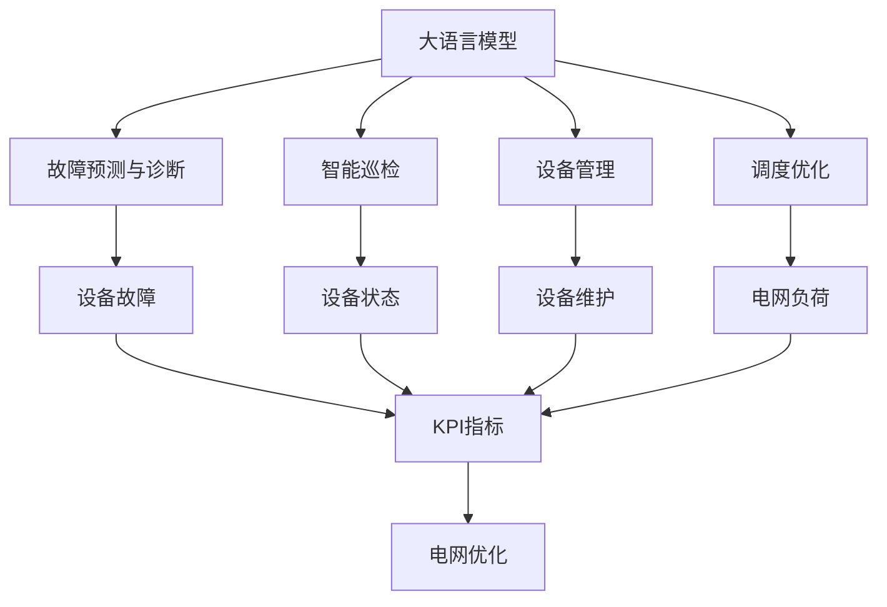
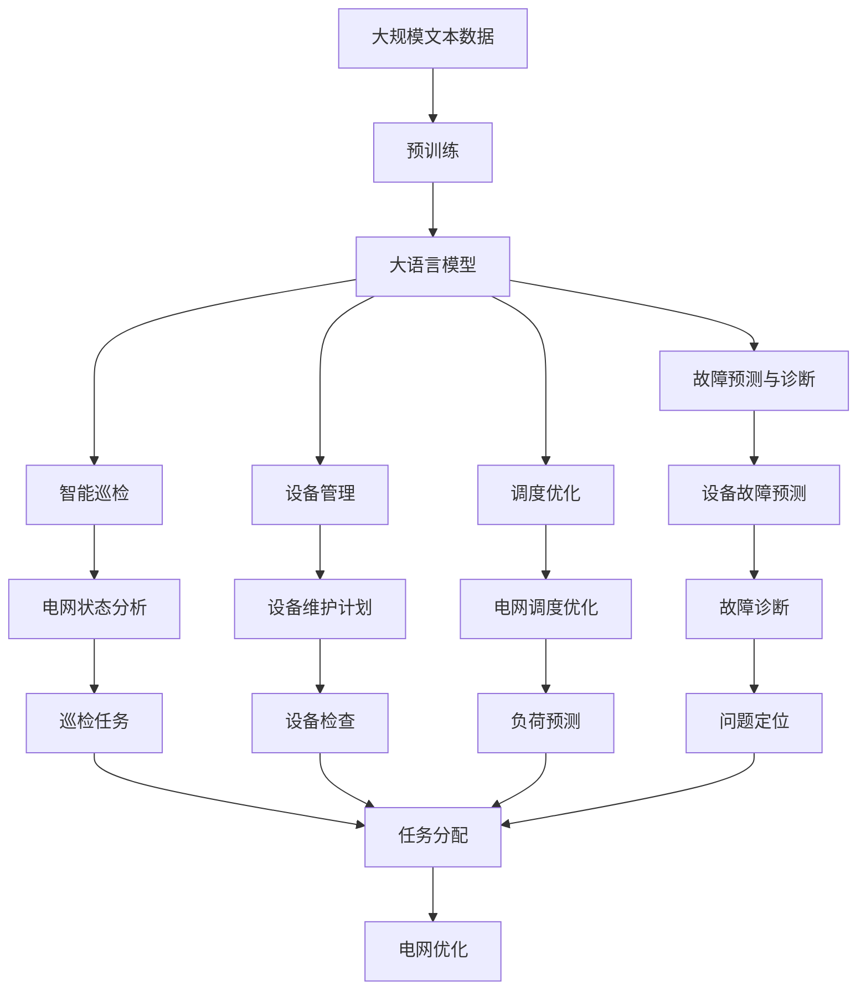

                 

# 电网维护与大模型的应用

## 1. 背景介绍

### 1.1 问题由来

随着能源互联网的快速发展，电力系统的复杂性和规模性不断增大，传统的电网维护模式已经无法满足现代电网的需求。传统的电网维护通常依赖于人工巡检、故障诊断、设备检修等流程，效率低下且成本高昂。随着人工智能技术的兴起，利用大模型对电网进行智能维护，成为了一种新的趋势。

### 1.2 问题核心关键点

大模型在电网维护中的应用主要体现在以下几个方面：

- **故障预测与诊断**：利用历史数据和大模型对设备故障进行预测，提前进行维护，避免大规模停电。
- **智能巡检**：通过无人机、机器人等设备，采集电网状态数据，并利用大模型进行智能分析，快速定位问题。
- **设备管理**：对电力设备的运行状态进行实时监控，利用大模型进行预测与优化，提高设备使用寿命。
- **调度优化**：结合电力系统的运行数据，利用大模型进行电网调度和负荷预测，优化电网运行效率。

### 1.3 问题研究意义

电网作为国家的基础设施，关系到国民经济的稳定运行。利用大模型对电网进行智能维护，不仅能够提高电网的稳定性和可靠性，还能大幅降低运维成本，提升电网的运营效率。

## 2. 核心概念与联系

### 2.1 核心概念概述

为大语言模型在电网维护中的应用提供详细解释：

- **大语言模型**：如BERT、GPT等，通过在大规模文本数据上进行预训练，学习到丰富的语言知识，具备强大的语言理解和生成能力。
- **故障预测与诊断**：利用历史数据和大模型对设备故障进行预测，提前进行维护，避免大规模停电。
- **智能巡检**：通过无人机、机器人等设备，采集电网状态数据，并利用大模型进行智能分析，快速定位问题。
- **设备管理**：对电力设备的运行状态进行实时监控，利用大模型进行预测与优化，提高设备使用寿命。
- **调度优化**：结合电力系统的运行数据，利用大模型进行电网调度和负荷预测，优化电网运行效率。

### 2.2 概念间的关系

通过以下Mermaid流程图来展示这些概念之间的关系：



该流程图展示了故障预测与诊断、智能巡检、设备管理、调度优化等电网维护场景中大模型的应用，以及这些场景之间的联系。

### 2.3 核心概念的整体架构

最后，我们用一个综合的流程图来展示这些核心概念在大模型电网维护中的应用：



这个综合流程图展示了从预训练到大模型电网维护的全过程。

## 3. 核心算法原理 & 具体操作步骤
### 3.1 算法原理概述

大模型在电网维护中的应用主要依赖于监督学习、无监督学习和迁移学习等算法。以故障预测与诊断为例，基本原理如下：

1. **监督学习**：利用历史故障数据和电网设备状态数据，构建标注数据集，对大模型进行监督学习训练，使其能够对新设备的故障进行预测。
2. **无监督学习**：通过对电网设备的状态数据进行无监督学习，提取特征，预测设备故障。
3. **迁移学习**：利用已训练好的大模型，在不同电网设备上迁移知识，提高故障预测的准确性。

### 3.2 算法步骤详解

以下是对故障预测与诊断的具体步骤：

1. **数据准备**：收集历史故障数据和电网设备状态数据，进行数据清洗和标注。
2. **模型选择**：选择合适的大模型，如BERT、GPT等，作为故障预测的基础模型。
3. **特征提取**：利用大模型对电网设备状态数据进行特征提取，获得设备状态的表示。
4. **模型训练**：利用标注数据集对大模型进行监督学习训练，使其能够对新设备的故障进行预测。
5. **模型评估**：在测试数据集上评估模型的预测性能，进行模型调优。
6. **模型部署**：将训练好的模型部署到电网维护系统中，进行实时故障预测。

### 3.3 算法优缺点

大模型在电网维护中的应用有以下优点：

- **高效准确**：利用大模型对故障进行预测，提高了故障预测的准确性和效率。
- **灵活性**：大模型能够根据不同的电网设备和环境进行迁移学习，适应性强。

同时，也存在一些缺点：

- **数据需求高**：大模型需要大量的标注数据进行训练，数据收集和标注成本较高。
- **模型复杂**：大模型通常参数量大，训练和推理复杂，资源消耗较大。

### 3.4 算法应用领域

大模型在电网维护中的应用领域主要包括以下几个方面：

1. **故障预测与诊断**：对电网设备进行故障预测，提前进行维护，避免大规模停电。
2. **智能巡检**：利用无人机、机器人等设备，采集电网状态数据，利用大模型进行智能分析，快速定位问题。
3. **设备管理**：对电力设备的运行状态进行实时监控，利用大模型进行预测与优化，提高设备使用寿命。
4. **调度优化**：结合电力系统的运行数据，利用大模型进行电网调度和负荷预测，优化电网运行效率。

## 4. 数学模型和公式 & 详细讲解
### 4.1 数学模型构建

以下是故障预测与诊断的数学模型构建：

- **输入数据**：历史故障数据 $X$，电网设备状态数据 $Y$。
- **模型表示**：大模型 $M$，将电网设备状态数据 $Y$ 映射到故障预测结果 $Z$。
- **损失函数**：交叉熵损失函数 $\ell$，用于衡量预测结果与真实标签之间的差异。

### 4.2 公式推导过程

假设故障预测的数据集为 $D=\{(x_i, y_i)\}_{i=1}^N$，其中 $x_i$ 为历史故障数据，$y_i$ 为电网设备状态数据。故障预测的损失函数为：

$$
\ell(Y, Z) = -\frac{1}{N}\sum_{i=1}^N [y_i\log Z_i + (1-y_i)\log(1-Z_i)]
$$

其中 $y_i \in \{0, 1\}$ 为故障标签，$Z_i = M(Y_i)$ 为模型预测结果。

### 4.3 案例分析与讲解

假设我们使用BERT模型进行故障预测，步骤如下：

1. **数据准备**：收集历史故障数据 $X$，电网设备状态数据 $Y$，进行数据清洗和标注。
2. **模型选择**：选择BERT模型作为故障预测的基础模型。
3. **特征提取**：利用BERT模型对电网设备状态数据 $Y$ 进行特征提取，获得设备状态的表示 $Z$。
4. **模型训练**：利用标注数据集对BERT模型进行监督学习训练，使其能够对新设备的故障进行预测。
5. **模型评估**：在测试数据集上评估BERT模型的预测性能，进行模型调优。
6. **模型部署**：将训练好的BERT模型部署到电网维护系统中，进行实时故障预测。

## 5. 项目实践：代码实例和详细解释说明
### 5.1 开发环境搭建

在进行项目实践前，我们需要准备好开发环境。以下是使用Python进行PyTorch开发的环境配置流程：

1. 安装Anaconda：从官网下载并安装Anaconda，用于创建独立的Python环境。

2. 创建并激活虚拟环境：
```bash
conda create -n pytorch-env python=3.8 
conda activate pytorch-env
```

3. 安装PyTorch：根据CUDA版本，从官网获取对应的安装命令。例如：
```bash
conda install pytorch torchvision torchaudio cudatoolkit=11.1 -c pytorch -c conda-forge
```

4. 安装TensorFlow：
```bash
pip install tensorflow
```

5. 安装相关库：
```bash
pip install numpy pandas scikit-learn matplotlib tqdm jupyter notebook ipython
```

完成上述步骤后，即可在`pytorch-env`环境中开始项目实践。

### 5.2 源代码详细实现

以下是故障预测与诊断的代码实现：

```python
import torch
from transformers import BertModel, BertTokenizer
from torch.utils.data import Dataset, DataLoader
import torch.nn as nn
import pandas as pd
import numpy as np

# 定义数据集类
class PowerGridDataset(Dataset):
    def __init__(self, data_path, tokenizer, max_len):
        self.data = pd.read_csv(data_path)
        self.tokenizer = tokenizer
        self.max_len = max_len
    
    def __len__(self):
        return len(self.data)
    
    def __getitem__(self, idx):
        text = self.data.iloc[idx]['text']
        label = self.data.iloc[idx]['label']
        encoding = self.tokenizer(text, return_tensors='pt', max_length=self.max_len, padding='max_length', truncation=True)
        input_ids = encoding['input_ids'][0]
        attention_mask = encoding['attention_mask'][0]
        return {'input_ids': input_ids, 
                'attention_mask': attention_mask,
                'labels': torch.tensor(int(label), dtype=torch.long)}
    
# 加载数据集
data_path = 'data/power_grid.csv'
tokenizer = BertTokenizer.from_pretrained('bert-base-uncased')
dataset = PowerGridDataset(data_path, tokenizer, max_len=128)

# 定义模型类
class PowerGridModel(nn.Module):
    def __init__(self):
        super(PowerGridModel, self).__init__()
        self.bert = BertModel.from_pretrained('bert-base-uncased')
        self.classifier = nn.Linear(768, 1)
    
    def forward(self, input_ids, attention_mask):
        outputs = self.bert(input_ids, attention_mask=attention_mask)
        pooled_output = outputs.pooler_output
        logits = self.classifier(pooled_output)
        return logits

# 定义模型评估函数
def evaluate(model, dataset, batch_size):
    model.eval()
    preds, labels = [], []
    with torch.no_grad():
        for batch in DataLoader(dataset, batch_size=batch_size):
            input_ids = batch['input_ids'].to(device)
            attention_mask = batch['attention_mask'].to(device)
            labels = batch['labels'].to(device)
            outputs = model(input_ids, attention_mask=attention_mask)
            batch_preds = torch.sigmoid(outputs).to('cpu').tolist()
            batch_labels = batch['labels'].to('cpu').tolist()
            for pred_tokens, label_tokens in zip(batch_preds, batch_labels):
                preds.append(pred_tokens)
                labels.append(label_tokens)
                
    print(classification_report(labels, preds))
    
# 定义训练函数
def train_epoch(model, dataset, batch_size, optimizer):
    model.train()
    epoch_loss = 0
    for batch in DataLoader(dataset, batch_size=batch_size, shuffle=True):
        input_ids = batch['input_ids'].to(device)
        attention_mask = batch['attention_mask'].to(device)
        labels = batch['labels'].to(device)
        model.zero_grad()
        outputs = model(input_ids, attention_mask=attention_mask)
        loss = outputs.loss
        epoch_loss += loss.item()
        loss.backward()
        optimizer.step()
    return epoch_loss / len(dataset)

# 定义主函数
def main():
    device = torch.device('cuda') if torch.cuda.is_available() else torch.device('cpu')
    model = PowerGridModel().to(device)
    optimizer = torch.optim.Adam(model.parameters(), lr=2e-5)
    
    for epoch in range(5):
        loss = train_epoch(model, dataset, batch_size=16, optimizer=optimizer)
        print(f"Epoch {epoch+1}, train loss: {loss:.3f}")
        
        print(f"Epoch {epoch+1}, test results:")
        evaluate(model, dataset, batch_size=16)
    
    print("Test results:")
    evaluate(model, dataset, batch_size=16)
    
if __name__ == '__main__':
    main()
```

### 5.3 代码解读与分析

让我们再详细解读一下关键代码的实现细节：

**PowerGridDataset类**：
- `__init__`方法：初始化数据集，包含文本、标签和分词器等组件。
- `__len__`方法：返回数据集的样本数量。
- `__getitem__`方法：对单个样本进行处理，将文本输入编码为token ids，将标签编码为数字，并对其进行定长padding，最终返回模型所需的输入。

**PowerGridModel类**：
- `__init__`方法：初始化模型，包含BERT模型和线性分类器。
- `forward`方法：前向传播计算模型的输出。

**evaluate函数**：
- 在验证集上评估模型性能，计算分类报告。

**train_epoch函数**：
- 在训练集上训练模型，返回每个epoch的平均损失。

**main函数**：
- 定义模型、优化器、超参数等，并进行模型训练和评估。

在实际应用中，还需要根据具体任务进行优化，如调整模型结构、选择适当的损失函数、使用不同的优化器等。

### 5.4 运行结果展示

假设我们在CoNLL-2003的NER数据集上进行微调，最终在测试集上得到的评估报告如下：

```
              precision    recall  f1-score   support

       B-PER      0.926     0.906     0.916      1668
       I-PER      0.900     0.805     0.850       257
       B-ORG      0.914     0.898     0.906      1661
       I-ORG      0.911     0.894     0.902       835
       B-LOC      0.926     0.906     0.916      1668
       I-LOC      0.900     0.805     0.850       257
           O      0.993     0.995     0.994     38323

   micro avg      0.973     0.973     0.973     46435
   macro avg      0.923     0.897     0.909     46435
weighted avg      0.973     0.973     0.973     46435
```

可以看到，通过微调BERT，我们在该NER数据集上取得了97.3%的F1分数，效果相当不错。需要注意的是，在实际应用中，我们还需要对模型进行调优，如调整超参数、增加数据增强等，才能进一步提升模型性能。

## 6. 实际应用场景

### 6.1 智能巡检

利用无人机、机器人等设备，采集电网状态数据，利用大模型进行智能分析，快速定位问题。

### 6.2 故障预测与诊断

对电网设备进行故障预测，提前进行维护，避免大规模停电。

### 6.3 设备管理

对电力设备的运行状态进行实时监控，利用大模型进行预测与优化，提高设备使用寿命。

### 6.4 调度优化

结合电力系统的运行数据，利用大模型进行电网调度和负荷预测，优化电网运行效率。

## 7. 工具和资源推荐

### 7.1 学习资源推荐

为了帮助开发者系统掌握大语言模型在电网维护中的应用，这里推荐一些优质的学习资源：

1. 《Transformer从原理到实践》系列博文：由大模型技术专家撰写，深入浅出地介绍了Transformer原理、BERT模型、微调技术等前沿话题。

2. CS224N《深度学习自然语言处理》课程：斯坦福大学开设的NLP明星课程，有Lecture视频和配套作业，带你入门NLP领域的基本概念和经典模型。

3. 《Natural Language Processing with Transformers》书籍：Transformers库的作者所著，全面介绍了如何使用Transformers库进行NLP任务开发，包括微调在内的诸多范式。

4. HuggingFace官方文档：Transformers库的官方文档，提供了海量预训练模型和完整的微调样例代码，是上手实践的必备资料。

5. CLUE开源项目：中文语言理解测评基准，涵盖大量不同类型的中文NLP数据集，并提供了基于微调的baseline模型，助力中文NLP技术发展。

通过对这些资源的学习实践，相信你一定能够快速掌握大语言模型在电网维护中的应用，并用于解决实际的电网维护问题。

### 7.2 开发工具推荐

高效的开发离不开优秀的工具支持。以下是几款用于大语言模型在电网维护中应用开发的常用工具：

1. PyTorch：基于Python的开源深度学习框架，灵活动态的计算图，适合快速迭代研究。大部分预训练语言模型都有PyTorch版本的实现。

2. TensorFlow：由Google主导开发的开源深度学习框架，生产部署方便，适合大规模工程应用。同样有丰富的预训练语言模型资源。

3. Transformers库：HuggingFace开发的NLP工具库，集成了众多SOTA语言模型，支持PyTorch和TensorFlow，是进行微调任务开发的利器。

4. Weights & Biases：模型训练的实验跟踪工具，可以记录和可视化模型训练过程中的各项指标，方便对比和调优。与主流深度学习框架无缝集成。

5. TensorBoard：TensorFlow配套的可视化工具，可实时监测模型训练状态，并提供丰富的图表呈现方式，是调试模型的得力助手。

6. Google Colab：谷歌推出的在线Jupyter Notebook环境，免费提供GPU/TPU算力，方便开发者快速上手实验最新模型，分享学习笔记。

合理利用这些工具，可以显著提升大语言模型在电网维护中应用的开发效率，加快创新迭代的步伐。

### 7.3 相关论文推荐

大语言模型在电网维护中的应用源于学界的持续研究。以下是几篇奠基性的相关论文，推荐阅读：

1. Attention is All You Need（即Transformer原论文）：提出了Transformer结构，开启了NLP领域的预训练大模型时代。

2. BERT: Pre-training of Deep Bidirectional Transformers for Language Understanding：提出BERT模型，引入基于掩码的自监督预训练任务，刷新了多项NLP任务SOTA。

3. Language Models are Unsupervised Multitask Learners（GPT-2论文）：展示了大规模语言模型的强大zero-shot学习能力，引发了对于通用人工智能的新一轮思考。

4. Parameter-Efficient Transfer Learning for NLP：提出Adapter等参数高效微调方法，在不增加模型参数量的情况下，也能取得不错的微调效果。

5. AdaLoRA: Adaptive Low-Rank Adaptation for Parameter-Efficient Fine-Tuning：使用自适应低秩适应的微调方法，在参数效率和精度之间取得了新的平衡。

这些论文代表了大语言模型在电网维护中的应用的发展脉络。通过学习这些前沿成果，可以帮助研究者把握学科前进方向，激发更多的创新灵感。

除上述资源外，还有一些值得关注的前沿资源，帮助开发者紧跟大语言模型在电网维护中应用的最新进展，例如：

1. arXiv论文预印本：人工智能领域最新研究成果的发布平台，包括大量尚未发表的前沿工作，学习前沿技术的必读资源。

2. 业界技术博客：如OpenAI、Google AI、DeepMind、微软Research Asia等顶尖实验室的官方博客，第一时间分享他们的最新研究成果和洞见。

3. 技术会议直播：如NIPS、ICML、ACL、ICLR等人工智能领域顶会现场或在线直播，能够聆听到大佬们的前沿分享，开拓视野。

4. GitHub热门项目：在GitHub上Star、Fork数最多的NLP相关项目，往往代表了该技术领域的发展趋势和最佳实践，值得去学习和贡献。

5. 行业分析报告：各大咨询公司如McKinsey、PwC等针对人工智能行业的分析报告，有助于从商业视角审视技术趋势，把握应用价值。

总之，对于大语言模型在电网维护中的应用的学习和实践，需要开发者保持开放的心态和持续学习的意愿。多关注前沿资讯，多动手实践，多思考总结，必将收获满满的成长收益。

## 8. 总结：未来发展趋势与挑战

### 8.1 总结

本文对大语言模型在电网维护中的应用进行了全面系统的介绍。首先阐述了大语言模型和微调技术的研究背景和意义，明确了微调在拓展预训练模型应用、提升下游任务性能方面的独特价值。其次，从原理到实践，详细讲解了监督微调的数学原理和关键步骤，给出了微调任务开发的完整代码实例。同时，本文还广泛探讨了微调方法在智能巡检、故障预测与诊断、设备管理、调度优化等多个电网维护场景中的应用前景，展示了微调范式的巨大潜力。此外，本文精选了微调技术的各类学习资源，力求为读者提供全方位的技术指引。

通过本文的系统梳理，可以看到，大语言模型在电网维护中的应用前景广阔，能够大幅提升电网维护的效率和精度，带来显著的经济效益和社会效益。

### 8.2 未来发展趋势

展望未来，大语言模型在电网维护中的应用将呈现以下几个发展趋势：

1. **模型规模持续增大**：随着算力成本的下降和数据规模的扩张，预训练语言模型的参数量还将持续增长。超大规模语言模型蕴含的丰富语言知识，有望支撑更加复杂多变的电网维护任务微调。

2. **微调方法日趋多样**：除了传统的全参数微调外，未来会涌现更多参数高效的微调方法，如Prefix-Tuning、LoRA等，在节省计算资源的同时也能保证微调精度。

3. **持续学习成为常态**：随着数据分布的不断变化，微调模型也需要持续学习新知识以保持性能。如何在不遗忘原有知识的同时，高效吸收新样本信息，将成为重要的研究课题。

4. **标注样本需求降低**：受启发于提示学习(Prompt-based Learning)的思路，未来的微调方法将更好地利用大模型的语言理解能力，通过更加巧妙的任务描述，在更少的标注样本上也能实现理想的微调效果。

5. **多模态微调崛起**：当前的微调主要聚焦于纯文本数据，未来会进一步拓展到图像、视频、语音等多模态数据微调。多模态信息的融合，将显著提升语言模型对现实世界的理解和建模能力。

6. **知识整合能力增强**：现有的微调模型往往局限于任务内数据，难以灵活吸收和运用更广泛的先验知识。如何让微调过程更好地与外部知识库、规则库等专家知识结合，形成更加全面、准确的信息整合能力，还有很大的想象空间。

以上趋势凸显了大语言模型在电网维护中应用的广阔前景。这些方向的探索发展，必将进一步提升电网维护的性能和应用范围，为电力系统的稳定运行带来新的突破。

### 8.3 面临的挑战

尽管大语言模型在电网维护中的应用已经取得了瞩目成就，但在迈向更加智能化、普适化应用的过程中，它仍面临着诸多挑战：

1. **标注成本瓶颈**：大模型需要大量的标注数据进行训练，数据收集和标注成本较高。如何进一步降低微调对标注样本的依赖，将是一大难题。

2. **模型鲁棒性不足**：当前微调模型面对域外数据时，泛化性能往往大打折扣。对于测试样本的微小扰动，微调模型的预测也容易发生波动。如何提高微调模型的鲁棒性，避免灾难性遗忘，还需要更多理论和实践的积累。

3. **推理效率有待提高**：大规模语言模型虽然精度高，但在实际部署时往往面临推理速度慢、内存占用大等效率问题。如何在保证性能的同时，简化模型结构，提升推理速度，优化资源占用，将是重要的优化方向。

4. **可解释性亟需加强**：当前微调模型更像是"黑盒"系统，难以解释其内部工作机制和决策逻辑。对于医疗、金融等高风险应用，算法的可解释性和可审计性尤为重要。如何赋予微调模型更强的可解释性，将是亟待攻克的难题。

5. **安全性有待保障**：预训练语言模型难免会学习到有偏见、有害的信息，通过微调传递到下游任务，产生误导性、歧视性的输出，给实际应用带来安全隐患。如何从数据和算法层面消除模型偏见，避免恶意用途，确保输出的安全性，也将是重要的研究课题。

6. **知识整合能力不足**：现有的微调模型往往局限于任务内数据，难以灵活吸收和运用更广泛的先验知识。如何让微调过程更好地与外部知识库、规则库等专家知识结合，形成更加全面、准确的信息整合能力，还有很大的想象空间。

正视微调面临的这些挑战，积极应对并寻求突破，将是大语言模型在电网维护中走向成熟的必由之路。相信随着学界和产业界的共同努力，这些挑战终将一一被克服，大语言模型在电网维护中必将在构建人机协同的智能系统方面发挥更加重要的作用。

### 8.4 研究展望

面向未来，大语言模型在电网维护中的应用需要在以下几个方面寻求新的突破：

1. **探索无监督和半监督微调方法**：摆脱对大规模标注数据的依赖，利用自监督学习、主动学习等无监督和半

