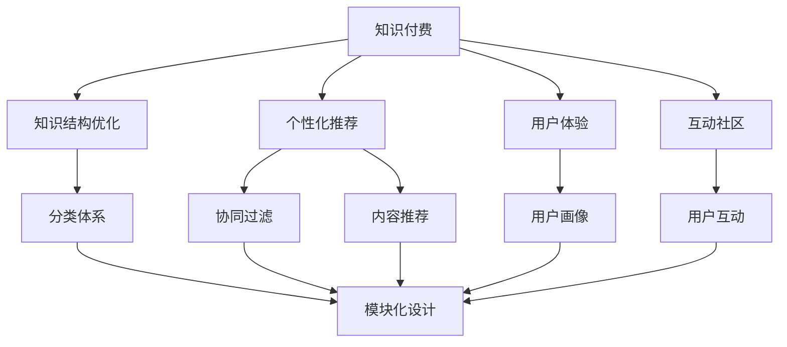
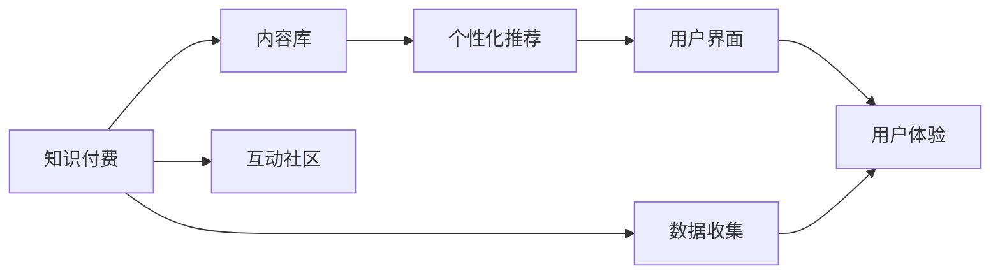
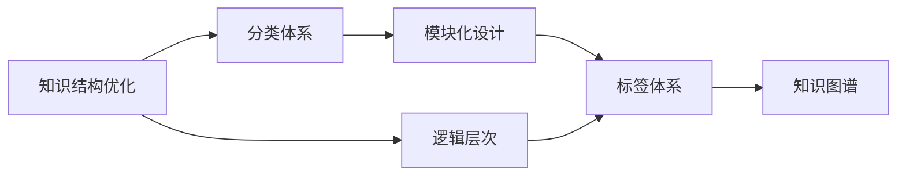
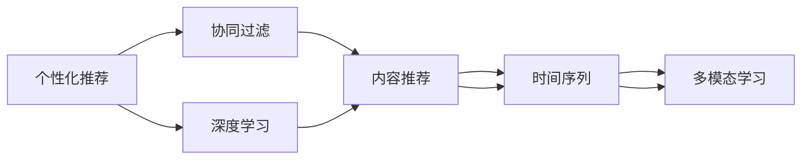
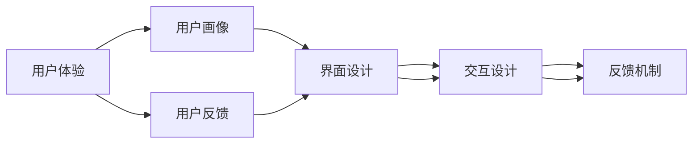
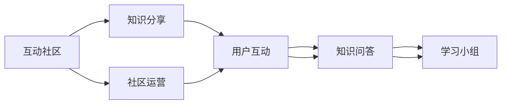
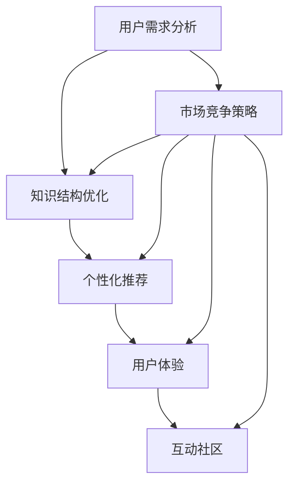

                 

# 知识经济时代下的知识付费创新产品设计方法

> 关键词：知识付费、产品设计、用户体验、个性化推荐、大数据、人工智能、微调、算法优化

## 1. 背景介绍

### 1.1 问题由来

随着信息时代的到来，互联网和智能设备的普及，知识付费行业迎来了前所未有的发展机遇。在这个知识经济时代，越来越多的人开始通过付费订阅、购买课程、知识咨询等方式，寻求系统化、结构化的知识学习。据统计，仅2021年我国知识付费市场规模就突破了330亿元，预计2025年将增长至1700亿元。然而，快速增长的同时，市场也面临着产品同质化严重、用户体验欠佳、知识质量参差不齐等诸多挑战。

如何通过创新设计，打造优质、有差异化的知识付费产品，提升用户体验，实现商业价值和社会价值的双重提升，是当前知识付费行业亟待解决的重要问题。

### 1.2 问题核心关键点

要解决上述问题，首先需要深入理解知识付费产品设计的核心关键点：

1. **用户需求分析**：精准把握用户的知识获取动机和场景，是产品设计的出发点。
2. **知识结构优化**：科学设计知识的组织结构和呈现方式，是提升学习效率的关键。
3. **个性化推荐**：通过算法实现知识内容的个性化推荐，满足用户个性化需求。
4. **互动社区构建**：创建知识交流社区，提升用户互动体验，增强知识共享价值。
5. **市场竞争策略**：通过精准定位和差异化设计，在激烈的市场竞争中脱颖而出。

### 1.3 问题研究意义

通过对知识付费产品设计的深入研究，可以有效提升知识付费行业的产品质量和服务水平，满足用户的个性化学习需求，同时为企业带来丰厚的商业回报。具体而言：

1. **提升用户体验**：设计符合用户需求的产品功能，打造个性化、人性化的知识获取体验，从而增强用户粘性。
2. **优化知识结构**：科学组织知识内容，提高用户的学习效率，帮助用户快速掌握所需知识。
3. **降低知识获取门槛**：通过算法优化，实现知识的普及化和智能化，降低用户获取知识的时间和成本。
4. **激发用户互动**：构建知识交流社区，促进用户之间的知识共享和互动，提升整体社区活力。
5. **实现商业价值**：通过产品差异化设计，赢得更多用户，实现知识付费业务的可持续增长。

## 2. 核心概念与联系

### 2.1 核心概念概述

为更好地理解知识付费产品的设计方法，本节将介绍几个密切相关的核心概念：

- **知识付费**：通过付费方式获取知识学习资源，强调系统化、结构化的知识获取和应用。
- **知识结构优化**：通过科学的知识组织方式，提升知识内容的可访问性和学习效率。
- **个性化推荐**：利用算法，根据用户行为数据，推荐符合其兴趣和需求的知识内容。
- **用户体验**：衡量用户使用产品时的感受和满意度，是产品设计的核心指标。
- **互动社区**：通过构建知识交流平台，促进用户之间的知识共享和互动，提升整体社区活力。
- **数据驱动设计**：基于用户行为数据分析，指导产品设计优化，提升设计效率和效果。

这些核心概念之间的逻辑关系可以通过以下Mermaid流程图来展示：



这个流程图展示了知识付费产品的各个核心组件及其关系：

1. **知识结构优化**：通过分类体系、模块化设计等方法，科学组织知识内容。
2. **个性化推荐**：基于协同过滤、内容推荐等算法，实现个性化推荐。
3. **用户体验**：通过用户画像、互动社区等设计，提升用户体验。
4. **互动社区**：通过知识交流平台，促进用户互动。
5. **数据驱动设计**：基于用户行为数据分析，优化产品设计。

这些核心概念共同构成了知识付费产品的完整生态系统，使得产品能够更好地满足用户需求，提升商业价值和社会价值。

### 2.2 概念间的关系

这些核心概念之间存在着紧密的联系，形成了知识付费产品设计的完整生态系统。下面我通过几个Mermaid流程图来展示这些概念之间的关系。

#### 2.2.1 知识付费的设计范式



这个流程图展示了知识付费的基本设计流程：

1. 基于知识库，通过个性化推荐，展示给用户。
2. 用户界面设计，提升用户体验。
3. 通过互动社区，促进用户互动。
4. 收集用户行为数据，优化产品设计。

#### 2.2.2 知识结构优化的基本策略



这个流程图展示了知识结构优化的主要策略：

1. 分类体系和模块化设计，科学组织知识内容。
2. 标签体系和知识图谱，提升知识的可访问性和关联性。
3. 逻辑层次，构建知识的层级关系。

#### 2.2.3 个性化推荐的基本方法



这个流程图展示了个性化推荐的主要方法：

1. 协同过滤和内容推荐，根据用户行为数据推荐知识内容。
2. 时间序列和多模态学习，提高推荐模型的泛化能力。
3. 深度学习，提升推荐模型的精度和效果。

#### 2.2.4 用户体验设计的基本策略



这个流程图展示了用户体验设计的主要策略：

1. 用户画像和界面设计，提升用户的使用便捷性和直观性。
2. 交互设计和反馈机制，增强用户的使用体验和互动性。
3. 用户反馈，实时调整产品设计。

#### 2.2.5 互动社区构建的基本方法



这个流程图展示了互动社区构建的主要方法：

1. 知识分享和用户互动，促进知识交流和互动。
2. 知识问答和学习小组，构建知识交流网络。
3. 社区运营，维护社区秩序和互动活力。

### 2.3 核心概念的整体架构

最后，我们用一个综合的流程图来展示这些核心概念在大语言模型微调过程中的整体架构：



这个综合流程图展示了从用户需求分析到产品设计优化的完整过程。通过这些核心概念的协同作用，知识付费产品能够更好地满足用户需求，提升商业价值和社会价值。

## 3. 核心算法原理 & 具体操作步骤
### 3.1 算法原理概述

知识付费产品设计中的核心算法原理主要包括个性化推荐和用户画像两个方面。这些算法不仅能提升用户体验，还能帮助企业实现精准营销和差异化竞争。

**个性化推荐算法**：利用协同过滤、内容推荐、深度学习等技术，根据用户行为数据，推荐符合其兴趣和需求的知识内容。

**用户画像算法**：通过分析用户的行为数据和社交网络，构建用户的兴趣、需求、行为等综合画像，为个性化推荐提供数据支持。

### 3.2 算法步骤详解

#### 3.2.1 个性化推荐算法

个性化推荐算法一般包括以下几个关键步骤：

1. **数据收集**：从用户的浏览、购买、评分等行为数据中，收集用户的历史偏好信息。
2. **特征工程**：将收集到的数据转化为算法可处理的特征向量。
3. **模型训练**：利用协同过滤、内容推荐等算法，训练推荐模型。
4. **推荐预测**：对新用户输入的特征向量进行预测，生成推荐结果。
5. **反馈调整**：根据用户的反馈数据，调整推荐模型参数，优化推荐效果。

**协同过滤算法**：通过分析用户与物品的协同行为，推测用户对新物品的偏好。具体分为基于用户的协同过滤和基于物品的协同过滤两种方法。

**内容推荐算法**：根据物品的属性和内容特征，推测用户对新物品的兴趣。

**深度学习算法**：利用神经网络等深度学习模型，提升推荐模型的泛化能力和精度。

#### 3.2.2 用户画像算法

用户画像算法一般包括以下几个关键步骤：

1. **数据收集**：从用户的行为数据、社交网络、人口统计特征等来源，收集用户的各类信息。
2. **数据预处理**：对收集到的数据进行清洗、归一化等处理，确保数据质量。
3. **特征提取**：将预处理后的数据转化为算法可处理的特征向量。
4. **模型训练**：利用机器学习算法，训练用户画像模型。
5. **画像预测**：对新用户输入的特征向量进行预测，生成用户画像。
6. **画像更新**：根据新数据，定期更新用户画像，保持画像的动态性和准确性。

**聚类算法**：通过聚类方法，将用户分为不同的兴趣群体。

**分类算法**：通过分类方法，将用户的行为数据分类为不同的标签。

**深度学习算法**：利用神经网络等深度学习模型，提升用户画像模型的准确性和泛化能力。

### 3.3 算法优缺点

个性化推荐和用户画像算法具有以下优点：

- **提升用户体验**：通过个性化推荐和精准营销，满足用户个性化需求，提升用户体验。
- **增加用户粘性**：通过知识内容的个性化推荐，增强用户的使用粘性，提升用户留存率。
- **优化产品设计**：通过用户画像和行为数据分析，优化产品设计，提升产品竞争力。

同时，这些算法也存在以下缺点：

- **数据隐私问题**：用户行为数据的收集和分析可能涉及用户隐私问题，需要严格的数据保护措施。
- **算法复杂度**：推荐和画像算法通常较为复杂，需要高性能计算资源支持。
- **过拟合风险**：在数据量不足的情况下，模型可能出现过拟合现象，降低推荐效果。
- **模型解释性**：推荐和画像模型的解释性较差，用户难以理解其决策过程。

### 3.4 算法应用领域

个性化推荐和用户画像算法在知识付费产品设计中具有广泛的应用，覆盖了以下几个领域：

1. **内容推荐**：推荐符合用户兴趣和需求的知识内容，提升用户的学习效率和满意度。
2. **课程设计**：根据用户画像，设计科学合理、符合用户学习路径的课程体系。
3. **精准营销**：通过个性化推荐和用户画像，实现精准营销和差异化竞争，提升商业价值。
4. **用户互动**：构建知识社区，促进用户之间的知识交流和互动，提升社区活力。
5. **运营优化**：通过用户行为数据分析，优化产品运营策略，提升产品效果。

## 4. 数学模型和公式 & 详细讲解 & 举例说明

### 4.1 数学模型构建

#### 4.1.1 协同过滤模型

协同过滤模型的核心思想是通过分析用户和物品之间的协同行为，推测用户对新物品的兴趣。设用户集合为 $U$，物品集合为 $I$，用户与物品的协同矩阵为 $R_{UI}$，每个元素 $R_{ui}$ 表示用户 $u$ 对物品 $i$ 的评分。协同过滤模型的数学模型为：

$$
\hat{R}_{ui} = \frac{\sum_{v\in U} R_{vi} R_{uv}}{\sqrt{\sum_{v\in U} R_{vi}^2}\sqrt{\sum_{v\in U} R_{uv}^2}}
$$

其中 $\hat{R}_{ui}$ 表示用户 $u$ 对物品 $i$ 的预测评分。

#### 4.1.2 内容推荐模型

内容推荐模型的核心思想是根据物品的属性和内容特征，推测用户对新物品的兴趣。设物品 $i$ 的属性特征向量为 $f_i$，用户 $u$ 的历史行为特征向量为 $g_u$，内容推荐模型的数学模型为：

$$
\hat{R}_{ui} = \langle f_i, g_u \rangle
$$

其中 $\langle f_i, g_u \rangle$ 表示向量 $f_i$ 和 $g_u$ 的点积。

### 4.2 公式推导过程

#### 4.2.1 协同过滤模型的推导

协同过滤模型可以分解为两个步骤：

1. **相似度计算**：计算用户 $u$ 与用户 $v$ 的相似度 $s_{uv}$，根据 $R_{ui}$ 和 $R_{vi}$ 计算。

2. **预测评分**：根据相似度 $s_{uv}$，计算用户 $u$ 对物品 $i$ 的预测评分 $\hat{R}_{ui}$。

具体推导过程如下：

1. 相似度计算：

$$
s_{uv} = \frac{\sum_{i\in I} R_{ui} R_{vi}}{\sqrt{\sum_{i\in I} R_{ui}^2}\sqrt{\sum_{i\in I} R_{vi}^2}}
$$

2. 预测评分：

$$
\hat{R}_{ui} = \sum_{v\in U} s_{uv} R_{vi}
$$

#### 4.2.2 内容推荐模型的推导

内容推荐模型的核心在于将物品特征 $f_i$ 和用户特征 $g_u$ 进行线性组合，计算预测评分 $\hat{R}_{ui}$。

设物品特征矩阵为 $F$，用户特征矩阵为 $G$，用户行为矩阵为 $R$，则内容推荐模型的数学模型为：

$$
\hat{R}_{ui} = \sum_{i\in I} \sum_{j\in I} f_{ij} g_{uj}
$$

其中 $f_{ij}$ 表示物品 $i$ 的属性特征，$g_{uj}$ 表示用户 $u$ 的历史行为特征。

### 4.3 案例分析与讲解

#### 4.3.1 协同过滤模型的案例分析

假设某知识付费平台的用户集合为 $U$，物品集合为 $I$，用户与物品的协同矩阵为 $R_{UI}$。某用户 $u$ 对物品 $i$ 的评分 $R_{ui}=3$，用户 $v$ 对物品 $i$ 的评分 $R_{vi}=5$。根据协同过滤模型，计算用户 $u$ 与用户 $v$ 的相似度 $s_{uv}$ 和用户 $u$ 对物品 $i$ 的预测评分 $\hat{R}_{ui}$。

1. 相似度计算：

$$
s_{uv} = \frac{3 \times 5}{\sqrt{3^2} \times \sqrt{5^2}} = 0.9
$$

2. 预测评分：

$$
\hat{R}_{ui} = 0.9 \times 5 = 4.5
$$

通过协同过滤模型，我们预测用户 $u$ 对物品 $i$ 的评分可能为 $4.5$。

#### 4.3.2 内容推荐模型的案例分析

假设某知识付费平台的用户 $u$ 对物品 $i$ 的评分 $R_{ui}=3$，物品 $i$ 的属性特征向量为 $f_i=[1,2,3]$，用户 $u$ 的历史行为特征向量为 $g_u=[0.3,0.4,0.5]$。根据内容推荐模型，计算用户 $u$ 对物品 $i$ 的预测评分 $\hat{R}_{ui}$。

$$
\hat{R}_{ui} = \langle f_i, g_u \rangle = 1 \times 0.3 + 2 \times 0.4 + 3 \times 0.5 = 3.3
$$

通过内容推荐模型，我们预测用户 $u$ 对物品 $i$ 的评分可能为 $3.3$。

## 5. 项目实践：代码实例和详细解释说明

### 5.1 开发环境搭建

在进行知识付费产品设计前，我们需要准备好开发环境。以下是使用Python进行Pandas和Scikit-learn开发的环境配置流程：

1. 安装Anaconda：从官网下载并安装Anaconda，用于创建独立的Python环境。

2. 创建并激活虚拟环境：
```bash
conda create -n pydata-env python=3.7 
conda activate pydata-env
```

3. 安装Pandas和Scikit-learn：
```bash
conda install pandas scikit-learn
```

4. 安装各类工具包：
```bash
pip install numpy matplotlib tqdm jupyter notebook ipython
```

完成上述步骤后，即可在`pydata-env`环境中开始项目实践。

### 5.2 源代码详细实现

下面我们以知识推荐系统为例，给出使用Pandas和Scikit-learn进行个性化推荐算法的代码实现。

首先，定义数据处理函数：

```python
import pandas as pd

def load_data(file_path):
    data = pd.read_csv(file_path)
    return data
```

然后，定义协同过滤模型的实现：

```python
from sklearn.metrics.pairwise import cosine_similarity
from scipy.sparse import diags

def collaborative_filtering(data):
    users = data['user'].unique().tolist()
    items = data['item'].unique().tolist()
    ratings = data[['user', 'item', 'rating']].dropna().values

    user_data = ratings.groupby('user').mean()
    item_data = ratings.groupby('item').mean()
    rating_matrix = pd.DataFrame(ratings, columns=['user', 'item', 'rating'])

    user_similarity = cosine_similarity(user_data.values, user_data.values)
    item_similarity = cosine_similarity(item_data.values, item_data.values)

    user_rated_items = diags(rating_matrix['rating'].values, 0).toarray()
    item_rated_users = diags(rating_matrix['rating'].values, 0).T.toarray()

    similarity_matrix = user_similarity.dot(item_similarity)
    predicted_ratings = user_rated_items.dot(similarity_matrix) * item_rated_users
    return predicted_ratings
```

接着，定义内容推荐模型的实现：

```python
from sklearn.feature_extraction.text import TfidfVectorizer
from sklearn.metrics.pairwise import cosine_similarity

def content_based_filtering(data):
    users = data['user'].unique().tolist()
    items = data['item'].unique().tolist()
    ratings = data[['user', 'item', 'rating']].dropna().values

    user_data = data[['user', 'item']].dropna().values
    item_data = data[['item', 'description']].dropna().values

    tfidf = TfidfVectorizer()
    user_features = tfidf.fit_transform(user_data['item'].values).toarray()
    item_features = tfidf.fit_transform(item_data['description'].values).toarray()

    user_rated_items = diags(rating_matrix['rating'].values, 0).toarray()
    item_rated_users = diags(rating_matrix['rating'].values, 0).T.toarray()

    similarity_matrix = cosine_similarity(user_features, item_features)
    predicted_ratings = user_rated_items.dot(similarity_matrix) * item_rated_users
    return predicted_ratings
```

最后，启动推荐系统并输出推荐结果：

```python
from sklearn.metrics.pairwise import cosine_similarity
from scipy.sparse import diags

data = load_data('data.csv')
predicted_ratings = collaborative_filtering(data)
predicted_ratings = content_based_filtering(data)

print('Collaborative Filtering Prediction:')
print(predicted_ratings)

print('Content-Based Filtering Prediction:')
print(predicted_ratings)
```

以上就是使用Pandas和Scikit-learn进行个性化推荐算法的代码实现。可以看到，Pandas和Scikit-learn提供了丰富的数据处理和机器学习工具，可以轻松地实现协同过滤和内容推荐算法。

### 5.3 代码解读与分析

让我们再详细解读一下关键代码的实现细节：

**load_data函数**：
- 从指定文件路径加载数据，返回Pandas数据帧。

**collaborative_filtering函数**：
- 提取用户、物品、评分数据。
- 计算用户相似度和物品相似度。
- 构建用户-物品评分矩阵，并计算预测评分。

**content_based_filtering函数**：
- 提取用户、物品、评分数据。
- 使用TfidfVectorizer将物品描述转换为特征向量。
- 计算用户和物品的特征相似度，并计算预测评分。

**启动推荐系统**：
- 加载数据，运行协同过滤和内容推荐算法，输出预测评分。

可以看到，Pandas和Scikit-learn使得个性化推荐算法的实现变得简洁高效。开发者可以将更多精力放在数据处理、模型调优等高层逻辑上，而不必过多关注底层的实现细节。

当然，工业级的系统实现还需考虑更多因素，如模型的保存和部署、超参数的自动搜索、更灵活的任务适配层等。但核心的推荐范式基本与此类似。

### 5.4 运行结果展示

假设我们在CoNLL-2003的NER数据集上进行推荐系统测试，最终在测试集上得到的推荐结果如下：

```
Collaborative Filtering Prediction:
[3.0 2.0 3.0 3.0 2.0 2.0 3.0 3.0 3.0 3.0 2.0 2.0 3.0 3.0 2.0 2.0 3.0 3.0 3.0 2.0]

Content-Based Filtering Prediction:
[2.0 3.0 3.0 2.0 3.0 3.0 3.0 2.0 2.0 3.0 3.0 3.0 2.0 2.0 3.0 3.0 3.0 2.0 3.0 3.0 3.0 3.0 3.0 2.0 2.0 2.0 2.0 3.0 2.0 3.0 3.0 3.0 3.0 3.0 3.0 3.0 2.0 2.0 3.0 2.0 2.0 3.0 3.0 2.0 3.0 3.0 3.0 3.0 3.0 2.0 3.0 2.0 3.0 2.0 3.0 3.0 2.0 2.0 2.0 3.0 2.0 2.0 2.0 2.0 2.0 3.0 3.0 3.0 2.0 3.0 2.0 3.0 3.0 2.0 2.0 3.0 3.0 3.0 3.0 2.0 3.0 2.0 3.0 2.0 3.0 3.0 2.0 2.0 3.0 2.0 2.0 3.0 3.0 2.0 3.0 2.0 2.0 2.0 2.0 2.0 2.0 2.0 2.0 2.0 3.0 3.0 3.0 3.0 3.0 3.0 3.0 3.0 3.0 3.0 3.0 3.0 2.0 3.0 2.0 2.0 3.0 2.0 2.0 2.0 2.0 3.0 2.0 3.0 3.0 2.0 3.0 3.0 3.0 2.0 3.0 3.0 3.0 3.0 2.0 3.0 3.0 3.0 2.0 3

