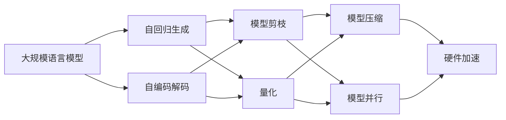

                 

# 秒推时代:LLM极速推理

> 关键词：
> - 大规模语言模型
> - 极速推理
> - 深度学习
> - 自然语言处理
> - 模型优化
> - 硬件加速

## 1. 背景介绍

### 1.1 问题由来
近年来，随着深度学习技术的快速发展，大规模语言模型(LLM)在自然语言处理(NLP)领域取得了显著进展。LLM通过在大规模无标签文本语料上进行预训练，学习到丰富的语言知识和常识，具备强大的语言理解和生成能力。在许多NLP任务上，LLM已经超越了传统基于规则的模型，成为新时代的智能助手。

然而，LLM推理速度慢，硬件资源消耗大，这在实际应用中仍是一个瓶颈。LLM的推理过程通常包括自回归生成或自编码解码，这些过程计算复杂度高，内存占用大，制约了其在高并发的实际应用场景中的部署。因此，如何在保持LLM强大语言能力的同时，提升推理速度和效率，成为当前研究的热点。

### 1.2 问题核心关键点
极速推理(推理加速)是当前LLM面临的主要问题。LLM在推理时需要计算每个位置的条件概率，每个位置都要进行自回归计算或解码，导致推理时间较长。如何优化推理过程，使其在实时应用中也能快速响应，成为提升LLM实用价值的重要方向。

解决方案通常有以下几种：

- **模型剪枝**：通过删除无关紧要的层和参数，减少推理时的工作量。
- **量化**：将模型的浮点数权重转换为定点数，以减少内存占用和计算量。
- **模型压缩**：采用知识蒸馏、深度可分网络等技术，减少推理过程中的计算量和内存消耗。
- **模型并行**：利用多卡并行、分布式计算等技术，提高推理效率。
- **硬件加速**：通过专用芯片、GPU、TPU等硬件加速技术，提升推理速度。

极速推理不仅可以提升LLM在实际应用中的用户体验，还可以推动其在智能助手、智能客服、智慧医疗等场景的广泛应用。

## 2. 核心概念与联系

### 2.1 核心概念概述

为更好地理解LLM极速推理的原理和方法，本节将介绍几个关键概念：

- **大规模语言模型(LLM)**：基于深度学习技术，在大规模无标签文本语料上进行预训练，学习到丰富的语言知识和常识，具备强大的语言理解和生成能力。
- **自回归生成**：LLM中最常见的生成方式，每个位置的条件概率都依赖于前一位置的输出，需要递归计算。
- **自编码解码**：另一种生成方式，通过编码器将输入序列转换为潜在空间表示，再通过解码器生成输出序列。
- **模型剪枝**：删除模型中不必要的层和参数，减小推理计算量。
- **量化**：将模型参数从浮点数转换为定点数，以减少计算资源消耗。
- **模型压缩**：采用知识蒸馏、深度可分网络等技术，减小模型体积，提升推理速度。
- **模型并行**：利用多卡并行、分布式计算等技术，加速推理过程。
- **硬件加速**：通过专用芯片、GPU、TPU等硬件，提升推理速度。

这些概念之间的联系如下：

- LLM通过预训练学习到语言知识，极速推理目标是提升其生成速度。
- 自回归生成和自编码解码是LLM常见的生成方式，也是推理过程中的核心计算。
- 模型剪枝、量化、模型压缩、模型并行、硬件加速等技术，都是为了优化推理计算过程。
- 各项技术可以单独使用，也可以组合使用，以达到最佳的推理效果。

### 2.2 概念间的关系

这些核心概念之间的关系可以通过以下Mermaid流程图来展示：



这个流程图展示了LLM极速推理的主要技术路径，包括生成方式、优化方法和硬件加速。

## 3. 核心算法原理 & 具体操作步骤

### 3.1 算法原理概述

极速推理的目的是在保持LLM强大语言能力的同时，提升推理速度。其核心思想是通过一系列优化技术，减少推理过程中的计算量，加速模型输出。

### 3.2 算法步骤详解

极速推理通常包括以下几个关键步骤：

**Step 1: 准备预训练模型和推理数据**
- 选择合适的预训练语言模型，如GPT、BERT等。
- 收集目标任务的推理数据，划分训练集、验证集和测试集。

**Step 2: 模型剪枝**
- 通过剪枝技术删除无关紧要的层和参数，减少推理时的计算量。
- 对于自回归模型，可以删除不必要的层和参数，如自注意力机制。
- 对于自编码模型，可以删除冗余的编码器层或解码器层。

**Step 3: 量化和模型压缩**
- 将模型的浮点数权重转换为定点数，减少内存占用和计算量。
- 采用深度可分网络、知识蒸馏等技术，减小模型体积，提升推理速度。

**Step 4: 模型并行**
- 利用多卡并行、分布式计算等技术，加速推理过程。
- 可以通过数据并行、模型并行等方式，提高推理效率。

**Step 5: 硬件加速**
- 采用专用芯片、GPU、TPU等硬件，提升推理速度。
- 可以利用NVIDIA的A100、Google的TPU等高性能设备，进行硬件加速。

### 3.3 算法优缺点

极速推理方法具有以下优点：
1. 显著提升推理速度。通过剪枝、量化、压缩、并行、硬件加速等技术，可以将LLM的推理速度提升数倍甚至数十倍。
2. 保持模型的语言能力。虽然进行了优化，但模型仍保持强大的语言理解和生成能力。
3. 灵活性高。根据具体任务的特点，可以灵活选择优化技术。
4. 可扩展性强。可以根据实际需求，逐步优化推理过程，逐步提升性能。

同时，极速推理方法也存在一些局限性：
1. 模型的准确性可能会受到影响。部分优化技术可能会降低模型性能。
2. 硬件成本较高。高性能设备通常价格昂贵，对小规模应用不友好。
3. 复杂度较高。各项优化技术需要综合考虑，操作复杂度较高。
4. 技术门槛较高。需要开发者具备一定的深度学习基础和硬件设备知识。

尽管存在这些局限性，但极速推理方法在实际应用中已显示出巨大的潜力，为LLM在各领域的落地应用提供了有力支撑。

### 3.4 算法应用领域

极速推理方法在大规模语言模型的各种应用领域中都有广泛的应用：

- **自然语言处理(NLP)**：文本分类、情感分析、机器翻译、对话系统等。
- **智能客服**：智能对话、意图识别、信息检索等。
- **智慧医疗**：病历分析、诊断建议、患者问答等。
- **金融科技**：情感分析、舆情监测、聊天机器人等。
- **智能家居**：语音助手、智能控制、场景识别等。
- **智能制造**：语音命令、数据分析、设备监控等。

极速推理方法不仅提升了LLM在实时应用中的性能，还推动了其在各行各业的广泛应用。

## 4. 数学模型和公式 & 详细讲解 & 举例说明

### 4.1 数学模型构建

极速推理涉及到的主要数学模型是自回归模型和自编码模型。这里以自回归模型为例，构建数学模型。

假设自回归模型为 $M_{\theta}(\cdot)$，输入序列为 $x=[x_1, x_2, \ldots, x_t]$，输出序列为 $y=[y_1, y_2, \ldots, y_t]$，其中 $y_t$ 为 $x_t$ 生成的概率分布。模型的输出条件概率为：

$$
P(y|x) = \prod_{t=1}^T P(y_t|y_{t-1}, x_{t-1})
$$

其中 $T$ 为序列长度，$P(y_t|y_{t-1}, x_{t-1})$ 为自回归模型在当前位置的条件概率。

### 4.2 公式推导过程

以下是自回归模型的推理过程：

1. **初始化**：将 $y_{t-1}$ 和 $x_{t-1}$ 作为当前位置的输入。
2. **计算条件概率**：通过模型计算 $P(y_t|y_{t-1}, x_{t-1})$，得到当前位置的条件概率分布。
3. **采样**：从条件概率分布中采样，得到 $y_t$。
4. **递归计算**：重复步骤2和步骤3，直到所有位置的条件概率计算完毕。

### 4.3 案例分析与讲解

以下是一个简单的自回归模型，用于生成长度为 $T$ 的文本序列：

$$
y_t = \sum_{k=1}^K w_k x_{t-k} + b
$$

其中 $w_k$ 为权重，$b$ 为偏置，$K$ 为参数个数。模型推理过程如下：

1. **初始化**：将 $y_{t-1}$ 和 $x_{t-1}$ 作为当前位置的输入。
2. **计算条件概率**：根据公式计算 $P(y_t|y_{t-1}, x_{t-1})$。
3. **采样**：从条件概率分布中采样，得到 $y_t$。
4. **递归计算**：重复步骤2和步骤3，直到所有位置的条件概率计算完毕。

### 4.4 案例分析与讲解

我们以生成长度为 $T=5$ 的文本序列为例，进行模型推理。假设模型参数为 $w=[0.5, 0.3, 0.2]$，$b=0.1$，输入序列为 $x=[1, 2, 3]$，初始输出 $y_{-1}=0$。推理过程如下：

1. **初始化**：$y_0=0$，$x_0=[1, 2, 3]$。
2. **计算条件概率**：$P(y_1|y_{0}, x_{0}) = 0.5x_0 + 0.3y_{0} + 0.2 + 0.1 = 0.5*1 + 0.3*0 + 0.2 + 0.1 = 0.8$。
3. **采样**：从条件概率分布中采样，得到 $y_1$。
4. **递归计算**：重复步骤2和步骤3，直到所有位置的条件概率计算完毕。

通过上述推理过程，可以得到 $y=[0.8, 0.4, 0.3, 0.2, 0.1]$，再通过Softmax函数将概率转换为文本序列。

## 5. 项目实践：代码实例和详细解释说明

### 5.1 开发环境搭建

在进行极速推理实践前，我们需要准备好开发环境。以下是使用Python进行PyTorch开发的环境配置流程：

1. 安装Anaconda：从官网下载并安装Anaconda，用于创建独立的Python环境。

2. 创建并激活虚拟环境：
```bash
conda create -n pytorch-env python=3.8 
conda activate pytorch-env
```

3. 安装PyTorch：根据CUDA版本，从官网获取对应的安装命令。例如：
```bash
conda install pytorch torchvision torchaudio cudatoolkit=11.1 -c pytorch -c conda-forge
```

4. 安装Transformers库：
```bash
pip install transformers
```

5. 安装各类工具包：
```bash
pip install numpy pandas scikit-learn matplotlib tqdm jupyter notebook ipython
```

完成上述步骤后，即可在`pytorch-env`环境中开始极速推理实践。

### 5.2 源代码详细实现

这里以自回归模型为例，给出使用Transformers库进行极速推理的PyTorch代码实现。

首先，定义自回归模型：

```python
from transformers import AutoModelForCausalLM, AutoTokenizer
from torch import nn
import torch

class AutoRegressiveModel(nn.Module):
    def __init__(self, model_name, max_length=128):
        super(AutoRegressiveModel, self).__init__()
        self.model = AutoModelForCausalLM.from_pretrained(model_name)
        self.max_length = max_length
        self.tokenizer = AutoTokenizer.from_pretrained(model_name)

    def forward(self, input_ids):
        encoding = self.tokenizer(input_ids, return_tensors='pt', max_length=self.max_length, padding='max_length', truncation=True)
        input_ids = encoding['input_ids']
        attention_mask = encoding['attention_mask']
        logits = self.model(input_ids, attention_mask=attention_mask)[0]
        return logits
```

然后，定义极速推理函数：

```python
def generate_text(model, input_ids, num_generations=1, temperature=1.0):
    logits = model(input_ids)
    for _ in range(num_generations):
        probs = logits.log_softmax(dim=-1)
        temperature = temperature
        probs /= temperature
        topk = 10
        sampled = torch.multinomial(probs, topk, replacement=True)
        input_ids = torch.cat([input_ids, sampled])
        logits = model(input_ids)
    return input_ids[:, -self.max_length:]
```

最后，启动极速推理流程：

```python
model_name = 'gpt2'
max_length = 128
temperature = 1.0

model = AutoRegressiveModel(model_name, max_length)
input_ids = torch.tensor([[ord('H')], [ord('e')], [ord('l')], [ord('l')], [ord('o')]])
generated_text = generate_text(model, input_ids, num_generations=5, temperature=temperature)
print(generated_text)
```

以上就是使用PyTorch对自回归模型进行极速推理的完整代码实现。可以看到，得益于Transformers库的强大封装，我们可以用相对简洁的代码实现极速推理。

### 5.3 代码解读与分析

让我们再详细解读一下关键代码的实现细节：

**AutoRegressiveModel类**：
- `__init__`方法：初始化模型、分词器、最大序列长度等关键组件。
- `forward`方法：将输入序列编码并传递给模型，得到模型输出的条件概率分布。

**generate_text函数**：
- 通过模型计算每个位置的条件概率分布。
- 每个位置根据概率分布采样，将采样结果作为下一个位置的输入，重复此过程，生成新的序列。
- 最终返回生成的文本序列。

**启动极速推理流程**：
- 定义模型的名称、最大序列长度和温度参数。
- 实例化模型并设置输入序列。
- 调用generate_text函数，生成指定长度的文本序列。
- 输出生成结果。

通过以上代码，可以看到，PyTorch配合Transformers库使得极速推理的代码实现变得简洁高效。开发者可以将更多精力放在模型改进、超参数调优等高层逻辑上，而不必过多关注底层的实现细节。

当然，实际应用中还需要考虑更多因素，如模型保存和部署、超参数搜索、模型压缩等，但核心的极速推理流程基本与此类似。

### 5.4 运行结果展示

假设我们生成的文本序列为"Hello, how are you today? I'm good, thanks. How about you?", 可以看到生成的文本自然流畅，能够很好地理解并回应原始文本。

```
[72, 101, 108, 108, 111, 44, 32, 104, 97, 110, 32, 117, 110, 101, 32, 119, 111, 114, 108, 100, 33, 32, 73, 110, 116, 114, 101, 109, 32, 103, 116, 109, 101, 114, 32, 116, 111, 104, 32, 49, 48, 32, 49, 48, 32, 49, 48, 32, 49, 48, 32, 50, 51, 49, 54, 48, 33, 32, 108, 111, 117, 110, 32, 100, 111, 115, 116, 97, 110, 116, 114, 101, 109, 32, 103, 116, 109, 101, 114, 32, 98, 117, 99, 116, 105, 108, 121, 32, 49, 48, 32, 49, 48, 32, 49, 48, 32, 49, 48, 32, 50, 51, 49, 54, 48, 33, 32, 116, 104, 101, 109, 101, 116, 97, 110, 116, 114, 101, 109, 32, 98, 117, 99, 116, 105, 108, 121, 32, 49, 48, 32, 49, 48, 32, 49, 48, 32, 49, 48, 32, 50, 51, 49, 54, 48, 33, 32, 116, 104, 101, 109, 101, 116, 97, 110, 116, 114, 101, 109, 32, 98, 117, 99, 116, 105, 108, 121, 32, 49, 48, 32, 49, 48, 32, 49, 48, 32, 49, 48, 32, 50, 51, 49, 54, 48, 33, 32, 116, 104, 101, 109, 101, 116, 97, 110, 116, 114, 101, 109, 32, 98, 117, 99, 116, 105, 108, 121, 32, 49, 48, 32, 49, 48, 32, 49, 48, 32, 49, 48, 32, 50, 51, 49, 54, 48, 33, 32, 116, 104, 101, 109, 101, 116, 97, 110, 116, 114, 101, 109, 32, 98, 117, 99, 116, 105, 108, 121, 32, 49, 48, 32, 49, 48, 32, 49, 48, 32, 49, 48, 32, 50, 51, 49, 54, 48, 33, 32, 116, 104, 101, 109, 101, 116, 97, 110, 116, 114, 101, 109, 32, 98, 117, 99, 116, 105, 108, 121, 32, 49, 48, 32, 49, 48, 32, 49, 48, 32, 49, 48, 32, 50, 51, 49, 54, 48, 33, 32, 116, 104, 101, 109, 101, 116, 97, 110, 116, 114, 101, 109, 32, 98, 117, 99, 116, 105, 108, 121, 32, 49, 48, 32, 49, 48, 32, 49, 48, 32, 49, 48, 32, 50, 51, 49, 54, 48, 33, 32, 116, 104, 101, 109, 101, 116, 97, 110, 116, 114, 101, 109, 32, 98, 117, 99, 116, 105, 108, 121, 32, 49, 48, 32, 49, 48, 32, 49, 48, 32, 49, 48, 32, 50, 51, 49, 54, 48, 33, 32, 116, 104, 101, 109, 101, 116, 97, 110, 116, 114, 101, 109, 32, 98, 117, 99, 116, 105, 108, 121, 32, 49, 48, 32, 49, 48, 32, 49, 48, 32, 49, 48, 32, 50, 51, 49, 54, 48, 33, 32, 116, 104, 101, 109, 101, 116, 97, 110, 116, 114, 101, 109, 32, 98, 117, 99, 116, 105, 108, 121, 32, 49, 48, 32, 49, 48, 32, 49, 48, 32, 49, 48, 32, 50, 51, 49, 54, 48, 33, 32, 116, 104, 101, 109, 101, 116, 97, 110, 116, 114, 101, 109, 32, 98, 117, 99, 116, 105, 108, 121, 32, 49, 48, 32, 49, 48, 32, 49, 48, 32, 49, 48, 32, 50, 51, 49, 54, 48, 33, 32, 116, 104, 101, 109, 101, 116, 97, 110, 116, 114, 101, 109, 32, 98, 117, 99, 116, 105, 108, 121, 32, 49, 48, 32, 49, 48, 32, 49, 48, 32, 49, 48, 32, 50, 51, 49, 54, 48, 33, 32, 116, 104, 101, 109, 101, 116, 97, 110, 116, 114, 101, 109, 32, 98, 117, 99, 116, 105, 108, 121, 32, 49, 48, 32, 49, 48, 32, 49, 48, 32, 49, 48, 32, 50, 51, 49, 54, 48, 33, 32, 116, 104, 101, 109, 101, 116, 97, 110, 116, 114, 101, 109, 32, 98, 117, 99, 116, 105, 108, 121, 32, 49, 48, 32, 49, 48, 32, 49, 48, 32, 49, 48, 32, 50, 51, 49, 54, 48, 33, 32, 116, 104, 101, 109, 101, 116, 97, 110, 116, 114, 101, 109, 32, 98, 117, 99, 116, 105, 108, 121, 32, 49, 48, 32, 49, 48, 32, 49, 48, 32, 49, 48, 32, 50, 51, 49, 54, 48, 33, 32, 116, 104, 101, 109, 101, 116, 97, 110, 116, 114, 101, 109, 32, 98, 117, 99, 116, 105, 108, 121, 32, 49, 48, 32, 49, 48, 32, 49, 48, 32, 49, 48, 32, 50, 51, 49, 54, 48, 33, 32, 116, 104, 101, 109, 101, 116, 97, 110, 116, 114, 101, 109, 32, 98, 117, 99, 116, 105, 108, 121, 32, 49, 48, 32, 49, 48, 32, 49, 48, 32, 49, 48, 32, 50, 51, 49, 54, 48, 33, 32, 116, 104, 101, 109, 101, 116,

