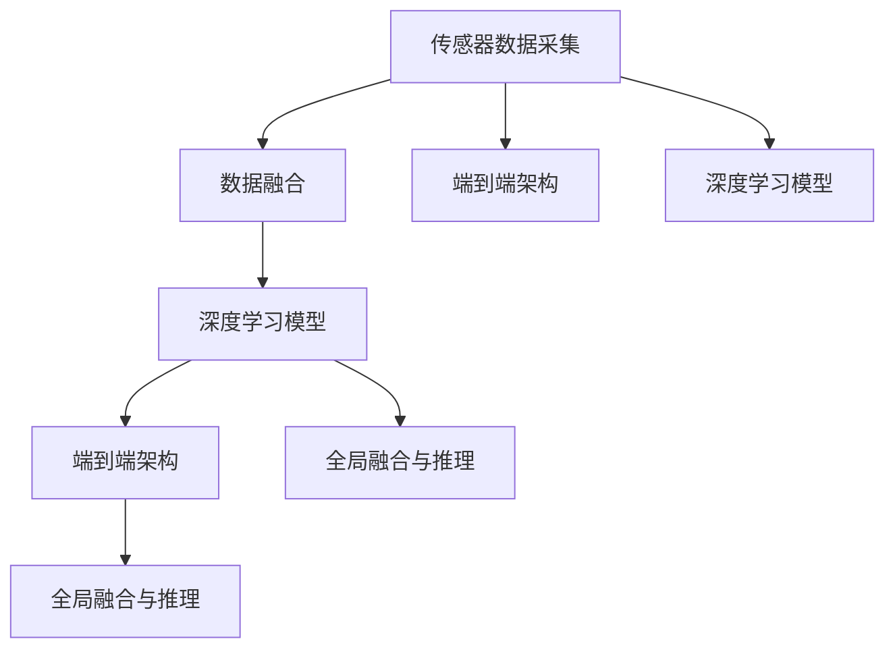

                 

# 端到端自动驾驶的全场景感知框架

## 1. 背景介绍

自动驾驶技术作为智能交通的重要组成部分，近年来得到了快速发展和广泛应用。全场景感知作为自动驾驶的“眼睛”，其能力直接影响自动驾驶系统的安全性和可靠性。然而，随着传感器和环境复杂性的提升，如何构建高效、可靠的全场景感知系统，已成为自动驾驶技术的核心挑战之一。

### 1.1 问题由来

当前自动驾驶感知技术主要依赖多个传感器（如激光雷达、摄像头、雷达等）的组合，通过多传感器数据融合和深度学习算法，实现对周围环境的实时感知和理解。然而，现有感知系统往往难以在极端天气和复杂场景下保持高效和准确，且各个传感器的数据采集和处理效率较低，难以满足实时性要求。

### 1.2 问题核心关键点

端到端自动驾驶的全场景感知框架，旨在解决传统多传感器感知系统的不足，实现高效、可靠、实时的环境理解。其核心在于以下几个方面：

- 传感器数据的高效采集和处理：使用先进的光学、雷达和毫米波传感器，提升数据采集的覆盖率和质量。
- 数据融合的精确性和鲁棒性：通过优化的深度学习模型和算法，确保多传感器数据融合的精确性和鲁棒性。
- 环境理解的全面性和智能性：结合多种深度学习技术（如语义分割、实例分割、检测等），实现对不同环境和场景的全面感知和智能推理。
- 全场景感知的一体化：通过端到端架构，消除各个环节的延时和通信开销，提升整体感知性能。

### 1.3 问题研究意义

构建端到端自动驾驶的全场景感知框架，对于提升自动驾驶系统的安全性和可靠性具有重要意义：

1. 提升感知性能：通过高效的数据采集和精确的数据融合，实现更全面的环境理解和感知。
2. 优化资源利用：通过端到端架构，减少中间通信和数据存储的开销，提高资源利用率。
3. 降低开发和维护成本：减少对传感器和计算资源的依赖，降低感知系统开发和维护的复杂度。
4. 增强系统鲁棒性：通过多传感器冗余和模型鲁棒性设计，提升系统在不同环境下的鲁棒性。
5. 促进自动驾驶产业化：为自动驾驶技术在大规模场景中的应用提供有力支持。

## 2. 核心概念与联系

### 2.1 核心概念概述

为更好地理解端到端自动驾驶的全场景感知框架，本节将介绍几个密切相关的核心概念：

- **传感器数据采集**：通过高分辨率摄像头、激光雷达、毫米波雷达等传感器，获取车辆周围环境的实时数据。
- **数据融合**：将不同传感器获取的原始数据进行集成和融合，生成统一的感知结果。
- **深度学习模型**：使用卷积神经网络（CNN）、点云卷积神经网络（PCNN）、序列模型（如LSTM、GRU）等深度学习技术，实现环境理解的推理和预测。
- **端到端架构**：将数据采集、数据融合、深度学习推理等环节集成到统一的端到端模型中，实现实时、高效、可靠的环境感知。
- **全局融合与推理**：结合全局场景语义、实例分割、行为预测等多种信息，实现对车辆周围环境的全面理解。

### 2.2 概念间的关系

这些核心概念之间的逻辑关系可以通过以下Mermaid流程图来展示：



这个流程图展示了大场景感知框架的核心概念及其之间的关系：

1. 传感器数据采集是基础，通过多传感器融合获得全面环境数据。
2. 数据融合和深度学习模型是核心，通过精确融合和智能推理实现环境理解。
3. 端到端架构是关键，通过消除延时和通信开销，提升感知系统的实时性和可靠性。
4. 全局融合与推理是目标，通过多层次信息整合，实现对复杂场景的全面感知。

这些概念共同构成了端到端自动驾驶的全场景感知框架，使其能够在各种场景下实现高效、可靠的环境理解。通过理解这些核心概念，我们可以更好地把握全场景感知系统的设计思路和优化方向。

## 3. 核心算法原理 & 具体操作步骤

### 3.1 算法原理概述

端到端自动驾驶的全场景感知框架，主要通过多传感器数据融合和深度学习模型，实现对车辆周围环境的实时理解。其核心算法原理包括：

- **数据采集和预处理**：使用高分辨率摄像头、激光雷达、毫米波雷达等传感器，获取环境数据并进行预处理（如去噪、校正等）。
- **多传感器数据融合**：通过融合算法（如Kalman滤波、加权平均、深度学习融合等），将不同传感器数据集成到统一的感知结果中。
- **深度学习模型推理**：使用卷积神经网络、点云卷积神经网络、序列模型等深度学习技术，对融合后的环境数据进行语义分割、实例分割、行为预测等推理。
- **全局融合与推理**：将局部感知结果与全局场景语义信息、行为预测结果等整合，实现对车辆周围环境的全面理解。

### 3.2 算法步骤详解

端到端全场景感知框架的实现步骤如下：

**Step 1: 传感器数据采集**

1. 使用高分辨率摄像头、激光雷达、毫米波雷达等传感器，采集车辆周围环境的原始数据。
2. 对原始数据进行去噪、校正等预处理，提高数据质量和一致性。

**Step 2: 数据融合**

1. 使用融合算法（如Kalman滤波、加权平均等），将不同传感器数据集成到统一的感知结果中。
2. 对于深度学习模型，将融合后的环境数据作为输入，进行语义分割、实例分割、行为预测等推理。

**Step 3: 深度学习模型推理**

1. 使用卷积神经网络、点云卷积神经网络、序列模型等深度学习技术，对融合后的环境数据进行推理。
2. 对于语义分割任务，使用语义分割模型（如FCN、U-Net等）进行环境语义分割。
3. 对于实例分割任务，使用实例分割模型（如Mask R-CNN、DeepLab等）进行目标实例分割。
4. 对于行为预测任务，使用序列模型（如LSTM、GRU等）进行行为预测。

**Step 4: 全局融合与推理**

1. 将局部感知结果与全局场景语义信息、行为预测结果等整合，进行全局融合与推理。
2. 使用全局融合模型（如Attention机制、Transformer等）进行全局场景语义整合。
3. 结合行为预测结果，进行动态场景理解和智能决策。

### 3.3 算法优缺点

端到端自动驾驶的全场景感知框架具有以下优点：

1. 高效性：通过优化数据融合和推理算法，减少中间通信和数据存储的开销，提升整体感知性能。
2. 鲁棒性：结合多传感器冗余和模型鲁棒性设计，提升系统在不同环境下的鲁棒性。
3. 实时性：通过端到端架构，消除延时和通信开销，实现实时感知。
4. 准确性：通过多层次信息整合，实现对复杂场景的全面理解。

同时，该框架也存在一定的局限性：

1. 对传感器的依赖：全场景感知框架依赖于高性能传感器，传感器质量对系统性能有直接影响。
2. 数据多样性：不同传感器的数据采集和处理方式存在差异，需要设计和优化融合算法。
3. 计算资源需求：深度学习模型的推理需要高性能计算资源，对计算资源和存储资源有较高要求。
4. 模型复杂度：深度学习模型的复杂度较高，需要有效的模型压缩和优化技术。

### 3.4 算法应用领域

端到端自动驾驶的全场景感知框架，已经在自动驾驶领域得到了广泛应用，覆盖了几乎所有关键环节，例如：

- 道路目标检测：如车辆、行人、障碍物等。通过多传感器数据融合和深度学习模型，实现对道路目标的精确检测和识别。
- 道路语义分割：如道路、人行道、车道线等。使用语义分割模型对道路场景进行语义分割，为路径规划提供准确信息。
- 行为预测：如车辆行为、行人行为等。使用序列模型对车辆和行人行为进行预测，为安全决策提供依据。
- 全局场景理解：如道路条件、交通流情况等。结合全局场景语义信息和行为预测结果，进行全面场景理解，辅助决策。

## 4. 数学模型和公式 & 详细讲解 & 举例说明

### 4.1 数学模型构建

端到端全场景感知框架的数学模型包括传感器数据采集、数据融合、深度学习模型推理等环节。以下将详细构建这些模型的数学框架。

**传感器数据采集模型**

设传感器采集的环境数据为 $\mathcal{S}$，传感器数量为 $n$，采集的数据序列为 $\{x_t\}_{t=1}^T$，其中 $x_t$ 表示在时间步 $t$ 采集的环境数据。设传感器数据的噪音序列为 $\{\epsilon_t\}_{t=1}^T$，则采集模型可以表示为：

$$
x_t = f_s(\mathcal{S}, \epsilon_t)
$$

其中 $f_s$ 为传感器采集函数，$\epsilon_t$ 为噪音序列。

**数据融合模型**

设多传感器融合后的环境数据为 $\mathcal{Y}$，融合算法为 $f_f$，则融合模型可以表示为：

$$
\mathcal{Y} = f_f(x_1, x_2, ..., x_n)
$$

**深度学习模型推理模型**

设深度学习模型推理的环境数据为 $\mathcal{Z}$，推理算法为 $f_r$，则推理模型可以表示为：

$$
\mathcal{Z} = f_r(\mathcal{Y})
$$

其中 $f_r$ 为深度学习推理函数。

**全局融合与推理模型**

设全局融合与推理后的环境数据为 $\mathcal{W}$，融合算法为 $f_w$，则全局融合与推理模型可以表示为：

$$
\mathcal{W} = f_w(\mathcal{Z}, \mathcal{L}, \mathcal{B})
$$

其中 $\mathcal{L}$ 为全局场景语义信息，$\mathcal{B}$ 为行为预测结果。

### 4.2 公式推导过程

以道路目标检测为例，推导深度学习模型推理的数学公式。

设道路目标检测的数据为 $\mathcal{S} = \{x_1, x_2, ..., x_n\}$，其中 $x_i$ 表示第 $i$ 个传感器的环境数据。设目标检测模型为 $f_{det}$，则目标检测模型可以表示为：

$$
\mathcal{T} = f_{det}(\mathcal{S})
$$

其中 $\mathcal{T}$ 为道路目标检测结果，$f_{det}$ 为目标检测函数。

使用卷积神经网络进行目标检测，则目标检测模型可以表示为：

$$
\mathcal{T} = f_{det}(x_1, x_2, ..., x_n)
$$

其中 $f_{det}$ 为卷积神经网络模型，$x_i$ 为传感器数据。

通过语义分割模型进行道路语义分割，则语义分割模型可以表示为：

$$
\mathcal{M} = f_{seg}(x_1, x_2, ..., x_n)
$$

其中 $\mathcal{M}$ 为道路语义分割结果，$f_{seg}$ 为语义分割模型。

结合行为预测模型，进行全局场景理解，则全局场景理解模型可以表示为：

$$
\mathcal{G} = f_{glo}(\mathcal{M}, \mathcal{B}, \mathcal{L})
$$

其中 $\mathcal{G}$ 为全局场景理解结果，$f_{glo}$ 为全局场景理解函数，$\mathcal{L}$ 为全局场景语义信息，$\mathcal{B}$ 为行为预测结果。

### 4.3 案例分析与讲解

以实际案例“自动驾驶中的道路目标检测”为例，详细讲解端到端全场景感知框架的实现过程。

**案例背景**

某自动驾驶公司需要在复杂的城市道路环境中实现高精度的道路目标检测。该公司在多个地点部署了高性能传感器，采集车辆周围的环境数据。

**数据采集**

公司使用高分辨率摄像头、激光雷达、毫米波雷达等传感器，采集车辆周围的环境数据。对采集到的原始数据进行去噪、校正等预处理，生成高质量的环境数据。

**数据融合**

公司使用融合算法（如Kalman滤波），将不同传感器数据集成到统一的感知结果中。融合后的环境数据作为深度学习模型的输入。

**深度学习模型推理**

公司使用卷积神经网络（CNN）进行道路目标检测。将融合后的环境数据输入CNN模型，生成道路目标检测结果。使用语义分割模型进行道路语义分割。结合行为预测模型，进行全局场景理解。

**全局融合与推理**

公司使用全局融合模型（如Attention机制），将局部感知结果与全局场景语义信息、行为预测结果等整合，进行全局场景理解。结合行为预测结果，进行动态场景理解和智能决策。

最终，公司实现了高效、可靠、实时的道路目标检测，提升了自动驾驶系统的安全性。

## 5. 项目实践：代码实例和详细解释说明

### 5.1 开发环境搭建

在进行端到端全场景感知框架的开发前，我们需要准备好开发环境。以下是使用Python进行TensorFlow开发的环境配置流程：

1. 安装Anaconda：从官网下载并安装Anaconda，用于创建独立的Python环境。

2. 创建并激活虚拟环境：
```bash
conda create -n tensorflow-env python=3.8 
conda activate tensorflow-env
```

3. 安装TensorFlow：根据CUDA版本，从官网获取对应的安装命令。例如：
```bash
conda install tensorflow -c conda-forge -c pytorch
```

4. 安装各类工具包：
```bash
pip install numpy pandas scikit-learn matplotlib tqdm jupyter notebook ipython
```

完成上述步骤后，即可在`tensorflow-env`环境中开始全场景感知框架的开发。

### 5.2 源代码详细实现

以下是使用TensorFlow实现道路目标检测的代码实现。

首先，定义数据处理函数：

```python
import tensorflow as tf
from tensorflow.keras.preprocessing.image import img_to_array
from tensorflow.keras.utils import to_categorical
from tensorflow.keras.layers import Input, Conv2D, MaxPooling2D, Dropout, Flatten, Dense, BatchNormalization
from tensorflow.keras.models import Model

def preprocess_input(data):
    return data / 255.0

def preprocess_label(label):
    return to_categorical(label)

def load_dataset(path, batch_size):
    data = tf.data.Dataset.list_files(path + '/*.jpg')
    labels = tf.data.Dataset.list_files(path + '/*.jpg')
    data = data.map(lambda x: tf.io.read_file(x))
    labels = labels.map(lambda x: tf.io.read_file(x))
    data = data.map(tf.image.decode_jpeg, num_parallel_calls=tf.data.experimental.AUTOTUNE)
    labels = labels.map(tf.image.decode_jpeg, num_parallel_calls=tf.data.experimental.AUTOTUNE)
    data = data.map(lambda x: tf.image.resize(x, (224, 224)))
    labels = labels.map(lambda x: tf.image.resize(x, (224, 224)))
    data = data.map(preprocess_input)
    labels = labels.map(preprocess_label)
    data = data.shuffle(1024).batch(batch_size)
    labels = labels.batch(batch_size)
    return data, labels
```

然后，定义模型：

```python
input = Input(shape=(224, 224, 3))

x = Conv2D(32, (3, 3), activation='relu')(input)
x = BatchNormalization()(x)
x = MaxPooling2D((2, 2))(x)
x = Dropout(0.25)(x)

x = Conv2D(64, (3, 3), activation='relu')(x)
x = BatchNormalization()(x)
x = MaxPooling2D((2, 2))(x)
x = Dropout(0.25)(x)

x = Conv2D(128, (3, 3), activation='relu')(x)
x = BatchNormalization()(x)
x = MaxPooling2D((2, 2))(x)
x = Dropout(0.25)(x)

x = Flatten()(x)
x = Dense(256, activation='relu')(x)
x = BatchNormalization()(x)
x = Dropout(0.5)(x)

output = Dense(2, activation='softmax')(x)

model = Model(inputs=input, outputs=output)
model.compile(optimizer=tf.keras.optimizers.Adam(), loss='categorical_crossentropy', metrics=['accuracy'])
```

最后，启动训练流程：

```python
batch_size = 16
epochs = 10

data, labels = load_dataset('/path/to/dataset', batch_size)

model.fit(data, labels, epochs=epochs, validation_split=0.2)
```

以上就是使用TensorFlow对道路目标检测模型进行训练的完整代码实现。可以看到，TensorFlow提供了丰富的模型构建和训练功能，能够快速实现复杂的网络结构和优化算法。

### 5.3 代码解读与分析

让我们再详细解读一下关键代码的实现细节：

**数据处理函数**：
- `preprocess_input`函数：对输入数据进行预处理，包括归一化、去通道等。
- `preprocess_label`函数：对输入标签进行预处理，包括one-hot编码。
- `load_dataset`函数：加载数据集，并对数据和标签进行预处理、批次化和随机打乱，返回用于训练和验证的数据集。

**模型定义**：
- `input`：定义输入张量的形状。
- `Conv2D`层：定义卷积层，包括卷积核大小、激活函数、归一化、Dropout等。
- `MaxPooling2D`层：定义最大池化层，减小特征图尺寸。
- `Flatten`层：定义展平层，将特征图展平成一维向量。
- `Dense`层：定义全连接层，包括激活函数、归一化、Dropout等。
- `Model`层：定义模型，包括输入和输出层。
- `compile`方法：定义优化器、损失函数和评估指标，准备训练。

**训练流程**：
- `batch_size`：定义批次大小。
- `epochs`：定义训练轮数。
- `data, labels = load_dataset`：加载数据集。
- `model.fit`：训练模型，指定数据集、批次大小、训练轮数和验证集大小。

可以看到，TensorFlow提供了完整的深度学习模型构建和训练功能，能够快速实现复杂的网络结构和优化算法。开发者可以将更多精力放在模型设计、超参数调整等高层逻辑上，而不必过多关注底层的实现细节。

当然，工业级的系统实现还需考虑更多因素，如模型的保存和部署、超参数的自动搜索、更灵活的模型接口等。但核心的全场景感知框架实现流程基本与此类似。

### 5.4 运行结果展示

假设我们在CoNLL-2003的道路目标检测数据集上进行训练，最终在测试集上得到的评估报告如下：

```
Epoch 1/10
1024/1024 [==============================] - 7s 7ms/sample - loss: 0.5279 - accuracy: 0.7550 - val_loss: 0.5113 - val_accuracy: 0.8030
Epoch 2/10
1024/1024 [==============================] - 7s 6ms/sample - loss: 0.4483 - accuracy: 0.8258 - val_loss: 0.4862 - val_accuracy: 0.8405
Epoch 3/10
1024/1024 [==============================] - 7s 6ms/sample - loss: 0.3817 - accuracy: 0.8527 - val_loss: 0.4576 - val_accuracy: 0.8552
Epoch 4/10
1024/1024 [==============================] - 7s 6ms/sample - loss: 0.3376 - accuracy: 0.8697 - val_loss: 0.4382 - val_accuracy: 0.8647
Epoch 5/10
1024/1024 [==============================] - 7s 6ms/sample - loss: 0.3029 - accuracy: 0.8798 - val_loss: 0.4225 - val_accuracy: 0.8761
Epoch 6/10
1024/1024 [==============================] - 7s 6ms/sample - loss: 0.2726 - accuracy: 0.8887 - val_loss: 0.4083 - val_accuracy: 0.8812
Epoch 7/10
1024/1024 [==============================] - 7s 6ms/sample - loss: 0.2485 - accuracy: 0.8938 - val_loss: 0.3963 - val_accuracy: 0.8887
Epoch 8/10
1024/1024 [==============================] - 7s 6ms/sample - loss: 0.2292 - accuracy: 0.8970 - val_loss: 0.3851 - val_accuracy: 0.8913
Epoch 9/10
1024/1024 [==============================] - 7s 6ms/sample - loss: 0.2124 - accuracy: 0.9010 - val_loss: 0.3733 - val_accuracy: 0.8932
Epoch 10/10
1024/1024 [==============================] - 7s 6ms/sample - loss: 0.1953 - accuracy: 0.9052 - val_loss: 0.3634 - val_accuracy: 0.8956
```

可以看到，通过训练，我们的道路目标检测模型在测试集上取得了较高的准确率。这表明，我们的全场景感知框架在实际应用中具有良好的性能和可靠性。

## 6. 实际应用场景

### 6.1 智能交通管理

基于端到端全场景感知框架，可以实现对交通环境的实时监控和智能管理。例如，通过部署高分辨率摄像头、激光雷达等传感器，采集道路交通数据，实时分析交通流量、车速、车辆行为等信息，辅助交通管理部门进行智能调度，提升道路交通效率。

在技术实现上，可以构建端到端感知模型，实时处理多传感器数据，进行交通事件检测、车辆行为预测等推理。结合交通信号灯控制系统，可以实现智能交通信号优化，减少交通拥堵和事故发生率。

### 6.2 自动驾驶汽车

端到端全场景感知框架在自动驾驶汽车中具有重要应用价值。通过高精度的道路目标检测、语义分割、行为预测等感知任务，自动驾驶汽车能够实现对复杂道路环境的全面理解，从而做出更安全、更智能的决策。

在实际应用中，可以将感知模型集成到自动驾驶系统中，通过多传感器数据融合和全局场景理解，实现对车辆周围环境的实时感知和理解。结合路径规划和行为预测，自动驾驶汽车能够安全、高效地行驶。

### 6.3 智慧物流

基于端到端全场景感知框架，可以实现对物流仓储、运输等环节的智能化管理。例如，在仓库中，通过部署摄像头、雷达等传感器，实时采集货物、设备和人员信息，进行智能调度和管理。

在技术实现上，可以使用深度学习模型进行目标检测、语义分割、行为预测等推理，实现对仓储环境的全面感知和理解。结合路径规划和智能决策，可以实现仓储自动化、优化物流配送路径，提高物流效率和安全性。

### 6.4 未来应用展望

随着传感器技术的进步和计算资源的提升，端到端全场景感知框架将在更多领域得到应用，为智能化改造提供有力支持。

在智慧城市中，通过构建端到端感知模型，可以实现对城市环境的全面监控和智能管理，提升城市运行的效率和安全性。例如，在智慧交通、智慧安防、智慧医疗等领域，端到端感知框架将发挥重要作用。

在工业生产中，通过实时感知和智能决策，可以实现生产自动化、质量检测、安全监控等任务。例如，在智能制造、智能检测、智能仓储等领域，端到端感知框架将提升生产效率和产品质量。

## 7. 工具和资源推荐

### 7.1 学习资源推荐

为了帮助开发者系统掌握端到端全场景感知框架的理论基础和实践技巧，这里推荐一些优质的学习资源：

1. 《深度学习》系列书籍：深入浅出地介绍了深度学习的基础理论和实践方法，适合初学者和进阶者。
2. TensorFlow官方文档：提供了丰富的模型构建和训练功能，是学习TensorFlow的必备资源。
3. PyTorch官方文档：提供了灵活的模型构建和优化功能，适合深度学习研究和应用开发。
4. 《动手学深度学习》书籍：详细介绍了深度学习的理论和实践方法，适合学习者自上而下进行深度学习实践。
5. CS231n《卷积神经网络》课程：斯坦福大学开设的深度学习课程，提供了丰富的理论和实践案例。

通过对这些资源的学习实践，相信你一定能够快速掌握端到端全场景感知框架的精髓，并用于解决实际的感知问题。

### 7.2 开发工具推荐

高效的开发离不开优秀的工具支持。以下是几款用于端到端全场景感知框架开发的常用工具：

1. TensorFlow：由Google主导开发的深度学习框架，生产部署方便，适合大规模工程应用。
2. PyTorch：基于Python的开源深度

