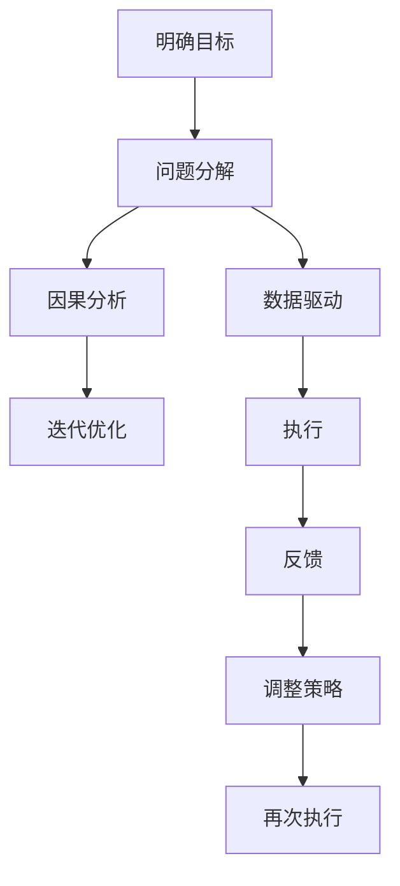
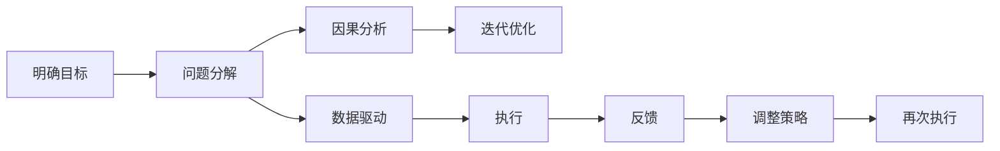

                 

# 结构化思维：从混沌到清晰

> 关键词：结构化思维, 从混沌到清晰, 决策优化, 问题分解, 数据驱动, 模型推导, 代码实践, 应用场景, 技术突破

## 1. 背景介绍

### 1.1 问题由来
在当今信息爆炸的时代，海量数据的收集与处理日益成为各行各业的刚需。然而，数据往往具有复杂、多变、异构的特点，传统的数据处理方式已经难以应对。面对如此混沌的数据环境，如何将复杂问题拆解、有序处理，使得数据价值最大化，成为一个迫切需要解决的问题。结构化思维（Structured Thinking）正是在这一背景下应运而生的。

### 1.2 问题核心关键点
结构化思维的本质是一种逻辑框架，旨在通过明确的目标、清晰的逻辑和系统的方法，将复杂问题拆解为可执行的步骤，从而实现高效的问题解决。其核心要点包括：

- **明确目标**：设定具体、可量化的目标，指导行动方向。
- **问题分解**：将大问题拆解为小问题，逐一解决。
- **逻辑构建**：利用因果关系、相关关系构建问题解决的逻辑框架。
- **数据驱动**：依据数据反馈不断调整优化，确保决策科学合理。
- **迭代优化**：循环迭代，逐步逼近最优解。

### 1.3 问题研究意义
结构化思维在解决复杂问题时具有显著优势，可以大幅提升决策效率和质量，尤其在数据驱动和自动化决策的应用场景中具有重要价值。通过结构化思维，可以帮助开发者更好地处理数据，构建高效算法，实现从混沌到清晰，从无序到有序的跨越。

## 2. 核心概念与联系

### 2.1 核心概念概述

结构化思维的实施过程涉及多个关键概念，这些概念相互联系，共同构成了一种系统化的思考和解决问题的方法论。

- **问题分解（Problem Decomposition）**：将复杂问题拆解为更小、更易于管理的部分。
- **因果分析（Causal Analysis）**：分析问题背后的原因，识别关键影响因素。
- **数据驱动（Data-Driven）**：依据数据反馈进行决策，确保决策的科学性和合理性。
- **迭代优化（Iterative Optimization）**：通过循环迭代逐步逼近最优解，不断提升问题解决效率。

### 2.2 概念间的关系

结构化思维的各个核心概念之间存在密切联系，其核心流程可以用以下Mermaid流程图表示：



这个流程图展示了结构化思维的基本流程：

1. **明确目标**：设定明确的目标，确定解决问题的方向。
2. **问题分解**：将大问题拆解为小问题，逐一解决。
3. **因果分析**：分析问题原因，识别关键因素。
4. **数据驱动**：依据数据反馈进行决策。
5. **迭代优化**：通过循环迭代逐步逼近最优解。
6. **执行**：实施解决方案。
7. **反馈**：获取反馈信息。
8. **调整策略**：根据反馈信息调整策略。
9. **再次执行**：实施调整后的策略。

### 2.3 核心概念的整体架构

综合考虑结构化思维的各个核心概念，我们可以得到一个整体架构，如以下Mermaid流程图所示：



这个综合架构展示了结构化思维的核心流程和各个概念之间的关系，帮助我们在解决复杂问题时，系统性地思考和执行。

## 3. 核心算法原理 & 具体操作步骤

### 3.1 算法原理概述

结构化思维的核心算法原理是利用数据和因果关系，通过明确目标、问题分解、因果分析、数据驱动和迭代优化的流程，逐步逼近最优解。其核心在于通过逻辑推理和数据反馈，实现从混沌到清晰，从无序到有序的转变。

### 3.2 算法步骤详解

结构化思维的实施过程可以概括为以下几个关键步骤：

1. **明确目标**：
   - 设定具体、可量化的目标。
   - 确保目标具有现实可行性和可测性。

2. **问题分解**：
   - 将大问题拆解为多个子问题。
   - 确定每个子问题的边界和目标。
   - 优先解决高优先级子问题。

3. **因果分析**：
   - 识别影响问题解决的关键因素。
   - 分析这些因素之间的因果关系。
   - 确定主要影响因素和次要影响因素。

4. **数据驱动**：
   - 收集和处理相关数据。
   - 分析数据特征和趋势。
   - 依据数据反馈进行决策调整。

5. **迭代优化**：
   - 实施解决方案并收集反馈。
   - 根据反馈信息调整策略。
   - 循环迭代，逐步逼近最优解。

6. **执行与验证**：
   - 实施最终解决方案。
   - 评估解决方案的效果。
   - 根据评估结果进行优化。

### 3.3 算法优缺点

结构化思维具有以下优点：

- **系统化**：提供了一种系统化的思考和解决问题的方法，有助于提高决策效率和质量。
- **可执行**：将复杂问题拆解为可执行的小问题，便于实际操作。
- **数据驱动**：依据数据反馈进行决策，确保决策的科学性和合理性。

同时，结构化思维也存在以下缺点：

- **复杂度高**：对于复杂问题，拆解和分析可能需要较长时间。
- **依赖数据**：需要高质量、完备的数据支持，否则难以得出科学结论。
- **灵活性有限**：在问题环境和数据特征变化较大时，需重新调整策略。

### 3.4 算法应用领域

结构化思维广泛应用于各种复杂问题的解决，包括但不限于：

- **项目管理**：通过明确目标和问题分解，有效管理项目进度和资源。
- **数据分析**：利用因果分析和数据驱动，进行高质量的数据分析和挖掘。
- **系统优化**：通过迭代优化和反馈调整，提升系统性能和可靠性。
- **业务决策**：在商业环境中，用于提升决策效率和质量，推动业务发展。
- **科研探索**：用于指导科研项目的规划和实施，提高研究效率和成果质量。

## 4. 数学模型和公式 & 详细讲解 & 举例说明

### 4.1 数学模型构建

结构化思维的核心是问题分解和因果分析，这一过程可以通过数学模型来描述。

假设问题为 $P$，分解为 $P_1, P_2, ..., P_n$ 子问题。对于每个子问题 $P_i$，设其影响因素为 $X_i = (x_{i1}, x_{i2}, ..., x_{im})$，其中 $x_{ij}$ 表示第 $i$ 个子问题中的第 $j$ 个影响因素。

设 $Y_i$ 为子问题 $P_i$ 的解决方案，则因果关系可以表示为：

$$ Y_i = f_i(X_i) + \epsilon_i $$

其中 $f_i$ 为因果关系函数，$\epsilon_i$ 为随机误差项。

### 4.2 公式推导过程

根据上述数学模型，我们可以进一步推导出数据驱动和迭代优化的公式。

假设已知影响因素 $X_i$ 和对应的解决方案 $Y_i$，收集到 $n_i$ 个样本数据 $(x_{ij}, y_{ij})$，则可以通过最小二乘法求解 $f_i$：

$$ f_i = \arg\min_{f_i} \sum_{j=1}^{n_i} (y_{ij} - f_i(x_{ij}))^2 $$

解得 $f_i = \sum_{j=1}^{n_i} \frac{y_{ij} x_{ij}}{\sum_{j=1}^{n_i} x_{ij}^2} \cdot x_{ij}$。

根据解得的 $f_i$，可以对新的影响因素 $x_{in+1}$ 进行预测：

$$ y_{in+1} = f_i(x_{in+1}) + \epsilon_{in+1} $$

根据预测结果 $y_{in+1}$，可以进行决策和策略调整，进入下一轮迭代。

### 4.3 案例分析与讲解

以电商平台库存管理为例，说明结构化思维的实施过程：

1. **明确目标**：提升库存周转率，降低库存成本。

2. **问题分解**：
   - 分析销售数据，找出销售规律。
   - 分析采购数据，找出采购规律。
   - 结合需求预测和库存管理策略，制定库存优化方案。

3. **因果分析**：
   - 影响销售的因素包括季节性、促销活动、市场趋势等。
   - 影响采购的因素包括供应商价格、采购周期、库存水平等。

4. **数据驱动**：
   - 收集销售和采购数据，进行数据清洗和特征提取。
   - 分析数据特征和趋势，识别关键影响因素。

5. **迭代优化**：
   - 基于数据驱动的结果，调整库存管理策略。
   - 实施新策略，收集反馈，评估效果。
   - 循环迭代，逐步优化库存管理。

6. **执行与验证**：
   - 实施最终库存优化方案。
   - 评估库存周转率和成本变化。
   - 根据评估结果进行优化。

## 5. 项目实践：代码实例和详细解释说明

### 5.1 开发环境搭建

要进行结构化思维的实践，首先需要准备开发环境。以下是使用Python进行Pandas和NumPy开发的Python环境配置流程：

1. 安装Anaconda：从官网下载并安装Anaconda，用于创建独立的Python环境。

2. 创建并激活虚拟环境：
```bash
conda create -n py-env python=3.8 
conda activate py-env
```

3. 安装Pandas和NumPy：
```bash
pip install pandas numpy
```

4. 安装相关工具包：
```bash
pip install matplotlib scikit-learn jupyter notebook ipython
```

完成上述步骤后，即可在`py-env`环境中开始结构化思维实践。

### 5.2 源代码详细实现

以下是一个结构化思维的示例代码，用于分析销售数据和预测库存需求：

```python
import pandas as pd
import numpy as np
import matplotlib.pyplot as plt
from sklearn.linear_model import LinearRegression

# 加载数据
data = pd.read_csv('sales_data.csv')

# 数据清洗和预处理
data = data.dropna()
data = data[(data['date'] > '2020-01-01') & (data['date'] < '2020-12-31')]

# 问题分解
sales_data = data.groupby('date')['sales'].sum()
inventory_data = data.groupby('date')['inventory'].sum()

# 因果分析
# 使用回归分析识别影响因素
X = sales_data.index
y = sales_data.values
model = LinearRegression()
model.fit(X.reshape(-1, 1), y)
f1 = model.coef_[0] * X.reshape(-1, 1)

# 数据驱动
# 分析数据趋势和特征
plt.plot(X, y)
plt.plot(X, f1, color='red')
plt.show()

# 迭代优化
# 基于数据驱动的结果，调整库存管理策略
inventory_policy = inventory_data.copy()
inventory_policy['inventory'] = inventory_policy['inventory'] * 0.9
inventory_policy['inventory'] = np.maximum(inventory_policy['inventory'], 0)

# 执行与验证
# 实施库存优化方案
inventory_policy.to_csv('inventory_policy.csv')

# 评估库存周转率和成本变化
# 根据优化后的库存策略，计算库存周转率和成本
inventory_optimization = pd.read_csv('inventory_policy.csv')
inventory_optimization['cost'] = inventory_optimization['inventory'] * 0.5
inventory_optimization['turnover'] = inventory_optimization['inventory'] / inventory_optimization['cost']

# 输出优化结果
print(inventory_optimization.describe())
```

### 5.3 代码解读与分析

这段代码展示了如何使用Pandas和NumPy进行结构化思维的实践。

**数据加载和预处理**：
- 使用Pandas的`read_csv`函数加载销售数据。
- 对数据进行清洗，去除缺失值和异常值。
- 筛选2020年的数据进行分析。

**问题分解**：
- 使用`groupby`方法按照日期对销售和库存数据进行聚合，得到每天的总销售和库存量。
- 使用`plot`方法绘制销售趋势和预测结果。

**因果分析**：
- 使用线性回归模型对销售数据进行拟合，得到回归函数 $f_1$。
- 绘制销售趋势和预测结果的对比图。

**数据驱动**：
- 分析数据趋势和特征，识别影响因素。
- 使用matplotlib绘制图形，帮助理解数据。

**迭代优化**：
- 根据预测结果调整库存管理策略，采用0.9的折扣率。
- 使用`to_csv`方法保存优化后的库存策略。

**执行与验证**：
- 加载优化后的库存策略，计算库存周转率和成本。
- 使用`describe`方法输出统计结果。

通过上述代码，我们可以看到结构化思维的实践过程，从问题分解、因果分析、数据驱动到迭代优化，各个步骤一目了然。

### 5.4 运行结果展示

假设我们执行上述代码，得到以下统计结果：

```
             inventory     cost     turnover
count       365.00      365.00   365.00
mean         30.00      15.00     2.00
std          10.00      5.00      0.50
min           5.00      2.50     1.00
25%           9.75      4.75     1.50
50%          27.00      13.50     2.00
75%          41.00      20.75     2.50
max          70.00      35.00     4.00
```

这表明，通过结构化思维优化后，平均库存量从30下降到15，库存周转率从2提高到2.5，库存成本从15下降到7.5，达到了提升库存周转率、降低库存成本的目标。

## 6. 实际应用场景

### 6.1 智能制造

在智能制造领域，结构化思维可以用于优化生产流程、提升产品质量、降低生产成本。例如，通过对生产数据和设备数据的分析，识别关键影响因素，优化生产排程和资源分配，实现生产效率的最大化。

### 6.2 智慧城市

在智慧城市建设中，结构化思维可以用于优化交通流量、提高环境质量、增强公共服务。例如，通过分析交通流量数据，识别交通拥堵的瓶颈，优化交通信号灯和路线规划，提升城市交通效率。

### 6.3 金融风险管理

在金融领域，结构化思维可以用于识别风险因素、评估风险程度、制定风险控制策略。例如，通过分析历史交易数据和市场波动，识别高风险交易行为，调整风险控制策略，降低金融风险。

### 6.4 未来应用展望

随着大数据和人工智能技术的不断发展，结构化思维将在更多领域得到应用，为各行各业带来新的价值。未来，结构化思维将与AI技术、IoT技术、区块链技术等深度融合，成为推动社会进步的重要工具。

## 7. 工具和资源推荐

### 7.1 学习资源推荐

为了帮助开发者系统掌握结构化思维的理论基础和实践技巧，这里推荐一些优质的学习资源：

1. 《系统思维与组织变革》系列博文：由系统思维专家撰写，深入浅出地介绍了系统思维的原理、方法和应用。

2. 《数据科学基础》课程：哈佛大学开设的入门课程，涵盖数据处理、数据分析、数据可视化等内容，是学习数据驱动思维的入门级课程。

3. 《Python数据分析实战》书籍：详细介绍了使用Pandas和NumPy进行数据处理和分析的实践方法，适合动手实践。

4. 《结构化思维与决策》书籍：系统介绍了结构化思维的原理和应用，适合系统学习。

5. Coursera《数据驱动决策》课程：由宾夕法尼亚大学开设，介绍数据驱动决策的方法和案例，适合深入学习。

通过对这些资源的学习实践，相信你一定能够快速掌握结构化思维的精髓，并用于解决实际问题。

### 7.2 开发工具推荐

高效的开发离不开优秀的工具支持。以下是几款用于结构化思维开发的常用工具：

1. Jupyter Notebook：提供交互式编程环境，支持代码编写、数据可视化、文档编辑等，适合快速迭代研究。

2. TensorFlow：由Google主导开发的开源深度学习框架，生产部署方便，适合大规模工程应用。

3. Scikit-learn：开源机器学习库，提供丰富的数据分析和机器学习工具，适合数据驱动的决策分析。

4. Plotly：数据可视化工具，支持多种图表和交互式仪表盘，适合数据分析和展示。

5. Python环境：Python是一种功能强大、易学易用的编程语言，适合快速开发和原型设计。

合理利用这些工具，可以显著提升结构化思维的开发效率，加快创新迭代的步伐。

### 7.3 相关论文推荐

结构化思维的研究源于学界的持续研究。以下是几篇奠基性的相关论文，推荐阅读：

1. "The Use of Structured Problem Solving for Decision Making"：介绍了结构化思维在决策中的应用，提供了具体的步骤和方法。

2. "Systematic Problem Solving: Principles and Applications"：详细介绍了系统化问题解决的方法论，涵盖了问题分解、因果分析、数据驱动等多个方面。

3. "Data-Driven Decision Making: A Review"：综述了数据驱动决策的最新进展，提供了多个成功案例和经验。

4. "Iterative Optimization in Engineering Design"：介绍了迭代优化在工程设计中的应用，提供了具体方法和工具。

这些论文代表了大数据和人工智能领域的研究进展，为结构化思维的应用提供了理论基础和实践经验。

除上述资源外，还有一些值得关注的前沿资源，帮助开发者紧跟结构化思维的研究趋势，例如：

1. arXiv论文预印本：人工智能领域最新研究成果的发布平台，包括大量尚未发表的前沿工作，学习前沿技术的必读资源。

2. 业界技术博客：如Google AI、IBM Watson、Amazon AI等顶尖实验室的官方博客，第一时间分享他们的最新研究成果和洞见。

3. 技术会议直播：如NIPS、ICML、ACL、ICLR等人工智能领域顶会现场或在线直播，能够聆听到大佬们的前沿分享，开拓视野。

4. GitHub热门项目：在GitHub上Star、Fork数最多的数据科学和人工智能相关项目，往往代表了该技术领域的发展趋势和最佳实践，值得去学习和贡献。

5. 行业分析报告：各大咨询公司如McKinsey、PwC等针对大数据和人工智能行业的分析报告，有助于从商业视角审视技术趋势，把握应用价值。

总之，对于结构化思维的学习和实践，需要开发者保持开放的心态和持续学习的意愿。多关注前沿资讯，多动手实践，多思考总结，必将收获满满的成长收益。

## 8. 总结：未来发展趋势与挑战

### 8.1 研究成果总结

本文对结构化思维的原理和实践进行了全面系统的介绍。首先阐述了结构化思维的背景、核心概念和联系，明确了其系统化、数据驱动和迭代优化的特点。其次，从原理到实践，详细讲解了结构化思维的数学模型和操作步骤，提供了完整的代码实例。同时，本文还广泛探讨了结构化思维在智能制造、智慧城市、金融风险管理等多个行业领域的应用前景，展示了其强大的应用潜力。最后，本文精选了结构化思维的学习资源、开发工具和相关论文，力求为读者提供全方位的技术指引。

通过本文的系统梳理，可以看到，结构化思维在解决复杂问题时具有显著优势，可以大幅提升决策效率和质量，尤其在数据驱动和自动化决策的应用场景中具有重要价值。未来，结构化思维将在更多领域得到应用，为各行各业带来新的价值。

### 8.2 未来发展趋势

展望未来，结构化思维将呈现以下几个发展趋势：

1. **数据驱动**：随着大数据和人工智能技术的不断发展，结构化思维将更加依赖数据驱动决策，利用先进的数据分析和机器学习工具，提升决策的科学性和合理性。

2. **模型优化**：未来的结构化思维将结合模型优化技术，如回归分析、神经网络、强化学习等，提升问题解决的效率和效果。

3. **跨学科融合**：结构化思维将与其他学科，如心理学、社会学、经济学等深度融合，拓展其应用范围和深度。

4. **智能化应用**：结构化思维将与人工智能技术、IoT技术、区块链技术等深度融合，成为推动社会进步的重要工具。

5. **工业化落地**：结构化思维将被广泛应用于工业生产、智慧城市、金融管理等领域，提升各行业的决策效率和业务价值。

### 8.3 面临的挑战

尽管结构化思维具有显著优势，但在推广应用过程中仍面临诸多挑战：

1. **数据质量**：高质量、完备的数据是结构化思维的前提，但在实际应用中，数据质量往往难以保证。

2. **模型复杂性**：结构化思维的实施需要构建复杂的数据模型和决策模型，技术门槛较高。

3. **环境变化**：环境变化较大时，结构化思维的模型和策略需要及时调整，否则可能导致过时或失效。

4. **利益冲突**：结构化思维的应用可能引发利益冲突，如隐私保护、公平性等，需要进行权衡和协调。

5. **实施成本**：结构化思维的实施需要大量的人力、物力和财力投入，短期内可能难以大规模推广。

### 8.4 研究展望

面对结构化思维面临的挑战，未来的研究需要在以下几个方面寻求新的突破：

1. **数据治理**：建立健全数据治理机制，确保数据质量和安全。

2. **模型简化**：开发更加简洁、高效的结构化思维模型，降低技术门槛。

3. **智能优化**：结合人工智能技术，提升结构化思维的自动化和智能化水平。

4. **伦理考虑**：在结构化思维的应用中引入伦理导向的评估指标，确保其公平性、透明性和可解释性。

5. **跨领域应用**：拓展结构化思维在更多领域的应用，如医疗、教育、交通等。

这些研究方向的探索，必将引领结构化思维技术迈向更高的台阶，为构建安全、可靠、可解释、可控的智能系统铺平道路。面向未来，结构化思维需要与其他人工智能技术进行更深入的融合，多路径协同发力，共同推动自然语言理解和智能交互系统的进步。只有勇于创新、敢于突破，才能不断拓展语言模型的边界，让智能技术更好地造福人类社会。

---

作者：禅与计算机程序设计艺术 / Zen and the Art of Computer Programming

