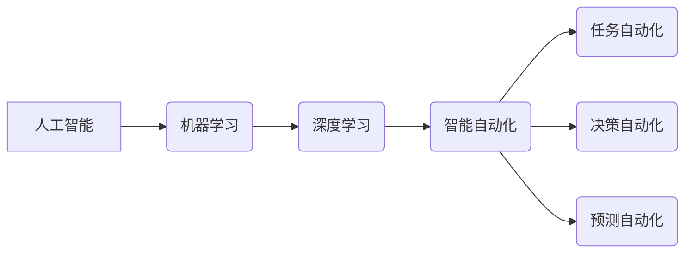

> 自动化革命，人工智能，机器学习，深度学习，智能自动化，软件工程，未来趋势

# Andrej Karpathy谈自动化革命

## 1. 背景介绍

自动化，作为工业革命后的又一次重大技术变革，正深刻地影响着我们的工作、生活和思维方式。在当代，随着人工智能、机器学习和深度学习的飞速发展，自动化技术已经进入了一个新的时代。Andrej Karpathy，作为深度学习领域的杰出代表，对自动化革命有着深刻的见解和实践。本文将基于Andrej Karpathy的观点，探讨自动化革命的内涵、影响以及未来发展趋势。

## 2. 核心概念与联系

### 2.1 核心概念

#### 2.1.1 人工智能
人工智能（Artificial Intelligence, AI）是指由人制造出来的系统所表现出的智能行为。它包括机器学习、深度学习、知识表示、自然语言处理等多个子领域。

#### 2.1.2 机器学习
机器学习（Machine Learning, ML）是人工智能的一个分支，它使计算机能够通过数据学习并做出决策或预测，而不是通过明确的编程指令。

#### 2.1.3 深度学习
深度学习（Deep Learning, DL）是机器学习的一个子集，它使用多层神经网络来学习数据的复杂模式。

#### 2.1.4 智能自动化
智能自动化（Intelligent Automation）是指使用人工智能技术来自动化重复性、结构化和半结构化的任务。

### 2.2 Mermaid 流程图



### 2.3 核心概念联系

人工智能是整个自动化革命的核心，它包括了机器学习和深度学习这两个子领域。智能自动化则是人工智能在各个领域的具体应用，包括任务自动化、决策自动化和预测自动化。

## 3. 核心算法原理 & 具体操作步骤

### 3.1 算法原理概述

自动化革命的核心在于通过机器学习和深度学习算法，使计算机能够自动执行原本需要人工完成的任务。这些算法通过学习大量的数据，提取特征，建立模型，从而实现对任务的自动化。

### 3.2 算法步骤详解

#### 3.2.1 数据收集
收集大量相关数据，用于训练和测试模型。

#### 3.2.2 数据预处理
对收集到的数据进行清洗、转换和格式化，以便模型能够有效学习。

#### 3.2.3 模型选择
选择合适的机器学习或深度学习模型，如神经网络、支持向量机等。

#### 3.2.4 模型训练
使用训练数据对模型进行训练，调整模型参数，使其能够准确预测或决策。

#### 3.2.5 模型评估
使用测试数据评估模型的性能，根据评估结果调整模型参数或选择其他模型。

#### 3.2.6 模型部署
将训练好的模型部署到实际应用中，进行自动化任务。

### 3.3 算法优缺点

#### 3.3.1 优点
- 提高效率：自动化可以显著提高任务完成速度，减少人力成本。
- 减少错误：自动化可以减少人为错误，提高任务准确性。
- 增强可扩展性：自动化系统可以轻松扩展，适应不同规模的任务。

#### 3.3.2 缺点
- 投资成本：自动化系统的开发和部署需要一定的投资。
- 技术依赖：自动化系统需要专业技术人员进行维护和管理。
- 失业风险：自动化可能导致一些工作被机器取代。

### 3.4 算法应用领域

自动化技术在各个领域都有广泛的应用，包括：

- 制造业
- 金融业
- 零售业
- 医疗保健
- 交通运输
- 媒体和娱乐

## 4. 数学模型和公式 & 详细讲解 & 举例说明

### 4.1 数学模型构建

自动化革命中的数学模型通常包括以下几种：

#### 4.1.1 机器学习模型
- 线性回归
- 支持向量机
- 随机森林

#### 4.1.2 深度学习模型
- 神经网络
- 卷积神经网络（CNN）
- 循环神经网络（RNN）

### 4.2 公式推导过程

以线性回归为例，其目标是最小化预测值与真实值之间的平方差。公式如下：

$$
\min_{\theta} \sum_{i=1}^{n}(h_\theta(x^{(i)}) - y^{(i)})^2
$$

其中，$\theta$ 是模型参数，$x^{(i)}$ 是输入特征，$y^{(i)}$ 是真实标签，$h_\theta(x^{(i)})$ 是模型的预测值。

### 4.3 案例分析与讲解

#### 4.3.1 图像识别

使用卷积神经网络（CNN）进行图像识别是一个典型的自动化应用案例。CNN通过学习图像的局部特征，实现对图像的分类。以下是一个简单的CNN模型示例：

```python
import torch.nn as nn

class SimpleCNN(nn.Module):
    def __init__(self):
        super(SimpleCNN, self).__init__()
        self.conv1 = nn.Conv2d(3, 32, kernel_size=3, stride=1, padding=1)
        self.relu = nn.ReLU()
        self.pool = nn.MaxPool2d(kernel_size=2, stride=2)
        self.fc1 = nn.Linear(32 * 16 * 16, 128)
        self.fc2 = nn.Linear(128, 10)

    def forward(self, x):
        x = self.conv1(x)
        x = self.relu(x)
        x = self.pool(x)
        x = x.view(-1, 32 * 16 * 16)
        x = self.fc1(x)
        x = self.relu(x)
        x = self.fc2(x)
        return x
```

该模型包含一个卷积层、两个全连接层和一个ReLU激活函数。通过训练，该模型能够从输入图像中提取特征，并将其分类为10个类别。

## 5. 项目实践：代码实例和详细解释说明

### 5.1 开发环境搭建

为了进行自动化项目的实践，你需要以下开发环境：

- Python 3.x
- PyTorch
- NumPy
- Matplotlib

### 5.2 源代码详细实现

以下是一个简单的图像识别项目的源代码示例：

```python
import torch
import torch.nn as nn
import torchvision.transforms as transforms
from torch.utils.data import DataLoader
from torchvision import datasets, models

# 数据预处理
transform = transforms.Compose([
    transforms.Resize(256),
    transforms.CenterCrop(224),
    transforms.ToTensor(),
    transforms.Normalize(mean=[0.485, 0.456, 0.406], std=[0.229, 0.224, 0.225])
])

# 加载数据集
train_dataset = datasets.ImageFolder(root='data/train', transform=transform)
train_loader = DataLoader(dataset=train_dataset, batch_size=32, shuffle=True)

# 加载预训练模型
model = models.resnet18(pretrained=True)

# 修改模型结构
model.fc = nn.Linear(model.fc.in_features, 10)

# 定义损失函数和优化器
criterion = nn.CrossEntropyLoss()
optimizer = torch.optim.SGD(model.parameters(), lr=0.001, momentum=0.9)

# 训练模型
for epoch in range(10):
    model.train()
    for inputs, labels in train_loader:
        optimizer.zero_grad()
        outputs = model(inputs)
        loss = criterion(outputs, labels)
        loss.backward()
        optimizer.step()
    print(f"Epoch {epoch+1}, Loss: {loss.item()}")

# 保存模型
torch.save(model.state_dict(), 'model.pth')
```

### 5.3 代码解读与分析

上述代码实现了以下功能：

- 数据预处理：将图像转换为模型所需的格式。
- 加载数据集：从指定目录加载训练数据集。
- 加载预训练模型：加载ResNet18模型作为特征提取器。
- 修改模型结构：将原始模型的分类层替换为具有10个输出节点的全连接层。
- 定义损失函数和优化器：使用交叉熵损失函数和SGD优化器。
- 训练模型：在训练数据上迭代训练模型。
- 保存模型：将训练好的模型保存到文件中。

### 5.4 运行结果展示

运行上述代码后，模型将在训练数据上进行迭代训练，并在每个epoch结束后输出损失值。最终，模型将学习到图像特征，并能够对新的图像进行分类。

## 6. 实际应用场景

自动化技术在各个领域都有广泛的应用，以下是一些典型的应用场景：

### 6.1 制造业

在制造业中，自动化技术可以用于生产线的自动化控制、质量检测、设备维护等。

### 6.2 金融业

在金融业中，自动化技术可以用于风险控制、交易执行、客户服务、信用评估等。

### 6.3 零售业

在零售业中，自动化技术可以用于库存管理、商品推荐、客户服务、供应链管理等。

### 6.4 医疗保健

在医疗保健领域，自动化技术可以用于医学影像分析、疾病诊断、药物研发、健康管理等。

## 7. 工具和资源推荐

### 7.1 学习资源推荐

- 《深度学习》（Ian Goodfellow, Yoshua Bengio, Aaron Courville）
- 《Python机器学习》（ Sebastian Raschka, Vahid Mirjalili）
- Coursera、Udacity等在线课程

### 7.2 开发工具推荐

- PyTorch
- TensorFlow
- Scikit-learn
- Keras

### 7.3 相关论文推荐

- "ImageNet Classification with Deep Convolutional Neural Networks" (Alex Krizhevsky et al., 2012)
- "AlexNet: Image Classification with Deep Convolutional Neural Networks" (Alex Krizhevsky et al., 2012)
- "VGGNet: Very Deep Convolutional Networks for Large-Scale Visual Recognition" (Karen Simonyan and Andrew Zisserman, 2014)
- "GoogLeNet: Intra-Net Translations of Deep Neural Networks for Visual Recognition" (Christian Szegedy et al., 2014)

## 8. 总结：未来发展趋势与挑战

### 8.1 研究成果总结

自动化革命正在深刻地改变着我们的世界，人工智能、机器学习和深度学习等技术为自动化提供了强大的技术支撑。通过自动化，我们可以提高效率、减少错误、增强可扩展性，从而推动各行各业的发展。

### 8.2 未来发展趋势

#### 8.2.1 人工智能将更加普及
随着技术的进步和成本的降低，人工智能将更加普及，渗透到更多的领域。

#### 8.2.2 自动化将更加智能化
未来的自动化系统将更加智能化，能够处理更加复杂的问题。

#### 8.2.3 跨学科融合将更加紧密
自动化技术将与其他学科（如生物学、心理学、社会学等）进行更加紧密的融合。

### 8.3 面临的挑战

#### 8.3.1 道德和伦理问题
自动化技术的发展引发了一系列道德和伦理问题，如失业、隐私、安全等。

#### 8.3.2 技术局限
现有的自动化技术仍然存在一定的局限性，如对数据的依赖、模型的泛化能力等。

#### 8.3.3 人才短缺
自动化技术的发展需要大量的人才，但目前人才短缺是一个普遍问题。

### 8.4 研究展望

为了应对未来的挑战，我们需要：

- 加强人工智能伦理和道德的研究，确保技术的发展符合人类的利益。
- 探索更加鲁棒、高效的自动化技术，减少对数据的依赖，提高模型的泛化能力。
- 加大人才培养力度，为自动化技术的发展提供充足的人才支持。

## 9. 附录：常见问题与解答

**Q1：什么是自动化革命？**

A：自动化革命是指通过人工智能、机器学习和深度学习等技术，使计算机能够自动执行原本需要人工完成的任务的一场技术变革。

**Q2：自动化革命会对就业市场产生什么影响？**

A：自动化革命可能会导致一些工作岗位被机器取代，但同时也将会创造出新的工作岗位，并对劳动力市场产生结构性变化。

**Q3：如何确保自动化技术的发展符合人类的利益？**

A：需要加强人工智能伦理和道德的研究，制定相应的法律法规，确保技术的发展符合人类的利益。

**Q4：自动化技术有哪些应用场景？**

A：自动化技术可以应用于制造业、金融业、零售业、医疗保健、交通运输、媒体和娱乐等多个领域。

**Q5：自动化技术的发展前景如何？**

A：自动化技术的发展前景非常广阔，它将深刻地改变我们的世界，推动各行各业的发展。

---

作者：禅与计算机程序设计艺术 / Zen and the Art of Computer Programming