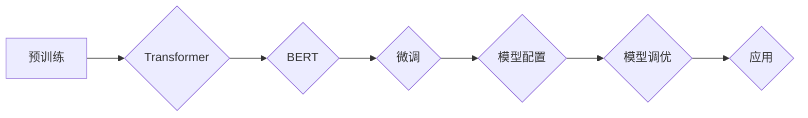

# Transformer大模型实战 BERT 的其他配置

> 关键词：Transformer, BERT, 预训练, 微调, 配置，自然语言处理, NLP, 模型调优, 实践

## 1. 背景介绍

自Transformer模型及其变体BERT（Bidirectional Encoder Representations from Transformers）在自然语言处理（NLP）领域的惊艳表现以来，基于BERT的模型已经成为NLP研究和应用的主流。BERT通过预训练和微调，能够有效地学习到丰富的语言知识，并在各种NLP任务上取得优异的性能。本文将深入探讨BERT的配置细节，帮助读者掌握如何进行模型调优和配置，以实现更好的模型效果。

## 2. 核心概念与联系

### 2.1 核心概念

- **Transformer模型**：一种基于自注意力机制（Self-Attention）的神经网络模型，能够有效地捕捉序列数据中的长距离依赖关系。
- **BERT模型**：基于Transformer的预训练语言表示模型，通过双向Transformer编码器学习到通用的语言表示。
- **预训练**：在大规模无标签语料上进行训练，使模型学习到语言的通用知识。
- **微调**：在预训练模型的基础上，使用少量有标签数据进行训练，以适应特定任务。
- **模型配置**：包括模型架构、超参数设置、训练和评估策略等。

### 2.2 架构的 Mermaid 流程图



## 3. 核心算法原理 & 具体操作步骤

### 3.1 算法原理概述

BERT模型的核心是Transformer编码器，它由多个Transformer层堆叠而成。每个Transformer层包含自注意力（Self-Attention）和前馈神经网络（Feed-Forward Neural Network）两个主要部分。自注意力机制允许模型在处理序列数据时关注不同位置的信息，从而捕捉长距离依赖关系。

### 3.2 算法步骤详解

1. **预训练**：
    - 使用大规模无标签语料进行预训练，包括掩码语言模型（Masked Language Model, MLM）和下一句预测（Next Sentence Prediction, NSP）任务。
    - 通过预训练，模型学习到丰富的语言知识，并生成预训练的模型参数。

2. **微调**：
    - 使用下游任务的有标签数据进行微调，包括调整预训练模型参数，以适应特定任务。
    - 可以使用交叉熵损失函数等来评估和优化模型性能。

3. **模型配置**：
    - 选择合适的预训练模型版本，如BERT-base、BERT-large等。
    - 设置模型架构参数，如层数、隐藏层维度、注意力头数等。
    - 调整超参数，如学习率、批大小、迭代轮数等。

4. **模型调优**：
    - 使用验证集评估模型性能，并根据评估结果调整超参数和模型架构。
    - 可以尝试不同的正则化技术，如Dropout、权重衰减等，以避免过拟合。

### 3.3 算法优缺点

**优点**：
- **强大的语言理解能力**：BERT能够学习到丰富的语言知识，并在各种NLP任务上取得优异的性能。
- **参数高效**：预训练模型可以复用于多个下游任务，只需进行微调即可适应新任务。
- **可解释性强**：Transformer结构使得模型的可解释性较强，便于理解和分析。

**缺点**：
- **计算量大**：预训练和微调过程需要大量的计算资源。
- **训练时间长**：预训练和微调过程需要较长的训练时间。
- **数据依赖性高**：预训练和微调的效果很大程度上取决于数据的质量和数量。

### 3.4 算法应用领域

BERT及其变体在以下NLP任务上取得了显著成果：

- **文本分类**：如情感分析、主题分类、垃圾邮件检测等。
- **序列标注**：如命名实体识别、词性标注等。
- **问答系统**：如机器阅读理解、开放域问答等。
- **机器翻译**：如英译中、中译英等。
- **文本摘要**：如自动文摘、摘要生成等。

## 4. 数学模型和公式 & 详细讲解 & 举例说明

### 4.1 数学模型构建

BERT模型的核心是Transformer编码器，其数学模型如下：

$$
\text{Transformer} = \text{Multi-Head Attention} \times \text{Feed-Forward Neural Network}
$$

其中，Multi-Head Attention机制如下：

$$
\text{Self-Attention} = \text{Query} \times \text{Key} \times \text{Value}
$$

### 4.2 公式推导过程

Self-Attention机制的计算过程如下：

1. **查询（Query）**：将输入序列的每个词向量通过线性变换得到Query向量。
2. **键（Key）**：将Query向量通过线性变换得到Key向量。
3. **值（Value）**：将输入序列的每个词向量通过线性变换得到Value向量。
4. **注意力权重**：计算每个Query与所有Key之间的注意力权重，并通过softmax函数进行归一化。
5. **加权求和**：将注意力权重与对应的Value向量进行加权求和，得到输出向量。

### 4.3 案例分析与讲解

以下是一个简单的BERT模型示例：

```python
import torch
import torch.nn as nn

class TransformerModel(nn.Module):
    def __init__(self, input_dim, hidden_dim, num_heads):
        super(TransformerModel, self).__init__()
        self.hidden_dim = hidden_dim
        self.num_heads = num_heads

        self.query_layer = nn.Linear(input_dim, hidden_dim)
        self.key_layer = nn.Linear(input_dim, hidden_dim)
        self.value_layer = nn.Linear(input_dim, hidden_dim)

        self.attention = nn.MultiheadAttention(self.num_heads, hidden_dim)
        self.feed_forward = nn.Sequential(
            nn.Linear(hidden_dim, hidden_dim * 4),
            nn.ReLU(),
            nn.Linear(hidden_dim * 4, hidden_dim)
        )

    def forward(self, x):
        query = self.query_layer(x)
        key = self.key_layer(x)
        value = self.value_layer(x)

        attention_output, _ = self.attention(query, key, value)
        output = self.feed_forward(attention_output)
        return output
```

这个示例中，我们定义了一个简单的Transformer模型，它包含一个多头注意力层和一个前馈神经网络层。通过修改输入维度、隐藏层维度和注意力头数等参数，可以构建不同规模的BERT模型。

## 5. 项目实践：代码实例和详细解释说明

### 5.1 开发环境搭建

在进行BERT模型实践前，需要安装以下软件和库：

- Python 3.6+
- PyTorch 1.2+
- Transformers库

### 5.2 源代码详细实现

以下是一个使用Transformers库构建BERT模型的示例：

```python
from transformers import BertModel, BertTokenizer

# 加载预训练的BERT模型和分词器
model = BertModel.from_pretrained('bert-base-uncased')
tokenizer = BertTokenizer.from_pretrained('bert-base-uncased')

# 加载示例文本
text = "Hello, world!"

# 将文本转换为模型输入格式
input_ids = tokenizer.encode_plus(text, return_tensors='pt')

# 前向传播
outputs = model(**input_ids)

# 获取输出
last_hidden_states = outputs.last_hidden_state
pooler_output = outputs.pooler_output
```

这个示例中，我们加载了一个预训练的BERT模型和对应的分词器，然后使用分词器将示例文本转换为模型输入格式，并通过前向传播得到模型的输出。

### 5.3 代码解读与分析

- `BertModel.from_pretrained('bert-base-uncased')`：加载预训练的BERT模型。
- `BertTokenizer.from_pretrained('bert-base-uncased')`：加载对应的分词器。
- `tokenizer.encode_plus(text, return_tensors='pt')`：将文本转换为模型输入格式。
- `model(**input_ids)`：通过前向传播得到模型的输出。

### 5.4 运行结果展示

输出结果包含以下内容：

- `last_hidden_states`：最后一个隐藏层的状态，可以用于下游任务。
- `pooler_output`：全局池化输出，可以用于文本分类等任务。

## 6. 实际应用场景

BERT模型在以下实际应用场景中表现出色：

- **文本分类**：如情感分析、主题分类、垃圾邮件检测等。
- **序列标注**：如命名实体识别、词性标注等。
- **问答系统**：如机器阅读理解、开放域问答等。
- **机器翻译**：如英译中、中译英等。
- **文本摘要**：如自动文摘、摘要生成等。

## 7. 工具和资源推荐

### 7.1 学习资源推荐

- 《BERT: Pre-training of Deep Bidirectional Transformers for Language Understanding》
- 《Natural Language Processing with Transformers》
- 《深度学习自然语言处理》

### 7.2 开发工具推荐

- PyTorch
- Transformers库
- Hugging Face

### 7.3 相关论文推荐

- **BERT**: https://arxiv.org/abs/1810.04805
- **Transformers**: https://arxiv.org/abs/1706.03762

## 8. 总结：未来发展趋势与挑战

### 8.1 研究成果总结

BERT模型及其变体在NLP领域取得了显著的成果，为各种NLP任务提供了强大的语言表示和推理能力。随着预训练模型和微调方法的不断改进，BERT的应用场景将越来越广泛。

### 8.2 未来发展趋势

- **更大规模的预训练模型**：随着计算资源的提升，将出现更多参数量和更大规模的预训练模型。
- **更高效的微调方法**：开发更高效的微调方法，降低微调成本，提高模型性能。
- **多模态预训练**：将BERT扩展到多模态数据，如图像、视频等，实现跨模态理解。

### 8.3 面临的挑战

- **计算资源限制**：预训练和微调过程需要大量的计算资源。
- **数据偏见**：预训练模型可能存在数据偏见，需要采取措施消除偏见。
- **模型可解释性**：提高模型的可解释性，使其决策过程更透明。

### 8.4 研究展望

未来，BERT及其变体将在NLP领域发挥更大的作用，推动NLP技术的发展和应用。同时，需要不断改进预训练模型和微调方法，以应对新的挑战。

## 9. 附录：常见问题与解答

**Q1：什么是BERT？**

A：BERT（Bidirectional Encoder Representations from Transformers）是一种基于Transformer的预训练语言表示模型，能够学习到丰富的语言知识，并在各种NLP任务上取得优异的性能。

**Q2：如何选择合适的BERT模型版本？**

A：选择合适的BERT模型版本取决于具体的应用场景和计算资源。对于通用任务，可以使用BERT-base或BERT-large。对于特定领域任务，可以使用针对该领域预训练的BERT模型。

**Q3：如何进行BERT模型的微调？**

A：首先，使用预训练的BERT模型；然后，在下游任务的数据集上进行微调；最后，评估和优化模型性能。

**Q4：如何解决BERT模型的过拟合问题？**

A：可以使用以下方法解决BERT模型的过拟合问题：
- 使用正则化技术，如Dropout、权重衰减等。
- 使用早期停止策略，当验证集性能不再提升时停止训练。
- 使用更多数据或进行数据增强。

**Q5：BERT模型的未来发展方向是什么？**

A：BERT模型的未来发展方向包括：
- 开发更大规模的预训练模型。
- 开发更高效的微调方法。
- 将BERT扩展到多模态数据。