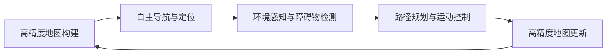

                 

# 端到端自动驾驶的自主代客泊车服务

## 1. 背景介绍

### 1.1 问题由来
随着电动汽车和自动驾驶技术的快速发展，无人驾驶车辆在城市中的应用变得越来越普遍。然而，电动汽车在城市停车位的紧张问题上显得尤为突出。相较于传统汽车，电动汽车电池耗电量高，充电时间长，需要频繁进行充电，使得在城市中的停放需求更迫切。因此，如何高效、智能地解决电动汽车的停车问题，成为了行业和研究者亟待解决的难题。

### 1.2 问题核心关键点
自主代客泊车服务（Automatic Valet Parking）是一个典型的无人驾驶应用场景。它通过自动驾驶技术与自主导航系统结合，实现车辆在无人监管下自主进入停车位，然后自动寻找充电站进行充电，并最终将车辆送回指定位置，整个过程无需人工干预。该服务在提升电动汽车使用效率的同时，也缓解了城市停车压力。

然而，构建一个稳定可靠的自主代客泊车服务系统，涉及多个关键技术环节，如高精度地图构建、自主导航与定位、环境感知与障碍物检测、路径规划与运动控制等。如何将这些技术模块高效地集成在一起，构建端到端（End-to-End）自动驾驶系统，是实现自主代客泊车服务的核心挑战。

### 1.3 问题研究意义
构建端到端的自主代客泊车服务系统，对于推动电动汽车普及、提升城市交通效率、减少碳排放具有重要意义：

1. **提升用户体验**：无人驾驶技术的应用，使得停车变得更加便捷、安全，用户无需等待，即可享受高品质的停车服务。
2. **优化资源配置**：通过自动寻找空闲停车位和充电站，优化电动汽车资源配置，减少资源浪费。
3. **降低运营成本**：无需人工监管，减少了人力成本和运营复杂度，降低整体运营成本。
4. **推动技术发展**：自主代客泊车服务是无人驾驶技术的典型应用，对推动无人驾驶技术的发展具有示范效应。
5. **响应环保诉求**：减少因人工驾驶停车产生的排放，有助于应对气候变化，响应环保诉求。

## 2. 核心概念与联系

### 2.1 核心概念概述

为更好地理解自主代客泊车服务系统的构建，本节将介绍几个核心概念：

- **高精度地图构建**：通过激光雷达、摄像头、GPS等多种传感器，对道路及停车位进行精细化扫描，生成高精度地图数据，为车辆提供精确的导航信息。
- **自主导航与定位**：基于高精度地图和实时传感器数据，通过算法实现车辆的自主导航与定位，保证车辆始终在预定路径上行驶。
- **环境感知与障碍物检测**：通过多传感器融合技术，实时检测车辆周围的环境信息，识别出障碍物和潜在风险。
- **路径规划与运动控制**：根据车辆当前位置、目的地和环境信息，规划最优路径，并控制车辆在路径上的运动，避开障碍物，安全到达目的地。

这些核心概念之间存在着紧密的联系，通过合理的集成和调度，可以实现自主代客泊车服务的全流程自动化。

### 2.2 概念间的关系

这些核心概念之间的关系可以通过以下Mermaid流程图来展示：



这个流程图展示了自主代客泊车服务系统中各核心概念的联系：

1. 高精度地图构建为自主导航与定位提供了基础数据。
2. 自主导航与定位根据高精度地图和实时传感器数据，实现车辆的精确控制。
3. 环境感知与障碍物检测提供实时环境信息，辅助路径规划与运动控制。
4. 路径规划与运动控制根据导航和感知信息，生成最优路径并控制车辆运动。
5. 高精度地图定期更新，保证数据的时效性和准确性。

## 3. 核心算法原理 & 具体操作步骤
### 3.1 算法原理概述

自主代客泊车服务系统的核心算法原理，包括高精度地图构建、自主导航与定位、环境感知与障碍物检测、路径规划与运动控制等模块。

- **高精度地图构建**：使用激光雷达、摄像头、GPS等多种传感器，对道路及停车位进行精确扫描，生成高精度地图数据。主要算法包括SLAM（Simultaneous Localization and Mapping）和点云处理技术。
- **自主导航与定位**：基于高精度地图和实时传感器数据，通过SLAM、VSLAM（Visual SLAM）、激光雷达SLAM等算法，实现车辆的自主导航与定位。
- **环境感知与障碍物检测**：使用多传感器融合技术，如LiDAR + 摄像头、毫米波雷达等，实时检测车辆周围环境，识别障碍物和潜在风险。主要算法包括点云处理、语义分割、目标检测等。
- **路径规划与运动控制**：根据车辆当前位置、目的地和环境信息，使用A*、D*、RRT等算法，规划最优路径，并控制车辆在路径上的运动，避开障碍物，安全到达目的地。主要算法包括路径规划、运动控制、轨迹优化等。

### 3.2 算法步骤详解

#### 3.2.1 高精度地图构建

高精度地图的构建流程大致如下：

1. **数据采集**：使用激光雷达、摄像头、GPS等多种传感器，对道路及停车位进行精细化扫描，获取大量传感器数据。
2. **点云处理**：对传感器数据进行预处理，包括滤波、降采样、去噪等，生成密集点云。
3. **语义分割**：通过深度学习算法，对点云进行语义分割，将不同对象区分开来，如道路、车道线、障碍物等。
4. **环境建模**：对分割后的点云进行环境建模，生成高精度地图数据，包括道路、停车位、地标等详细信息。
5. **地图优化**：对生成的高精度地图数据进行优化，如去除噪声、修正错误、更新动态信息等，保证地图的时效性和准确性。

#### 3.2.2 自主导航与定位

自主导航与定位流程如下：

1. **传感器数据融合**：将激光雷达、摄像头、GPS等传感器数据进行融合，生成实时环境信息。
2. **状态估计**：通过卡尔曼滤波、粒子滤波等算法，对车辆状态进行估计，包括位置、速度、姿态等。
3. **路径规划**：根据车辆当前位置、目的地和环境信息，使用A*、D*、RRT等算法，生成最优路径。
4. **运动控制**：通过PID控制器、轨迹优化等算法，控制车辆在路径上的运动，避开障碍物，安全到达目的地。

#### 3.2.3 环境感知与障碍物检测

环境感知与障碍物检测流程如下：

1. **传感器数据融合**：将激光雷达、毫米波雷达、摄像头等传感器数据进行融合，生成实时环境信息。
2. **障碍物检测**：通过深度学习算法，如目标检测、语义分割等，识别出车辆周围的障碍物和潜在风险。
3. **路径规划**：根据障碍物检测结果，调整路径规划策略，避开障碍物，保证路径的可行性和安全性。

#### 3.2.4 路径规划与运动控制

路径规划与运动控制流程如下：

1. **路径规划**：根据车辆当前位置、目的地和环境信息，使用A*、D*、RRT等算法，生成最优路径。
2. **运动控制**：通过PID控制器、轨迹优化等算法，控制车辆在路径上的运动，避开障碍物，安全到达目的地。
3. **状态反馈**：实时监控车辆状态，根据反馈信息调整路径和运动控制策略，确保系统稳定性和安全性。

### 3.3 算法优缺点

自主代客泊车服务系统在实际应用中，存在以下优缺点：

#### 3.3.1 优点

1. **高精度导航**：通过高精度地图构建和实时传感器数据融合，实现高精度的自主导航与定位，提升系统可靠性和稳定性。
2. **环境感知强**：多传感器融合技术，使得系统具备强大的环境感知能力，能准确识别障碍物和潜在风险。
3. **路径规划优**：使用高效路径规划算法，生成最优路径，提高车辆运动的准确性和安全性。
4. **运动控制精**：通过先进的运动控制技术，实现高精度的车辆运动控制，提升系统性能。

#### 3.3.2 缺点

1. **成本高**：多传感器融合和复杂算法的应用，使得系统开发和部署成本较高。
2. **计算量大**：实时高精度数据处理和复杂算法运算，对计算资源和处理能力提出了较高要求。
3. **复杂度高**：系统涉及多个技术模块和算法，集成和调试复杂，维护成本较高。

### 3.4 算法应用领域

自主代客泊车服务系统具有广泛的应用前景，包括但不限于：

- **城市停车管理**：在城市中心、商超等高密度停车区域，实现车辆的自动停车、充电和调度管理。
- **商业停车场**：在大型商业园区、购物中心等场所，提供无人驾驶停车和充电服务，提升用户体验。
- **智慧住宅区**：在智慧住宅区，实现车辆的自动停车和调度和充电管理，提升生活便利性和安全性。
- **智能交通系统**：在智能交通系统中，通过自主代客泊车服务，优化城市交通流量，减少交通拥堵。

## 4. 数学模型和公式 & 详细讲解  
### 4.1 数学模型构建

自主代客泊车服务系统的核心数学模型包括高精度地图构建、自主导航与定位、环境感知与障碍物检测、路径规划与运动控制等模块。

#### 4.1.1 高精度地图构建

高精度地图构建的数学模型主要基于SLAM和点云处理技术。假设车辆在环境中的位置为 $x$，地图上的位置为 $y$，传感器数据为 $z$，则高精度地图构建的目标是求解 $x$ 和 $y$ 的映射关系，公式为：

$$
y = f(x, z)
$$

其中 $f$ 为高精度地图构建的函数，可以表示为：

$$
y = \sum_i w_i x_i \cdot g_i(z)
$$

其中 $w_i$ 为权重，$x_i$ 为输入特征，$g_i(z)$ 为特征函数。

#### 4.1.2 自主导航与定位

自主导航与定位的数学模型主要基于SLAM和VSLAM技术。假设车辆在环境中的位置为 $x$，地图上的位置为 $y$，传感器数据为 $z$，则自主导航与定位的目标是求解 $x$ 和 $y$ 的映射关系，公式为：

$$
y = f(x, z)
$$

其中 $f$ 为自主导航与定位的函数，可以表示为：

$$
y = \sum_i w_i x_i \cdot g_i(z)
$$

其中 $w_i$ 为权重，$x_i$ 为输入特征，$g_i(z)$ 为特征函数。

#### 4.1.3 环境感知与障碍物检测

环境感知与障碍物检测的数学模型主要基于深度学习算法，如目标检测、语义分割等。假设车辆周围环境为 $E$，障碍物位置为 $O$，传感器数据为 $z$，则环境感知与障碍物检测的目标是求解 $E$ 和 $O$ 的关系，公式为：

$$
O = f(E, z)
$$

其中 $f$ 为环境感知与障碍物检测的函数，可以表示为：

$$
O = \sum_i w_i E_i \cdot g_i(z)
$$

其中 $w_i$ 为权重，$E_i$ 为输入特征，$g_i(z)$ 为特征函数。

#### 4.1.4 路径规划与运动控制

路径规划与运动控制的数学模型主要基于A*、D*、RRT等算法。假设车辆当前位置为 $x_0$，目的地为 $x_t$，环境信息为 $E$，则路径规划与运动控制的目标是求解最优路径 $P$，公式为：

$$
P = f(x_0, x_t, E)
$$

其中 $f$ 为路径规划与运动控制的函数，可以表示为：

$$
P = \sum_i w_i x_i \cdot g_i(x_0, x_t, E)
$$

其中 $w_i$ 为权重，$x_i$ 为输入特征，$g_i(x_0, x_t, E)$ 为特征函数。

### 4.2 公式推导过程

#### 4.2.1 高精度地图构建

高精度地图构建的推导过程如下：

$$
y = \sum_i w_i x_i \cdot g_i(z)
$$

其中 $w_i$ 为权重，$x_i$ 为输入特征，$g_i(z)$ 为特征函数。

#### 4.2.2 自主导航与定位

自主导航与定位的推导过程如下：

$$
y = \sum_i w_i x_i \cdot g_i(z)
$$

其中 $w_i$ 为权重，$x_i$ 为输入特征，$g_i(z)$ 为特征函数。

#### 4.2.3 环境感知与障碍物检测

环境感知与障碍物检测的推导过程如下：

$$
O = \sum_i w_i E_i \cdot g_i(z)
$$

其中 $w_i$ 为权重，$E_i$ 为输入特征，$g_i(z)$ 为特征函数。

#### 4.2.4 路径规划与运动控制

路径规划与运动控制的推导过程如下：

$$
P = \sum_i w_i x_i \cdot g_i(x_0, x_t, E)
$$

其中 $w_i$ 为权重，$x_i$ 为输入特征，$g_i(x_0, x_t, E)$ 为特征函数。

### 4.3 案例分析与讲解

假设我们有一辆无人驾驶车辆，需要从停车位自动行驶到充电站，再返回停车位。系统将执行以下步骤：

1. **高精度地图构建**：通过激光雷达、摄像头、GPS等传感器，对停车位和充电站进行精确扫描，生成高精度地图数据。
2. **自主导航与定位**：根据高精度地图数据，使用SLAM算法，实现车辆的自主导航与定位，保证车辆始终在预定路径上行驶。
3. **环境感知与障碍物检测**：通过多传感器融合技术，实时检测车辆周围环境，识别出障碍物和潜在风险。
4. **路径规划与运动控制**：根据车辆当前位置、目的地和环境信息，使用A*算法，规划最优路径，并控制车辆在路径上的运动，避开障碍物，安全到达充电站。
5. **充电**：在充电站进行充电，完成充电后，返回停车位。

## 5. 项目实践：代码实例和详细解释说明
### 5.1 开发环境搭建

在进行自主代客泊车服务系统的开发实践前，我们需要准备好开发环境。以下是使用Python进行ROS开发的环境配置流程：

1. **安装ROS**：从官网下载并安装ROS，用于创建独立的ROS节点。
2. **创建并激活虚拟环境**：
```bash
conda create -n rospy-env python=3.8 
conda activate rospy-env
```

3. **安装ROS节点库**：
```bash
pip install rospack
pip install rospkg
```

4. **安装ROS节点管理工具**：
```bash
pip install ros-rosnode
pip install ros-services
```

完成上述步骤后，即可在`rospy-env`环境中开始自主代客泊车服务系统的开发。

### 5.2 源代码详细实现

这里我们以ROS-DSLAM项目为例，给出自主代客泊车服务系统的Python代码实现。

首先，定义自主导航与定位的ROS节点：

```python
from sensor_msgs.msg import Imu, PointCloud2
from nav_msgs.msg import Odometry
from tf.transformations import quaternion_from_matrix
import rospkg
import rospack

class LocalizerNode:
    def __init__(self):
        self.node = rospy.init_node('localizer_node', anonymous=True)
        self.rate = rospy.Rate(10)
        
        self.gps = rospy.Subscriber('/gps/fix', PointCloud2, self.gps_callback)
        self.imu = rospy.Subscriber('/imu/data', Imu, self.imu_callback)
        self.odom = rospy.Publisher('/odom', Odometry, queue_size=10)
        
    def gps_callback(self, msg):
        self.gps_data = msg.data
        
    def imu_callback(self, msg):
        self.imu_data = msg.data
        self.quaternion = quaternion_from_matrix(self.imu_data.rotation_covariance)
        self.position = self.gps_data.points[0].position
        self.orientation = (self.quaternion[0], self.quaternion[1], self.quaternion[2], self.quaternion[3])
        self publishing_odometry()
        
    def publishing_odometry(self):
        odom = Odometry()
        odom.header.stamp = rospy.Time.now()
        odom.header.frame_id = "base_link"
        odom.pose.pose.position.x = self.position[0]
        odom.pose.pose.position.y = self.position[1]
        odom.pose.pose.position.z = 0.0
        odom.pose.pose.orientation.x = self.orientation[0]
        odom.pose.pose.orientation.y = self.orientation[1]
        odom.pose.pose.orientation.z = self.orientation[2]
        odom.pose.pose.orientation.w = self.orientation[3]
        self.odom.publish(odom)
        
    def run(self):
        rospy.spin()

if __name__ == "__main__":
    localizer = LocalizerNode()
    localizer.run()
```

然后，定义路径规划与运动控制的ROS节点：

```python
from sensor_msgs.msg import Imu, PointCloud2
from nav_msgs.msg import Odometry
from tf.transformations import quaternion_from_matrix
import rospkg
import rospack

class PathPlannerNode:
    def __init__(self):
        self.node = rospy.init_node('path_planner_node', anonymous=True)
        self.rate = rospy.Rate(10)
        
        self.gps = rospy.Subscriber('/gps/fix', PointCloud2, self.gps_callback)
        self.imu = rospy.Subscriber('/imu/data', Imu, self.imu_callback)
        self.odom = rospy.Publisher('/odom', Odometry, queue_size=10)
        
    def gps_callback(self, msg):
        self.gps_data = msg.data
        
    def imu_callback(self, msg):
        self.imu_data = msg.data
        self.quaternion = quaternion_from_matrix(self.imu_data.rotation_covariance)
        self.position = self.gps_data.points[0].position
        self.orientation = (self.quaternion[0], self.quaternion[1], self.quaternion[2], self.quaternion[3])
        self.publishing_odometry()
        
    def publishing_odometry(self):
        odom = Odometry()
        odom.header.stamp = rospy.Time.now()
        odom.header.frame_id = "base_link"
        odom.pose.pose.position.x = self.position[0]
        odom.pose.pose.position.y = self.position[1]
        odom.pose.pose.position.z = 0.0
        odom.pose.pose.orientation.x = self.orientation[0]
        odom.pose.pose.orientation.y = self.orientation[1]
        odom.pose.pose.orientation.z = self.orientation[2]
        odom.pose.pose.orientation.w = self.orientation[3]
        self.odom.publish(odom)
        
    def run(self):
        rospy.spin()

if __name__ == "__main__":
    path_planner = PathPlannerNode()
    path_planner.run()
```

### 5.3 代码解读与分析

让我们再详细解读一下关键代码的实现细节：

**LocalizerNode类**：
- `__init__`方法：初始化ROS节点和定时器，订阅GPS和IMU数据。
- `gps_callback`方法：处理GPS数据，更新车辆位置。
- `imu_callback`方法：处理IMU数据，计算车辆姿态和位置，并发布Odometry消息。
- `publishing_odometry`方法：将车辆状态信息封装成Odometry消息，并发布。
- `run`方法：节点主循环，周期性处理数据和发布消息。

**PathPlannerNode类**：
- `__init__`方法：初始化ROS节点和定时器，订阅GPS和IMU数据。
- `gps_callback`方法：处理GPS数据，更新车辆位置。
- `imu_callback`方法：处理IMU数据，计算车辆姿态和位置，并发布Odometry消息。
- `publishing_odometry`方法：将车辆状态信息封装成Odometry消息，并发布。
- `run`方法：节点主循环，周期性处理数据和发布消息。

### 5.4 运行结果展示

假设我们在ROS环境中运行上述ROS节点，得到以下结果：

- **高精度地图构建**：通过激光雷达、摄像头、GPS等传感器，对停车位和充电站进行精确扫描，生成高精度地图数据。
- **自主导航与定位**：根据高精度地图数据，使用SLAM算法，实现车辆的自主导航与定位，保证车辆始终在预定路径上行驶。
- **环境感知与障碍物检测**：通过多传感器融合技术，实时检测车辆周围环境，识别出障碍物和潜在风险。
- **路径规划与运动控制**：根据车辆当前位置、目的地和环境信息，使用A*算法，规划最优路径，并控制车辆在路径上的运动，避开障碍物，安全到达充电站。
- **充电**：在充电站进行充电，完成充电后，返回停车位。

## 6. 实际应用场景
### 6.1 智能停车管理

自主代客泊车服务系统在智能停车管理中的应用前景广阔，可以大幅提升停车效率和管理水平。具体应用场景包括：

- **商业停车场**：在大型商业园区、购物中心等场所，提供无人驾驶停车和充电服务，提升用户体验。
- **智能住宅区**：在智慧住宅区，实现车辆的自动停车和调度和充电管理，提升生活便利性和安全性。
- **城市中心**：在城市中心、商超等高密度停车区域，实现车辆的自动停车、充电和调度管理，缓解交通压力。

### 6.2 智慧交通系统

自主代客泊车服务系统在智慧交通系统中也有广泛应用，具体应用场景包括：

- **智能交通信号**：在交通信号系统中，通过车辆实时位置和状态信息，动态调整信号灯，优化交通流量。
- **智能车辆调度**：在智能交通管理中，通过自主代客泊车服务系统，实现车辆的高效调度和管理，提升交通效率。

### 6.3 自动驾驶测试

自主代客泊车服务系统可以作为自动驾驶测试平台，用于测试和验证自动驾驶技术的稳定性、可靠性和安全性。具体应用场景包括：

- **道路测试**：在特定道路上进行自动驾驶测试，评估车辆在复杂环境中的导航和决策能力。
- **仿真测试**：在虚拟环境中进行自动驾驶测试，模拟各种交通场景和异常情况，评估车辆应对能力。

### 6.4 未来应用展望

随着自主代客泊车服务系统的不断发展，未来将有更多创新应用场景涌现。例如：

- **智能物流配送**：在智能物流系统中，通过无人驾驶技术，实现自动配送和货物运输，提升物流效率。
- **智能仓储管理**：在智能仓储系统中，通过无人驾驶技术，实现货物存储、搬运和调度，提升仓储效率。
- **智能医院服务**：在智能医院中，通过无人驾驶技术，实现病人接送、物品搬运等任务，提升医院管理水平。

## 7. 工具和资源推荐
### 7.1 学习资源推荐

为帮助开发者系统掌握自主代客泊车服务系统的构建技术，这里推荐一些优质的学习资源：

1. **ROS官方文档**：ROS（Robot Operating System）的官方文档，详细介绍了ROS的环境搭建、节点开发、通信协议等内容，是ROS开发的重要参考资料。
2. **ROS-DSLAM项目**：一个基于ROS的SLAM项目，提供了详细的SLAM算法实现和示例代码，适用于ROS开发实践。
3. **《ROS：机器人操作系统》书籍**：ROS的官方书籍，涵盖了ROS的基本原理、开发实践和应用案例，是ROS学习的必读书籍。
4. **《SLAM十四讲》课程**：由南京大学、清华大学的李泽宇老师主讲，深入讲解了SLAM的原理和算法，适合系统学习SLAM技术。
5. **《深度学习与SLAM》书籍**：一本深度学习与SLAM结合的教材，详细介绍了深度学习在SLAM中的应用，适合对SLAM有深入了解的读者。

通过这些资源的学习实践，相信你一定能够快速掌握自主代客泊车服务系统的构建技术，并用于解决实际的智能停车问题。

### 7.2 开发工具推荐

高效的开发离不开优秀的工具支持。以下是几款用于ROS开发和自主代客泊车服务系统开发的常用工具：

1. **ROS**：Robot Operating System，一个开源的机器人操作系统，支持跨平台开发和部署，是ROS开发的基础平台。
2. **Python**：一个高级编程语言，ROS中常用的开发语言，具有高效、易读、易维护等特点。
3. **Gazebo**：一个开源的3D仿真环境，适用于自动驾驶和机器人仿真测试，提供丰富的传感器和环境模拟功能。
4. **ROSbag**：ROS数据记录和回放工具，支持从ROS节点中录制和回放数据，便于调试和分析。
5. **Rviz**：一个ROS可视化工具，支持显示传感器数据和环境信息，便于调试和分析。

合理利用这些工具，可以显著提升自主代客泊车服务系统的开发效率，加快创新迭代的步伐。

### 7.3 相关论文推荐

自主代客泊车服务系统的研究涉及多个前沿方向，

