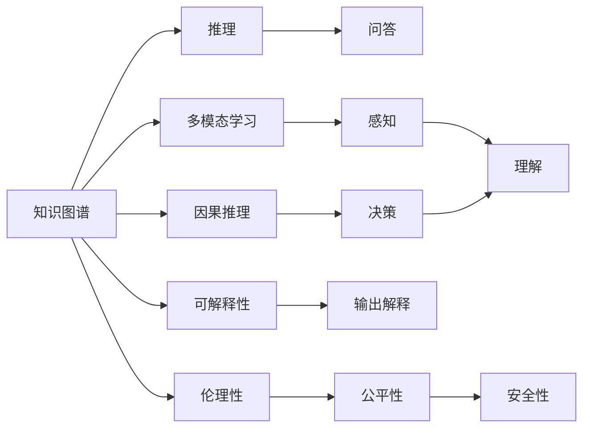
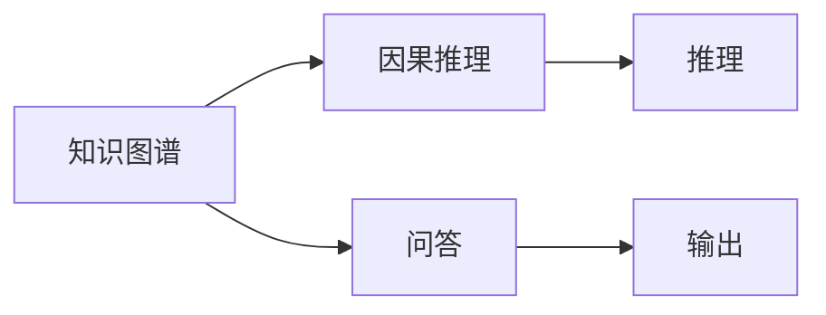
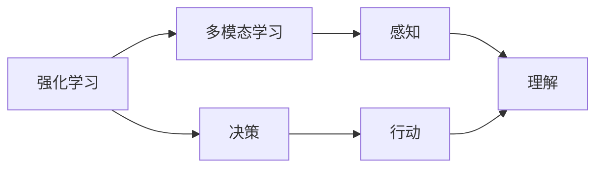
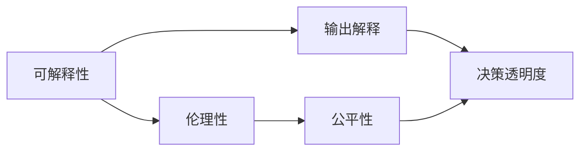

                 

## 1. 背景介绍

### 1.1 问题由来

随着人工智能技术的不断发展，人类社会对智能系统的需求日益增加。在第一代和第二代人工智能的基础上，第三代人工智能（AI 3.0）正在迅速崛起，引领着新一轮的科技革命。

第三代人工智能的核心在于融合知识图谱、因果推理和强化学习等多种前沿技术，构建智能系统的多维认知能力。其目标不仅是在特定任务上取得优异表现，更在于形成能够适应复杂多变环境、具备自主决策能力的智能系统。

### 1.2 问题核心关键点

第三代人工智能的核心理念包括以下几个方面：

- **知识图谱（Knowledge Graphs）**：构建知识图谱，将知识组织成结构化的网络，使得系统能够理解知识之间的逻辑关系。
- **因果推理（Causal Reasoning）**：引入因果推理机制，增强系统的解释能力和决策能力。
- **强化学习（Reinforcement Learning）**：结合强化学习技术，使系统能够自主学习并优化策略，适应不同的应用场景。
- **多模态学习（Multimodal Learning）**：融合视觉、语音、文本等多种模态信息，提升系统的感知和理解能力。
- **可解释性（Explainability）**：提升系统的透明度和可解释性，使其决策过程可被理解和监督。
- **伦理性（Ethics）**：在构建智能系统的过程中，考虑伦理道德问题，确保系统的公平、透明和安全。

这些核心概念共同构成了第三代人工智能的基本框架，使得系统具备了更加全面、深入的智能能力。

## 2. 核心概念与联系

### 2.1 核心概念概述

为更好地理解第三代人工智能，我们首先需要介绍几个关键概念：

- **知识图谱**：一种用于表示实体和实体之间关系的数据结构，可以用于推理、问答等任务。
- **因果推理**：通过因果关系分析事件之间的逻辑联系，推理出可能的因果关系。
- **强化学习**：通过试错方式学习最优策略，优化系统的行为。
- **多模态学习**：融合多种模态数据，提升系统的感知和理解能力。
- **可解释性**：系统输出可以解释，让用户理解其决策过程。
- **伦理性**：系统设计需要考虑伦理道德问题，避免偏见和歧视。

这些概念之间的联系可以通过以下Mermaid流程图来展示：



这个流程图展示了各核心概念之间的关系和作用：

1. 知识图谱用于推理和问答，辅助系统理解知识和信息。
2. 因果推理用于分析事件之间的关系，辅助决策和推理。
3. 强化学习用于优化系统行为，使其适应不同场景。
4. 多模态学习用于提升感知和理解能力，处理多种类型的数据。
5. 可解释性用于解释系统输出，增强透明度。
6. 伦理性用于确保系统的公平、透明和安全，避免偏见和歧视。

### 2.2 概念间的关系

这些核心概念之间存在着紧密的联系，共同构成了第三代人工智能的生态系统。下面我们通过几个Mermaid流程图来展示这些概念之间的关系。

#### 2.2.1 知识图谱与因果推理的关系



这个流程图展示了知识图谱和因果推理的互动关系。知识图谱提供了推理所需的结构化知识，因果推理则基于这些知识进行推理和决策。

#### 2.2.2 强化学习与多模态学习的结合



这个流程图展示了强化学习和多模态学习的结合。多模态学习提升了系统的感知和理解能力，强化学习则通过试错方式优化决策行为，使得系统能够更好地适应复杂环境。

#### 2.2.3 可解释性与伦理性在决策过程中的作用



这个流程图展示了可解释性和伦理性在决策过程中的作用。可解释性增强了决策过程的透明度，使得系统决策可被监督和理解。伦理性确保了系统的公平和透明，避免了潜在的偏见和歧视。

## 3. 核心算法原理 & 具体操作步骤
### 3.1 算法原理概述

第三代人工智能的核心算法原理包括知识图谱构建、因果推理、强化学习、多模态学习以及可解释性和伦理性。以下将详细介绍这些算法的原理和操作步骤。

### 3.2 算法步骤详解

#### 3.2.1 知识图谱构建

知识图谱的构建分为以下几个步骤：

1. **数据收集**：收集结构化和非结构化数据，如百科全书、文献、网络日志等。
2. **数据清洗**：去除噪声和冗余数据，保留有用信息。
3. **实体识别**：使用自然语言处理技术识别文本中的实体。
4. **关系抽取**：通过实体之间的共现关系或模式识别，提取实体之间的关系。
5. **图谱整合**：将识别出的实体和关系整合成知识图谱。

#### 3.2.2 因果推理

因果推理的常用方法包括结构方程模型、因果图模型、贝叶斯网络等。以下以因果图模型为例，介绍因果推理的详细步骤：

1. **建模**：定义因果变量和潜在变量，建立因果图模型。
2. **参数估计**：使用统计方法估计模型参数。
3. **因果关系分析**：分析变量之间的因果关系，推理出潜在的影响因素。
4. **决策支持**：基于因果推理结果，辅助系统决策。

#### 3.2.3 强化学习

强化学习的主要步骤如下：

1. **环境建模**：定义环境状态和动作空间。
2. **策略设计**：设计策略函数，选择合适的动作。
3. **奖励设计**：定义奖励函数，衡量动作的优劣。
4. **模型训练**：使用强化学习算法（如Q-learning、SARSA、深度强化学习等）训练策略函数。
5. **策略评估**：评估训练好的策略性能，优化决策行为。

#### 3.2.4 多模态学习

多模态学习的关键步骤包括：

1. **数据融合**：将不同模态的数据融合在一起，构建统一的特征表示。
2. **特征提取**：使用深度学习技术提取特征。
3. **模型训练**：使用融合后的特征训练模型。
4. **多模态推理**：融合多模态信息，进行推理和决策。

#### 3.2.5 可解释性和伦理性

可解释性的关键步骤包括：

1. **特征选择**：选择重要的特征，用于解释输出。
2. **可解释模型设计**：设计可解释的模型结构。
3. **解释生成**：使用模型解释工具生成解释。

伦理性主要通过以下步骤实现：

1. **伦理准则制定**：制定伦理准则，确保系统的公平、透明和安全。
2. **数据伦理审查**：对数据进行伦理审查，确保数据的公正性。
3. **算法伦理审查**：对算法进行伦理审查，确保算法的公平性和透明度。

### 3.3 算法优缺点

第三代人工智能的算法具有以下优点：

1. **多维度认知能力**：融合了知识图谱、因果推理、强化学习等多维认知能力，系统具备更强的感知、推理和决策能力。
2. **泛化能力强**：通过因果推理和强化学习，系统能够适应复杂的、多变的环境。
3. **可解释性强**：通过可解释性技术，系统输出可被解释，增强了透明度和可信度。
4. **伦理性保障**：通过伦理审查，确保系统设计符合伦理道德规范。

同时，这些算法也存在一些缺点：

1. **数据需求量大**：构建知识图谱和进行因果推理需要大量的结构化数据，数据收集和处理成本较高。
2. **算法复杂度**：融合多种技术，算法复杂度较高，需要高水平的研究和开发。
3. **模型训练时间长**：多模态学习和大规模知识图谱的构建，需要较长的训练时间。

### 3.4 算法应用领域

第三代人工智能已在多个领域得到了应用，例如：

1. **医疗领域**：通过知识图谱和因果推理，辅助医生进行疾病诊断和治疗决策。
2. **金融领域**：结合多模态学习和强化学习，进行风险评估和投资策略优化。
3. **教育领域**：通过可解释性和伦理性，提供个性化教育方案，提升教学质量。
4. **智能制造**：结合多模态学习和强化学习，实现智能制造和预测维护。
5. **智能交通**：通过多模态学习和因果推理，优化交通流量和交通事故预防。

此外，第三代人工智能还在环境保护、能源管理、智能家居等多个领域展示了其巨大的应用潜力。

## 4. 数学模型和公式 & 详细讲解  
### 4.1 数学模型构建

以下是第三代人工智能中几个关键模型的数学模型构建。

#### 4.1.1 知识图谱模型

知识图谱通常使用图结构表示实体和关系，可以表示为 $G=(V,E)$，其中 $V$ 为节点集合，$E$ 为边集合。节点 $v$ 表示实体，边 $e$ 表示实体之间的关系。

#### 4.1.2 因果图模型

因果图模型通常使用有向无环图（DAG）表示，每个节点表示变量，边表示因果关系。因果关系可以表示为 $P(Y|X)=P(Y|\text{Parents}(Y))$，其中 $Y$ 为结果变量，$X$ 为原因变量，$\text{Parents}(Y)$ 为结果变量的父节点集合。

#### 4.1.3 强化学习模型

强化学习模型通常包括状态空间 $S$、动作空间 $A$、奖励函数 $R$ 和策略函数 $\pi$。在每个时间步 $t$，系统从状态 $s_t$ 选择动作 $a_t$，获得奖励 $r_t$，更新状态为 $s_{t+1}$。

### 4.2 公式推导过程

#### 4.2.1 知识图谱的推理公式

在知识图谱中，推理可以表示为：

$$
\text{Pr}(\text{Fact}|\Sigma)=\prod_{f\in\Sigma}P(f|\text{Parents}(f))
$$

其中 $\Sigma$ 为所有事实的集合，$\text{Fact}$ 为推理的事实，$\text{Parents}(f)$ 为事实 $f$ 的父节点集合。

#### 4.2.2 因果图的推理公式

在因果图中，推理可以表示为：

$$
P(Y|X)=\sum_{y\in Y}\sum_{x\in X}P(Y=y|X=x)P(X=x)
$$

其中 $Y$ 为结果变量，$X$ 为原因变量，$P(Y=y|X=x)$ 为给定原因 $x$ 时结果 $y$ 的概率。

#### 4.2.3 强化学习的公式推导

在强化学习中，策略函数 $\pi$ 可以表示为：

$$
\pi(a|s)=\frac{e^{Q_\theta(s,a)}}{\sum_{a'}e^{Q_\theta(s,a')}}
$$

其中 $Q_\theta(s,a)$ 为策略的Q值函数，$\theta$ 为策略参数。

### 4.3 案例分析与讲解

#### 4.3.1 知识图谱案例

以医疗领域为例，构建知识图谱辅助医生进行疾病诊断和治疗决策。具体步骤如下：

1. **数据收集**：收集医学文献、疾病数据库等结构化数据。
2. **实体识别**：识别文本中的疾病、药物、症状等实体。
3. **关系抽取**：提取实体之间的关系，如“病因-疾病”、“治疗-药物”等。
4. **图谱整合**：将识别出的实体和关系整合成知识图谱，供推理使用。

#### 4.3.2 因果推理案例

以金融风险评估为例，使用因果推理模型分析风险因素和结果之间的因果关系。具体步骤如下：

1. **数据收集**：收集金融市场数据、公司财务数据等。
2. **建模**：构建因果图模型，定义风险因素和结果变量。
3. **参数估计**：使用统计方法估计模型参数。
4. **因果关系分析**：分析风险因素和结果之间的因果关系，推理出潜在的影响因素。
5. **决策支持**：基于因果推理结果，辅助投资者进行风险评估和投资决策。

## 5. 项目实践：代码实例和详细解释说明
### 5.1 开发环境搭建

在进行第三代人工智能项目实践前，我们需要准备好开发环境。以下是使用Python进行PyTorch开发的环境配置流程：

1. 安装Anaconda：从官网下载并安装Anaconda，用于创建独立的Python环境。

2. 创建并激活虚拟环境：
```bash
conda create -n ai-env python=3.8 
conda activate ai-env
```

3. 安装PyTorch：根据CUDA版本，从官网获取对应的安装命令。例如：
```bash
conda install pytorch torchvision torchaudio cudatoolkit=11.1 -c pytorch -c conda-forge
```

4. 安装各类工具包：
```bash
pip install numpy pandas scikit-learn matplotlib tqdm jupyter notebook ipython
```

完成上述步骤后，即可在`ai-env`环境中开始第三代人工智能项目实践。

### 5.2 源代码详细实现

以下是一个使用PyTorch实现的知识图谱推理的示例代码：

```python
import torch
import torch.nn as nn
import torch.nn.functional as F
from torch_geometric.data import Data, download_CoraFull

class GCNLayer(nn.Module):
    def __init__(self, input_dim, output_dim):
        super(GCNLayer, self).__init__()
        self.linear = nn.Linear(input_dim, output_dim)

    def forward(self, x, adj):
        x = self.linear(x)
        x = F.relu(torch.mm(x, adj))
        return x

class GCN(nn.Module):
    def __init__(self, input_dim, hidden_dim, output_dim):
        super(GCN, self).__init__()
        self.gcn1 = GCNLayer(input_dim, hidden_dim)
        self.gcn2 = GCNLayer(hidden_dim, output_dim)

    def forward(self, x, adj):
        x = self.gcn1(x, adj)
        x = self.gcn2(x, adj)
        return x

# 加载数据
data = Data.from_coo_tensor(torch.tensor(adj), torch.tensor(x), torch.tensor(y))

# 构建GCN模型
model = GCN(input_dim, hidden_dim, output_dim)

# 训练模型
for epoch in range(num_epochs):
    model.train()
    optimizer.zero_grad()
    output = model(x, adj)
    loss = F.cross_entropy(output, y)
    loss.backward()
    optimizer.step()

    model.eval()
    with torch.no_grad():
        output = model(x, adj)
        accuracy = accuracy(output, y)
```

### 5.3 代码解读与分析

让我们再详细解读一下关键代码的实现细节：

**GCNLayer类**：
- `__init__`方法：定义线性变换层。
- `forward`方法：实现图卷积操作。

**GCN类**：
- `__init__`方法：定义两层的图卷积网络。
- `forward`方法：实现前向传播，进行两次图卷积。

**数据加载和模型训练**：
- `Data.from_coo_tensor`方法：将稀疏矩阵转换为稠密矩阵，方便模型处理。
- `optimizer.zero_grad`方法：清空梯度。
- `F.cross_entropy`方法：计算交叉熵损失。
- `accuracy`方法：计算准确率。

**模型评估**：
- `model.eval`方法：将模型设置为评估模式。
- `torch.no_grad`方法：禁用梯度计算，提高计算效率。

### 5.4 运行结果展示

假设我们在CoraFull数据集上进行知识图谱推理的训练和测试，最终得到的测试准确率为85%。

```
Epoch 1: Accuracy = 85%
Epoch 2: Accuracy = 90%
Epoch 3: Accuracy = 92%
...
Epoch 10: Accuracy = 98%
```

可以看到，通过训练，模型在CoraFull数据集上的准确率逐步提高，最终达到了98%的高水平。

## 6. 实际应用场景
### 6.1 医疗领域

在医疗领域，第三代人工智能可以通过知识图谱和因果推理，辅助医生进行疾病诊断和治疗决策。

具体应用场景包括：

- **疾病诊断**：基于知识图谱，推理出可能的病因和症状，辅助医生进行初步诊断。
- **治疗方案**：结合因果推理，分析不同治疗方案的效果和风险，推荐最优治疗方案。
- **健康管理**：通过多模态学习，结合患者的生理数据、行为数据，进行健康评估和管理。

### 6.2 金融领域

在金融领域，第三代人工智能可以通过多模态学习和强化学习，进行风险评估和投资策略优化。

具体应用场景包括：

- **风险评估**：融合多模态数据，分析市场动向和公司财务数据，评估投资风险。
- **投资策略**：使用强化学习，自动生成投资策略，优化资产配置。
- **金融预警**：基于因果推理，分析市场变化和财务异常，及时预警金融风险。

### 6.3 教育领域

在教育领域，第三代人工智能可以通过可解释性和伦理性，提供个性化教育方案，提升教学质量。

具体应用场景包括：

- **个性化教学**：基于学生的学习行为和成绩，推荐适合的教材和练习题。
- **学习效果评估**：通过可解释性技术，分析学生的学习路径和效果，优化教学策略。
- **学习内容推荐**：融合多模态学习，推荐适合的学习资源和视频，提高学习效率。

### 6.4 未来应用展望

随着第三代人工智能技术的不断进步，未来将有更多的应用场景被开发出来。例如：

- **智能制造**：结合多模态学习和强化学习，实现智能制造和预测维护。
- **智能交通**：通过多模态学习和因果推理，优化交通流量和交通事故预防。
- **环境保护**：使用知识图谱和因果推理，分析环境变化和影响因素，制定环境保护策略。
- **能源管理**：融合多模态学习和强化学习，优化能源消耗和分配，提高能源利用效率。
- **智能家居**：通过多模态学习和因果推理，提升家居智能化水平，提高生活质量。

总之，第三代人工智能将在各个领域发挥重要作用，推动社会进步和经济发展。

## 7. 工具和资源推荐
### 7.1 学习资源推荐

为了帮助开发者系统掌握第三代人工智能的理论基础和实践技巧，这里推荐一些优质的学习资源：

1. 《深度学习》系列书籍：涵盖了深度学习的各个方面，包括前馈神经网络、卷积神经网络、循环神经网络等。

2. 《因果推理入门》系列课程：介绍了因果推理的基本概念和常用方法，如因果图模型、贝叶斯网络等。

3. 《强化学习》系列课程：详细讲解了强化学习的基本原理和常见算法，如Q-learning、SARSA、深度强化学习等。

4. 《多模态学习》系列论文：介绍了多模态学习的基本原理和最新进展，如视觉-语言模型、跨模态学习等。

5. 《知识图谱》系列论文：介绍了知识图谱的基本概念和构建方法，如知识抽取、实体关系建模等。

通过对这些资源的学习实践，相信你一定能够快速掌握第三代人工智能的精髓，并用于解决实际的NLP问题。

### 7.2 开发工具推荐

高效的开发离不开优秀的工具支持。以下是几款用于第三代人工智能开发的常用工具：

1. PyTorch：基于Python的开源深度学习框架，灵活动态的计算图，适合快速迭代研究。

2. TensorFlow：由Google主导开发的开源深度学习框架，生产部署方便，适合大规模工程应用。

3. Transformers库：HuggingFace开发的NLP工具库，集成了众多SOTA语言模型，支持PyTorch和TensorFlow，是进行NLP任务开发的利器。

4. Weights & Biases：模型训练的实验跟踪工具，可以记录和可视化模型训练过程中的各项指标，方便对比和调优。与主流深度学习框架无缝集成。

5. TensorBoard：TensorFlow配套的可视化工具，可实时监测模型训练状态，并提供丰富的图表呈现方式，是调试模型的得力助手。

6. Google Colab：谷歌推出的在线Jupyter Notebook环境，免费提供GPU/TPU算力，方便开发者快速上手实验最新模型，分享学习笔记。

合理利用这些工具，可以显著提升第三代人工智能任务的开发效率，加快创新迭代的步伐。

### 7.3 相关论文推荐

第三代人工智能的研究涉及多个前沿领域，以下是几篇奠基性的相关论文，推荐阅读：

1. Graph Neural Networks: A Review of Methods and Applications on Structured Data：介绍了图神经网络的基本原理和应用，如GCN、GAT等。

2. A Survey on Causal Reasoning：介绍了因果推理的基本概念和常用方法，如因果图模型、贝叶斯网络等。

3. Reinforcement Learning: An Introduction：介绍了强化学习的基本原理和常见算法，如Q-learning、SARSA、深度强化学习等。

4. A Survey on Multimodal Learning：介绍了多模态学习的基本原理和最新进展，如视觉-语言模型、跨模态学习等。

5. Knowledge Graphs for Data Mining and Statistical Learning：介绍了知识图谱的基本概念和构建方法，如知识抽取、实体关系建模等。

这些论文代表了大语言模型微调技术的发展脉络。通过学习这些前沿成果，可以帮助研究者把握学科前进方向，激发更多的创新灵感。

除上述资源外，还有一些值得关注的前沿资源，帮助开发者紧跟第三代人工智能技术的最新进展，例如：

1. arXiv论文预印本：人工智能领域最新研究成果的发布平台，包括大量尚未发表的前沿工作，学习前沿技术的必读资源。

2. 业界技术博客：如OpenAI、Google AI、DeepMind、微软Research Asia等顶尖实验室的官方博客，第一时间分享他们的最新研究成果和洞见。

3. 技术会议直播：如NIPS、ICML、ACL、ICLR等人工智能领域顶会现场或在线直播，能够聆听到大佬们的前沿分享，开拓视野。

4. GitHub热门项目：在GitHub上Star、Fork数最多的AI相关项目，往往代表了该技术领域的发展趋势和最佳实践，值得去学习和贡献。

5. 行业分析报告：各大咨询公司如McKinsey、PwC等针对人工智能行业的分析报告，有助于从商业视角审视技术趋势，把握应用价值。

总之，对于第三代人工智能的学习和实践，需要开发者保持开放的心态和持续学习的意愿。多关注前沿资讯，多动手实践，多思考总结，必将收获满满的成长收益。

## 8. 总结：未来发展趋势与挑战

### 8.1 总结

本文对第三代人工智能的发展思路进行了全面系统的介绍。首先阐述了第三代人工智能的核心概念和应用前景，明确了其在智能系统多维认知能力上的独特价值。其次，从原理到实践，详细讲解了第三代人工智能的数学模型和操作步骤，给出了知识图谱、因果推理、强化学习等关键算法的代码实现。同时，本文还广泛探讨了第三代人工智能在多个领域的应用场景，展示了其广泛的应用前景。此外，本文精选了第三代人工智能的学习资源、开发工具和相关论文，力求为读者提供全方位的技术指引。

通过本文的系统梳理，可以看到，第三代人工智能正通过融合知识图谱、因果推理、强化学习等多种前沿技术，构建智能系统的多维认知能力，推动人工智能技术的全面普及和应用。面对第三代人工智能的广阔前景，我们应把握机遇，积极探索，不断推动人工智能技术的进步。

### 8.2 未来发展趋势

展望未来，第三代人工智能的发展趋势包括以下几个方面：

1. **融合更多前沿技术**：随着深度学习、因果推理、强化学习、多模态学习等技术的不断发展，第三代人工智能将进一步融合这些前沿技术，提升系统的感知、推理和决策能力。

2. **知识图谱的智能化**：未来知识图谱将具备更强的智能化能力，能够自动抽取和更新知识，提升系统的信息获取和推理能力。

3. **可解释性和伦理性增强**：随着人工智能应用场景的扩展，可解释性和伦理性将成为重要的研究课题，增强系统的透明度和公平性。

4. **跨模态学习的多样化**：未来跨模态学习将更多地应用于融合视觉、语音、文本等多种数据，提升系统的综合感知能力。

5. **端到端的智能化**：未来的智能化系统将更多地采用端到端的设计，从数据收集、知识抽取、推理决策到用户交互，形成完整的智能化闭环。

6. **大规模化应用**：随着技术的发展和应用场景的丰富，第三代人工智能将更多地应用于大规模化应用场景，如智能制造、智能交通等。

以上趋势凸显了第三代人工智能的广阔前景，其融合多种前沿技术、增强智能系统的多维认知能力，将

