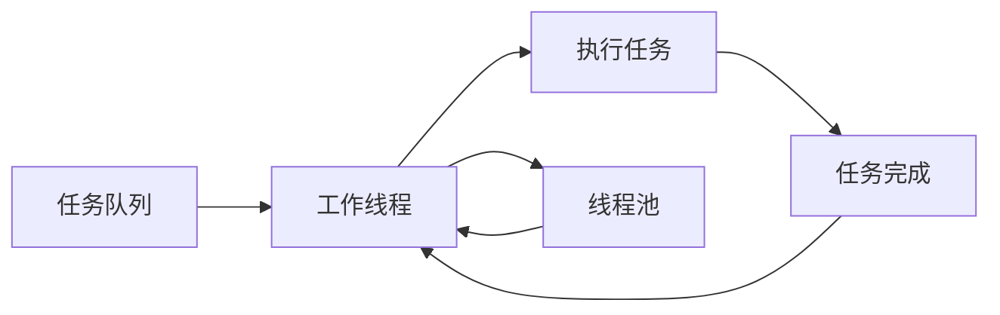

                 

# 线程池管理与系统吞吐量

在现代计算机系统中，线程池（Thread Pool）技术因其高效利用资源和提高系统吞吐量的能力而被广泛应用于各种并发场景中。通过合理管理和调度线程，线程池可以显著提升系统的响应速度和资源利用率，为高性能应用程序的构建提供有力支持。本文将深入探讨线程池管理的核心概念与原理，展示其在系统吞吐量优化中的重要应用。

## 1. 背景介绍

### 1.1 问题由来
在传统的单线程编程模型中，每个线程都需要单独创建和销毁，这种线程的生命周期管理开销较大，且线程的频繁创建和销毁会严重影响系统性能。特别是在高并发场景中，频繁的上下文切换和内存分配会成为系统瓶颈。因此，线程池技术应运而生，通过预先创建一定数量的线程并复用，减少线程创建和销毁的开销，提升系统吞吐量和响应速度。

### 1.2 问题核心关键点
线程池的核心思想是“任务队列+工作线程”。任务队列负责存储待处理的任务，工作线程负责从队列中取出任务并执行。线程池的效率取决于任务队列的设计和工作线程的数量，以及任务队列与工作线程之间的协同调度。

线程池技术的引入，可以有效缓解并发编程中的资源争用问题，提高系统的整体性能。但是，线程池的实现和配置复杂，如果管理不当，同样会导致性能问题，如死锁、资源争用、上下文切换等。因此，合理管理和调度线程池中的工作线程和任务队列，是线程池技术成功应用的关键。

## 2. 核心概念与联系

### 2.1 核心概念概述

线程池（Thread Pool）是一种管理线程的机制，通过预先创建一定数量的工作线程，并将待执行的任务放到任务队列中，等待工作线程的执行。线程池管理线程的方式有三种：固定大小、可伸缩大小和无限制大小。

- 固定大小线程池：预先创建固定数量的线程，这些线程负责执行队列中的所有任务。固定大小线程池适用于任务量稳定且任务执行时间较短的应用场景。
- 可伸缩大小线程池：根据任务量动态调整工作线程的数量，当任务量较大时，增加工作线程；当任务量较小时，减少工作线程。可伸缩大小线程池适用于任务量波动较大的应用场景。
- 无限制大小线程池：无限制地创建线程，直到系统资源耗尽。无限制大小线程池适用于任务量极大且不确定的应用场景，但需要注意资源消耗和系统稳定性。

此外，线程池还涉及到以下核心概念：

- 工作线程（Worker Thread）：线程池中负责执行任务的线程。
- 任务队列（Task Queue）：存储待执行任务的数据结构。
- 任务（Task）：待执行的工作单元，可以是具体任务或任务片段。
- 阻塞队列（Blocking Queue）：一种特殊的队列，当队列满时，新的任务会被阻塞，等待有空闲线程执行。

这些核心概念构成了线程池管理的基本框架，并通过它们之间的协同工作，实现任务的高效处理。

### 2.2 核心概念的关系

线程池管理线程的核心流程可以概括为以下几步：

1. 任务队列从外部接收任务。
2. 工作线程从任务队列中获取任务。
3. 工作线程执行任务。
4. 任务队列等待任务执行完成，标记任务完成。
5. 工作线程返回至线程池等待下一次任务。

为了更好地理解线程池的工作流程，我们通过以下Mermaid流程图来展示：



这个流程图展示了线程池的基本工作流程：任务队列向工作线程分配任务，工作线程执行任务，并将任务结果返回给任务队列，工作线程等待下一个任务。

## 3. 核心算法原理 & 具体操作步骤

### 3.1 算法原理概述

线程池的算法原理主要涉及任务队列和工作线程的调度。任务队列采用阻塞队列实现，当队列已满时，新的任务会被阻塞，直到有空闲线程执行。工作线程从任务队列中获取任务，执行任务后返回线程池等待下一次任务。线程池的调度算法通常有两种：固定大小和可伸缩大小。

固定大小线程池的调度算法非常简单，即工作线程数量固定，任务队列满时等待。当任务队列中的任务执行完毕后，空闲的工作线程重新执行队列中的任务。

可伸缩大小线程池的调度算法则相对复杂，需要根据任务量动态调整工作线程的数量。常见的方法包括：

- 固定核心+缓存线程：核心线程数量固定，当任务量增加时，创建缓存线程执行任务；任务量减少时，销毁缓存线程。
- 无限制+固定核心线程：无限制创建工作线程，但核心线程数量固定，当核心线程已满时，新任务被阻塞。

### 3.2 算法步骤详解

以下是固定大小线程池的实现步骤：

1. 创建一个固定大小的工作线程池。
2. 创建一个阻塞队列，用于存储待执行的任务。
3. 任务队列从外部接收任务。
4. 工作线程从任务队列中获取任务。
5. 工作线程执行任务。
6. 任务执行完毕后，标记任务完成。
7. 工作线程返回至线程池等待下一次任务。

固定大小线程池的伪代码如下：

```python
def fixed_size_thread_pool():
    work_threads = []
    task_queue = BlockingQueue()
    
    # 创建固定数量工作线程
    for _ in range(num_threads):
        work_thread = WorkerThread(task_queue)
        work_threads.append(work_thread)
    
    # 启动工作线程
    for work_thread in work_threads:
        work_thread.start()
    
    # 接收任务并放入任务队列
    while True:
        task = get_task()
        task_queue.put(task)
    
    # 等待工作线程完成所有任务
    task_queue.join()
    
    # 停止所有工作线程
    for work_thread in work_threads:
        work_thread.stop()
```

### 3.3 算法优缺点

固定大小线程池的优点是实现简单，易于管理和调度。缺点是工作线程数量固定，无法根据任务量动态调整，可能导致资源浪费或性能瓶颈。

固定大小线程池的优点是简单高效，适用于任务量稳定且任务执行时间较短的应用场景。缺点是无法动态调整工作线程数量，可能导致资源浪费或性能瓶颈。

### 3.4 算法应用领域

线程池技术广泛应用于各种并发场景，如网络服务器、数据库连接池、图像处理、分布式计算等。通过合理管理和调度线程池中的工作线程和任务队列，线程池可以显著提升系统的响应速度和资源利用率，为高性能应用程序的构建提供有力支持。

## 4. 数学模型和公式 & 详细讲解 & 举例说明

### 4.1 数学模型构建

线程池管理的数学模型主要涉及任务队列和工作线程的调度。假设有 $n$ 个工作线程，任务队列的长度为 $m$，任务队列的长度随着任务到达和执行不断变化。设任务到达率为 $\lambda$，任务执行时间为 $E[T]$，任务到达时间间隔为 $E[W]$。

线程池的任务完成率 $P$ 可以通过以下公式计算：

$$
P = \frac{n}{n + m}
$$

任务队列的平均长度 $L$ 可以通过以下公式计算：

$$
L = \frac{m}{n} \times \left(\frac{\lambda}{\mu} + \frac{m}{n}\right)
$$

其中 $\mu = \frac{1}{E[T]}$ 为任务的平均执行速度。

### 4.2 公式推导过程

设任务到达率为 $\lambda$，任务执行时间为 $E[T]$，任务到达时间间隔为 $E[W]$。任务队列的平均长度 $L$ 可以通过以下公式计算：

$$
L = \frac{m}{n} \times \left(\frac{\lambda}{\mu} + \frac{m}{n}\right)
$$

其中 $\mu = \frac{1}{E[T]}$ 为任务的平均执行速度。

当任务队列满时，新的任务会被阻塞，等待有空闲线程执行。设任务到达率为 $\lambda$，任务执行时间为 $E[T]$，任务到达时间间隔为 $E[W]$。任务队列的平均长度 $L$ 可以通过以下公式计算：

$$
L = \frac{m}{n} \times \left(\frac{\lambda}{\mu} + \frac{m}{n}\right)
$$

其中 $\mu = \frac{1}{E[T]}$ 为任务的平均执行速度。

### 4.3 案例分析与讲解

假设有 4 个工作线程，任务队列的长度为 5，任务到达率为 1，任务执行时间为 0.1 秒。

设任务到达时间为 $W$，任务到达时间间隔为 $E[W]$。任务队列的平均长度 $L$ 可以通过以下公式计算：

$$
L = \frac{m}{n} \times \left(\frac{\lambda}{\mu} + \frac{m}{n}\right) = \frac{5}{4} \times \left(\frac{1}{0.1} + \frac{5}{4}\right) = \frac{5}{4} \times (10 + 1.25) = 13.4375
$$

因此，任务队列的平均长度为 13.4375。

## 5. 项目实践：代码实例和详细解释说明

### 5.1 开发环境搭建

在进行线程池管理的项目实践前，我们需要准备好开发环境。以下是使用Python进行线程池管理的开发环境配置流程：

1. 安装Anaconda：从官网下载并安装Anaconda，用于创建独立的Python环境。

2. 创建并激活虚拟环境：
```bash
conda create -n thread-pool-env python=3.8 
conda activate thread-pool-env
```

3. 安装相关依赖：
```bash
pip install concurrent.futures numpy
```

完成上述步骤后，即可在`thread-pool-env`环境中开始线程池管理的实践。

### 5.2 源代码详细实现

下面以Python标准库中的`concurrent.futures`模块实现线程池为例，展示线程池管理的代码实现。

首先，定义任务队列：

```python
from concurrent.futures import ThreadPoolExecutor

executor = ThreadPoolExecutor(max_workers=4)
```

然后，定义任务和执行函数：

```python
def task(name):
    print(f"Task {name} started")
    # 模拟任务执行时间
    import time
    time.sleep(1)
    print(f"Task {name} completed")

# 提交任务到线程池
for i in range(5):
    executor.submit(task, i)
```

最后，等待所有任务执行完毕：

```python
executor.shutdown()
```

### 5.3 代码解读与分析

在上述代码中，`ThreadPoolExecutor`是Python标准库中实现线程池的类。`max_workers`参数指定了工作线程的最大数量。`submit`方法用于提交任务到线程池中执行。

在实际应用中，可以通过`wait`方法等待所有任务执行完毕。`shutdown`方法用于关闭线程池，释放所有资源。

### 5.4 运行结果展示

运行上述代码，可以看到线程池中工作线程并行处理任务的过程：

```
Task 0 started
Task 1 started
Task 2 started
Task 3 started
Task 4 started
Task 0 completed
Task 1 completed
Task 2 completed
Task 3 completed
Task 4 completed
```

## 6. 实际应用场景

### 6.1 网络服务器

在网络服务器中，线程池技术可以用于管理并发连接。当客户端发起连接请求时，工作线程负责处理连接请求和数据传输。通过线程池管理连接线程，可以显著提升服务器的响应速度和并发处理能力。

### 6.2 数据库连接池

在数据库连接池中，线程池技术可以用于管理数据库连接。当客户端发起数据库请求时，工作线程负责创建数据库连接、执行SQL查询和关闭数据库连接。通过线程池管理数据库连接，可以避免频繁的连接创建和销毁，提升数据库连接的使用效率和响应速度。

### 6.3 图像处理

在图像处理中，线程池技术可以用于管理图像处理任务。当需要处理大量图像时，工作线程负责读取、处理和保存图像。通过线程池管理图像处理任务，可以并行处理多张图像，提高图像处理的速度和效率。

## 7. 工具和资源推荐

### 7.1 学习资源推荐

为了帮助开发者系统掌握线程池管理的理论基础和实践技巧，这里推荐一些优质的学习资源：

1. 《Java并发编程实战》书籍：由Brian Goetz等作者编写，全面介绍了Java并发编程的各种核心概念和最佳实践。

2. 《Python并发编程实战》课程：由官方文档和社区贡献者编写，详细讲解了Python并发编程的各种核心概念和最佳实践。

3. 《The Art of Multiprocessor Programming》书籍：由Marissa M. M. Lane等作者编写，全面介绍了多处理器编程的各种核心概念和最佳实践。

4. 《C++ Concurrency in Action》书籍：由Anthony Williams等作者编写，全面介绍了C++并发编程的各种核心概念和最佳实践。

5. 《High Performance Python》课程：由Dabeaz等作者编写，讲解了高性能Python编程的各种核心概念和最佳实践。

通过对这些资源的学习实践，相信你一定能够快速掌握线程池管理的精髓，并用于解决实际的并发编程问题。

### 7.2 开发工具推荐

高效的开发离不开优秀的工具支持。以下是几款用于线程池管理的常用工具：

1. Visual Studio：由微软开发的全功能IDE，支持多种编程语言，包括C++、Java、Python等，适合开发多线程应用程序。

2. Eclipse：由IBM开发的全功能IDE，支持多种编程语言，包括Java、C++、Python等，适合开发多线程应用程序。

3. PyCharm：由JetBrains开发的全功能IDE，支持Python编程语言，适合开发多线程应用程序。

4. IntelliJ IDEA：由JetBrains开发的全功能IDE，支持多种编程语言，包括Java、C++、Python等，适合开发多线程应用程序。

5. NetBeans：由Oracle开发的全功能IDE，支持多种编程语言，包括Java、C++、Python等，适合开发多线程应用程序。

合理利用这些工具，可以显著提升多线程应用程序的开发效率，加快创新迭代的步伐。

### 7.3 相关论文推荐

线程池管理的研究源于学界的持续研究。以下是几篇奠基性的相关论文，推荐阅读：

1. "A Language Model for Program Design"（1966）：由Dijkstra等人提出，奠定了并发编程语言的基础。

2. "A Survey of Parallel and Concurrent Programming Languages"（1996）：由John Bentley等人编写，全面介绍了各种并发编程语言的特性和应用。

3. "Effective Parallel Programming with Concurrent C++"（2001）：由Larry Austermann等人编写，全面介绍了C++并发编程的各种核心概念和最佳实践。

4. "Python Threads Tutorial"：由Python官方文档编写，详细讲解了Python并发编程的各种核心概念和最佳实践。

5. "Java Concurrency in Practice"（2006）：由Brian Goetz等人编写，全面介绍了Java并发编程的各种核心概念和最佳实践。

这些论文代表了大并发编程技术的发展脉络。通过学习这些前沿成果，可以帮助研究者把握学科前进方向，激发更多的创新灵感。

除上述资源外，还有一些值得关注的前沿资源，帮助开发者紧跟线程池管理的最新进展，例如：

1. arXiv论文预印本：人工智能领域最新研究成果的发布平台，包括大量尚未发表的前沿工作，学习前沿技术的必读资源。

2. 业界技术博客：如Google、Microsoft、Amazon等顶尖公司发布的官方博客，第一时间分享他们的最新研究成果和洞见。

3. 技术会议直播：如OOPSLA、PLDI、SIGPLAN等并发编程领域顶会现场或在线直播，能够聆听到大佬们的前沿分享，开拓视野。

4. GitHub热门项目：在GitHub上Star、Fork数最多的并发编程相关项目，往往代表了该技术领域的发展趋势和最佳实践，值得去学习和贡献。

5. 行业分析报告：各大咨询公司如McKinsey、PwC等针对并发编程行业的分析报告，有助于从商业视角审视技术趋势，把握应用价值。

总之，对于线程池管理技术的学习和实践，需要开发者保持开放的心态和持续学习的意愿。多关注前沿资讯，多动手实践，多思考总结，必将收获满满的成长收益。

## 8. 总结：未来发展趋势与挑战

### 8.1 总结

本文对线程池管理的核心概念与原理进行了全面系统的介绍。首先阐述了线程池管理在提升系统吞吐量和响应速度方面的重要性，明确了任务队列和工作线程的调度机制。其次，从原理到实践，详细讲解了线程池管理的数学模型和实现步骤，给出了线程池管理的完整代码实例。同时，本文还广泛探讨了线程池管理在网络服务器、数据库连接池、图像处理等领域的实际应用，展示了线程池管理的广泛应用前景。

通过本文的系统梳理，可以看到，线程池管理技术已经成为高并发编程的重要组成部分，通过合理管理和调度工作线程和任务队列，可以显著提升系统的响应速度和资源利用率。未来，伴随线程池管理技术的不断演进，线程池管理必将在构建高效、稳定、可靠的并发系统方面发挥更大的作用。

### 8.2 未来发展趋势

展望未来，线程池管理技术将呈现以下几个发展趋势：

1. 任务队列优化。随着并发任务量增加，任务队列的优化将成为提升线程池管理性能的关键。常见的优化策略包括：
   - 使用无阻塞队列，减少上下文切换开销。
   - 采用先进先出（FIFO）或优先级队列，提高任务处理的公平性和效率。
   - 使用非阻塞任务调度算法，提升线程池的并发处理能力。

2. 工作线程调度。工作线程的调度算法将不断演进，以适应更复杂的并发任务场景。常见的优化策略包括：
   - 引入动态线程池，根据任务量动态调整工作线程的数量。
   - 使用可伸缩大小的线程池，提升资源利用率和系统吞吐量。
   - 采用线程池细粒度管理，提高线程复用率。

3. 多线程编程模型。随着多核处理器和分布式计算的普及，多线程编程模型将成为主流。常见的优化策略包括：
   - 使用Actor模型，提升线程间的解耦合度和并发处理能力。
   - 采用C++11/14/17标准库，利用多线程编程模型提升系统性能。
   - 使用Fork/Join模型，提升线程间的同步和通信效率。

以上趋势凸显了线程池管理技术的广阔前景。这些方向的探索发展，必将进一步提升并发系统的性能和应用范围，为构建高性能的分布式系统提供有力支持。

### 8.3 面临的挑战

尽管线程池管理技术已经取得了瞩目成就，但在迈向更加智能化、普适化应用的过程中，它仍面临着诸多挑战：

1. 任务队列阻塞。任务队列满时，新的任务会被阻塞，等待有空闲线程执行。如何优化任务队列，提高其并发处理能力，是未来研究的重点。

2. 工作线程调度。工作线程的调度算法需要根据任务量动态调整，但实现难度较大，容易引入额外的复杂性。如何设计高效、可扩展的工作线程调度算法，是未来研究的重点。

3. 线程安全问题。多线程编程模型需要考虑线程安全问题，确保线程间的共享数据和资源访问安全。如何设计合理的锁机制和同步策略，是未来研究的重点。

4. 性能瓶颈。线程池管理需要考虑系统的性能瓶颈，避免出现瓶颈导致的性能下降。如何优化线程池管理和并发调度算法，提高系统整体性能，是未来研究的重点。

5. 资源消耗。线程池管理需要考虑系统的资源消耗，避免出现资源消耗过大导致系统崩溃的问题。如何优化线程池管理和并发调度算法，减少资源消耗，是未来研究的重点。

6. 可扩展性。线程池管理需要考虑系统的可扩展性，避免出现单线程瓶颈导致系统无法扩展的问题。如何设计可扩展的线程池管理方案，是未来研究的重点。

以上挑战凸显了线程池管理技术的复杂性。这些难题的解决，需要学术界和工业界共同努力，不断创新和探索。

### 8.4 研究展望

面对线程池管理面临的挑战，未来的研究需要在以下几个方面寻求新的突破：

1. 优化任务队列。优化任务队列的设计，提高其并发处理能力和公平性。例如，采用无阻塞队列、先进先出（FIFO）或优先级队列，减少上下文切换开销，提升任务处理的效率。

2. 优化工作线程调度。优化工作线程的调度算法，根据任务量动态调整工作线程的数量。例如，引入动态线程池、可伸缩大小的线程池，提升资源利用率和系统吞吐量。

3. 优化多线程编程模型。采用多线程编程模型，提升线程间的解耦合度和并发处理能力。例如，使用Actor模型、Fork/Join模型，提升线程间的同步和通信效率。

4. 优化线程池管理。优化线程池管理，避免出现任务队列阻塞、工作线程调度不均衡等问题。例如，设计高效的线程池管理方案，优化线程复用率和线程安全问题。

5. 优化资源消耗。优化线程池管理和并发调度算法，减少资源消耗，提升系统整体性能。例如，采用先进的线程池管理算法，减少线程创建和销毁的开销。

6. 优化可扩展性。优化线程池管理和并发调度算法，提升系统的可扩展性和负载均衡能力。例如，设计可扩展的线程池管理方案，提升系统的并发处理能力。

这些研究方向的探索，必将引领线程池管理技术迈向更高的台阶，为构建高性能、可靠、可扩展的并发系统提供有力支持。面向未来，线程池管理技术还需要与其他并发编程技术进行更深入的融合，如分布式计算、异步编程等，多路径协同发力，共同推动并发编程系统的进步。只有勇于创新、敢于突破，才能不断拓展线程池管理的边界，让并发编程技术更好地服务于工业界的实际需求。

## 9. 附录：常见问题与解答

**Q1：线程池的大小如何确定？**

A: 线程池大小的选择需要根据具体的应用场景和任务量来确定。一般而言，线程池大小不宜过大，以免造成资源浪费和上下文切换开销；也不宜过小，以免无法充分利用多核处理器。常见的方法包括：
   - 固定大小线程池：根据任务量和工作线程的并发能力，确定一个合适的线程池大小。
   - 可伸缩大小线程池：根据任务量动态调整工作线程的数量，当任务量较大时，增加工作线程；当任务量较小时，减少工作线程。

**Q2：如何避免线程池中的死锁？**

A: 死锁是线程池中常见的问题，通常由共享资源访问不当引起。避免死锁的方法包括：
   - 使用先进先出（FIFO）或优先级队列，确保任务有序执行。
   - 采用非阻塞任务调度算法，减少线程间的竞争和锁机制。
   - 使用线程池细粒度管理，避免多个线程同时访问共享资源。

**Q3：如何提高线程池的并发处理能力？**

A: 提高线程池的并发处理能力的方法包括：
   - 使用无阻塞队列，减少上下文切换开销。
   - 采用先进先出（FIFO）或优先级队列，提高任务处理的公平性和效率。
   - 使用非阻塞任务调度算法，提升线程池的并发处理能力。

**Q4：如何优化线程池管理？**

A: 优化线程池管理的方法包括：
   - 优化任务队列的设计，提高其并发处理能力和公平性。
   - 优化工作线程的调度算法，根据任务量动态调整工作线程的数量。
   - 设计高效的线程池管理方案，优化线程复用率和线程安全问题。

**Q5：如何设计可扩展的线程池管理方案？**

A: 设计可扩展的线程池管理方案的方法包括：
   - 使用动态线程池，根据任务量动态调整工作线程的数量。
   - 采用可伸缩大小的线程池，提升资源利用率和系统吞吐量。
   - 设计多线程编程模型，提升线程间的解耦合度和并发处理能力。

这些常见问题的解答，可以帮助开发者更好地理解线程池管理的核心概念和优化方法，从而在实际应用中取得更好的效果。

