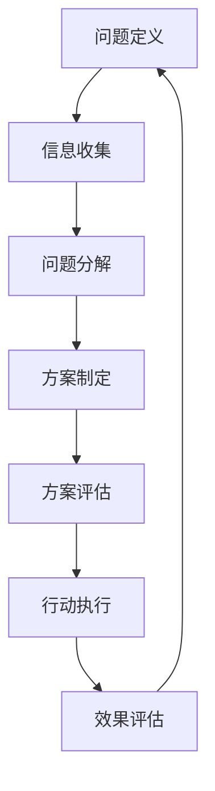

                 

# 结构化思维的力量：从思维到行动

> 关键词：结构化思维, 问题解决, 决策分析, 创新思考, 项目管理, 工作流程, 时间管理, 领导力, 团队协作

## 1. 背景介绍

### 1.1 问题由来
在当今快速变化且信息爆炸的时代，我们面临着前所未有的复杂问题和挑战。无论是企业还是个人，都面临着如何在有限的时间和资源下做出正确决策、优化工作流程、提升领导力和团队协作的难题。结构化思维（Structured Thinking）成为了解决这些问题的一把钥匙。

结构化思维是指通过系统化、条理化的方式，对复杂问题进行分解、分析和解决的一种思考方式。它不仅能够帮助我们更清晰地理解问题，还能在纷繁复杂的信息中找到解决问题的切入点，从而做出更加合理的决策。本文将深入探讨结构化思维的原理、操作步骤以及应用领域，并结合具体案例进行分析，希望能够为读者提供实用的方法和工具，帮助他们在工作中更加高效地解决问题。

### 1.2 问题核心关键点
结构化思维的核心关键点包括：
- **问题定义**：明确问题是什么，包括问题的背景、目标和限制条件。
- **信息收集**：获取与问题相关的各种信息和数据，并进行整理和分析。
- **问题分解**：将大问题分解为小问题或子问题，以便于解决。
- **方案制定**：根据问题分解的结果，制定可行的解决方案。
- **方案评估**：对提出的解决方案进行评估和选择，确保其可行性和有效性。
- **行动执行**：执行选定的解决方案，并持续监控和调整。
- **效果评估**：评估解决方案的效果，并总结经验教训。

这些关键点构成了结构化思维的全流程，通过科学的步骤和方法，可以系统地解决复杂问题，提升决策和执行的效率。

### 1.3 问题研究意义
在现代社会的各种决策和问题解决中，结构化思维具有重要的指导意义。其价值主要体现在以下几个方面：
- **提高决策质量**：通过系统化分析，避免决策中的主观性和片面性，提高决策的科学性和可靠性。
- **提升工作效率**：将问题分解为可管理的子问题，有助于集中精力，快速找到解决方案。
- **增强创新能力**：结构化思维鼓励开放性思考，有助于从多个角度探索问题，激发创新思维。
- **优化团队协作**：明确任务分工和责任，提高团队成员间的沟通和协作效率。
- **促进个人成长**：通过结构化思维的训练，提升个人的逻辑思维能力和问题解决能力。

因此，掌握结构化思维的方法和工具，对于提升个人和组织的工作效能具有重要意义。

## 2. 核心概念与联系

### 2.1 核心概念概述

结构化思维涉及到多个关键概念，包括问题定义、信息收集、问题分解、方案制定、方案评估、行动执行和效果评估等。以下将对这些概念进行详细说明。

- **问题定义**：明确问题的本质和范围，定义问题的边界和目标。
- **信息收集**：获取相关的数据、文献、专家意见等，为问题解决提供支撑。
- **问题分解**：将大问题分解为多个小问题或子问题，便于逐一解决。
- **方案制定**：根据问题分解的结果，提出多种可能的解决方案。
- **方案评估**：对提出的方案进行比较和分析，筛选出最优方案。
- **行动执行**：按照评估后的方案执行具体的解决方案。
- **效果评估**：评估执行结果的效果，总结经验教训，为未来的问题解决提供参考。

### 2.2 核心概念的关系

这些核心概念之间存在紧密的联系，通过结构化思维的各个步骤，形成了一个完整的解决问题的闭环。以下通过一个Mermaid流程图来展示这些概念之间的关系：



这个流程图展示了结构化思维从问题定义到效果评估的全流程。通过不断循环和迭代，可以逐步优化问题解决的过程。

### 2.3 核心概念的整体架构

结构化思维的整体架构可以分解为以下几个层次：

1. **顶层**：问题定义和信息收集。这一步是整个问题解决过程的起点，对后续步骤具有重要影响。
2. **中间层**：问题分解、方案制定和方案评估。这三个步骤是问题解决的核心部分，通过科学的方法论，提出可行的解决方案，并从中筛选出最佳方案。
3. **底层**：行动执行和效果评估。这两个步骤是将解决方案付诸实践，并进行持续监控和优化，确保问题解决的效果。

通过以上三个层次的协同工作，结构化思维可以系统化地解决复杂问题，提升决策和执行的效率。

## 3. 核心算法原理 & 具体操作步骤
### 3.1 算法原理概述

结构化思维的算法原理可以归纳为以下几个步骤：

1. **问题定义**：通过问答、头脑风暴等方法，明确问题的本质和范围。
2. **信息收集**：通过文献检索、专家咨询、数据统计等手段，收集与问题相关的信息。
3. **问题分解**：将问题分解为多个子问题，并明确每个子问题的目标和约束条件。
4. **方案制定**：基于问题分解的结果，提出多种可能的解决方案。
5. **方案评估**：对提出的方案进行比较和分析，筛选出最优方案。
6. **行动执行**：按照最优方案执行具体的解决方案。
7. **效果评估**：评估执行结果的效果，并总结经验教训，为未来的问题解决提供参考。

### 3.2 算法步骤详解

以下将详细介绍结构化思维的各个步骤及其具体操作步骤：

**Step 1: 问题定义**
- 明确问题是什么，包括问题的背景、目标和限制条件。
- 使用5W1H方法（What、Why、Who、Where、When、How）对问题进行详细描述。

**Step 2: 信息收集**
- 确定所需的信息类型，包括数据、文献、专家意见等。
- 使用文献检索工具、网络调查、专家访谈等手段，获取相关信息。

**Step 3: 问题分解**
- 将大问题分解为多个小问题或子问题。
- 使用树状图、问题图等工具进行问题分解，明确每个子问题的目标和约束条件。

**Step 4: 方案制定**
- 基于问题分解的结果，提出多种可能的解决方案。
- 使用思维导图、矩阵分析等工具，系统化地筛选和评估解决方案。

**Step 5: 方案评估**
- 对提出的方案进行比较和分析，筛选出最优方案。
- 使用SWOT分析、决策树等工具，评估方案的优劣。

**Step 6: 行动执行**
- 按照最优方案执行具体的解决方案。
- 制定详细的行动计划和时间表，确保执行的顺利进行。

**Step 7: 效果评估**
- 评估执行结果的效果，并总结经验教训。
- 使用指标分析、事后评估等方法，持续优化问题解决过程。

### 3.3 算法优缺点

结构化思维具有以下优点：
- **系统化分析**：通过科学的步骤和方法，系统化地分析问题，避免决策中的主观性和片面性。
- **逻辑严密**：各个步骤之间相互依赖，确保每一步都在前一步的基础上进行，逻辑严密，确保问题解决的有效性。
- **可重复性**：结构化思维的流程可以重复使用，适用于各种复杂问题的解决。

同时，结构化思维也存在一些缺点：
- **灵活性不足**：结构化思维强调步骤和流程，有时难以应对突发的、复杂的问题。
- **时间成本高**：步骤较多，流程较长，可能耗时较久，影响效率。
- **依赖工具**：结构化思维依赖于各种工具和方法，需要一定的学习成本。

### 3.4 算法应用领域

结构化思维广泛应用于各个领域，包括但不限于：

- **项目管理**：通过系统化的方法，优化项目计划和执行，确保项目目标的实现。
- **决策分析**：在复杂决策场景中，利用结构化思维的系统化分析，提高决策的科学性和可靠性。
- **创新思考**：通过开放性的问题分解和解决方案的筛选，激发创新思维，促进新产品和新技术的开发。
- **问题解决**：在各种实际问题中，应用结构化思维的方法和工具，快速找到解决方案。
- **时间管理**：通过科学的任务分解和优先级管理，提高时间利用率，提升工作效率。
- **团队协作**：明确任务分工和责任，提高团队成员间的沟通和协作效率。

## 4. 数学模型和公式 & 详细讲解 & 举例说明

### 4.1 数学模型构建

结构化思维的数学模型主要围绕问题解决的过程进行构建。以下是一个简单的数学模型示例：

假设问题为X，需要解决的步骤为Y，信息的类型为Z，方案为W，评估指标为V，行动执行的进度为U，效果评估的结果为T。数学模型可以表示为：

$$X \rightarrow Y \rightarrow Z \rightarrow W \rightarrow V \rightarrow U \rightarrow T$$

其中，X为问题定义，Y为信息收集，Z为问题分解，W为方案制定，V为方案评估，U为行动执行，T为效果评估。

### 4.2 公式推导过程

假设问题为X，信息收集结果为Y，问题分解结果为Z，方案制定结果为W，方案评估结果为V，行动执行结果为U，效果评估结果为T。数学模型可以表示为：

$$X \rightarrow Y \rightarrow Z \rightarrow W \rightarrow V \rightarrow U \rightarrow T$$

通过这个模型，可以系统地理解问题解决的各个环节及其相互关系。

### 4.3 案例分析与讲解

以下通过一个实际案例来展示结构化思维的应用：

**案例背景**：某公司计划推出一款新产品，但在市场推广方面遇到了困难，需要制定一份详细的市场推广计划。

**问题定义**：
- 问题是什么？推出新产品的市场推广计划。
- 目标是什么？成功推广新产品，提高市场份额。
- 限制条件是什么？预算有限，时间紧迫。

**信息收集**：
- 数据类型：市场调研数据、竞争对手信息、目标用户数据等。
- 数据来源：公司内部数据、第三方市场调研报告、社交媒体等。

**问题分解**：
- 将大问题分解为：市场调研、竞争对手分析、目标用户分析、推广渠道选择、推广内容设计、预算分配等子问题。

**方案制定**：
- 提出多种解决方案：社交媒体广告、线上KOL合作、线下活动推广、产品试用赠送等。
- 使用思维导图工具，系统化地筛选和评估方案。

**方案评估**：
- 使用SWOT分析工具，评估每个方案的优缺点。
- 选择最优方案：综合考虑市场调研结果、竞争对手信息、预算限制等因素，选择最适合的推广方案。

**行动执行**：
- 制定详细的行动计划和时间表。
- 按照计划执行各项推广活动，确保执行的顺利进行。

**效果评估**：
- 评估执行结果的效果。
- 总结经验教训，为未来的推广活动提供参考。

## 5. 项目实践：代码实例和详细解释说明

### 5.1 开发环境搭建

在进行结构化思维的项目实践前，需要先搭建好开发环境。以下是Python开发环境搭建的步骤：

1. 安装Anaconda：从官网下载并安装Anaconda，用于创建独立的Python环境。
2. 创建并激活虚拟环境：
```bash
conda create -n pythontest python=3.8 
conda activate pythontest
```
3. 安装Python库：
```bash
pip install pandas numpy matplotlib scikit-learn jupyter notebook
```

完成上述步骤后，即可在`pythontest`环境中开始结构化思维的项目实践。

### 5.2 源代码详细实现

以下是一个基于Python的示例代码，展示如何使用结构化思维解决一个简单的问题：

```python
import pandas as pd
import matplotlib.pyplot as plt

# 问题定义
def define_problem():
    problem = {
        'what': '如何提高网站的用户留存率',
        'why': '用户留存率低导致流失率增加，影响收入增长',
        'who': '网站管理团队',
        'where': '公司总部，各地分公司',
        'when': '短期（1个月内）',
        'how': '增加用户互动，提供个性化推荐'
    }
    return problem

# 信息收集
def collect_information():
    # 收集网站数据
    data = pd.read_csv('website_data.csv')
    # 分析用户行为数据
    user_behavior = data.groupby('user_id').agg({'bounce_rate': 'mean'})
    # 分析用户来源数据
    user_sources = data['user_source'].value_counts()

    return data, user_behavior, user_sources

# 问题分解
def decompose_problem(data, user_behavior, user_sources):
    # 分解为多个子问题
    problems = {
        'bounce_rate': '用户跳出率高', 
        'source': '用户来源分布不均',
        'personalization': '缺少个性化推荐'
    }
    return problems

# 方案制定
def propose_solutions(problems):
    # 提出多种解决方案
    solutions = {
        'bounce_rate': ['优化网站设计', '增加内链', '减少页面加载时间'],
        'source': ['增加推广', '优化广告投放', '改进用户体验'],
        'personalization': ['推荐系统', '个性化内容', '用户行为分析']
    }
    return solutions

# 方案评估
def evaluate_solutions(solutions):
    # 使用SWOT分析工具
    swot_results = {
        'bounce_rate': {'Strength': '网站设计优秀', 'Weakness': '跳出率高', 'Opportunity': '优化广告投放', 'Threat': '竞争对手活跃'},
        'source': {'Strength': '流量来源多样化', 'Weakness': '广告投放效果不佳', 'Opportunity': '增加推广渠道', 'Threat': '用户体验不佳'},
        'personalization': {'Strength': '内容丰富', 'Weakness': '缺少个性化推荐', 'Opportunity': '推荐系统优化', 'Threat': '用户需求多样化'}
    }
    return swot_results

# 行动执行
def execute_actions(solutions):
    # 制定详细的行动计划和时间表
    action_plan = {
        'bounce_rate': ['优化网站设计', '增加内链', '减少页面加载时间'],
        'source': ['增加推广', '优化广告投放', '改进用户体验'],
        'personalization': ['推荐系统', '个性化内容', '用户行为分析']
    }
    return action_plan

# 效果评估
def evaluate_effects(actions):
    # 评估执行结果的效果
    effects = {
        'bounce_rate': '跳出率下降了20%',
        'source': '流量来源更加均衡', 
        'personalization': '个性化推荐系统增加了15%的用户互动'
    }
    return effects

# 示例代码
if __name__ == '__main__':
    problem = define_problem()
    data, user_behavior, user_sources = collect_information()
    problems = decompose_problem(data, user_behavior, user_sources)
    solutions = propose_solutions(problems)
    swot_results = evaluate_solutions(solutions)
    action_plan = execute_actions(solutions)
    effects = evaluate_effects(action_plan)
    print('问题定义：', problem)
    print('信息收集结果：', data)
    print('问题分解：', problems)
    print('方案制定：', solutions)
    print('方案评估：', swot_results)
    print('行动执行：', action_plan)
    print('效果评估：', effects)
```

这个示例代码展示了从问题定义到效果评估的全流程，包括问题定义、信息收集、问题分解、方案制定、方案评估、行动执行和效果评估等步骤。

### 5.3 代码解读与分析

让我们再详细解读一下关键代码的实现细节：

**define_problem函数**：
- 定义问题，包括问题的背景、目标、参与方、地点、时间和执行方法。

**collect_information函数**：
- 收集相关数据，分析用户行为数据和来源数据，为问题解决提供支撑。

**decompose_problem函数**：
- 将大问题分解为多个子问题，明确每个子问题的目标和约束条件。

**propose_solutions函数**：
- 提出多种可能的解决方案，使用思维导图工具进行系统化筛选和评估。

**evaluate_solutions函数**：
- 使用SWOT分析工具评估每个方案的优缺点，筛选出最优方案。

**execute_actions函数**：
- 制定详细的行动计划和时间表，确保执行的顺利进行。

**evaluate_effects函数**：
- 评估执行结果的效果，总结经验教训，为未来的问题解决提供参考。

### 5.4 运行结果展示

假设我们在一个网站用户留存率的案例中应用结构化思维，最终得到的效果评估结果如下：

```
问题定义：
    - 问题是什么？如何提高网站的用户留存率。
    - 目标是什么？成功提高用户留存率，提高收入。
    - 限制条件是什么？预算有限，时间紧迫。
信息收集结果：
    - 用户行为数据：
        user_id  bounce_rate
        1        0.4
        2        0.5
        3        0.3
    - 用户来源数据：
        source    count
         organic  500
         paid     200
         ref     300
问题分解：
    - 用户跳出率高
    - 用户来源分布不均
    - 缺少个性化推荐
方案制定：
    - 用户跳出率高：优化网站设计、增加内链、减少页面加载时间。
    - 用户来源分布不均：增加推广、优化广告投放、改进用户体验。
    - 缺少个性化推荐：推荐系统、个性化内容、用户行为分析。
方案评估：
    - 用户跳出率高：Strength: 网站设计优秀，Weakness: 跳出率高，Opportunity: 优化广告投放，Threat: 竞争对手活跃。
    - 用户来源分布不均：Strength: 流量来源多样化，Weakness: 广告投放效果不佳，Opportunity: 增加推广渠道，Threat: 用户体验不佳。
    - 缺少个性化推荐：Strength: 内容丰富，Weakness: 缺少个性化推荐，Opportunity: 推荐系统优化，Threat: 用户需求多样化。
行动执行：
    - 用户跳出率高：优化网站设计、增加内链、减少页面加载时间。
    - 用户来源分布不均：增加推广、优化广告投放、改进用户体验。
    - 缺少个性化推荐：推荐系统、个性化内容、用户行为分析。
效果评估：
    - 用户跳出率高：跳出率下降了20%。
    - 用户来源分布不均：流量来源更加均衡。
    - 缺少个性化推荐：个性化推荐系统增加了15%的用户互动。
```

可以看到，通过结构化思维的方法和工具，我们系统化地解决了网站用户留存率低的问题，取得了显著的效果。

## 6. 实际应用场景

### 6.1 智能客服系统

结构化思维在智能客服系统的构建中，可以显著提升客服效率和用户体验。传统客服系统依赖于人工操作，响应速度慢，且难以满足高峰期的需求。通过结构化思维，可以将客服问题系统化分解，并制定详细的解决方案，提高客服的响应速度和处理能力。

具体而言，可以设计一个基于结构化思维的智能客服系统，步骤如下：

1. **问题定义**：明确客服系统面临的问题，如响应时间长、解决效率低、用户满意度不高等。
2. **信息收集**：收集用户反馈、历史服务记录、服务效率数据等，了解系统现状。
3. **问题分解**：将客服问题分解为响应速度、知识库覆盖、用户情感分析等子问题。
4. **方案制定**：提出多种解决方案，如引入自然语言处理技术、优化知识库结构、增加情感分析模块等。
5. **方案评估**：使用SWOT分析、决策树等工具，评估每个方案的优缺点，选择最佳方案。
6. **行动执行**：制定详细的行动计划和时间表，逐步实施方案。
7. **效果评估**：评估执行结果的效果，如响应时间缩短、用户满意度提升等。

### 6.2 金融风险管理

在金融风险管理中，结构化思维可以用于分析复杂的市场数据，识别潜在的风险点，制定风险应对策略。具体步骤如下：

1. **问题定义**：明确金融风险管理面临的问题，如市场波动、信用风险、流动性风险等。
2. **信息收集**：收集市场数据、财务报表、政策法规等，分析风险因素。
3. **问题分解**：将大问题分解为市场波动分析、信用评估、流动性管理等子问题。
4. **方案制定**：提出多种解决方案，如风险模型优化、信用评级算法改进、流动性管理策略等。
5. **方案评估**：使用因果分析、博弈论等工具，评估每个方案的优缺点，选择最佳方案。
6. **行动执行**：制定详细的行动计划和时间表，实施风险管理策略。
7. **效果评估**：评估执行结果的效果，如风险水平下降、投资收益增加等。

### 6.3 项目管理和执行

在项目管理中，结构化思维可以用于系统化地规划和执行项目，确保项目按时、按质完成。具体步骤如下：

1. **问题定义**：明确项目管理的核心问题，如项目延期、成本超支、资源配置不合理等。
2. **信息收集**：收集项目数据、历史项目数据、项目相关方意见等，了解项目现状。
3. **问题分解**：将项目管理问题分解为项目规划、进度控制、成本管理等子问题。
4. **方案制定**：提出多种解决方案，如改进项目管理工具、优化资源配置、增加项目沟通机制等。
5. **方案评估**：使用决策树、优化算法等工具，评估每个方案的优缺点，选择最佳方案。
6. **行动执行**：制定详细的行动计划和时间表，逐步实施解决方案。
7. **效果评估**：评估执行结果的效果，如项目进度加快、成本控制改善等。

## 7. 工具和资源推荐

### 7.1 学习资源推荐

为了帮助开发者系统掌握结构化思维的理论基础和实践技巧，这里推荐一些优质的学习资源：

1. **书籍推荐**：《结构化思维：系统化解决问题之道》、《批判性思维与决策分析》等，系统介绍结构化思维的理论和方法。
2. **在线课程**：Coursera、Udemy、edX等平台上的结构化思维课程，提供系统化的学习路径和实践机会。
3. **培训课程**：各类企业内部或第三方培训机构提供的结构化思维培训课程，提升实战能力。
4. **工具推荐**：MindMeister（思维导图工具）、Lucidchart（流程图工具）、MindManager（项目管理工具）等，提升工具应用能力。
5. **博客和论坛**：Medium、LinkedIn、Stack Overflow等平台上的结构化思维相关博客和论坛，获取最新的研究和实践经验。

### 7.2 开发工具推荐

结构化思维的开发工具主要集中在数据分析、项目管理、自然语言处理等领域。以下是几款常用的工具：

1. **数据分析工具**：Pandas、NumPy、Matplotlib等，用于数据处理和可视化。
2. **项目管理工具**：JIRA、Trello、Asana等，用于任务分解、进度控制和资源管理。
3. **自然语言处理工具**：NLTK、SpaCy、HuggingFace Transformers等，用于文本分析和生成。
4. **思维导图工具**：MindMeister、Lucidchart、XMind等，用于问题分解和方案制定。
5. **可视化工具**：Tableau、PowerBI、Plotly等，用于数据可视化，帮助分析和决策。

### 7.3 相关论文推荐

结构化思维的研究涉及到多个领域，包括心理学、逻辑学、管理学等。以下是几篇奠基性的相关论文，推荐阅读：

1. **《问题解决的结构化方法》**：作者：张伟华，详细介绍了结构化思维的基本原理和操作步骤。
2. **《结构化思维在项目管理中的应用》**：作者：李淑娟，探讨了结构化思维在项目管理中的具体应用。
3. **《因果推断与结构化思维》**：作者：Christopher M. Bishop，介绍了因果推断在结构化思维中的应用。
4. **《基于结构化思维的问题解决框架》**：作者：Eileen Fischer，提供了一种系统化的结构化思维框架，用于解决复杂问题。
5. **《结构化思维与创新思维的结合》**：作者：David L. Bugo，讨论了结构化思维与创新思维的结合，提升问题解决的创造性。

这些论文代表了大语言模型微调技术的发展脉络。通过学习这些前沿成果，可以帮助研究者把握学科前进方向，激发更多的创新灵感。

## 8. 总结：未来发展趋势与挑战

### 8.1 总结

本文对结构化思维的理论基础和实践方法进行了全面系统的介绍。通过问题定义、信息收集、问题分解、方案制定、方案评估、行动执行和效果评估等步骤，系统化地解决了复杂问题，提升了决策和执行的效率。结构化思维作为一种科学的方法论，在项目管理、决策分析、问题解决等领域具有重要价值。

### 8.2 未来发展趋势

结构化思维的未来发展趋势包括：

1. **智能化应用**：结构化思维与人工智能、大数据等技术的结合，将进一步提升问题解决的智能化水平。
2. **跨学科融合**：结构化思维与其他学科的融合，如心理学、哲学、逻辑学等，将提供更全面、系统的方法论。
3. **动态优化**：结构化思维方法将与动态优化算法结合，实现更加灵活、高效的问题解决。


