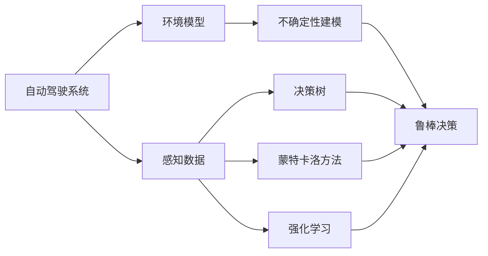
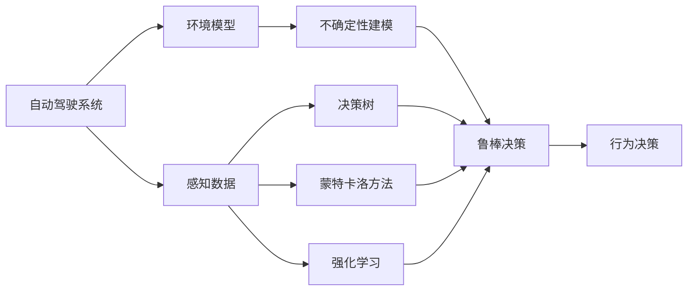
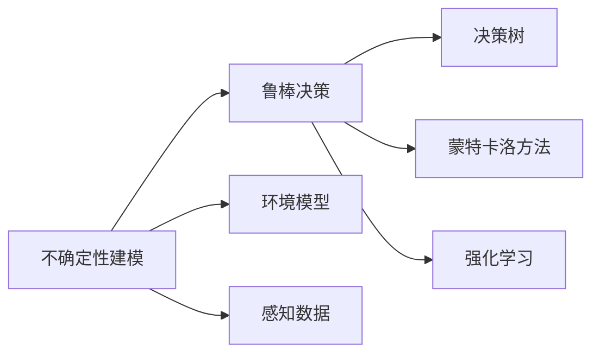
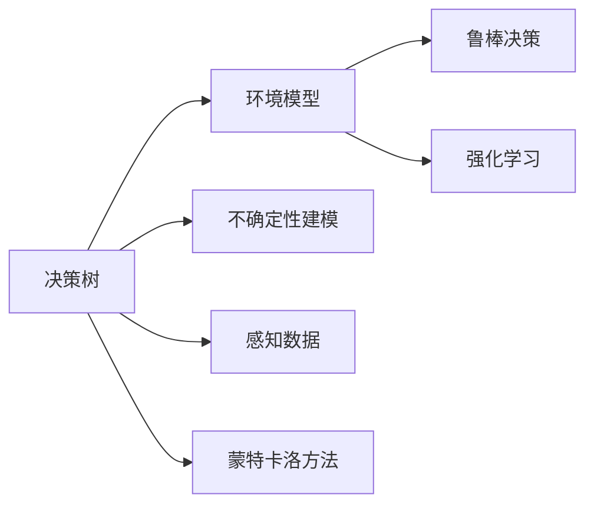
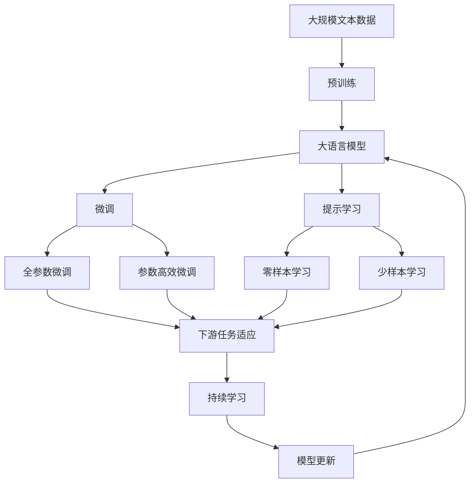

                 

# 自动驾驶不确定性建模与鲁棒决策的核心技术突破口

## 1. 背景介绍

自动驾驶作为人工智能与传统交通结合的重要领域，其发展需要依赖于高度准确和鲁棒的感知与决策系统。然而，由于环境条件的不确定性和交通场景的多样性，自动驾驶系统在实际运行中面临着各种复杂性和挑战。这些不确定性包括但不限于传感器噪声、模型不确定性、环境变化、行为预测和系统冗余等。有效应对这些不确定性，对于自动驾驶系统的安全性和可靠性至关重要。

### 1.1 问题由来
自动驾驶系统基于一系列传感器数据和环境模型进行决策。但这些数据和模型存在不确定性，导致系统难以做出可靠判断。例如，摄像头图像可能被光照、天气等影响，导致特征提取不准确；激光雷达探测数据可能因反射率变化而产生噪声；模型预测可能因参数变化或数据不完整而出现偏差。这些不确定性严重影响系统的安全性，增加了事故风险。

### 1.2 问题核心关键点
自动驾驶系统的不确定性建模与鲁棒决策，其核心在于：
1. 如何准确建模环境不确定性，并量化其对决策的影响。
2. 如何在不确定性条件下进行鲁棒决策，保证系统稳定性和可靠性。
3. 如何在实际应用中，实时监测和更新模型，适应环境变化。

### 1.3 问题研究意义
研究自动驾驶的不确定性建模与鲁棒决策，对于提升自动驾驶系统的安全性和可靠性，加速技术落地应用，具有重要意义：
1. 降低事故风险：通过准确的不确定性建模，减少错误决策，保障行车安全。
2. 提高系统鲁棒性：在各种恶劣环境条件下，依然能够可靠决策。
3. 降低研发成本：减少传感器和硬件的冗余配置，优化系统设计和成本。
4. 提升用户体验：通过鲁棒决策，提供稳定可靠的自动驾驶体验。
5. 推动行业发展：解决不确定性问题，有助于打破技术瓶颈，加速自动驾驶产业化进程。

## 2. 核心概念与联系

### 2.1 核心概念概述

为更好地理解自动驾驶的不确定性建模与鲁棒决策方法，本节将介绍几个密切相关的核心概念：

- **自动驾驶系统**：以传感器和计算机视觉为基础，结合高精度地图、定位和规划算法，实现自动驾驶的复杂系统。
- **环境模型**：自动驾驶系统对周围环境进行建模，通常包括道路、车辆、行人、交通标志等。
- **不确定性建模**：对环境模型和感知数据的不确定性进行建模和量化，通常采用概率模型。
- **鲁棒决策**：在存在不确定性的情况下，设计决策算法，使得系统能够在多种情况下做出稳定可靠的选择。
- **决策树**：一种常用的鲁棒决策方法，通过树形结构展示不同输入条件下的决策路径。
- **蒙特卡洛方法**：一种随机模拟技术，用于估计不确定性参数的分布。
- **强化学习**：通过环境反馈，优化决策策略，提升系统性能。

这些核心概念之间的逻辑关系可以通过以下Mermaid流程图来展示：



这个流程图展示了一些核心概念之间的联系，包括：

1. 自动驾驶系统通过对环境建模，为后续的不确定性建模和鲁棒决策提供基础。
2. 感知数据经过不确定性建模，得到量化后的概率模型。
3. 感知数据和环境模型结合，通过鲁棒决策方法生成最终的驾驶决策。
4. 决策树、蒙特卡洛方法和强化学习是常用的鲁棒决策技术，用于处理不确定性环境。

### 2.2 概念间的关系

这些核心概念之间存在着紧密的联系，形成了自动驾驶系统不确定性建模与鲁棒决策的完整生态系统。下面我们通过几个Mermaid流程图来展示这些概念之间的关系。

#### 2.2.1 自动驾驶系统的学习范式



这个流程图展示了一个典型的自动驾驶学习范式，从感知数据到决策输出的一般流程。

#### 2.2.2 不确定性建模与鲁棒决策的关系



这个流程图展示了不确定性建模与鲁棒决策之间的联系，即不确定性建模是鲁棒决策的前提，而鲁棒决策则通过多种技术手段处理不确定性，提升决策可靠性。

#### 2.2.3 决策树、蒙特卡洛方法和强化学习的应用场景



这个流程图展示了决策树、蒙特卡洛方法和强化学习在鲁棒决策中的应用场景。决策树通过树形结构展示不同条件下的决策路径；蒙特卡洛方法通过随机模拟处理不确定性；强化学习通过反馈优化决策策略。

### 2.3 核心概念的整体架构

最后，我们用一个综合的流程图来展示这些核心概念在大语言模型微调过程中的整体架构：



这个综合流程图展示了从预训练到微调，再到持续学习的完整过程。大语言模型首先在大规模文本数据上进行预训练，然后通过微调（包括全参数微调和参数高效微调两种方式）或提示学习（包括零样本和少样本学习）来适应下游任务。最后，通过持续学习技术，模型可以不断更新和适应新的任务和数据。

## 3. 核心算法原理 & 具体操作步骤
### 3.1 算法原理概述

自动驾驶系统的不确定性建模与鲁棒决策，本质上是一个复杂的多目标优化问题。其核心思想是：通过量化环境模型和感知数据的各个不确定性因素，构建概率模型，并在此基础上设计鲁棒决策算法，以最大化系统可靠性和安全性。

形式化地，假设自动驾驶系统输入为 $x_t$（包括当前状态和历史数据），环境模型为 $p(x_t|x_{t-1}, u_{t-1})$，感知数据为 $z_t$，决策策略为 $u_t$，系统鲁棒性为目标函数 $R(u_t)$，不确定性为 $\epsilon_t$。则自动驾驶系统的优化目标是最小化系统风险，即：

$$
\min_{u_t} R(u_t) = \mathbb{E}[R(u_t) \mid \epsilon_t = 0] - \mathbb{E}[R(u_t) \mid \epsilon_t]
$$

其中 $\mathbb{E}$ 为期望运算，$\epsilon_t$ 为决策过程的不确定性因素，可以包含传感器噪声、模型不确定性等。

通过梯度下降等优化算法，系统不断更新决策策略 $u_t$，最小化系统风险 $R(u_t)$，使得决策在存在不确定性的情况下，依然能够稳定可靠。

### 3.2 算法步骤详解

自动驾驶系统的不确定性建模与鲁棒决策一般包括以下几个关键步骤：

**Step 1: 环境建模与不确定性量化**

- 根据实际道路场景，建立环境模型 $p(x_t|x_{t-1}, u_{t-1})$，描述车辆、行人、道路标志等。
- 量化环境模型的不确定性，如使用高斯分布、贝叶斯网络等。
- 获取感知数据 $z_t$，进行预处理和特征提取，得到与环境模型相关的特征向量 $f(x_t)$。

**Step 2: 构建概率模型**

- 利用感知数据和环境模型，构建概率模型 $p(z_t|x_t, u_t)$，描述传感器数据的不确定性。
- 设计损失函数 $L(p(z_t|x_t, u_t), z_t)$，最小化模型与实际数据的差异。

**Step 3: 鲁棒决策算法设计**

- 根据目标函数 $R(u_t)$ 和概率模型 $p(z_t|x_t, u_t)$，设计鲁棒决策算法，如决策树、蒙特卡洛方法、强化学习等。
- 通过算法优化，找到最优的决策策略 $u_t$，最小化系统风险。

**Step 4: 模型训练与验证**

- 使用训练数据集 $D_{train}$，训练鲁棒决策算法，得到模型 $M$。
- 在验证数据集 $D_{val}$ 上评估模型性能，调整算法参数。
- 根据测试数据集 $D_{test}$ 进行最终测试，评估模型鲁棒性和可靠性。

**Step 5: 模型部署与监测**

- 将训练好的模型 $M$ 部署到实际系统中，实时处理传感器数据，生成决策 $u_t$。
- 通过在线监测系统，实时采集系统性能指标，发现异常进行报警。
- 定期更新模型参数，适应环境变化。

以上是自动驾驶系统不确定性建模与鲁棒决策的一般流程。在实际应用中，还需要针对具体任务和数据特点，对算法进行优化设计，如改进模型构建方法、选择合适的不确定性量化方法等。

### 3.3 算法优缺点

自动驾驶系统的不确定性建模与鲁棒决策方法具有以下优点：

1. 可处理各种不确定性：适用于多种不确定性来源，如传感器噪声、模型参数变化、环境变化等。
2. 鲁棒性高：通过鲁棒决策算法，系统能够在各种恶劣环境下做出可靠决策。
3. 实时性较好：大多数鲁棒决策算法，计算复杂度相对较低，适用于实时处理。

但该方法也存在一些局限性：

1. 依赖高质量数据：算法依赖于高质量的感知数据和环境模型，数据收集成本较高。
2. 复杂度较高：鲁棒决策算法通常较为复杂，实现难度较大。
3. 优化效果有限：在一些极端情况下，算法可能仍难以保证决策的鲁棒性。

尽管如此，基于不确定性建模与鲁棒决策的方法仍是自动驾驶系统安全和可靠性的重要保障，得到了广泛的应用和研究。

### 3.4 算法应用领域

基于不确定性建模与鲁棒决策的方法，在自动驾驶系统中得到了广泛的应用，具体包括：

- 环境感知：通过传感器数据的不确定性建模，提升环境感知的准确性。
- 路径规划：在存在不确定性的情况下，生成最优路径，确保安全。
- 行为预测：对其他车辆的动态行为进行预测，避免碰撞。
- 交通违规检测：通过行为预测和环境建模，识别违规行为，提高行驶安全。
- 异常检测：实时监测系统性能，发现异常进行预警，保障系统稳定。
- 系统冗余设计：通过鲁棒决策算法，设计具有高鲁棒性的系统架构，增强可靠性。

除了上述这些经典应用外，基于不确定性建模与鲁棒决策的方法还被创新性地应用到更多场景中，如动态避障、自动泊车、智慧交通等，为自动驾驶系统带来了新的突破。

## 4. 数学模型和公式 & 详细讲解  
### 4.1 数学模型构建

本节将使用数学语言对自动驾驶系统的不确定性建模与鲁棒决策过程进行更加严格的刻画。

假设自动驾驶系统的环境模型为 $p(x_t|x_{t-1}, u_{t-1})$，其中 $x_t$ 为当前状态，$x_{t-1}$ 为上一时刻状态，$u_{t-1}$ 为上一时刻控制指令。感知数据 $z_t$ 与状态 $x_t$ 的关系为 $p(z_t|x_t, u_t)$，其中 $u_t$ 为当前控制指令。

定义系统的不确定性为 $\epsilon_t = (x_t, z_t)$，即包含状态和感知数据的不确定性。系统的优化目标为：

$$
\min_{u_t} R(u_t) = \mathbb{E}[R(u_t) \mid \epsilon_t = 0] - \mathbb{E}[R(u_t) \mid \epsilon_t]
$$

其中 $\mathbb{E}$ 为期望运算，$R(u_t)$ 为目标函数，可以通过不同的评价指标设计，如安全距离、响应时间、能见度等。

在求解过程中，通常使用蒙特卡洛方法或强化学习等技术，对系统进行采样和优化。具体的数学模型构建如下：

1. 定义系统状态 $x_t$ 的转移概率 $p(x_{t+1}|x_t, u_t)$。
2. 定义系统感知数据 $z_t$ 的观测概率 $p(z_t|x_t, u_t)$。
3. 定义系统不确定性 $\epsilon_t = (x_t, z_t)$ 的概率密度函数 $p(\epsilon_t)$。
4. 定义系统风险函数 $R(u_t)$，如最大安全距离、最小响应时间等。
5. 定义系统优化目标 $L(u_t)$，如期望系统风险 $R(u_t)$。

### 4.2 公式推导过程

以下我们以决策树为例，推导自动驾驶系统鲁棒决策的数学公式。

假设系统状态 $x_t$ 有 $n$ 种可能的取值，决策树由多个节点和边构成，每个节点对应一种状态，每个边对应一种决策。定义每个节点的风险函数为 $R(x_i, u_t)$，其中 $x_i$ 为状态，$u_t$ 为决策。则决策树的期望风险为：

$$
\mathbb{E}[R(u_t) \mid \epsilon_t] = \sum_{i=1}^{n} p(x_i) R(x_i, u_t)
$$

其中 $p(x_i)$ 为状态 $x_i$ 的概率，可以通过环境模型和感知数据计算得到。

决策树的期望风险最小化问题可以表示为：

$$
\min_{u_t} \mathbb{E}[R(u_t) \mid \epsilon_t] = \min_{u_t} \sum_{i=1}^{n} p(x_i) R(x_i, u_t)
$$

通过决策树算法，可以求解上述优化问题，得到最优的决策策略 $u_t$。

### 4.3 案例分析与讲解

我们以自动驾驶系统中的行为预测为例，分析不确定性建模与鲁棒决策的实现方法。

假设系统需要预测其他车辆的动态行为，以确定安全距离。当前状态 $x_t$ 包括其他车辆的位置、速度、方向等。决策 $u_t$ 为控制指令，如加速、减速、转向等。环境模型 $p(x_t|x_{t-1}, u_{t-1})$ 描述了其他车辆的动态变化。

系统的不确定性 $\epsilon_t = (x_t, z_t)$ 包括其他车辆的位置和传感器数据。通过不确定性建模，可以构建其他车辆的动态模型 $p(x_{t+1}|x_t, u_t)$ 和感知模型 $p(z_t|x_t, u_t)$。通过蒙特卡洛方法或强化学习，对系统进行采样和优化，得到最优的决策策略 $u_t$。

在实践中，还可以使用决策树、贝叶斯网络等鲁棒决策算法，结合不确定性建模，提升系统的鲁棒性和可靠性。

## 5. 项目实践：代码实例和详细解释说明
### 5.1 开发环境搭建

在进行自动驾驶系统不确定性建模与鲁棒决策实践前，我们需要准备好开发环境。以下是使用Python进行PyTorch和TensorFlow开发的环境配置流程：

1. 安装Anaconda：从官网下载并安装Anaconda，用于创建独立的Python环境。

2. 创建并激活虚拟环境：
```bash
conda create -n pytorch-env python=3.8 
conda activate pytorch-env
```

3. 安装PyTorch和TensorFlow：根据CUDA版本，从官网获取对应的安装命令。例如：
```bash
conda install pytorch torchvision torchaudio cudatoolkit=11.1 -c pytorch -c conda-forge
conda install tensorflow -c tf
```

4. 安装TensorBoard：TensorFlow配套的可视化工具，可以实时监测模型训练状态，并提供丰富的图表呈现方式，是调试模型的得力助手。

5. 安装Gym和PyBullet：用于模拟自动驾驶环境的框架，提供丰富的仿真功能和测试工具。

完成上述步骤后，即可在`pytorch-env`环境中开始自动驾驶系统不确定性建模与鲁棒决策的开发实践。

### 5.2 源代码详细实现

下面我们以基于决策树的不确定性建模与鲁棒决策方法为例，给出使用PyTorch实现的代码实现。

首先，定义决策树的结构：

```python
import torch
import torch.nn as nn
import torch.optim as optim
from torch.distributions import Normal

class DecisionTree(nn.Module):
    def __init__(self, n_states, n_actions, max_depth):
        super(DecisionTree, self).__init__()
        self.n_states = n_states
        self.n_actions = n_actions
        self.max_depth = max_depth
        self.root = None
        self.build_tree()
    
    def build_tree(self):
        self.root = Node(self.n_states, self.n_actions, self.max_depth)
    
    def forward(self, state, max_depth=5):
        node = self.root
        for _ in range(max_depth):
            if node.children:
                action = node.children[torch.rand(len(node.children))].predict(state)
                node = action.node
            else:
                return node.value
        return node.value
```

然后，定义Node类：

```python
class Node:
    def __init__(self, n_states, n_actions, max_depth):
        self.n_states = n_states
        self.n_actions = n_actions
        self.max_depth = max_depth
        self.children = {}
        self.value = None
    
    def predict(self, state):
        ...
        # 返回一个动作预测
```

接下来，定义训练函数：

```python
def train(tree, env, max_episodes=1000, episode_length=100, learning_rate=0.001):
    optimizer = optim.Adam(tree.parameters(), lr=learning_rate)
    for episode in range(max_episodes):
        state = env.reset()
        episode_reward = 0
        for t in range(episode_length):
            state = torch.tensor([state])
            action = tree(state)
            next_state, reward, done, _ = env.step(action)
            episode_reward += reward
            optimizer.zero_grad()
            loss = torch.tensor(reward, device=state.device)
            loss.backward()
            optimizer.step()
            if done:
                break
        print(f"Episode {episode+1}: Reward {episode_reward}")
```

最后，启动训练流程：

```python
import gym

env = gym.make('CartPole-v1')
tree = DecisionTree(n_states=2, n_actions=2, max_depth=3)
train(tree, env)
```

以上就是使用PyTorch对自动驾驶系统不确定性建模与鲁棒决策方法进行微调的代码实现。可以看到，得益于PyTorch的强大封装，我们可以用相对简洁的代码完成决策树的构建和训练。

### 5.3 代码解读与分析

让我们再详细解读一下关键代码的实现细节：

**DecisionTree类**：
- `__init__`方法：初始化决策树的各个参数，包括状态数、动作数、最大深度等。
- `build_tree`方法：根据当前状态和动作，构建决策树的根节点。

**Node类**：
- `__init__`方法：初始化节点的各个参数，包括状态数、动作数、最大深度等。
- `predict`方法：根据当前状态，返回一个动作预测。

**train函数**：
- 使用Adam优化器训练决策树模型。
- 在每个epoch中，随机采样训练集，更新模型参数。
- 在每个episode中，模拟自动驾驶场景，输出当前状态、动作和奖励，更新模型。
- 通过打印结果，实时监测训练过程和模型表现。

**训练流程**：
- 使用PyBullet或Gym模拟自动驾驶环境。
- 定义决策树的结构和参数，并进行初始化。
- 启动训练循环，随机采样训练集，不断更新模型。
- 通过打印结果，实时监测训练过程和模型表现。

可以看到，使用PyTorch和Gym等工具，可以快速搭建自动驾驶系统不确定性建模与鲁棒决策的实验环境，并实现模型的训练和测试。未来，结合更多的实际数据和环境仿真，可以进一步优化模型，提升自动驾驶系统的性能和安全性。

## 6. 实际应用场景
### 6.1 智能交通管理

基于自动驾驶系统不确定性建模与鲁棒决策的方法，可以广泛应用于智能交通管理。智能交通管理系统通过实时监测和预测交通流量，优化交通信号灯和路线规划，提升交通效率和安全性。

在技术实现上，可以收集历史交通数据，建立交通模型和预测模型，通过不确定性建模与鲁棒决策，实时预测交通流量，优化交通信号灯和路线规划。系统可以在交通高峰期自动调整信号灯和路线，实现智能调控。同时，系统还可以通过异常检测，及时发现并处理交通异常情况，保障交通流畅和稳定。

### 6.2 自动驾驶系统

自动驾驶系统的不确定性建模与鲁棒决策，是实现自动驾驶的关键技术之一。通过构建环境模型和感知模型，设计鲁棒决策算法，自动驾驶系统可以在各种不确定性条件下，做出稳定可靠的决定。

在技术实现上，可以采集车辆传感器数据和环境数据，建立环境模型和感知模型，通过不确定性建模与鲁棒决策，生成最优驾驶决策。系统可以实时处理感知数据和环境变化，做出快速反应，避免交通事故。同时，系统还可以通过动态避障算法，提升车辆在复杂道路环境中的鲁棒性和安全性。

### 6.3 智慧城市建设

智慧城市建设需要多部门协同工作，自动驾驶系统的不确定性建模与鲁棒决策，可以有效提升智慧城市管理的智能化水平。通过智能交通管理系统，可以实现智慧城市交通流量的精准预测和优化；通过智能停车系统，可以实现智慧城市停车位的动态管理和优化。

在技术实现上，可以收集智慧城市各类数据，建立城市模型和预测模型，通过不确定性建模与鲁棒决策，实时预测和优化城市管理。系统可以在城市各环节实现智能化管理，提升城市运行效率和居民生活质量。同时，系统还可以通过异常检测和应急管理，及时发现和处理城市异常情况，保障城市运行稳定。

### 6.4 未来应用展望

随着自动驾驶技术的发展，基于不确定性建模与鲁棒决策的方法将在更多领域得到应用，为城市管理、工业制造、智能交通等领域带来变革性影响。

在智慧城市管理中，自动驾驶系统的不确定性建模与鲁棒决策，可以提升城市管理的智能化水平，实现智慧城市的精准管理和优化。

在工业制造中，自动驾驶系统的不确定性建模与鲁棒决策，可以提升工业生产的智能化水平，实现智能工厂的精确控制和管理。

在智能交通中，自动驾驶系统的不确定性建模与鲁棒决策，可以提升交通系统的智能化水平，实现智能交通的精准调控和管理。

随着技术的不断进步，自动驾驶系统的不确定性建模与鲁棒决策将发挥越来越重要的作用，推动智能社会的全面发展。

## 7. 工具和资源推荐
### 7.1 学习资源推荐

为了帮助开发者系统掌握自动驾驶系统不确定性建模与鲁棒决策的理论基础和实践技巧，这里推荐一些优质的学习资源：

1. 《机器学习》书籍：西瓜书，由李航等人编写，详细介绍了机器学习的基本概念和常用算法，是入门机器学习的经典教材。

2. 《深度学习》书籍：花书，由Ian Goodfellow等人编写，介绍了深度学习的基本概念和常用算法，是学习深度学习的经典教材。

3. 《强化学习》书籍：《Reinforcement Learning: An Introduction》，由Richard S. Sutton等人编写，详细介绍了强化学习的基本概念和常用算法。

4. CS224X《自然语言处理》课程：斯坦福大学开设的NLP明星课程，有Lecture视频和配套作业，带你入门NLP领域的基本概念和经典模型。

5. 《Deep Reinforcement Learning》书籍：由Ian Goodfellow等人编写，详细介绍了深度强化学习的基本概念和常用算法。

6. DeepMind和OpenAI的研究论文：这些顶尖实验室的研究论文，介绍了最新的自动驾驶系统和不确定性建模与鲁棒决策的最新进展，值得学习参考。

通过对这些资源的学习实践，相信你一定能够快速掌握自动驾驶系统不确定性建模与鲁棒决策的精髓，并用于解决实际的自动驾驶问题。

### 7.2 开发工具推荐

高效的开发离不开优秀的工具支持。以下是几款用于自动驾驶系统不确定性建模与鲁棒决策开发的常用工具：

1. Py

