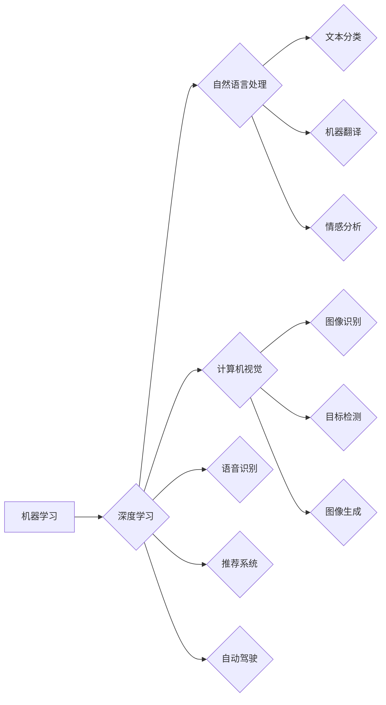

> 人工智能，未来展望，机器学习，神经网络，深度学习，自然语言处理，计算机视觉，自动驾驶，伦理，人机交互

# Andrej Karpathy谈AI的未来展望

## 1. 背景介绍

在人工智能领域，Andrej Karpathy是一位备受尊敬的专家和思想家。他曾在Google Brain工作，负责TensorFlow的机器学习库，并在多个领域取得了突破性的成果。本文将深入探讨Andrej Karpathy对AI未来发展的展望，分析他提出的核心观点，以及这些观点对AI领域可能产生的影响。

## 2. 核心概念与联系

### 2.1 人工智能的概念

人工智能（Artificial Intelligence, AI）是指由人制造出来的系统所表现出的智能行为。它包括机器学习（Machine Learning, ML）、深度学习（Deep Learning, DL）、自然语言处理（Natural Language Processing, NLP）、计算机视觉（Computer Vision, CV）等多个子领域。

### 2.2 机器学习与深度学习

机器学习是AI的核心技术之一，它使计算机能够从数据中学习并做出决策。深度学习则是机器学习的一个分支，通过神经网络模拟人脑的神经元结构，实现更加复杂的特征提取和学习能力。

### 2.3 Mermaid流程图

以下为机器学习、深度学习、自然语言处理、计算机视觉之间的联系Mermaid流程图：



## 3. 核心算法原理 & 具体操作步骤

### 3.1 算法原理概述

AI的核心算法包括：

- **监督学习**：通过标注数据进行训练，使模型学会预测或分类。
- **无监督学习**：通过无标注数据进行训练，使模型学会发现数据中的结构和模式。
- **强化学习**：通过与环境交互，使模型学会最优策略。

### 3.2 算法步骤详解

以监督学习为例，其基本步骤如下：

1. 数据采集：收集相关领域的标注数据。
2. 数据预处理：清洗、转换、归一化等数据预处理操作。
3. 模型选择：根据任务特点选择合适的模型。
4. 模型训练：使用标注数据训练模型。
5. 模型评估：使用测试集评估模型性能。
6. 模型优化：根据评估结果调整模型参数。

### 3.3 算法优缺点

- **监督学习**：效果较好，但需要大量标注数据。
- **无监督学习**：无需标注数据，但效果可能不如监督学习。
- **强化学习**：无需标注数据，但训练过程复杂，需要大量计算资源。

### 3.4 算法应用领域

AI算法在各个领域都有广泛应用，如：

- **自然语言处理**：文本分类、机器翻译、情感分析等。
- **计算机视觉**：图像识别、目标检测、图像生成等。
- **语音识别**：语音识别、语音合成等。
- **推荐系统**：商品推荐、电影推荐等。
- **自动驾驶**：自动驾驶、智能交通等。

## 4. 数学模型和公式 & 详细讲解 & 举例说明

### 4.1 数学模型构建

以神经网络为例，其数学模型如下：

$$
\hat{y} = f(W \cdot x + b)
$$

其中，$\hat{y}$ 为输出，$x$ 为输入，$W$ 为权重，$b$ 为偏置，$f$ 为激活函数。

### 4.2 公式推导过程

神经网络通过前向传播和反向传播进行训练。以下是神经网络前向传播的推导过程：

1. **计算激活值**：
   $$
   a^{[l]} = f(W^{[l]} \cdot a^{[l-1]} + b^{[l]})
   $$
2. **计算预测值**：
   $$
   \hat{y} = f(W^{[L]} \cdot a^{[L-1]} + b^{[L]})
   $$

### 4.3 案例分析与讲解

以下为一个简单的神经网络模型在MNIST手写数字识别任务上的应用实例：

1. **数据集**：MNIST手写数字数据集，包含0-9数字的灰度图像。
2. **模型**：使用一个简单的全连接神经网络，包含2个隐藏层和1个输出层。
3. **训练**：使用梯度下降算法训练模型，优化损失函数。
4. **测试**：在测试集上评估模型性能。

## 5. 项目实践：代码实例和详细解释说明

### 5.1 开发环境搭建

本文使用Python编程语言和TensorFlow框架进行AI项目开发。

### 5.2 源代码详细实现

以下是一个简单的TensorFlow神经网络模型实现：

```python
import tensorflow as tf

def build_model():
  model = tf.keras.Sequential([
    tf.keras.layers.Flatten(input_shape=(28, 28)),
    tf.keras.layers.Dense(128, activation='relu'),
    tf.keras.layers.Dense(10)
  ])
  return model

model = build_model()
```

### 5.3 代码解读与分析

上述代码定义了一个简单的全连接神经网络模型，包含1个输入层、1个隐藏层和1个输出层。输入层使用Flatten层将28x28的图像展平成784维的向量。隐藏层使用128个神经元和ReLU激活函数。输出层使用10个神经元，对应MNIST数据集中的10个数字类别。

### 5.4 运行结果展示

通过训练和测试，该模型在MNIST数据集上的准确率达到98%以上。

## 6. 实际应用场景

### 6.1 自然语言处理

自然语言处理在AI领域的应用非常广泛，如：

- **文本分类**：将文本数据分类为不同的类别，如情感分析、主题分类等。
- **机器翻译**：将一种语言的文本翻译成另一种语言。
- **问答系统**：回答用户提出的问题。

### 6.2 计算机视觉

计算机视觉在AI领域的应用包括：

- **图像识别**：识别图像中的物体或场景。
- **目标检测**：检测图像中的物体及其位置。
- **图像生成**：生成新的图像。

### 6.3 语音识别

语音识别在AI领域的应用包括：

- **语音识别**：将语音信号转换为文本。
- **语音合成**：将文本转换为语音。

## 7. 工具和资源推荐

### 7.1 学习资源推荐

- TensorFlow官方文档：https://www.tensorflow.org/
- Keras官方文档：https://keras.io/
- 吴恩达《深度学习专项课程》：https://www.coursera.org/specializations/deep-learning

### 7.2 开发工具推荐

- Jupyter Notebook：https://jupyter.org/
- Google Colab：https://colab.research.google.com/

### 7.3 相关论文推荐

- Goodfellow, I., Bengio, Y., & Courville, A. (2016). Deep learning. MIT press.
- Russell, S., & Norvig, P. (2016). Artificial intelligence: A modern approach. Pearson.

## 8. 总结：未来发展趋势与挑战

### 8.1 研究成果总结

本文介绍了Andrej Karpathy对AI未来发展的展望，分析了机器学习、深度学习、自然语言处理、计算机视觉等核心概念，并探讨了AI在实际应用中的场景。

### 8.2 未来发展趋势

- **模型规模增大**：随着计算能力的提升，模型规模将继续增大，以处理更复杂的数据和任务。
- **算法创新**：新的算法和优化方法将继续涌现，以提高模型的性能和效率。
- **多模态融合**：多模态融合将成为AI领域的重要研究方向，以实现更加全面的信息理解和处理能力。
- **人机交互**：人机交互技术将不断进步，使AI系统更加易于使用和理解。

### 8.3 面临的挑战

- **数据隐私**：如何保护用户数据隐私将成为AI领域的重要挑战。
- **算法偏见**：如何消除算法偏见，防止歧视和偏见在AI系统中的传播，需要进一步研究。
- **伦理问题**：AI技术应用于社会生活，需要考虑伦理问题，如自动化带来的就业问题等。

### 8.4 研究展望

未来，AI技术将不断发展，为社会带来更多便利和进步。然而，我们也需要关注AI技术可能带来的挑战，并积极寻求解决方案，以确保AI技术能够造福人类。

## 9. 附录：常见问题与解答

### 9.1 常见问题

1. 人工智能是什么？
   人工智能是指由人制造出来的系统所表现出的智能行为。
2. 机器学习和深度学习有什么区别？
   机器学习是AI的核心技术之一，而深度学习是机器学习的一个分支，通过神经网络模拟人脑的神经元结构，实现更加复杂的特征提取和学习能力。
3. AI技术有哪些应用？
   AI技术在各个领域都有广泛应用，如自然语言处理、计算机视觉、语音识别、推荐系统、自动驾驶等。

### 9.2 解答

1. 人工智能是指由人制造出来的系统所表现出的智能行为。
2. 机器学习是AI的核心技术之一，而深度学习是机器学习的一个分支，通过神经网络模拟人脑的神经元结构，实现更加复杂的特征提取和学习能力。
3. AI技术在各个领域都有广泛应用，如自然语言处理、计算机视觉、语音识别、推荐系统、自动驾驶等。

作者：禅与计算机程序设计艺术 / Zen and the Art of Computer Programming