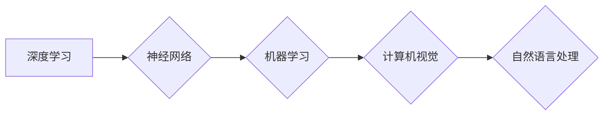

> 人工智能，深度学习，神经网络，机器学习，计算机视觉，自然语言处理，图灵奖，科学方法论，Andrej Karpathy，技术哲学

# Andrej Karpathy：人工智能的科学意义

安德烈·卡尔帕西（Andrej Karpathy）是人工智能领域的杰出科学家，以其在深度学习、计算机视觉和自然语言处理领域的贡献而闻名。本文旨在探讨Andrej Karpathy的工作及其对人工智能科学的深刻影响，分析其研究背后的科学意义和方法论。

## 1. 背景介绍

安德烈·卡尔帕西在人工智能领域的贡献是多方面的。他在斯坦福大学获得了计算机科学博士学位，并在特斯拉、OpenAI等公司担任过要职。他的研究工作涵盖了计算机视觉、自然语言处理和机器学习等多个领域，特别是在图像识别、文本生成和机器翻译方面取得了显著成就。

## 2. 核心概念与联系

### 2.1 核心概念

安德烈·卡尔帕西的工作围绕以下几个核心概念：

- **深度学习**：一种模拟人脑处理信息方式的机器学习方法，通过多层神经网络来学习数据的复杂模式。
- **神经网络**：由大量相互连接的神经元组成的计算模型，可以用于图像识别、语音识别、自然语言处理等任务。
- **机器学习**：使计算机系统能够从数据中学习并做出决策或预测的技术。
- **计算机视觉**：使计算机能够理解和解释视觉信息的技术。
- **自然语言处理**：使计算机能够理解和生成人类语言的技术。

### 2.2 Mermaid 流程图



这些概念相互关联，共同构成了人工智能的科学体系。

## 3. 核心算法原理 & 具体操作步骤

### 3.1 算法原理概述

安德烈·卡尔帕西的研究主要集中在深度学习的算法原理上。他主要关注以下算法：

- **卷积神经网络（CNN）**：用于图像识别和图像处理。
- **循环神经网络（RNN）**：用于序列数据处理，如时间序列分析、语言模型等。
- **长短期记忆网络（LSTM）**：一种特殊的RNN，能够学习长期依赖关系。
- **生成对抗网络（GAN）**：用于生成具有真实感的图像、音频和文本。

### 3.2 算法步骤详解

#### 卷积神经网络（CNN）

1. 数据预处理：将图像数据转换为适合神经网络处理的格式。
2. 卷积层：通过卷积操作提取图像特征。
3. 池化层：降低特征图的空间尺寸，减少参数数量。
4. 全连接层：将特征图映射到输出类别。
5. 损失函数：计算预测结果与真实标签之间的差异。
6. 优化器：调整网络参数以最小化损失函数。

#### 循环神经网络（RNN）和长短期记忆网络（LSTM）

1. 输入序列：将序列数据输入到网络中。
2. 神经元：处理序列数据，生成序列输出。
3. 回归层：将序列输出转换为最终预测。
4. 损失函数：计算预测结果与真实标签之间的差异。
5. 优化器：调整网络参数以最小化损失函数。

#### 生成对抗网络（GAN）

1. 生成器：生成假数据。
2. 判别器：区分真实数据和假数据。
3. 对抗训练：优化生成器和判别器的参数，使生成器生成的假数据越来越难以被判别器区分。

### 3.3 算法优缺点

#### 卷积神经网络（CNN）

**优点**：

- 非常适合图像识别和图像处理任务。
- 能够自动学习特征，减少人工特征工程。

**缺点**：

- 计算量大，需要大量计算资源。
- 难以解释其决策过程。

#### 循环神经网络（RNN）和长短期记忆网络（LSTM）

**优点**：

- 能够处理序列数据。
- 能够学习长期依赖关系。

**缺点**：

- 训练效率低，容易出现梯度消失和梯度爆炸问题。
- 难以解释其决策过程。

#### 生成对抗网络（GAN）

**优点**：

- 能够生成高质量的数据。
- 不需要标注数据。

**缺点**：

- 训练不稳定，容易出现模式崩溃问题。
- 难以解释其决策过程。

### 3.4 算法应用领域

这些算法在以下领域得到了广泛应用：

- 图像识别：如物体检测、图像分类、图像分割等。
- 自然语言处理：如文本分类、机器翻译、情感分析等。
- 语音识别：如语音合成、语音识别等。
- 视频处理：如视频分类、视频分割等。

## 4. 数学模型和公式 & 详细讲解 & 举例说明

### 4.1 数学模型构建

以下是一个简单的卷积神经网络（CNN）的数学模型：

$$
\begin{align*}
h^{(1)} &= \sigma(W^{(1)} \cdot x + b^{(1)}) \\
h^{(2)} &= \sigma(W^{(2)} \cdot h^{(1)} + b^{(2)}) \\
\vdots \\
h^{(L)} &= \sigma(W^{(L)} \cdot h^{(L-1)} + b^{(L)})
\end{align*}
$$

其中，$h^{(l)}$ 表示第 $l$ 层的激活值，$W^{(l)}$ 表示第 $l$ 层的权重，$b^{(l)}$ 表示第 $l$ 层的偏置，$\sigma$ 表示激活函数。

### 4.2 公式推导过程

卷积神经网络（CNN）的公式推导过程涉及线性代数、微积分和概率论等多个数学领域。具体的推导过程较为复杂，这里不再赘述。

### 4.3 案例分析与讲解

以图像识别任务为例，我们可以使用CNN来识别图像中的猫。

1. 预处理：将图像数据转换为适合神经网络处理的格式。
2. 卷积层：通过卷积操作提取图像特征，如边缘、角点等。
3. 池化层：降低特征图的空间尺寸。
4. 全连接层：将特征图映射到输出类别，如猫、狗等。
5. 损失函数：计算预测结果与真实标签之间的差异。
6. 优化器：调整网络参数以最小化损失函数。

通过多次迭代，CNN能够学习到猫的特征，并在新的图像中识别出猫。

## 5. 项目实践：代码实例和详细解释说明

### 5.1 开发环境搭建

为了进行CNN的实践，我们需要以下开发环境：

- Python 3.x
- TensorFlow 或 PyTorch
- NumPy

### 5.2 源代码详细实现

以下是一个使用TensorFlow实现CNN的简单示例：

```python
import tensorflow as tf
from tensorflow.keras.models import Sequential
from tensorflow.keras.layers import Conv2D, MaxPooling2D, Flatten, Dense

# 构建模型
model = Sequential()
model.add(Conv2D(32, (3, 3), activation='relu', input_shape=(64, 64, 3)))
model.add(MaxPooling2D((2, 2)))
model.add(Conv2D(64, (3, 3), activation='relu'))
model.add(MaxPooling2D((2, 2)))
model.add(Flatten())
model.add(Dense(128, activation='relu'))
model.add(Dense(1, activation='sigmoid'))

# 编译模型
model.compile(optimizer='adam', loss='binary_crossentropy', metrics=['accuracy'])

# 训练模型
model.fit(train_images, train_labels, epochs=10, validation_data=(test_images, test_labels))
```

### 5.3 代码解读与分析

这段代码首先导入了TensorFlow和Keras库，并定义了一个简单的CNN模型。模型由两个卷积层、两个池化层、一个全连接层和一个输出层组成。然后，我们编译了模型，指定了优化器、损失函数和评估指标。最后，我们使用训练数据和标签来训练模型。

### 5.4 运行结果展示

运行上述代码后，模型会在训练数据上学习猫的特征，并在测试数据上进行评估。如果模型训练得当，它将在测试数据上取得较高的准确率。

## 6. 实际应用场景

安德烈·卡尔帕西的研究成果在以下实际应用场景中得到了广泛应用：

- **自动驾驶**：用于识别道路上的障碍物、交通标志和行人。
- **医疗影像分析**：用于诊断疾病，如癌症检测、骨折检测等。
- **机器人视觉**：用于机器人导航、物体抓取等任务。
- **智能问答系统**：用于自动回答用户的问题。

## 7. 工具和资源推荐

### 7.1 学习资源推荐

- 《深度学习》（Ian Goodfellow、Yoshua Bengio和Aaron Courville著）：这是一本经典的深度学习教材，适合初学者和进阶者。
- 《Python机器学习》（Sebastian Raschka著）：这本书介绍了Python在机器学习领域的应用，适合没有编程经验的读者。
- 《神经网络与深度学习》（邱锡鹏著）：这本书深入浅出地介绍了神经网络和深度学习的基本原理。

### 7.2 开发工具推荐

- TensorFlow：一个开源的深度学习框架，用于构建和训练深度学习模型。
- PyTorch：一个开源的深度学习框架，具有动态计算图，易于使用。
- Keras：一个高层神经网络API，构建在TensorFlow和Theano之上。

### 7.3 相关论文推荐

- **AlexNet**：2012年提出的深度学习模型，在ImageNet竞赛中取得了突破性的成绩。
- **VGGNet**：2014年提出的深度学习模型，对后续的深度学习模型产生了深远的影响。
- **ResNet**：2015年提出的深度学习模型，解决了深度学习中的梯度消失问题。

## 8. 总结：未来发展趋势与挑战

### 8.1 研究成果总结

安德烈·卡尔帕西的研究成果对人工智能科学产生了深远的影响。他的工作推动了深度学习技术的发展，并使其在多个领域得到了广泛应用。

### 8.2 未来发展趋势

未来，人工智能科学将继续朝着以下方向发展：

- **更强的模型**：开发更强大的深度学习模型，能够处理更复杂的数据和任务。
- **更快的训练速度**：开发更高效的训练算法，降低训练成本。
- **更好的泛化能力**：提高模型的泛化能力，使其能够适应不同的数据分布和任务。
- **更少的标注数据**：开发无监督和半监督学习算法，减少对标注数据的依赖。

### 8.3 面临的挑战

尽管人工智能科学取得了显著进展，但仍面临以下挑战：

- **数据隐私**：如何保护用户数据隐私是一个重要问题。
- **偏见和公平性**：如何减少模型中的偏见，并确保公平性是一个挑战。
- **可解释性**：如何提高模型的可解释性，使其决策过程更加透明是一个难题。
- **伦理和安全**：如何确保人工智能技术的伦理和安全使用是一个重要问题。

### 8.4 研究展望

未来，人工智能科学的研究将更加关注以下方向：

- **跨学科研究**：与其他学科（如心理学、哲学、社会学等）进行交叉研究，以更好地理解人类智能。
- **伦理和法规**：制定人工智能伦理和法规，以确保其安全和公平使用。
- **人机协作**：开发人机协作系统，使人类和人工智能更好地协同工作。

## 9. 附录：常见问题与解答

**Q1：什么是深度学习？**

A：深度学习是一种模拟人脑处理信息方式的机器学习方法，通过多层神经网络来学习数据的复杂模式。

**Q2：什么是神经网络？**

A：神经网络是一种由大量相互连接的神经元组成的计算模型，可以用于图像识别、语音识别、自然语言处理等任务。

**Q3：什么是机器学习？**

A：机器学习是一种使计算机系统能够从数据中学习并做出决策或预测的技术。

**Q4：什么是计算机视觉？**

A：计算机视觉是使计算机能够理解和解释视觉信息的技术。

**Q5：什么是自然语言处理？**

A：自然语言处理是使计算机能够理解和生成人类语言的技术。

作者：禅与计算机程序设计艺术 / Zen and the Art of Computer Programming