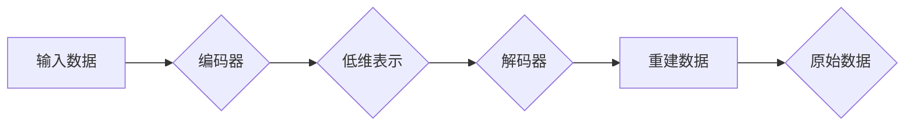

# Autoencoders原理与代码实例讲解

> 关键词：自编码器，无监督学习，特征提取，重构，深度学习，神经网络，数据压缩，异常检测

## 1. 背景介绍

自编码器（Autoencoder）是一种无监督学习算法，它通过学习输入数据的表示来重建原始数据。这种算法在数据压缩、特征提取、异常检测等领域有着广泛的应用。自编码器的基本思想是将输入数据映射到一个低维空间，然后再从低维空间映射回原空间，以重建原始数据。在这个过程中，自编码器学习到数据的有用特征，这些特征可以用于各种下游任务。

## 2. 核心概念与联系

### 2.1 自编码器的基本概念

自编码器由编码器（Encoder）和解码器（Decoder）两部分组成。编码器负责将输入数据压缩成低维表示，解码器则将这个低维表示转换回原始数据的空间。自编码器的学习目标是使重建误差最小化，即使解码器输出的数据与原始数据尽可能接近。

### 2.2 Mermaid 流程图



### 2.3 核心概念联系

自编码器通过以下方式将输入数据转换为有用的特征：

- **降维**：通过编码器将高维输入数据映射到低维空间，减少数据冗余。
- **特征提取**：在降维过程中，自编码器学习到数据的有效特征。
- **重构**：通过解码器将低维表示转换回原始空间，重建数据。

## 3. 核心算法原理 & 具体操作步骤

### 3.1 算法原理概述

自编码器是一种深度神经网络，通常由以下几部分组成：

- **输入层**：接收原始数据作为输入。
- **编码器**：将输入数据压缩成低维表示。
- **解码器**：将低维表示转换回原始数据空间。
- **损失函数**：用于衡量重建数据与原始数据之间的差异。

### 3.2 算法步骤详解

1. **初始化**：定义自编码器的结构，包括编码器和解码器的网络架构。
2. **训练**：使用训练数据对自编码器进行训练，调整网络参数，最小化损失函数。
3. **重建**：使用训练好的自编码器对新的数据进行重建。

### 3.3 算法优缺点

#### 优点：

- **特征提取**：自编码器可以学习到数据的潜在特征。
- **数据压缩**：自编码器可以将数据压缩成低维表示，减少存储空间。
- **异常检测**：自编码器可以识别数据中的异常值。

#### 缺点：

- **计算复杂度高**：自编码器需要大量的计算资源进行训练。
- **对噪声敏感**：自编码器对输入数据的噪声较为敏感。

### 3.4 算法应用领域

- **数据压缩**：将数据压缩成低维表示，减少存储空间。
- **特征提取**：从数据中提取有用的特征。
- **异常检测**：识别数据中的异常值。
- **图像处理**：图像去噪、超分辨率等。
- **语音处理**：语音识别、语音合成等。

## 4. 数学模型和公式 & 详细讲解 & 举例说明

### 4.1 数学模型构建

自编码器的数学模型可以表示为：

$$
\text{Reconstruction} = f(\text{Encoder}(x)) = \text{Decoder}(\text{Encoder}(x))
$$

其中 $x$ 是输入数据，$f$ 是自编码器的映射函数。

### 4.2 公式推导过程

自编码器的损失函数通常是均方误差（Mean Squared Error, MSE）：

$$
\mathcal{L} = \frac{1}{N} \sum_{i=1}^N \left( x_i - \text{Reconstruction}_i \right)^2
$$

其中 $x_i$ 是第 $i$ 个样本的输入数据，$\text{Reconstruction}_i$ 是第 $i$ 个样本的重建数据。

### 4.3 案例分析与讲解

以下是一个简单的自编码器实例，使用PyTorch框架实现：

```python
import torch
import torch.nn as nn
import torch.optim as optim

class Autoencoder(nn.Module):
    def __init__(self):
        super(Autoencoder, self).__init__()
        self.encoder = nn.Sequential(
            nn.Linear(784, 400),
            nn.ReLU(),
            nn.Linear(400, 20)
        )
        self.decoder = nn.Sequential(
            nn.Linear(20, 400),
            nn.ReLU(),
            nn.Linear(400, 784),
            nn.Sigmoid()
        )

    def forward(self, x):
        x = self.encoder(x)
        x = self.decoder(x)
        return x

# 实例化模型
model = Autoencoder()

# 定义损失函数和优化器
criterion = nn.MSELoss()
optimizer = optim.Adam(model.parameters(), lr=0.001)

# 训练模型
for epoch in range(100):
    optimizer.zero_grad()
    output = model(x_train)
    loss = criterion(output, x_train)
    loss.backward()
    optimizer.step()
```

在这个例子中，我们定义了一个简单的自编码器模型，输入数据是一个28x28的图像，经过编码器压缩成20个特征，然后经过解码器重建原始图像。

## 5. 项目实践：代码实例和详细解释说明

### 5.1 开发环境搭建

为了运行上述代码实例，你需要安装以下Python库：

- PyTorch
- NumPy
- Matplotlib

你可以使用pip来安装这些库：

```bash
pip install torch numpy matplotlib
```

### 5.2 源代码详细实现

以下是自编码器的完整代码实现：

```python
import torch
import torch.nn as nn
import torch.optim as optim
from torchvision import datasets, transforms
from torch.utils.data import DataLoader

# 定义自编码器模型
class Autoencoder(nn.Module):
    def __init__(self):
        super(Autoencoder, self).__init__()
        self.encoder = nn.Sequential(
            nn.Linear(784, 400),
            nn.ReLU(),
            nn.Linear(400, 20)
        )
        self.decoder = nn.Sequential(
            nn.Linear(20, 400),
            nn.ReLU(),
            nn.Linear(400, 784),
            nn.Sigmoid()
        )

    def forward(self, x):
        x = self.encoder(x)
        x = self.decoder(x)
        return x

# 加载数据
transform = transforms.Compose([
    transforms.ToTensor(),
    transforms.Normalize((0.5,), (0.5,))
])

train_dataset = datasets.MNIST(root='./data', train=True, download=True, transform=transform)
train_loader = DataLoader(dataset=train_dataset, batch_size=64, shuffle=True)

# 实例化模型
model = Autoencoder()

# 定义损失函数和优化器
criterion = nn.MSELoss()
optimizer = optim.Adam(model.parameters(), lr=0.001)

# 训练模型
for epoch in range(100):
    for batch_idx, (data, _) in enumerate(train_loader):
        optimizer.zero_grad()
        output = model(data)
        loss = criterion(output, data)
        loss.backward()
        optimizer.step()
        if batch_idx % 100 == 0:
            print(f'Train Epoch: {epoch} [{batch_idx * len(data)}/{len(train_loader.dataset)} ({100. * batch_idx / len(train_loader):.0f}%)]\tLoss: {loss.item():.6f}')
```

### 5.3 代码解读与分析

在这个例子中，我们使用PyTorch框架实现了一个简单的自编码器模型，用于学习MNIST手写数字数据集的特征。

- 我们定义了一个`Autoencoder`类，其中包含了编码器和解码器的网络结构。
- 使用`DataLoader`来加载数据，并进行批处理和打乱。
- 使用Adam优化器和均方误差损失函数来训练模型。
- 在每个epoch中，我们遍历训练数据，计算损失并更新模型参数。

### 5.4 运行结果展示

在训练过程中，你可以使用matplotlib库来可视化训练损失：

```python
import matplotlib.pyplot as plt

plt.plot(train_losses)
plt.title('Training loss')
plt.xlabel('Epoch')
plt.ylabel('Loss')
plt.show()
```

## 6. 实际应用场景

### 6.1 数据压缩

自编码器可以用于将高维数据压缩成低维表示，从而减少数据存储空间。这在处理大规模数据集时非常有用。

### 6.2 特征提取

自编码器可以用于从数据中提取有用的特征，这些特征可以用于分类、回归等下游任务。

### 6.3 异常检测

自编码器可以用于检测数据中的异常值。如果某个数据点的重构误差远大于其他数据点，那么这个数据点可能是一个异常值。

### 6.4 图像处理

自编码器可以用于图像去噪、超分辨率等图像处理任务。

### 6.5 语音处理

自编码器可以用于语音识别、语音合成等语音处理任务。

## 7. 工具和资源推荐

### 7.1 学习资源推荐

- 《Deep Learning》
- 《Neural Networks and Deep Learning》
- PyTorch官方文档

### 7.2 开发工具推荐

- PyTorch
- TensorFlow
- Jupyter Notebook

### 7.3 相关论文推荐

- Hinton, G. E., Osindero, S., & Teh, Y. W. (2006). A fast learning algorithm for deep Belief Nets. Neural computation, 18(7), 1527-1554.
- Vincent, P., Larochelle, H., Lajoie, I., Bengio, Y., & Manzagol, P. (2008). Extracting and compressing visual representations with a deep belief network. Computer Vision and Image Understanding, 110(7), 1096-1109.

## 8. 总结：未来发展趋势与挑战

### 8.1 研究成果总结

自编码器是一种强大的无监督学习算法，在数据压缩、特征提取、异常检测等领域有着广泛的应用。随着深度学习技术的不断发展，自编码器也在不断演进，出现了各种变体，如变分自编码器（VAE）、生成自编码器（GAN）等。

### 8.2 未来发展趋势

- **更复杂的网络结构**：自编码器可能会采用更复杂的网络结构，如循环神经网络（RNN）、卷积神经网络（CNN）等，以更好地处理复杂数据。
- **迁移学习**：自编码器可能会与其他迁移学习技术相结合，以更好地处理小样本数据。
- **多模态学习**：自编码器可能会用于处理多模态数据，如文本和图像。

### 8.3 面临的挑战

- **计算复杂度**：自编码器的训练需要大量的计算资源，这在处理大规模数据集时可能成为瓶颈。
- **模型解释性**：自编码器的内部工作原理通常难以解释，这在某些应用中可能成为问题。

### 8.4 研究展望

自编码器作为一种强大的无监督学习算法，在未来将继续在各个领域发挥重要作用。随着深度学习技术的不断发展，自编码器将会变得更加高效、可解释，并在更多应用场景中发挥作用。

## 9. 附录：常见问题与解答

**Q1：自编码器和变分自编码器有什么区别？**

A：自编码器试图最小化重建误差，而变分自编码器（VAE）除了最小化重建误差外，还试图通过引入潜在变量来学习数据的概率分布。

**Q2：自编码器可以用于哪些下游任务？**

A：自编码器可以用于数据压缩、特征提取、异常检测、图像处理、语音处理等下游任务。

**Q3：如何选择自编码器的网络结构？**

A：自编码器的网络结构取决于具体的应用场景和数据类型。对于图像数据，可以使用卷积神经网络；对于序列数据，可以使用循环神经网络。

**Q4：自编码器的训练需要多少时间？**

A：自编码器的训练时间取决于数据规模、网络结构和计算资源。对于大规模数据集和复杂的网络结构，训练可能需要几天到几周的时间。

**Q5：自编码器在处理噪声数据时效果如何？**

A：自编码器对噪声数据比较敏感，这可能会影响其性能。为了提高鲁棒性，可以考虑使用数据增强技术。

作者：禅与计算机程序设计艺术 / Zen and the Art of Computer Programming