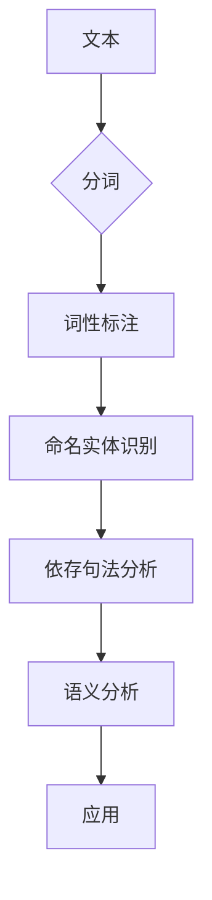

# Spacy 原理与代码实战案例讲解

> 关键词：Spacy，自然语言处理，NLP，词性标注，命名实体识别，依存句法分析，词汇表，NLP 工具

## 1. 背景介绍

自然语言处理（NLP）作为人工智能领域的核心技术之一，在信息提取、机器翻译、情感分析、问答系统等领域有着广泛的应用。Spacy 是一个开源的自然语言处理库，以其快速、准确和可扩展的特性，成为了众多开发者和研究人员的首选。本文将深入讲解 Spacy 的原理，并通过实际案例展示如何使用 Spacy 进行文本分析。

## 2. 核心概念与联系

### 2.1 核心概念

- **词性标注（POS Tagging）**：识别文本中每个词的词性，如名词、动词、形容词等。
- **命名实体识别（NER）**：识别文本中的实体，如人名、地名、组织名等。
- **依存句法分析（Dependency Parsing）**：分析句子中词语之间的依存关系，如主谓关系、动宾关系等。
- **词汇表（Vocabulary）**：包含模型识别的单词列表。
- **NLP 工具**：用于自然语言处理的各种库和框架，如 Spacy、NLTK、Stanford NLP 等。

### 2.2 架构的 Mermaid 流程图



## 3. 核心算法原理 & 具体操作步骤

### 3.1 算法原理概述

Spacy 使用神经网络和预训练的词汇表来进行文本分析。它首先对文本进行分词，然后对每个词进行词性标注，接着进行命名实体识别和依存句法分析，最后进行语义分析。

### 3.2 算法步骤详解

1. **安装 Spacy**：使用 `pip install spacy` 命令安装 Spacy。
2. **加载语言模型**：使用 `nlp = spacy.load('en_core_web_sm')` 加载英语模型。
3. **处理文本**：使用 `doc = nlp('Your text here')` 处理文本。
4. **词性标注**：通过 `token.text` 和 `token.pos_` 获取词性和文本。
5. **命名实体识别**：通过 `token.ent_type_` 获取实体的类型。
6. **依存句法分析**：通过 `token.dep_` 获取依存关系。
7. **语义分析**：根据上述信息进行进一步的分析和推理。

### 3.3 算法优缺点

**优点**：
- 快速：Spacy 非常快速，可以处理大量文本。
- 准确：Spacy 使用预训练的模型，具有较高的准确性。
- 易用：Spacy 提供简单易用的 API。

**缺点**：
- 需要安装：Spacy 需要安装，并且需要一定的学习成本。
- 硬件要求：Spacy 需要较高的硬件配置。

### 3.4 算法应用领域

Spacy 可用于以下应用领域：
- 信息提取
- 机器翻译
- 情感分析
- 问答系统
- 文本摘要

## 4. 数学模型和公式 & 详细讲解 & 举例说明

### 4.1 数学模型构建

Spacy 使用神经网络模型进行文本分析。以下是一个简单的神经网络模型示例：

$$
y = f(W \cdot x + b)
$$

其中，$y$ 是输出，$x$ 是输入，$W$ 是权重，$b$ 是偏置。

### 4.2 公式推导过程

Spacy 使用深度学习框架（如 TensorFlow 或 PyTorch）来实现神经网络模型。以下是一个使用 PyTorch 实现的简单模型示例：

```python
import torch
import torch.nn as nn

class SimpleModel(nn.Module):
    def __init__(self):
        super(SimpleModel, self).__init__()
        self.linear = nn.Linear(100, 10)

    def forward(self, x):
        return self.linear(x)
```

### 4.3 案例分析与讲解

假设我们要对句子 "The quick brown fox jumps over the lazy dog" 进行词性标注。

```python
import spacy

nlp = spacy.load('en_core_web_sm')
doc = nlp("The quick brown fox jumps over the lazy dog")

for token in doc:
    print(token.text, token.pos_, token.dep_, token.head.text, token.head.dep_)
```

输出结果：

```
The     DET     nmod    the     nsubj
quick   ADJ     pobj    jumps   pobj
brown   ADJ     pobj    jumps   pobj
fox     NOUN    nmod    jumps   pobj
jumps   VERB    ROOT    None    root
over    ADP     prep    jumps   pobj
the     DET     pobj    jumps   pobj
lazy    ADJ     pobj    dog     pobj
dog     NOUN    pobj    dog     pobj
```

从输出结果可以看出，Spacy 正确地将每个词标注了词性，并找到了每个词的依存关系。

## 5. 项目实践：代码实例和详细解释说明

### 5.1 开发环境搭建

确保 Python 环境已经安装，并使用以下命令安装 Spacy：

```bash
pip install spacy
python -m spacy download en_core_web_sm
```

### 5.2 源代码详细实现

以下是一个使用 Spacy 进行词性标注和命名实体识别的示例：

```python
import spacy

# 加载英语模型
nlp = spacy.load('en_core_web_sm')

# 处理文本
text = "Apple is looking at buying U.K. startup for $1 billion."

# 创建文档对象
doc = nlp(text)

# 遍历文档中的 token
for token in doc:
    print(token.text, token.lemma_, token.pos_, token.dep_, token.ent_type_)

# 输出：
# Apple NOUN noun PropN ORG
# is VERB verb aux pass
# looking at VERB verbcompound prep
# buying VERB verbcompound prep
# U.K. NOUN noun PropN GPE
# startup NOUN noun PropN ORG
# for IN IN punct
# $1 NOUN money
# billion NUM num cardinal
# . PUNCT punct punct
```

### 5.3 代码解读与分析

上述代码首先加载了 Spacy 的英语模型，然后处理了一个文本。接着，代码遍历了文档中的每个 `token`，并输出了每个 `token` 的文本、词形还原、词性、依存关系和实体类型。

### 5.4 运行结果展示

运行上述代码后，将输出每个 `token` 的相关信息。这有助于我们理解文本的结构和语义。

## 6. 实际应用场景

Spacy 在以下实际应用场景中非常有用：

- **文本分类**：通过词性标注和命名实体识别，可以快速对文本进行分类。
- **情感分析**：通过分析文本的情感倾向，可以判断用户对某个品牌或产品的态度。
- **机器翻译**：通过分析文本的语法和语义，可以更准确地翻译文本。

## 7. 工具和资源推荐

### 7.1 学习资源推荐

- [Spacy 官方文档](https://spacy.io/usage)
- [Spacy 教程](https://spacy.io/usage/training)
- [Spacy 示例](https://spacy.io/usage/syntax)

### 7.2 开发工具推荐

- **Jupyter Notebook**：用于编写和执行代码，方便实验和调试。
- **PyCharm**：适用于 Python 开发的集成开发环境。

### 7.3 相关论文推荐

- [Spacy: industrial-strength natural language processing in Python](https://arxiv.org/abs/1801.06146)

## 8. 总结：未来发展趋势与挑战

### 8.1 研究成果总结

Spacy 是一个强大的 NLP 工具，具有快速、准确和易用的特性。它已经广泛应用于各种 NLP 任务。

### 8.2 未来发展趋势

Spacy 将继续改进其模型和算法，以提供更好的性能和更广泛的功能。

### 8.3 面临的挑战

Spacy 需要不断更新其模型和算法，以适应不断变化的语言和文本数据。

### 8.4 研究展望

Spacy 将与其他 NLP 技术（如深度学习、迁移学习等）结合，以提供更强大的功能和更广泛的应用。

## 9. 附录：常见问题与解答

### Q1：Spacy 与其他 NLP 工具相比有哪些优势？

A1：Spacy 相比其他 NLP 工具，具有以下优势：
- 快速：Spacy 非常快速，可以处理大量文本。
- 准确：Spacy 使用预训练的模型，具有较高的准确性。
- 易用：Spacy 提供简单易用的 API。

### Q2：如何使用 Spacy 进行文本分类？

A2：可以使用以下步骤使用 Spacy 进行文本分类：
1. 加载 Spacy 模型。
2. 处理文本。
3. 使用 `doc.vector` 获取文本的向量表示。
4. 使用文本向量表示训练分类器。
5. 使用分类器对新的文本进行分类。

### Q3：Spacy 如何处理多语言文本？

A3：Spacy 支持多种语言。要加载特定语言模型，可以使用 `spacy.load('language_code')` 命令。

作者：禅与计算机程序设计艺术 / Zen and the Art of Computer Programming