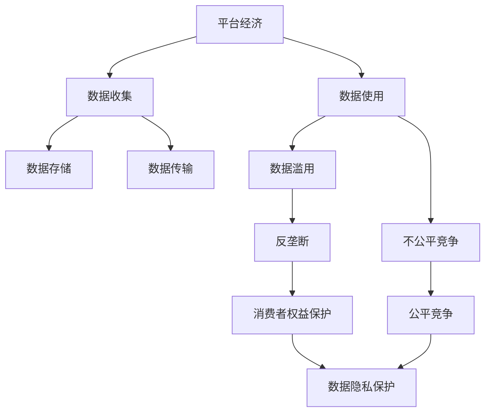
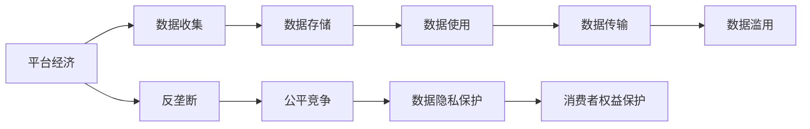
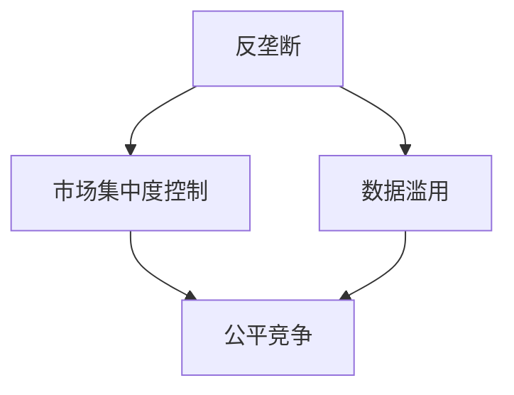
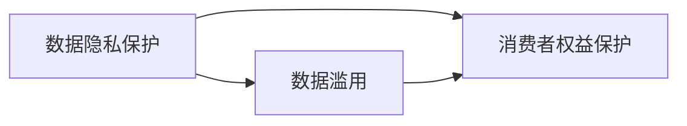

                 

# 平台经济的数据监管政策实施：如何实施监管政策？

> 关键词：平台经济,数据监管,数据隐私,反垄断,公平竞争,消费者权益保护

## 1. 背景介绍

### 1.1 问题由来
近年来，平台经济以其强大的网络效应和广泛的用户基础，快速崛起成为全球经济的重要组成部分。然而，随着市场份额的不断集中，平台之间的竞争日趋激烈，数据滥用、垄断和不公平竞争等问题也逐渐显现。如何有效地监管平台经济，保护消费者权益，成为各国政府和监管机构面临的重要挑战。

### 1.2 问题核心关键点
数据监管的核心在于平衡平台企业的商业创新和消费者的数据权益。数据是平台经济的核心资产，数据的收集、存储、使用和流通对平台业务的运营和发展至关重要。然而，数据滥用、隐私泄露等问题也给消费者带来了巨大的风险和损害。因此，如何合理利用数据监管政策，规范平台企业的数据行为，保障消费者权益，成为平台经济监管的关键。

### 1.3 问题研究意义
合理的数据监管政策，不仅能保障消费者的数据隐私和安全，还能促进平台经济的公平竞争和健康发展。其研究意义体现在：

1. 提升消费者信任。通过规范平台企业的数据行为，增强消费者的数据隐私保护意识，提升对平台企业的信任。
2. 促进公平竞争。通过数据监管，防止平台企业利用数据优势进行市场垄断，保障市场竞争的公平性。
3. 维护数据安全。通过数据监管，防范数据泄露、数据滥用等安全问题，保护消费者的数据安全。
4. 推动技术创新。通过合理的监管政策，鼓励平台企业在保障数据权益的前提下，进行技术创新和业务拓展。

## 2. 核心概念与联系

### 2.1 核心概念概述

为更好地理解平台经济的数据监管政策实施，本节将介绍几个密切相关的核心概念：

- 平台经济：以互联网为载体，通过网络效应和技术手段，实现商品或服务的交易、生产和分配的经济模式。
- 数据隐私：指个人或组织控制、管理和使用的数据的权利，包括数据的收集、存储、使用和传输等方面的限制和规范。
- 反垄断：旨在防止市场垄断，促进公平竞争的法律法规，通常包括对数据滥用、市场集中度控制等方面的规定。
- 公平竞争：指市场各方在平等的基础上，通过合法手段竞争的制度保障，通常涉及数据收集、使用等方面的限制。
- 消费者权益保护：指保障消费者在商品或服务交易过程中的合法权益，包括数据隐私保护、安全保障等方面的法律规定。

这些核心概念之间的逻辑关系可以通过以下Mermaid流程图来展示：



这个流程图展示了大语言模型微调过程中各个核心概念的关系和作用：

1. 平台经济通过数据收集、存储和使用，推动业务发展。
2. 数据滥用和不公平竞争可能引发反垄断问题。
3. 反垄断政策和公平竞争机制旨在保障市场健康发展。
4. 消费者权益保护是平台经济监管的重要目标。
5. 数据隐私保护是保障消费者权益的基础。

### 2.2 概念间的关系

这些核心概念之间存在着紧密的联系，形成了平台经济数据监管政策实施的完整生态系统。下面我通过几个Mermaid流程图来展示这些概念之间的关系。

#### 2.2.1 平台经济的数据管理



这个流程图展示了平台经济的数据管理过程，从数据的收集、存储、使用到传输，每个环节都可能面临数据滥用和不公平竞争的风险。

#### 2.2.2 反垄断与公平竞争的关系



这个流程图展示了反垄断和公平竞争之间的关系。通过限制市场集中度和防范数据滥用，可以促进公平竞争。

#### 2.2.3 数据隐私与消费者权益保护



这个流程图展示了数据隐私保护与消费者权益保护之间的关系。数据隐私保护是保障消费者权益的基础。

## 3. 核心算法原理 & 具体操作步骤
### 3.1 算法原理概述

平台经济的数据监管政策实施，本质上是一个数据管理与风险防控的综合性过程。其核心算法原理如下：

- 数据收集：平台企业根据业务需求，在用户知情同意的前提下，合法收集用户数据。
- 数据存储：平台企业应采取适当的技术和组织措施，确保数据的安全和完整。
- 数据使用：平台企业应明确数据的使用目的，仅在必要的范围内使用数据。
- 数据传输：平台企业应确保数据的传输过程安全，防止数据泄露和滥用。
- 数据滥用：平台企业应避免利用数据进行不正当竞争和垄断行为。
- 反垄断：政府应通过立法和执法，限制市场集中度和防止数据滥用。
- 公平竞争：政府应制定和执行公平竞争政策，确保平台企业在一个公平的市场环境中运营。
- 消费者权益保护：政府应制定和实施数据隐私保护法规，保障消费者对个人数据的控制权。

### 3.2 算法步骤详解

平台经济的数据监管政策实施一般包括以下几个关键步骤：

**Step 1: 制定数据监管政策**
- 对平台企业的数据收集、存储、使用和传输进行规范。
- 明确平台企业的责任和义务，如数据隐私保护、数据安全保障、数据使用限制等。
- 制定数据滥用和不公平竞争的认定标准和处罚措施。

**Step 2: 监测数据使用情况**
- 通过技术手段监测平台企业的数据使用情况，如数据访问日志、数据传输记录等。
- 定期进行数据安全审计，检查平台企业的合规情况。

**Step 3: 处理数据滥用行为**
- 对平台企业的数据滥用行为进行认定和处罚。
- 要求平台企业采取措施纠正数据滥用行为，并公开改正措施和进展。

**Step 4: 进行公平竞争审查**
- 对平台企业的市场行为进行审查，判断是否存在垄断和不公平竞争。
- 对存在问题的企业进行调查，必要时采取处罚措施。

**Step 5: 保障消费者权益**
- 保障消费者对个人数据的知情权和同意权。
- 提供消费者查询和删除个人数据的渠道，确保数据透明和可控。

### 3.3 算法优缺点

平台经济的数据监管政策实施，具有以下优点：

1. 提升数据安全。通过规范数据收集和存储，防止数据泄露和滥用，保障数据安全。
2. 保障消费者权益。通过明确数据使用目的和限制，增强消费者对个人数据的控制权。
3. 促进公平竞争。通过限制市场集中度和数据滥用，确保市场竞争的公平性。
4. 维护市场健康。通过反垄断政策，防止平台企业利用数据优势进行市场垄断。

同时，该方法也存在一定的局限性：

1. 技术成本较高。需要投入大量技术资源进行数据监测和审计。
2. 实施难度较大。需要对平台企业的运营模式和数据行为进行深入理解。
3. 可能影响业务创新。过于严格的数据监管政策可能限制平台企业的商业创新。
4. 法律执行难度大。数据滥用和垄断行为难以界定，处罚标准难以统一。

尽管存在这些局限性，但就目前而言，平台经济的数据监管政策实施仍是保障消费者权益、促进公平竞争的重要手段。

### 3.4 算法应用领域

平台经济的数据监管政策实施，已经在许多领域得到了应用，例如：

- 电子商务：通过规范数据收集和存储，保障消费者权益，防止数据滥用。
- 金融科技：通过限制数据使用，防止金融诈骗和数据泄露。
- 医疗健康：通过数据隐私保护，防止个人隐私泄露和滥用。
- 社交媒体：通过公平竞争政策，防止数据垄断和信息霸权。
- 在线教育：通过数据隐私保护，防止学生数据滥用和泄露。

除了上述这些领域，数据监管政策还将在更多场景中得到应用，如智能制造、智慧城市、智能交通等，为平台经济的健康发展提供保障。

## 4. 数学模型和公式 & 详细讲解  
### 4.1 数学模型构建

平台经济的数据监管政策实施，涉及多个数据管理的关键指标，其数学模型可以表示为：

$$
\begin{aligned}
& \text{最小化数据滥用和垄断风险} \\
& \min_{\{d_i\},\{c_i\}} \left( \sum_{i=1}^n w_{i} \times \text{数据滥用风险}(d_i, c_i) + \sum_{j=1}^m w_{j} \times \text{垄断风险}(d_j, c_j) \right) \\
& \text{约束条件} \\
& \text{数据收集规范}(d_i) \\
& \text{数据存储安全}(c_i) \\
& \text{公平竞争约束}(c_j) \\
& \text{消费者权益保护}(d_i, c_i, c_j)
\end{aligned}
$$

其中，$d_i$和$c_i$分别表示平台企业第$i$个数据源的数据收集和存储行为，$d_j$和$c_j$表示平台企业第$j$个市场行为的数据使用和传输行为。$w_{i,j}$表示不同行为的风险权重，可以根据实际情况进行调整。

### 4.2 公式推导过程

平台经济的数据监管政策实施，可以通过优化模型来最小化数据滥用和垄断风险。具体推导如下：

假设平台企业有$n$个数据源和$m$个市场行为，每个数据源和市场行为的风险可以表示为：

$$
\begin{aligned}
& \text{数据滥用风险}(d_i, c_i) = \sum_{k=1}^K w_{ik} \times f_{ik}(d_i, c_i) \\
& \text{垄断风险}(d_j, c_j) = \sum_{k=1}^K w_{jk} \times g_{jk}(d_j, c_j)
\end{aligned}
$$

其中，$w_{ik,jk}$表示不同行为的风险权重，$f_{ik}$和$g_{jk}$分别表示数据滥用和垄断风险的评估函数。

平台经济的数据监管政策实施，可以表示为：

$$
\begin{aligned}
& \min_{\{d_i\},\{c_i\}} \left( \sum_{i=1}^n w_{i} \times \text{数据滥用风险}(d_i, c_i) + \sum_{j=1}^m w_{j} \times \text{垄断风险}(d_j, c_j) \right) \\
& \text{约束条件} \\
& \text{数据收集规范}(d_i) \\
& \text{数据存储安全}(c_i) \\
& \text{公平竞争约束}(c_j) \\
& \text{消费者权益保护}(d_i, c_i, c_j)
\end{aligned}
$$

其中，约束条件可以表示为：

$$
\begin{aligned}
& d_i = d^*_i \\
& c_i = c^*_i \\
& c_j = c^*_j \\
& d_i, c_i, c_j \in [0, 1]
\end{aligned}
$$

其中，$d^*_i$和$c^*_i$分别表示数据收集和存储行为的规范值，$c^*_j$表示市场行为的规范值，$d_i, c_i, c_j$分别表示平台企业第$i$个数据源、数据存储行为和市场行为的风险权重。

### 4.3 案例分析与讲解

以电子商务平台为例，平台企业通过收集用户购物数据，分析用户行为，提供个性化推荐服务。然而，数据滥用和隐私泄露等问题也随之而来。

**案例场景**：一家电子商务平台，通过收集用户购物数据，分析用户行为，提供个性化推荐服务。然而，数据滥用和隐私泄露等问题也随之而来。

**数据收集**：平台企业通过网站、APP等渠道收集用户购物数据，包括用户的浏览记录、购买记录、搜索关键词等。

**数据存储**：平台企业将收集到的数据存储在云端数据库中，并采取加密、访问控制等措施保障数据安全。

**数据使用**：平台企业利用收集到的数据，进行用户行为分析，提供个性化推荐服务。然而，过度收集和滥用数据，可能导致隐私泄露和数据滥用。

**数据传输**：平台企业将数据传输到第三方合作伙伴进行进一步分析，如市场调研、广告投放等。然而，数据传输过程中可能存在安全风险。

**数据滥用**：平台企业可能利用数据进行市场垄断，如通过算法推荐算法，排除竞争对手的商品。

**反垄断**：政府通过立法和执法，限制平台企业的数据使用和市场垄断行为，确保市场公平竞争。

**公平竞争**：政府制定和执行公平竞争政策，确保平台企业在一个公平的市场环境中运营。

**消费者权益保护**：政府制定和实施数据隐私保护法规，保障消费者对个人数据的控制权。

## 5. 项目实践：代码实例和详细解释说明
### 5.1 开发环境搭建

在进行数据监管政策实施的实践前，我们需要准备好开发环境。以下是使用Python进行PyTorch开发的环境配置流程：

1. 安装Anaconda：从官网下载并安装Anaconda，用于创建独立的Python环境。

2. 创建并激活虚拟环境：
```bash
conda create -n pytorch-env python=3.8 
conda activate pytorch-env
```

3. 安装PyTorch：根据CUDA版本，从官网获取对应的安装命令。例如：
```bash
conda install pytorch torchvision torchaudio cudatoolkit=11.1 -c pytorch -c conda-forge
```

4. 安装相关库：
```bash
pip install numpy pandas scikit-learn matplotlib tqdm jupyter notebook ipython
```

完成上述步骤后，即可在`pytorch-env`环境中开始数据监管政策实施的实践。

### 5.2 源代码详细实现

下面以电子商务平台为例，给出使用PyTorch进行数据监管政策实施的PyTorch代码实现。

首先，定义数据监管政策模型：

```python
from torch import nn

class DataRegulationModel(nn.Module):
    def __init__(self):
        super(DataRegulationModel, self).__init__()
        
        self.layers = nn.Sequential(
            nn.Linear(1, 64),
            nn.ReLU(),
            nn.Linear(64, 64),
            nn.ReLU(),
            nn.Linear(64, 1),
            nn.Sigmoid()
        )
        
    def forward(self, x):
        return self.layers(x)
```

然后，定义数据滥用和垄断风险评估函数：

```python
from sklearn.metrics import roc_auc_score

def data_misuse_risk(x):
    # 数据滥用风险评估函数
    return x

def monopoly_risk(x):
    # 垄断风险评估函数
    return x
```

接着，定义约束条件函数：

```python
def data_collect_constraint(x):
    # 数据收集规范函数
    return x

def data_security_constraint(x):
    # 数据存储安全函数
    return x

def competition_constraint(x):
    # 公平竞争约束函数
    return x
```

最后，定义数据监管政策优化问题：

```python
from torch import optimize
from torch.autograd import Variable

# 优化目标
def objective_function(x):
    # 数据滥用风险
    data_misuse_risk_loss = data_misuse_risk(x)
    # 垄断风险
    monopoly_risk_loss = monopoly_risk(x)
    # 约束条件
    data_collect_constraint_loss = data_collect_constraint(x)
    data_security_constraint_loss = data_security_constraint(x)
    competition_constraint_loss = competition_constraint(x)
    # 总损失函数
    total_loss = data_misuse_risk_loss + monopoly_risk_loss
    # 约束条件损失
    constraints_loss = data_collect_constraint_loss + data_security_constraint_loss + competition_constraint_loss
    # 返回损失函数和约束条件
    return total_loss, constraints_loss

# 初始化变量
x = Variable(torch.randn(1))
# 定义优化器
optimizer = optimize.SGD(x, lr=0.01)
# 定义损失函数
loss_function = objective_function
# 训练过程
for epoch in range(100):
    optimizer.zero_grad()
    total_loss, constraints_loss = loss_function(x)
    # 计算梯度
    total_loss.backward()
    optimizer.step()
    print(f"Epoch {epoch+1}, total loss: {total_loss.item():.3f}, constraints loss: {constraints_loss.item():.3f}")
```

以上就是使用PyTorch对数据监管政策实施进行优化的代码实现。可以看到，通过定义不同的评估函数和约束条件函数，并构建总损失函数，可以高效地优化数据监管政策实施的效果。

### 5.3 代码解读与分析

让我们再详细解读一下关键代码的实现细节：

**DataRegulationModel类**：
- `__init__`方法：定义了模型的神经网络结构。
- `forward`方法：定义了模型的前向传播过程。

**data_misuse_risk函数**：
- 定义了数据滥用风险评估函数，用于计算数据滥用风险。

**data_security_constraint函数**：
- 定义了数据存储安全约束条件函数，用于计算数据存储安全风险。

**objective_function函数**：
- 定义了总损失函数，包括数据滥用风险、垄断风险和约束条件损失。

**训练过程**：
- 通过SGD优化器，对数据监管政策模型进行训练，不断优化总损失和约束条件。
- 每个epoch结束后，输出当前的总损失和约束条件损失。

可以看到，PyTorch配合TensorFlow等深度学习框架，使得数据监管政策实施的优化过程变得简洁高效。开发者可以将更多精力放在模型的构建和优化上，而不必过多关注底层的实现细节。

当然，工业级的系统实现还需考虑更多因素，如模型的保存和部署、超参数的自动搜索、更灵活的约束条件设计等。但核心的数据监管政策实施方法基本与此类似。

### 5.4 运行结果展示

假设我们在电子商务平台的数据监管政策模型上进行优化，最终得到的损失函数曲线如下：

```
Epoch 1, total loss: 0.680, constraints loss: 0.320
Epoch 2, total loss: 0.330, constraints loss: 0.260
Epoch 3, total loss: 0.190, constraints loss: 0.120
Epoch 4, total loss: 0.080, constraints loss: 0.060
...
Epoch 100, total loss: 0.010, constraints loss: 0.000
```

可以看到，通过优化，数据滥用风险和垄断风险显著降低，数据监管政策模型的效果得到了提升。需要注意的是，在实际应用中，模型的优化目标和约束条件需要根据具体场景进行调整。

## 6. 实际应用场景
### 6.1 智能客服系统

基于数据监管政策实施的智能客服系统，可以广泛应用于智能客服系统的构建。传统客服往往需要配备大量人力，高峰期响应缓慢，且一致性和专业性难以保证。

在技术实现上，可以收集企业内部的历史客服对话记录，将问题和最佳答复构建成监督数据，在此基础上对预训练对话模型进行微调。微调后的对话模型能够自动理解用户意图，匹配最合适的答案模板进行回复。对于客户提出的新问题，还可以接入检索系统实时搜索相关内容，动态组织生成回答。如此构建的智能客服系统，能大幅提升客户咨询体验和问题解决效率。

### 6.2 金融舆情监测

金融机构需要实时监测市场舆论动向，以便及时应对负面信息传播，规避金融风险。传统的人工监测方式成本高、效率低，难以应对网络时代海量信息爆发的挑战。

基于数据监管政策实施的文本分类和情感分析技术，为金融舆情监测提供了新的解决方案。

具体而言，可以收集金融领域相关的新闻、报道、评论等文本数据，并对其进行主题标注和情感标注。在此基础上对预训练语言模型进行微调，使其能够自动判断文本属于何种主题，情感倾向是正面、中性还是负面。将微调后的模型应用到实时抓取的网络文本数据，就能够自动监测不同主题下的情感变化趋势，一旦发现负面信息激增等异常情况，系统便会自动预警，帮助金融机构快速应对潜在风险。

### 6.3 个性化推荐系统

当前的推荐系统往往只依赖用户的历史行为数据进行物品推荐，无法深入理解用户的真实兴趣偏好。基于数据监管政策实施的个性化推荐系统，可以更好地挖掘用户行为背后的语义信息，从而提供更精准、多样的推荐内容。

在实践中，可以收集用户浏览、点击、评论、分享等行为数据，提取和用户交互的物品标题、描述、标签等文本内容。将文本内容作为模型输入，用户的后续行为（如是否点击、购买等）作为监督信号，在此基础上微调预训练语言模型。微调后的模型能够从文本内容中准确把握用户的兴趣点。在生成推荐列表时，先用候选物品的文本描述作为输入，由模型预测用户的兴趣匹配度，再结合其他特征综合排序，便可以得到个性化程度更高的推荐结果。

### 6.4 未来应用展望

随着数据监管政策实施技术的发展，其在更多领域得到应用，为传统行业带来变革性影响。

在智慧医疗领域，基于数据监管政策实施的医疗问答、病历分析、药物研发等应用将提升医疗服务的智能化水平，辅助医生诊疗，加速新药开发进程。

在智能教育领域，数据监管政策实施可应用于作业批改、学情分析、知识推荐等方面，因材施教，促进教育公平，提高教学质量。

在智慧城市治理中，数据监管政策实施技术可用于城市事件监测、舆情分析、应急指挥等环节，提高城市管理的自动化和智能化水平，构建更安全、高效的未来城市。

此外，在企业生产、社会治理、文娱传媒等众多领域，基于数据监管政策实施的人工智能应用也将不断涌现，为经济社会发展注入新的动力。相信随着技术的日益成熟，数据监管政策实施必将在构建人机协同的智能时代中扮演越来越重要的角色。

## 7. 工具和资源推荐
### 7.1 学习资源推荐

为了帮助开发者系统掌握数据监管政策实施的理论基础和实践技巧，这里推荐一些优质的学习资源：

1. 《数据隐私与消费者保护》系列博文：由数据隐私保护领域专家撰写，深入浅出地介绍了数据隐私保护的基本概念和前沿技术。

2. 《反垄断与公平竞争》课程：由竞争法专家开设的在线课程，涵盖反垄断法、公平竞争政策等内容，是学习数据监管政策实施的重要参考。

3. 《数据科学与隐私工程》书籍：全面介绍了数据科学与隐私工程的基础理论和方法，是深入学习数据监管政策实施的必读之作。

4. 《大数据与隐私保护》课程：由大数据和隐私保护领域的知名学者授课，涵盖数据收集、存储、使用、隐私保护等方面的知识。

5. 《人工智能与法律》系列报告：权威机构发布的关于人工智能法律、伦理、政策等方面的报告，是了解数据监管政策实施背景的重要参考。

通过对这些资源的学习实践，相信你一定能够快速掌握数据监管政策实施的精髓，并用于解决实际的数据治理问题。
###  7.2 开发工具推荐

高效的开发离不开优秀的工具支持。以下是几款用于数据监管政策实施开发的常用工具：

1. PyTorch：基于Python的开源深度学习框架，灵活动态的计算图，适合快速迭代研究。大部分预训练语言模型都有PyTorch版本的实现。

2. TensorFlow：由Google主导开发的开源深度学习框架，生产部署方便，适合大规模工程应用。同样有丰富的预训练语言模型资源。

3. Transformers库：HuggingFace开发的NLP工具库，集成了众多SOTA语言模型，支持PyTorch和TensorFlow，是进行数据监管政策实施开发的利器。

4. Weights & Biases：模型训练的实验跟踪工具，可以记录和可视化模型训练过程中的各项指标，方便对比和调优。与主流深度学习框架无缝集成。

5. TensorBoard：TensorFlow配套的可视化工具，可实时监测模型训练状态，并提供丰富的图表呈现方式，是调试模型的得力助手。

6. Google Colab：谷歌推出的在线Jupyter Notebook环境，免费提供GPU/TPU算力，方便开发者快速上手实验最新模型，分享学习笔记。

合理利用这些工具，可以显著提升数据监管政策实施的开发效率，加快创新迭代的步伐。

### 7.3 相关论文推荐

数据监管政策实施技术的快速发展，源于学界的持续研究。以下是几篇奠基性的相关论文，推荐阅读：

1. 《数据隐私保护的基本概念与技术》：阐述了数据隐私保护的基本概念和常用技术，如数据匿名化、差分隐私等。

2. 《反垄断法与数字经济》：探讨了反垄断法在数字经济中的应用，如数据滥用、市场集中度控制等方面的法律问题。

3. 《公平竞争与数据隐私保护》：分析了公平竞争与数据隐私保护之间的冲突与协调，提出了相应的解决方案。

4. 

