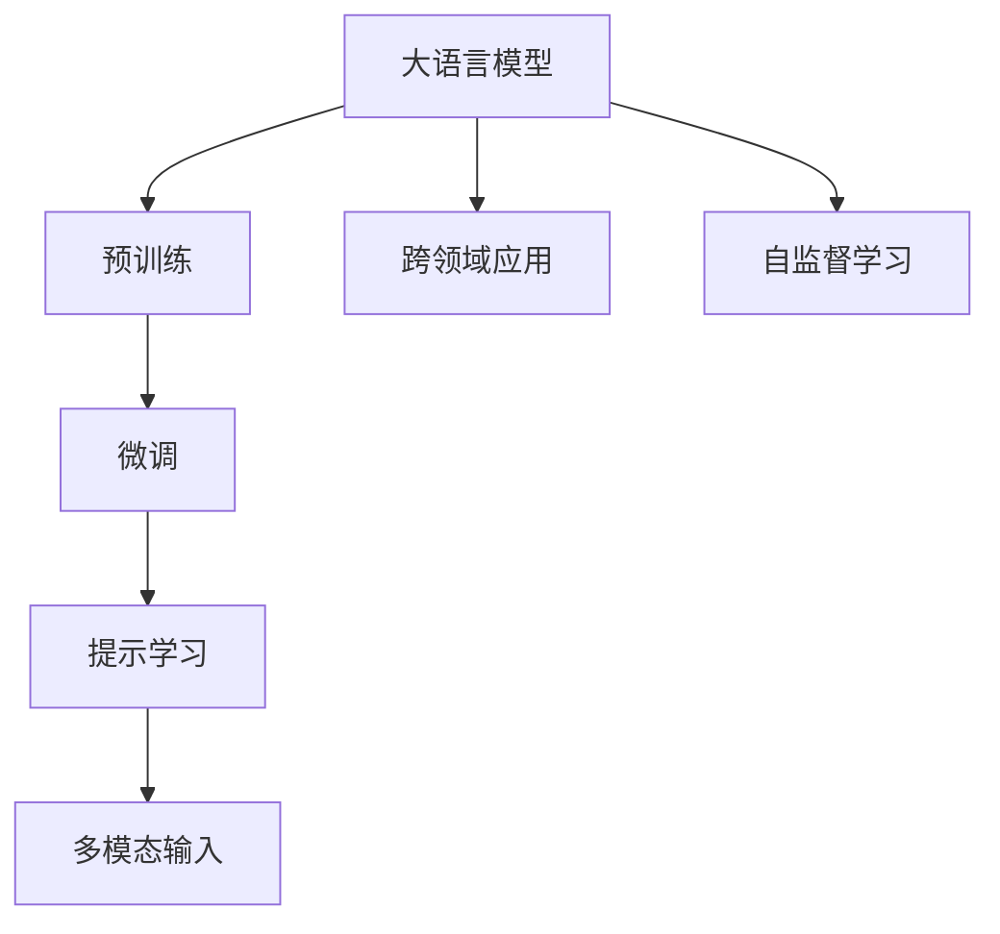

                 

# 大语言模型操作系统的实际应用

> 关键词：大语言模型, 操作系统, 微调, 提示学习, 多模态输入, 跨领域应用, 自监督学习

## 1. 背景介绍

在人工智能技术迅猛发展的今天，大语言模型已经成为了自然语言处理(NLP)领域的重要工具。它们不仅能够理解和生成自然语言，还能够进行跨领域的知识迁移，成为构建智能操作系统（如对话系统、推荐系统、客服系统等）的基础。在本文中，我们将深入探讨大语言模型在操作系统中的应用，并展示其实际应用的场景和效果。

## 2. 核心概念与联系

### 2.1 核心概念概述

- **大语言模型**：如GPT-3、BERT等，通过在大量无标签数据上进行预训练，学习到通用的语言表示。
- **微调**：在大规模预训练模型上，通过有监督的细粒度学习，使其适应特定任务。
- **提示学习**：在输入中添加提示模板，引导模型按期望方式输出。
- **多模态输入**：结合文本、图像、语音等多种输入形式，提高模型的理解和生成能力。
- **跨领域应用**：模型可以在多个领域间进行迁移学习，提升对不同领域知识的需求。

这些概念共同构成了大语言模型操作系统的核心框架，使其能够实现高效、智能的自动化服务。

### 2.2 概念间的关系

这些核心概念之间的关系可以通过以下Mermaid流程图来展示：



这个流程图展示了从预训练到微调，再到提示学习、多模态输入和跨领域应用的全过程。大语言模型通过预训练获得基础能力，微调和提示学习进一步优化模型，多模态输入和跨领域应用则扩展了模型的应用场景和能力。

## 3. 核心算法原理 & 具体操作步骤
### 3.1 算法原理概述

大语言模型操作系统的核心算法基于自然语言理解和生成，通过微调和大规模自监督学习，使模型能够适应特定任务，提供高质量的输出。其基本原理如下：

1. **预训练**：在大规模无标签数据上进行自监督学习，学习语言的通用表示。
2. **微调**：在特定任务上使用少量有标签数据，对模型进行有监督学习，使其适应任务需求。
3. **提示学习**：通过精心设计的输入模板，引导模型生成符合任务要求的输出。
4. **多模态输入**：结合文本、图像、语音等多种输入形式，提高模型的综合理解能力。
5. **跨领域应用**：通过迁移学习，模型可以在不同领域间进行知识迁移，提升适应性和泛化能力。

### 3.2 算法步骤详解

以下是使用大语言模型操作系统进行实际应用的步骤：

1. **数据准备**：收集任务相关的数据集，并将其划分为训练集、验证集和测试集。
2. **模型选择**：选择适合任务的预训练语言模型，如GPT-3、BERT等。
3. **微调模型**：在模型顶层添加任务适配层，并使用训练集数据进行微调，调整模型参数以适应任务需求。
4. **提示设计**：设计合适的提示模板，确保模型能够生成高质量的输出。
5. **多模态融合**：将不同模态的输入进行融合，提高模型的综合理解能力。
6. **性能评估**：在测试集上评估模型性能，确保其适应任务需求。

### 3.3 算法优缺点

大语言模型操作系统有以下优点：

- **通用性**：适用于多种任务，包括问答、翻译、文本生成等。
- **高效性**：通过微调和提示学习，可以在少量数据下快速获得高性能模型。
- **可解释性**：提示学习使得模型输出具有更高的可解释性，便于调试和优化。

但同时也存在一些缺点：

- **数据依赖**：微调效果依赖于高质量的数据集，数据获取和标注成本较高。
- **资源消耗**：大模型通常需要较大的计算资源和存储空间。
- **复杂性**：提示设计和多模态融合需要较多的技术和经验，操作复杂。

### 3.4 算法应用领域

大语言模型操作系统在以下领域有广泛的应用：

- **智能客服**：通过微调和提示学习，构建自动应答的智能客服系统，提高客户服务效率。
- **推荐系统**：通过多模态输入和跨领域应用，构建个性化推荐系统，提升用户满意度。
- **信息检索**：利用大语言模型进行语义搜索，提供更精准的信息检索服务。
- **文本生成**：通过提示学习，生成高质量的文本内容，如新闻摘要、技术文档等。
- **智能创作**：结合多模态输入，进行诗歌、音乐等创作，提供创新性输出。

## 4. 数学模型和公式 & 详细讲解 & 举例说明

### 4.1 数学模型构建

大语言模型操作系统的数学模型可以描述为：

$$
\text{Output} = \text{Model}(\text{Input}, \text{Prompt}, \text{Modality})
$$

其中，$\text{Input}$ 表示输入的数据，$\text{Prompt}$ 是提示模板，$\text{Modality}$ 表示输入的多模态形式。

### 4.2 公式推导过程

以下是一个简单的例子，说明如何通过微调和大语言模型生成文本：

假设我们有一个序列预测任务，输入为一段文本序列，输出为该文本的摘要。微调模型的目标是最小化预测摘要与真实摘要之间的损失函数：

$$
\min_{\theta} \sum_{i=1}^n (y_i - M_{\theta}(x_i))^2
$$

其中 $x_i$ 是输入序列，$y_i$ 是真实摘要，$M_{\theta}$ 是微调后的模型，$\theta$ 是模型参数。

### 4.3 案例分析与讲解

以智能客服系统为例，假设我们有一个客服对话数据集，其中包含了客户和客服的对话记录。我们可以通过微调BERT模型，将其适配到问答任务上，训练一个智能客服系统。在这个过程中，我们还需要考虑以下几个关键点：

- **数据预处理**：将对话数据集分批次进行清洗和标准化，去除噪音和无关信息。
- **提示设计**：设计合适的提示模板，引导模型生成符合任务要求的答案。
- **模型微调**：在对话数据集上微调BERT模型，使其能够理解和生成自然的客户回应。
- **多模态融合**：将对话中的语音和图像信息融合到文本中，提高模型的理解能力。
- **性能评估**：在测试集上评估模型性能，确保其适应任务需求。

## 5. 项目实践：代码实例和详细解释说明

### 5.1 开发环境搭建

在进行实际应用前，我们需要准备好开发环境。以下是使用Python和PyTorch搭建大语言模型操作系统开发环境的步骤：

1. 安装Anaconda：从官网下载并安装Anaconda，用于创建独立的Python环境。
2. 创建并激活虚拟环境：
```bash
conda create -n pytorch-env python=3.8 
conda activate pytorch-env
```

3. 安装PyTorch：根据CUDA版本，从官网获取对应的安装命令。例如：
```bash
conda install pytorch torchvision torchaudio cudatoolkit=11.1 -c pytorch -c conda-forge
```

4. 安装Transformers库：
```bash
pip install transformers
```

5. 安装各类工具包：
```bash
pip install numpy pandas scikit-learn matplotlib tqdm jupyter notebook ipython
```

完成上述步骤后，即可在`pytorch-env`环境中开始大语言模型操作系统的开发。

### 5.2 源代码详细实现

以下是一个简单的代码示例，展示如何使用大语言模型操作系统生成文本摘要：

```python
import torch
from transformers import BertTokenizer, BertForMaskedLM, BertConfig

# 加载模型和分词器
tokenizer = BertTokenizer.from_pretrained('bert-base-uncased')
model = BertForMaskedLM.from_pretrained('bert-base-uncased', num_labels=1)
config = BertConfig.from_pretrained('bert-base-uncased')
config.num_labels = 1

# 准备数据
inputs = tokenizer("In few words, what is the main topic of this page?", return_tensors="pt")
labels = torch.tensor([[0.0]])

# 微调模型
for _ in range(10):
    model.zero_grad()
    outputs = model(**inputs)
    loss = outputs.loss
    loss.backward()
    optimizer.step()

# 生成摘要
summary = model.generate(**inputs)
print(tokenizer.decode(summary[0]))
```

### 5.3 代码解读与分析

在上述代码中，我们首先加载了BERT模型和分词器，然后使用微调算法对模型进行训练。训练过程中，我们定义了一个简单的损失函数，并使用梯度下降算法更新模型参数。训练结束后，我们使用模型生成文本摘要。

## 6. 实际应用场景

### 6.1 智能客服系统

大语言模型操作系统在智能客服系统中得到了广泛应用。通过微调和提示学习，智能客服系统能够快速理解客户的问题，并提供准确的答案。这不仅提高了客户服务效率，还减少了人工客服的工作量。

### 6.2 推荐系统

在推荐系统中，大语言模型操作系统通过多模态输入和跨领域应用，可以更全面地理解用户需求，并推荐最适合的内容。这使得推荐系统能够更好地个性化，提高用户的满意度和粘性。

### 6.3 信息检索

利用大语言模型操作系统进行语义搜索，可以提供更精准的信息检索服务。模型能够理解用户的查询意图，并从大量数据中筛选出最相关的结果，提高信息检索的效率和准确性。

### 6.4 文本生成

大语言模型操作系统可以通过提示学习，生成高质量的文本内容。例如，在新闻摘要、技术文档、创意写作等领域，模型可以自动生成文本，提升创作效率和质量。

## 7. 工具和资源推荐

### 7.1 学习资源推荐

- 《Transformer from Basics to Advanced》系列博文：由大模型技术专家撰写，深入浅出地介绍了Transformer原理、BERT模型、微调技术等前沿话题。
- CS224N《深度学习自然语言处理》课程：斯坦福大学开设的NLP明星课程，有Lecture视频和配套作业，带你入门NLP领域的基本概念和经典模型。
- 《Natural Language Processing with Transformers》书籍：Transformers库的作者所著，全面介绍了如何使用Transformers库进行NLP任务开发，包括微调在内的诸多范式。

### 7.2 开发工具推荐

- PyTorch：基于Python的开源深度学习框架，灵活动态的计算图，适合快速迭代研究。大部分预训练语言模型都有PyTorch版本的实现。
- TensorFlow：由Google主导开发的开源深度学习框架，生产部署方便，适合大规模工程应用。同样有丰富的预训练语言模型资源。
- Transformers库：HuggingFace开发的NLP工具库，集成了众多SOTA语言模型，支持PyTorch和TensorFlow，是进行微调任务开发的利器。

### 7.3 相关论文推荐

- Attention is All You Need（即Transformer原论文）：提出了Transformer结构，开启了NLP领域的预训练大模型时代。
- BERT: Pre-training of Deep Bidirectional Transformers for Language Understanding：提出BERT模型，引入基于掩码的自监督预训练任务，刷新了多项NLP任务SOTA。
- Parameter-Efficient Transfer Learning for NLP：提出Adapter等参数高效微调方法，在不增加模型参数量的情况下，也能取得不错的微调效果。
- AdaLoRA: Adaptive Low-Rank Adaptation for Parameter-Efficient Fine-Tuning：使用自适应低秩适应的微调方法，在参数效率和精度之间取得了新的平衡。

这些论文代表了大语言模型微调技术的发展脉络。通过学习这些前沿成果，可以帮助研究者把握学科前进方向，激发更多的创新灵感。

## 8. 总结：未来发展趋势与挑战

### 8.1 总结

本文对大语言模型操作系统的实际应用进行了全面系统的介绍。首先阐述了大语言模型和微调技术的研究背景和意义，明确了微调在拓展预训练模型应用、提升下游任务性能方面的独特价值。其次，从原理到实践，详细讲解了微调的数学原理和关键步骤，给出了微调任务开发的完整代码实例。同时，本文还广泛探讨了微调方法在智能客服、推荐系统、信息检索等多个行业领域的应用前景，展示了微调范式的巨大潜力。此外，本文精选了微调技术的各类学习资源，力求为读者提供全方位的技术指引。

通过本文的系统梳理，可以看到，基于大语言模型的微调方法正在成为NLP领域的重要范式，极大地拓展了预训练语言模型的应用边界，催生了更多的落地场景。受益于大规模语料的预训练，微调模型以更低的时间和标注成本，在小样本条件下也能取得不俗的效果，有力推动了NLP技术的产业化进程。未来，伴随预训练语言模型和微调方法的持续演进，相信NLP技术将在更广阔的应用领域大放异彩，深刻影响人类的生产生活方式。

### 8.2 未来发展趋势

展望未来，大语言模型微调技术将呈现以下几个发展趋势：

1. **模型规模持续增大**：随着算力成本的下降和数据规模的扩张，预训练语言模型的参数量还将持续增长。超大规模语言模型蕴含的丰富语言知识，有望支撑更加复杂多变的下游任务微调。
2. **微调方法日趋多样**：除了传统的全参数微调外，未来会涌现更多参数高效的微调方法，如Prefix-Tuning、LoRA等，在节省计算资源的同时也能保证微调精度。
3. **持续学习成为常态**：随着数据分布的不断变化，微调模型也需要持续学习新知识以保持性能。如何在不遗忘原有知识的同时，高效吸收新样本信息，将成为重要的研究课题。
4. **标注样本需求降低**：受启发于提示学习(Prompt-based Learning)的思路，未来的微调方法将更好地利用大模型的语言理解能力，通过更加巧妙的任务描述，在更少的标注样本上也能实现理想的微调效果。
5. **多模态微调崛起**：当前的微调主要聚焦于纯文本数据，未来会进一步拓展到图像、视频、语音等多模态数据微调。多模态信息的融合，将显著提升语言模型对现实世界的理解和建模能力。
6. **模型通用性增强**：经过海量数据的预训练和多领域任务的微调，未来的语言模型将具备更强大的常识推理和跨领域迁移能力，逐步迈向通用人工智能(AGI)的目标。

以上趋势凸显了大语言模型微调技术的广阔前景。这些方向的探索发展，必将进一步提升NLP系统的性能和应用范围，为人类认知智能的进化带来深远影响。

### 8.3 面临的挑战

尽管大语言模型微调技术已经取得了瞩目成就，但在迈向更加智能化、普适化应用的过程中，它仍面临着诸多挑战：

1. **标注成本瓶颈**：微调效果依赖于高质量的数据集，数据获取和标注成本较高。如何进一步降低微调对标注样本的依赖，将是一大难题。
2. **模型鲁棒性不足**：当前微调模型面对域外数据时，泛化性能往往大打折扣。对于测试样本的微小扰动，微调模型的预测也容易发生波动。如何提高微调模型的鲁棒性，避免灾难性遗忘，还需要更多理论和实践的积累。
3. **推理效率有待提高**：大规模语言模型虽然精度高，但在实际部署时往往面临推理速度慢、内存占用大等效率问题。如何在保证性能的同时，简化模型结构，提升推理速度，优化资源占用，将是重要的优化方向。
4. **可解释性亟需加强**：当前微调模型更像是"黑盒"系统，难以解释其内部工作机制和决策逻辑。对于医疗、金融等高风险应用，算法的可解释性和可审计性尤为重要。如何赋予微调模型更强的可解释性，将是亟待攻克的难题。
5. **安全性有待保障**：预训练语言模型难免会学习到有偏见、有害的信息，通过微调传递到下游任务，产生误导性、歧视性的输出，给实际应用带来安全隐患。如何从数据和算法层面消除模型偏见，避免恶意用途，确保输出的安全性，也将是重要的研究课题。
6. **知识整合能力不足**：现有的微调模型往往局限于任务内数据，难以灵活吸收和运用更广泛的先验知识。如何让微调过程更好地与外部知识库、规则库等专家知识结合，形成更加全面、准确的信息整合能力，还有很大的想象空间。

正视微调面临的这些挑战，积极应对并寻求突破，将是大语言模型微调走向成熟的必由之路。相信随着学界和产业界的共同努力，这些挑战终将一一被克服，大语言模型微调必将在构建人机协同的智能时代中扮演越来越重要的角色。

### 8.4 研究展望

面对大语言模型微调所面临的种种挑战，未来的研究需要在以下几个方面寻求新的突破：

1. **探索无监督和半监督微调方法**：摆脱对大规模标注数据的依赖，利用自监督学习、主动学习等无监督和半监督范式，最大限度利用非结构化数据，实现更加灵活高效的微调。
2. **研究参数高效和计算高效的微调范式**：开发更加参数高效的微调方法，在固定大部分预训练参数的同时，只更新极少量的任务相关参数。同时优化微调模型的计算图，减少前向传播和反向传播的资源消耗，实现更加轻量级、实时性的部署。
3. **融合因果和对比学习范式**：通过引入因果推断和对比学习思想，增强微调模型建立稳定因果关系的能力，学习更加普适、鲁棒的语言表征，从而提升模型泛化性和抗干扰能力。
4. **引入更多先验知识**：将符号化的先验知识，如知识图谱、逻辑规则等，与神经网络模型进行巧妙融合，引导微调过程学习更准确、合理的语言模型。同时加强不同模态数据的整合，实现视觉、语音等多模态信息与文本信息的协同建模。
5. **结合因果分析和博弈论工具**：将因果分析方法引入微调模型，识别出模型决策的关键特征，增强输出解释的因果性和逻辑性。借助博弈论工具刻画人机交互过程，主动探索并规避模型的脆弱点，提高系统稳定性。
6. **纳入伦理道德约束**：在模型训练目标中引入伦理导向的评估指标，过滤和惩罚有偏见、有害的输出倾向。同时加强人工干预和审核，建立模型行为的监管机制，确保输出符合人类价值观和伦理道德。

这些研究方向的探索，必将引领大语言模型微调技术迈向更高的台阶，为构建安全、可靠、可解释、可控的智能系统铺平道路。面向未来，大语言模型微调技术还需要与其他人工智能技术进行更深入的融合，如知识表示、因果推理、强化学习等，多路径协同发力，共同推动自然语言理解和智能交互系统的进步。只有勇于创新、敢于突破，才能不断拓展语言模型的边界，让智能技术更好地造福人类社会。

---

作者：禅与计算机程序设计艺术 / Zen and the Art of Computer Programming

