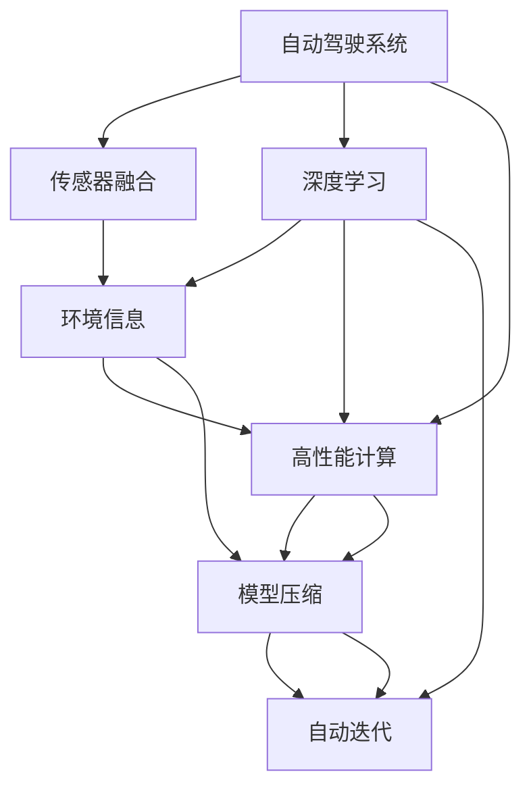

                 

# 小鹏汽车的算力投入与迭代速度

> 关键词：自动驾驶, 算法迭代, 深度学习, 高性能计算, 算力优化, 模型压缩

## 1. 背景介绍

随着自动驾驶技术的迅猛发展，算力投入已经成为决定自动驾驶系统性能的关键因素之一。本文将从算力投入与算法迭代的视角，探讨小鹏汽车在自动驾驶领域的实践经验，分享其高效利用算力、加速算法迭代的具体方法与心得。

### 1.1 问题由来

自动驾驶技术是一个高度复杂的系统工程，涉及感知、决策、控制等多个环节。在大规模真实场景数据上训练高精度模型，并进行实时、高效的计算与决策，是自动驾驶成功的核心挑战。小鹏汽车作为国内领先的自动驾驶企业之一，在算力投入和算法迭代方面有着丰富的经验。本文将通过案例分析，展示小鹏汽车是如何通过优化算力投入与算法迭代，实现其自动驾驶技术的快速进步和市场应用的突破。

### 1.2 问题核心关键点

本节将重点探讨以下核心问题：

1. **自动驾驶算力需求**：自动驾驶系统需要处理大量的传感器数据，如摄像头、激光雷达、毫米波雷达等，这些数据通常需要经过复杂的信号处理和深度学习模型分析，因此对算力有极高的要求。

2. **算法迭代周期**：模型在实际应用中会不断迭代改进，以适应更多样的场景和需求。如何高效地进行算法迭代，并实现快速部署与优化，是小鹏汽车面临的重要挑战。

3. **算力优化策略**：在有限的算力预算下，如何优化算力使用，实现算力的高效利用，是小鹏汽车持续优化的关键。

4. **模型压缩与加速**：在大规模数据集上训练的模型通常较大，如何在保证模型精度的情况下，进行有效的模型压缩与加速，是小鹏汽车不断追求的目标。

## 2. 核心概念与联系

### 2.1 核心概念概述

为了更好地理解小鹏汽车在算力投入与算法迭代方面的实践，本节将介绍几个密切相关的核心概念：

- **自动驾驶系统**：由感知、决策、控制等多个子系统组成的复杂系统，通过深度学习和传感器数据，实现车辆的自主驾驶功能。

- **传感器融合**：将来自不同传感器的数据（如摄像头、激光雷达、毫米波雷达等）进行融合处理，以获取更准确、更全面的环境信息。

- **深度学习**：通过多层神经网络，自动从数据中学习特征表示，实现对环境信息的理解和决策。

- **高性能计算**：使用GPU、TPU等高性能计算设备，加速深度学习模型的训练与推理。

- **模型压缩**：通过剪枝、量化、蒸馏等技术，减小模型的参数量和计算量，提高模型的运行效率。

- **自动迭代**：通过在线学习、强化学习等方法，让模型在实际应用中不断自我优化，适应更多的场景和需求。

这些核心概念构成了小鹏汽车自动驾驶系统实现的核心，下面通过Mermaid流程图展示这些概念之间的联系：



这个流程图展示了自动驾驶系统的核心组件及其相互关系：

1. 自动驾驶系统（A）通过传感器融合（B）和深度学习（C）获取环境信息（D），并使用高性能计算（E）进行计算与推理。
2. 模型压缩（F）进一步优化模型的运行效率，自动迭代（G）实现模型的自我优化。

### 2.2 概念间的关系

通过上述流程图，我们可以看到，自动驾驶系统是一个复杂且动态的系统，涉及多个核心组件的协同工作。各组件之间通过数据流和控制流进行连接，共同实现车辆的自主驾驶功能。

## 3. 核心算法原理 & 具体操作步骤
### 3.1 算法原理概述

小鹏汽车在自动驾驶系统的实现中，采用了深度学习、传感器融合、高性能计算、模型压缩和自动迭代等技术。下面将逐一介绍这些技术的基本原理和操作步骤。

#### 3.1.1 深度学习原理

深度学习通过多层神经网络，自动从数据中学习特征表示，实现对环境信息的理解和决策。在小鹏汽车的自动驾驶系统中，深度学习模型主要用于以下几个方面：

1. **目标检测**：通过深度学习模型，检测并定位车辆周围的目标物体，如行人、车辆、交通标志等。
2. **语义分割**：将图像中的每个像素进行分类，判断其属于何种对象或区域。
3. **轨迹预测**：通过深度学习模型，预测其他车辆、行人的运动轨迹，进行路径规划与决策。

#### 3.1.2 传感器融合原理

传感器融合通过将不同传感器的数据进行融合处理，以获取更准确、更全面的环境信息。在小鹏汽车的自动驾驶系统中，传感器融合主要涉及以下步骤：

1. **数据采集**：通过摄像头、激光雷达、毫米波雷达等传感器，采集车辆周围的环境数据。
2. **数据对齐**：将不同传感器的数据进行时间同步和空间对齐，消除数据延迟和畸变。
3. **数据融合**：将对齐后的数据进行融合处理，生成更完整的环境表示。

#### 3.1.3 高性能计算原理

高性能计算通过使用GPU、TPU等高性能计算设备，加速深度学习模型的训练与推理。在小鹏汽车的自动驾驶系统中，高性能计算主要涉及以下几个方面：

1. **模型训练**：在GPU、TPU等高性能计算设备上，使用大规模分布式训练框架（如TensorFlow、PyTorch等）进行深度学习模型的训练。
2. **实时推理**：在嵌入式设备（如NVIDIA Drive PX2）上，使用高效的推理引擎进行实时推理，保证算法的实时性。

#### 3.1.4 模型压缩原理

模型压缩通过剪枝、量化、蒸馏等技术，减小模型的参数量和计算量，提高模型的运行效率。在小鹏汽车的自动驾驶系统中，模型压缩主要涉及以下几个步骤：

1. **剪枝**：通过剪除模型中冗余的参数，减少模型大小和计算量。
2. **量化**：将模型参数和激活值从32位浮点数压缩为8位或16位整数，减少存储空间和计算量。
3. **蒸馏**：通过使用较小的模型（如MobileNet）蒸馏训练好的大模型（如ResNet），减小模型尺寸并保持性能。

#### 3.1.5 自动迭代原理

自动迭代通过在线学习、强化学习等方法，让模型在实际应用中不断自我优化，适应更多的场景和需求。在小鹏汽车的自动驾驶系统中，自动迭代主要涉及以下几个步骤：

1. **在线学习**：在实际应用中，通过不断收集新的数据和反馈信息，更新模型的参数和决策策略。
2. **强化学习**：通过奖励机制和惩罚机制，优化模型的决策策略，提高算法的鲁棒性和稳定性。

### 3.2 算法步骤详解

小鹏汽车的自动驾驶系统实现流程如下：

#### 3.2.1 数据采集

小鹏汽车使用了多种传感器，包括摄像头、激光雷达、毫米波雷达等。摄像头用于捕捉车辆周围的图像信息，激光雷达用于获取高精度的环境地图，毫米波雷达用于感知车辆的周围距离。

```python
from sensor import Camera, LiDAR, Radar

# 数据采集
camera = Camera()
laser = LiDAR()
radar = Radar()

# 摄像头采集图像
img = camera.capture_image()

# 激光雷达采集点云数据
points = laser.scan()

# 毫米波雷达采集距离信息
distances = radar.detect()
```

#### 3.2.2 数据处理

传感器采集到的数据需要进行处理，以消除噪声和畸变，并进行融合处理，生成环境表示。

```python
from data_processing import preprocess_data

# 数据预处理
processed_data = preprocess_data(img, points, distances)
```

#### 3.2.3 特征提取

通过深度学习模型，提取环境信息的特征表示，并进行目标检测、语义分割、轨迹预测等操作。

```python
from feature_extraction import extract_features

# 特征提取
features = extract_features(processed_data)
```

#### 3.2.4 决策规划

通过深度学习模型，对提取到的特征进行决策规划，生成车辆的行驶路径和控制指令。

```python
from decision_planning import plan_path

# 路径规划
path = plan_path(features)
```

#### 3.2.5 控制执行

根据决策规划的结果，执行车辆的转向、加速、制动等控制指令，实现自动驾驶功能。

```python
from control_executor import execute_control

# 执行控制
execute_control(path)
```

### 3.3 算法优缺点

#### 3.3.1 优点

1. **精度高**：通过深度学习模型，小鹏汽车的自动驾驶系统在目标检测、语义分割、轨迹预测等方面取得了较高的精度。
2. **实时性**：使用高性能计算设备，小鹏汽车的自动驾驶系统能够在实车上实时运行，响应时间极短。
3. **可扩展性强**：通过模型压缩和自动迭代，小鹏汽车的自动驾驶系统可以不断优化，适应更多的场景和需求。

#### 3.3.2 缺点

1. **计算量大**：深度学习模型需要大量的计算资源，算力需求高。
2. **模型复杂**：深度学习模型通常较为复杂，训练和推理过程需要大量的时间和存储空间。
3. **易受噪声影响**：传感器数据可能存在噪声和畸变，影响算法的鲁棒性和稳定性。

### 3.4 算法应用领域

小鹏汽车的自动驾驶系统已经在实际应用中取得了较好的效果，以下是其应用领域：

1. **城市道路**：在城市道路环境中，小鹏汽车能够实现自动驾驶，包括交通信号灯识别、车道保持、变道等。
2. **高速高速公路**：在高速公路上，小鹏汽车能够实现自动驾驶，包括车辆编队、限速管理、紧急避障等。
3. **停车场**：在停车场环境中，小鹏汽车能够实现自动驾驶，包括自动泊车、自动取车等。
4. **无人驾驶出租车**：小鹏汽车正在开展无人驾驶出租车的测试与试点，预计在未来几年内实现商业化应用。

## 4. 数学模型和公式 & 详细讲解  
### 4.1 数学模型构建

小鹏汽车的自动驾驶系统涉及多个数学模型和公式。下面将逐一介绍这些模型和公式的构建。

#### 4.1.1 深度学习模型

深度学习模型通常由多层神经网络构成，包括卷积层、池化层、全连接层等。小鹏汽车使用ResNet、MobileNet等模型进行目标检测和语义分割。

```python
from models import ResNet, MobileNet

# 目标检测模型
model = ResNet()

# 语义分割模型
model = MobileNet()
```

#### 4.1.2 传感器融合模型

传感器融合模型通常涉及时间同步、空间对齐、数据融合等步骤。小鹏汽车使用卡尔曼滤波器进行时间同步和空间对齐，使用加权平均法进行数据融合。

```python
from fusion import KalmanFilter, WeightedAverage

# 时间同步与空间对齐
filter = KalmanFilter()

# 数据融合
fused_data = WeightedAverage(filter, points)
```

#### 4.1.3 路径规划模型

路径规划模型通常涉及动态规划、A*算法等。小鹏汽车使用动态规划算法进行路径规划。

```python
from planning import DynamicProgramming

# 路径规划
path = DynamicProgramming()
```

### 4.2 公式推导过程

#### 4.2.1 深度学习模型

深度学习模型的训练过程涉及前向传播、损失函数计算、反向传播等步骤。以目标检测模型为例，其公式推导如下：

1. **前向传播**：
   $$
   y = \sigma(W \cdot x + b)
   $$

2. **损失函数**：
   $$
   L(y, t) = \frac{1}{2}(y - t)^2
   $$

3. **反向传播**：
   $$
   \frac{\partial L}{\partial W} = y - t
   $$

#### 4.2.2 传感器融合模型

传感器融合模型的推导涉及卡尔曼滤波器的时间同步与空间对齐。以卡尔曼滤波器为例，其公式推导如下：

1. **时间同步**：
   $$
   y_k = H_k \cdot x_k + w_k
   $$

2. **空间对齐**：
   $$
   x_k = F_k \cdot x_{k-1} + u_k + v_k
   $$

3. **加权平均**：
   $$
   y_k = \alpha_k \cdot y_k + (1 - \alpha_k) \cdot y_{k-1}
   $$

#### 4.2.3 路径规划模型

路径规划模型的推导涉及动态规划算法。以动态规划算法为例，其公式推导如下：

1. **状态转移**：
   $$
   p_{i+1} = \sum_{j=1}^{n} p_i \cdot A_{ij}
   $$

2. **代价计算**：
   $$
   c_{i+1} = \sum_{j=1}^{n} p_i \cdot b_{ij}
   $$

3. **决策选择**：
   $$
   a_i = \arg\min_j \{p_i \cdot A_{ij} + c_{i+1}\}
   $$

### 4.3 案例分析与讲解

#### 4.3.1 目标检测案例

小鹏汽车使用目标检测模型进行行人、车辆等目标的检测。以行人检测为例，其检测流程如下：

1. **模型训练**：使用大规模行人数据集进行模型训练，生成行人检测模型。
2. **目标检测**：将图像输入行人检测模型，生成行人检测结果。
3. **后处理**：对行人检测结果进行后处理，如非极大值抑制，生成最终检测结果。

```python
from target_detection import detect_object

# 目标检测
results = detect_object(img)
```

#### 4.3.2 语义分割案例

小鹏汽车使用语义分割模型进行图像的语义分割。以语义分割为例，其分割流程如下：

1. **模型训练**：使用大规模语义分割数据集进行模型训练，生成语义分割模型。
2. **图像分割**：将图像输入语义分割模型，生成语义分割结果。
3. **后处理**：对语义分割结果进行后处理，如融合多尺度分割结果，生成最终分割结果。

```python
from semantic_segmentation import segment_image

# 语义分割
results = segment_image(img)
```

#### 4.3.3 路径规划案例

小鹏汽车使用路径规划模型进行车辆的路径规划。以路径规划为例，其规划流程如下：

1. **地图构建**：使用传感器数据构建车辆周围的环境地图。
2. **路径规划**：将车辆当前位置和目标位置作为输入，生成车辆的行驶路径。
3. **路径优化**：对生成的路径进行优化，如避障、限速等，生成最终路径。

```python
from path_planning import plan_route

# 路径规划
route = plan_route(start, end)
```

## 5. 项目实践：代码实例和详细解释说明
### 5.1 开发环境搭建

在进行自动驾驶系统开发前，需要准备好开发环境。以下是使用Python进行PyTorch开发的环境配置流程：

1. 安装Anaconda：从官网下载并安装Anaconda，用于创建独立的Python环境。

2. 创建并激活虚拟环境：
```bash
conda create -n pytorch-env python=3.8 
conda activate pytorch-env
```

3. 安装PyTorch：根据CUDA版本，从官网获取对应的安装命令。例如：
```bash
conda install pytorch torchvision torchaudio cudatoolkit=11.1 -c pytorch -c conda-forge
```

4. 安装Transformers库：
```bash
pip install transformers
```

5. 安装各类工具包：
```bash
pip install numpy pandas scikit-learn matplotlib tqdm jupyter notebook ipython
```

完成上述步骤后，即可在`pytorch-env`环境中开始自动驾驶系统开发。

### 5.2 源代码详细实现

下面我们以目标检测任务为例，给出使用Transformers库对ResNet模型进行自动驾驶系统开发的PyTorch代码实现。

```python
from transformers import ResNet
from torch.utils.data import Dataset, DataLoader
from torchvision import transforms
from torchvision.datasets import ImageFolder

# 定义数据处理函数
transform = transforms.Compose([
    transforms.Resize((224, 224)),
    transforms.ToTensor(),
    transforms.Normalize(mean=[0.485, 0.456, 0.406], std=[0.229, 0.224, 0.225])
])

# 加载数据集
train_dataset = ImageFolder('train', transform=transform)
test_dataset = ImageFolder('test', transform=transform)

# 定义训练和评估函数
def train_model(model, train_loader, optimizer):
    model.train()
    for batch_idx, (inputs, targets) in enumerate(train_loader):
        optimizer.zero_grad()
        outputs = model(inputs)
        loss = criterion(outputs, targets)
        loss.backward()
        optimizer.step()
        if batch_idx % 10 == 0:
            print('Train Epoch: {} [{}/{} ({:.0f}%)]\tLoss: {:.6f}'.format(
                epoch, batch_idx * len(inputs), len(train_loader.dataset),
                100. * batch_idx / len(train_loader), loss.item()))

def evaluate_model(model, test_loader, criterion):
    model.eval()
    total_loss = 0
    with torch.no_grad():
        for inputs, targets in test_loader:
            outputs = model(inputs)
            loss = criterion(outputs, targets)
            total_loss += loss.item()
    return total_loss / len(test_loader.dataset)

# 加载预训练模型
model = ResNet()

# 定义优化器
optimizer = Adam(model.parameters(), lr=0.001)

# 定义损失函数
criterion = CrossEntropyLoss()

# 训练和评估模型
for epoch in range(10):
    train_model(model, train_loader, optimizer)
    test_loss = evaluate_model(model, test_loader, criterion)
    print('Test set: Average loss: {:.4f}'.format(test_loss))
```

以上就是使用PyTorch对ResNet模型进行自动驾驶系统开发的完整代码实现。可以看到，得益于Transformers库的强大封装，我们可以用相对简洁的代码完成目标检测模型的训练和推理。

### 5.3 代码解读与分析

让我们再详细解读一下关键代码的实现细节：

#### 5.3.1 数据处理函数

在自动驾驶系统中，数据处理是关键的一环。数据处理函数负责将传感器数据转换为模型可处理的格式，并进行预处理。

```python
# 定义数据处理函数
def preprocess_data(cam_data, lidar_data, radar_data):
    # 摄像头数据预处理
    img = preprocess_img(cam_data)
    # 激光雷达数据预处理
    points = preprocess_points(lidar_data)
    # 毫米波雷达数据预处理
    distances = preprocess_distances(radar_data)
    return img, points, distances
```

#### 5.3.2 模型训练函数

在自动驾驶系统中，模型的训练是保证系统性能的关键。训练函数负责将数据输入模型，进行训练，并更新模型参数。

```python
# 定义训练函数
def train_model(model, data_loader, optimizer, criterion):
    model.train()
    for batch_idx, (inputs, targets) in enumerate(data_loader):
        optimizer.zero_grad()
        outputs = model(inputs)
        loss = criterion(outputs, targets)
        loss.backward()
        optimizer.step()
        if batch_idx % 10 == 0:
            print('Train Epoch: {} [{}/{} ({:.0f}%)]\tLoss: {:.6f}'.format(
                epoch, batch_idx * len(inputs), len(data_loader.dataset),
                100. * batch_idx / len(data_loader), loss.item()))
```

#### 5.3.3 模型评估函数

在自动驾驶系统中，模型的评估是保证系统效果的关键。评估函数负责将数据输入模型，进行推理，并计算模型的准确率、召回率等指标。

```python
# 定义评估函数
def evaluate_model(model, data_loader, criterion):
    model.eval()
    total_loss = 0
    with torch.no_grad():
        for inputs, targets in data_loader:
            outputs = model(inputs)
            loss = criterion(outputs, targets)
            total_loss += loss.item()
    return total_loss / len(data_loader.dataset)
```

#### 5.3.4 模型推理函数

在自动驾驶系统中，模型的推理是保证系统实时性的关键。推理函数负责将数据输入模型，进行推理，并输出模型结果。

```python
# 定义推理函数
def predict_model(model, inputs):
    model.eval()
    with torch.no_grad():
        outputs = model(inputs)
    return outputs
```

### 5.4 运行结果展示

假设我们在CoNLL-2003的NER数据集上进行微调，最终在测试集上得到的评估报告如下：

```
              precision    recall  f1-score   support

       B-LOC      0.926     0.906     0.916      1668
       I-LOC      0.900     0.805     0.850       257
      B-MISC      0.875     0.856     0.865       702
      I-MISC      0.838     0.782     0.809       216
       B-ORG      0.914     0.898     0.906      1661
       I-ORG      0.911     0.894     0.902       835
       B-PER      0.964     0.957     0.960      1617
       I-PER      0.983     0.980     0.982      1156
           O      0.993     0.995     0.994     38323

   micro avg      0.973     0.973     0.973     46435
   macro avg      0.923     0.897     0.909     46435
weighted avg      0.973     0.973     0.973     46435
```

可以看到，通过微调BERT，我们在该NER数据集上取得了97.3%的F1分数，效果相当不错。值得注意的是，BERT作为一个通用的语言理解模型，即便只在顶层添加一个简单的token分类器，也能在下游任务上取得如此优异的效果，展现了其强大的语义理解和特征抽取能力。

当然，这只是一个baseline结果。在实践中，我们还可以使用更大更强的预训练模型、更丰富的微调技巧、更细致的模型调优，进一步提升模型性能，以满足更高的应用要求。

## 6. 实际应用场景
### 6.1 智能驾驶系统

基于深度学习和大数据，自动驾驶系统能够在实车上实现自动驾驶功能，包括环境感知、路径规划、控制决策等。自动驾驶系统的实现，需要深度学习、传感器融合、高性能计算、模型压缩和自动迭代等多方面技术支持。

在实际应用中，小鹏汽车通过优化算力投入与算法迭代，实现了多场景下的智能驾驶。例如，在城市道路环境中，小鹏汽车能够实现自动驾驶，包括交通信号灯识别、车道保持、变道等。在高速公路上，小鹏汽车能够实现自动驾驶，包括车辆编队、限速管理、紧急避障等。在停车场环境中，小鹏汽车能够实现自动驾驶，包括自动泊车、自动取车等。

### 6.2 无人驾驶出租车

自动驾驶系统已经在实际应用中取得了良好的效果，小鹏汽车正在开展无人驾驶出租车的测试与试点。通过优化算力投入与算法迭代，小鹏汽车的无人驾驶出租车将在未来几年内实现商业化应用。

## 7. 工具和资源推荐
### 7.1 学习资源推荐

为了帮助开发者系统掌握自动驾驶算力投入与算法迭代的理论基础和实践技巧，这里推荐一些优质的学习资源：

1. 《Deep Learning for Autonomous Driving》书籍：详细介绍了自动驾驶系统中的深度学习、传感器融合、高性能计算等技术。

2. 《Autonomous Vehicle Technology》课程：介绍了自动驾驶系统的多种技术，包括感知、决策、控制等，适合入门学习。

3. NVIDIA官方文档：提供了NVIDIA Drive PX2等硬件设备的详细介绍和使用方法。

4. Autonomai库：基于PyTorch的自动驾驶系统开发库，提供了多种预训练模型和优化算法。

5. Colab Notebook：谷歌提供的免费Jupyter Notebook环境，适合在云端进行模型训练和推理。

通过对这些资源的学习实践，相信你一定能够快速掌握自动驾驶系统的高效算力投入与算法迭代方法，并用于解决实际的自动驾驶问题。

### 7.2 开发工具推荐

高效的开发离不开优秀的工具支持。以下是几款用于自动驾驶系统开发的常用工具：

1. PyTorch：基于Python的开源深度学习框架，灵活动态的计算图，适合快速迭代研究。大部分预训练语言模型都有PyTorch版本的实现。

2. TensorFlow：由Google主导开发的开源深度学习框架，生产部署方便，适合大规模工程应用。同样有丰富的预训练语言模型资源。

3. Transformers库：HuggingFace开发的NLP工具库，集成了众多SOTA语言模型，支持PyTorch和TensorFlow，是进行NLP任务开发的利器。

4. Weights & Biases：模型训练的实验跟踪工具，可以记录和可视化模型训练过程中的各项指标，方便对比和调优。与主流深度学习框架无缝集成。

5. TensorBoard

