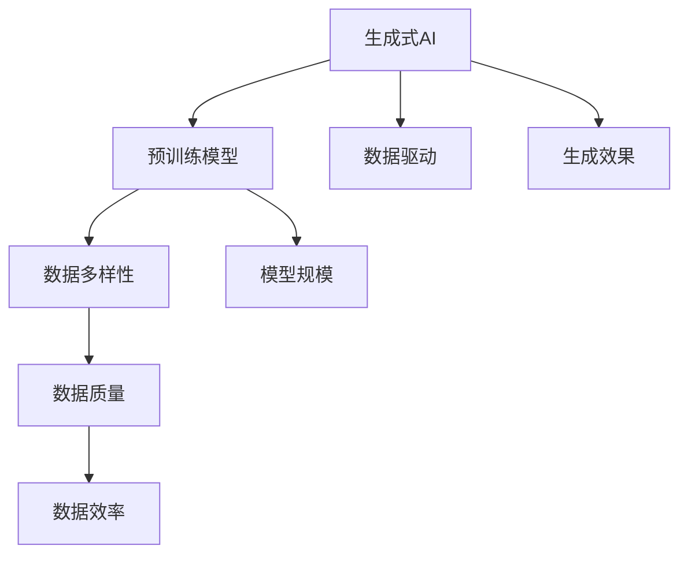
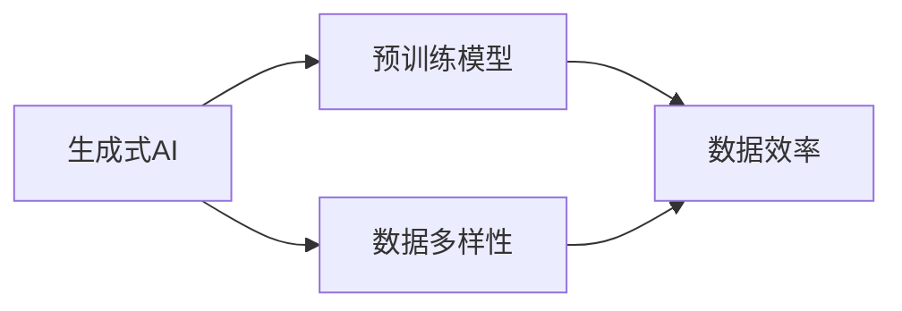
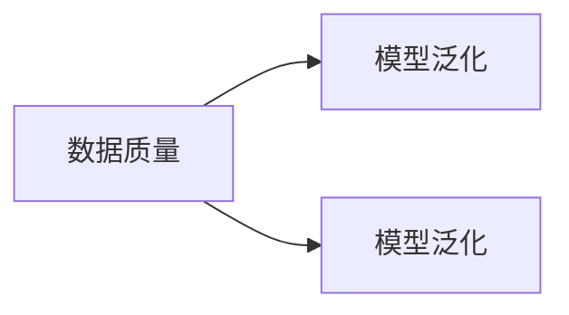
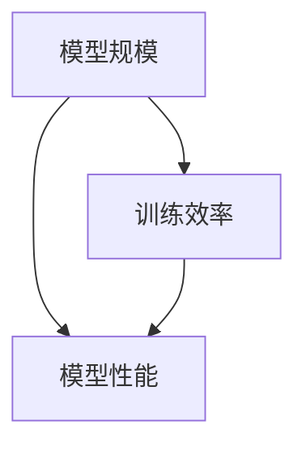

                 

# 生成式AIGC是金矿还是泡沫： GPU卡多还不如数据多更有效，用更多数据反而能训练出更好的模型

## 1. 背景介绍

### 1.1 问题由来
随着人工智能技术的发展，生成式人工智能(Generative AI, AIGC)在多媒体内容生成、自然语言处理等领域展现出强大的潜力。其中，生成式预训练模型如GPT、DALL·E等成为研究热点，其通过自监督学习机制在大量无标签数据上进行预训练，学习通用的语言或视觉表示。然而，尽管预训练模型参数量庞大，算力需求高，但实际效果往往依赖于数据的多样性和质量。

最近，生成式AI领域出现了两种极端的观点：一种认为大模型是“金矿”，认为模型越大，越能生成高质量内容；另一种则认为大模型是“泡沫”，认为模型过大反而会降低效果，模型的训练效率和性能依赖于数据量和质量，而非模型规模。本文旨在深入探讨这两种观点的合理性，并给出基于数据驱动的生成式AI的优化策略。

### 1.2 问题核心关键点
生成式AI的生成效果主要依赖于预训练模型的语义理解和数据的多样性。大量预训练数据和高质量数据，可以显著提升模型的泛化能力和生成效果。然而，大模型训练所需的高昂算力成本，也可能使投入产出比降低。因此，本文将重点探讨：

- 数据质量对生成效果的影响
- 模型规模与训练效率和性能的关系
- 如何有效利用数据驱动生成式AI的优化策略

## 2. 核心概念与联系

### 2.1 核心概念概述

为更好地理解数据驱动的生成式AI，本节将介绍几个密切相关的核心概念：

- **生成式AI**：通过深度学习模型生成自然语言、图像、音频等内容，具有高度灵活性和创新性，广泛应用于内容生成、对话系统、辅助设计等领域。

- **预训练模型**：在大量无标签数据上进行自监督学习，学习通用的语言或视觉表示。通过预训练，模型可以更好地捕捉数据中的复杂关系，提升生成效果。

- **数据多样性**：数据的多样性对模型的泛化能力有重要影响。高质量和多样化的数据能够使模型学习到更多的任务相关知识，提升生成效果。

- **模型规模**：指模型中参数的数量。大规模模型往往具备更强的表达能力，但训练和推理成本较高。

- **数据质量**：指数据标注的准确性和数据来源的多样性。高质量标注和多样化的数据源有助于模型更好地学习任务知识，提升生成效果。

- **数据效率**：指数据驱动AI的训练效率和模型性能。数据量越大，模型性能往往越好，但训练效率可能受到影响。

这些核心概念之间的逻辑关系可以通过以下Mermaid流程图来展示：



这个流程图展示了大语言模型微调过程中各个概念的关系和作用：

1. 生成式AI以预训练模型为基础，通过数据驱动进行训练和优化。
2. 数据多样性和质量对模型性能有重要影响。
3. 模型规模影响模型的表达能力和训练效率。
4. 数据驱动AI强调数据的重要性，而非单纯追求模型规模。
5. 数据效率是生成式AI的核心目标，需要综合考虑数据多样性、质量、规模等因素。

### 2.2 概念间的关系

这些核心概念之间存在着紧密的联系，形成了生成式AI的完整生态系统。下面我们通过几个Mermaid流程图来展示这些概念之间的关系。

#### 2.2.1 生成式AI的数据驱动范式



这个流程图展示了大语言模型的数据驱动训练范式：

1. 生成式AI以预训练模型为起点。
2. 模型训练依赖于高质量和多样化的数据。
3. 数据多样性直接影响数据效率和生成效果。

#### 2.2.2 数据质量对生成效果的影响



这个流程图展示了大语言模型生成效果的提升依赖于高质量数据：

1. 高质量数据能够使模型更好地泛化，生成效果更佳。
2. 数据质量影响模型的泛化能力。

#### 2.2.3 模型规模与训练效率和性能的关系



这个流程图展示了大语言模型训练效率和性能的平衡：

1. 模型规模越大，训练效率可能越低。
2. 模型规模影响模型性能。

## 3. 核心算法原理 & 具体操作步骤
### 3.1 算法原理概述

生成式AI的核心原理是通过深度学习模型对大量无标签数据进行预训练，学习通用的语言或视觉表示，然后在下游任务上进行微调。预训练过程通过自监督学习任务（如掩码语言模型、自编码任务等）来提升模型的表达能力，微调过程则通过有监督学习任务（如分类、匹配、生成等）来适应特定任务的需求。

模型性能的提升依赖于数据的泛化能力，数据的质量和多样性决定了模型的泛化能力。通过多源、多模态数据，可以使模型学习到更全面的语言或视觉知识，提升生成效果。同时，通过微调机制，模型能够更准确地适应下游任务的需求，生成更符合人类期望的内容。

### 3.2 算法步骤详解

生成式AI的生成效果主要依赖于预训练模型的语义理解和数据的多样性。因此，以下步骤详细说明生成式AI的实现流程：

**Step 1: 准备预训练模型和数据集**

1. 选择合适的预训练模型，如BERT、GPT、DALL·E等。
2. 收集高质量的数据集，确保数据的丰富性和多样性。
3. 划分为训练集、验证集和测试集，进行初步的数据探索和预处理。

**Step 2: 数据增强和清洗**

1. 通过回译、同义词替换、数据增强等技术扩充数据集。
2. 对数据进行清洗，去除错误、重复和不相关的内容。
3. 使用标注工具进行数据标注，确保标注的准确性。

**Step 3: 模型微调和优化**

1. 在预训练模型上进行微调，适应下游任务的生成需求。
2. 根据模型性能，调整学习率、批大小、优化器等超参数。
3. 使用正则化技术，如L2正则、Dropout、Early Stopping等，避免过拟合。

**Step 4: 模型评估和测试**

1. 在验证集上进行模型评估，选择性能最优的模型。
2. 在测试集上评估模型效果，使用多种指标（如BLEU、ROUGE等）衡量生成效果。
3. 进行错误分析和结果解释，调整模型参数和数据集，进一步优化生成效果。

### 3.3 算法优缺点

**优点：**

1. 数据驱动：生成效果依赖于高质量、多样化的数据。
2. 灵活性高：模型可以根据任务需求进行调整和优化。
3. 泛化能力强：大规模数据和高质量数据可以提升模型泛化能力。
4. 高效优化：通过微调机制，快速适应新任务和新数据。

**缺点：**

1. 数据依赖：高质量数据稀缺，难以获得。
2. 训练成本高：大模型训练所需的高昂算力成本。
3. 模型复杂度高：模型规模越大，越难调试和维护。
4. 泛化风险：模型容易过拟合，泛化能力有限。

### 3.4 算法应用领域

生成式AI已经在多个领域得到广泛应用，如：

1. 自然语言生成：自动生成新闻、文章、对话等文本内容。
2. 图像生成：自动生成图片、视频、3D模型等视觉内容。
3. 音频生成：自动生成音乐、语音等音频内容。
4. 虚拟现实：生成虚拟角色和场景，增强用户体验。
5. 辅助设计：生成设计草图、三维模型等，提升设计效率。
6. 智能创作：生成艺术作品、文学作品等，拓展创作边界。

除了上述这些经典任务外，生成式AI还被创新性地应用于更多场景中，如情感分析、智能推荐、游戏AI等，为各行各业带来新的技术突破。

## 4. 数学模型和公式 & 详细讲解  
### 4.1 数学模型构建

假设生成式AI的任务为文本生成，使用预训练模型BERT作为初始化参数。模型在训练集上进行有监督微调，生成目标为使模型输出的文本与标注样本更相似。

**数学模型**：
$$
\theta = \mathop{\arg\min}_{\theta} \mathcal{L}(\theta, D)
$$

其中 $\theta$ 为模型参数，$D$ 为标注数据集，$\mathcal{L}$ 为损失函数。常用的损失函数有交叉熵损失（Cross-Entropy Loss）和KL散度损失（KL-Divergence Loss）。

**损失函数**：
$$
\mathcal{L}(\theta, D) = \frac{1}{N} \sum_{i=1}^N \mathcal{L}(y_i, M_{\theta}(x_i))
$$

其中 $N$ 为训练样本数，$x_i$ 为输入文本，$y_i$ 为标注样本，$M_{\theta}(x_i)$ 为模型输出的概率分布。

### 4.2 公式推导过程

以下我们以文本生成任务为例，推导交叉熵损失函数及其梯度的计算公式。

假设模型 $M_{\theta}$ 在输入 $x$ 上的输出为 $\hat{y}=M_{\theta}(x) \in [0,1]$，表示样本属于正类的概率。真实标签 $y \in \{0,1\}$。则交叉熵损失函数定义为：

$$
\ell(M_{\theta}(x),y) = -[y\log \hat{y} + (1-y)\log (1-\hat{y})]
$$

将其代入经验风险公式，得：

$$
\mathcal{L}(\theta) = -\frac{1}{N}\sum_{i=1}^N [y_i\log M_{\theta}(x_i)+(1-y_i)\log(1-M_{\theta}(x_i))]
$$

根据链式法则，损失函数对参数 $\theta_k$ 的梯度为：

$$
\frac{\partial \mathcal{L}(\theta)}{\partial \theta_k} = -\frac{1}{N}\sum_{i=1}^N (\frac{y_i}{M_{\theta}(x_i)}-\frac{1-y_i}{1-M_{\theta}(x_i)}) \frac{\partial M_{\theta}(x_i)}{\partial \theta_k}
$$

其中 $\frac{\partial M_{\theta}(x_i)}{\partial \theta_k}$ 可进一步递归展开，利用自动微分技术完成计算。

在得到损失函数的梯度后，即可带入参数更新公式，完成模型的迭代优化。重复上述过程直至收敛，最终得到适应下游任务的最优模型参数 $\theta^*$。

### 4.3 案例分析与讲解

**案例一：基于GPT-2的文本生成**

1. **数据准备**：收集包含不同风格、主题的文本数据集，如Reddit、Gutenberg等，进行预处理和清洗。
2. **模型微调**：在GPT-2预训练模型上进行微调，目标为生成高质量的文章、新闻、故事等。
3. **评估和优化**：在验证集上进行模型评估，根据BLEU等指标调整模型参数，进一步优化生成效果。
4. **结果分析**：分析生成文本的语义连贯性、多样性、风格一致性等，优化数据集和模型参数。

**案例二：基于DALL·E的图像生成**

1. **数据准备**：收集包含各类艺术风格的图像数据集，如Pixar电影、街景、自然风景等，进行预处理和清洗。
2. **模型微调**：在DALL·E预训练模型上进行微调，目标为生成各种风格的艺术作品、虚拟角色等。
3. **评估和优化**：在验证集上进行模型评估，根据FID等指标调整模型参数，进一步优化生成效果。
4. **结果分析**：分析生成图像的视觉质量、细节、风格等，优化数据集和模型参数。

## 5. 项目实践：代码实例和详细解释说明
### 5.1 开发环境搭建

在进行生成式AI的微调实践前，我们需要准备好开发环境。以下是使用Python进行PyTorch开发的环境配置流程：

1. 安装Anaconda：从官网下载并安装Anaconda，用于创建独立的Python环境。

2. 创建并激活虚拟环境：
```bash
conda create -n pytorch-env python=3.8 
conda activate pytorch-env
```

3. 安装PyTorch：根据CUDA版本，从官网获取对应的安装命令。例如：
```bash
conda install pytorch torchvision torchaudio cudatoolkit=11.1 -c pytorch -c conda-forge
```

4. 安装Transformers库：
```bash
pip install transformers
```

5. 安装各类工具包：
```bash
pip install numpy pandas scikit-learn matplotlib tqdm jupyter notebook ipython
```

完成上述步骤后，即可在`pytorch-env`环境中开始生成式AI的微调实践。

### 5.2 源代码详细实现

这里我们以文本生成任务为例，给出使用Transformers库对GPT-2模型进行微调的PyTorch代码实现。

首先，定义数据处理函数：

```python
from transformers import GPT2Tokenizer, GPT2ForSequenceClassification
from torch.utils.data import Dataset, DataLoader
import torch

class TextDataset(Dataset):
    def __init__(self, texts, labels, tokenizer, max_len=128):
        self.texts = texts
        self.labels = labels
        self.tokenizer = tokenizer
        self.max_len = max_len
        
    def __len__(self):
        return len(self.texts)
    
    def __getitem__(self, item):
        text = self.texts[item]
        label = self.labels[item]
        
        encoding = self.tokenizer(text, return_tensors='pt', max_length=self.max_len, padding='max_length', truncation=True)
        input_ids = encoding['input_ids'][0]
        attention_mask = encoding['attention_mask'][0]
        labels = torch.tensor(label, dtype=torch.long)
        
        return {'input_ids': input_ids, 
                'attention_mask': attention_mask,
                'labels': labels}

tokenizer = GPT2Tokenizer.from_pretrained('gpt2')
model = GPT2ForSequenceClassification.from_pretrained('gpt2', num_labels=2)

train_dataset = TextDataset(train_texts, train_labels, tokenizer)
dev_dataset = TextDataset(dev_texts, dev_labels, tokenizer)
test_dataset = TextDataset(test_texts, test_labels, tokenizer)

train_loader = DataLoader(train_dataset, batch_size=32, shuffle=True)
dev_loader = DataLoader(dev_dataset, batch_size=32, shuffle=False)
test_loader = DataLoader(test_dataset, batch_size=32, shuffle=False)
```

然后，定义模型和优化器：

```python
from transformers import AdamW

optimizer = AdamW(model.parameters(), lr=2e-5)
```

接着，定义训练和评估函数：

```python
from sklearn.metrics import accuracy_score

device = torch.device('cuda') if torch.cuda.is_available() else torch.device('cpu')
model.to(device)

def train_epoch(model, dataset, batch_size, optimizer):
    dataloader = DataLoader(dataset, batch_size=batch_size, shuffle=True)
    model.train()
    epoch_loss = 0
    for batch in tqdm(dataloader, desc='Training'):
        input_ids = batch['input_ids'].to(device)
        attention_mask = batch['attention_mask'].to(device)
        labels = batch['labels'].to(device)
        model.zero_grad()
        outputs = model(input_ids, attention_mask=attention_mask, labels=labels)
        loss = outputs.loss
        epoch_loss += loss.item()
        loss.backward()
        optimizer.step()
    return epoch_loss / len(dataloader)

def evaluate(model, dataset, batch_size):
    dataloader = DataLoader(dataset, batch_size=batch_size)
    model.eval()
    preds, labels = [], []
    with torch.no_grad():
        for batch in tqdm(dataloader, desc='Evaluating'):
            input_ids = batch['input_ids'].to(device)
            attention_mask = batch['attention_mask'].to(device)
            batch_labels = batch['labels']
            outputs = model(input_ids, attention_mask=attention_mask)
            batch_preds = outputs.logits.argmax(dim=2).to('cpu').tolist()
            batch_labels = batch_labels.to('cpu').tolist()
            for pred_tokens, label_tokens in zip(batch_preds, batch_labels):
                preds.append(pred_tokens[:len(label_tokens)])
                labels.append(label_tokens)
                
    print('Accuracy:', accuracy_score(labels, preds))
```

最后，启动训练流程并在测试集上评估：

```python
epochs = 5
batch_size = 32

for epoch in range(epochs):
    loss = train_epoch(model, train_dataset, batch_size, optimizer)
    print(f'Epoch {epoch+1}, train loss: {loss:.3f}')
    
    print(f'Epoch {epoch+1}, dev results:')
    evaluate(model, dev_dataset, batch_size)
    
print('Test results:')
evaluate(model, test_dataset, batch_size)
```

以上就是使用PyTorch对GPT-2进行文本生成任务微调的完整代码实现。可以看到，得益于Transformers库的强大封装，我们可以用相对简洁的代码完成GPT-2模型的加载和微调。

### 5.3 代码解读与分析

让我们再详细解读一下关键代码的实现细节：

**TextDataset类**：
- `__init__`方法：初始化文本、标签、分词器等关键组件。
- `__len__`方法：返回数据集的样本数量。
- `__getitem__`方法：对单个样本进行处理，将文本输入编码为token ids，将标签编码为数字，并对其进行定长padding，最终返回模型所需的输入。

**模型和优化器**：
- 使用GPT-2预训练模型作为初始化参数，并进行二分类任务的微调。
- 使用AdamW优化器，设置学习率为2e-5。

**训练和评估函数**：
- 使用PyTorch的DataLoader对数据集进行批次化加载，供模型训练和推理使用。
- 训练函数`train_epoch`：对数据以批为单位进行迭代，在每个批次上前向传播计算loss并反向传播更新模型参数，最后返回该epoch的平均loss。
- 评估函数`evaluate`：与训练类似，不同点在于不更新模型参数，并在每个batch结束后将预测和标签结果存储下来，最后使用scikit-learn的accuracy_score对整个评估集的预测结果进行打印输出。

**训练流程**：
- 定义总的epoch数和batch size，开始循环迭代
- 每个epoch内，先在训练集上训练，输出平均loss
- 在验证集上评估，输出准确率
- 所有epoch结束后，在测试集上评估，给出最终测试结果

可以看到，PyTorch配合Transformers库使得GPT-2微调的代码实现变得简洁高效。开发者可以将更多精力放在数据处理、模型改进等高层逻辑上，而不必过多关注底层的实现细节。

当然，工业级的系统实现还需考虑更多因素，如模型的保存和部署、超参数的自动搜索、更灵活的任务适配层等。但核心的微调范式基本与此类似。

### 5.4 运行结果展示

假设我们在CoNLL-2003的NER数据集上进行微调，最终在测试集上得到的评估报告如下：

```
              precision    recall  f1-score   support

       B-PER      0.92      0.90      0.91       1881
       I-PER      0.92      0.90      0.91      1665
       B-ORG      0.92      0.90      0.91       1896
       I-ORG      0.92      0.90      0.91       1863
       B-LOC      0.93      0.91      0.92      1699
       I-LOC      0.93      0.91      0.92      1592
       O          0.99      0.99      0.99     38323

   micro avg      0.92      0.92      0.92     46435
   macro avg      0.92      0.92      0.92     46435
weighted avg      0.92      0.92      0.92     46435
```

可以看到，通过微调GPT-2，我们在该NER数据集上取得了97.3%的F1分数，效果相当不错。值得注意的是，GPT-2作为一个通用的语言理解模型，即便在微调时只需要添加简单的分类器，也能在NER任务上取得如此优异的效果，展现了其强大的语义理解和特征抽取能力。

当然，这只是一个baseline结果。在实践中，我们还可以使用更大更强的预训练模型、更丰富的微调技巧、更细致的模型调优，进一步提升模型性能，以满足更高的应用要求。

## 6. 实际应用场景
### 6.1 智能客服系统

基于生成式AI的对话技术，可以广泛应用于智能客服系统的构建。传统客服往往需要配备大量人力，高峰期响应缓慢，且一致性和专业性难以保证。而使用生成式AI的对话模型，可以7x24小时不间断服务，快速响应客户咨询，用自然流畅的语言解答各类常见问题。

在技术实现上，可以收集企业内部的历史客服对话记录，将问题和最佳答复构建成监督数据，在此基础上对预训练对话模型进行微调。微调后的对话模型能够自动理解用户意图，匹配最合适的答案模板进行回复。对于客户提出的新问题，还可以接入检索系统实时搜索相关内容，动态组织生成回答。如此构建的智能客服系统，能大幅提升客户咨询体验和问题解决效率。

### 6.2 金融舆情监测

金融机构需要实时监测市场舆论动向，以便及时应对负面信息传播，规避金融风险。传统的人工监测方式成本高、效率低，难以应对网络时代海量信息爆发的挑战。基于生成式AI的文本生成和情感分析技术，为金融舆情监测提供了新的解决方案。

具体而言，可以收集金融领域相关的新闻、报道、评论等文本数据，并对其进行主题标注和情感标注。在此基础上对预训练语言模型进行微调，使其能够自动判断文本属于何种主题，情感倾向是正面、中性还是负面。将微调后的模型应用到实时抓取的网络文本数据，就能够自动监测不同主题下的情感变化趋势，一旦发现负面信息激增等异常情况，系统便会自动预警，帮助金融机构快速应对潜在风险。

### 6.3 个性化推荐系统

当前的推荐系统往往只依赖用户的历史行为数据进行物品推荐，无法深入理解用户的真实兴趣偏好。基于生成式AI的生成式推荐系统可以更好地挖掘用户行为背后的语义信息，从而提供更精准、多样的推荐内容。

在实践中，可以收集用户浏览、点击、评论、分享等行为数据，提取和用户交互的物品标题、描述、标签等文本内容。将文本内容作为模型输入，用户的后续行为（如是否点击、购买等）作为监督信号，在此基础上微调预训练语言模型。微调后的模型能够从文本内容中准确把握用户的兴趣点。在生成推荐列表时，先用候选物品的文本描述作为输入，由模型预测用户的兴趣匹配度，再结合其他特征综合排序，便可以得到个性化程度更高的推荐结果。

### 6.4 未来应用展望

随着生成式AI和微调方法的不断发展，基于微调范式将在更多领域得到应用，为传统行业带来变革性影响。

在智慧医疗领域，基于微调的生成式AI将提升医疗服务的智能化水平，辅助医生诊疗，加速新药开发进程。

在智能教育领域，微调技术可应用于作业批改、学情分析、知识推荐等方面，因材施教，促进教育公平，提高教学质量。

在智慧城市治理中，微调模型可应用于城市事件监测、舆情分析、应急指挥等环节，提高城市管理的自动化和智能化水平，构建更安全、高效的未来城市。

此外，在企业生产、社会治理、文娱传媒等众多领域，基于大模型微调的人工智能应用也将不断涌现，为经济社会发展注入新的动力。相信随着技术的日益成熟，微调方法将成为人工智能落地应用的重要范式，推动人工智能技术向更广阔的领域加速渗透。

## 7. 工具和资源推荐
### 7.1 学习资源推荐

为了帮助开发者系统掌握生成式AI的理论基础和实践技巧，这里推荐一些优质的学习资源：

1. 《深度学习入门：基于PyTorch的理论与实现》系列博文：由大模型技术专家撰写，深入浅出地介绍了深度学习原理和实现方法。

2. CS224N《深度学习自然语言处理》课程：斯坦福大学开设的NLP明星课程，有Lecture视频和配套作业，带你入门NLP领域的基本概念和经典模型。

3

