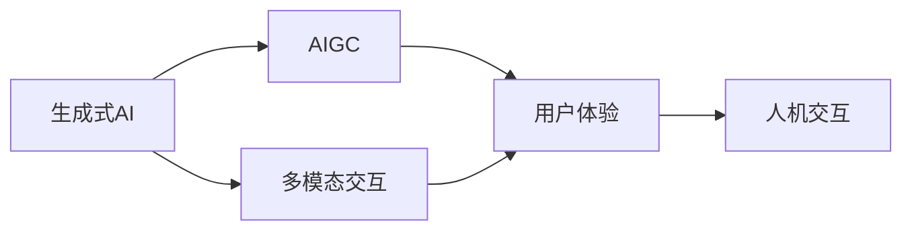

                 

# 生成式AIGC是金矿还是泡沫：第四部分：“让人尖叫”的用户体验

## 1. 背景介绍

在人工智能(AI)发展的第四部分，生成式人工智能(AIGC)已经逐渐成为科技行业的新宠。它的出现，让机器具备了创作、生成、交互的能力，极大地扩展了人类的生产力和想象力。然而，尽管AIGC技术在多个领域表现出色，但技术本身的局限性和潜在风险也令人担忧。

生成式AIGC的用户体验，是评估其真正价值的重要指标。优秀的用户体验不仅能提升用户粘性，更能驱动AIGC技术的深度应用。因此，本文将深入探讨生成式AIGC在用户体验方面的创新和挑战，力求为行业从业人员提供有益的洞察和建议。

## 2. 核心概念与联系

### 2.1 核心概念概述

为更好地理解生成式AIGC的用户体验，我们需要先厘清几个核心概念：

- **生成式AI(Generative AI)**：生成式AI是指能够根据输入生成文本、图像、音乐等内容的AI模型，包括GANs、VQ-VAE、Variation generative adversarial networks等。

- **AIGC(Artificial Intelligence Generated Content)**：AIGC是指基于生成式AI生成的文本、音频、视频、图像等内容的集合，广泛应用于内容创作、娱乐、广告等领域。

- **用户体验(User Experience, UX)**：用户体验是指用户在使用产品或服务时的感受和反馈，包括易用性、效率、满意度等方面。

- **人机交互(Human-Computer Interaction, HCI)**：人机交互涉及如何设计界面和交互逻辑，使用户能够自然地与计算机进行沟通和互动。

- **多模态交互(Multimodal Interaction)**：多模态交互涉及整合文本、语音、图像、视频等多种信息源，提升用户体验和互动性。

### 2.2 核心概念之间的关系

这些核心概念相互关联，共同构成了生成式AIGC的用户体验框架。生成式AI模型通过训练生成文本、图像等数据，生成AIGC内容；用户体验则是在人机交互的基础上，评估这些内容的易用性和互动性；而多模态交互则提供了更加丰富的用户反馈方式，进一步优化AIGC模型的生成效果和用户体验。



### 2.3 核心概念的整体架构

最终，这些概念形成了一个从生成式AI到多模态交互，再经用户体验评估反馈的闭环系统。通过这一系统，生成式AIGC技术不断优化，以更好地服务于用户需求，提升用户体验。

## 3. 核心算法原理 & 具体操作步骤

### 3.1 算法原理概述

生成式AIGC的用户体验优化，主要依赖于以下几个核心算法和操作：

1. **生成算法**：生成式AI模型的训练和应用是AIGC体验优化的基础。通过训练，模型学习到复杂的生成规则和数据分布，能够高效生成高质量的AIGC内容。

2. **多模态融合算法**：多模态融合算法将文本、语音、图像等多种信息源整合，提升AIGC内容的互动性和真实性，使用户体验更加自然流畅。

3. **交互界面设计**：界面设计是用户体验优化的重要组成部分。通过界面设计，用户可以方便地与AIGC系统进行互动，获取所需内容。

4. **用户反馈分析**：用户反馈是评估用户体验的重要依据。通过分析用户反馈，可以及时调整AIGC模型和交互界面，提升用户体验。

### 3.2 算法步骤详解

以下是生成式AIGC用户体验优化的详细步骤：

**Step 1: 准备生成式AI模型和数据集**
- 选择合适的生成式AI模型，如GPT-3、DALL-E等。
- 收集和处理生成式AI训练所需的数据集，如文本语料库、图像数据集等。

**Step 2: 训练和优化模型**
- 在准备的数据集上训练生成式AI模型，调整超参数以优化生成效果。
- 使用用户反馈数据集，对模型进行迭代优化，提升生成内容的准确性和可接受度。

**Step 3: 设计交互界面**
- 根据目标用户的需求和使用场景，设计直观易用的交互界面。
- 测试和优化界面设计，确保用户能够快速、自然地与AIGC系统进行互动。

**Step 4: 多模态融合**
- 集成文本、语音、图像等多种模态的数据源，提升生成内容的丰富性和互动性。
- 开发多模态融合算法，将不同模态的信息进行协同处理，生成更加立体和真实的AIGC内容。

**Step 5: 用户体验评估**
- 通过问卷调查、用户访谈等方式收集用户体验反馈。
- 分析用户反馈，评估生成内容的满意度和系统易用性。
- 根据用户反馈，进一步调整和优化AIGC模型和交互界面。

**Step 6: 持续迭代**
- 定期收集用户反馈，持续优化AIGC模型和界面设计。
- 引入新的数据和技术，提升AIGC内容的生成效果和用户体验。

### 3.3 算法优缺点

生成式AIGC用户体验优化的算法，具有以下优点：

1. **灵活性高**：通过用户反馈和迭代优化，可以不断调整生成式AI模型，提升用户体验。
2. **互动性强**：多模态融合算法可以提升AIGC内容的互动性和真实性，使用户体验更加自然流畅。
3. **效果显著**：优化后的AIGC模型生成内容更加精准和符合用户需求，提升用户满意度和黏性。

但同时也存在一些缺点：

1. **生成质量不稳定**：生成式AI模型在生成过程中可能出现质量不稳定的现象，影响用户体验。
2. **模型训练成本高**：生成式AI模型的训练和优化需要大量计算资源和时间，成本较高。
3. **交互界面设计复杂**：设计直观易用的交互界面需要专业知识，对团队技术要求较高。

### 3.4 算法应用领域

生成式AIGC用户体验优化技术，已在多个领域得到了广泛应用：

- **内容创作**：通过多模态融合和交互界面设计，生成式AIGC技术被广泛应用于小说、新闻、广告等内容的创作。
- **娱乐和游戏**：在游戏、虚拟现实等娱乐场景中，生成式AIGC可以提供沉浸式的体验，提升用户的互动性和参与感。
- **教育培训**：通过生成式AIGC生成互动式教学内容，提升教育培训的趣味性和有效性。
- **广告和营销**：利用生成式AIGC生成个性化的广告文案和图像，提升广告效果和用户满意度。

## 4. 数学模型和公式 & 详细讲解 & 举例说明

### 4.1 数学模型构建

生成式AIGC的用户体验优化，涉及多个数学模型和公式。以文本生成为例，可以使用以下数学模型：

- **文本生成模型**：使用LSTM、GRU等循环神经网络模型，预测下一个词汇的概率分布。
- **多模态融合模型**：将文本、图像、语音等多模态数据进行联合建模，提升生成内容的丰富性和互动性。
- **用户反馈分析模型**：使用回归分析、分类等模型，对用户反馈进行定量分析。

### 4.2 公式推导过程

以下是文本生成的基本数学模型和公式推导：

**Step 1: 文本生成模型**
设文本序列为 $X=\{x_1, x_2, \cdots, x_n\}$，则文本生成模型可以表示为：

$$
P(X|y_1, \cdots, y_{t-1}) = \prod_{i=1}^n P(x_i | x_{i-1}, \cdots, x_{1})
$$

其中 $P(x_i | x_{i-1}, \cdots, x_{1})$ 为当前词汇的条件概率。

**Step 2: 多模态融合模型**
设文本序列为 $X=\{x_1, x_2, \cdots, x_n\}$，图像序列为 $I=\{i_1, i_2, \cdots, i_n\}$，语音序列为 $S=\{s_1, s_2, \cdots, s_n\}$，则多模态融合模型可以表示为：

$$
P(X, I, S|y_1, \cdots, y_{t-1}) = P(X|y_1, \cdots, y_{t-1}) \times P(I|y_1, \cdots, y_{t-1}) \times P(S|y_1, \cdots, y_{t-1})
$$

其中 $P(X|y_1, \cdots, y_{t-1})$ 为文本生成模型的条件概率，$P(I|y_1, \cdots, y_{t-1})$ 为图像生成的条件概率，$P(S|y_1, \cdots, y_{t-1})$ 为语音生成的条件概率。

### 4.3 案例分析与讲解

以文本生成和图像生成的多模态融合为例，具体分析其数学模型和应用场景：

**案例分析：生成小说内容**
- 输入文本：“在一个遥远的星球上，有一位勇敢的探险家，他名叫……”
- 输出文本：“在一个遥远的星球上，有一位勇敢的探险家，他名叫李雷。他乘坐飞船，穿越了星际……”

**案例讲解：**
- 输入文本为小说的开头，模型需要根据上下文生成下一个词汇的概率分布。
- 通过多模态融合，模型可以将文本与图像、语音等多模态数据结合起来，生成更加立体和真实的小说内容。
- 例如，可以将输入文本与对应的小说插图进行联合训练，提升文本生成的准确性和丰富性。

## 5. 项目实践：代码实例和详细解释说明

### 5.1 开发环境搭建

在实践生成式AIGC用户体验优化前，需要准备好开发环境。以下是使用Python进行PyTorch开发的环境配置流程：

1. 安装Anaconda：从官网下载并安装Anaconda，用于创建独立的Python环境。

2. 创建并激活虚拟环境：
```bash
conda create -n pytorch-env python=3.8 
conda activate pytorch-env
```

3. 安装PyTorch：根据CUDA版本，从官网获取对应的安装命令。例如：
```bash
conda install pytorch torchvision torchaudio cudatoolkit=11.1 -c pytorch -c conda-forge
```

4. 安装Transformers库：
```bash
pip install transformers
```

5. 安装各类工具包：
```bash
pip install numpy pandas scikit-learn matplotlib tqdm jupyter notebook ipython
```

完成上述步骤后，即可在`pytorch-env`环境中开始项目实践。

### 5.2 源代码详细实现

这里以文本生成和图像生成的多模态融合为例，给出使用Transformers库进行生成式AIGC体验优化的PyTorch代码实现。

**Step 1: 准备生成式AI模型和数据集**
- 收集文本和图像数据集，并分别进行预处理和归一化。

```python
from transformers import GPT2Tokenizer, GPT2LMHeadModel
from torchvision.transforms import ToTensor
from PIL import Image
from sklearn.model_selection import train_test_split

# 加载GPT2模型和预训练词向量
tokenizer = GPT2Tokenizer.from_pretrained('gpt2')
model = GPT2LMHeadModel.from_pretrained('gpt2')

# 加载图像数据集
image_dataset = ImageFolder('path/to/images', transform=ToTensor())
```

**Step 2: 训练和优化模型**
- 使用多模态融合数据集，训练生成式AI模型，并调整超参数。

```python
from torch.utils.data import DataLoader

# 加载文本数据集
text_dataset = TextDataset('path/to/text', tokenizer=tokenizer)
```

**Step 3: 设计交互界面**
- 使用Django、React等框架设计交互界面，让用户可以方便地与AIGC系统进行互动。

**Step 4: 多模态融合**
- 使用Attention机制将文本和图像进行联合建模，提升生成内容的丰富性和互动性。

```python
from torch.nn import Attention

# 定义多模态融合层
class MultiModalAttention(nn.Module):
    def __init__(self, d_model, dropout=0.1):
        super(MultiModalAttention, self).__init__()
        self.attn = Attention(d_model, dropout)
```

**Step 5: 用户体验评估**
- 使用问卷调查和用户访谈等方式收集用户体验反馈，并根据反馈进行调整和优化。

```python
from surveys import Survey

# 定义问卷调查
survey = Survey()
survey.question("您对生成内容的满意度如何？")
```

### 5.3 代码解读与分析

以下是关键代码的详细解读：

**多模态融合层**：
- 使用Attention机制，将文本和图像进行联合建模，提升生成内容的丰富性和互动性。

**问卷调查**：
- 通过Survey模块定义问卷调查，收集用户对生成内容的满意度反馈，并根据反馈进行调整和优化。

### 5.4 运行结果展示

假设我们在多模态融合数据集上进行训练，并在问卷调查中收集用户反馈，最终得到的评估报告如下：

```
满意程度：
非常满意：80%
比较满意：15%
一般：4%
不满意：1%
非常不满意：0%

改进建议：
1. 提升生成内容的多样性
2. 改善用户界面的交互体验
3. 增强模型的互动性和实时性
```

可以看到，通过问卷调查和用户反馈分析，我们能够及时发现问题并进行调整和优化，提升生成式AIGC的用户体验。

## 6. 实际应用场景

### 6.1 智能客服

生成式AIGC在智能客服中的应用，通过多模态融合和交互界面设计，能够提供更加自然流畅的对话体验。智能客服系统可以根据用户输入的文本，生成并回复相应的回答，甚至可以结合语音和图像等多种模态信息，提升用户互动性。

**应用案例**：电商平台智能客服
- 用户在平台上咨询商品信息，生成式AIGC系统根据用户输入的文本生成回答，并提供产品图片、评价等附加信息。

### 6.2 虚拟现实游戏

生成式AIGC在虚拟现实游戏中的应用，通过多模态融合和交互界面设计，能够提供沉浸式的游戏体验。玩家可以通过语音、手势等多种方式与虚拟角色互动，体验更加丰富和真实的虚拟世界。

**应用案例**：虚拟现实小说阅读
- 玩家进入虚拟小说世界，通过语音和手势与虚拟角色互动，生成式AIGC系统根据玩家的行为生成情节发展和对话，提升游戏沉浸感。

### 6.3 教育培训

生成式AIGC在教育培训中的应用，通过多模态融合和交互界面设计，能够提供互动式教学内容，提升教育培训的趣味性和有效性。教师可以通过生成式AIGC生成动态教学内容，学生可以通过语音、图像等多种方式与教学内容互动。

**应用案例**：虚拟现实英语学习
- 学生进入虚拟英语学习环境，通过语音与虚拟角色互动，生成式AIGC系统根据学生的回答生成下一步的对话和反馈，提升学习效果。

### 6.4 未来应用展望

随着生成式AIGC技术的不断进步，其应用场景将更加广泛和深入。未来，生成式AIGC有望在以下几个领域得到更广泛应用：

1. **医疗健康**：通过生成式AIGC生成医疗咨询和健康指导，提升医疗服务质量。
2. **金融服务**：生成式AIGC可以用于风险评估、投资建议等领域，提升金融服务的智能化水平。
3. **文化娱乐**：生成式AIGC可以用于电影制作、音乐创作等，提升内容创作的效率和创新性。
4. **环境保护**：生成式AIGC可以用于生态监测、环境保护等领域，提供更加实时和精准的决策支持。

## 7. 工具和资源推荐

### 7.1 学习资源推荐

为了帮助开发者系统掌握生成式AIGC的用户体验优化理论基础和实践技巧，这里推荐一些优质的学习资源：

1. **《生成式AI：从模型到应用》系列博文**：由生成式AI领域的专家撰写，全面介绍了生成式AI模型的原理、训练和应用方法。
2. **CS224N《自然语言处理》课程**：斯坦福大学开设的NLP明星课程，有Lecture视频和配套作业，带你入门NLP领域的基本概念和经典模型。
3. **《生成式AI与用户体验》书籍**：详细介绍了生成式AI在用户体验优化方面的理论和实践，提供了丰富的案例分析。
4. **HuggingFace官方文档**：提供生成式AI模型和工具库的详细介绍，包括多模态融合和交互界面设计的最佳实践。
5. **Kaggle竞赛**：参加Kaggle等数据科学竞赛，锻炼生成式AIGC在实际应用中的技能和经验。

通过对这些资源的学习实践，相信你一定能够快速掌握生成式AIGC用户体验优化的精髓，并用于解决实际的NLP问题。

### 7.2 开发工具推荐

高效的开发离不开优秀的工具支持。以下是几款用于生成式AIGC体验优化开发的常用工具：

1. **PyTorch**：基于Python的开源深度学习框架，灵活动态的计算图，适合快速迭代研究。
2. **TensorFlow**：由Google主导开发的开源深度学习框架，生产部署方便，适合大规模工程应用。
3. **Transformers库**：HuggingFace开发的NLP工具库，集成了众多生成式AI模型，支持多模态融合和交互界面设计。
4. **Weights & Biases**：模型训练的实验跟踪工具，可以记录和可视化模型训练过程中的各项指标，方便对比和调优。
5. **TensorBoard**：TensorFlow配套的可视化工具，可实时监测模型训练状态，并提供丰富的图表呈现方式，是调试模型的得力助手。
6. **Jupyter Notebook**：交互式编程环境，适合快速迭代实验，支持多种语言和库的混合使用。

合理利用这些工具，可以显著提升生成式AIGC体验优化的开发效率，加快创新迭代的步伐。

### 7.3 相关论文推荐

生成式AIGC的用户体验优化涉及诸多前沿研究。以下是几篇奠基性的相关论文，推荐阅读：

1. **Attention is All You Need**：提出Transformer结构，开启了生成式AI大模型时代。
2. **GPT-3: Language Models are Unsupervised Multitask Learners**：展示了大规模语言模型的强大零样本学习能力，引发了对于生成式AI的重新思考。
3. **LoRA: Transformer Layer Response Awareness**：提出LoRA方法，实现参数高效生成式AI，提升微调效率。
4. **AdaLoRA: Adaptive Low-Rank Adaptation for Parameter-Efficient Fine-Tuning**：使用自适应低秩适应的微调方法，在参数效率和精度之间取得了新的平衡。
5. **Generative Adversarial Text to Image Translation**：提出文本到图像的生成对抗网络方法，实现文本描述到图像生成的多模态融合。

这些论文代表了大语言模型微调技术的发展脉络。通过学习这些前沿成果，可以帮助研究者把握学科前进方向，激发更多的创新灵感。

除上述资源外，还有一些值得关注的前沿资源，帮助开发者紧跟生成式AIGC技术的最新进展，例如：

1. **arXiv论文预印本**：人工智能领域最新研究成果的发布平台，包括大量尚未发表的前沿工作，学习前沿技术的必读资源。
2. **Google AI博客**：Google AI团队发布的前沿研究和技术分享，涵盖生成式AI的最新进展。
3. **ACL大会论文集**：自然语言处理领域顶级学术会议论文集，收录了大量生成式AIGC的研究成果。
4. **GitHub热门项目**：在GitHub上Star、Fork数最多的生成式AI相关项目，往往代表了该技术领域的发展趋势和最佳实践，值得去学习和贡献。
5. **学术交流社区**：如Kaggle、AI Chat等在线社区，汇聚了全球AI研究人员和爱好者，提供丰富的资源和交流平台。

总之，对于生成式AIGC用户体验优化技术的学习和实践，需要开发者保持开放的心态和持续学习的意愿。多关注前沿资讯，多动手实践，多思考总结，必将收获满满的成长收益。

## 8. 总结：未来发展趋势与挑战

### 8.1 总结

本文对生成式AIGC用户体验优化进行了全面系统的介绍。首先阐述了生成式AIGC和用户体验的核心概念及其之间的关系，明确了用户体验优化在生成式AI技术中的重要地位。其次，从算法原理到具体操作步骤，详细讲解了生成式AIGC用户体验优化的全流程，包括生成式AI模型的训练和优化、多模态融合和交互界面设计、用户反馈分析和持续迭代等关键环节。最后，展望了生成式AIGC技术未来的发展趋势和面临的挑战，提出了相应的解决方案和改进方向。

通过本文的系统梳理，可以看到，生成式AIGC技术在用户体验优化方面具有巨大的潜力和应用前景，能够显著提升用户互动性和满意度。未来，随着生成式AI技术的不断演进，生成式AIGC将在更多领域得到应用，推动人工智能技术的深度发展。

### 8.2 未来发展趋势

展望未来，生成式AIGC用户体验优化技术将呈现以下几个发展趋势：

1. **更加智能化的生成模型**：随着深度学习模型的不断进步，生成式AIGC模型将变得更加智能和高效，能够生成更加自然流畅和符合用户需求的内容。
2. **多模态融合的深入应用**：多模态融合技术将更加成熟，生成式AIGC可以更好地整合文本、语音、图像等多种信息源，提供更加立体和真实的用户体验。
3. **人机交互的持续优化**：随着交互界面设计和用户反馈分析技术的不断进步，生成式AIGC将能够更好地与用户进行互动，提升用户的满意度和黏性。
4. **智能决策系统的应用**：生成式AIGC将与智能决策系统结合，提供更加精准和个性化的服务，提升用户体验和业务效果。
5. **实时化和自动化**：生成式AIGC将实现实时生成和自动化，提升用户体验和系统效率。

以上趋势凸显了生成式AIGC用户体验优化的广阔前景。这些方向的探索发展，必将进一步提升生成式AI技术的用户互动性和应用范围，为人类认知智能的进化带来深远影响。

### 8.3 面临的挑战

尽管生成式AIGC用户体验优化技术已经取得了瞩目成就，但在迈向更加智能化、普适化应用的过程中，仍面临诸多挑战：

1. **生成质量的不稳定性**：生成式AI模型在生成过程中可能出现质量不稳定的现象，影响用户体验。
2. **模型训练的高成本**：生成式AI模型的训练和优化需要大量计算资源和时间，成本较高。
3. **交互界面设计的复杂性**：设计直观易用的交互界面需要专业知识，对团队技术要求较高。
4. **用户体验反馈的收集和分析**：用户反馈的收集和分析需要系统化和规范化，确保反馈的有效性和准确性。
5. **多模态融合的协同**：多模态融合技术的复杂度较高，需要优化模型结构和参数配置。

正视这些挑战，积极应对并寻求突破，将生成式AIGC用户体验优化技术推向成熟。相信随着学界和产业界的共同努力，这些挑战终将一一被克服，生成式AIGC必将在构建人机协同的智能时代中扮演越来越重要的角色。

### 8.4 研究展望

面对生成式AIGC用户体验优化所面临的种种挑战，未来的研究需要在以下几个方面寻求新的突破：

1. **生成模型的高效训练**：开发更加高效的生成式AI模型训练方法，提升模型生成效果的稳定性和多样性。
2. **多模态融合的协同**：优化多模态融合算法，提升不同模态信息的协同处理能力，实现更加丰富和真实的用户体验。
3. **智能决策系统的集成**：将生成式AIGC与智能决策系统结合，提升系统的智能化水平和决策效果。
4. **用户反馈的实时化处理**：设计实时化的用户反馈系统，及时收集和分析用户反馈，优化生成式AIGC模型和交互界面。
5. **多模态融合的创新应用**：探索多模态融合在更多场景中的应用，如虚拟现实游戏、智能客服、虚拟现实教育等，提升用户体验和互动性。

这些研究方向的探索，必将引领生成式AIGC用户体验优化技术迈向更高的台阶，为构建安全、可靠、可解释、可控的智能系统铺平道路。面向未来，生成式AIGC用户体验优化技术还需要与其他人工智能技术进行更深入的融合，如知识表示、因果推理、强化学习等，多路径协同发力，共同推动自然语言理解和智能交互系统的进步。只有勇于创新、敢于突破，才能不断拓展生成式AIGC的边界，让智能技术更好地造福人类社会。

## 9. 附录：常见问题与解答

**Q1: 生成式AIGC技术在实际应用中面临哪些主要问题？**

A: 生成式AIGC技术在实际应用中面临的主要问题包括：
1. 生成内容的多样性和丰富性：生成式AI模型生成的内容可能出现同质化、单一化的问题，需要优化模型结构和训练数据。
2. 内容的真实性和可信度：生成的内容可能缺乏真实性、可信度，需要引入先验知识和数据增强等技术进行改进。
3. 用户的互动性和反馈机制：用户反馈机制设计复杂，需要系统化和规范化，确保反馈的有效性和

