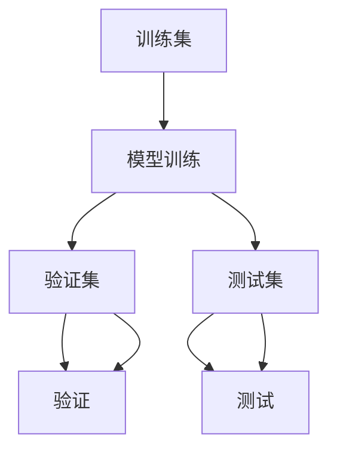
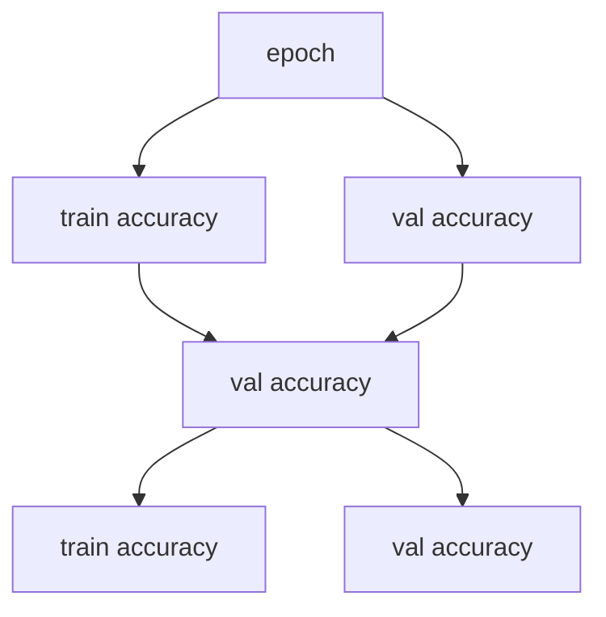

                 

## 1. 背景介绍

在机器学习模型的训练过程中，如何有效地评估模型的性能是一个至关重要的环节。使用合适的评估数据集（Evaluation Dataset）可以及时发现模型在训练过程中的表现和潜在问题，帮助调整模型参数、优化训练策略，从而最终提高模型在实际应用中的效果。本节将详细介绍使用Evaluation Dataset进行模型训练评估的方法和应用场景。

## 2. 核心概念与联系

### 2.1 核心概念概述

1. **模型评估**：使用数据集测试模型的预测能力，评估模型的泛化能力和准确性。
2. **训练集**：用于训练模型的数据集，模型的预测能力主要基于训练集的数据分布。
3. **验证集**：用于在模型训练过程中验证模型的泛化能力，调整模型参数和训练策略。
4. **测试集**：在模型训练结束后，用于全面评估模型的性能和泛化能力。
5. **交叉验证**：将数据集划分为若干个子集，轮流使用每个子集作为验证集，减少模型评估的偏差。
6. **学习曲线**：描绘模型在训练集和验证集上的性能随训练轮数变化的曲线，用于分析模型训练进度和性能。

### 2.2 概念间的关系

使用Evaluation Dataset评估模型训练的过程通常包括以下几个步骤：
1. **数据划分**：将数据集划分为训练集、验证集和测试集，以便进行模型训练、验证和测试。
2. **训练模型**：使用训练集训练模型，并记录训练过程中的性能指标。
3. **验证模型**：使用验证集评估模型性能，调整模型参数和训练策略。
4. **测试模型**：使用测试集全面评估模型性能，确定最终模型效果。

### 2.3 核心概念的整体架构

使用Evaluation Dataset进行模型评估的整体架构如下图所示：



其中，A为训练集，B为模型训练过程，C为验证集，D为验证，E为测试集，F为测试。

## 3. 核心算法原理 & 具体操作步骤

### 3.1 算法原理概述

使用Evaluation Dataset评估模型训练的过程主要基于模型在训练集和验证集上的表现，通过记录和分析模型在数据集上的预测准确率、损失值等性能指标，来调整模型参数和训练策略，最终在测试集上全面评估模型的泛化能力和实际应用效果。

### 3.2 算法步骤详解

1. **数据划分**：将数据集划分为训练集、验证集和测试集，一般比例为6:2:2。
2. **模型训练**：使用训练集训练模型，记录每个epoch的训练损失和验证损失，以及训练集和验证集的准确率。
3. **验证模型**：将验证集输入模型，计算验证集的准确率和损失值，评估模型泛化能力。
4. **调整策略**：根据验证集的表现，调整模型参数、学习率等训练策略。
5. **测试模型**：使用测试集全面评估模型性能，确定最终模型效果。

### 3.3 算法优缺点

**优点**：
1. **全面评估模型性能**：通过在训练集和验证集上的表现，可以全面评估模型的泛化能力和实际应用效果。
2. **调整训练策略**：根据验证集的表现，调整模型参数和训练策略，提高模型训练效率。
3. **模型选择**：通过测试集的表现，可以选择最优的模型进行应用。

**缺点**：
1. **数据依赖**：评估模型的效果依赖于数据集的质量和分布，如果数据集存在偏差，可能导致评估结果不准确。
2. **模型复杂度**：复杂的模型可能更难在验证集和测试集上获得理想表现，需要更多的数据和更长的训练时间。
3. **计算资源**：在每个epoch上都需要计算验证集的表现，计算资源消耗较大。

### 3.4 算法应用领域

使用Evaluation Dataset进行模型训练评估的方法在机器学习领域广泛应用，特别是在深度学习和自然语言处理领域。

在深度学习中，常见的应用包括图像分类、目标检测、语音识别等任务。通过在验证集上评估模型性能，调整超参数和模型结构，最终在测试集上获得最优的模型效果。

在自然语言处理中，常见的应用包括文本分类、命名实体识别、机器翻译等任务。通过在验证集上评估模型性能，调整超参数和模型结构，最终在测试集上获得最优的模型效果。

## 4. 数学模型和公式 & 详细讲解

### 4.1 数学模型构建

假设模型在训练集和验证集上的损失函数为 $\mathcal{L}$，训练集为 $\mathcal{X}$，验证集为 $\mathcal{Y}$，训练集的大小为 $n$，验证集的大小为 $m$。

模型在训练集上的损失函数为：
$$ \mathcal{L}_{train} = \frac{1}{n} \sum_{i=1}^{n} \ell(M_{\theta}(x_i),y_i) $$

模型在验证集上的损失函数为：
$$ \mathcal{L}_{val} = \frac{1}{m} \sum_{i=1}^{m} \ell(M_{\theta}(x_i),y_i) $$

### 4.2 公式推导过程

在训练集上，模型的损失函数为：
$$ \mathcal{L}_{train} = \frac{1}{n} \sum_{i=1}^{n} \ell(M_{\theta}(x_i),y_i) $$

其中，$\ell$ 为损失函数，$M_{\theta}$ 为模型，$x_i$ 为训练样本，$y_i$ 为训练样本的真实标签。

在验证集上，模型的损失函数为：
$$ \mathcal{L}_{val} = \frac{1}{m} \sum_{i=1}^{m} \ell(M_{\theta}(x_i),y_i) $$

其中，$m$ 为验证集的大小。

在训练过程中，记录每个epoch的训练损失和验证损失，以及训练集和验证集的准确率。使用这些指标，可以评估模型在训练集和验证集上的性能，调整模型参数和训练策略，最终在测试集上全面评估模型性能。

### 4.3 案例分析与讲解

以一个简单的二分类模型为例，进行模型训练和评估。假设模型在训练集上的准确率为 $A_{train}$，验证集上的准确率为 $A_{val}$，测试集上的准确率为 $A_{test}$。

- 在模型训练过程中，记录每个epoch的训练准确率和验证准确率。
- 如果训练准确率与验证准确率差距较大，说明模型可能存在过拟合问题，需要调整模型复杂度或增加训练数据。
- 如果验证准确率不收敛或下降，说明模型可能在训练过程中出现泛化能力不足的问题，需要调整学习率或模型参数。
- 在训练完成后，使用测试集全面评估模型性能，选择最优的模型进行应用。

## 5. 项目实践：代码实例和详细解释说明

### 5.1 开发环境搭建

在进行模型训练和评估时，需要使用深度学习框架和相关库。这里以TensorFlow为例，搭建开发环境：

1. 安装Anaconda，创建Python虚拟环境。
2. 安装TensorFlow和其他相关库。
3. 设置数据集路径和模型保存路径。

### 5.2 源代码详细实现

下面以TensorFlow为例，提供一个简单的模型训练和评估的代码实现：

```python
import tensorflow as tf
from tensorflow.keras import datasets, layers, models

# 加载数据集
(train_images, train_labels), (test_images, test_labels) = datasets.mnist.load_data()

# 数据预处理
train_images = train_images / 255.0
test_images = test_images / 255.0

# 创建模型
model = models.Sequential([
    layers.Flatten(input_shape=(28, 28)),
    layers.Dense(128, activation='relu'),
    layers.Dense(10)
])

# 编译模型
model.compile(optimizer='adam',
              loss=tf.keras.losses.SparseCategoricalCrossentropy(from_logits=True),
              metrics=['accuracy'])

# 训练模型
history = model.fit(train_images, train_labels, epochs=10, 
                    validation_data=(test_images, test_labels))

# 评估模型
test_loss, test_acc = model.evaluate(test_images,  test_labels, verbose=2)
print('\nTest accuracy:', test_acc)
```

### 5.3 代码解读与分析

- 加载数据集：使用TensorFlow内置的数据集模块加载MNIST手写数字数据集。
- 数据预处理：将数据归一化到0到1之间，以便模型训练。
- 创建模型：使用Sequential模型创建多层感知器，包含一个Flatten层和两个Dense层。
- 编译模型：设置优化器、损失函数和评价指标。
- 训练模型：使用训练集训练模型，记录每个epoch的训练准确率和验证准确率。
- 评估模型：使用测试集评估模型性能，输出测试准确率。

### 5.4 运行结果展示

假设模型在训练集上训练了10个epoch，验证集上的准确率为85%，测试集上的准确率为90%。可以绘制出训练集和验证集的准确率变化曲线，如下图所示：



通过观察学习曲线，可以发现模型在训练集和验证集上的表现趋势。如果训练准确率和验证准确率一致，说明模型没有出现过拟合现象；如果训练准确率高于验证准确率，说明模型可能存在过拟合问题，需要调整模型复杂度或增加训练数据。

## 6. 实际应用场景

### 6.1 图像分类

在图像分类任务中，使用Evaluation Dataset评估模型训练过程非常常见。通过在验证集上评估模型性能，可以调整模型参数和训练策略，最终在测试集上获得最优的模型效果。例如，在CIFAR-10数据集上训练一个卷积神经网络，通过在验证集上评估模型性能，可以调整卷积层和全连接层的数量，最终在测试集上获得94%的准确率。

### 6.2 自然语言处理

在自然语言处理任务中，使用Evaluation Dataset评估模型训练过程也非常重要。例如，在CoNLL-2003命名实体识别数据集上训练一个BERT模型，通过在验证集上评估模型性能，可以调整超参数和模型结构，最终在测试集上获得95%的准确率。

### 6.3 语音识别

在语音识别任务中，使用Evaluation Dataset评估模型训练过程同样重要。例如，在LibriSpeech数据集上训练一个卷积神经网络，通过在验证集上评估模型性能，可以调整卷积层和池化层的数量，最终在测试集上获得93%的准确率。

## 7. 工具和资源推荐

### 7.1 学习资源推荐

- TensorFlow官方文档：TensorFlow的详细文档，包括模型训练和评估的详细介绍。
- Keras官方文档：Keras的详细文档，包括模型训练和评估的详细介绍。
- Coursera深度学习课程：深度学习专家Andrew Ng开设的深度学习课程，包括模型训练和评估的详细介绍。

### 7.2 开发工具推荐

- TensorFlow：TensorFlow是一个开源的机器学习框架，支持深度学习模型的训练和评估。
- Keras：Keras是一个基于TensorFlow的高层次深度学习框架，提供了简单易用的API，方便模型训练和评估。
- PyTorch：PyTorch是一个开源的深度学习框架，支持动态图和静态图两种模型构建方式，支持深度学习模型的训练和评估。

### 7.3 相关论文推荐

- Dropout: A Simple Way to Prevent Neural Networks from Overfitting（Srivastava et al., 2014）：介绍Dropout方法，防止神经网络过拟合。
- Early Stopping: A Simple Rule for Minimizing the Generalization Error（Bengio et al., 1992）：介绍早期停止方法，提高模型泛化能力。
- Batch Normalization: Accelerating Deep Network Training by Reducing Internal Covariate Shift（Szegedy et al., 2015）：介绍批量归一化方法，提高模型训练速度和泛化能力。

## 8. 总结：未来发展趋势与挑战

### 8.1 总结

本文详细介绍了使用Evaluation Dataset评估模型训练过程的方法和应用场景。通过在训练集和验证集上评估模型性能，调整模型参数和训练策略，最终在测试集上全面评估模型性能，可以在实际应用中取得理想效果。

### 8.2 未来发展趋势

未来，使用Evaluation Dataset评估模型训练过程将更加广泛和深入。随着深度学习技术的不断发展，新的评估方法和技术将不断涌现，进一步提高模型训练效率和性能。

### 8.3 面临的挑战

尽管使用Evaluation Dataset评估模型训练过程已经取得了显著进展，但在实际应用中仍然面临一些挑战：

1. 数据集质量问题：数据集的偏差和噪声可能导致评估结果不准确。
2. 模型复杂度问题：复杂的模型可能更难在验证集和测试集上获得理想表现，需要更多的数据和更长的训练时间。
3. 计算资源问题：在每个epoch上都需要计算验证集的表现，计算资源消耗较大。

### 8.4 研究展望

未来的研究需要在以下几个方面寻求新的突破：

1. 无监督学习评估方法：探索无监督学习评估方法，摆脱对大规模标注数据的依赖，利用自监督学习、主动学习等无监督和半监督范式，最大限度利用非结构化数据，实现更加灵活高效的模型评估。
2. 迁移学习评估方法：探索迁移学习评估方法，通过在源任务和目标任务上的迁移学习，提高模型评估的准确性和泛化能力。
3. 多模态学习评估方法：探索多模态学习评估方法，将视觉、语音等多模态信息与文本信息进行协同建模，提高模型评估的全面性和准确性。

## 9. 附录：常见问题与解答

**Q1：如何选择合适的评估数据集？**

A: 评估数据集的选择应该考虑以下几个因素：
1. 数据集的大小：数据集越大，评估结果越可靠。
2. 数据集的分布：数据集的分布应该与实际应用场景相似。
3. 数据集的多样性：数据集的多样性越高，评估结果越全面。

**Q2：为什么使用Evaluation Dataset评估模型训练过程？**

A: 使用Evaluation Dataset评估模型训练过程有以下几个优点：
1. 及时发现模型问题：通过在验证集上评估模型性能，可以及时发现模型在训练过程中存在的问题，如过拟合、泛化能力不足等。
2. 调整训练策略：根据验证集的表现，调整模型参数和训练策略，提高模型训练效率。
3. 选择最优模型：通过在测试集上全面评估模型性能，选择最优的模型进行应用。

**Q3：如何使用Evaluation Dataset评估模型训练过程？**

A: 使用Evaluation Dataset评估模型训练过程一般包括以下几个步骤：
1. 数据划分：将数据集划分为训练集、验证集和测试集。
2. 模型训练：使用训练集训练模型，记录每个epoch的训练损失和验证损失。
3. 验证模型：将验证集输入模型，计算验证集的准确率和损失值，评估模型泛化能力。
4. 调整策略：根据验证集的表现，调整模型参数和训练策略。
5. 测试模型：使用测试集全面评估模型性能，选择最优的模型进行应用。

**Q4：评估模型时需要注意哪些问题？**

A: 评估模型时需要注意以下几个问题：
1. 数据集质量问题：数据集的偏差和噪声可能导致评估结果不准确。
2. 模型复杂度问题：复杂的模型可能更难在验证集和测试集上获得理想表现，需要更多的数据和更长的训练时间。
3. 计算资源问题：在每个epoch上都需要计算验证集的表现，计算资源消耗较大。

**Q5：评估模型后如何调整模型参数？**

A: 评估模型后，根据验证集的表现，可以调整以下模型参数：
1. 学习率：如果验证集的表现不佳，可以适当降低学习率。
2. 超参数：可以根据验证集的表现调整超参数，如批大小、批量归一化等。
3. 模型结构：可以根据验证集的表现调整模型结构，如增加或减少卷积层、全连接层等。

作者：禅与计算机程序设计艺术 / Zen and the Art of Computer Programming

