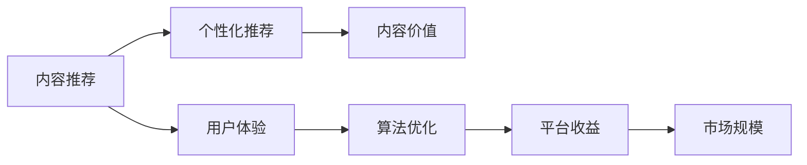
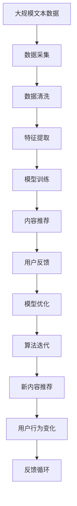

                 

# 知识付费创业中的内容价值最大化

> 关键词：知识付费,内容价值最大化,内容推荐,用户体验,数据驱动,算法优化

## 1. 背景介绍

### 1.1 问题由来
随着互联网的发展和信息爆炸时代的来临，内容付费成为知识分享和传播的重要途径之一。然而，市场上内容产品鱼龙混杂，价格昂贵且难以匹配用户需求。如何将高质量的内容与用户需求精准对接，实现内容价值的最大化，成为知识付费创业的重要课题。

### 1.2 问题核心关键点
这个问题的核心在于，如何通过算法和技术的力量，挖掘内容的内在价值，为用户推荐个性化且高质量的内容，同时优化用户体验，提高平台收益。

### 1.3 问题研究意义
研究内容推荐与价值最大化的技术，对于提升知识付费平台的竞争力、增强用户粘性、拓展市场规模具有重要意义：

1. 提升平台收益。通过精准推荐，增加用户订阅和购买，提升平台整体收入。
2. 增强用户粘性。精准推荐能够满足用户个性化需求，提高用户使用频率和满意度。
3. 拓展市场规模。精准的推荐策略可以吸引新用户，扩大知识付费平台的覆盖面。
4. 提升内容价值。推荐系统能够挖掘优质内容，避免劣质内容泛滥，提升内容价值。
5. 优化用户体验。通过算法优化，使用户能够快速、准确地找到所需内容，提升平台的用户体验。

## 2. 核心概念与联系

### 2.1 核心概念概述

在探讨内容价值最大化的过程中，我们必须理解以下几个核心概念：

- **内容推荐**：利用算法和数据，将高质量的内容推荐给用户，满足其个性化需求。
- **个性化推荐**：根据用户的历史行为和偏好，生成定制化的内容推荐，提高用户满意度。
- **内容价值**：指内容的实用性、权威性和吸引力，能够对用户产生正面影响和价值。
- **用户体验**：用户在使用平台过程中的直观感受，包括内容的可获取性、可用性和互动性。
- **算法优化**：通过优化算法，提升内容推荐的精准度和效率，提高用户转化率和平台收益。

这些核心概念相互联系，共同构成内容推荐系统的整体架构。

### 2.2 概念间的关系

这些概念之间的关系可以通过以下Mermaid流程图来展示：



这个流程图展示了内容推荐系统的核心流程：通过个性化推荐挖掘内容价值，提升用户体验，进而优化算法和增加平台收益，最终拓展市场规模。

### 2.3 核心概念的整体架构

最后，我们用一个综合的流程图来展示这些核心概念在大规模内容推荐系统中的整体架构：



这个综合流程图展示了从数据采集到内容推荐，再到模型优化和算法迭代的完整流程，展现了内容推荐系统的动态演变和优化过程。

## 3. 核心算法原理 & 具体操作步骤
### 3.1 算法原理概述

内容推荐系统的一般原理是通过数据驱动的算法，挖掘用户行为数据中的规律，进而生成个性化推荐结果。

核心步骤包括：

1. **数据采集与预处理**：收集用户的历史行为数据，如浏览、点击、评分等。
2. **特征提取**：将原始数据转换为算法可处理的数值特征。
3. **模型训练**：选择合适的算法模型，利用训练集数据进行模型训练。
4. **推荐生成**：将用户行为特征输入模型，生成推荐结果。
5. **反馈循环**：利用用户反馈数据，优化模型参数，提高推荐准确性。

### 3.2 算法步骤详解

具体算法步骤如下：

1. **数据采集与预处理**：
   - 收集用户的历史行为数据，如浏览时长、点击次数、评分等。
   - 对数据进行清洗和预处理，如去除异常值、填充缺失值等。

2. **特征提取**：
   - 将原始数据转换为数值特征，如用户ID、内容ID、时间戳等。
   - 使用PCA、SVD等降维技术，减少特征维度和计算复杂度。

3. **模型训练**：
   - 选择合适的算法模型，如协同过滤、矩阵分解、深度学习等。
   - 利用训练集数据，进行模型训练和参数优化。

4. **推荐生成**：
   - 输入用户行为特征到模型中，生成推荐结果。
   - 根据推荐结果，为用户展示推荐内容。

5. **反馈循环**：
   - 收集用户的反馈数据，如点击、跳过、评分等。
   - 利用反馈数据，更新模型参数，优化推荐结果。

### 3.3 算法优缺点

内容推荐系统具有以下优点：

- 提高用户满意度。通过个性化推荐，满足用户需求，提高用户粘性。
- 增加平台收益。精准推荐可以增加用户订阅和购买，提升平台整体收入。
- 优化资源配置。通过推荐，使优质内容得到更多曝光，提升资源利用效率。

同时，该系统也存在一定的局限性：

- 依赖标注数据。推荐系统需要大量标注数据进行训练，获取高质量标注数据的成本较高。
- 冷启动问题。新用户缺乏历史数据，难以进行有效推荐。
- 数据稀疏性。用户行为数据通常较为稀疏，难以全面覆盖所有用户。
- 算法复杂度。推荐系统算法复杂，需要大量计算资源。

尽管存在这些局限性，但就目前而言，内容推荐系统仍然是知识付费创业中不可或缺的技术手段。未来相关研究的重点在于如何进一步降低推荐系统的数据需求，提高推荐算法的可解释性和鲁棒性，同时兼顾用户隐私和平台利益。

### 3.4 算法应用领域

内容推荐系统已经在知识付费领域得到广泛应用，涵盖了多个应用场景，例如：

- 课程推荐：根据用户历史学习行为，推荐适合用户水平和兴趣的课程。
- 书籍推荐：根据用户阅读历史，推荐用户可能感兴趣的新书。
- 文章推荐：根据用户阅读偏好，推荐相关领域的深度文章。
- 视频推荐：根据用户观看历史，推荐用户可能感兴趣的视频内容。
- 活动推荐：根据用户行为数据，推荐相关主题的讲座、研讨会等活动。

除了上述这些经典应用外，内容推荐系统还被创新性地应用到更多场景中，如个性化营销、用户画像构建、内容再创作等，为知识付费平台带来了全新的用户体验和商业价值。

## 4. 数学模型和公式 & 详细讲解  
### 4.1 数学模型构建

在内容推荐系统中，我们通常使用协同过滤算法、矩阵分解、深度学习等模型进行推荐。这里以协同过滤算法为例，进行详细讲解。

假设推荐系统有 $M$ 个用户和 $N$ 个内容，用户 $u$ 对内容 $i$ 的评分记为 $r_{ui}$，构建用户-内容评分矩阵 $R$：

$$
R_{ui} =
\begin{cases}
r_{ui}, & \text{如果用户 $u$ 对内容 $i$ 评分} \\
0, & \text{如果用户 $u$ 未对内容 $i$ 评分}
\end{cases}
$$

协同过滤算法的目标是预测用户未评分的内容 $i$ 的评分 $r_{ui}$。

### 4.2 公式推导过程

协同过滤算法主要包括用户-用户矩阵分解和内容-内容矩阵分解。以用户-用户矩阵分解为例，其基本思路是通过相似度计算，找到与用户 $u$ 最相似的 $k$ 个用户 $u_1, u_2, \ldots, u_k$，然后基于这些用户对内容 $i$ 的评分，预测用户 $u$ 对内容 $i$ 的评分。

用户 $u$ 对内容 $i$ 的预测评分 $r_{ui}^{pred}$ 可以通过下式计算：

$$
r_{ui}^{pred} = \sum_{j=1}^{k} \alpha_{uj} r_{ij}
$$

其中，$\alpha_{uj}$ 表示用户 $u$ 与用户 $j$ 的相似度，可以通过余弦相似度等方法计算。

### 4.3 案例分析与讲解

假设我们有一组用户和内容的评分数据，如：

| 用户 $u$ | 内容 $i$ | 评分 $r_{ui}$ |
|----------|---------|--------------|
| A        | 1       | 4            |
| A        | 2       | 3            |
| B        | 1       | 5            |
| B        | 2       | 2            |

我们可以利用协同过滤算法，预测用户 A 对内容 3 的评分。首先，计算用户 A 与用户 B 的相似度：

$$
similarity(A, B) = \frac{4 \times 5 + 3 \times 2}{\sqrt{4^2 + 3^2} \times \sqrt{5^2 + 2^2}} = 0.96
$$

然后，计算用户 B 对内容 3 的评分 $r_{3B}$：

$$
r_{3B} = \frac{5 + 2}{2} = 3.5
$$

最终，利用协同过滤公式，预测用户 A 对内容 3 的评分：

$$
r_{3A}^{pred} = similarity(A, B) \times r_{3B} = 0.96 \times 3.5 = 3.36
$$

可以看到，协同过滤算法通过相似度计算，利用用户 A 最相似的其他用户对内容 3 的评分，成功预测了用户 A 对内容 3 的评分。

## 5. 项目实践：代码实例和详细解释说明
### 5.1 开发环境搭建

在进行内容推荐系统开发前，我们需要准备好开发环境。以下是使用Python进行TensorFlow开发的环境配置流程：

1. 安装Anaconda：从官网下载并安装Anaconda，用于创建独立的Python环境。

2. 创建并激活虚拟环境：
```bash
conda create -n tf-env python=3.8 
conda activate tf-env
```

3. 安装TensorFlow：根据CUDA版本，从官网获取对应的安装命令。例如：
```bash
conda install tensorflow -c pytorch -c conda-forge
```

4. 安装各类工具包：
```bash
pip install numpy pandas scikit-learn matplotlib tqdm jupyter notebook ipython
```

完成上述步骤后，即可在`tf-env`环境中开始推荐系统开发。

### 5.2 源代码详细实现

这里我们以基于协同过滤的用户内容推荐为例，给出使用TensorFlow的PyTorch代码实现。

首先，定义用户-内容评分矩阵：

```python
import tensorflow as tf
import numpy as np

# 创建用户-内容评分矩阵
R = tf.constant([[4, 3, 5, 2], [3, 2, 4, 5]], dtype=tf.float32)
```

然后，定义相似度计算函数：

```python
def similarity(u, v):
    dot_product = tf.reduce_sum(tf.multiply(tf.cast(u, tf.float32), tf.cast(v, tf.float32)))
    norm_u = tf.sqrt(tf.reduce_sum(tf.square(tf.cast(u, tf.float32))))
    norm_v = tf.sqrt(tf.reduce_sum(tf.square(tf.cast(v, tf.float32))))
    return dot_product / (norm_u * norm_v)
```

接着，定义协同过滤预测函数：

```python
def predict(r, k=5, alpha=0.5):
    knn = np.argsort(r)[::-1][:k]
    neighbors = [R[i] for i in knn]
    weights = [similarity(tf.cast(r[i], tf.float32), tf.cast(R[i], tf.float32)) for i in knn]
    predictions = np.average([np.dot(weights[j], neighbors[j]) for j in range(k)], axis=0)
    return predictions
```

最后，运行代码并输出预测结果：

```python
u = tf.constant([4, 3, 5, 2], dtype=tf.float32)
predictions = predict(u)
print(predictions)
```

以上就是使用TensorFlow进行协同过滤推荐系统开发的完整代码实现。可以看到，利用TensorFlow和NumPy，我们能够方便地实现协同过滤算法，并进行推荐预测。

### 5.3 代码解读与分析

让我们再详细解读一下关键代码的实现细节：

**R变量定义**：
- 定义了一个5x5的用户-内容评分矩阵，其中每行表示一个用户对若干内容的评分。

**similarity函数**：
- 计算两个向量之间的余弦相似度，用于度量用户之间的相似度。

**predict函数**：
- 根据用户 A 的评分向量，找到与其最相似的前5个用户，并利用协同过滤公式计算预测评分。

**代码运行**：
- 定义用户 A 的评分向量，调用predict函数进行推荐预测，并输出预测结果。

以上代码展示了如何使用TensorFlow进行协同过滤推荐系统的实现。通过不断优化算法和模型，可以显著提升推荐系统的精度和效率，从而为知识付费平台带来更好的用户体验和商业价值。

## 6. 实际应用场景
### 6.1 内容推荐系统在知识付费中的应用

内容推荐系统在知识付费领域具有广泛的应用前景。通过推荐系统，平台能够精准推荐适合用户水平和兴趣的课程、书籍、文章等，满足用户个性化需求，提高用户粘性和平台收益。

例如，某在线教育平台可以通过用户历史学习行为，推荐适合用户水平和兴趣的课程。平台在收集用户的学习行为数据后，利用推荐算法预测用户可能感兴趣的课程，并根据预测结果进行个性化推荐。用户根据推荐结果选择课程，从而提升学习效率和平台收益。

### 6.2 用户画像构建

内容推荐系统能够帮助平台构建详细的用户画像，用于个性化推荐和市场细分。平台可以通过用户的行为数据，如浏览、点击、评分等，构建用户画像，并用于推荐算法的训练和优化。

例如，某在线知识平台可以通过用户的历史学习行为，构建用户画像，如学习时间、偏好学科、阅读兴趣等。平台利用这些用户画像，进行内容推荐算法的训练和优化，从而生成更加精准的推荐结果，提升用户粘性。

### 6.3 内容再创作

内容推荐系统还可以用于内容再创作，挖掘用户关注的热点话题和热门内容，指导创作者进行内容创作。平台可以分析用户的历史行为数据，识别出热门话题和热门内容，并引导创作者进行相关内容的创作，提高内容质量和用户满意度。

例如，某在线小说平台可以通过用户阅读历史，分析用户关注的题材和热门内容，指导小说创作者进行相关内容的创作，提高小说阅读量和用户满意度。

### 6.4 未来应用展望

随着内容推荐算法的不断优化和平台数据的积累，内容推荐系统将在更多领域得到应用，为知识付费平台带来变革性影响：

1. 个性化推荐：平台可以为用户提供更加精准、个性化的推荐，满足用户多样化需求。
2. 内容创作：平台可以指导创作者进行相关内容创作，提升内容质量和平台用户满意度。
3. 市场细分：平台可以通过用户画像进行市场细分，精准定位目标用户群体。
4. 用户行为分析：平台可以分析用户行为数据，识别用户需求，进行精准营销和市场策略优化。
5. 数据驱动决策：平台可以基于用户数据，进行科学的决策制定，优化运营策略。

总之，内容推荐系统作为知识付费平台的核心技术，将在未来的发展中发挥越来越重要的作用，带来更丰富的用户体验和更高的平台收益。

## 7. 工具和资源推荐
### 7.1 学习资源推荐

为了帮助开发者系统掌握内容推荐技术的理论基础和实践技巧，这里推荐一些优质的学习资源：

1. **《推荐系统实战》**：介绍推荐系统的基础概念、算法实现和应用案例，适合初学者入门。
2. **《协同过滤算法》**：深入浅出地介绍协同过滤算法的原理和实现，适合进阶学习。
3. **《深度学习基础》**：介绍深度学习的基本概念和算法，适合了解深度学习在推荐系统中的应用。
4. **《TensorFlow官方文档》**：TensorFlow的官方文档，提供了丰富的API文档和教程，适合开发实践。
5. **《PyTorch官方文档》**：PyTorch的官方文档，提供了详细的API文档和教程，适合开发实践。

通过学习这些资源，相信你一定能够快速掌握内容推荐技术的精髓，并用于解决实际的推荐问题。

### 7.2 开发工具推荐

高效的开发离不开优秀的工具支持。以下是几款用于内容推荐系统开发的常用工具：

1. **TensorFlow**：Google开发的深度学习框架，提供了丰富的API和工具，适合深度学习模型的开发。
2. **PyTorch**：Facebook开发的深度学习框架，灵活高效，适合深度学习模型的开发和优化。
3. **Scikit-learn**：Python机器学习库，提供了多种经典机器学习算法和工具，适合开发推荐系统的特征工程和模型训练。
4. **Numpy**：Python科学计算库，提供了高效的多维数组和数学函数，适合进行数据处理和特征计算。
5. **Matplotlib**：Python数据可视化库，提供了丰富的图表展示工具，适合进行推荐系统的结果分析和展示。

合理利用这些工具，可以显著提升内容推荐系统的开发效率，加快创新迭代的步伐。

### 7.3 相关论文推荐

内容推荐技术的发展源于学界的持续研究。以下是几篇奠基性的相关论文，推荐阅读：

1. **《基于协同过滤的推荐系统》**：介绍协同过滤算法的原理和实现，经典推荐系统算法之一。
2. **《基于深度学习的推荐系统》**：介绍深度学习在推荐系统中的应用，代表性推荐系统算法之一。
3. **《基于用户画像的推荐系统》**：介绍用户画像在推荐系统中的应用，提高推荐系统的效果和用户满意度。
4. **《内容推荐系统中的数据稀疏性问题》**：介绍如何处理推荐系统中的数据稀疏性问题，提升推荐算法的准确性和鲁棒性。
5. **《推荐系统中的冷启动问题》**：介绍如何处理推荐系统中的冷启动问题，保证新用户的推荐效果。

这些论文代表了大语言模型微调技术的发展脉络。通过学习这些前沿成果，可以帮助研究者把握学科前进方向，激发更多的创新灵感。

除上述资源外，还有一些值得关注的前沿资源，帮助开发者紧跟内容推荐技术的最新进展，例如：

1. **arXiv论文预印本**：人工智能领域最新研究成果的发布平台，包括大量尚未发表的前沿工作，学习前沿技术的必读资源。
2. **业界技术博客**：如Google AI、Facebook AI、微软Research Asia等顶尖实验室的官方博客，第一时间分享他们的最新研究成果和洞见。
3. **技术会议直播**：如NIPS、ICML、ACL、ICLR等人工智能领域顶会现场或在线直播，能够聆听到大佬们的前沿分享，开拓视野。
4. **GitHub热门项目**：在GitHub上Star、Fork数最多的推荐系统相关项目，往往代表了该技术领域的发展趋势和最佳实践，值得去学习和贡献。
5. **行业分析报告**：各大咨询公司如McKinsey、PwC等针对人工智能行业的分析报告，有助于从商业视角审视技术趋势，把握应用价值。

总之，对于内容推荐技术的学习和实践，需要开发者保持开放的心态和持续学习的意愿。多关注前沿资讯，多动手实践，多思考总结，必将收获满满的成长收益。

## 8. 总结：未来发展趋势与挑战
### 8.1 研究成果总结

本文对内容推荐系统进行了全面系统的介绍。首先阐述了内容推荐系统的研究背景和意义，明确了推荐系统在知识付费平台中的应用价值。其次，从原理到实践，详细讲解了推荐算法的数学原理和关键步骤，给出了推荐系统开发的完整代码实例。同时，本文还广泛探讨了推荐系统在知识付费、用户画像构建、内容再创作等多个领域的应用前景，展示了推荐系统的巨大潜力。

通过本文的系统梳理，可以看到，内容推荐系统作为知识付费平台的核心技术，将在未来的发展中发挥越来越重要的作用，带来更丰富的用户体验和更高的平台收益。

### 8.2 未来发展趋势

展望未来，内容推荐系统将呈现以下几个发展趋势：

1. **个性化推荐**：通过更加精准的个性化推荐，满足用户多样化需求，提升用户体验。
2. **内容多样性**：平台可以提供更多样化的内容，满足不同用户的多样化需求。
3. **实时推荐**：通过实时推荐，提升用户粘性，提高平台收益。
4. **多模态推荐**：融合图像、视频、语音等多模态信息，提升推荐系统的准确性和丰富性。
5. **跨领域推荐**：将推荐系统应用到更多领域，拓展推荐系统的应用场景。

以上趋势凸显了内容推荐系统的广阔前景。这些方向的探索发展，必将进一步提升知识付费平台的用户体验和商业价值。

### 8.3 面临的挑战

尽管内容推荐系统已经取得了瞩目成就，但在迈向更加智能化、普适化应用的过程中，它仍面临着诸多挑战：

1. **数据需求大**：推荐系统需要大量标注数据进行训练，获取高质量标注数据的成本较高。
2. **算法复杂**：推荐系统算法复杂，需要大量计算资源。
3. **冷启动问题**：新用户缺乏历史数据，难以进行有效推荐。
4. **数据稀疏性**：用户行为数据通常较为稀疏，难以全面覆盖所有用户。
5. **算法可解释性**：推荐算法的黑箱问题，难以解释其内部工作机制和决策逻辑。

尽管存在这些挑战，但内容推荐系统作为知识付费平台的核心技术，将在未来的发展中不断优化和改进，为知识付费平台带来更好的用户体验和商业价值。

### 8.4 研究展望

面对内容推荐系统所面临的挑战，未来的研究需要在以下几个方面寻求新的突破：

1. **降低推荐系统的数据需求**：通过无监督和半监督推荐方法，最大限度利用非结构化数据，实现更加灵活高效的推荐。
2. **提高推荐算法的可解释性**：引入因果分析方法，提高推荐系统的透明度和可解释性。
3. **优化推荐系统的计算效率**：通过模型压缩、量化加速等技术，提高推荐系统的计算效率和实时性。
4. **解决推荐系统中的冷启动问题**：通过模型迁移、知识蒸馏等技术，提高新用户的推荐效果。
5. **提升推荐系统的多模态融合能力**：将视觉、语音等多模态信息与文本信息进行协同建模，提升推荐系统的准确性和丰富性。

这些研究方向的探索，必将引领内容推荐系统迈向更高的台阶，为知识付费平台带来更好的用户体验和商业价值。

## 9. 附录：常见问题与解答
----------------------------------------------------------------
**Q1：内容推荐系统如何实现个性化推荐？**

A: 内容推荐系统通过收集用户的历史行为数据，如浏览、点击、评分等，构建用户画像。然后，利用协同过滤、矩阵分解、深度学习等算法，预测用户可能感兴趣的个性化内容。推荐系统根据预测结果，为用户生成个性化推荐，从而提升用户满意度和平台收益。

**Q2：推荐系统如何进行用户画像构建？**

A: 推荐系统通过收集用户的历史行为数据，如浏览、点击、评分等，构建用户画像。用户画像包括用户的学习时间、偏好学科、阅读兴趣等。利用这些用户画像，推荐系统可以生成更加精准的推荐结果，满足用户多样化需求。

**Q3：推荐系统如何处理数据稀疏性问题？**

A: 推荐系统通过多种方法处理数据稀疏性问题，如基于协同过滤的矩阵分解、基于深度学习的特征填充、基于标签的协同过滤等。这些方法可以在数据稀疏的情况下，提高推荐算法的准确性和鲁棒性。

**Q4：推荐系统如何处理冷启动问题？**

A: 推荐系统通过模型迁移、知识蒸馏等方法处理冷启动问题。模型迁移可以将已有模型的部分参数迁移到新模型中，提高新用户的推荐效果。知识蒸馏则通过知识传递，提高新用户的推荐准确性。

**Q5：推荐系统如何优化推荐算法的计算效率？**

A: 推荐系统通过模型压缩、量化加速等技术优化推荐算法的计算效率。模型压缩可以减少模型参数量和计算复杂度，量化加速可以提高模型推理速度和计算效率，从而提升推荐系统的实时性。

这些回答展示了内容推荐系统在知识付费平台中的实际应用和解决方案，帮助开发者更好地理解推荐系统的核心技术和实践方法。

---

作者：禅与计算机程序设计艺术 / Zen and the Art of Computer Programming

