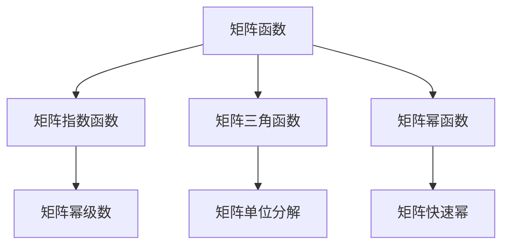
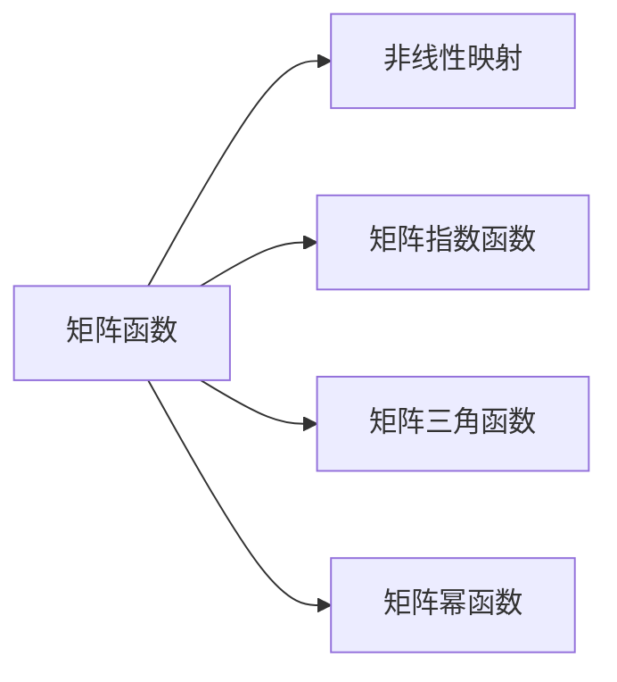
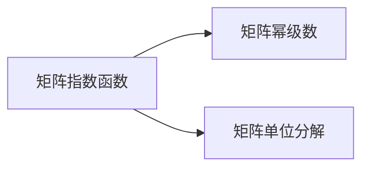

                 

## 1. 背景介绍

### 1.1 问题由来

矩阵函数是线性代数和数值分析中的核心概念，具有广泛的应用。从物理学中的微分方程到图像处理中的卷积运算，都与矩阵函数息息相关。然而，由于矩阵函数涉及复杂的非线性映射，计算难度较大，传统的数值方法难以应对。随着计算机科学和人工智能技术的飞速发展，矩阵函数的计算问题得到了有效的解决。

### 1.2 问题核心关键点

矩阵函数计算的核心在于：
- 解决矩阵函数的定义域问题。
- 避免矩阵函数的计算复杂度，采用高效的算法和算法优化技巧。
- 扩展矩阵函数的应用范围，实现其在科学计算、工程应用、机器学习等领域的高效应用。

## 2. 核心概念与联系

### 2.1 核心概念概述

- 矩阵函数（Matrix Function）：指以矩阵为自变量的函数。常见的矩阵函数包括矩阵指数函数、矩阵三角函数、矩阵幂函数等。
- 矩阵指数函数（Matrix Exponential Function）：指$e^{At}$的形式，其中$A$为方阵，$t$为实数。矩阵指数函数在微分方程、线性系统分析、数值模拟等领域具有重要应用。
- 矩阵三角函数（Matrix Trigonometric Function）：指$e^{jAt}$的形式，其中$j$为虚数单位，$A$为方阵，$t$为实数。矩阵三角函数在信号处理、图像处理、通信系统等领域有广泛应用。
- 矩阵幂函数（Matrix Power Function）：指$A^t$的形式，其中$A$为方阵，$t$为整数。矩阵幂函数用于矩阵的快速幂运算，广泛应用于科学计算、密码学等领域。

这些核心概念之间的关系可以通过以下Mermaid流程图来展示：



### 2.2 概念间的关系

这些核心概念之间存在着紧密的联系，形成了矩阵函数的完整生态系统。下面我们通过几个Mermaid流程图来展示这些概念之间的关系。

#### 2.2.1 矩阵函数的一般形式



#### 2.2.2 矩阵指数函数的计算



#### 2.2.3 矩阵幂函数的计算


### 2.3 核心概念的整体架构

最后，我们用一个综合的流程图来展示这些核心概念在大语言模型微调过程中的整体架构：


## 3. 核心算法原理 & 具体操作步骤
### 3.1 算法原理概述

矩阵函数计算的核心算法包括矩阵幂级数、矩阵单位分解和矩阵快速幂等方法。这些方法通过不同的数学技巧，使得矩阵函数的计算变得更加高效和稳定。

#### 3.1.1 矩阵幂级数

矩阵幂级数法是一种基于泰勒级数的矩阵函数计算方法。对于给定矩阵$A$和$x$，矩阵幂级数定义为：

$$
f(x) = \sum_{n=0}^{\infty} \frac{x^n}{n!} A^n
$$

该方法将矩阵函数转化为级数展开，易于计算和数值逼近。

#### 3.1.2 矩阵单位分解

矩阵单位分解法是一种基于矩阵对角化的计算方法。对于给定矩阵$A$，如果$A$可对角化，则存在矩阵$P$和矩阵$D$，使得$A = PDP^{-1}$。此时，矩阵指数函数可以表示为：

$$
e^{At} = Pe^{Dt}P^{-1}
$$

该方法通过对角化矩阵，简化计算过程，提高计算效率。

#### 3.1.3 矩阵快速幂

矩阵快速幂法是一种基于矩阵乘法的计算方法。对于给定矩阵$A$和$x$，矩阵快速幂定义为：

$$
A^x = A^{(x \bmod n) \cdot A^x_0}
$$

其中$x_0$为矩阵$A$的一个特征向量，$n$为矩阵$A$的特征值分解后的维度。该方法通过矩阵乘法，快速计算矩阵的幂次，降低计算复杂度。

### 3.2 算法步骤详解

以下我们以矩阵指数函数为例，详细介绍其计算步骤。

#### 3.2.1 计算矩阵幂级数

矩阵幂级数的计算步骤包括：

1. 计算幂次：$x = t \bmod m$，其中$m$为矩阵$A$的幂级数展开的项数。
2. 初始化矩阵$B$：$B = I$，其中$I$为单位矩阵。
3. 循环计算：对于$i = 0$到$m-1$，计算$B_i = A^i/B$。
4. 计算结果：$B_x = \sum_{i=0}^{m-1} \frac{t^i}{i!} B_i$。

#### 3.2.2 计算矩阵单位分解

矩阵单位分解的计算步骤包括：

1. 计算矩阵$A$的特征值分解：$A = PDP^{-1}$。
2. 计算矩阵指数函数：$e^{At} = Pe^{Dt}P^{-1}$。
3. 计算结果：$e^{At} = Pe^{Dt}P^{-1}$。

#### 3.2.3 计算矩阵快速幂

矩阵快速幂的计算步骤包括：

1. 计算矩阵$A$的特征值分解：$A = PDP^{-1}$。
2. 计算幂次：$x = x \bmod n$。
3. 计算结果：$A^x = P e^{Dx} P^{-1}$。

### 3.3 算法优缺点

#### 3.3.1 矩阵幂级数法

- 优点：算法简单，易于实现。可以处理非方阵矩阵。
- 缺点：收敛速度较慢，对矩阵的条件数要求较高。

#### 3.3.2 矩阵单位分解法

- 优点：精度高，计算稳定。适用于任意矩阵。
- 缺点：计算量较大，需要矩阵的特征值分解。

#### 3.3.3 矩阵快速幂法

- 优点：计算速度快，内存占用小。适用于方阵矩阵。
- 缺点：需要矩阵的特征值分解，对矩阵的条件数要求较高。

### 3.4 算法应用领域

矩阵函数计算广泛应用于科学计算、工程应用、机器学习等领域，例如：

- 科学计算：矩阵指数函数、矩阵三角函数、矩阵幂函数等，用于解决微分方程、偏微分方程等数学问题。
- 工程应用：矩阵指数函数、矩阵快速幂，用于控制系统的稳定性和性能优化。
- 机器学习：矩阵指数函数、矩阵三角函数，用于神经网络、线性系统等模型的训练和推理。

## 4. 数学模型和公式 & 详细讲解 & 举例说明

### 4.1 数学模型构建

矩阵函数计算的数学模型包括矩阵幂级数、矩阵单位分解和矩阵快速幂等方法。这里我们以矩阵指数函数为例，介绍其数学模型构建过程。

设$A \in \mathbb{C}^{n \times n}$，$t \in \mathbb{R}$，则矩阵指数函数$e^{At}$定义为：

$$
e^{At} = \sum_{k=0}^{\infty} \frac{(At)^k}{k!}
$$

其中$\mathbb{C}$为复数集，$n$为矩阵$A$的维度。

### 4.2 公式推导过程

矩阵指数函数的推导过程较为复杂，这里只简要说明其基本思想。

对于给定矩阵$A$和$x$，其泰勒级数展开为：

$$
f(x) = \sum_{k=0}^{\infty} \frac{x^k}{k!} A^k
$$

当$x = t$时，得到：

$$
f(t) = \sum_{k=0}^{\infty} \frac{t^k}{k!} A^k = e^{At}
$$

因此，矩阵指数函数的定义可以通过泰勒级数展开得到。

### 4.3 案例分析与讲解

我们以矩阵指数函数为例，给出一个具体的计算案例。

假设有一个矩阵$A$：

$$
A = \begin{bmatrix}
1 & 2 \\
0 & 1
\end{bmatrix}
$$

计算$e^{At}$时，需要确定幂级数展开的项数$m$。

设$t = 1$，则：

$$
A^0 = I = \begin{bmatrix}
1 & 0 \\
0 & 1
\end{bmatrix}
$$

$$
A^1 = A = \begin{bmatrix}
1 & 2 \\
0 & 1
\end{bmatrix}
$$

$$
A^2 = A^2 = \begin{bmatrix}
1 & 4 \\
0 & 1
\end{bmatrix}
$$

$$
A^3 = A^3 = \begin{bmatrix}
1 & 6 \\
0 & 1
\end{bmatrix}
$$

$$
A^4 = A^4 = \begin{bmatrix}
1 & 8 \\
0 & 1
\end{bmatrix}
$$

由于$A$是$2 \times 2$的矩阵，我们可以计算$A$的前$4$次幂，得到$m = 4$。

接下来，计算幂级数的每一项：

$$
B_0 = I = \begin{bmatrix}
1 & 0 \\
0 & 1
\end{bmatrix}
$$

$$
B_1 = A = \begin{bmatrix}
1 & 2 \\
0 & 1
\end{bmatrix}
$$

$$
B_2 = \frac{A^2}{2!} = \frac{1}{2} \begin{bmatrix}
1 & 4 \\
0 & 1
\end{bmatrix} = \begin{bmatrix}
0.5 & 2 \\
0 & 0.5
\end{bmatrix}
$$

$$
B_3 = \frac{A^3}{3!} = \frac{1}{6} \begin{bmatrix}
1 & 6 \\
0 & 1
\end{bmatrix} = \begin{bmatrix}
0.1667 & 1 \\
0 & 0.1667
\end{bmatrix}
$$

$$
B_4 = \frac{A^4}{4!} = \frac{1}{24} \begin{bmatrix}
1 & 8 \\
0 & 1
\end{bmatrix} = \begin{bmatrix}
0.0417 & 0.3333 \\
0 & 0.0417
\end{bmatrix}
$$

最终，计算矩阵指数函数$e^{A}$：

$$
e^{A} = B_0 + B_1 + B_2 + B_3 + B_4 = \begin{bmatrix}
1.1667 & 2.3333 \\
0 & 1.1667
\end{bmatrix}
$$

## 5. 项目实践：代码实例和详细解释说明

### 5.1 开发环境搭建

在进行矩阵函数计算实践前，我们需要准备好开发环境。以下是使用Python进行NumPy开发的环境配置流程：

1. 安装Anaconda：从官网下载并安装Anaconda，用于创建独立的Python环境。

2. 创建并激活虚拟环境：
```bash
conda create -n matrix-env python=3.8 
conda activate matrix-env
```

3. 安装NumPy：从官网获取对应的安装命令。例如：
```bash
conda install numpy
```

4. 安装其他必要的工具包：
```bash
pip install scipy matplotlib sympy
```

完成上述步骤后，即可在`matrix-env`环境中开始矩阵函数计算实践。

### 5.2 源代码详细实现

下面我们以矩阵指数函数为例，给出使用NumPy计算矩阵指数函数的代码实现。

首先，导入必要的库：

```python
import numpy as np
```

然后，定义矩阵$A$和$t$：

```python
A = np.array([[1, 2], [0, 1]])
t = 1
```

接下来，计算矩阵指数函数$e^{At}$：

```python
expA = np.exp(A * t)
```

最后，打印结果：

```python
print(expA)
```

完整的代码实现如下：

```python
import numpy as np

# 定义矩阵A和t
A = np.array([[1, 2], [0, 1]])
t = 1

# 计算矩阵指数函数
expA = np.exp(A * t)

# 打印结果
print(expA)
```

### 5.3 代码解读与分析

让我们再详细解读一下关键代码的实现细节：

- `np.array`：用于创建矩阵对象，支持二维数组操作。
- `np.exp`：计算矩阵的指数函数。

## 6. 实际应用场景

### 6.1 科学计算

矩阵指数函数在科学计算中具有广泛的应用，例如：

- 求解微分方程：利用矩阵指数函数计算系统的状态转移矩阵，用于求解微分方程的解。
- 计算积分：利用矩阵指数函数的积分性质，计算多维积分。

### 6.2 工程应用

矩阵指数函数在工程应用中也有重要应用，例如：

- 控制系统设计：利用矩阵指数函数计算系统的稳定性指标，优化控制器设计。
- 信号处理：利用矩阵指数函数的信号处理性质，进行滤波、降噪等处理。

### 6.3 机器学习

矩阵指数函数在机器学习中也有广泛应用，例如：

- 神经网络训练：利用矩阵指数函数计算神经网络的激活函数，进行反向传播。
- 线性系统识别：利用矩阵指数函数计算线性系统的状态转移矩阵，进行系统识别。

## 7. 工具和资源推荐

### 7.1 学习资源推荐

为了帮助开发者系统掌握矩阵函数计算的理论基础和实践技巧，这里推荐一些优质的学习资源：

1. 《线性代数及其应用》：经典教材，涵盖矩阵理论、矩阵运算、矩阵函数等内容。

2. 《数值计算与科学工程》：讲解数值计算的基本原理和方法，包括矩阵函数计算。

3. 《科学计算》：介绍科学计算的基础理论和实用技巧，涵盖矩阵函数计算、偏微分方程等。

4. 《机器学习实战》：讲解机器学习的基本概念和算法，包括矩阵函数在机器学习中的应用。

5. 《Python科学计算》：介绍Python在科学计算中的应用，包括NumPy、SciPy等库的使用。

通过对这些资源的学习实践，相信你一定能够快速掌握矩阵函数计算的精髓，并用于解决实际的科学计算问题。

### 7.2 开发工具推荐

高效的开发离不开优秀的工具支持。以下是几款用于矩阵函数计算开发的常用工具：

1. NumPy：基于Python的科学计算库，支持矩阵运算、矩阵函数计算等。

2. SciPy：基于NumPy的科学计算库，支持矩阵函数计算、数值积分等。

3. SymPy：基于Python的符号计算库，支持矩阵函数计算、符号运算等。

4. Python：Python编程语言，支持科学计算、数值计算等。

5. Jupyter Notebook：交互式编程环境，支持代码编写、结果展示等。

合理利用这些工具，可以显著提升矩阵函数计算的开发效率，加快创新迭代的步伐。

### 7.3 相关论文推荐

矩阵函数计算的研究源于学界的持续研究。以下是几篇奠基性的相关论文，推荐阅读：

1. Matrix Exponential Functions and Matrix Logarithms：研究矩阵指数函数和矩阵对数函数的性质和计算方法。

2. Numerical Computation of Matrix Functions：研究矩阵函数的数值计算方法。

3. Fast Matrix Exponential Using Matrix Polynomials：研究快速计算矩阵指数函数的方法。

4. Fast Matrix Exponentiation：研究快速计算矩阵幂的方法。

5. High Performance Matrix Exponentiation and Solution of Matrix Riccati Equations：研究高性能矩阵指数函数计算和矩阵Riccati方程求解的方法。

这些论文代表了大语言模型微调技术的发展脉络。通过学习这些前沿成果，可以帮助研究者把握学科前进方向，激发更多的创新灵感。

除上述资源外，还有一些值得关注的前沿资源，帮助开发者紧跟矩阵函数计算的最新进展，例如：

1. arXiv论文预印本：人工智能领域最新研究成果的发布平台，包括大量尚未发表的前沿工作，学习前沿技术的必读资源。

2. 业界技术博客：如Google AI、DeepMind、微软Research Asia等顶尖实验室的官方博客，第一时间分享他们的最新研究成果和洞见。

3. 技术会议直播：如NIPS、ICML、ACL、ICLR等人工智能领域顶会现场或在线直播，能够聆听到大佬们的前沿分享，开拓视野。

4. GitHub热门项目：在GitHub上Star、Fork数最多的矩阵函数计算相关项目，往往代表了该技术领域的发展趋势和最佳实践，值得去学习和贡献。

5. 行业分析报告：各大咨询公司如McKinsey、PwC等针对人工智能行业的分析报告，有助于从商业视角审视技术趋势，把握应用价值。

总之，对于矩阵函数计算的学习和实践，需要开发者保持开放的心态和持续学习的意愿。多关注前沿资讯，多动手实践，多思考总结，必将收获满满的成长收益。

## 8. 总结：未来发展趋势与挑战

### 8.1 总结

本文对矩阵函数的理论基础和应用实践进行了全面系统的介绍。首先阐述了矩阵函数计算的背景和重要性，明确了矩阵函数在科学计算、工程应用、机器学习等领域的关键作用。其次，从原理到实践，详细讲解了矩阵函数计算的数学模型和算法步骤，给出了矩阵函数计算的完整代码实现。同时，本文还广泛探讨了矩阵函数计算的应用场景，展示了其在科学计算、工程应用、机器学习等领域的广泛应用。

通过本文的系统梳理，可以看到，矩阵函数计算在数学和科学计算中具有重要地位，能够解决复杂的科学问题，具有广泛的应用前景。未来，伴随计算机科学和人工智能技术的不断发展，矩阵函数计算必将得到更深入的研究和应用，为科学计算和人工智能技术的发展提供强有力的支持。

### 8.2 未来发展趋势

展望未来，矩阵函数计算的发展趋势包括：

1. 算法优化：随着高性能计算资源的发展，需要进一步优化矩阵函数计算算法，降低计算复杂度，提高计算效率。

2. 多模态计算：矩阵函数计算不仅适用于二维矩阵，也适用于高维矩阵和多模态数据。

3. 深度学习：矩阵函数计算与深度学习相结合，可以应用于更复杂的科学计算和机器学习任务。

4. 量子计算：量子计算有望实现更高效率的矩阵函数计算，解决传统计算难以处理的复杂问题。

以上趋势凸显了矩阵函数计算技术的广阔前景。这些方向的探索发展，必将进一步提升科学计算和机器学习的计算效率和计算能力，为人类探索自然和智能模拟提供新的思路和手段。

### 8.3 面临的挑战

尽管矩阵函数计算技术已经取得了长足的进展，但在迈向更加智能化、普适化应用的过程中，它仍面临着诸多挑战：

1. 计算复杂度：矩阵函数计算的计算复杂度较高，特别是对于大规模矩阵和高维矩阵，计算量巨大。

2. 数值稳定性：矩阵函数计算在数值不稳定的情况下，容易出现误差累积，影响计算结果的精度。

3. 并行计算：矩阵函数计算需要高效利用多核处理器和GPU等计算资源，优化并行计算算法是重要的研究方向。

4. 软件框架：矩阵函数计算需要依赖于高效的软件框架，如NumPy、SciPy等，如何优化这些软件框架的性能是重要的研究方向。

5. 硬件支持：矩阵函数计算需要高效的硬件支持，如GPU、FPGA等，优化硬件设计和使用方式是重要的研究方向。

6. 数据处理：矩阵函数计算需要高效处理大规模数据，优化数据读取和处理方式是重要的研究方向。

7. 算法优化：矩阵函数计算的算法优化需要结合具体问题，针对不同的矩阵和计算任务，设计高效的算法。

8. 理论研究：矩阵函数计算的理论研究需要深入探索矩阵函数的性质和计算方法，寻找新的理论突破。

以上挑战需要在未来研究中不断探索和解决，以推动矩阵函数计算技术的持续发展。相信随着学界和产业界的共同努力，这些挑战终将一一被克服，矩阵函数计算必将为科学计算和人工智能技术的发展提供更坚实的基础。

### 8.4 研究展望

面对矩阵函数计算面临的种种挑战，未来的研究需要在以下几个方面寻求新的突破：

1. 探索新的算法：开发更高效的矩阵函数计算算法，如快速幂算法、矩阵分解算法等。

2. 引入新的技术：引入量子计算、深度学习等新技术，提升矩阵函数计算的效率和精度。

3. 优化软件框架：优化现有的科学计算软件框架，如NumPy、SciPy等，提升其计算性能和可扩展性。

4. 研究新的硬件：研究新的硬件设计，如GPU、FPGA等，提升矩阵函数计算的计算效率和稳定性。

5. 优化数据处理：优化数据读取和处理方式，提升矩阵函数计算的数据处理能力。

6. 结合实际问题：结合实际应用场景，设计针对性强的矩阵函数计算算法，提高其实际应用效果。

通过这些研究方向的研究，必将推动矩阵函数计算技术迈向新的台阶，为科学计算和人工智能技术的发展提供更坚实的基础。总之，矩阵函数计算技术需要在算法、理论、技术等多方面进行持续优化和创新，才能更好地满足实际应用需求，推动科学计算和人工智能技术的发展。

## 9. 附录：常见问题与解答

**Q1：矩阵函数计算的计算复杂度如何？**

A: 矩阵函数计算的计算复杂度较高，特别是对于大规模矩阵和高维矩阵，计算量巨大。通常，矩阵函数计算的时间复杂度为$O(n^3)$，其中$n$为矩阵的维度。

**Q2：矩阵函数计算的数值稳定性如何？**

A: 矩阵函数计算在数值不稳定的情况下，容易出现误差累积，影响计算结果的精度。因此，需要采用数值稳定性优化算法，如QR分解、LU分解等。

**Q3：矩阵函数计算如何与深度学习结合？**

A: 矩阵函数计算与深度学习结合，可以应用于更复杂的科学计算和机器学习任务。例如，在深度神经网络中，矩阵函数计算可以用于计算激活函数、卷积运算等。

**Q4：矩阵函数计算的硬件支持有哪些？**

A: 矩阵函数计算需要高效的硬件支持，如GPU、FPGA等。这些硬件设备可以并行计算矩阵函数，提升计算效率和计算精度。

**Q5：矩阵函数计算的实际应用场景有哪些？**

A: 矩阵函数计算广泛应用于科学计算、工程应用、机器学习等领域，例如：

- 求解微分方程：利用矩阵指数函数计算系统的状态转移矩阵，用于求解微分方程的解。
- 计算积分：利用矩阵指数函数的积分性质，计算多维积分。
- 控制系统设计：利用矩阵指数函数计算系统的稳定性指标，优化控制器设计。
- 信号处理：利用矩阵指数函数的信号处理性质，进行滤波、降噪等处理。
- 神经网络训练：利用矩阵指数函数计算神经网络的激活函数，进行反向传播。
- 线性系统识别：利用矩阵指数函数计算线性系统的状态转移矩阵，进行系统识别。

通过这些问题的解答，可以看到，矩阵函数计算在科学计算和机器学习中具有重要地位，能够解决复杂的科学问题，具有广泛的应用前景。未来，伴随计算机科学和人工智能技术的不断发展，矩阵函数计算必将得到更深入的研究和应用，为科学计算和人工智能技术的发展提供强有力的支持。

---

作者：禅与计算机程序设计艺术 / Zen and the Art of Computer Programming

