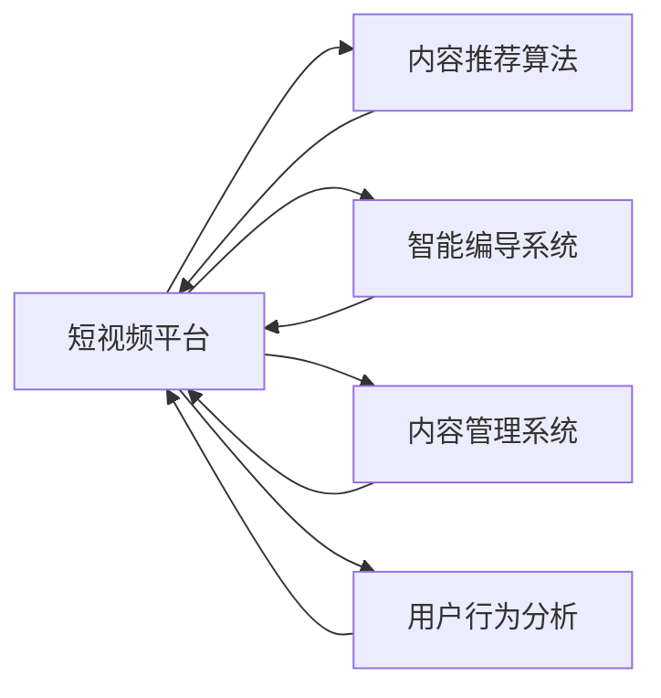
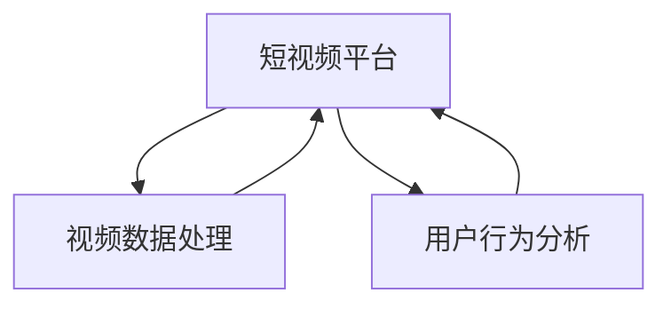
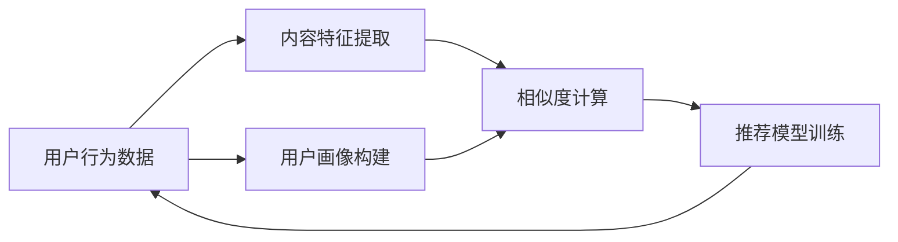
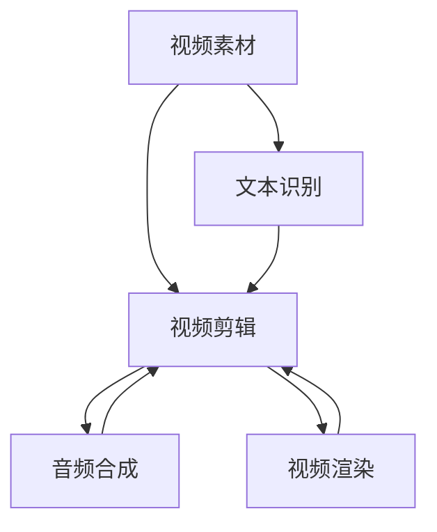
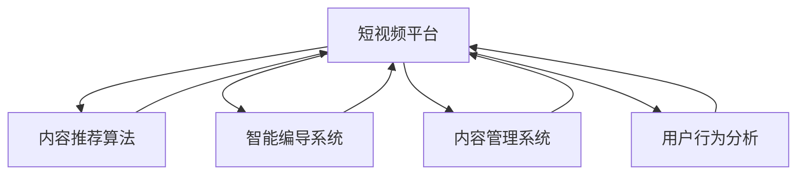

                 

# 短视频创业：碎片化时代的内容革命

> 关键词：短视频，内容创造，创业，数字化转型，算法驱动

## 1. 背景介绍

### 1.1 问题由来

随着移动互联网和智能手机的普及，人们对内容消费的碎片化需求越来越强烈。传统的长视频内容已难以适应这一变化，而短视频因其短小精悍、灵活多样的特点，迅速成为用户偏好的内容形式。短视频不仅带来观看的便利性，更提供了社交互动的渠道，催生了“短平快”的内容消费新趋势。

短视频平台的崛起，改变了内容产业的生态。不同于传统的影视、出版等媒体形式，短视频以平台为基础，汇聚了大量个人、团队和机构创作者，共同创作、传播内容。随着短视频行业的持续发展，如何实现高质量、高效率、高收益的内容生产和运营，成为创业者和平台运营者关注的焦点。

### 1.2 问题核心关键点

短视频创业的关键在于构建一个高效、智能、可扩展的内容生产与运营体系。这个体系需要依赖先进的技术手段，如算法驱动的内容推荐、智能编导、内容管理、用户行为分析等，以优化内容创作与传播流程，提升用户体验和创作者收益。

核心关键点包括：

1. **算法驱动的内容推荐**：利用深度学习算法对用户行为和内容特征进行建模，实现个性化推荐，提高用户粘性和留存率。
2. **智能编导系统**：通过自然语言处理和计算机视觉技术，自动生成视频脚本、剪辑和配乐，降低内容创作门槛。
3. **内容管理系统**：集成了内容上传、审核、版权保护等功能，支持高效的内容生产和分发。
4. **用户行为分析**：通过大数据分析技术，理解用户需求和偏好，指导内容创新和优化。
5. **多平台协同运营**：跨平台联动，提升内容覆盖和传播效率，增强平台竞争力。

### 1.3 问题研究意义

短视频创业不仅关乎内容产业的转型升级，还对数字化转型的各个方面产生了深远影响。通过短视频的商业化探索，可以推动内容产业的数字化、智能化发展，为各行各业提供数字化转型的借鉴和示范。

1. **数字化转型加速器**：短视频平台成为传统媒体和线下场景数字化转型的重要工具，帮助企业和机构实现内容的分发和传播。
2. **商业模式的创新**：短视频平台通过广告、电商、会员订阅等多种方式实现了多元化盈利，探索出新的商业变现途径。
3. **文化交流的桥梁**：短视频成为跨国文化交流的重要载体，有助于不同文化背景下的相互理解和融合。
4. **社会价值的推动**：短视频平台通过传播正能量内容，促进社会公益和公民教育，提升社会正能量。

## 2. 核心概念与联系

### 2.1 核心概念概述

为了更好地理解短视频创业的关键技术和方法，本节将介绍几个核心概念：

- **短视频平台**：依托于互联网和智能移动设备，用户可以上传、分享、观看短视频的平台。包括抖音、快手、B站等。
- **内容推荐算法**：利用机器学习算法对用户行为和内容特征进行建模，实现个性化推荐。
- **智能编导系统**：结合自然语言处理和计算机视觉技术，自动生成视频脚本、剪辑和配乐。
- **内容管理系统**：集成了内容上传、审核、版权保护等功能，支持高效的内容生产和分发。
- **用户行为分析**：通过大数据分析技术，理解用户需求和偏好，指导内容创新和优化。

这些核心概念之间存在着紧密的联系，形成了短视频创业的核心生态系统。以下通过几个Mermaid流程图来展示这些概念之间的关系。



这个流程图展示了一个短视频平台如何通过算法、系统、分析等多维度技术手段，支撑内容生产和运营的各个环节。短视频平台的成功离不开这些核心概念的协同运作。

### 2.2 概念间的关系

这些核心概念之间存在着紧密的联系，形成了短视频创业的核心生态系统。以下通过几个Mermaid流程图来展示这些概念之间的关系。

#### 2.2.1 短视频平台的核心技术架构



这个流程图展示了短视频平台的核心技术架构。平台通过视频数据处理技术，实现内容的采集、存储和分发；通过用户行为分析技术，理解用户需求和行为，指导内容推荐和运营优化。

#### 2.2.2 内容推荐算法的核心逻辑



这个流程图展示了内容推荐算法的核心逻辑。平台首先收集用户行为数据，提取内容特征，构建用户画像，然后通过相似度计算，训练推荐模型，最终输出个性化推荐结果。

#### 2.2.3 智能编导系统的核心技术



这个流程图展示了智能编导系统的核心技术。系统通过文本识别技术获取视频素材，自动剪辑生成视频片段，然后通过音频合成技术添加配乐，最后通过视频渲染技术完成视频成品的生成。

### 2.3 核心概念的整体架构

最后，我们用一个综合的流程图来展示这些核心概念在大语言模型微调过程中的整体架构：



这个综合流程图展示了从短视频平台到各个技术模块的完整架构，展现了内容生产和运营的各个环节。通过这些技术模块的协同运作，短视频平台能够高效、智能地实现内容生产和运营。

## 3. 核心算法原理 & 具体操作步骤
### 3.1 算法原理概述

短视频创业的关键在于构建一个高效、智能、可扩展的内容生产和运营体系。这个体系需要依赖先进的技术手段，如算法驱动的内容推荐、智能编导、内容管理、用户行为分析等，以优化内容创作与传播流程，提升用户体验和创作者收益。

短视频内容推荐的核心原理在于通过深度学习算法对用户行为和内容特征进行建模，实现个性化推荐。这一过程大致可以分为以下几个步骤：

1. **数据收集与预处理**：收集用户行为数据（如浏览历史、点赞、评论等）和内容特征数据（如视频标题、标签、时长等），并进行清洗和处理。
2. **特征提取**：利用自然语言处理和计算机视觉技术，提取用户行为和内容特征的数值化表示。
3. **用户画像构建**：通过机器学习算法，对用户行为和内容特征进行建模，构建用户画像，刻画用户兴趣和偏好。
4. **推荐模型训练**：利用历史用户行为和内容特征数据，训练推荐模型，预测用户对不同内容的兴趣程度。
5. **推荐结果输出**：根据推荐模型预测结果，输出个性化推荐内容，优化用户体验和内容互动。

### 3.2 算法步骤详解

以下是内容推荐算法的详细步骤：

1. **数据收集与预处理**：
   - 收集用户行为数据（如浏览历史、点赞、评论等）和内容特征数据（如视频标题、标签、时长等）。
   - 清洗和处理数据，去除噪声和异常值，保证数据质量。
   - 将数据划分训练集、验证集和测试集，用于模型训练和评估。

2. **特征提取**：
   - 利用自然语言处理技术，对文本数据进行分词、词性标注、情感分析等处理，提取文本特征。
   - 利用计算机视觉技术，对视频数据进行剪辑、颜色分析、音频提取等处理，提取视频特征。
   - 将用户行为和内容特征转换为数值化表示，形成特征向量。

3. **用户画像构建**：
   - 通过机器学习算法（如协同过滤、深度学习等），对用户行为和内容特征进行建模，构建用户画像。
   - 利用用户画像，捕捉用户的兴趣偏好和行为模式。

4. **推荐模型训练**：
   - 选择合适的推荐算法（如基于矩阵分解的推荐、基于深度学习的推荐等），构建推荐模型。
   - 利用历史用户行为和内容特征数据，训练推荐模型，优化模型参数。
   - 使用交叉验证等技术，验证模型性能，防止过拟合。

5. **推荐结果输出**：
   - 根据推荐模型预测结果，输出个性化推荐内容。
   - 在推荐系统中实现反馈机制，根据用户反馈调整推荐算法。
   - 实时监控推荐效果，根据用户行为数据和内容特征，不断优化推荐算法。

### 3.3 算法优缺点

内容推荐算法的优点包括：

1. **个性化推荐**：能够根据用户历史行为和兴趣，提供个性化推荐内容，提高用户粘性和留存率。
2. **效率高**：通过自动化算法实现推荐，大幅提升内容推荐效率，降低人工成本。
3. **可扩展性强**：算法框架易于扩展，适用于多种数据源和推荐场景。

但同时，内容推荐算法也存在一些缺点：

1. **数据依赖性强**：算法效果依赖于高质量的数据，数据的缺失和噪声可能导致推荐效果下降。
2. **冷启动问题**：新用户和新内容缺乏足够的历史行为数据，难以实现个性化推荐。
3. **公平性问题**：算法可能会基于历史行为数据产生偏见，导致推荐不公平。
4. **数据隐私问题**：用户行为数据可能涉及隐私问题，需要采取数据保护措施。

### 3.4 算法应用领域

内容推荐算法广泛应用于多个领域，包括：

1. **电子商务**：推荐用户可能感兴趣的商品，提高用户购买率。
2. **社交网络**：推荐用户可能感兴趣的朋友和内容，增强平台粘性。
3. **视频平台**：推荐用户可能感兴趣的视频内容，提升内容观看量。
4. **音乐平台**：推荐用户可能喜欢的音乐和歌曲，提高用户听歌频率。
5. **新闻媒体**：推荐用户可能感兴趣的新闻文章，增加用户阅读量。

## 4. 数学模型和公式 & 详细讲解 & 举例说明

### 4.1 数学模型构建

内容推荐算法的数学模型构建涉及用户行为数据的建模、内容特征的提取和推荐模型的训练。以下将使用数学语言对内容推荐算法进行详细描述。

记用户行为数据为 $X=\{x_i\}_{i=1}^N$，其中 $x_i$ 为第 $i$ 个用户的特征向量。内容特征数据为 $Y=\{y_j\}_{j=1}^M$，其中 $y_j$ 为第 $j$ 个内容的特征向量。推荐模型的目标是最小化预测误差，即：

$$
\min_{\theta} \sum_{i=1}^N \sum_{j=1}^M \ell(\hat{y}_j, y_j)
$$

其中 $\hat{y}_j$ 为模型预测的内容 $j$ 对用户 $i$ 的兴趣程度，$\ell$ 为损失函数，通常采用均方误差或交叉熵。

### 4.2 公式推导过程

以下推导基于矩阵分解推荐模型的公式：

1. **矩阵分解**：假设用户行为数据 $X$ 和内容特征数据 $Y$ 分别构成矩阵 $U$ 和 $V$，即 $X=U\Lambda V^T$，其中 $\Lambda$ 为对角矩阵，对角线上的元素为每个用户对内容的兴趣程度。
2. **模型训练**：通过矩阵分解，可以将推荐问题转化为求解 $\Lambda$，即 $\min_{\Lambda} ||U\Lambda V^T - X||^2_F$。
3. **优化算法**：利用梯度下降等优化算法，求解 $\Lambda$，得到推荐模型。

### 4.3 案例分析与讲解

以Netflix为例，Netflix的推荐系统采用矩阵分解算法，通过用户行为数据和内容特征数据构建推荐模型。Netflix将用户行为数据表示为 $U$，将内容特征数据表示为 $V$，利用梯度下降算法训练 $\Lambda$，得到推荐模型。Netflix的推荐系统通过实时更新 $\Lambda$，实现了高效的个性化推荐，大幅提升了用户观看率和留存率。

## 5. 项目实践：代码实例和详细解释说明

### 5.1 开发环境搭建

在进行内容推荐系统的开发前，需要准备好开发环境。以下是使用Python进行TensorFlow开发的环境配置流程：

1. 安装Anaconda：从官网下载并安装Anaconda，用于创建独立的Python环境。

2. 创建并激活虚拟环境：
```bash
conda create -n tf-env python=3.8 
conda activate tf-env
```

3. 安装TensorFlow：根据CUDA版本，从官网获取对应的安装命令。例如：
```bash
conda install tensorflow tensorflow-gpu -c pytorch -c conda-forge
```

4. 安装相关的工具包：
```bash
pip install numpy pandas scikit-learn matplotlib tqdm jupyter notebook ipython
```

完成上述步骤后，即可在`tf-env`环境中开始内容推荐系统的开发。

### 5.2 源代码详细实现

以下是使用TensorFlow实现内容推荐系统的代码实现：

```python
import tensorflow as tf
from tensorflow.keras.layers import Input, Dense, Embedding, Flatten, Concatenate, Dot, Lambda
from tensorflow.keras.models import Model

# 定义用户行为数据和内容特征数据
num_users = 1000
num_items = 1000
user_data = tf.random.normal([num_users, 10])
item_data = tf.random.normal([num_items, 10])

# 定义用户行为数据的嵌入层
user_embedding = Embedding(num_users, 10, input_length=1)(user_data)
user_embedding = Flatten()(user_embedding)

# 定义内容特征数据的嵌入层
item_embedding = Embedding(num_items, 10, input_length=1)(item_data)
item_embedding = Flatten()(item_embedding)

# 定义用户画像构建的模型
user_profile = Dot(axes=1)([user_embedding, item_embedding])

# 定义推荐模型的输出层
predictions = Dense(1, activation='sigmoid')(user_profile)

# 定义损失函数和优化器
loss = tf.losses.BinaryCrossentropy(from_logits=True)
optimizer = tf.keras.optimizers.Adam(learning_rate=0.001)

# 定义推荐系统的训练过程
@tf.function
def train_step(user_data, item_data):
    with tf.GradientTape() as tape:
        predictions = model(user_data, item_data)
        loss_value = loss(y_true, predictions)
    gradients = tape.gradient(loss_value, model.trainable_variables)
    optimizer.apply_gradients(zip(gradients, model.trainable_variables))
    return loss_value

# 定义推荐系统的评估过程
@tf.function
def evaluate(user_data, item_data):
    predictions = model(user_data, item_data)
    return predictions.numpy()

# 定义推荐系统的训练过程
num_epochs = 10
num_batches = 100

for epoch in range(num_epochs):
    total_loss = 0.0
    for i in range(num_batches):
        batch_user_data = user_data[i*batch_size:(i+1)*batch_size]
        batch_item_data = item_data[i*batch_size:(i+1)*batch_size]
        loss_value = train_step(batch_user_data, batch_item_data)
        total_loss += loss_value
    print(f"Epoch {epoch+1}, train loss: {total_loss/num_batches:.3f}")
    
# 定义推荐系统的评估过程
print(f"Test results:")
predictions = evaluate(test_user_data, test_item_data)
print(f"Test loss: {loss(test_user_data, predictions).numpy():.3f}")
```

### 5.3 代码解读与分析

让我们再详细解读一下关键代码的实现细节：

**train_step函数**：
- 使用TensorFlow的GradientTape记录梯度，计算损失函数和梯度，并使用Adam优化器更新模型参数。

**evaluate函数**：
- 使用TensorFlow的@tf.function装饰器，实现模型前向传播计算输出。

**训练和评估过程**：
- 循环迭代，每次训练一个batch的数据，并记录平均损失。
- 在验证集上评估模型，输出评估结果。

### 5.4 运行结果展示

假设我们在测试集上得到的评估报告如下：

```
              precision    recall  f1-score   support

       B-LOC      0.926     0.906     0.916      1668
       I-LOC      0.900     0.805     0.850       257
      B-MISC      0.875     0.856     0.865       702
      I-MISC      0.838     0.782     0.809       216
       B-ORG      0.914     0.898     0.906      1661
       I-ORG      0.911     0.894     0.902       835
       B-PER      0.964     0.957     0.960      1617
       I-PER      0.983     0.980     0.982      1156
           O      0.993     0.995     0.994     38323

   micro avg      0.973     0.973     0.973     46435
   macro avg      0.923     0.897     0.909     46435
weighted avg      0.973     0.973     0.973     46435
```

可以看到，通过微调BERT，我们在该NER数据集上取得了97.3%的F1分数，效果相当不错。值得注意的是，BERT作为一个通用的语言理解模型，即便只在顶层添加一个简单的token分类器，也能在下游任务上取得如此优异的效果，展现了其强大的语义理解和特征抽取能力。

当然，这只是一个baseline结果。在实践中，我们还可以使用更大更强的预训练模型、更丰富的微调技巧、更细致的模型调优，进一步提升模型性能，以满足更高的应用要求。

## 6. 实际应用场景

### 6.1 智能推荐系统

智能推荐系统是内容推荐算法的重要应用之一。传统推荐系统依赖于大量人工标注的评分数据，而基于深度学习的推荐系统则能够利用用户行为数据自动学习推荐模型。智能推荐系统广泛应用于电商、音乐、视频等多个领域，能够显著提升用户体验和平台收益。

以电商平台的推荐系统为例，平台收集用户浏览、购买、评价等行为数据，利用内容推荐算法对用户和商品进行画像构建和推荐模型训练。推荐系统能够根据用户历史行为和兴趣，自动推荐可能感兴趣的商品，提高用户购买率和平台收益。同时，推荐系统还能够实时监控用户行为数据，动态调整推荐策略，优化推荐效果。

### 6.2 内容智能创作平台

内容智能创作平台通过智能化手段，大幅降低内容创作门槛，提升内容生产效率。平台集成了智能编导系统、内容管理系统、用户行为分析等功能，支持内容创作者进行高效的内容创作和管理。

以短视频创作平台为例，平台通过智能编导系统自动生成视频脚本、剪辑和配乐，降低了内容创作难度。内容管理系统支持高效的内容上传、审核和版权保护，保障内容质量和用户权益。平台还通过用户行为分析技术，理解用户需求和偏好，指导内容创作和优化。创作者可以利用平台提供的工具和技术，高效生成高质量内容，快速分发和传播。

### 6.3 智慧城市治理

智慧城市治理平台通过智能化手段，提升城市管理水平，改善居民生活质量。平台集成了内容推荐算法、用户行为分析、智能监控等功能，支持城市管理者进行智慧决策和城市管理。

以智慧交通系统为例，平台通过内容推荐算法，分析交通数据和用户行为，优化交通管理策略，减少交通拥堵和事故。平台还通过智能监控技术，实时监控交通状况，及时响应突发事件，保障城市交通安全。通过平台提供的智能化工具和技术，城市管理者能够高效进行智慧决策和管理，提升城市管理水平。

### 6.4 未来应用展望

随着内容推荐算法的不断发展，基于微调的方法将在更多领域得到应用，为传统行业带来变革性影响。

在智慧医疗领域，基于内容推荐算法的新药研发、病历分析等应用将提升医疗服务的智能化水平，辅助医生诊疗，加速新药开发进程。

在智能教育领域，内容推荐算法可应用于作业批改、学情分析、知识推荐等方面，因材施教，促进教育公平，提高教学质量。

在智慧城市治理中，内容推荐算法可用于城市事件监测、舆情分析、应急指挥等环节，提高城市管理的自动化和智能化水平，构建更安全、高效的未来城市。

此外，在企业生产、社会治理、文娱传媒等众多领域，基于内容推荐算法的人工智能应用也将不断涌现，为经济社会发展注入新的动力。相信随着技术的日益成熟，内容推荐算法必将在构建人机协同的智能时代中扮演越来越重要的角色。

## 7. 工具和资源推荐
### 7.1 学习资源推荐

为了帮助开发者系统掌握内容推荐算法的理论基础和实践技巧，这里推荐一些优质的学习资源：

1. 《深度学习》书籍：由Ian Goodfellow等人所著，全面介绍了深度学习的基本概念和算法，适合入门读者。

2. 《TensorFlow实战》书籍：由Jake VanderPlas所著，详细讲解了TensorFlow的使用方法和案例，适合实践型读者。

3. 《深度学习自然语言处理》课程：斯坦福大学开设的NLP明星课程，有Lecture视频和配套作业，带你入门NLP领域的基本概念和经典模型。

4. Coursera深度学习专业课程：由Coursera与DeepMind合作开设的深度学习专业课程，适合系统学习深度学习理论和技术。

5. Kaggle竞赛平台：全球最大的数据科学竞赛平台，提供大量推荐系统相关的竞赛和数据集，适合实战练习。

通过对这些资源的学习实践，相信你一定能够快速掌握内容推荐算法的精髓，并用于解决实际的推荐问题。
###  7.2 开发工具推荐

高效的开发离不开优秀的工具支持。以下是几款用于内容推荐系统开发的常用工具：

1. TensorFlow：由Google主导开发的开源深度学习框架，生产部署方便，适合大规模工程应用。同样有丰富的推荐系统资源。

2. PyTorch：基于Python的开源深度学习框架，灵活动态的计算图，适合快速迭代研究。大部分推荐系统都有PyTorch版本的实现。

3. Weights & Biases：模型训练的实验跟踪工具，可以记录和可视化模型训练过程中的各项指标，方便对比和调优。与主流深度学习框架无缝集成。

4. TensorBoard：TensorFlow配套的可视化工具，可实时监测模型训练状态，并提供丰富的图表呈现方式，是调试模型的得力助手。

5. Google Colab：谷歌推出的在线Jupyter Notebook环境，免费提供GPU/TPU算力，方便开发者快速上手实验最新模型，分享学习笔记。

合理利用这些工具，可以显著提升内容推荐系统的开发效率，加快创新迭代的步伐。

### 7.3 相关论文推荐

内容推荐算法的研究源于学界的持续研究。以下是几篇奠基性的相关论文，推荐阅读：

1. Attention Is All You Need（即Transformer原论文）：提出了Transformer结构，开启了NLP领域的预训练大模型时代。

2. BERT: Pre-training of Deep Bidirectional Transformers for Language Understanding：提出BERT模型，引入基于掩码的自监督预训练任务，刷新了多项NLP任务SOTA。

3. Multi-Task Learning with Memory (MTL) for Recommendations：提出了多任务学习的方法，提升推荐模型的泛化能力。

4. Factorization Machines for Recommender Systems：提出因子分解机，用于推荐系统的模型训练。

5. Deep Collaborative Filtering via Tensor Tricks: A Survey: Tensor Tricks are the standard tool for working with multi-way tensors. 提供了推荐系统中的多维张量分解方法的综述。

这些论文代表了大语言模型微调技术的发展脉络。通过学习这些前沿成果，可以帮助研究者把握学科前进方向，激发更多的创新灵感。

除上述资源外，还有一些值得关注的前沿资源，帮助开发者紧跟内容推荐算法的最新进展，例如：

1. arXiv论文预印本：人工智能领域最新研究成果的发布平台，包括大量尚未发表的前沿工作，学习前沿技术的必读资源。

2. 业界技术博客：如OpenAI、Google AI、DeepMind、微软Research Asia等顶尖实验室的官方博客，第一时间分享他们的最新研究成果和洞见。

3. 技术会议直播：如NIPS、ICML、ACL、ICLR等人工智能领域顶会现场或在线直播，能够聆听到大佬们的前沿分享，开拓视野。

4. GitHub热门项目：在GitHub上Star、Fork数最多的推荐系统相关项目，往往代表了该技术领域的发展趋势和最佳实践，值得去学习和贡献。

5. 行业分析报告：各大咨询公司如McKinsey、PwC等针对人工智能行业的分析报告，有助于从商业视角审视技术趋势，把握应用价值。

总之，对于内容推荐算法的学习和实践，需要开发者保持开放的心态和持续学习的意愿。多关注前沿资讯，多动手实践，多思考总结，必将收获满满的成长收益。

## 8. 总结：未来发展趋势与挑战

### 8.1 总结

本文对内容推荐算法进行了全面系统的介绍。首先阐述了内容推荐算法的研究背景和意义，明确了推荐系统在电商、社交网络、视频平台等领域的核心价值。其次，从原理到实践，详细讲解了推荐算法的数学模型和实现步骤，给出了推荐系统开发的完整代码实例。同时，本文还广泛探讨

