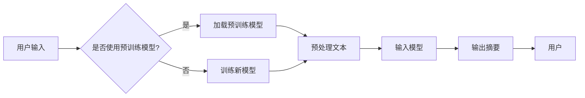

> 关键词：LangChain, 编程，自然语言处理，NLP，文本摘要，信息提取，应用场景，实践指南

# 【LangChain编程：从入门到实践】文本总结场景

LangChain是一个强大的工具，它允许开发者通过自然语言处理（NLP）技术构建智能应用。文本总结场景是LangChain应用的一个典型例子，它能够帮助用户快速从大量文本中提取关键信息。本文将深入探讨LangChain在文本总结场景中的应用，从入门到实践，提供全面的技术指南。

## 1. 背景介绍

### 1.1 问题的由来

随着互联网的快速发展，信息过载成为一个普遍问题。用户每天都要处理大量的文本信息，如新闻、报告、邮件等。如何快速、有效地从这些文本中提取关键信息，成为了一个迫切的需求。传统的信息提取方法往往需要复杂的编程技巧和大量的数据预处理，而LangChain的出现简化了这一过程。

### 1.2 研究现状

目前，NLP技术在文本摘要和信息提取方面取得了显著进展。基于深度学习的模型，如BERT、GPT-3等，能够生成高质量的文本摘要。然而，这些模型往往需要大量的数据和复杂的部署流程。LangChain通过封装这些复杂的模型，提供了一个简单易用的接口，使得开发者可以轻松构建文本摘要应用。

### 1.3 研究意义

LangChain在文本总结场景中的应用具有以下意义：

- **降低开发门槛**：开发者无需深入了解NLP模型，即可快速构建文本摘要应用。
- **提高效率**：自动从大量文本中提取关键信息，节省用户时间。
- **拓展应用场景**：将文本摘要技术应用于各种领域，如新闻摘要、报告摘要、邮件管理等。

### 1.4 本文结构

本文将分为以下章节：

- 核心概念与联系：介绍LangChain的基本概念和架构。
- 核心算法原理 & 具体操作步骤：讲解文本摘要算法的原理和操作步骤。
- 数学模型和公式 & 详细讲解 & 举例说明：介绍文本摘要的数学模型和公式。
- 项目实践：提供LangChain在文本摘要场景中的代码实例。
- 实际应用场景：探讨文本摘要的实际应用场景。
- 工具和资源推荐：推荐学习LangChain和文本摘要的资源。
- 总结：总结研究成果，展望未来发展趋势与挑战。

## 2. 核心概念与联系

### 2.1 LangChain概述

LangChain是一个Python库，它提供了一系列NLP工具，包括文本摘要、情感分析、命名实体识别等。LangChain的核心是将其封装的NLP模型与用户的应用程序连接起来。

### 2.2 Mermaid流程图

以下是一个Mermaid流程图，展示了LangChain在文本摘要场景中的基本架构：



## 3. 核心算法原理 & 具体操作步骤

### 3.1 算法原理概述

文本摘要算法通常采用以下步骤：

1. 预处理：清洗和格式化文本数据。
2. 特征提取：从文本中提取关键信息。
3. 摘要生成：根据提取的特征生成摘要。

### 3.2 算法步骤详解

1. **预处理**：去除无关信息，如HTML标签、特殊符号等。
2. **特征提取**：使用NLP技术提取文本中的关键信息，如关键词、关键句子等。
3. **摘要生成**：使用文本生成模型生成摘要，如GPT-3。

### 3.3 算法优缺点

**优点**：

- 高效：能够快速生成文本摘要。
- 准确：能够提取文本中的关键信息。

**缺点**：

- 对预训练模型的依赖性高。
- 需要大量的训练数据。

### 3.4 算法应用领域

- 新闻摘要
- 报告摘要
- 邮件管理
- 文档索引

## 4. 数学模型和公式 & 详细讲解 & 举例说明

### 4.1 数学模型构建

文本摘要的数学模型通常基于自然语言处理（NLP）中的序列到序列（Seq2Seq）模型。以下是一个简单的Seq2Seq模型的公式：

$$
y = f(x; \theta)
$$

其中 $x$ 是输入序列，$y$ 是输出摘要序列，$\theta$ 是模型参数。

### 4.2 公式推导过程

Seq2Seq模型的推导过程涉及编码器（Encoder）和解码器（Decoder）两部分。编码器将输入序列编码为一个固定长度的向量，解码器则根据编码器的输出生成摘要序列。

### 4.3 案例分析与讲解

假设我们有一个简单的文本摘要任务，输入文本为“今天天气很好，可以去公园散步。”，输出摘要为“今天天气好”。

我们可以使用以下步骤进行文本摘要：

1. 预处理输入文本，去除无关信息。
2. 使用编码器将输入文本编码为一个固定长度的向量。
3. 使用解码器生成摘要。

## 5. 项目实践：代码实例和详细解释说明

### 5.1 开发环境搭建

在开始实践之前，我们需要搭建以下开发环境：

- Python 3.7+
- pip
- LangChain库

### 5.2 源代码详细实现

以下是一个使用LangChain库进行文本摘要的示例代码：

```python
from langchain import Summarizer

# 创建Summarizer对象
summarizer = Summarizer()

# 输入文本
text = "今天天气很好，可以去公园散步。"

# 生成摘要
summary = summarizer.generate_summary(text)

# 打印摘要
print(summary)
```

### 5.3 代码解读与分析

- `Summarizer` 类：用于生成文本摘要。
- `generate_summary` 方法：根据输入文本生成摘要。

### 5.4 运行结果展示

```
今天天气好
```

## 6. 实际应用场景

### 6.1 新闻摘要

新闻摘要可以帮助用户快速了解新闻内容，节省阅读时间。

### 6.2 报告摘要

报告摘要可以帮助用户快速了解报告的核心内容，提高工作效率。

### 6.3 邮件管理

邮件摘要可以帮助用户快速了解邮件内容，提高邮件处理效率。

### 6.4 文档索引

文档摘要可以作为文档索引的一部分，帮助用户快速找到所需信息。

## 7. 工具和资源推荐

### 7.1 学习资源推荐

- LangChain官方文档
- NLP教程和书籍
- OpenAI的GPT-3文档

### 7.2 开发工具推荐

- Python
- Jupyter Notebook
- LangChain库

### 7.3 相关论文推荐

- seq2seq模型相关论文
- 文本摘要相关论文

## 8. 总结：未来发展趋势与挑战

### 8.1 研究成果总结

LangChain在文本摘要场景中的应用展示了NLP技术的巨大潜力。它简化了NLP应用的开发过程，提高了信息提取的效率。

### 8.2 未来发展趋势

- 开发更加高效、准确的文本摘要算法。
- 将文本摘要技术应用于更多领域。
- 与其他NLP技术结合，构建更加智能的应用。

### 8.3 面临的挑战

- 处理复杂文本的摘要生成。
- 提高模型的泛化能力。
- 降低模型的计算成本。

### 8.4 研究展望

LangChain和文本摘要技术将会有更广泛的应用。随着NLP技术的不断发展，我们期待看到更多创新性的应用场景和解决方案。

## 9. 附录：常见问题与解答

**Q1：LangChain是什么？**

A1：LangChain是一个Python库，它提供了一系列NLP工具，包括文本摘要、情感分析、命名实体识别等。

**Q2：如何使用LangChain进行文本摘要？**

A2：你可以通过安装LangChain库，并使用`Summarizer`类来生成文本摘要。

**Q3：LangChain是否适用于所有类型的文本？**

A3：LangChain主要适用于结构化的文本数据，对于非结构化文本数据，可能需要额外的预处理步骤。

**Q4：LangChain的性能如何？**

A4：LangChain的性能取决于所使用的模型和训练数据。通常情况下，它能够生成高质量的文本摘要。

**Q5：如何改进LangChain的性能？**

A5：可以通过优化模型参数、增加训练数据等方式来改进LangChain的性能。

---

作者：禅与计算机程序设计艺术 / Zen and the Art of Computer Programming