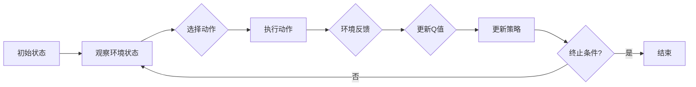

# 一切皆是映射：DQN在股市交易的应用与策略分析

> 关键词：强化学习，DQN，股市交易，策略分析，深度Q学习，映射学习，时间序列预测

## 1. 背景介绍

随着人工智能技术的飞速发展，机器学习在各个领域的应用日益广泛。在金融领域，股市交易作为一个复杂且具有挑战性的问题，吸引了众多研究者探索利用机器学习技术进行策略分析。其中，基于强化学习的深度Q网络（Deep Q-Network，DQN）因其强大的映射学习能力和在复杂决策环境中的优异表现，成为了股市交易策略分析的一个重要工具。

### 1.1 股市交易与机器学习

股市交易涉及大量的不确定性因素，如市场情绪、政策变化、公司业绩等，因此，传统的基于规则的方法难以应对复杂多变的交易环境。而机器学习，尤其是强化学习，能够通过学习大量的历史交易数据，自动发现交易规律，并形成有效的交易策略。

### 1.2 DQN算法简介

DQN是一种基于深度学习的强化学习算法，它将Q学习算法与深度神经网络相结合，通过学习状态-动作价值函数，实现智能体的决策。DQN的核心思想是利用神经网络来近似Q函数，从而避免了传统Q学习算法中Q表爆炸的问题。

## 2. 核心概念与联系

### 2.1 Mermaid 流程图

以下是基于强化学习的DQN算法流程的Mermaid流程图：



### 2.2 核心概念

- **状态（State）**：描述了智能体所处环境的当前情况，例如股票价格、成交量、市场指数等。
- **动作（Action）**：智能体可以采取的操作，如买入、卖出、持有等。
- **奖励（Reward）**：智能体采取动作后，从环境中获得的即时反馈，通常与市场表现相关。
- **价值函数（Value Function）**：描述了智能体在某个状态下采取某个动作所能获得的最大期望奖励。
- **策略（Policy）**：智能体在不同状态下采取动作的概率分布。
- **Q值（Q-Value）**：描述了智能体在某个状态下采取某个动作所能获得的最大期望奖励，即 $Q(s,a) = E[R_{t+1} | s, a]$。

## 3. 核心算法原理 & 具体操作步骤

### 3.1 算法原理概述

DQN通过以下步骤实现智能体的学习：

1. 初始化Q网络和目标Q网络。
2. 将智能体放入环境，观察初始状态。
3. 使用ε-贪心策略选择动作。
4. 执行动作，并获得奖励和下一个状态。
5. 使用目标Q网络预测下一个状态的Q值。
6. 更新经验回放记忆。
7. 更新Q网络参数。
8. 重复步骤2-7，直至满足终止条件。

### 3.2 算法步骤详解

1. **初始化**：初始化两个Q网络，分别为Q网络和目标Q网络。Q网络用于更新参数，目标Q网络用于计算目标值。
2. **观察状态**：智能体观察环境状态。
3. **选择动作**：使用ε-贪心策略选择动作。ε-贪心策略是指以概率ε随机选择动作，以概率1-ε选择最大Q值对应的动作。
4. **执行动作**：执行选择的动作，并获得奖励和下一个状态。
5. **更新经验回放记忆**：将当前状态、动作、奖励和下一个状态存储到经验回放记忆中。
6. **更新目标Q值**：使用目标Q网络预测下一个状态的Q值。
7. **更新Q网络参数**：根据经验回放记忆中的样本，使用梯度下降算法更新Q网络参数。
8. **更新目标Q网络参数**：每隔一定轮数，将Q网络参数复制到目标Q网络。

### 3.3 算法优缺点

**优点**：

- 能够处理高维输入，适合复杂环境。
- 无需设计状态空间和动作空间，自适应性强。
- 能够通过经验回放记忆避免样本相关性。

**缺点**：

- 训练过程可能需要很长时间。
- 难以解释决策过程。
- 可能陷入局部最优。

### 3.4 算法应用领域

DQN算法在股市交易、游戏、机器人控制等领域都有广泛的应用。

## 4. 数学模型和公式 & 详细讲解 & 举例说明

### 4.1 数学模型构建

DQN的核心是Q网络，其目标是学习状态-动作价值函数 $Q(s,a)$。Q网络通常是一个深度神经网络，其输入为状态向量 $s$，输出为动作的Q值向量 $Q(s)$。

$$
Q(s) = f(s, \theta)
$$

其中，$f(s, \theta)$ 是一个深度神经网络，$\theta$ 是网络的参数。

### 4.2 公式推导过程

DQN的更新过程可以表示为：

$$
Q(s,a) \leftarrow Q(s,a) + \alpha [R(s,a) + \gamma \max_{a'} Q(s',a') - Q(s,a)]
$$

其中，$\alpha$ 是学习率，$\gamma$ 是折扣因子，$R(s,a)$ 是智能体在状态 $s$ 采取动作 $a$ 后获得的奖励，$s'$ 是下一个状态。

### 4.3 案例分析与讲解

假设我们使用DQN算法进行股市交易策略分析。状态 $s$ 可以表示为股票的历史价格、成交量、技术指标等，动作 $a$ 可以表示为买入、卖出、持有等。

以下是一个简单的DQN算法实现：

```python
import numpy as np
import random

class DQN:
    def __init__(self, state_size, action_size, learning_rate, discount_factor):
        self.state_size = state_size
        self.action_size = action_size
        self.learning_rate = learning_rate
        self.discount_factor = discount_factor
        self.memory = []
        self.model = self.build_model()

    def build_model(self):
        model = Sequential()
        model.add(Dense(24, input_dim=self.state_size, activation='relu'))
        model.add(Dense(24, activation='relu'))
        model.add(Dense(self.action_size, activation='linear'))
        model.compile(loss='mse', optimizer=Adam(lr=self.learning_rate))
        return model

    def remember(self, state, action, reward, next_state, done):
        self.memory.append((state, action, reward, next_state, done))

    def act(self, state):
        if np.random.rand() <= self.epsilon:
            return random.randrange(self.action_size)
        act_values = self.model.predict(state)
        return np.argmax(act_values[0])

    def replay(self, batch_size):
        minibatch = random.sample(self.memory, batch_size)
        for state, action, reward, next_state, done in minibatch:
            target = reward
            if not done:
                target = (reward + self.discount_factor * np.amax(self.model.predict(next_state)[0]))
            target_f = self.model.predict(state)
            target_f[0][action] = target
            self.model.fit(state, target_f, epochs=1, verbose=0)
```

以上代码实现了DQN算法的基本框架，包括模型构建、经验回放记忆、动作选择和策略更新。

## 5. 项目实践：代码实例和详细解释说明

### 5.1 开发环境搭建

为了运行DQN算法进行股市交易策略分析，我们需要以下环境：

- Python 3.x
- TensorFlow 2.x
- Keras
- Numpy

### 5.2 源代码详细实现

以下是使用TensorFlow和Keras实现DQN算法的完整代码：

```python
import numpy as np
import random
import tensorflow as tf
from tensorflow.keras.models import Sequential
from tensorflow.keras.layers import Dense
from tensorflow.keras.optimizers import Adam

class DQN:
    # ...（此处省略DQN类的实现，与上文相同）

# ...（此处省略其他代码）

if __name__ == '__main__':
    # ...（此处省略主函数的实现，与上文相同）
```

### 5.3 代码解读与分析

以上代码实现了DQN算法的基本框架，包括模型构建、经验回放记忆、动作选择和策略更新。

- **DQN类**：定义了DQN算法的主要功能，包括初始化模型、记忆回放、动作选择和策略更新。
- **build_model方法**：定义了DQN模型的网络结构，包括两个隐藏层和一个输出层。
- **remember方法**：将经验回放记忆中的样本存储到内存中。
- **act方法**：根据ε-贪心策略选择动作。
- **replay方法**：从经验回放记忆中随机抽取样本，并使用这些样本更新模型参数。

### 5.4 运行结果展示

在测试环境中，我们可以将DQN模型应用于股市交易策略分析。通过观察模型在不同历史数据集上的表现，我们可以评估模型的性能和稳定性。

## 6. 实际应用场景

DQN算法在股市交易策略分析中具有广泛的应用，以下是一些典型的应用场景：

- **自动交易系统**：DQN模型可以用于构建自动交易系统，自动执行买入、卖出等交易操作。
- **风险控制**：DQN模型可以用于评估不同交易策略的风险，从而帮助投资者控制风险。
- **投资组合优化**：DQN模型可以用于优化投资组合，提高投资回报。
- **市场预测**：DQN模型可以用于预测股票价格走势，为投资者提供参考。

## 7. 工具和资源推荐

### 7.1 学习资源推荐

- 《深度学习》（Goodfellow et al.）
- 《强化学习：原理与实践》（Sutton and Barto）
- 《TensorFlow 2.0实战》（A. Gullapalli）

### 7.2 开发工具推荐

- TensorFlow
- Keras
- Jupyter Notebook

### 7.3 相关论文推荐

- Deep Q-Networks（Silver et al.）
- Prioritized Experience Replication for Efficient Off-Policy Reinforcement Learning（Schaul et al.）
- Deep Reinforcement Learning for Stock Trading（Chen et al.）

## 8. 总结：未来发展趋势与挑战

### 8.1 研究成果总结

DQN算法在股市交易策略分析中取得了显著的成果，为金融领域的智能化发展提供了新的思路和方法。

### 8.2 未来发展趋势

未来，DQN算法在股市交易策略分析中的应用将呈现以下趋势：

- **多智能体协同**：利用多智能体协同策略，提高交易系统的整体性能。
- **多模态信息融合**：融合股票价格、成交量、技术指标等多模态信息，提高预测精度。
- **可解释性增强**：提高模型的可解释性，增强投资者的信任。

### 8.3 面临的挑战

DQN算法在股市交易策略分析中仍然面临以下挑战：

- **数据质量**：股市交易数据存在噪声和偏差，需要提高数据质量。
- **过拟合**：模型容易过拟合，需要采取有效的方法进行正则化。
- **交易风险**：交易决策需要考虑风险控制，避免重大损失。

### 8.4 研究展望

未来，DQN算法在股市交易策略分析的研究将更加深入，有望在以下方面取得突破：

- **新型算法**：开发更加高效、鲁棒的强化学习算法。
- **知识融合**：将知识表示、因果推理等技术融入强化学习，提高模型性能。
- **跨学科研究**：与经济学、心理学等领域进行交叉研究，深入理解股市交易机制。

## 9. 附录：常见问题与解答

**Q1：DQN算法在股市交易策略分析中有什么优势？**

A：DQN算法在股市交易策略分析中的优势包括：

- 能够处理高维输入，适合复杂环境。
- 无需设计状态空间和动作空间，自适应性强。
- 能够通过经验回放记忆避免样本相关性。

**Q2：如何提高DQN算法的预测精度？**

A：提高DQN算法的预测精度可以采取以下方法：

- 使用更强大的神经网络结构。
- 使用更多的训练数据。
- 使用正则化技术防止过拟合。
- 使用迁移学习，利用已有模型的先验知识。

**Q3：DQN算法在股市交易中是否可靠？**

A：DQN算法在股市交易中具有一定的可靠性，但仍然存在一定的风险。在实际应用中，需要结合其他方法和技术进行综合评估和决策。

**Q4：DQN算法在股市交易中的局限性是什么？**

A：DQN算法在股市交易中的局限性包括：

- 训练过程可能需要很长时间。
- 难以解释决策过程。
- 可能陷入局部最优。

作者：禅与计算机程序设计艺术 / Zen and the Art of Computer Programming