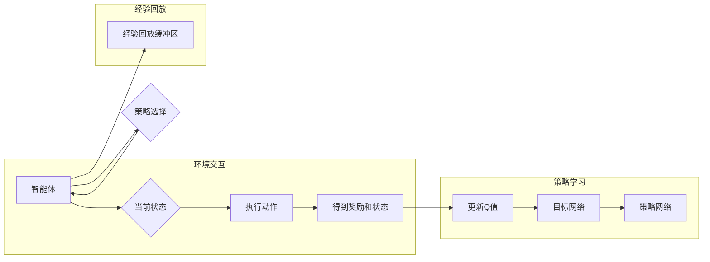

> **强化学习, DQN, 连续动作空间, 动作空间映射, 策略优化, 深度学习, 回报优化, 探索与利用**

# 一切皆是映射：使用DQN解决连续动作空间问题：策略与挑战

在人工智能的广阔领域中，强化学习（Reinforcement Learning，RL）以其独特的魅力吸引了无数研究者和工程师的注意力。它模拟了人类学习行为的过程，通过与环境交互，学习如何从给定的状态中做出最优决策。然而，强化学习的一个挑战是处理连续动作空间问题。不同于离散动作空间中的枚举和穷举，连续动作空间的问题更加复杂，因为它们通常涉及无限多的可能动作。本文将深入探讨如何使用深度确定性策略梯度（Deep Deterministic Policy Gradient，DQN）解决连续动作空间问题，分析其策略与挑战。

## 1. 背景介绍

### 1.1 强化学习简介

强化学习是机器学习的一个分支，其核心思想是智能体通过与环境的交互来学习如何采取最优动作以最大化累积奖励。在强化学习中，智能体（Agent）根据当前状态（State）选择一个动作（Action），然后根据动作得到一个即时奖励（Reward）以及新的状态。通过这个过程，智能体不断学习并优化其策略（Policy），以实现长期的累积奖励最大化。

### 1.2 连续动作空间

与离散动作空间不同，连续动作空间中的动作可以是任意连续值。例如，在自动驾驶中，车辆的速度可以是任意介于0到最高速度之间的值。处理连续动作空间是强化学习中的一个难点，因为动作空间通常是无限的，这使得直接学习几乎不可能。

### 1.3 DQN介绍

深度确定性策略梯度（DQN）是一种基于深度学习的强化学习算法，它使用深度神经网络（DNN）来近似策略函数，并通过Q学习（Q-Learning）的方法来学习策略。DQN的关键特点是使用经验回放（Experience Replay）和目标网络（Target Network）来提高学习效率和稳定性。

## 2. 核心概念与联系

### 2.1 Mermaid流程图



### 2.2 核心概念

- **智能体（Agent）**：执行动作并从环境中接收反馈的实体。
- **状态（State）**：描述环境的当前状态的变量集合。
- **动作（Action）**：智能体可以采取的行动。
- **奖励（Reward）**：智能体采取动作后获得的即时奖励。
- **策略（Policy）**：智能体根据当前状态选择动作的方法。
- **Q值（Q-Value）**：智能体在特定状态下采取特定动作的预期回报。
- **经验回放缓冲区（Experience Replay Buffer）**：存储智能体经历的经验，用于训练和改进策略。
- **目标网络（Target Network）**：用于评估和更新Q值的稳定网络。

## 3. 核心算法原理 & 具体操作步骤

### 3.1 算法原理概述

DQN通过以下步骤来学习策略：

1. 初始化策略网络和目标网络，两者共享相同的参数。
2. 智能体与环境交互，收集经验并存储到经验回放缓冲区。
3. 从缓冲区中随机抽取一批经验，用于训练策略网络。
4. 策略网络输出Q值，目标网络评估Q值并生成目标Q值。
5. 使用梯度下降更新策略网络的参数，以最小化预测Q值与目标Q值之间的差异。
6. 定期复制策略网络的参数到目标网络，以保持网络稳定。

### 3.2 算法步骤详解

1. **初始化**：设置经验回放缓冲区的大小，初始化策略网络和目标网络的参数。
2. **环境交互**：智能体选择动作，与环境交互，获得奖励和新的状态。
3. **经验回放**：从缓冲区中随机抽取一批经验，进行去噪处理。
4. **策略网络更新**：使用抽取的经验，策略网络输出Q值，目标网络输出目标Q值。
5. **梯度下降**：计算策略网络参数的梯度，并更新策略网络参数。
6. **目标网络更新**：定期复制策略网络的参数到目标网络。
7. **重复**：重复步骤2到6，直到策略网络收敛。

### 3.3 算法优缺点

#### 优点

- **使用深度神经网络**：能够处理高维状态空间。
- **经验回放**：提高了学习效率，减少了样本相关性。
- **目标网络**：提高了学习稳定性。

#### 缺点

- **样本效率**：需要大量数据进行训练。
- **收敛速度**：在某些情况下收敛速度较慢。
- **参数优化**：需要仔细选择超参数。

### 3.4 算法应用领域

DQN及其变体在许多领域都有应用，包括：

- **游戏**：如Atari游戏、围棋等。
- **机器人**：如自动驾驶、机器人运动控制等。
- **金融**：如股票交易、风险管理等。

## 4. 数学模型和公式 & 详细讲解 & 举例说明

### 4.1 数学模型构建

DQN的数学模型基于Q学习，其目标是学习以下目标函数：

$$
Q(s,a;\theta) = \mathbb{E}[R_{t+1} + \gamma \max_{a'} Q(s',a';\theta) | s, a]
$$

其中，$s$ 是当前状态，$a$ 是当前动作，$R_{t+1}$ 是下一个状态的奖励，$\gamma$ 是折扣因子，$\theta$ 是策略网络的参数。

### 4.2 公式推导过程

DQN的更新规则如下：

$$
\theta \leftarrow \theta - \alpha \nabla_{\theta} J(\theta)
$$

其中，$J(\theta)$ 是损失函数，定义为：

$$
J(\theta) = \frac{1}{N} \sum_{i=1}^{N} (y_i - Q(s_i,a_i;\theta))^2
$$

其中，$y_i$ 是目标Q值，$s_i$ 和 $a_i$ 是经验回放缓冲区中的状态和动作。

### 4.3 案例分析与讲解

假设我们使用DQN来训练一个智能体在CartPole环境中取得稳定平衡。在这个环境中，智能体可以选择向上或向下推杆，目标是使杆子保持平衡。

1. **初始化**：设置经验回放缓冲区的大小，初始化策略网络和目标网络的参数。
2. **环境交互**：智能体随机选择动作，与环境交互，获得奖励和新的状态。
3. **经验回放**：从缓冲区中随机抽取一批经验，进行去噪处理。
4. **策略网络更新**：使用抽取的经验，策略网络输出Q值，目标网络输出目标Q值。
5. **梯度下降**：计算策略网络参数的梯度，并更新策略网络参数。
6. **目标网络更新**：定期复制策略网络的参数到目标网络。
7. **重复**：重复步骤2到6，直到策略网络收敛。

通过这个过程，智能体学会了如何通过推杆来使杆子保持平衡。

## 5. 项目实践：代码实例和详细解释说明

### 5.1 开发环境搭建

为了进行DQN的实践，我们需要以下开发环境：

- Python 3.x
- TensorFlow或PyTorch
- OpenAI Gym

### 5.2 源代码详细实现

以下是一个简单的DQN实现，使用PyTorch和OpenAI Gym：

```python
import torch
import torch.nn as nn
import torch.optim as optim
import numpy as np
import random
from collections import deque
from gym import make

# DQN模型
class DQN(nn.Module):
    def __init__(self, input_size, hidden_size, output_size):
        super(DQN, self).__init__()
        self.fc1 = nn.Linear(input_size, hidden_size)
        self.fc2 = nn.Linear(hidden_size, output_size)

    def forward(self, x):
        x = torch.relu(self.fc1(x))
        x = self.fc2(x)
        return x

# 训练DQN
def train_dqn(model, memory, optimizer, criterion, gamma, batch_size):
    # 从经验回放缓冲区中随机抽取一批经验
    experiences = random.sample(memory, batch_size)
    states, actions, rewards, next_states, dones = zip(*experiences)

    # 计算当前Q值
    current_q_values = model(states).gather(1, actions.unsqueeze(1)).squeeze(1)

    # 计算目标Q值
    next_q_values = torch.zeros(batch_size).to(current_q_values.device)
    dones = torch.tensor(dones).to(current_q_values.device)
    next_q_values[~dones] = model(next_states).max(1)[0].unsqueeze(1)
    target_q_values = rewards + gamma * next_q_values

    # 计算损失并更新模型参数
    loss = criterion(current_q_values, target_q_values)
    optimizer.zero_grad()
    loss.backward()
    optimizer.step()

# 创建环境和模型
env = make('CartPole-v1')
input_size = env.observation_space.shape[0]
hidden_size = 64
output_size = env.action_space.n
model = DQN(input_size, hidden_size, output_size).to('cuda')
optimizer = optim.Adam(model.parameters())
criterion = nn.MSELoss()
gamma = 0.99

# 创建经验回放缓冲区
memory = deque(maxlen=2000)

# 训练模型
for episode in range(1000):
    state = env.reset()
    state = torch.from_numpy(state).float().unsqueeze(0).to('cuda')
    done = False

    while not done:
        # 选择动作
        action = model(state).argmax().item()
        # 执行动作
        next_state, reward, done, _ = env.step(action)
        next_state = torch.from_numpy(next_state).float().unsqueeze(0).to('cuda')

        # 存储经验
        memory.append((state, action, reward, next_state, done))

        # 更新状态
        state = next_state

    # 训练DQN
    if len(memory) > 64:
        train_dqn(model, memory, optimizer, criterion, gamma, 64)

# 关闭环境
env.close()
```

### 5.3 代码解读与分析

- `DQN` 类定义了DQN模型，使用两个全连接层。
- `train_dqn` 函数负责训练DQN模型，包括从经验回放缓冲区中抽取经验、计算当前Q值和目标Q值、计算损失并更新模型参数。
- `train` 循环负责初始化环境、模型和优化器，并执行训练过程。

### 5.4 运行结果展示

运行上述代码后，DQN模型将在CartPole环境中学习如何使杆子保持平衡。通过多次训练，模型应该能够学会在CartPole环境中取得稳定平衡。

## 6. 实际应用场景

### 6.1 自动驾驶

DQN及其变体在自动驾驶领域有着广泛的应用。通过训练，智能驾驶系统能够学习如何控制车辆在道路上行驶，避免碰撞，并遵守交通规则。

### 6.2 机器人控制

DQN可以用于训练机器人执行各种任务，如抓取物体、行走等。通过与环境交互，机器人可以学习如何根据当前状态选择最佳动作。

### 6.3 金融

DQN可以用于金融领域的风险管理、投资组合优化等任务。通过分析市场数据，DQN可以学习如何做出最佳的交易决策。

## 7. 工具和资源推荐

### 7.1 学习资源推荐

- 《Reinforcement Learning: An Introduction》
- 《Deep Reinforcement Learning Hands-On》
- 《Artificial Intelligence: A Modern Approach》

### 7.2 开发工具推荐

- TensorFlow
- PyTorch
- OpenAI Gym

### 7.3 相关论文推荐

- Deep Reinforcement Learning with Double Q-Learning
- Prioritized Experience Replay
- Asynchronous Methods for Deep Reinforcement Learning

## 8. 总结：未来发展趋势与挑战

### 8.1 研究成果总结

DQN及其变体在解决连续动作空间问题方面取得了显著成果，为强化学习领域的发展做出了重要贡献。

### 8.2 未来发展趋势

- **多智能体强化学习**：研究如何使多个智能体在同一环境中协同工作。
- **无模型学习**：减少对环境模型的依赖，直接从数据中学习。
- **可解释性和安全性**：提高强化学习算法的可解释性和安全性。

### 8.3 面临的挑战

- **样本效率**：如何提高样本效率，减少训练所需的数据量。
- **收敛速度**：如何提高收敛速度，减少训练时间。
- **可解释性和安全性**：如何提高算法的可解释性和安全性。

### 8.4 研究展望

DQN及其变体将继续在强化学习领域发挥重要作用，并将在更多领域得到应用。随着研究的深入，我们将看到更多创新和突破。

## 9. 附录：常见问题与解答

**Q1：DQN如何处理连续动作空间？**

A：DQN通过将连续动作空间映射到离散动作空间来处理连续动作空间问题。例如，可以将动作空间分成多个区间，每个区间对应一个离散动作。

**Q2：为什么需要经验回放缓冲区？**

A：经验回放缓冲区可以减少样本相关性，提高学习效率，并防止训练过程中出现灾难性遗忘。

**Q3：DQN的收敛速度如何？**

A：DQN的收敛速度取决于多个因素，如数据量、网络结构、优化器等。在合理设置参数的情况下，DQN通常可以在几千步到几万步之间收敛。

**Q4：DQN如何应用于实际场景？**

A：DQN可以应用于各种实际场景，如游戏、机器人控制、自动驾驶、金融等。通过适当的调整和优化，DQN可以在这些领域取得良好的效果。

**Q5：DQN的局限性是什么？**

A：DQN的局限性包括样本效率低、收敛速度慢、可解释性和安全性不足等。未来的研究需要解决这些问题，以提高DQN的性能和应用范围。