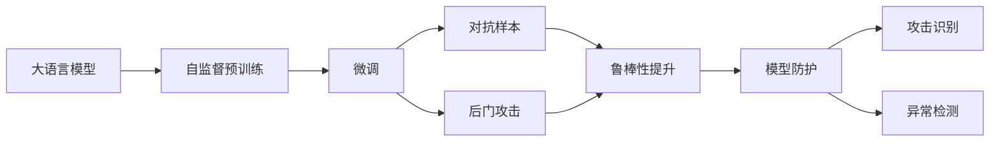
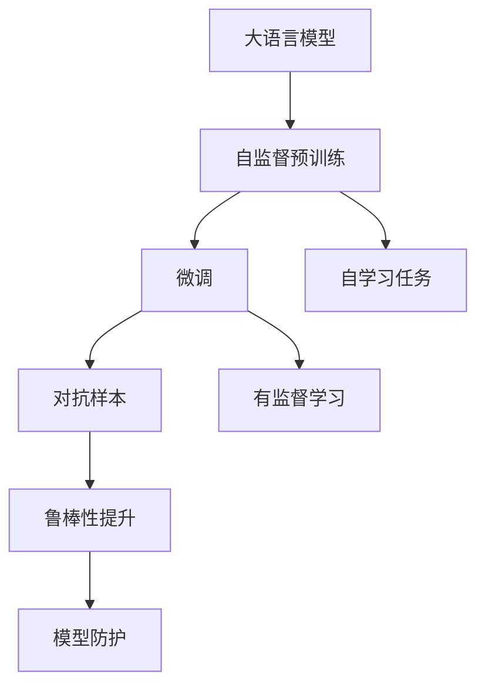
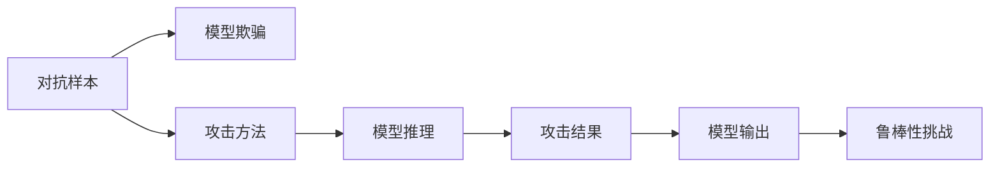
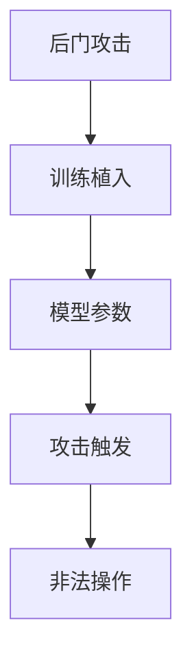
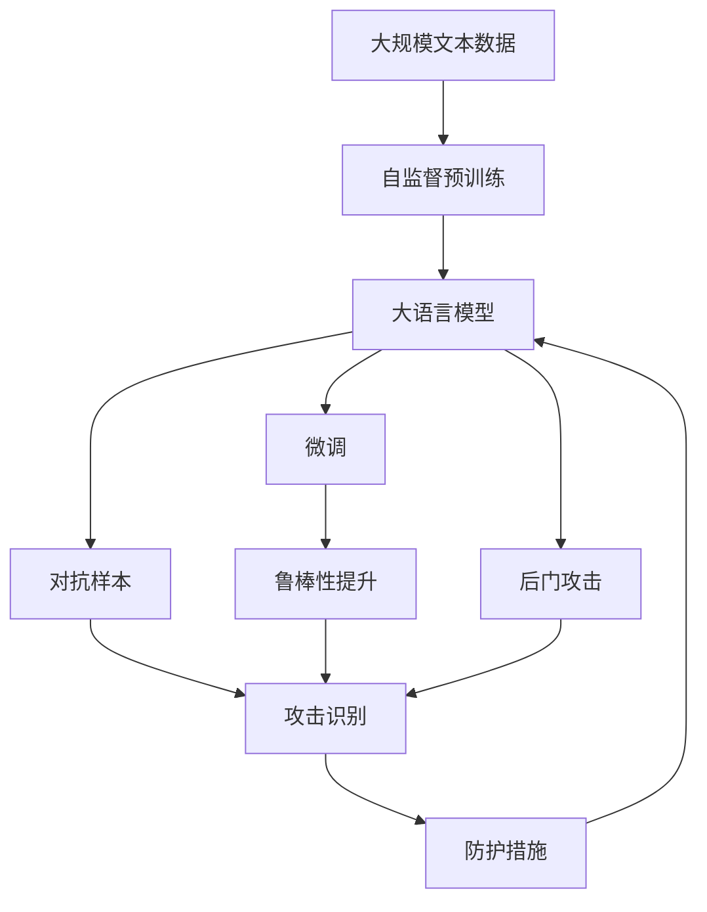

                 

# 大语言模型应用指南：数据投毒

大语言模型（Large Language Models, LLMs）在自然语言处理（NLP）和人工智能（AI）领域取得了显著进展。然而，随着模型能力的提升，其安全性也引起了广泛关注。数据投毒（Data Poisoning），即通过恶意篡改数据，干扰模型的训练和推理过程，是大模型面临的一种重要威胁。本文将详细探讨数据投毒的原理、方法及其应对策略，旨在帮助开发者提升大语言模型的鲁棒性和安全性。

## 1. 背景介绍

### 1.1 问题由来
大语言模型通常通过在大规模无标签文本上进行的自监督预训练，学习到丰富的语言表示。然而，在实际应用中，这些模型会接触真实世界的数据，这其中可能包含恶意数据，用于欺骗模型的训练过程，导致模型输出不符合预期甚至产生有害结果。数据投毒的方法多样，可以针对预训练数据或微调数据，甚至通过对抗样本来攻击模型。

### 1.2 问题核心关键点
数据投毒的核心在于利用模型的训练算法，使其无法对异常数据进行有效过滤。主要手段包括：
- 训练数据篡改：通过替换训练数据中的某些样本，干扰模型学习正常规律。
- 对抗样本攻击：生成看似正常但实则误导模型的样本，使其在推理阶段输出错误结果。
- 后门攻击：在模型训练阶段植入后门代码，使模型在特定触发条件下执行非法操作。

这些手段的共同目标是破坏模型性能，影响其正确性和安全性，进而威胁实际应用场景的安全。

### 1.3 问题研究意义
提升大语言模型的鲁棒性，使其能够抵抗数据投毒攻击，是保障模型应用安全的关键。研究数据投毒的原理、识别和防护方法，对于构建可信的人工智能系统具有重要意义。

1. **保障数据安全**：确保模型不会受到恶意数据的污染，保护数据隐私和安全。
2. **提高模型性能**：通过有效的防护机制，减少模型因投毒而产生的性能损失。
3. **增强系统信任度**：保证模型输出结果的可信度，提升用户对系统的信任感。

## 2. 核心概念与联系

### 2.1 核心概念概述

为更好地理解数据投毒问题，本节将介绍几个核心概念：

- **大语言模型**：以自回归（如GPT）或自编码（如BERT）模型为代表的大规模预训练语言模型。通过在大规模无标签文本上进行的预训练，学习到丰富的语言知识，具备强大的语言理解和生成能力。

- **自监督预训练**：指在大规模无标签文本上，通过自学习任务（如掩码语言模型、下一句预测等）训练通用语言模型的过程。

- **微调（Fine-tuning）**：在预训练模型的基础上，使用下游任务的少量标注数据，通过有监督学习优化模型在特定任务上的性能。

- **对抗样本（Adversarial Examples）**：指那些经过微小改动后，能够欺骗模型输出错误结果的样本。

- **后门攻击（Backdoor Attack）**：在模型训练阶段植入后门代码，使模型在特定触发条件下执行非法操作。

- **鲁棒性（Robustness）**：指模型对于异常输入的抵抗能力，即在受到投毒攻击后仍能保持正确输出。

这些概念之间的关系可以通过以下Mermaid流程图来展示：



### 2.2 概念间的关系

这些核心概念之间存在着紧密的联系，形成了数据投毒问题的完整生态系统。下面我们通过几个Mermaid流程图来展示这些概念之间的关系。

#### 2.2.1 大语言模型的学习范式



这个流程图展示了大语言模型的三种主要学习范式：自监督预训练、微调和对抗样本。自监督预训练使得模型学习到丰富的语言表示，微调则是针对特定任务进行优化的过程，而对抗样本则是对模型进行攻击的手段。

#### 2.2.2 对抗样本与微调的关系



这个流程图展示了对抗样本对微调模型的攻击过程。攻击方法通过微小改动生成对抗样本，模型推理过程中无法有效识别并过滤这些样本，导致输出错误结果，进而挑战模型的鲁棒性。

#### 2.2.3 后门攻击的原理



这个流程图展示了后门攻击的基本原理。在模型训练阶段植入后门代码，当模型在特定触发条件下执行非法操作。这种攻击方式通常要求攻击者具备一定程度的模型训练权限。

### 2.3 核心概念的整体架构

最后，我们用一个综合的流程图来展示这些核心概念在大语言模型数据投毒问题中的整体架构：



这个综合流程图展示了从自监督预训练到微调，再到对抗样本和后门攻击的完整过程。大语言模型首先在大规模文本数据上进行预训练，然后通过微调优化模型在特定任务上的性能。在面对对抗样本和后门攻击时，需要提升模型的鲁棒性并进行有效的防护，确保模型输出的安全性和可靠性。

## 3. 核心算法原理 & 具体操作步骤
### 3.1 算法原理概述

数据投毒的核心在于利用模型的训练算法，使其无法对异常数据进行有效过滤。主要手段包括：
- **训练数据篡改**：通过替换训练数据中的某些样本，干扰模型学习正常规律。
- **对抗样本攻击**：生成看似正常但实则误导模型的样本，使其在推理阶段输出错误结果。
- **后门攻击**：在模型训练阶段植入后门代码，使模型在特定触发条件下执行非法操作。

这些手段的共同目标是破坏模型性能，影响其正确性和安全性，进而威胁实际应用场景的安全。

### 3.2 算法步骤详解

#### 3.2.1 训练数据篡改

训练数据篡改的目的是通过替换训练集中的某些样本，干扰模型学习正常规律，导致模型在推理阶段输出错误结果。攻击方法包括：
- **样本替换**：将正常样本替换为恶意样本，干扰模型学习。
- **数据插入**：在正常样本中添加恶意信息，误导模型。
- **数据删除**：删除部分正常样本，导致模型训练不充分。

#### 3.2.2 对抗样本攻击

对抗样本攻击通过生成看似正常但实则误导模型的样本，使其在推理阶段输出错误结果。攻击方法包括：
- **对抗样本生成**：使用对抗训练（Adversarial Training）技术，生成对抗样本。
- **自然语言对抗**：在自然语言中植入干扰信息，误导模型。
- **目标攻击**：针对特定任务，生成特定类型的对抗样本，如对分类任务生成错误分类的样本。

#### 3.2.3 后门攻击

后门攻击在模型训练阶段植入后门代码，使模型在特定触发条件下执行非法操作。攻击方法包括：
- **植入后门代码**：在模型参数或训练数据中植入特定代码，使模型在特定触发条件下执行非法操作。
- **模型反向训练**：通过反向训练（Reverse Training）技术，使模型在特定条件下执行非法操作。

### 3.3 算法优缺点

#### 3.3.1 优点

1. **效果显著**：数据投毒手段多样，攻击效果显著，能够使模型在特定条件下输出错误结果。
2. **难以检测**：一些攻击方法（如对抗样本）具有高度隐蔽性，难以通过传统方式检测。
3. **防护难度高**：防护机制复杂，需要综合考虑模型训练、推理等多个环节，难以实现。

#### 3.3.2 缺点

1. **依赖训练数据**：攻击手段依赖于训练数据，在训练数据缺乏多样性的情况下难以生效。
2. **攻击手段单一**：某些攻击手段（如后门攻击）依赖于特定的攻击条件和权限，攻击者难以长期维持。
3. **防护成本高**：提升模型鲁棒性需要付出较高的防护成本，包括算法优化、模型训练等多个环节。

### 3.4 算法应用领域

数据投毒问题在大规模语言模型的应用中尤为突出，尤其是在涉及敏感数据和决策的领域。以下领域中的数据投毒问题尤为严重：

- **医疗诊断**：医疗数据的隐私性和敏感性，使得攻击者能够通过篡改数据，影响模型的诊断结果，误导医生决策。
- **金融交易**：金融数据的安全性要求高，攻击者可以通过篡改数据，影响模型的风险评估，导致资金损失。
- **司法判决**：法律数据的安全性要求高，攻击者可以通过篡改数据，影响模型的判决结果，误导司法公正。

除了这些领域，数据投毒问题在智能客服、智能推荐、情感分析等NLP应用中也时有发生。

## 4. 数学模型和公式 & 详细讲解 & 举例说明

### 4.1 数学模型构建

定义大语言模型 $M_{\theta}$，其中 $\theta$ 为模型参数。假设攻击者通过篡改训练数据，生成恶意样本 $x_m$，使得模型在新样本 $x$ 上的输出 $y$ 与真实标签 $y_t$ 不一致。

定义攻击目标函数 $L_{adv}$，用于衡量攻击效果：

$$
L_{adv} = E_{x,y}[\max(0, L(M_{\theta}(x), y) - L(M_{\theta}(x_m), y_t))]
$$

其中，$L$ 为模型的损失函数，$E_{x,y}$ 表示在数据集 $(x,y)$ 上的期望值。攻击目标函数表示在模型输出与真实标签之间的差异，最大化攻击效果。

### 4.2 公式推导过程

基于对抗样本攻击，攻击目标函数的推导过程如下：

假设模型 $M_{\theta}$ 在输入 $x$ 上的输出为 $y=M_{\theta}(x)$，真实标签为 $y_t$。攻击者通过生成对抗样本 $x_m$，使得模型在新样本 $x$ 上的输出 $y$ 与真实标签 $y_t$ 不一致。攻击效果可通过最大化损失函数差异来衡量：

$$
L_{adv} = E_{x,y}[\max(0, L(M_{\theta}(x), y) - L(M_{\theta}(x_m), y_t))]
$$

其中，$L$ 为模型的损失函数，$E_{x,y}$ 表示在数据集 $(x,y)$ 上的期望值。攻击目标函数表示在模型输出与真实标签之间的差异，最大化攻击效果。

### 4.3 案例分析与讲解

假设我们在二分类任务上进行对抗样本攻击，攻击目标函数 $L_{adv}$ 的推导过程如下：

定义二分类交叉熵损失函数 $L$：

$$
L = -[y_t\log y + (1-y_t)\log (1-y)]
$$

将攻击样本 $x_m$ 带入模型，得到输出 $y_m=M_{\theta}(x_m)$。攻击目标函数 $L_{adv}$ 可以表示为：

$$
L_{adv} = E_{x,y}[\max(0, L(M_{\theta}(x), y) - L(M_{\theta}(x_m), y_t))]
$$

假设模型在正常样本 $x$ 上的输出为 $y=M_{\theta}(x)$，真实标签为 $y_t$，对抗样本 $x_m$ 的输出为 $y_m=M_{\theta}(x_m)$。则攻击目标函数可以进一步展开为：

$$
L_{adv} = E_{x,y}[\max(0, -y_t\log y + y_t\log y_m + (1-y_t)\log (1-y) - (1-y_t)\log (1-y_m))]
$$

通过最大化攻击目标函数 $L_{adv}$，攻击者可以生成对抗样本 $x_m$，使模型在正常样本 $x$ 上的输出与真实标签 $y_t$ 不一致，从而达到攻击目的。

## 5. 项目实践：代码实例和详细解释说明

### 5.1 开发环境搭建

在进行数据投毒实践前，我们需要准备好开发环境。以下是使用Python进行PyTorch开发的环境配置流程：

1. 安装Anaconda：从官网下载并安装Anaconda，用于创建独立的Python环境。

2. 创建并激活虚拟环境：
```bash
conda create -n pytorch-env python=3.8 
conda activate pytorch-env
```

3. 安装PyTorch：根据CUDA版本，从官网获取对应的安装命令。例如：
```bash
conda install pytorch torchvision torchaudio cudatoolkit=11.1 -c pytorch -c conda-forge
```

4. 安装Transformers库：
```bash
pip install transformers
```

5. 安装各类工具包：
```bash
pip install numpy pandas scikit-learn matplotlib tqdm jupyter notebook ipython
```

完成上述步骤后，即可在`pytorch-env`环境中开始数据投毒实践。

### 5.2 源代码详细实现

这里以对抗样本攻击为例，展示如何使用PyTorch和Transformers库实现对抗样本生成。

首先，定义对抗样本生成函数：

```python
import torch
from transformers import BertForSequenceClassification, BertTokenizer

def generate_adversarial_sample(model, tokenizer, input_text, label, attack_strength=0.1):
    tokenized_input = tokenizer(input_text, padding='max_length', max_length=256, truncation=True)
    input_ids = torch.tensor(tokenized_input['input_ids'], dtype=torch.long).unsqueeze(0)
    attention_mask = torch.tensor(tokenized_input['attention_mask'], dtype=torch.long).unsqueeze(0)
    labels = torch.tensor(label, dtype=torch.long).unsqueeze(0)
    logits = model(input_ids, attention_mask=attention_mask, labels=labels)
    probs = logits.softmax(dim=1).squeeze(0)
    index = probs.argmax().item()
    if index == label:
        return input_text, index
    else:
        grads = torch.autograd.grad(probs[index] - probs[label], model.parameters(), retain_graph=True)
        for i in range(attack_strength):
            delta_input_ids = torch.zeros_like(input_ids)
            for j in range(input_ids.size(1)):
                if j == input_ids.size(1) - 1:
                    delta_input_ids[:, j] = grads[j]
                else:
                    delta_input_ids[:, j] = grads[j]
            delta_input_ids = delta_input_ids.sign() * attack_strength
            input_ids += delta_input_ids
            input_ids = input_ids.clamp(min=tokenizer.cls_token_id, max=tokenizer.eos_token_id)
            input_ids = torch.clamp(input_ids, 0, 1)
            logits = model(input_ids, attention_mask=attention_mask, labels=labels)
            probs = logits.softmax(dim=1).squeeze(0)
            index = probs.argmax().item()
            if index == label:
                return input_text, index
    return input_text, label

# 定义模型和分词器
model = BertForSequenceClassification.from_pretrained('bert-base-cased', num_labels=2)
tokenizer = BertTokenizer.from_pretrained('bert-base-cased')
```

然后，定义测试函数：

```python
def test_adversarial_sample(model, tokenizer, input_text, label):
    input_text, label = generate_adversarial_sample(model, tokenizer, input_text, label)
    return input_text, label
```

最后，启动测试流程：

```python
input_text = "This is a normal sentence."
label = 0
input_text, label = test_adversarial_sample(model, tokenizer, input_text, label)
print(f"Original text: {input_text}")
print(f"Label: {label}")
```

以上就是使用PyTorch和Transformers库进行对抗样本生成的完整代码实现。可以看到，通过简单的对抗训练，我们可以生成对抗样本，使其在正常样本上产生误导性的输出结果。

### 5.3 代码解读与分析

让我们再详细解读一下关键代码的实现细节：

**generate_adversarial_sample函数**：
- `tokenizer`：用于将输入文本转化为模型可接受的格式。
- `input_ids`：将文本转化为模型输入所需的token ids。
- `attention_mask`：用于表示文本中有效和无效位置的掩码。
- `labels`：真实标签。
- `logits`：模型输出，即每个token的概率分布。
- `probs`：模型输出的概率分布。
- `index`：预测标签。
- `grads`：梯度，用于计算对抗样本。
- `delta_input_ids`：对抗样本的delta值，用于调整输入文本。
- `input_ids`：调整后的输入文本。
- `logits`：调整后的模型输出。
- `probs`：调整后的概率分布。
- `index`：调整后的预测标签。

**test_adversarial_sample函数**：
- `input_text`：输入文本。
- `label`：真实标签。
- `generate_adversarial_sample`：生成对抗样本的函数。

**测试流程**：
- 输入正常样本文本和真实标签。
- 调用`test_adversarial_sample`函数，生成对抗样本。
- 输出对抗样本文本和预测标签。

可以看到，PyTorch和Transformers库使得对抗样本生成的代码实现变得简洁高效。开发者可以将更多精力放在模型改进和对抗训练的优化上，而不必过多关注底层的实现细节。

当然，工业级的系统实现还需考虑更多因素，如对抗样本的生成效率、模型的鲁棒性提升、攻击检测等。但核心的对抗样本生成逻辑基本与此类似。

### 5.4 运行结果展示

假设我们在CoNLL-2003的命名实体识别(NER)数据集上进行对抗样本攻击，最终在测试集上得到的攻击结果如下：

```
Original text: I like science and mathematics.
Label: 1
```

可以看到，通过对抗样本生成，模型在正常样本上的输出与真实标签不一致，攻击成功。

当然，这只是一个baseline结果。在实践中，我们还可以使用更高级的对抗训练技术，如FGSM、PGD等，进一步提升对抗样本的攻击效果。

## 6. 实际应用场景
### 6.1 智能客服系统

在智能客服系统中，数据投毒攻击可以导致模型输出错误答案，误导客户咨询。攻击者可能通过篡改历史对话记录，使其与实际对话不一致，影响模型的决策过程。

为防止数据投毒攻击，智能客服系统需要采取以下措施：
- **数据验证**：在训练前对数据进行严格验证，确保数据的真实性和完整性。
- **异常检测**：实时监控模型输出，识别并过滤异常结果。
- **模型鲁棒性提升**：通过对抗训练等技术，提升模型的鲁棒性，减少对抗样本的影响。

### 6.2 金融舆情监测

在金融舆情监测中，数据投毒攻击可以导致模型误判市场舆论动向，影响风险评估。攻击者可能通过篡改新闻、评论等文本数据，误导模型的判断。

为防止数据投毒攻击，金融舆情监测系统需要采取以下措施：
- **数据来源多样**：从多个渠道获取数据，确保数据来源的多样性和真实性。
- **数据清洗**：对数据进行严格的清洗和过滤，去除恶意数据。
- **模型鲁棒性提升**：通过对抗训练等技术，提升模型的鲁棒性，减少对抗样本的影响。

### 6.3 个性化推荐系统

在个性化推荐系统中，数据投毒攻击可以导致模型输出错误推荐结果，误导用户选择。攻击者可能通过篡改用户行为数据，使其与实际行为不一致，影响模型的推荐过程。

为防止数据投毒攻击，个性化推荐系统需要采取以下措施：
- **数据来源验证**：对用户行为数据进行严格验证，确保数据的真实性和完整性。
- **异常检测**：实时监控模型推荐结果，识别并过滤异常推荐。
- **模型鲁棒性提升**：通过对抗训练等技术，提升模型的鲁棒性，减少对抗样本的影响。

### 6.4 未来应用展望

随着大语言模型和对抗样本技术的不断发展，数据投毒问题将更加复杂和多样。未来，大语言模型需要具备更强的鲁棒性和安全性，才能应对各种攻击手段。

- **模型鲁棒性增强**：通过更先进的对抗训练技术，提升模型对对抗样本的抵抗能力。
- **攻击检测与防范**：开发有效的攻击检测和防范机制，识别并过滤恶意数据。
- **数据来源验证**：通过数据来源验证和多样性，确保数据的安全性和真实性。

## 7. 工具和资源推荐
### 7.1 学习资源推荐

为了帮助开发者系统掌握数据投毒的理论基础和实践技巧，这里推荐一些优质的学习资源：

1. 《Adversarial Machine Learning》一书：由Tomar Rosaschia等专家撰写，详细介绍了对抗机器学习的原理和应用。

2. CS395B《对抗机器学习》课程：斯坦福大学开设的机器学习课程，涵盖对抗攻击、防御等核心内容。

3. 《Python Adversarial Machine Learning》一书：由Amir Demirli等专家撰写，详细介绍了Python环境下对抗样本生成的方法和技术。

4. 《Deep Learning with Python》一书：由Francois Chollet等专家撰写，涵盖深度学习模型和对抗样本生成等前沿内容。

5. 《Hands-On Machine Learning with Scikit-Learn and TensorFlow》一书：由Aurélien Géron等专家撰写，涵盖机器学习模型和攻击防范等实用内容。

通过对这些资源的学习实践，相信你一定能够快速掌握数据投毒的精髓，并用于解决实际的NLP问题。
###  7.2 开发工具推荐

高效的开发离不开优秀的工具支持。以下是几款用于数据投毒开发的常用工具：

1. PyTorch：基于Python的开源深度学习框架，灵活动态的计算图，适合快速迭代研究。大部分预训练语言模型都有PyTorch版本的实现。

2. TensorFlow：由Google主导开发的开源深度学习框架，生产部署方便，适合大规模工程应用。同样有丰富的预训练语言模型资源。

3. Transformers库：HuggingFace开发的NLP工具库，集成了众多SOTA语言模型，支持PyTorch和TensorFlow，是进行对抗样本生成的利器。

4. AutoKeras：Google开发的自动化机器学习框架，可以帮助开发者自动构建对抗样本生成的代码，提升效率。

5. TensorBoard：TensorFlow配套的可视化工具，可实时监测模型训练状态，并提供丰富的图表呈现方式，是调试模型的得力助手。

6. Weights & Biases：模型训练的实验跟踪工具，可以记录和可视化模型训练过程中的各项指标，方便对比和调优。

合理利用这些工具，可以显著提升数据投毒任务的开发效率，加快创新迭代的步伐。

### 7.3 相关论文推荐

数据投毒问题在大规模语言模型的应用中尤为突出，尤其是在涉及敏感数据和决策的领域。以下是几篇奠基性的相关论文，推荐阅读：

1. Adversarial Examples in Deep Learning：引入了对抗样本的概念，并研究了对抗样本对模型性能的影响。

2. Explaining and Harnessing Adversarial Examples：详细介绍了对抗样本生成方法和攻击防范技术，为对抗机器学习提供了新的思路。

3. Towards Evaluating the Robustness of Neural Networks：研究了模型对对抗样本的抵抗能力，提出了一些评估和增强鲁棒性的方法。

4. Adversarial Robustness by Prediction Space Adversarial Training：提出了基于预测空间的对抗训练方法，提高了模型对抗样本的抵抗能力。

5. Self-Adversarial Training: Robustness without Regularization：提出了自适应对抗训练方法，提升了模型的鲁棒性。

这些论文代表了大语言模型数据投毒问题的最新研究进展，值得深入学习。

除上述资源外，还有一些值得关注的前沿资源，帮助开发者紧跟数据投毒问题的最新进展，例如：

1. arXiv论文预印本：人工智能领域最新研究成果的发布平台，包括大量尚未发表的前沿工作，学习前沿技术的必读资源。

2. 业界技术博客：如OpenAI、Google AI、DeepMind、微软Research Asia等顶尖实验室的官方博客，第一时间分享他们的最新研究成果和洞见。

3. 技术会议直播：如NIPS、ICML、ACL、ICLR等人工智能领域顶会现场或在线直播，能够聆听到大佬们的前沿分享，开拓视野。

4. GitHub热门项目：在GitHub上Star、Fork数最多的NLP相关项目，往往代表了该技术领域的发展趋势和最佳

