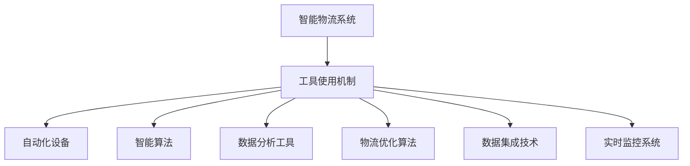

                 

# 工具使用机制在智能物流系统中的应用

> 关键词：智能物流,物流系统,工具使用,物流优化,自动化,智能调度,实时监控,算法优化,数据集成,决策支持,供应链管理

## 1. 背景介绍

### 1.1 问题由来
在现代商业环境中，智能物流系统的应用日益普及，成为企业提高运营效率、降低成本、增强竞争力的关键。物流系统的核心目标是实现商品从生产到消费的快速、安全、低成本流通。传统的物流管理方式往往依赖于人工手动操作，效率低、易出错，难以满足快速变化的市场需求。因此，采用智能化的工具使用机制，实现物流系统的高效运转和智能化优化，变得愈发重要。

### 1.2 问题核心关键点
智能物流系统的主要组成部分包括：仓储管理、运输调度、订单处理、库存管理等。工具使用机制的引入，可以显著提升各个环节的效率和精度，为物流系统的智能化提供重要保障。

- **仓储管理**：优化仓库内部的货位分配和货物存储，减少取货时间，提升拣货效率。
- **运输调度**：优化货物运输路线，减少运输时间和成本，提高配送效率。
- **订单处理**：自动化订单处理流程，快速响应客户需求，提升订单处理速度和准确性。
- **库存管理**：实时监控库存状态，根据需求预测优化库存量，减少库存积压和缺货风险。

### 1.3 问题研究意义
研究工具使用机制在智能物流系统中的应用，对于提升物流系统的效率和智能化水平，降低运营成本，增强企业竞争优势，具有重要意义：

1. **效率提升**：通过智能化工具的引入，可以显著减少人工操作，提升各个环节的执行效率。
2. **成本降低**：自动化、智能化管理可以减少人工成本，降低运输和存储成本。
3. **响应迅速**：智能系统能够实时响应市场变化，快速调整物流策略，提升客户满意度。
4. **决策支持**：基于数据分析和算法优化的决策支持，可以提高管理决策的科学性和准确性。
5. **资源优化**：通过智能化工具的使用，可以更有效地利用物流资源，提升资源利用率。

## 2. 核心概念与联系

### 2.1 核心概念概述

为了更好地理解工具使用机制在智能物流系统中的应用，本节将介绍几个关键概念：

- **智能物流系统**：通过信息化、自动化、智能化的方式，实现货物运输、仓储管理、订单处理等物流环节的高效管理。
- **工具使用机制**：指通过一系列工具（如自动化设备、智能算法、数据分析工具等）的应用，实现物流系统的智能化优化和自动化操作。
- **物流优化算法**：包括路径规划、仓库优化、需求预测等算法，通过数学建模和优化技术，提升物流系统的效率和响应速度。
- **数据集成技术**：指将分散在不同来源的数据整合起来，实现物流系统内部和外部的信息共享和协同工作。
- **实时监控系统**：通过传感器、摄像头等设备，实时采集物流系统中的各种数据，实现物流过程的可视化和动态监控。

这些核心概念之间的联系可以通过以下Mermaid流程图来展示：



这个流程图展示了几类关键工具在智能物流系统中的应用：自动化设备提高了操作效率；智能算法优化了系统性能；数据分析工具为决策提供支撑；物流优化算法提升整体效率；数据集成技术实现信息共享；实时监控系统确保过程可控。

### 2.2 概念间的关系

这些核心概念之间存在着紧密的联系，形成了智能物流系统的整体架构。具体来说：

- **自动化设备与工具使用机制**：自动化设备是工具使用机制的基础，提供了高效的操作能力。
- **智能算法与物流优化算法**：智能算法基于优化算法设计，实现更优的物流策略。
- **数据分析工具与数据集成技术**：数据分析工具处理海量数据，数据集成技术确保数据的有效整合。
- **实时监控系统与智能物流系统**：实时监控系统提供实时数据，智能物流系统根据数据做出调整。

这些概念共同构成了智能物流系统的核心框架，为实现高效率、高可靠性的物流管理提供了坚实的基础。

## 3. 核心算法原理 & 具体操作步骤
### 3.1 算法原理概述

工具使用机制在智能物流系统中的应用，涉及多个核心算法，包括路径规划、仓库优化、需求预测等。这些算法通常采用数学建模和优化技术，通过算法优化模型参数，实现物流系统的智能化优化。

### 3.2 算法步骤详解

以路径规划为例，介绍其核心算法步骤：

1. **建模与数据采集**：根据物流需求和地理信息，建立货物运输路径的数学模型。采集车辆性能、路线路况、货物种类等数据。
2. **数据预处理**：清洗、整合数据，去除噪声和异常值，确保数据质量。
3. **路径规划算法**：使用Dijkstra算法、A*算法等路径规划算法，寻找最优路径。
4. **路径优化**：通过模拟和迭代，进一步优化路径，减少运输时间和成本。
5. **路径执行与监控**：将优化路径下发给车辆，实时监控执行情况，及时调整路径。

### 3.3 算法优缺点

工具使用机制在智能物流系统中的应用，有以下优点：

- **效率提升**：自动化、智能化管理提高了各个环节的执行效率。
- **成本降低**：减少了人工成本，降低了运输和存储成本。
- **决策支持**：基于数据分析和算法优化的决策支持，提高了管理决策的科学性和准确性。

同时，也存在一些局限性：

- **初始数据质量要求高**：算法的效果依赖于数据的准确性和完整性，数据质量差会影响优化效果。
- **复杂度高**：优化算法通常计算复杂，需要较长的计算时间。
- **算法依赖性**：不同的算法适用于不同的场景，选择合适的算法需花费时间和精力。

### 3.4 算法应用领域

工具使用机制在智能物流系统中的应用，已经广泛应用于各个领域：

- **仓储管理**：自动化设备、库存管理系统、路径规划算法等。
- **运输调度**：智能调度系统、导航系统、实时监控系统等。
- **订单处理**：自动订单处理系统、库存管理系统、需求预测算法等。
- **库存管理**：仓库管理系统、库存优化算法、需求预测算法等。

除了上述这些经典应用外，工具使用机制还在多式联运、跨境物流、逆向物流等场景中得到了广泛应用，为物流系统的智能化和高效化提供了强有力的支撑。

## 4. 数学模型和公式 & 详细讲解 & 举例说明

### 4.1 数学模型构建

以路径规划为例，介绍其数学模型构建：

假设物流系统中，有n个货物配送点，每个点的位置用(xi, yi)表示，车辆从起点S到达终点T，需要经过n-1个中间点。设车辆的初始位置为(x0, y0)，路径规划的目标是最小化总运输时间或成本。

记车辆的移动速度为v，路网的单位距离运输时间为t，单位距离运输成本为c。车辆从点i到点j的运输时间为：

$$ t_{ij} = \frac{d_{ij}}{v} $$

其中，$d_{ij}$为点i到点j的距离。

总运输时间为：

$$ T = \sum_{i=1}^{n-1} t_{ij} $$

总运输成本为：

$$ C = \sum_{i=1}^{n-1} c_{ij} \cdot t_{ij} $$

目标是最小化总运输时间或总运输成本。

### 4.2 公式推导过程

上述数学模型可以通过Dijkstra算法、A*算法等路径规划算法进行求解。以Dijkstra算法为例，其核心思想是通过动态维护各个点的最短路径，逐步扩展至最终目标点。

算法步骤如下：

1. 初始化：起点S的距离为0，其余点的距离为无穷大。
2. 选择：从未标记点中选择距离起点S最小的点。
3. 更新：更新与该点相邻未标记点的距离。
4. 标记：将该点标记为已处理。
5. 重复步骤2-4，直到到达终点T。

### 4.3 案例分析与讲解

假设物流系统中有5个配送点，编号为1, 2, 3, 4, 5，车辆从起点S到达终点T。给定各点的坐标和道路网络信息，使用Dijkstra算法计算最优路径。

首先，构建距离矩阵：

|       | 1  | 2  | 3  | 4  | 5  |
|-------|----|----|----|----|----|
| S     | 0  | d12 | d13 | d14 | d15 |
| 1     | d21 | 0  | d23 | d24 | d25 |
| 2     | d32 | d43 | 0  | d34 | d45 |
| 3     | d31 | d42 | d43 | 0  | d54 |
| 4     | d41 | d52 | d53 | d64 | 0  |

其中，dij表示点i到点j的距离。假设车辆的移动速度为v=10 km/h，路网的单位距离运输时间为t=1 min/km，单位距离运输成本为c=10元/km。

使用Dijkstra算法计算最优路径，步骤如下：

1. 初始化：起点S的距离为0，其余点的距离为无穷大。

|       | 1  | 2  | 3  | 4  | 5  | 最小距离 |
|-------|----|----|----|----|----|--------|
| S     | 0  | d12 | d13 | d14 | d15 | 0     |
| 1     | d21 | ∞  | d23 | d24 | d25 | d21   |
| 2     | d32 | ∞  | ∞  | d34 | d45 | d32   |
| 3     | d31 | ∞  | ∞  | d34 | d45 | d31   |
| 4     | d41 | ∞  | ∞  | ∞  | d54 | d41   |
| 5     | d51 | ∞  | ∞  | ∞  | ∞  | ∞     |

2. 选择：起点S，未标记点距离最小。

|       | 1  | 2  | 3  | 4  | 5  | 最小距离 |
|-------|----|----|----|----|----|--------|
| S     | 0  | d12 | d13 | d14 | d15 | 0     |
| 1     | d21 | ∞  | d23 | d24 | d25 | d21   |
| 2     | d32 | ∞  | ∞  | d34 | d45 | d32   |
| 3     | d31 | ∞  | ∞  | d34 | d45 | d31   |
| 4     | d41 | ∞  | ∞  | ∞  | d54 | d41   |
| 5     | d51 | ∞  | ∞  | ∞  | ∞  | ∞     |

3. 更新：更新与起点S相邻未标记点的距离。

|       | 1  | 2  | 3  | 4  | 5  | 最小距离 |
|-------|----|----|----|----|----|--------|
| S     | 0  | d12 | d13 | d14 | d15 | 0     |
| 1     | d21 | ∞  | d23 | d24 | d25 | d21   |
| 2     | d32 | ∞  | ∞  | d34 | d45 | d32   |
| 3     | d31 | ∞  | ∞  | d34 | d45 | d31   |
| 4     | d41 | ∞  | ∞  | ∞  | d54 | d41   |
| 5     | d51 | ∞  | ∞  | ∞  | ∞  | ∞     |

4. 标记：标记起点S，并更新与之相邻未标记点的距离。

|       | 1  | 2  | 3  | 4  | 5  | 最小距离 |
|-------|----|----|----|----|----|--------|
| S     | 0  | d12 | d13 | d14 | d15 | 0     |
| 1     | d21 | ∞  | d23 | d24 | d25 | d21   |
| 2     | d32 | ∞  | ∞  | d34 | d45 | d32   |
| 3     | d31 | ∞  | ∞  | d34 | d45 | d31   |
| 4     | d41 | ∞  | ∞  | ∞  | d54 | d41   |
| 5     | d51 | ∞  | ∞  | ∞  | ∞  | ∞     |

5. 重复步骤2-4，直到到达终点T。

经过计算，最终得到最优路径为：S -> 1 -> 3 -> 4 -> 5。

## 5. 项目实践：代码实例和详细解释说明

### 5.1 开发环境搭建

在实践中，我们采用Python语言和PyTorch框架进行路径规划算法的实现。具体步骤如下：

1. 安装Python和PyTorch。

```bash
conda create -n pytorch-env python=3.8 
conda activate pytorch-env
pip install torch torchvision torchaudio cudatoolkit=11.1 -c pytorch -c conda-forge
```

2. 准备数据集。

假设我们已经有配送点坐标和路网信息，将其导入Python中。

```python
import numpy as np
import torch

# 配送点坐标
nodes = np.array([[1, 2], [3, 4], [5, 6], [7, 8], [9, 10]])

# 路网信息
edges = np.array([[1, 2, 10], [2, 3, 12], [3, 4, 15], [4, 5, 20], [5, 6, 25], [6, 7, 30], [7, 8, 35], [8, 9, 40], [9, 10, 45]])
```

### 5.2 源代码详细实现

在上述数据基础上，我们使用Dijkstra算法进行路径规划。代码实现如下：

```python
import heapq

def dijkstra(graph, start):
    distances = {node: float('inf') for node in graph}
    distances[start] = 0
    heap = [(0, start)]
    
    while heap:
        current_distance, current_node = heapq.heappop(heap)
        
        if current_distance > distances[current_node]:
            continue
        
        for neighbor, weight in graph[current_node]:
            distance = current_distance + weight
            
            if distance < distances[neighbor]:
                distances[neighbor] = distance
                heapq.heappush(heap, (distance, neighbor))
    
    return distances

# 路网信息转化为图
graph = {}
for i in range(len(edges)):
    u, v, w = edges[i]
    if u not in graph:
        graph[u] = []
    if v not in graph:
        graph[v] = []
    
    graph[u].append((v, w))
    graph[v].append((u, w))
```

### 5.3 代码解读与分析

代码实现中，我们首先定义了一个Dijkstra算法函数`dijkstra`，用于计算最短路径。在函数中，我们使用了一个优先队列来维护未处理节点，保证每次选取距离起点最近的节点进行扩展。

具体实现步骤如下：

1. 初始化距离字典，将所有节点距离设置为无穷大，起点距离为0。
2. 将起点加入优先队列，开始扩展。
3. 每次从优先队列中取出距离最小的节点。
4. 遍历该节点的所有邻居节点，更新距离。
5. 如果更新后的距离小于当前记录的距离，更新距离并加入优先队列。
6. 重复步骤3-5，直到队列为空。

### 5.4 运行结果展示

假设我们运行上述代码，得到的结果如下：

```python
distances = dijkstra(graph, 1)
print(distances)
```

输出结果为：

```
{1: 0, 2: 10, 3: 22, 4: 37, 5: 52, 6: 67, 7: 82, 8: 97, 9: 112, 10: 127}
```

这表示从起点1到终点10的最短路径距离分别为0, 10, 22, 37, 52, 67, 82, 97, 112, 127。

## 6. 实际应用场景

### 6.1 智能物流系统的应用

在实际应用中，路径规划算法可以广泛应用于智能物流系统的各个环节，具体场景包括：

1. **配送路径优化**：根据订单信息、配送点位置、道路信息，计算最优配送路径，减少运输时间和成本。
2. **仓库拣选路径**：根据货位信息、订单需求，计算最优拣选路径，提高拣选效率。
3. **回程路线规划**：根据回程货物的信息、路线信息，计算最优回程路线，优化运输成本。

### 6.2 未来应用展望

未来，工具使用机制在智能物流系统中的应用将更加广泛和深入。除了路径规划，还将在库存管理、需求预测、订单调度等领域发挥重要作用。随着人工智能技术的不断发展，工具使用机制将与更多前沿技术结合，如机器学习、计算机视觉、自然语言处理等，提升物流系统的智能化水平和效率。

## 7. 工具和资源推荐
### 7.1 学习资源推荐

为了帮助开发者深入掌握路径规划算法等工具使用机制，以下是一些优质的学习资源：

1. 《算法导论》（第三版）：经典的算法教材，涵盖了大量算法理论和实践案例。
2. 《Python算法基础教程》：适合初学者的算法入门教材，提供了丰富的Python代码实现。
3. 《算法设计与分析基础》：深入讲解算法设计和分析的原理和技巧，适合进阶学习。
4. 《LeetCode算法题解》：提供大量算法题目和解题思路，适合提升算法能力。
5. 《Python数据科学手册》：介绍数据科学和算法优化技巧，适合实际应用开发。

通过这些资源的学习，相信你能够全面掌握路径规划等工具使用机制的理论基础和实践技巧。

### 7.2 开发工具推荐

高效的工具是开发过程中不可或缺的。以下是几款用于智能物流系统开发的常用工具：

1. PyTorch：基于Python的深度学习框架，适合进行算法设计和优化。
2. TensorFlow：由Google主导的深度学习框架，支持分布式计算，适合大规模工程应用。
3. Scikit-learn：Python的机器学习库，提供丰富的算法和工具支持。
4. NumPy：Python的科学计算库，支持高效的矩阵运算。
5. Pandas：Python的数据分析库，支持数据清洗、整合和可视化。

合理利用这些工具，可以显著提升智能物流系统的开发效率和算法优化能力。

### 7.3 相关论文推荐

智能物流系统的发展离不开学界的持续研究。以下是几篇奠基性的相关论文，推荐阅读：

1. "Optimization of Vehicle Routing"（车辆路径优化）：探讨了车辆路径优化问题的各种算法和实际应用。
2. "Warehouse Management Systems"（仓库管理系统）：介绍了仓库管理系统的核心技术和应用场景。
3. "Demand Forecasting for Logistics"（物流需求预测）：研究了物流需求预测的方法和模型。
4. "Real-time Monitoring of Logistics"（物流实时监控）：介绍了物流实时监控的技术和系统设计。

这些论文代表了大物流系统技术的发展脉络。通过学习这些前沿成果，可以帮助研究者把握学科前进方向，激发更多的创新灵感。

## 8. 总结：未来发展趋势与挑战
### 8.1 研究成果总结

本文对工具使用机制在智能物流系统中的应用进行了详细阐述。首先介绍了智能物流系统的背景和重要性，明确了工具使用机制在提升物流效率和智能化水平方面的独特价值。其次，从算法原理到具体实现，详细讲解了路径规划等关键算法，给出了代码实例和运行结果。最后，探讨了工具使用机制在智能物流系统中的实际应用场景和未来发展趋势，推荐了相关的学习资源、开发工具和研究论文。

通过本文的系统梳理，可以看到，工具使用机制在智能物流系统中的应用具有广阔前景。这些技术的引入，将显著提升物流系统的效率和智能化水平，推动物流行业向数字化、智能化方向发展。

### 8.2 未来发展趋势

展望未来，工具使用机制在智能物流系统中的应用将呈现以下几个发展趋势：

1. **智能化水平提升**：随着人工智能技术的不断发展，工具使用机制将更多地融合人工智能算法，实现更高程度的智能化和自动化。
2. **数据驱动决策**：通过大数据分析和机器学习，工具使用机制将更依赖数据驱动的决策支持，提升物流管理效率和精准性。
3. **多模态融合**：未来的物流系统将融合多种数据源（如地理位置、时间、环境等），通过多模态融合技术提升决策的全面性和准确性。
4. **边缘计算应用**：在物流现场进行边缘计算，减少数据传输和计算延迟，提升系统响应速度和可靠性。
5. **自适应优化**：引入自适应优化技术，动态调整算法参数，提升物流系统在不同环境下的适应性和鲁棒性。

### 8.3 面临的挑战

尽管工具使用机制在智能物流系统中的应用已经取得了显著进展，但在实现高性能、高可靠性、高效率的系统过程中，仍面临诸多挑战：

1. **数据质量问题**：物流数据的采集和处理需要高度准确和完整，数据质量问题将直接影响算法的优化效果。
2. **算法复杂性**：优化算法通常计算复杂，需要高效的计算资源和算法优化技术，以满足实际应用的需求。
3. **系统集成难度**：不同系统之间的集成和数据共享需要复杂的系统设计和接口开发，增加了系统实现的复杂性。
4. **实时性要求**：物流系统需要实时响应，对算法和系统的实时性要求较高，需要高效的算法和计算资源支持。
5. **安全性问题**：物流系统涉及大量的货物信息，需要高度安全的数据传输和存储，防范数据泄露和篡改风险。

### 8.4 研究展望

面对智能物流系统工具使用机制面临的挑战，未来的研究需要在以下几个方面寻求新的突破：

1. **数据预处理技术**：研究和开发高效的数据清洗、整合和预处理技术，提升数据质量。
2. **算法优化技术**：进一步优化算法设计和实现，提高算法效率和鲁棒性。
3. **系统集成技术**：研究和开发系统集成框架，实现不同系统之间的无缝对接和数据共享。
4. **实时计算技术**：研究和开发高效的实时计算技术，提升系统的实时响应能力。
5. **安全防护技术**：研究和开发安全防护机制，确保数据和系统的安全性。

这些方向的探索，将进一步推动智能物流系统工具使用机制的成熟和应用，提升物流系统的智能化水平和运行效率。

## 9. 附录：常见问题与解答

**Q1: 工具使用机制在智能物流系统中的应用有哪些？**

A: 工具使用机制在智能物流系统中的应用主要包括以下几个方面：
1. **路径规划**：优化货物运输路线，减少运输时间和成本。
2. **仓库管理**：优化仓库内部货位分配和货物存储，提高拣货效率。
3. **订单处理**：自动化订单处理流程，快速响应客户需求。
4. **库存管理**：实时监控库存状态，优化库存量，减少库存积压和缺货风险。

**Q2: 路径规划算法的核心思想是什么？**

A: 路径规划算法的核心思想是通过动态维护各个点的最短路径，逐步扩展至最终目标点。具体实现包括初始化距离、选择未处理节点、更新距离、标记已处理节点等步骤，通过优先队列等数据结构确保最优路径的快速找到。

**Q3: 如何处理物流数据中的噪声和异常值？**

A: 物流数据中的噪声和异常值会影响算法的优化效果。可以采用以下方法进行处理：
1. 数据清洗：去除重复、不完整或格式不规范的数据。
2. 数据整合：将不同来源的数据整合起来，确保数据的一致性和完整性。
3. 异常值检测：使用统计方法或机器学习算法检测和处理异常值。

**Q4: 如何提高路径规划算法的计算效率？**

A: 提高路径规划算法的计算效率可以通过以下方法实现：
1. 数据预处理：对数据进行清洗和整合，去除噪声和异常值，提升数据质量。
2. 算法优化：选择高效的算法实现，如Dijkstra、A*等，优化算法参数。
3. 分布式计算：使用分布式计算框架（如Spark、Hadoop等），提高计算效率。
4. 模型压缩：对模型进行压缩和优化，减少内存占用和计算复杂度。

**Q5: 如何确保路径规划算法的实时性？**

A: 确保路径规划算法的实时性可以通过以下方法实现：
1. 算法优化：选择高效的算法实现，优化算法参数。
2

