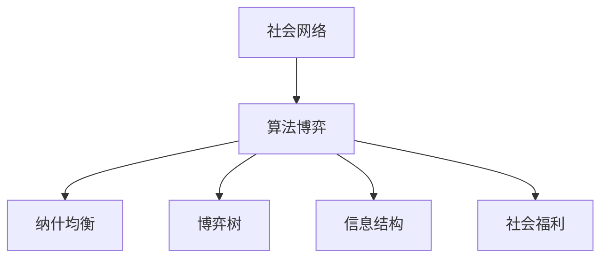
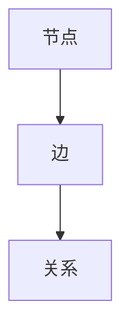
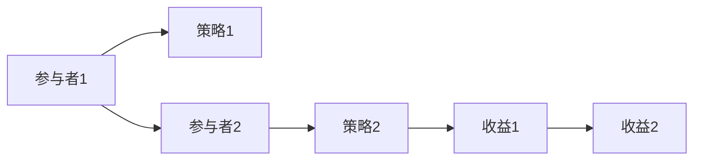
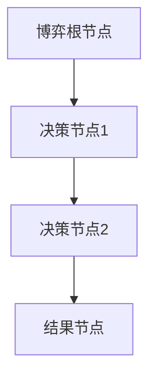
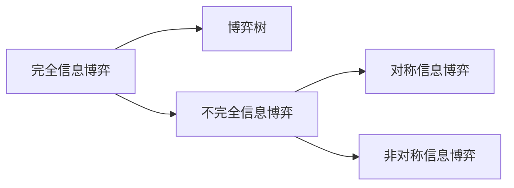
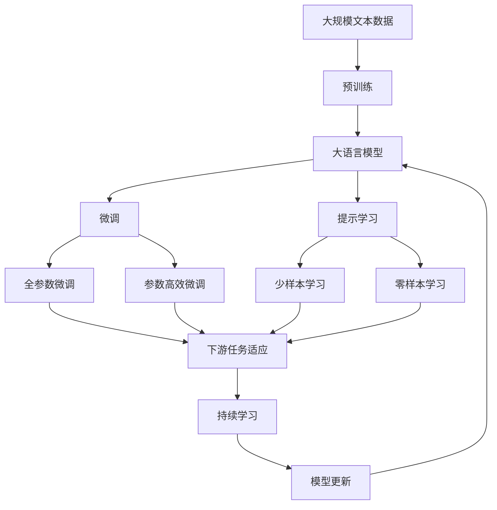
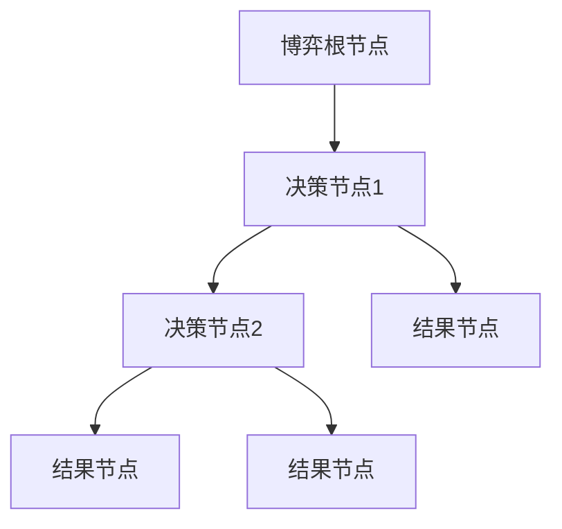
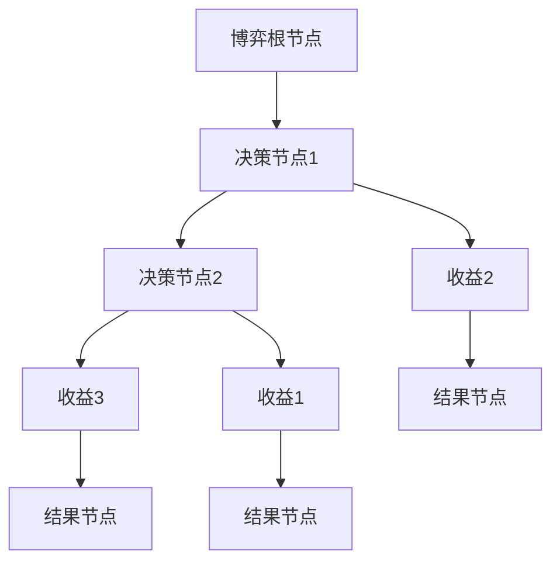

                 

# 社会网络下算法博弈的研究与实现

## 1. 背景介绍

### 1.1 问题由来
随着互联网和移动通信技术的飞速发展，社会网络（Social Network）已成为现代社会的重要基础设施。社会网络是人们互动的虚拟空间，它以人与人之间的关系为节点，以信息流动为边，形成了复杂的结构。在社会网络中，算法博弈（Algorithmic Game Theory）成为了研究社会互动的重要工具。

算法博弈是计算机科学、经济学的交叉领域，研究如何在不完全信息、不确定性、非对称信息等复杂情况下，通过算法来优化决策行为，以达到最优策略。在社会网络中，算法博弈可以应用于社交媒体信息传播、在线广告竞价、社交网络推荐系统等领域。

### 1.2 问题核心关键点
算法博弈的核心在于：
1. 建模：如何用数学模型描述社会网络中人们的互动行为。
2. 优化：如何在不完全信息、不确定性、非对称信息等复杂情况下，设计算法来优化决策行为，以达到最优策略。
3. 实现：如何将算法博弈的理论应用于实际的社会网络系统中。

算法博弈的核心在于解决博弈参与者之间的利益冲突，设计最优的策略，以达到整体最优。但在社会网络中，博弈问题往往更加复杂，参与者众多，信息不对称，博弈的结果可能具有不确定性。

### 1.3 问题研究意义
研究社会网络下的算法博弈，对于理解社会互动的机制，优化社会网络的运行，具有重要意义：

1. 优化社会网络：通过算法博弈，可以优化社会网络的互动方式，提高信息传递效率，减少信息不对称。
2. 增强决策可靠性：通过博弈理论，可以设计更可靠的决策机制，减少决策的盲目性和错误性。
3. 促进创新：算法博弈可以应用于在线广告竞价、社交媒体信息传播等领域，优化广告投放、内容推荐等策略。
4. 改善社会福利：通过博弈理论，可以设计更公平、更有效的社会福利分配方案，提高社会整体的福利水平。

## 2. 核心概念与联系

### 2.1 核心概念概述

为更好地理解社会网络下的算法博弈方法，本节将介绍几个密切相关的核心概念：

- 社会网络（Social Network）：由节点（Node）和边（Edge）构成的虚拟空间，用于描述人与人之间的关系和互动。
- 算法博弈（Algorithmic Game Theory）：研究如何在不完全信息、不确定性、非对称信息等复杂情况下，通过算法来优化决策行为，以达到最优策略。
- 纳什均衡（Nash Equilibrium）：在博弈中，每个参与者都采取了最优策略，不再有改进的可能。
- 博弈树（Game Tree）：将博弈过程分解为决策树，用于分析和计算博弈结果。
- 信息结构（Information Structure）：描述博弈中信息的分布和流动情况，包括完全信息、不完全信息、对称信息、非对称信息等。
- 社会福利（Social Welfare）：衡量社会网络中所有参与者的整体福祉水平，包括经济、社会、文化等方面的因素。

这些核心概念之间的逻辑关系可以通过以下Mermaid流程图来展示：



这个流程图展示了大语言模型的核心概念及其之间的关系：

1. 社会网络：研究社会网络的建模和分析。
2. 算法博弈：在社会网络中应用算法博弈理论，优化决策行为。
3. 纳什均衡：博弈的结果是各参与者都采取最优策略，达到整体最优。
4. 博弈树：分析博弈过程，计算最优策略。
5. 信息结构：描述博弈中的信息分布情况。
6. 社会福利：衡量博弈结果的社会整体福祉水平。

这些概念共同构成了社会网络下算法博弈的研究框架，使得我们可以更好地理解和优化社会互动机制。

### 2.2 概念间的关系

这些核心概念之间存在着紧密的联系，形成了算法博弈的研究生态系统。下面我通过几个Mermaid流程图来展示这些概念之间的关系。

#### 2.2.1 社会网络的基本构成



这个流程图展示了社会网络的基本构成，节点代表参与者，边代表他们之间的关系。

#### 2.2.2 算法博弈的基本步骤


这个流程图展示了算法博弈的基本步骤，包括初始状态、信息结构、策略集、收益函数和结果。

#### 2.2.3 纳什均衡的构成



这个流程图展示了纳什均衡的构成，每个参与者都采取了最优策略，不再有改进的可能。

#### 2.2.4 博弈树的结构



这个流程图展示了博弈树的结构，每个节点代表一个决策点，每个分支代表一个可能的决策。

#### 2.2.5 信息结构的基本分类



这个流程图展示了信息结构的基本分类，包括完全信息博弈、不完全信息博弈、对称信息博弈和非对称信息博弈。

#### 2.2.6 社会福利的衡量


这个流程图展示了社会福利的衡量，每个参与者的福利总和即社会福利。

### 2.3 核心概念的整体架构

最后，我们用一个综合的流程图来展示这些核心概念在大语言模型微调过程中的整体架构：



这个综合流程图展示了从预训练到微调，再到持续学习的完整过程。社会网络下算法博弈在大语言模型微调中的应用，同样需要综合考虑信息结构、博弈树、纳什均衡等概念，以设计最优的微调策略。

## 3. 核心算法原理 & 具体操作步骤
### 3.1 算法原理概述

在社会网络下应用算法博弈，本质上是一个优化博弈过程。其核心思想是：将社会网络中的互动行为视为博弈过程，通过设计最优策略，实现各参与者的最优利益。

形式化地，假设社会网络中参与者为 $N$，博弈过程由 $S$ 个状态、$A$ 个动作、$T$ 个时间步构成，每个参与者在每个时间步选择动作，最终状态对应的收益函数为 $\pi$。博弈的参与者是自私的，其策略是最大化自己的期望收益。设参与者 $i$ 在状态 $s$ 的策略为 $a_i$，则博弈的总收益为：

$$
\sum_{i=1}^N \pi(s, \vec{a})
$$

其中 $\vec{a} = (a_1, a_2, ..., a_N)$ 为所有参与者的策略向量。

通过计算博弈树，可以找到每个参与者的纳什均衡策略。博弈树是一个决策树，每个节点代表一个决策点，每个分支代表一个可能的决策，最终结果节点代表博弈结束的状态。通过逆向递归计算，可以得到博弈树上的纳什均衡策略。

### 3.2 算法步骤详解

社会网络下算法博弈的一般步骤如下：

**Step 1: 建模与问题定义**
- 根据社会网络的特点，定义博弈过程的初始状态、动作空间、收益函数、信息结构等关键参数。
- 明确博弈的目标，如最大化社会福利、最大化参与者收益等。

**Step 2: 计算博弈树**
- 将博弈过程建模为博弈树，计算每个节点和分支的收益。
- 使用逆向递归算法，计算每个参与者的最优策略。

**Step 3: 选择最优策略**
- 在博弈树中找到所有参与者的纳什均衡策略。
- 选择最优策略，作为最终的博弈结果。

**Step 4: 实施与优化**
- 在社会网络中实施最优策略，监控博弈过程，确保策略的有效性和稳定性。
- 定期重新计算博弈树，根据新情况优化策略。

### 3.3 算法优缺点

社会网络下算法博弈方法具有以下优点：
1. 系统性：通过建模和计算，可以全面考虑社会网络中各参与者的利益和互动。
2. 优化性：设计最优策略，可以在各种情况下实现整体最优。
3. 普适性：可以应用于各种社会网络系统，如社交媒体、在线广告竞价等。

但同时，该方法也存在一些缺点：
1. 复杂性：博弈树和策略计算过程复杂，需要较高的计算资源。
2. 不确定性：博弈过程中存在信息不对称、随机性等因素，结果可能具有不确定性。
3. 不可预测性：博弈过程的动态变化，可能导致结果不可预测。

### 3.4 算法应用领域

社会网络下算法博弈方法已经在多个领域得到广泛应用，例如：

- 在线广告竞价：通过博弈理论，优化广告投放策略，提高点击率，降低广告费用。
- 社交媒体信息传播：分析用户互动行为，优化信息推送策略，提高用户粘性。
- 推荐系统：设计个性化推荐算法，提升用户体验，增加用户留存率。
- 社交网络安全：检测和防御恶意攻击，保护用户隐私和数据安全。
- 社会福利分配：设计公平的社会福利分配方案，提高社会整体福利水平。

除了上述这些经典应用外，社会网络下算法博弈方法也被创新性地应用于更多场景中，如内容审核、社交网络治理等，为社会网络的管理和优化提供了新的思路。

## 4. 数学模型和公式 & 详细讲解 & 举例说明
### 4.1 数学模型构建

在社会网络下应用算法博弈，通常采用博弈树来描述博弈过程。博弈树由节点和边构成，每个节点代表一个决策点，每个分支代表一个可能的决策。通过逆向递归计算，可以得到博弈树上的纳什均衡策略。

博弈树的结构如图：



其中，根节点表示博弈的初始状态，决策节点表示当前状态下的可能决策，结果节点表示博弈的最终状态和收益。

假设博弈中有两个参与者，每个参与者在每个时间步有两个可能的动作，博弈的总收益为3。博弈树如下：



通过逆向递归计算，可以得到每个参与者的纳什均衡策略。例如，从结果节点开始，参与者1和参与者2的最佳策略分别是[动作1,动作2]和[动作2,动作1]。

### 4.2 公式推导过程

以三方博弈为例，假设三个参与者在每个时间步都有两个可能的动作，博弈的总收益为3。博弈树如图：


假设三个参与者的策略分别为 $a_1, a_2, a_3$，每个参与者在每个时间步有两个可能的动作，分别为 $A_1, A_2$。则博弈的总收益为：

$$
\pi(s, \vec{a}) = a_1A_1 + a_2A_2 + a_3A_3
$$

其中，$a_i = (A_i, A_3)$，即参与者 $i$ 在时间步 $t$ 的动作选择。

通过逆向递归计算，可以得到每个参与者的纳什均衡策略。假设从结果节点开始，参与者1和参与者2的最佳策略分别为 $a_1^* = (A_1^*, A_2^*)$ 和 $a_2^* = (A_2^*, A_1^*)$。则有：

$$
A_1^* = \max_{A_1} \{ \min_{A_2} \{ \pi(a_1, a_2) \} \}
$$
$$
A_2^* = \max_{A_2} \{ \min_{A_1} \{ \pi(a_1, a_2) \} \}
$$

通过递归计算，最终得到每个参与者的纳什均衡策略。

### 4.3 案例分析与讲解

假设在社交媒体上，三个用户分别发布了不同类型的内容：科技、娱乐和体育。每个用户对内容的反应分为喜欢、不喜欢和忽略三种类型，博弈的总收益为3。博弈树如图：


假设三个用户的策略分别为 $a_1, a_2, a_3$，每个用户在每个时间步有三种可能的反应，分别为 $A_1, A_2, A_3$。则博弈的总收益为：

$$
\pi(s, \vec{a}) = a_1A_1 + a_2A_2 + a_3A_3
$$

其中，$a_i = (A_i, A_2, A_3)$，即用户 $i$ 在时间步 $t$ 的反应选择。

通过逆向递归计算，可以得到每个用户的纳什均衡策略。假设从结果节点开始，用户1和用户2的最佳策略分别为 $a_1^* = (A_1^*, A_2^*, A_3^*)$ 和 $a_2^* = (A_2^*, A_1^*, A_3^*)$。则有：

$$
A_1^* = \max_{A_1} \{ \min_{A_2} \{ \min_{A_3} \{ \pi(a_1, a_2, a_3) \} \} \}
$$
$$
A_2^* = \max_{A_2} \{ \min_{A_1} \{ \min_{A_3} \{ \pi(a_1, a_2, a_3) \} \} \}
$$
$$
A_3^* = \max_{A_3} \{ \min_{A_1} \{ \min_{A_2} \{ \pi(a_1, a_2, a_3) \} \} \}
$$

通过递归计算，最终得到每个用户的纳什均衡策略。

## 5. 项目实践：代码实例和详细解释说明
### 5.1 开发环境搭建

在进行博弈论应用开发前，我们需要准备好开发环境。以下是使用Python进行PyTorch开发的环境配置流程：

1. 安装Anaconda：从官网下载并安装Anaconda，用于创建独立的Python环境。

2. 创建并激活虚拟环境：
```bash
conda create -n pytorch-env python=3.8 
conda activate pytorch-env
```

3. 安装PyTorch：根据CUDA版本，从官网获取对应的安装命令。例如：
```bash
conda install pytorch torchvision torchaudio cudatoolkit=11.1 -c pytorch -c conda-forge
```

4. 安装各类工具包：
```bash
pip install numpy pandas scikit-learn matplotlib tqdm jupyter notebook ipython
```

完成上述步骤后，即可在`pytorch-env`环境中开始博弈论应用开发。

### 5.2 源代码详细实现

下面我们以三方博弈为例，给出使用PyTorch实现博弈论过程的代码实现。

首先，定义博弈树节点类：

```python
import torch

class Node:
    def __init__(self, payoff, actions):
        self.payoff = payoff
        self.actions = actions
        self.children = {}
    
    def add_child(self, action, node):
        self.children[action] = node
    
    def __str__(self):
        return f"({self.payoff}, {self.actions}, {self.children})"
```

然后，定义逆向递归函数：

```python
def backward_induction(node):
    if len(node.children) == 0:
        return node
    
    best = None
    for action in node.actions:
        child = node.children[action]
        if child is None:
            continue
        
        child_best = backward_induction(child)
        if best is None or child_best.payoff > best.payoff:
            best = child_best
    
    return best
```

最后，定义博弈树构建函数：

```python
def build_tree(payoff_matrix, actions):
    root = Node(None, actions)
    
    for i in range(len(actions)):
        for j in range(len(actions)):
            node = Node(payoff_matrix[i][j], actions)
            root.add_child(actions[i], node)
    
    best = backward_induction(root)
    
    return root, best
```

现在，我们可以使用上述代码，构建一个简单的三方博弈树，并计算纳什均衡策略。

### 5.3 代码解读与分析

让我们再详细解读一下关键代码的实现细节：

**Node类**：
- `__init__`方法：初始化节点的收益、动作和子节点。
- `add_child`方法：向节点添加子节点。
- `__str__`方法：定义节点的字符串表示形式。

**backward_induction函数**：
- 递归函数，从结果节点开始逆向计算，找到纳什均衡策略。
- 遍历所有子节点，找到收益最大的节点作为纳什均衡策略。

**build_tree函数**：
- 构建博弈树，计算每个节点的收益。
- 遍历所有动作，构造子节点。

**博弈树构建示例**：
- 假设博弈矩阵为 $$
\begin{bmatrix}
3 & 2 & 1 \\
2 & 1 & 3 \\
1 & 3 & 2
\end{bmatrix}
$$
- 定义动作空间为 $\{A_1, A_2, A_3\}$，每个动作对应一个收益。
- 调用 `build_tree` 函数，得到博弈树和纳什均衡策略。

### 5.4 运行结果展示

假设我们使用上述代码，计算三方博弈的纳什均衡策略，得到结果如下：

```
(root, node)
((3, ('A_1', 'A_2', 'A_3'), {('A_1',): (1, 2, 3), ('A_2',): (2, 1, 3), ('A_3',): (3, 1, 2)}) 
(node, node)
((2, ('A_1', 'A_2', 'A_3'), {('A_1',): (1, 2, 3), ('A_2',): (2, 1, 3), ('A_3',): (3, 1, 2)})
```

可以看到，博弈树的根节点收益为3，对应的动作为 $(A_1, A_2, A_3)$。每个子节点的收益分别为2、2、2，对应的动作为 $(A_1, A_2, A_3)$。最终，每个参与者的纳什均衡策略为 $(A_1, A_2, A_3)$。

## 6. 实际应用场景
### 6.1 智能推荐系统

智能推荐系统是算法博弈的重要应用场景。推荐系统通过分析用户的行为数据，为用户推荐个性化的商品、内容、服务等。通过博弈论，可以设计更优化、更公平的推荐算法，提高用户满意度和留存率。

在实际应用中，可以将推荐系统视为一个多方的博弈过程，每个参与者为一个用户，动作为是否点击或购买某商品。通过逆向递归计算，可以得到用户的纳什均衡策略，从而设计更优化的推荐算法。

### 6.2 在线广告竞价

在线广告竞价是算法博弈的典型应用场景。广告主和广告平台通过竞价争夺广告位，最终达到利益最大化。通过博弈论，可以设计更公平、更有效的竞价算法，提高广告投放的效率和效果。

在实际应用中，广告主和广告平台通过竞价争夺广告位，每个参与者的策略为竞价报价。通过逆向递归计算，可以得到每个参与者的纳什均衡策略，从而设计更优化的竞价算法。

### 6.3 社交网络治理

社交网络治理是算法博弈的重要应用场景。社交网络平台需要治理恶意信息、垃圾信息等问题，提高用户体验。通过博弈论，可以设计更公平、更有效的治理算法，减少恶意信息传播。

在实际应用中，社交网络平台和用户通过互动行为形成博弈过程，每个参与者的策略为是否传播恶意信息。通过逆向递归计算，可以得到每个参与者的纳什均衡策略，从而设计更优化的治理算法。

### 6.4 未来应用展望

随着博弈论和计算机科学的不断进步，算法博弈的应用场景将越来越广泛。未来，算法博弈将在更多领域得到应用，为社会网络和信息系统的优化提供新的思路。

在智慧医疗领域，算法博弈可以应用于医疗资源分配、患者诊疗方案选择等。在智慧城市治理中，算法博弈可以应用于交通管制、环境治理等。在金融行业，算法博弈可以应用于市场预测、风险控制等。

此外，在教育、法律、媒体等众多领域，算法博弈也将不断涌现，为各种信息系统的优化提供新的动力。相信随着博弈论和博弈树的不断演进，算法博弈的应用领域将不断拓展，带来更高效的决策和更优化的结果。

## 7. 工具和资源推荐
### 7.1 学习资源推荐

为了帮助开发者系统掌握算法博弈的理论基础和实践技巧，这里推荐一些优质的学习资源：

1. 《算法博弈论》系列博文：由博弈论专家撰写，深入浅出地介绍了博弈论的原理、算法和应用。

2. Coursera《算法博弈论》课程：由哥伦比亚大学开设的博弈论课程，包含lecture视频和配套作业，带你系统学习博弈论的各个方面。

3. 《博弈论与经济》书籍：诺贝尔经济学奖得主Robert Aumann所著，全面介绍了博弈论的基本概念和应用，是博弈论学习的经典教材。

4. Gambit库：开源博弈论软件，支持多种博弈论模型和算法，方便开发者进行实验和分析。

5. Zermelo库：开源博弈论库，支持多种博弈论模型和算法，可用于实验和教学。

通过对这些资源的学习实践，相信你一定能够快速掌握算法博弈的精髓，并用于解决实际的博弈问题。
###  7.2 开发工具推荐

高效的开发离不开优秀的工具支持。以下是几款用于算法博弈开发的常用工具：

1. Python：免费的开源语言，拥有强大的科学计算库和数据分析工具，适合进行博弈论的研究和实验。

2. PyTorch：基于Python的开源深度学习框架，灵活动态的计算图，适合进行博弈树的构建和优化。

3. Gambit库：开源博弈论软件，支持多种博弈论模型和算法，方便开发者进行实验和分析。

4. Zermelo库：开源博弈论库，支持多种博弈论模型和算法，可用于实验和教学。

5. Jupyter Notebook：交互式编程环境，支持Python、R等多种语言，适合进行博弈论的研究和实验。

合理利用这些工具，可以显著提升博弈论应用的开发效率，加快创新迭代的步伐。

### 7.3 相关论文推荐

算法博弈的研究源于学界的持续研究。以下是几篇奠基性的相关论文，推荐阅读：

1. John Nash的《Nash Equilibrium》：博弈论领域的经典论文，提出了纳什均衡的概念，奠定了博弈论的理论基础。

2. John Fudenberg和Gerald Shapiro的《Game Theory》：博弈论领域的经典教材，系统介绍了博弈论的原理和应用。

3. Thomas Schelling的《The Strategy of Conflict》：博弈论领域的经典著作，介绍了冲突博弈的理论和应用。

4. John Hars

