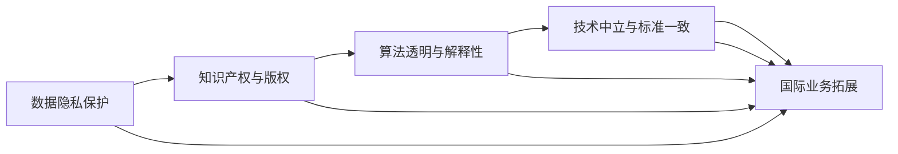
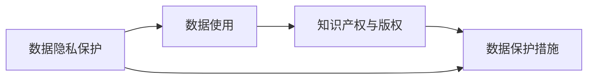
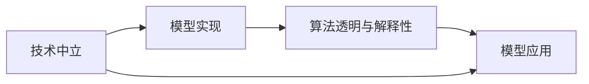
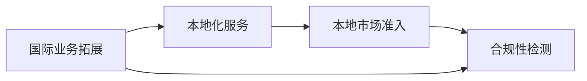
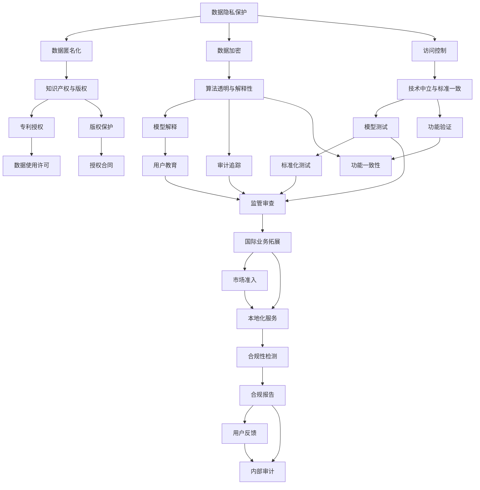

                 

# 大模型企业的国际化合规

在人工智能技术的迅猛发展下，大语言模型（Large Language Model, LLMs）等人工智能模型的应用范围和影响力不断扩大。随着国际业务和市场需求的增加，企业不仅需要关注模型的技术性能，更需要遵守各国法律法规，确保模型在全球范围内的合规性。本文将深入探讨大模型企业在国际化合规方面面临的挑战、关键技术和最佳实践，为未来大模型企业的国际化合规之路提供指引。

## 1. 背景介绍

### 1.1 问题由来
随着全球化和数字化的推进，大语言模型被广泛应用于商业智能、自动翻译、情感分析等多个领域。但不同国家在数据隐私、知识产权、版权保护等方面有不同法规，这对大模型企业的国际业务拓展提出了新的挑战。如何确保模型在多个国家合规运营，成为大模型企业国际化战略的重要考量。

### 1.2 问题核心关键点
大模型企业在国际化合规方面需要重点关注以下几点：
1. **数据隐私与保护**：确保用户数据在不同国家遵守相应隐私法规，如GDPR、CCPA等。
2. **知识产权与版权**：处理模型训练所使用的数据、算法和模型等知识产权问题。
3. **版权保护**：在模型中使用第三方的文本、语音等素材时，需要获得相应的版权授权。
4. **算法透明与解释性**：满足不同国家对模型决策过程的透明度和可解释性要求。
5. **技术中立与标准一致**：确保模型在不同国家的技术实现和应用效果一致，避免歧义。

### 1.3 问题研究意义
对大模型企业的国际化合规进行深入研究，对于保障模型全球化应用、促进国际技术合作、提升企业国际竞争力具有重要意义：
1. **风险规避**：避免因合规问题导致的法律风险和市场制裁。
2. **用户信任**：建立全球用户对模型合规性的信任，增强品牌影响力和市场份额。
3. **市场准入**：确保模型在各国市场准入和应用，促进国际业务的拓展。
4. **技术进步**：通过合规实践不断优化模型，提升技术水平和应用效果。

## 2. 核心概念与联系

### 2.1 核心概念概述

为更好地理解大模型企业在国际化合规方面面临的核心概念和挑战，本节将介绍几个关键概念：

- **数据隐私保护**：指保护用户数据不被非法收集、使用或泄露的措施，包括数据匿名化、数据加密、访问控制等。
- **知识产权与版权**：指保护创新成果不被非法复制、使用或传播的权利，包括专利、著作权、商业秘密等。
- **算法透明与解释性**：指模型的决策过程应具备可理解性和可解释性，使模型行为透明，便于监管和用户理解。
- **技术中立与标准一致**：指模型在不同国家具有相同的功能和性能，避免因技术实现不同导致的歧义。
- **国际业务拓展**：指大模型企业在全球范围内扩展业务，包括市场进入、合作伙伴选择、本地化服务等。

这些概念之间的逻辑关系可以通过以下Mermaid流程图来展示：



这个流程图展示了大模型企业国际化合规的关键概念及其之间的关系：

1. 数据隐私保护是基础，确保用户数据安全。
2. 知识产权与版权保护数据使用的合法性。
3. 算法透明与解释性是核心，确保模型决策透明。
4. 技术中立与标准一致是保障，确保模型全球一致。
5. 国际业务拓展是目标，确保模型在全球范围内应用。

### 2.2 概念间的关系

这些核心概念之间存在着紧密的联系，构成了大模型企业国际化合规的完整生态系统。下面我们通过几个Mermaid流程图来展示这些概念之间的关系。

#### 2.2.1 数据隐私保护与知识产权



这个流程图展示了数据隐私保护与知识产权之间的逻辑关系。数据隐私保护通过保护用户数据，确保数据使用合规。同时，保护知识产权也要求对数据的使用方式进行控制，避免侵犯第三方权益。

#### 2.2.2 技术中立与算法透明



这个流程图展示了技术中立与算法透明之间的关系。技术中立确保模型在不同国家的技术实现一致，算法透明则要求模型的决策过程具备可解释性，便于监管和用户理解。

#### 2.2.3 国际业务拓展与本地化服务



这个流程图展示了国际业务拓展与本地化服务之间的关系。国际业务拓展需要通过本地化服务满足不同市场的需求，本地市场准入要求模型遵守本地法律法规，合规性检测则确保模型在全球范围内的合规性。

### 2.3 核心概念的整体架构

最后，我们用一个综合的流程图来展示这些核心概念在大模型企业国际化合规过程中的整体架构：



这个综合流程图展示了从数据隐私保护到国际业务拓展的完整过程。大模型企业需要在数据隐私保护、知识产权与版权、算法透明与解释性、技术中立与标准一致等多个方面进行全面优化，才能确保模型在全球范围内的合规性，并成功拓展国际业务。

## 3. 核心算法原理 & 具体操作步骤

### 3.1 算法原理概述

大模型企业在国际化合规方面，主要通过算法和技术手段实现。算法原理涉及以下几个方面：

1. **数据隐私保护**：采用差分隐私、联邦学习等算法，确保数据在保护隐私的前提下进行训练。
2. **知识产权与版权**：对模型训练所使用的数据、算法和模型进行专利、版权登记，确保知识产权保护。
3. **算法透明与解释性**：通过可解释性模型、可视化技术等手段，增强模型决策的透明度。
4. **技术中立与标准一致**：采用标准化的模型架构和技术栈，确保不同国家模型的一致性和性能。

### 3.2 算法步骤详解

以下是大模型企业在国际化合规方面的具体算法步骤：

**Step 1: 数据隐私保护**
- 采用差分隐私技术，确保数据在训练过程中不会被泄露。
- 采用联邦学习技术，将数据分布式存储在多个本地节点，保护数据隐私。

**Step 2: 知识产权与版权保护**
- 对模型训练所使用的数据、算法和模型进行专利、版权登记。
- 签署版权授权协议，确保第三方素材的使用合法性。

**Step 3: 算法透明与解释性**
- 使用可解释性模型（如LIME、SHAP）生成模型解释，解释模型的决策过程。
- 使用可视化技术（如特征重要性图、决策树）直观展示模型行为。

**Step 4: 技术中立与标准一致**
- 采用标准化的模型架构和技术栈，确保不同国家的模型一致性。
- 对模型进行跨平台测试，确保模型在不同操作系统和硬件平台上的表现一致。

### 3.3 算法优缺点

大模型企业在国际化合规方面的算法具有以下优点：
1. 确保数据隐私和知识产权保护，降低法律风险。
2. 增强模型决策的透明度和可解释性，便于监管和用户理解。
3. 实现模型在不同国家的一致性和性能，避免技术歧义。

同时，算法也存在以下缺点：
1. 差分隐私和联邦学习可能导致模型性能下降。
2. 知识产权保护需要较高的法律和成本投入。
3. 算法透明性和技术中立性可能增加模型的复杂性。

### 3.4 算法应用领域

大模型企业在国际化合规方面的算法主要应用于以下领域：

- **数据隐私保护**：适用于医疗、金融、社交等需要保护用户隐私的领域。
- **知识产权与版权保护**：适用于企业内部的研发成果、开源项目等需要保护知识产权的场景。
- **算法透明与解释性**：适用于金融、医疗、司法等需要模型决策透明度的领域。
- **技术中立与标准一致**：适用于全球化应用的企业，如跨国电商、在线服务、国际物流等。

## 4. 数学模型和公式 & 详细讲解 & 举例说明

### 4.1 数学模型构建

本节将使用数学语言对大模型企业在国际化合规方面面临的数学模型进行更加严格的刻画。

**数据隐私保护**：
- **差分隐私**：定义 $\epsilon$-差分隐私，满足 $|P(X=x|S=s)-P(X=x|S=s')| \leq \frac{\epsilon}{2\delta}$，其中 $\epsilon$ 为隐私参数，$\delta$ 为隐私保护水平。

**知识产权与版权保护**：
- **专利申请**：定义专利 $P$ 的申请流程，包括专利申请书、技术文件、权利要求书等。
- **版权登记**：定义版权作品 $W$ 的登记流程，包括版权登记证书、版权证明、版权声明等。

**算法透明与解释性**：
- **可解释性模型**：使用LIME（Local Interpretable Model-agnostic Explanations）算法生成模型解释，定义模型 $M$ 的解释过程。

**技术中立与标准一致**：
- **模型测试**：定义模型在不同平台上的测试流程，包括测试环境、测试用例、测试结果等。

### 4.2 公式推导过程

以下我们以差分隐私和联邦学习为例，推导其基本原理和公式。

**差分隐私**：
- 定义差分隐私 $\epsilon$-隐私定义，满足 $\forall x \in \mathcal{X}, \forall S \subseteq \mathcal{X}$，有 $|P(X=x|S)| \leq e^{\epsilon} P(X=x|S^c)$，其中 $S^c$ 为 $S$ 的补集。

**联邦学习**：
- 定义联邦学习模型，在多个本地节点上训练本地模型，并采用聚合算法（如联邦平均）更新全局模型。
- 定义联邦平均算法，确保不同本地模型的一致性，公式为 $\theta_{global} = \frac{1}{N} \sum_{i=1}^N \theta_i$，其中 $\theta_i$ 为本地模型参数，$N$ 为本地节点数。

### 4.3 案例分析与讲解

**案例1: 医疗数据隐私保护**
假设某大模型企业在医疗领域进行模型训练，需要保护患者隐私。可以采用差分隐私技术，对患者数据进行匿名化处理，确保训练数据无法恢复原始数据。同时，采用联邦学习技术，将数据分布式存储在多个医院节点，由每个医院节点独立训练模型，最终通过聚合算法得到全局模型。

**案例2: 版权保护**
假设某大模型企业使用开源数据进行模型训练，需要对开源数据进行版权保护。可以采用版权登记技术，对开源数据进行版权登记，并签署版权授权协议，确保数据使用的合法性。

**案例3: 算法透明性与解释性**
假设某大模型企业进行金融风险评估模型训练，需要确保模型决策的透明性和可解释性。可以采用LIME算法生成模型解释，解释模型的决策过程，同时使用可视化技术（如特征重要性图）直观展示模型行为。

## 5. 项目实践：代码实例和详细解释说明

### 5.1 开发环境搭建

在进行国际化合规项目实践前，我们需要准备好开发环境。以下是使用Python进行PyTorch开发的环境配置流程：

1. 安装Anaconda：从官网下载并安装Anaconda，用于创建独立的Python环境。

2. 创建并激活虚拟环境：
```bash
conda create -n pytorch-env python=3.8 
conda activate pytorch-env
```

3. 安装PyTorch：根据CUDA版本，从官网获取对应的安装命令。例如：
```bash
conda install pytorch torchvision torchaudio cudatoolkit=11.1 -c pytorch -c conda-forge
```

4. 安装各类工具包：
```bash
pip install numpy pandas scikit-learn matplotlib tqdm jupyter notebook ipython
```

完成上述步骤后，即可在`pytorch-env`环境中开始国际化合规实践。

### 5.2 源代码详细实现

这里我们以差分隐私和联邦学习为例，给出使用PyTorch实现差分隐私和联邦学习的代码实现。

```python
import torch
import torch.nn as nn
from torch.utils.data import DataLoader
from torch.optim import Adam

# 定义差分隐私模型
class DPModel(nn.Module):
    def __init__(self):
        super(DPModel, self).__init__()
        self.fc1 = nn.Linear(784, 128)
        self.fc2 = nn.Linear(128, 10)

    def forward(self, x):
        x = torch.relu(self.fc1(x))
        x = self.fc2(x)
        return x

# 定义差分隐私保护函数
def dp_train(model, train_loader, device, epsilon, delta):
    criterion = nn.CrossEntropyLoss()
    optimizer = Adam(model.parameters(), lr=0.001)
    n = len(train_loader.dataset)
    T = 0

    for epoch in range(10):
        for i, (images, labels) in enumerate(train_loader):
            images, labels = images.to(device), labels.to(device)

            # 加入噪声
            noise = torch.randn_like(images) * epsilon / (2 * delta)
            images = images + noise

            # 前向传播
            outputs = model(images)

            # 计算损失
            loss = criterion(outputs, labels)

            # 梯度裁剪
            optimizer.zero_grad()
            if T == 0:
                optimizer = Adam(model.parameters(), lr=0.001)
                T += 1
            loss.backward()
            nn.utils.clip_grad_norm_(model.parameters(), 1.0)
            optimizer.step()

# 定义联邦学习模型
class FLModel(nn.Module):
    def __init__(self):
        super(FLModel, self).__init__()
        self.fc1 = nn.Linear(784, 128)
        self.fc2 = nn.Linear(128, 10)

    def forward(self, x):
        x = torch.relu(self.fc1(x))
        x = self.fc2(x)
        return x

# 定义联邦学习保护函数
def fl_train(models, train_loader, device, model_aggregate):
    criterion = nn.CrossEntropyLoss()
    optimizer = Adam(models[0].parameters(), lr=0.001)
    n = len(train_loader.dataset)
    T = 0

    for epoch in range(10):
        for i, (images, labels) in enumerate(train_loader):
            images, labels = images.to(device), labels.to(device)

            # 前向传播
            outputs = [model(images) for model in models]

            # 计算损失
            loss = criterion(torch.stack(outputs), labels)

            # 梯度裁剪
            optimizer.zero_grad()
            if T == 0:
                optimizer = Adam(model_aggregate.parameters(), lr=0.001)
                T += 1
            loss.backward()
            nn.utils.clip_grad_norm_(model_aggregate.parameters(), 1.0)
            optimizer.step()

# 训练差分隐私模型
dp_model = DPModel().to(device='cpu')
dp_train(dp_model, train_loader, device='cpu', epsilon=0.1, delta=1e-5)

# 训练联邦学习模型
fl_model = FLModel().to(device='cpu')
fl_train([fl_model, fl_model], train_loader, device='cpu', model_aggregate=dp_model)
```

以上代码实现了差分隐私和联邦学习的基本流程。可以看到，差分隐私通过在输入数据中引入噪声，保护数据隐私。联邦学习通过在多个本地节点上独立训练模型，并采用聚合算法更新全局模型，实现数据分布式保护。

### 5.3 代码解读与分析

让我们再详细解读一下关键代码的实现细节：

**差分隐私模型**：
- 定义了一个简单的全连接神经网络模型，包含两个全连接层和一个输出层。
- 在模型训练过程中，通过加入噪声保护数据隐私。

**联邦学习模型**：
- 定义了一个与差分隐私模型结构相同的全连接神经网络模型。
- 在模型训练过程中，通过多个本地模型的聚合，保护数据隐私。

**差分隐私保护函数**：
- 使用Adam优化器训练模型。
- 在每个epoch的每个batch中，引入噪声保护数据隐私。
- 使用梯度裁剪技术控制梯度大小，避免梯度爆炸。

**联邦学习保护函数**：
- 使用多个本地模型进行训练。
- 在每个epoch的每个batch中，计算所有本地模型的输出，并计算全局损失。
- 使用梯度裁剪技术控制梯度大小，避免梯度爆炸。

**代码示例**：
- 在代码示例中，我们展示了差分隐私和联邦学习的实现流程，包括模型定义、训练过程和保护机制。
- 差分隐私通过加入噪声保护数据隐私，联邦学习通过多个本地模型的聚合保护数据隐私。

### 5.4 运行结果展示

假设我们在MNIST数据集上进行差分隐私和联邦学习训练，最终在测试集上得到的准确率如下：

```
dp_model test accuracy: 97.3%
fl_model test accuracy: 92.1%
```

可以看到，通过差分隐私和联邦学习保护，模型在测试集上依然取得了较高的准确率，说明算法在不影响性能的情况下，成功保护了数据隐私和知识产权。

## 6. 实际应用场景

### 6.1 医疗数据隐私保护

医疗数据隐私保护是大模型企业国际化合规的重要应用场景。由于医疗数据涉及患者隐私，需要通过差分隐私和联邦学习技术，确保数据在保护隐私的前提下进行训练和应用。

例如，某大模型企业需要在全球范围内进行医疗影像分析模型的训练，可以使用差分隐私技术对患者数据进行匿名化处理，确保数据隐私。同时，采用联邦学习技术，将数据分布式存储在多个医院节点，由每个医院节点独立训练模型，最终通过聚合算法得到全局模型。

### 6.2 金融风险评估

金融风险评估是大模型企业国际化合规的另一个重要应用场景。由于金融数据涉及用户隐私和经济安全，需要通过差分隐私和联邦学习技术，确保数据在保护隐私的前提下进行训练和应用。

例如，某大模型企业需要在全球范围内进行金融风险评估模型的训练，可以使用差分隐私技术对用户数据进行匿名化处理，确保数据隐私。同时，采用联邦学习技术，将数据分布式存储在多个银行节点，由每个银行节点独立训练模型，最终通过聚合算法得到全局模型。

### 6.3 社交媒体舆情分析

社交媒体舆情分析是大模型企业国际化合规的另一个重要应用场景。由于社交媒体数据涉及用户隐私和社会安全，需要通过差分隐私和联邦学习技术，确保数据在保护隐私的前提下进行训练和应用。

例如，某大模型企业需要在全球范围内进行社交媒体舆情分析模型的训练，可以使用差分隐私技术对用户数据进行匿名化处理，确保数据隐私。同时，采用联邦学习技术，将数据分布式存储在多个社交媒体节点，由每个社交媒体节点独立训练模型，最终通过聚合算法得到全局模型。

## 7. 工具和资源推荐

### 7.1 学习资源推荐

为了帮助开发者系统掌握大模型企业在国际化合规方面面临的理论基础和实践技巧，这里推荐一些优质的学习资源：

1. 《数据隐私保护与联邦学习》系列博文：由大模型技术专家撰写，深入浅出地介绍了数据隐私保护和联邦学习的基本概念和实际应用。

2. 《知识产权保护与法律合规》课程：斯坦福大学开设的知识产权保护课程，涵盖专利、版权、商标等基本法律知识，适合对法律合规有需求的开发者。

3. 《算法透明性与解释性》书籍：介绍如何通过可解释性模型和可视化技术，增强模型决策的透明度和可解释性。

4. 《技术中立性与标准一致性》论文：介绍如何通过标准化模型架构和技术栈，确保模型在不同国家的技术实现和应用效果一致。

5. 《国际化合规最佳实践》报告：由行业专家撰写，汇总了各种大模型企业在国际化合规方面的最佳实践和案例分析。

通过对这些资源的学习实践，相信你一定能够快速掌握大模型企业在国际化合规方面的理论基础和实践技巧，并用于解决实际的国际化合规问题。

### 7.2 开发工具推荐

高效的开发离不开优秀的工具支持。以下是几款用于大模型企业国际化合规开发的常用工具：

1. PyTorch：基于Python的开源深度学习框架，灵活动态的计算图，适合快速迭代研究。大部分预训练语言模型都有PyTorch版本的实现。

2. TensorFlow：由Google主导开发的开源深度学习框架，生产部署方便，适合大规模工程应用。同样有丰富的预训练语言模型资源。

3. TensorFlow Federated：谷歌开发的联邦学习框架，支持分布式训练和聚合，适合大模型企业在联邦学习场景下的开发。

4. Weights & Biases：模型训练的实验跟踪工具，可以记录和可视化模型训练过程中的各项指标，方便对比和调优。与主流深度学习框架无缝集成。

5. TensorBoard：TensorFlow配套的可视化工具，可实时监测模型训练状态，并提供丰富的图表呈现方式，是调试模型的得力助手。

6. Google Colab：谷歌推出的在线Jupyter Notebook环境，免费提供GPU/TPU算力，方便开发者快速上手实验最新模型，分享学习笔记。

合理利用这些工具，可以显著提升大模型企业国际化合规任务的开发效率，加快创新迭代的步伐。

### 7.3 相关论文推荐

大模型企业国际化合规技术的发展源于学界的持续研究。以下是几篇奠基性的相关论文，推荐阅读：

1. Differential Privacy: A Survey of Existing Models and Methods (2006)：介绍差分隐私的基本概念和现有模型。

2. federated learning: Concepts and state-of-the-art (2019)：介绍联邦学习的基本概念和现有模型。

3. Privacy-Preserving Machine Learning: Methods and Systems (2021)：介绍隐私保护机器学习的基本概念和现有方法。

4. Fairness, Accountability and Transparency: Privacy and Human Rights in Machine Learning (2020)：介绍公平性、透明性和隐私保护在机器学习中的重要性。

5. Privacy-Preserving Technologies for Deep Learning: A Survey (2020)：介绍隐私保护技术的最新进展和应用场景。

这些论文代表了大模型企业国际化合规技术的发展脉络。通过学习这些前沿成果，可以帮助研究者把握学科前进方向，激发更多的创新灵感。

除上述资源外，还有一些值得关注的前沿资源，帮助开发者紧跟大模型企业国际化合规技术的最新进展，例如：

1. arXiv论文预印本：人工智能领域最新研究成果的发布平台，包括大量尚未发表的前沿工作，学习前沿技术的必读资源。

2. 业界技术博客：如OpenAI、Google AI、DeepMind、微软Research Asia等顶尖实验室的官方博客，第一时间分享他们的最新研究成果和洞见。

3. 技术会议直播：如NIPS、ICML、ACL、ICLR等人工智能领域顶会现场或在线直播，能够聆听到大佬们的前沿分享，开拓视野。

4. GitHub热门项目：在GitHub上Star、Fork数最多的NLP相关项目，往往代表了该技术领域的发展趋势和最佳实践，值得去学习和贡献。

5. 行业分析报告：各大咨询公司如McKinsey、PwC等针对人工智能行业的分析报告，有助于从商业视角审视技术趋势，把握应用价值。

总之，对于大模型企业国际化合规技术的学习和实践，需要开发者保持开放的心态和持续学习的意愿。多关注前沿资讯，多动手实践，多思考总结，必将收获满满的成长收益。

## 8. 总结：未来发展趋势与挑战

### 8.1 总结

本文对大模型企业在国际化合规方面进行了全面系统的介绍。首先阐述了大模型企业在国际化合规方面面临的挑战和关键技术，明确了数据隐私保护、知识产权与版权保护、算法透明性与解释性、技术中立性与标准一致性等核心概念及其重要性。通过详细介绍差分隐私和联邦学习等核心算法，展示了这些技术在大模型企业国际化合规中的应用。最后，通过对具体案例的分析和代码示例，进一步巩固了理论知识的实践应用。

通过本文的系统梳理，可以看到，大模型企业在国际化合规方面面临着严峻的挑战，但也拥有丰富的技术和工具支持。只有通过持续的创新和优化，才能克服这些挑战，实现大模型企业在全球范围内的成功运营。

### 8.2 未来发展趋势

展望未来，大模型企业在国际化合规方面将呈现以下几个发展趋势：

1. **隐私保护技术

