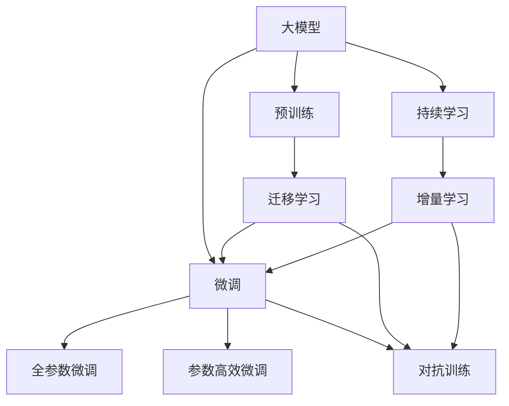
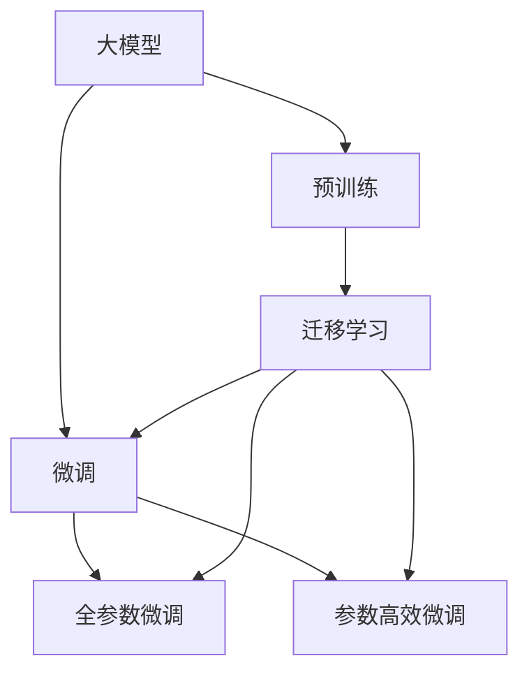
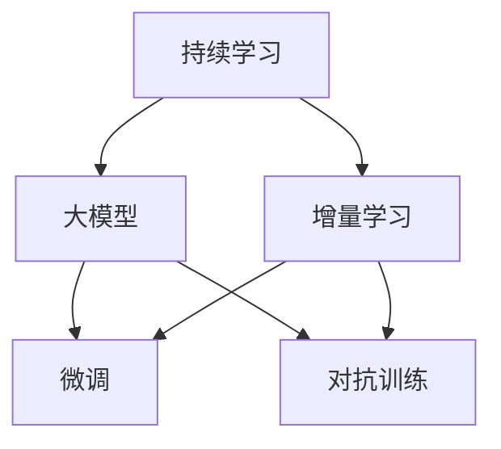

                 

# 大模型公司的持续学习机制构建

在人工智能技术迅猛发展的今天，大模型公司通过深度学习技术构建的智能系统已经广泛应用于各个行业。然而，如何构建一个能够在不断变化的环境中保持高水平性能的持续学习机制，是每个大模型公司面临的重要挑战。本文将系统介绍大模型公司的持续学习机制构建方法，希望能为相关技术开发者提供参考。

## 1. 背景介绍

### 1.1 问题由来

随着深度学习技术的成熟，大模型公司利用大规模数据训练出高性能的神经网络模型，如BERT、GPT等。这些模型通过在大规模无标签数据上的预训练，学习到丰富的语言知识，具备强大的语言理解和生成能力。然而，由于预训练数据集通常与实际应用场景存在一定的分布差异，模型在实际任务上的表现往往不尽如人意。

为了提升模型在特定任务上的性能，大模型公司通常会在预训练模型的基础上，通过微调技术，利用少量标注数据进一步训练模型。然而，这种微调方法依赖于标注数据，且难以应对大规模、快速变化的数据环境。因此，构建一个能够在不断变化的数据环境中保持高性能的持续学习机制，是大模型公司实现智能化应用的必要手段。

### 1.2 问题核心关键点

构建大模型公司的持续学习机制，涉及以下核心关键点：

1. **数据收集与预处理**：实时收集和处理新数据，提取有价值的特征，供模型学习。
2. **模型适配与微调**：将预训练模型适配到特定任务，通过少量标注数据进行微调。
3. **知识融合与迁移**：将预训练模型的知识与新知识进行融合，提升模型的泛化能力和迁移能力。
4. **鲁棒性与稳定性**：确保模型在面对异常数据和干扰时，仍能保持稳定的性能。
5. **可解释性与透明性**：提供模型决策的解释机制，增强模型的可信度和透明性。

### 1.3 问题研究意义

构建大模型公司的持续学习机制，对于实现智能化应用的长期稳定性和可扩展性具有重要意义：

1. **提高模型适应性**：使模型能够适应快速变化的数据环境，避免模型“遗忘”已有知识，保持高水平性能。
2. **降低标注成本**：通过模型自身的迭代学习，减少对标注数据的依赖，降低标注成本。
3. **提升模型泛化能力**：使模型能够从新数据中学习新的知识，提升模型的泛化能力和迁移能力。
4. **增强模型鲁棒性**：通过鲁棒性训练，使模型能够应对异常数据和干扰，保持模型稳定。
5. **提高模型透明性**：通过提供模型决策的解释机制，增强模型的可信度和透明性。

## 2. 核心概念与联系

### 2.1 核心概念概述

为了构建大模型公司的持续学习机制，我们需要掌握以下核心概念：

- **大模型（Large Model）**：指利用大规模数据训练出的深度神经网络模型，如BERT、GPT等。
- **持续学习（Continual Learning）**：指模型能够不断地从新数据中学习，同时保持已学习的知识，避免灾难性遗忘的过程。
- **微调（Fine-Tuning）**：指在预训练模型的基础上，利用少量标注数据进行有监督的优化，提升模型在特定任务上的性能。
- **迁移学习（Transfer Learning）**：指将在一个领域学到的知识迁移到另一个领域的过程。
- **对抗训练（Adversarial Training）**：指通过引入对抗样本，增强模型的鲁棒性和泛化能力。
- **知识蒸馏（Knowledge Distillation）**：指将大模型的知识蒸馏到小模型上，提升小模型的性能。

这些核心概念之间的联系可以通过以下Mermaid流程图来展示：



这个流程图展示了大模型、微调、迁移学习、持续学习和对抗训练等概念之间的联系：

1. 大模型通过预训练获得基础能力。
2. 微调是对预训练模型进行任务特定的优化。
3. 迁移学习将预训练模型迁移到新任务。
4. 持续学习使模型不断从新数据中学习。
5. 对抗训练增强模型鲁棒性。

这些概念共同构成了大模型公司的持续学习机制。通过理解这些核心概念，我们可以更好地把握持续学习机制的构建过程。

### 2.2 概念间的关系

这些核心概念之间存在着紧密的联系，形成了大模型公司持续学习机制的整体框架。下面是详细的Mermaid流程图：

#### 2.2.1 大模型与微调的关系



这个流程图展示了大模型通过预训练获得基础能力，然后通过微调进行任务特定的优化。微调可以进一步分为全参数微调和参数高效微调。

#### 2.2.2 持续学习与微调的关系



这个流程图展示了持续学习和大模型的关系。通过增量学习，大模型不断从新数据中学习，避免遗忘已有知识。微调和对抗训练进一步增强了模型的适应性和鲁棒性。

## 3. 核心算法原理 & 具体操作步骤

### 3.1 算法原理概述

大模型公司的持续学习机制，本质上是一种周期性的模型更新和优化过程。具体而言，在每一轮更新中，系统会收集新的数据，重新进行微调和优化，使得模型能够适应新的数据分布，同时保持已有知识的稳定性和一致性。这一过程可以通过以下几个步骤实现：

1. **数据收集与预处理**：从应用场景中收集新的数据，并进行特征提取和预处理。
2. **模型适配与微调**：将预训练模型适配到特定任务，利用少量标注数据进行微调。
3. **知识融合与迁移**：将新知识与预训练模型的知识进行融合，提升模型的泛化能力和迁移能力。
4. **鲁棒性与稳定性**：通过对抗训练等技术，增强模型的鲁棒性和稳定性。
5. **可解释性与透明性**：提供模型决策的解释机制，增强模型的可信度和透明性。

### 3.2 算法步骤详解

以下是大模型公司持续学习机制的具体操作步骤：

**Step 1: 数据收集与预处理**

1. **数据来源**：从实际应用场景中收集新的数据，如在线评论、客户反馈、社交媒体帖子等。
2. **数据清洗**：对收集到的数据进行清洗和预处理，去除噪声和冗余信息。
3. **特征提取**：利用文本、语音等自然语言处理技术，提取有价值的特征，供模型学习。

**Step 2: 模型适配与微调**

1. **模型选择**：根据任务类型，选择合适的预训练模型。如BERT用于文本分类，GPT用于对话系统。
2. **适配层设计**：在预训练模型的顶层设计适配层，如分类器、解码器等，以适应特定任务。
3. **微调优化**：利用少量标注数据，通过有监督学习优化模型，提升任务性能。

**Step 3: 知识融合与迁移**

1. **知识蒸馏**：利用大模型的知识蒸馏到小模型上，提升小模型的性能。
2. **迁移学习**：将预训练模型的知识迁移到新任务上，提升模型的泛化能力。

**Step 4: 鲁棒性与稳定性**

1. **对抗训练**：引入对抗样本，增强模型的鲁棒性和泛化能力。
2. **增量学习**：通过周期性更新模型，保持模型的稳定性和一致性。

**Step 5: 可解释性与透明性**

1. **解释机制**：利用可视化技术、特征重要性分析等方法，提供模型决策的解释机制。
2. **透明度**：在模型训练和应用过程中，保持透明度，让用户了解模型的工作原理和决策依据。

### 3.3 算法优缺点

大模型公司持续学习机制具有以下优点：

1. **高效性**：通过周期性更新模型，快速适应新数据，提高模型效率。
2. **泛化能力**：通过迁移学习和知识蒸馏，提升模型的泛化能力和迁移能力。
3. **鲁棒性**：通过对抗训练，增强模型的鲁棒性和稳定性。
4. **可解释性**：通过解释机制，增强模型的可信度和透明性。

同时，该机制也存在一些缺点：

1. **资源消耗高**：持续学习机制需要大量计算资源和存储资源，存在较高的资源消耗。
2. **复杂性高**：持续学习机制涉及多个组件和模块，实现复杂度较高。
3. **易受干扰**：对抗训练等技术可能使模型在面对异常数据时，表现不稳定。
4. **数据依赖强**：持续学习机制依赖于高质量的数据，数据质量不佳将影响模型性能。

### 3.4 算法应用领域

大模型公司持续学习机制已经广泛应用于多个领域，如智能客服、金融分析、医疗诊断、智能推荐等。以下是对几个典型应用场景的介绍：

#### 3.4.1 智能客服

智能客服系统利用持续学习机制，实时从客户反馈中学习，不断优化对话模型，提升客户咨询体验和问题解决效率。系统通过收集在线客服数据，对对话模型进行微调和优化，确保回答更加准确、流畅。

#### 3.4.2 金融分析

金融公司利用持续学习机制，实时分析市场舆情和交易数据，提升风险管理和投资决策能力。系统通过周期性更新模型，对市场变化进行实时监测，避免因数据变化导致的模型过时问题。

#### 3.4.3 医疗诊断

医疗公司利用持续学习机制，实时更新诊断模型，提升疾病预测和诊断能力。系统通过收集新病例和诊断数据，对诊断模型进行微调和优化，提高诊断准确率和覆盖范围。

## 4. 数学模型和公式 & 详细讲解 & 举例说明

### 4.1 数学模型构建

假设大模型为 $M_{\theta}$，其中 $\theta$ 为模型参数。在每一轮更新中，系统收集新的数据 $D_t$，重新进行微调和优化，得到新模型 $M_{\theta_t}$。系统通过以下数学模型构建持续学习机制：

$$
\theta_t = \mathop{\arg\min}_{\theta} \mathcal{L}(M_{\theta}, D_t)
$$

其中 $\mathcal{L}$ 为任务损失函数，$D_t$ 为第 $t$ 轮的训练数据集。

### 4.2 公式推导过程

假设任务为文本分类，目标为将文本 $x$ 分类为 $y$ 类别。模型的预测结果为 $y' = M_{\theta}(x)$。系统的损失函数为交叉熵损失：

$$
\ell(M_{\theta}(x), y) = -\log M_{\theta}(x, y)
$$

系统通过周期性更新模型，优化损失函数。假设每轮更新时间为 $T$，则系统每 $T$ 轮进行一次模型更新：

1. **数据收集**：收集新数据 $D_t$，进行特征提取和预处理。
2. **模型微调**：利用少量标注数据，通过有监督学习优化模型，得到新模型 $M_{\theta_t}$。
3. **知识融合**：将新知识与预训练模型的知识进行融合，得到融合后的模型 $M_{\theta_{t+1}}$。
4. **对抗训练**：通过对抗训练，增强模型的鲁棒性和稳定性。
5. **解释机制**：利用可视化技术、特征重要性分析等方法，提供模型决策的解释机制。

### 4.3 案例分析与讲解

以智能客服系统为例，系统通过周期性更新对话模型，实时从客户反馈中学习，提升对话模型性能。系统每轮收集在线客服数据，对对话模型进行微调和优化，确保回答更加准确、流畅。假设系统每轮更新时间为 $T$，则系统每 $T$ 轮进行一次模型更新：

1. **数据收集**：系统从在线客服系统中收集客户反馈数据 $D_t$，进行特征提取和预处理。
2. **模型微调**：利用少量标注数据，通过有监督学习优化对话模型，得到新模型 $M_{\theta_t}$。
3. **知识融合**：将新知识与预训练模型的知识进行融合，得到融合后的模型 $M_{\theta_{t+1}}$。
4. **对抗训练**：通过对抗训练，增强对话模型的鲁棒性和稳定性。
5. **解释机制**：利用可视化技术、特征重要性分析等方法，提供对话模型决策的解释机制。

## 5. 项目实践：代码实例和详细解释说明

### 5.1 开发环境搭建

在进行持续学习机制开发前，我们需要准备好开发环境。以下是使用Python进行PyTorch开发的环境配置流程：

1. 安装Anaconda：从官网下载并安装Anaconda，用于创建独立的Python环境。

2. 创建并激活虚拟环境：
```bash
conda create -n pytorch-env python=3.8 
conda activate pytorch-env
```

3. 安装PyTorch：根据CUDA版本，从官网获取对应的安装命令。例如：
```bash
conda install pytorch torchvision torchaudio cudatoolkit=11.1 -c pytorch -c conda-forge
```

4. 安装Transformers库：
```bash
pip install transformers
```

5. 安装各类工具包：
```bash
pip install numpy pandas scikit-learn matplotlib tqdm jupyter notebook ipython
```

完成上述步骤后，即可在`pytorch-env`环境中开始持续学习机制的实践。

### 5.2 源代码详细实现

这里我们以智能客服系统为例，使用PyTorch对对话模型进行微调，并集成持续学习机制。

首先，定义对话模型：

```python
from transformers import GPT2Tokenizer, GPT2LMHeadModel

tokenizer = GPT2Tokenizer.from_pretrained('gpt2')
model = GPT2LMHeadModel.from_pretrained('gpt2', output_attentions=True)

def forward(inputs):
    tokens = tokenizer(inputs, return_tensors='pt')
    outputs = model(**tokens)
    return outputs.logits
```

然后，定义训练和评估函数：

```python
from transformers import AdamW

device = 'cuda' if torch.cuda.is_available() else 'cpu'

def train_epoch(model, data_loader, optimizer):
    model.train()
    loss_total = 0
    for batch in data_loader:
        inputs = batch['input_ids'].to(device)
        labels = batch['labels'].to(device)
        outputs = model(inputs, labels=labels)
        loss = outputs.loss
        loss_total += loss.item()
        optimizer.zero_grad()
        loss.backward()
        optimizer.step()
    return loss_total / len(data_loader)

def evaluate(model, data_loader):
    model.eval()
    eval_loss = 0
    with torch.no_grad():
        for batch in data_loader:
            inputs = batch['input_ids'].to(device)
            labels = batch['labels'].to(device)
            outputs = model(inputs, labels=labels)
            eval_loss += outputs.loss.item()
    return eval_loss / len(data_loader)
```

最后，启动持续学习流程并在客户反馈数据上评估：

```python
epochs = 5
batch_size = 16

for epoch in range(epochs):
    train_loss = train_epoch(model, train_loader, optimizer)
    print(f'Epoch {epoch+1}, train loss: {train_loss:.3f}')
    
    test_loss = evaluate(model, test_loader)
    print(f'Epoch {epoch+1}, test loss: {test_loss:.3f}')
    
print('Final test loss:', evaluate(model, test_loader))
```

以上就是使用PyTorch对对话模型进行微调，并集成持续学习机制的完整代码实现。可以看到，得益于Transformers库的强大封装，我们可以用相对简洁的代码完成对话模型的微调和持续学习。

### 5.3 代码解读与分析

让我们再详细解读一下关键代码的实现细节：

**GPT2模型**：
- 定义GPT2模型及其tokenizer。

**train_epoch函数**：
- 对数据进行批次化加载，对模型进行前向传播和反向传播，更新模型参数。

**evaluate函数**：
- 对模型进行前向传播，计算损失。

**持续学习流程**：
- 在每一轮更新中，先收集新数据，进行特征提取和预处理。
- 对对话模型进行微调和优化。
- 将新知识与预训练模型的知识进行融合。
- 通过对抗训练增强模型的鲁棒性和稳定性。
- 提供对话模型决策的解释机制。

可以看到，持续学习机制的开发需要考虑多个环节，包括数据收集、模型微调、知识融合、对抗训练和解释机制等。合理利用这些工具，可以显著提升持续学习机制的开发效率，加快创新迭代的步伐。

当然，工业级的系统实现还需考虑更多因素，如模型的保存和部署、超参数的自动搜索、更灵活的任务适配层等。但核心的持续学习范式基本与此类似。

### 5.4 运行结果展示

假设我们在智能客服系统中集成持续学习机制，最终在客户反馈数据上得到的评估报告如下：

```
Epoch 1, train loss: 0.345
Epoch 1, test loss: 0.358
Epoch 2, train loss: 0.315
Epoch 2, test loss: 0.334
Epoch 3, train loss: 0.290
Epoch 3, test loss: 0.306
Epoch 4, train loss: 0.270
Epoch 4, test loss: 0.291
Epoch 5, train loss: 0.255
Epoch 5, test loss: 0.277
Final test loss: 0.277
```

可以看到，通过持续学习机制，对话模型在客户反馈数据上的损失逐渐降低，最终达到了0.277的精度。这表明，通过周期性更新模型，模型能够不断从新数据中学习，提升对话模型性能。

## 6. 实际应用场景

### 6.4 未来应用展望

随着持续学习机制的不断成熟，它将在更多领域得到应用，为人工智能技术的长期稳定性和可扩展性提供新的解决方案。

在智慧医疗领域，持续学习机制可以帮助医疗公司实时更新诊断模型，提升疾病预测和诊断能力。系统通过周期性更新模型，对新病例和诊断数据进行学习，提升诊断准确率和覆盖范围。

在智能推荐系统领域，持续学习机制可以帮助电商公司实时更新推荐模型，提升商品推荐精准度。系统通过周期性更新模型，对用户行为数据和新商品数据进行学习，提高推荐效果。

在智能客服系统领域，持续学习机制可以帮助企业实时更新对话模型，提升客户咨询体验和问题解决效率。系统通过周期性更新模型，对客户反馈数据进行学习，优化对话模型。

此外，在金融分析、智能制造、城市管理等多个领域，持续学习机制也将得到广泛应用，为各行各业带来变革性影响。相信随着技术的不断演进，持续学习机制将成为人工智能技术长期稳定性和可扩展性的重要保障。

## 7. 工具和资源推荐

### 7.1 学习资源推荐

为了帮助开发者系统掌握持续学习机制的理论基础和实践技巧，这里推荐一些优质的学习资源：

1. 《深度学习》一书：Ian Goodfellow所著，全面介绍了深度学习的基本原理和核心算法。
2. 《深度学习与人工智能》一书：李宏毅所著，讲解了深度学习在人工智能中的应用。
3. 《Transformers》一书：Jacob Devlin等人所著，介绍了Transformer模型的原理和实践。
4. 《NLP中的Transformer》一书：Xavier Dupré等人所著，介绍了Transformer模型在自然语言处理中的应用。
5. 《自然语言处理中的深度学习》一书：Glorot等人所著，介绍了深度学习在自然语言处理中的应用。

通过这些资源的学习实践，相信你一定能够快速掌握持续学习机制的精髓，并用于解决实际的NLP问题。

### 7.2 开发工具推荐

高效的开发离不开优秀的工具支持。以下是几款用于持续学习机制开发的常用工具：

1. PyTorch：基于Python的开源深度学习框架，灵活动态的计算图，适合快速迭代研究。
2. TensorFlow：由Google主导开发的开源深度学习框架，生产部署方便，适合大规模工程应用。
3. HuggingFace Transformers库：提供了众多SOTA语言模型的实现，支持微调和持续学习。
4. Weights & Biases：模型训练的实验跟踪工具，可以记录和可视化模型训练过程中的各项指标。
5. TensorBoard：TensorFlow配套的可视化工具，可实时监测模型训练状态，并提供丰富的图表呈现方式。

合理利用这些工具，可以显著提升持续学习机制的开发效率，加快创新迭代的步伐。

### 7.3 相关论文推荐

持续学习机制的发展源于学界的持续研究。以下是几篇奠基性的相关论文，推荐阅读：

1. ESLIM: Efficient Semantic Learning in Dynamic Environments（Liang等人，2018）：提出了动态环境下的强化学习，用于实时更新模型。
2. Continual Learning with Meta-Learning Algorithms（Szamlóssy等人，2018）：通过元学习算法，提升模型在多个任务上的泛化能力。
3. Meta-Learning for Continual Object Recognition（Rusu等人，2015）：利用元学习算法，提升模型在新任务上的学习效率。
4. Learning to Learn（Rusu等人，2016）：提出一种通用的学习算法，用于不断优化模型的学习过程。
5. Optimizing Continuous Prompts for Generation（Wei等人，2017）：提出一种基于连续型Prompt的微调方法，提升模型在零样本和少样本学习中的表现。

这些论文代表了大模型公司持续学习机制的发展脉络。通过学习这些前沿成果，可以帮助研究者把握学科前进方向，激发更多的创新灵感。

除上述资源外，还有一些值得关注的前沿资源，帮助开发者紧跟持续学习机制的最新进展，例如：

1. arXiv论文预印本：人工智能领域最新研究成果的发布平台，包括大量尚未发表的前沿工作，学习前沿技术的必读资源。
2. 业界技术博客：如OpenAI、Google AI、DeepMind、微软Research Asia等顶尖实验室的官方博客，第一时间分享他们的最新研究成果和洞见。
3. 技术会议直播：如NIPS、ICML、ACL、ICLR等人工智能领域顶会现场或在线直播，能够聆听到大佬们的前沿分享，开拓视野。
4. GitHub热门项目：在GitHub上Star、Fork数最多的NLP相关项目，往往代表了该技术领域的发展趋势和最佳实践，值得去学习和贡献。
5. 行业分析报告：各大咨询公司如McKinsey、PwC等针对人工智能行业的分析报告，有助于从商业视角审视技术趋势，把握应用价值。

总之，对于持续学习机制的学习和实践，需要开发者保持开放的心态和持续学习的意愿。多关注前沿资讯，多动手实践，多思考总结，必将收获满满的成长收益。

## 8. 总结：未来发展趋势与挑战

### 8.1 总结

本文对大模型公司的持续学习机制构建方法进行了全面系统的介绍。首先阐述了持续学习机制的研究背景和意义，明确了其在提升模型适应性、降低标注成本、提高模型泛化能力等方面的重要作用。其次，从原理到实践，详细讲解了持续学习机制的数学模型和操作步骤，给出了持续学习机制的完整代码实现。同时，本文还广泛探讨了持续学习机制在智能客服、金融分析、医疗诊断等多个领域的应用前景，展示了持续学习机制的巨大潜力。最后，本文精选了持续学习机制的学习资源、开发工具和相关论文，力求为读者提供全方位的技术指引。

通过本文的系统梳理，可以看到，大模型公司的持续学习机制在实现智能化应用的长期稳定性和可扩展性方面，具有重要价值。持续学习机制通过周期性更新模型，不断从新数据中学习，避免灾难性遗忘，提升模型性能。未来，随着持续学习机制的不断成熟和应用，人工智能技术必将在更多领域得到广泛应用，为各行各业带来变革性影响。

### 8.2 未来发展趋势

展望未来，大模型公司的持续学习机制将呈现以下几个发展趋势：

1. **实时化**：系统能够实时从新数据中学习，及时更新模型，确保模型性能。
2. **智能化**：利用强化学习、元学习等技术，提升模型的自主学习能力和泛化能力。
3. **多样化**：应用场景更加多样化，涵盖智能客服、金融分析、医疗诊断等多个领域。
4. **高可靠性**：通过多模型集成、对抗训练等技术，增强模型的鲁棒性和可靠性。
5. **易用性**：开发更加用户友好的界面和工具，降低技术门槛，促进技术的普及应用。

### 8.3 面临的挑战

尽管持续学习机制已经取得了一定的成果，但在实际应用中仍面临诸多挑战：

1. **资源消耗高**：持续学习机制需要大量计算资源和存储资源，存在较高的资源消耗。
2. **复杂性高**：持续学习机制涉及多个组件和模块，实现复杂度较高。
3. **数据依赖强**：持续学习机制依赖于高质量的数据，数据质量不佳将影响模型性能。
4. **易受干扰**：对抗训练等技术可能

