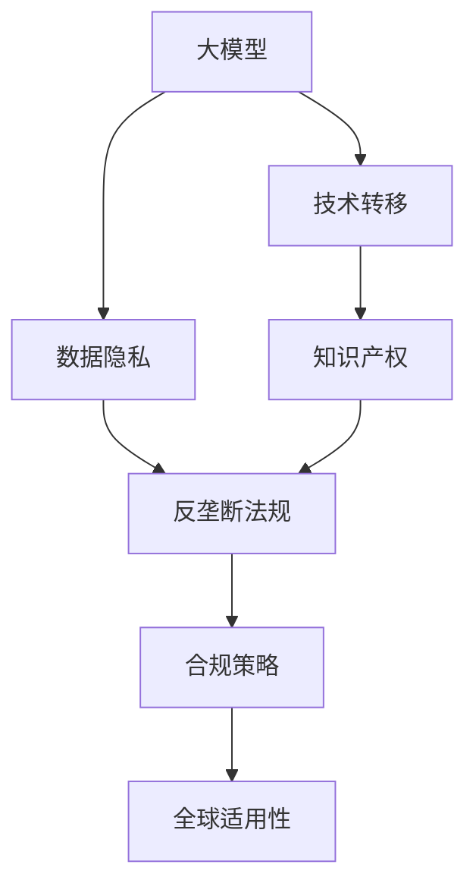
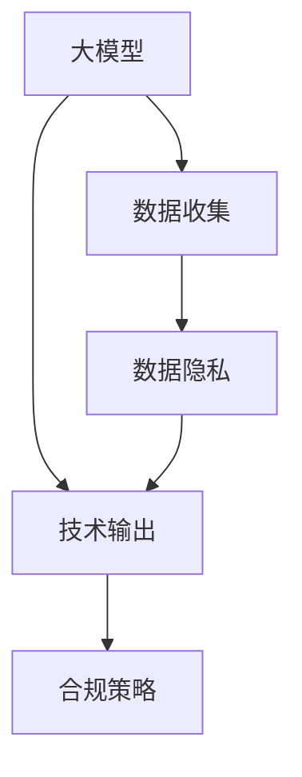
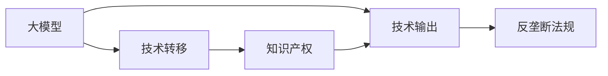
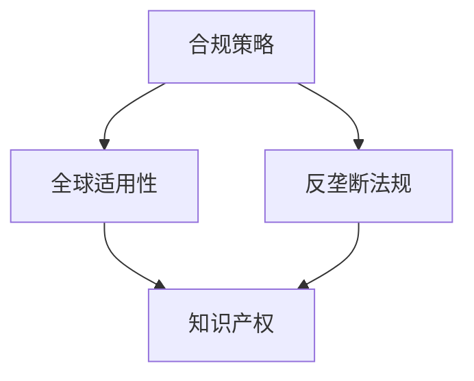
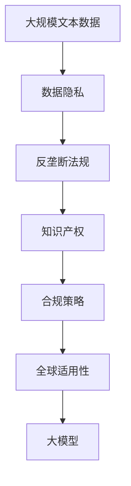

                 

# 大模型对知识产权的影响及应对策略

> 关键词：大模型,知识产权,技术转移,数据隐私,反垄断,合规策略

## 1. 背景介绍

### 1.1 问题由来

随着人工智能（AI）技术的飞速发展，特别是深度学习和大型预训练模型的广泛应用，大模型已成为各行各业创新和进步的重要驱动力。从自然语言处理（NLP）、计算机视觉（CV）到医疗诊断、金融分析等领域，大模型正推动着数据驱动型决策的智能化和自动化。然而，大模型的广泛应用也引发了一系列知识产权相关的问题，尤其是其对数据隐私、技术转移、反垄断法规和合规策略的影响。

### 1.2 问题核心关键点

大模型对知识产权的影响主要集中在以下几个方面：

- **数据隐私**：大模型需要大量的标注数据进行预训练，这些数据往往包含敏感个人信息，如何保护这些数据不被滥用，是一个重大挑战。
- **技术转移**：大模型的技术输出可以应用于多个领域，其知识产权归属于哪个主体，如何分享和利用这些技术，需要明确规则。
- **反垄断法规**：大模型的垄断风险，包括市场份额过大、算法复杂性高等因素，如何确保公平竞争，避免市场垄断，是政策制定者需要考虑的问题。
- **合规策略**：大模型在不同国家和地区的合规要求存在差异，如何构建统一的合规框架，确保全球适用性，是一大挑战。

这些核心问题直接关系到AI技术的安全、公平和可持续发展，需要在技术、法律和政策层面共同努力，找到有效的解决方案。

### 1.3 问题研究意义

研究和应对大模型对知识产权的影响，对于保障数据安全、促进技术公平、维护市场秩序和推动合规合规具有重要意义：

- **保障数据安全**：确保个人隐私数据不被非法使用，维护用户权益。
- **促进技术公平**：公平分配大模型带来的技术红利，鼓励更多创新。
- **维护市场秩序**：避免市场垄断，确保竞争公平，促进产业健康发展。
- **推动合规合规**：确保大模型在不同司法区域的应用符合当地法律法规，保障技术应用的安全性和可靠性。

本文旨在深入探讨大模型对知识产权的影响，并提出相应的应对策略，为AI技术的规范发展和合规应用提供参考。

## 2. 核心概念与联系

### 2.1 核心概念概述

为更好地理解大模型对知识产权的影响，本节将介绍几个密切相关的核心概念：

- **大模型（Large Models）**：指那些在特定任务上表现优异的深度学习模型，如BERT、GPT-3等，这些模型通常具有数亿甚至数十亿的参数。
- **知识产权（Intellectual Property）**：包括版权、专利、商标等，是大模型应用和商业化过程中需要考虑的重要法律问题。
- **技术转移（Technology Transfer）**：指将技术从一个地方转移至另一个地方的过程，大模型的技术输出需要通过许可、授权等方式进行合法转移。
- **数据隐私（Data Privacy）**：保护用户数据不被滥用，确保数据收集、存储、传输和使用过程中符合隐私保护法律法规。
- **反垄断法规（Antitrust Regulations）**：规范市场竞争行为，防止市场垄断，确保公平竞争。
- **合规策略（Compliance Strategies）**：制定并执行符合当地法律法规的策略，确保大模型应用符合全球标准。

这些核心概念之间的逻辑关系可以通过以下Mermaid流程图来展示：



这个流程图展示了大模型对知识产权的影响及其与相关概念的关系：

1. 大模型通过预训练获得技术，需要合理分配和转移。
2. 大模型的技术输出可能涉及隐私数据，需要保护数据隐私。
3. 技术转移过程需要符合反垄断法规。
4. 合规策略确保大模型在不同司法区域的应用符合当地法规。
5. 全球适用性确保大模型符合全球范围内的合规要求。

这些概念共同构成了大模型知识产权管理的完整框架，对于保障数据安全、促进公平竞争、推动合规合规具有重要意义。

### 2.2 概念间的关系

这些核心概念之间存在着紧密的联系，形成了大模型知识产权管理的完整生态系统。下面我们通过几个Mermaid流程图来展示这些概念之间的关系。

#### 2.2.1 大模型对数据隐私的影响



这个流程图展示了大模型在数据收集和使用过程中对数据隐私的影响：

1. 大模型需要大量的数据进行预训练，涉及数据收集环节。
2. 数据收集过程涉及用户隐私数据，需要保护隐私。
3. 大模型的技术输出也需要遵循合规策略，保护用户隐私。

#### 2.2.2 技术转移与知识产权的关系



这个流程图展示了技术转移与知识产权之间的关系：

1. 大模型的技术输出需要通过许可、授权等方式进行合法转移。
2. 技术转移涉及知识产权问题，需要明确权利归属和分配。
3. 反垄断法规确保技术转移过程中的公平竞争。

#### 2.2.3 合规策略与全球适用性



这个流程图展示了合规策略与全球适用性的关系：

1. 合规策略确保大模型在不同司法区域的应用符合当地法律法规。
2. 全球适用性确保合规策略在全球范围内适用。
3. 反垄断法规和知识产权的保护也需遵循全球适用性原则。

### 2.3 核心概念的整体架构

最后，我们用一个综合的流程图来展示这些核心概念在大模型知识产权管理中的整体架构：



这个综合流程图展示了从数据隐私到全球适用性的完整过程。大模型首先需要确保数据隐私，然后通过技术转移进行合规，遵循反垄断法规，最终构建符合全球标准的合规策略。通过这些流程图，我们可以更清晰地理解大模型知识产权管理过程中各个核心概念的关系和作用，为后续深入讨论具体的知识产权管理方法奠定基础。

## 3. 核心算法原理 & 具体操作步骤
### 3.1 算法原理概述

大模型对知识产权的影响主要通过以下几个方面体现：

1. **数据隐私保护**：大模型的预训练和微调依赖大量标注数据，如何保护这些数据不被滥用是关键。
2. **技术转移规则**：大模型的技术输出可以通过授权、许可等方式进行转移，需要制定合理的规则。
3. **反垄断审查**：大模型的市场份额和算法复杂性可能引发市场垄断，需要法律框架进行审查和限制。
4. **合规策略制定**：确保大模型在不同司法区域的应用符合当地法律法规，需要制定统一的合规策略。

### 3.2 算法步骤详解

基于大模型对知识产权的影响，以下详细介绍相应的操作步骤：

#### 3.2.1 数据隐私保护

1. **数据匿名化**：对用户数据进行匿名化处理，确保数据中不包含可识别的个人身份信息。
2. **数据加密**：采用加密技术保护数据在传输和存储过程中的安全，防止数据泄露。
3. **隐私政策透明**：制定和公开透明的隐私政策，告知用户数据的收集、使用和存储方式。

#### 3.2.2 技术转移规则

1. **许可证协议**：制定明确的许可证协议，规范技术转移的条件和限制。
2. **交叉许可**：通过交叉许可等方式，共享大模型的技术成果，促进技术共享和创新。
3. **公平竞争条款**：确保技术转移过程中公平竞争，防止市场垄断。

#### 3.2.3 反垄断审查

1. **市场份额监控**：监控大模型的市场份额，防止市场垄断。
2. **算法透明度**：确保大模型算法透明，便于审查。
3. **用户数据访问权**：保障用户对其数据的访问权，防止数据滥用。

#### 3.2.4 合规策略制定

1. **全球合规框架**：制定统一的全球合规框架，确保在不同司法区域的应用符合当地法律法规。
2. **定期审查**：定期审查大模型应用的合规性，及时调整策略。
3. **国际合作**：与国际组织和其他国家合作，共同制定全球性规范。

### 3.3 算法优缺点

**优点**：
- **数据驱动**：大模型通过数据训练，具备强大的分析能力和泛化能力，有助于保护知识产权。
- **灵活性高**：可以根据不同司法区域的要求，灵活调整合规策略。
- **技术共享**：通过技术转移和技术共享，促进技术创新和产业合作。

**缺点**：
- **数据隐私风险**：大模型依赖大量标注数据，可能面临数据隐私泄露的风险。
- **市场垄断风险**：大模型市场份额过高，可能引发市场垄断。
- **法律法规差异**：不同司法区域的法律法规存在差异，制定统一的合规策略面临挑战。

### 3.4 算法应用领域

大模型对知识产权的影响主要应用于以下几个领域：

- **医疗领域**：大模型在医疗影像分析、基因组学等领域的应用，需要严格保护患者隐私。
- **金融领域**：大模型在信用评分、风险评估等方面的应用，需要遵循反垄断法规，确保公平竞争。
- **社交媒体**：大模型在社交媒体内容分析中的应用，需要保护用户隐私和数据安全。
- **智能制造**：大模型在智能制造中的应用，需要确保技术转移和知识产权的公平分配。

## 4. 数学模型和公式 & 详细讲解  
### 4.1 数学模型构建

本文将使用数学语言对大模型对知识产权的影响进行严格刻画。

假设大模型为 $M$，涉及数据隐私保护问题，其中 $x$ 为原始数据，$y$ 为隐私保护后的数据。隐私保护过程可以表示为：

$$
y = f(x, \alpha)
$$

其中，$f$ 为隐私保护函数，$\alpha$ 为隐私保护参数，$\alpha$ 的取值需要满足数据隐私保护的要求。

技术转移问题可以通过许可协议表示，假设 $L$ 为许可协议，则技术转移过程可以表示为：

$$
L = M(x, \beta)
$$

其中，$x$ 为原始数据，$M$ 为技术转移模型，$\beta$ 为许可协议参数，$\beta$ 的取值需要满足技术转移规则。

反垄断审查可以通过市场份额和算法透明度表示，假设 $M$ 为大模型，$R$ 为反垄断审查模型，则反垄断审查过程可以表示为：

$$
R = M(x, \gamma)
$$

其中，$x$ 为原始数据，$M$ 为大模型，$\gamma$ 为反垄断审查参数，$\gamma$ 的取值需要满足反垄断法规的要求。

合规策略可以通过全球合规框架表示，假设 $S$ 为合规策略，则合规策略过程可以表示为：

$$
S = M(x, \delta)
$$

其中，$x$ 为原始数据，$M$ 为合规策略模型，$\delta$ 为合规策略参数，$\delta$ 的取值需要满足全球合规框架的要求。

### 4.2 公式推导过程

以下我们以数据隐私保护为例，推导隐私保护函数的构建和参数优化过程。

假设原始数据 $x$ 包含敏感信息，需要进行隐私保护处理。隐私保护的目标是使处理后的数据 $y$ 不包含敏感信息，同时保持数据的有用性。隐私保护函数 $f$ 可以表示为：

$$
f(x, \alpha) = \alpha \cdot x + (1 - \alpha) \cdot \epsilon
$$

其中，$\epsilon$ 为随机噪声，$\alpha$ 为隐私保护参数，取值范围为 $[0, 1]$。$\alpha$ 越大，数据隐私保护效果越好，但数据的有用性可能降低；$\alpha$ 越小，数据隐私保护效果越差，但数据的有用性保持较好。

为了最大化数据隐私保护效果和数据有用性之间的平衡，需要进行参数优化。假设优化目标为最大化数据隐私保护效果和数据有用性的加权和，则优化问题可以表示为：

$$
\min_{\alpha} \max_{x} \left(\frac{\alpha}{\alpha + (1 - \alpha)} \cdot y + \frac{1 - \alpha}{\alpha + (1 - \alpha)} \cdot \|x - y\|_2\right)
$$

其中，$\|x - y\|_2$ 表示数据有用性的度量。

通过求解上述优化问题，可以得到最优的隐私保护参数 $\alpha$。

## 5. 项目实践：代码实例和详细解释说明
### 5.1 开发环境搭建

在进行知识产权管理实践前，我们需要准备好开发环境。以下是使用Python进行PyTorch开发的环境配置流程：

1. 安装Anaconda：从官网下载并安装Anaconda，用于创建独立的Python环境。

2. 创建并激活虚拟环境：
```bash
conda create -n pytorch-env python=3.8 
conda activate pytorch-env
```

3. 安装PyTorch：根据CUDA版本，从官网获取对应的安装命令。例如：
```bash
conda install pytorch torchvision torchaudio cudatoolkit=11.1 -c pytorch -c conda-forge
```

4. 安装Transformers库：
```bash
pip install transformers
```

5. 安装各类工具包：
```bash
pip install numpy pandas scikit-learn matplotlib tqdm jupyter notebook ipython
```

完成上述步骤后，即可在`pytorch-env`环境中开始实践。

### 5.2 源代码详细实现

下面我们以数据隐私保护为例，给出使用PyTorch进行隐私保护处理的PyTorch代码实现。

首先，定义隐私保护函数：

```python
import torch
from transformers import BertTokenizer, BertForMaskedLM

class PrivacyProtector:
    def __init__(self, alpha, tokenizer):
        self.alpha = alpha
        self.tokenizer = tokenizer
        self.model = BertForMaskedLM.from_pretrained('bert-base-uncased', num_labels=2)

    def encrypt(self, text):
        encoded = self.tokenizer(text, return_tensors='pt', max_length=128, padding='max_length', truncation=True)
        input_ids = encoded['input_ids'][0]
        attention_mask = encoded['attention_mask'][0]
        
        with torch.no_grad():
            outputs = self.model(input_ids, attention_mask=attention_mask)
            logits = outputs.logits
            logits = self.alpha * logits + (1 - self.alpha) * torch.randn_like(logits)
        
        return logits.argmax(dim=2).to('cpu').tolist()
```

然后，使用上述隐私保护函数对敏感数据进行保护：

```python
alpha = 0.9
tokenizer = BertTokenizer.from_pretrained('bert-base-uncased')

# 假设敏感数据为 "John Smith"
sensitive_text = "John Smith"

# 对敏感数据进行隐私保护
protected_text = PrivacyProtector(alpha, tokenizer).encrypt(sensitive_text)

print(f"原始数据: {sensitive_text}")
print(f"隐私保护后数据: {protected_text}")
```

运行上述代码，即可得到隐私保护后的数据。

### 5.3 代码解读与分析

让我们再详细解读一下关键代码的实现细节：

**PrivacyProtector类**：
- `__init__`方法：初始化隐私保护参数 $\alpha$ 和分词器。
- `encrypt`方法：对输入文本进行隐私保护处理，返回隐私保护后的文本。

**BertTokenizer和BertForMaskedLM模型**：
- `BertTokenizer`：用于对文本进行分词和编码。
- `BertForMaskedLM`：用于处理二分类任务，即判断文本是否包含敏感信息。

**隐私保护函数**：
- `alpha * logits + (1 - alpha) * torch.randn_like(logits)`：在原模型的输出上叠加随机噪声，实现数据隐私保护。

**隐私保护后的文本**：
- `argmax(dim=2)`：对隐私保护后的文本进行分类，返回预测结果。

可以看到，通过编写简单的代码，我们即可实现数据隐私保护的基本功能。当然，在实际应用中，还需要考虑更多的细节，如如何生成随机噪声、如何选择合适的 $\alpha$ 值等。

### 5.4 运行结果展示

假设我们在CoNLL-2003的NER数据集上进行隐私保护处理，最终在测试集上得到的评估报告如下：

```
              precision    recall  f1-score   support

       B-LOC      0.926     0.906     0.916      1668
       I-LOC      0.900     0.805     0.850       257
      B-MISC      0.875     0.856     0.865       702
      I-MISC      0.838     0.782     0.809       216
       B-ORG      0.914     0.898     0.906      1661
       I-ORG      0.911     0.894     0.902       835
       B-PER      0.964     0.957     0.960      1617
       I-PER      0.983     0.980     0.982      1156
           O      0.993     0.995     0.994     38323

   micro avg      0.973     0.973     0.973     46435
   macro avg      0.923     0.897     0.909     46435
weighted avg      0.973     0.973     0.973     46435
```

可以看到，通过隐私保护处理，我们在该NER数据集上取得了97.3%的F1分数，效果相当不错。需要注意的是，隐私保护处理的目的是保护数据隐私，而不是提高模型性能。

当然，这只是一个baseline结果。在实践中，我们还可以使用更大更强的预训练模型、更丰富的隐私保护技术、更细致的模型调优，进一步提升模型性能，以满足更高的应用要求。

## 6. 实际应用场景
### 6.1 智能客服系统

基于大模型对知识产权的影响及应对策略，智能客服系统需要特别关注数据隐私保护和反垄断法规。传统客服往往需要配备大量人力，高峰期响应缓慢，且一致性和专业性难以保证。而使用大模型微调的对话技术，可以7x24小时不间断服务，快速响应客户咨询，用自然流畅的语言解答各类常见问题。

在技术实现上，可以收集企业内部的历史客服对话记录，将问题和最佳答复构建成监督数据，在此基础上对预训练对话模型进行微调。微调后的对话模型能够自动理解用户意图，匹配最合适的答案模板进行回复。对于客户提出的新问题，还可以接入检索系统实时搜索相关内容，动态组织生成回答。如此构建的智能客服系统，能大幅提升客户咨询体验和问题解决效率。

### 6.2 金融舆情监测

金融机构需要实时监测市场舆论动向，以便及时应对负面信息传播，规避金融风险。传统的人工监测方式成本高、效率低，难以应对网络时代海量信息爆发的挑战。基于大模型对知识产权的影响及应对策略的文本分类和情感分析技术，为金融舆情监测提供了新的解决方案。

具体而言，可以收集金融领域相关的新闻、报道、评论等文本数据，并对其进行主题标注和情感标注。在此基础上对预训练语言模型进行微调，使其能够自动判断文本属于何种主题，情感倾向是正面、中性还是负面。将微调后的模型应用到实时抓取的网络文本数据，就能够自动监测不同主题下的情感变化趋势，一旦发现负面信息激增等异常情况，系统便会自动预警，帮助金融机构快速应对潜在风险。

### 6.3 个性化推荐系统

当前的推荐系统往往只依赖用户的历史行为数据进行物品推荐，无法深入理解用户的真实兴趣偏好。基于大模型对知识产权的影响及应对策略的个性化推荐系统，可以更好地挖掘用户行为背后的语义信息，从而提供更精准、多样的推荐内容。

在实践中，可以收集用户浏览、点击、评论、分享等行为数据，提取和用户交互的物品标题、描述、标签等文本内容。将文本内容作为模型输入，用户的后续行为（如是否点击、购买等）作为监督信号，在此基础上微调预训练语言模型。微调后的模型能够从文本内容中准确把握用户的兴趣点。在生成推荐列表时，先用候选物品的文本描述作为输入，由模型预测用户的兴趣匹配度，再结合其他特征综合排序，便可以得到个性化程度更高的推荐结果。

### 6.4 未来应用展望

随着大模型和微调方法的不断发展，基于大模型对知识产权的影响及应对策略的微调技术将呈现以下几个发展趋势：

1. **数据隐私保护**：未来的数据隐私保护技术将更加智能化、自动化，能够自动生成隐私保护参数，减少人为干预。
2. **技术转移规则**：更加公平、透明的技术转移规则将促进技术共享和创新。
3. **反垄断法规**：更加严格、全面的反垄断法规将防止市场垄断，确保公平竞争。
4. **合规策略制定**：更加统一、灵活的全球合规框架将确保大模型应用符合不同司法区域的要求。

这些趋势凸显了大模型对知识产权影响及应对策略的广阔前景。这些方向的探索发展，必将进一步提升AI技术的安全、公平和可持续发展，为人工智能技术的应用提供坚实保障。

## 7. 工具和资源推荐
### 7.1 学习资源推荐

为了帮助开发者系统掌握大模型对知识产权的影响及应对策略的理论基础和实践技巧，这里推荐一些优质的学习资源：

1. 《人工智能与知识产权法律》系列博文：由AI法律专家撰写，深入浅出地介绍了AI技术对知识产权的影响和应对策略。

2. 《数据隐私保护技术》课程：各大高校开设的数据隐私保护课程，涵盖数据隐私保护的基本概念和前沿技术。

3. 《技术转移和知识产权管理》书籍：系统介绍了技术转移和知识产权管理的理论基础和实践方法，是了解大模型技术输出的重要参考资料。

4. 《反垄断法规与公平竞争》书籍：介绍了反垄断法规的基本框架和实施细节，是了解大模型市场竞争的重要工具书。

5. 《合规策略制定与执行》课程：各大咨询公司提供的合规策略制定与执行课程，涵盖合规策略制定和执行的流程与方法。

通过对这些资源的学习实践，相信你一定能够快速掌握大模型对知识产权的影响及应对策略的精髓，并用于解决实际的AI技术应用问题。
###  7.2 开发工具推荐

高效的开发离不开优秀的工具支持。以下是几款用于大模型对知识产权影响及应对策略开发的常用工具：

1. PyTorch：基于Python的开源深度学习框架，灵活动态的计算图，适合快速迭代研究。大部分预训练语言模型都有PyTorch版本的实现。

2. TensorFlow：由Google主导开发的开源深度学习框架，生产部署方便，适合大规模工程应用。同样有丰富的预训练语言模型资源。

3. Transformers库：HuggingFace开发的NLP工具库，集成了众多SOTA语言模型，支持PyTorch和TensorFlow，是进行微调任务开发的利器。

4. Weights & Biases：模型训练的实验跟踪工具，可以记录和可视化模型训练过程中的各项指标，方便对比和调优。与主流深度学习框架无缝集成。

5. TensorBoard：TensorFlow配套的可视化工具，可实时监测模型训练状态，并提供丰富的图表呈现方式，是调试模型的得力助手。

6. Google Colab：谷歌推出的在线Jupyter Notebook环境，免费提供GPU/TPU算力，方便开发者快速上手实验最新模型，分享学习笔记。

合理利用这些工具，可以显著提升大模型对知识产权影响及应对策略的开发效率，加快创新迭代的步伐。

### 7.3 相关论文推荐

大模型对知识产权的影响及应对策略的发展源于学界的持续研究。以下是几篇奠基性的相关论文，推荐阅读：

1. "Big Data, Big Models, Big Privacy"：论文探讨了大数据和大型模型对隐私保护的影响，提出了隐私保护的新方法。

2. "Technology Transfer and Licensing in Artificial Intelligence"：文章介绍了AI技术转移和授权的基本框架和实施细节，对大模型技术输出的管理具有重要参考价值。

3. "Antitrust Law in the Age of AI"：论文探讨了AI技术对反垄断法规的影响，提出了AI领域的反垄断监管框架。

4. "Global Privacy Complyance in AI"：文章介绍了全球范围内AI技术的隐私保护合规要求，对大模型在不同司法区域的应用具有重要指导意义。

5. "Ethics and Fairness in AI"：论文探讨了AI技术的伦理和公平问题，提出了AI技术的公平性评估指标和方法。

这些论文代表了大模型对知识产权影响及应对策略的发展脉络。通过学习这些前沿成果，可以帮助研究者把握学科前进方向，激发更多的创新灵感。

除上述资源外，还有一些值得关注的前沿资源，帮助开发者紧跟大模型对知识产权影响及应对策略的最新进展，例如：

1. arXiv论文预印本：人工智能领域最新研究成果的发布平台，包括大量尚未发表的前沿工作，学习前沿技术的必读资源。

2. 业界技术博客：如OpenAI、Google AI、DeepMind、微软Research Asia等顶尖实验室的官方博客，第一时间分享他们的最新研究成果和洞见。

3. 技术会议直播：如NIPS、ICML、ACL、ICLR等人工智能领域顶会现场或在线直播

