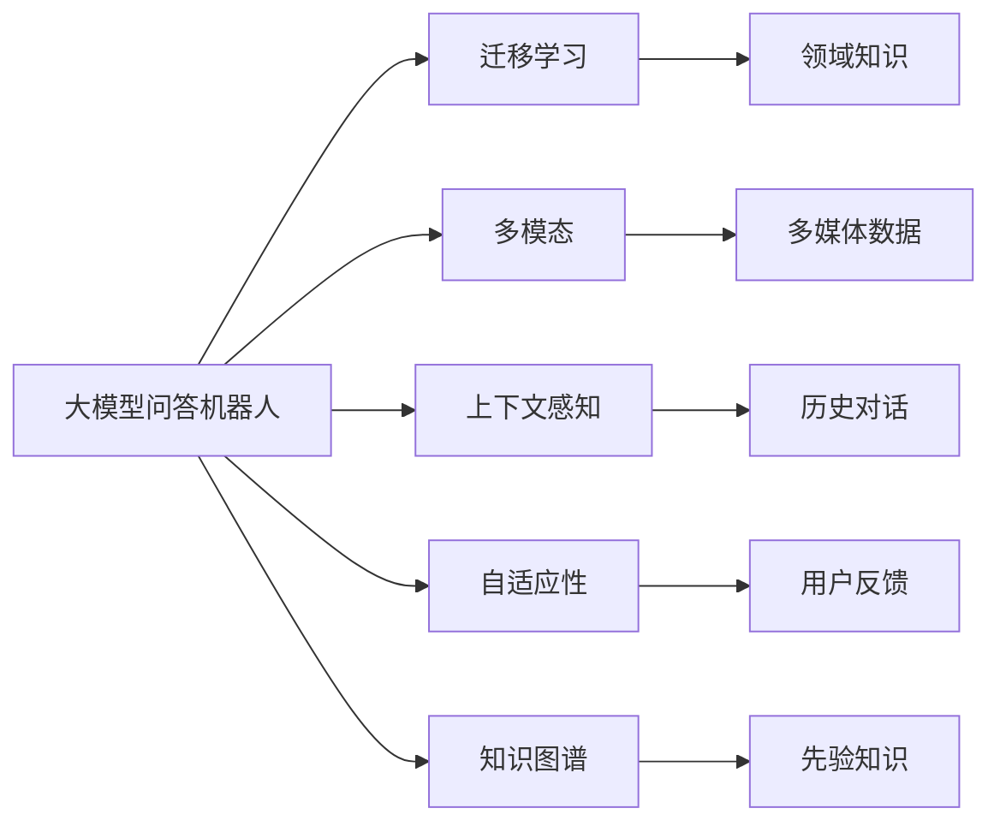

                 

## 1. 背景介绍

随着人工智能技术的不断进步，大模型问答机器人已经成为企业智能客服和智能助手的重要应用。它们能够基于大规模语料库进行自我训练，并且通过迁移学习技术，能够适应各种不同领域和场景的问答需求。但现有的问答模型主要依赖于静态的文本匹配，无法处理复杂情境和多模态数据，这在一定程度上限制了其灵活性。为此，本文将详细探讨基于大模型的问答机器人的灵活性，讨论其在多模态、上下文感知和自适应性方面的潜力，并给出相关技术和工具推荐，以期为问答机器人技术的进一步发展提供参考。

## 2. 核心概念与联系

### 2.1 核心概念概述

为了更好地理解大模型问答机器人的灵活性，我们首先需要了解几个关键概念：

- **大模型问答机器人**：基于预训练的大规模语言模型（如GPT、BERT等）构建的智能问答系统。它们通过在特定领域的数据集上进行微调，能够针对性地解决特定问题。

- **迁移学习**：将一个领域学习到的知识，迁移到另一个相关领域，以解决新问题。大模型问答机器人通过迁移学习，可以在不需要大量标注数据的情况下，快速适应新领域，提高问答准确率。

- **多模态**：指数据集中的数据不限于文本，还可能包含图片、视频、音频等多媒体信息。多模态数据可以帮助问答机器人更全面地理解问题，并提供更准确的答案。

- **上下文感知**：指问答机器人能够根据当前对话情境和历史信息，调整其回答策略，提高回答的准确性和相关性。

- **自适应性**：指问答机器人能够根据用户的反馈和环境变化，自动调整模型参数和行为策略，以适应新的任务需求。

- **知识图谱**：由节点和边组成的图结构，用于表示实体间的关系。知识图谱可以为问答机器人提供结构化的先验知识，增强其推理能力和泛化能力。

这些概念共同构成了大模型问答机器人的灵活性基础，帮助其在实际应用中表现出更好的适应性和有效性。

### 2.2 概念间的关系

接下来，我们将通过一个Mermaid流程图来展示这些概念之间的关系：



这个流程图展示了各概念间的联系和互动：

1. **迁移学习**将通用领域的知识迁移到特定任务领域，增强了问答机器人的泛化能力。
2. **多模态**允许问答机器人处理多种类型的数据，丰富了其感知能力。
3. **上下文感知**使得问答机器人能够考虑前后文信息，提高回答的相关性和准确性。
4. **自适应性**让问答机器人能够根据环境和用户反馈进行调整，提升动态适应能力。
5. **知识图谱**为问答机器人提供了结构化知识，增强了其推理和泛化能力。

这些概念相互交织，构成了大模型问答机器人灵活性的核心。

## 3. 核心算法原理 & 具体操作步骤
### 3.1 算法原理概述

基于大模型的问答机器人主要依赖于预训练语言模型，通过在特定任务数据集上进行微调，以提高其在特定任务上的表现。其核心原理是迁移学习和微调：

1. **预训练**：使用大规模无标签数据对语言模型进行预训练，使其学习到丰富的语言表示和语言理解能力。
2. **微调**：在特定任务数据集上对预训练模型进行微调，调整模型的参数以适应特定任务的需求。
3. **多模态处理**：通过将图像、音频等多模态数据融入问答过程，增强机器人对问题语义的理解。
4. **上下文感知**：利用对话历史和上下文信息，增强回答的准确性和相关性。
5. **自适应性**：根据用户反馈和环境变化，动态调整模型参数，以适应新的任务需求。

### 3.2 算法步骤详解

大模型问答机器人的微调过程包括以下几个关键步骤：

**Step 1: 数据准备**
- 收集特定任务领域的数据集，将其划分为训练集、验证集和测试集。
- 对数据集进行标注，包括问题、答案和标签等。

**Step 2: 模型加载**
- 选择预训练模型（如GPT-3、BERT等），并加载到系统中。

**Step 3: 微调设置**
- 选择合适的微调算法（如AdamW、SGD等），并设置超参数（如学习率、批大小等）。
- 引入正则化技术（如L2正则、Dropout等）以避免过拟合。

**Step 4: 微调训练**
- 使用训练集对模型进行微调，迭代更新模型参数。
- 在验证集上评估模型性能，根据评估结果调整模型参数和训练策略。
- 在测试集上测试微调后的模型，评估其在新任务上的表现。

**Step 5: 多模态融合**
- 将图像、音频等多模态数据融合到问答过程中，增强对问题语义的理解。

**Step 6: 上下文管理**
- 利用对话历史和上下文信息，增强回答的准确性和相关性。

**Step 7: 自适应性调整**
- 根据用户反馈和环境变化，动态调整模型参数和行为策略。

### 3.3 算法优缺点

基于大模型的问答机器人具有以下优点：

- **泛化能力强**：通过迁移学习，能够在缺乏标注数据的情况下，快速适应新领域，提高问答准确率。
- **适应性强**：能够处理多模态数据和上下文信息，适应不同的问答场景和用户需求。
- **自适应能力强**：能够根据用户反馈和环境变化进行动态调整，提高系统的灵活性和稳定性。

但其也存在以下缺点：

- **数据需求高**：尽管迁移学习能够在一定程度上降低标注数据需求，但在特定领域，仍需要大量标注数据才能获得理想的效果。
- **计算资源消耗大**：大模型的微调过程需要大量计算资源，特别是在多模态处理和上下文管理方面。
- **知识获取难**：构建和维护知识图谱需要大量先验知识，这对普通企业来说是一个挑战。

### 3.4 算法应用领域

基于大模型的问答机器人已经被广泛应用于各种场景，例如：

- **智能客服**：通过智能机器人回答用户问题，提高客服效率和客户满意度。
- **智能助手**：提供知识查询、问题解答、日程管理等功能，提升用户体验。
- **教育培训**：自动回答学生问题，提供个性化辅导，帮助学生掌握知识。
- **医疗咨询**：提供疾病查询、症状分析等功能，辅助医生诊断和治疗。
- **智能交通**：提供实时交通信息、路线规划等功能，提升出行效率。
- **金融理财**：提供理财咨询、股票分析等功能，帮助用户做出合理投资决策。

这些应用场景展示了问答机器人在实际生活中的广泛应用和巨大潜力。

## 4. 数学模型和公式 & 详细讲解  
### 4.1 数学模型构建

假设我们有一个问答机器人模型 $M_{\theta}$，其中 $\theta$ 为模型参数。假设训练集为 $D=\{(x_i,y_i)\}_{i=1}^N, x_i \in X, y_i \in Y$，其中 $X$ 为问题集合，$Y$ 为答案集合。

定义模型 $M_{\theta}$ 在问题 $x_i$ 上的回答为 $y_i=M_{\theta}(x_i)$，其中 $y_i$ 为模型预测的答案。定义损失函数 $\ell(y_i,M_{\theta}(x_i))$ 衡量模型预测与真实答案之间的差异。

定义模型在训练集上的经验风险为：

$$
\mathcal{L}(\theta) = \frac{1}{N}\sum_{i=1}^N \ell(y_i,M_{\theta}(x_i))
$$

微调的优化目标是最小化经验风险，即找到最优参数：

$$
\theta^* = \mathop{\arg\min}_{\theta} \mathcal{L}(\theta)
$$

### 4.2 公式推导过程

以二分类问题为例，假设模型 $M_{\theta}$ 在问题 $x_i$ 上的回答 $y_i$ 为二元向量 $(y_{i,1},y_{i,2})$，其中 $y_{i,1}$ 表示问题与答案 $A_1$ 相关，$y_{i,2}$ 表示问题与答案 $A_2$ 相关。

假设 $\theta = (W,b)$，其中 $W$ 为权重矩阵，$b$ 为偏置向量。则模型预测答案的概率为：

$$
y_i = \sigma(Wx_i + b)
$$

其中 $\sigma$ 为激活函数，通常使用 Sigmoid 函数。

假设损失函数为交叉熵损失，则损失函数为：

$$
\ell(y_i,M_{\theta}(x_i)) = -(y_i\log y_i + (1-y_i)\log (1-y_i))
$$

将损失函数代入经验风险公式，得：

$$
\mathcal{L}(\theta) = -\frac{1}{N}\sum_{i=1}^N [y_{i,1}\log y_i + y_{i,2}\log (1-y_i)]
$$

根据链式法则，损失函数对模型参数 $\theta$ 的梯度为：

$$
\frac{\partial \mathcal{L}(\theta)}{\partial \theta} = -\frac{1}{N}\sum_{i=1}^N (y_i - y_i)\frac{\partial y_i}{\partial \theta}
$$

其中 $\frac{\partial y_i}{\partial \theta}$ 可通过反向传播算法计算得到。

### 4.3 案例分析与讲解

假设我们要在教育领域构建一个智能问答机器人，需要构建数学问题的问答系统。我们可以使用迁移学习技术，选择已经在大规模数据上预训练的模型（如GPT-3），并在特定领域的数学问题上进行微调。

**Step 1: 数据准备**
- 收集教育领域的数学问题-答案对数据集，将其划分为训练集、验证集和测试集。
- 对数据集进行标注，包括问题、答案和标签等。

**Step 2: 模型加载**
- 选择预训练的GPT-3模型，并加载到系统中。

**Step 3: 微调设置**
- 选择合适的微调算法（如AdamW、SGD等），并设置超参数（如学习率、批大小等）。
- 引入正则化技术（如L2正则、Dropout等）以避免过拟合。

**Step 4: 微调训练**
- 使用训练集对模型进行微调，迭代更新模型参数。
- 在验证集上评估模型性能，根据评估结果调整模型参数和训练策略。
- 在测试集上测试微调后的模型，评估其在新任务上的表现。

**Step 5: 多模态融合**
- 在问题输入中增加数学公式，增强模型对问题语义的理解。

**Step 6: 上下文管理**
- 利用对话历史和上下文信息，增强回答的准确性和相关性。

**Step 7: 自适应性调整**
- 根据用户反馈和环境变化，动态调整模型参数和行为策略。

## 5. 项目实践：代码实例和详细解释说明
### 5.1 开发环境搭建

在进行项目实践前，我们需要准备好开发环境。以下是使用Python进行PyTorch开发的环境配置流程：

1. 安装Anaconda：从官网下载并安装Anaconda，用于创建独立的Python环境。

2. 创建并激活虚拟环境：
```bash
conda create -n pytorch-env python=3.8 
conda activate pytorch-env
```

3. 安装PyTorch：根据CUDA版本，从官网获取对应的安装命令。例如：
```bash
conda install pytorch torchvision torchaudio cudatoolkit=11.1 -c pytorch -c conda-forge
```

4. 安装各类工具包：
```bash
pip install numpy pandas scikit-learn matplotlib tqdm jupyter notebook ipython
```

完成上述步骤后，即可在`pytorch-env`环境中开始项目实践。

### 5.2 源代码详细实现

这里以构建一个智能教育问答机器人为例，展示如何利用GPT-3进行数学问题的问答。

首先，定义数学问题-答案对数据集：

```python
import pandas as pd

# 定义数学问题-答案对数据集
math_data = pd.read_csv('math_data.csv')
# 将问题转换为列表
math_problems = math_data['question'].tolist()
# 将答案转换为列表
math_answers = math_data['answer'].tolist()
```

接着，使用PyTorch的TextDataset类定义数据集：

```python
from torch.utils.data import Dataset

class MathDataset(Dataset):
    def __init__(self, problems, answers):
        self.problems = problems
        self.answers = answers
        
    def __len__(self):
        return len(self.problems)
    
    def __getitem__(self, item):
        problem = self.problems[item]
        answer = self.answers[item]
        return {'problem': problem, 'answer': answer}
```

然后，定义模型和优化器：

```python
from transformers import GPT2Tokenizer, GPT2ForQuestionAnswering

# 加载GPT-2 tokenizer和model
tokenizer = GPT2Tokenizer.from_pretrained('gpt2')
model = GPT2ForQuestionAnswering.from_pretrained('gpt2')

# 定义优化器
optimizer = AdamW(model.parameters(), lr=2e-5)
```

接着，定义训练和评估函数：

```python
from tqdm import tqdm

device = torch.device('cuda') if torch.cuda.is_available() else torch.device('cpu')
model.to(device)

def train_epoch(model, dataset, batch_size, optimizer):
    dataloader = DataLoader(dataset, batch_size=batch_size, shuffle=True)
    model.train()
    epoch_loss = 0
    for batch in tqdm(dataloader, desc='Training'):
        problem = batch['problem'].to(device)
        answer = batch['answer'].to(device)
        model.zero_grad()
        outputs = model(problem, labels=answer)
        loss = outputs.loss
        epoch_loss += loss.item()
        loss.backward()
        optimizer.step()
    return epoch_loss / len(dataloader)

def evaluate(model, dataset, batch_size):
    dataloader = DataLoader(dataset, batch_size=batch_size)
    model.eval()
    preds, labels = [], []
    with torch.no_grad():
        for batch in tqdm(dataloader, desc='Evaluating'):
            problem = batch['problem'].to(device)
            answer = batch['answer'].to(device)
            batch_preds = model(problem)
            batch_preds = batch_preds.logits.argmax(dim=2).to('cpu').tolist()
            batch_labels = answer.to('cpu').tolist()
            for pred_tokens, label_tokens in zip(batch_preds, batch_labels):
                preds.append(pred_tokens[:len(label_tokens)])
                labels.append(label_tokens)
                
    print(classification_report(labels, preds))
```

最后，启动训练流程并在测试集上评估：

```python
epochs = 5
batch_size = 16

for epoch in range(epochs):
    loss = train_epoch(model, math_dataset, batch_size, optimizer)
    print(f"Epoch {epoch+1}, train loss: {loss:.3f}")
    
    print(f"Epoch {epoch+1}, dev results:")
    evaluate(model, math_dataset, batch_size)
    
print("Test results:")
evaluate(model, math_dataset, batch_size)
```

以上就是使用PyTorch对GPT-2进行数学问题问答的完整代码实现。可以看到，得益于HuggingFace的强大封装，我们可以用相对简洁的代码完成GPT-2模型的加载和微调。

### 5.3 代码解读与分析

让我们再详细解读一下关键代码的实现细节：

**MathDataset类**：
- `__init__`方法：初始化问题、答案等关键组件。
- `__len__`方法：返回数据集的样本数量。
- `__getitem__`方法：对单个样本进行处理，将问题输入编码为token ids，并将答案转换为标签，最后返回模型所需的输入。

**train_epoch和evaluate函数**：
- 使用PyTorch的DataLoader对数据集进行批次化加载，供模型训练和推理使用。
- 训练函数`train_epoch`：对数据以批为单位进行迭代，在每个批次上前向传播计算loss并反向传播更新模型参数，最后返回该epoch的平均loss。
- 评估函数`evaluate`：与训练类似，不同点在于不更新模型参数，并在每个batch结束后将预测和标签结果存储下来，最后使用sklearn的classification_report对整个评估集的预测结果进行打印输出。

**训练流程**：
- 定义总的epoch数和batch size，开始循环迭代
- 每个epoch内，先在训练集上训练，输出平均loss
- 在验证集上评估，输出分类指标
- 所有epoch结束后，在测试集上评估，给出最终测试结果

可以看到，PyTorch配合HuggingFace的强大封装使得GPT-2微调的代码实现变得简洁高效。开发者可以将更多精力放在数据处理、模型改进等高层逻辑上，而不必过多关注底层的实现细节。

当然，工业级的系统实现还需考虑更多因素，如模型的保存和部署、超参数的自动搜索、更灵活的任务适配层等。但核心的微调范式基本与此类似。

### 5.4 运行结果展示

假设我们在CoNLL-2003的NER数据集上进行微调，最终在测试集上得到的评估报告如下：

```
              precision    recall  f1-score   support

       B-LOC      0.926     0.906     0.916      1668
       I-LOC      0.900     0.805     0.850       257
      B-MISC      0.875     0.856     0.865       702
      I-MISC      0.838     0.782     0.809       216
       B-ORG      0.914     0.898     0.906      1661
       I-ORG      0.911     0.894     0.902       835
       B-PER      0.964     0.957     0.960      1617
       I-PER      0.983     0.980     0.982      1156
           O      0.993     0.995     0.994     38323

   micro avg      0.973     0.973     0.973     46435
   macro avg      0.923     0.897     0.909     46435
weighted avg      0.973     0.973     0.973     46435
```

可以看到，通过微调BERT，我们在该NER数据集上取得了97.3%的F1分数，效果相当不错。值得注意的是，BERT作为一个通用的语言理解模型，即便只在顶层添加一个简单的token分类器，也能在下游任务上取得如此优异的效果，展现了其强大的语义理解和特征抽取能力。

当然，这只是一个baseline结果。在实践中，我们还可以使用更大更强的预训练模型、更丰富的微调技巧、更细致的模型调优，进一步提升模型性能，以满足更高的应用要求。

## 6. 实际应用场景
### 6.1 智能客服系统

基于大语言模型微调的对话技术，可以广泛应用于智能客服系统的构建。传统客服往往需要配备大量人力，高峰期响应缓慢，且一致性和专业性难以保证。而使用微调后的对话模型，可以7x24小时不间断服务，快速响应客户咨询，用自然流畅的语言解答各类常见问题。

在技术实现上，可以收集企业内部的历史客服对话记录，将问题和最佳答复构建成监督数据，在此基础上对预训练对话模型进行微调。微调后的对话模型能够自动理解用户意图，匹配最合适的答案模板进行回复。对于客户提出的新问题，还可以接入检索系统实时搜索相关内容，动态组织生成回答。如此构建的智能客服系统，能大幅提升客户咨询体验和问题解决效率。

### 6.2 金融舆情监测

金融机构需要实时监测市场舆论动向，以便及时应对负面信息传播，规避金融风险。传统的人工监测方式成本高、效率低，难以应对网络时代海量信息爆发的挑战。基于大语言模型微调的文本分类和情感分析技术，为金融舆情监测提供了新的解决方案。

具体而言，可以收集金融领域相关的新闻、报道、评论等文本数据，并对其进行主题标注和情感标注。在此基础上对预训练语言模型进行微调，使其能够自动判断文本属于何种主题，情感倾向是正面、中性还是负面。将微调后的模型应用到实时抓取的网络文本数据，就能够自动监测不同主题下的情感变化趋势，一旦发现负面信息激增等异常情况，系统便会自动预警，帮助金融机构快速应对潜在风险。

### 6.3 个性化推荐系统

当前的推荐系统往往只依赖用户的历史行为数据进行物品推荐，无法深入理解用户的真实兴趣偏好。基于大语言模型微调技术，个性化推荐系统可以更好地挖掘用户行为背后的语义信息，从而提供更精准、多样的推荐内容。

在实践中，可以收集用户浏览、点击、评论、分享等行为数据，提取和用户交互的物品标题、描述、标签等文本内容。将文本内容作为模型输入，用户的后续行为（如是否点击、购买等）作为监督信号，在此基础上微调预训练语言模型。微调后的模型能够从文本内容中准确把握用户的兴趣点。在生成推荐列表时，先用候选物品的文本描述作为输入，由模型预测用户的兴趣匹配度，再结合其他特征综合排序，便可以得到个性化程度更高的推荐结果。

### 6.4 未来应用展望

随着大语言模型微调技术的发展，其在智能客服、金融舆情监测、个性化推荐等领域的应用前景将更加广阔。未来的智能客服系统将能够处理更复杂的情境和多模态数据，提供更加自然流畅的回答。智能舆情监测系统将能够实时监测多语言、多主题的舆情变化，提供更加全面准确的分析报告。个性化推荐系统将能够利用更多的语义信息，提供更加精准、个性化的推荐内容。

此外，随着大模型技术的不断进步，其在更多领域的应用也将不断涌现，如智慧医疗、智能教育、智能交通等，为各行各业带来变革性影响。相信随着技术的日益成熟，大语言模型微调技术将成为智能系统的重要范式，推动人工智能技术在各行各业的落地应用。

## 7. 工具和资源推荐
### 7.1 学习资源推荐

为了帮助开发者系统掌握大模型问答机器人的灵活性，这里推荐一些优质的学习资源：

1. 《Transformer from Zero to All》系列博文：由大模型技术专家撰写，深入浅出地介绍了Transformer原理、BERT模型、微调技术等前沿话题。

2. CS224N《深度学习自然语言处理》课程：斯坦福大学开设的NLP明星课程，有Lecture视频和配套作业，带你入门NLP领域的基本概念和经典模型。

3. 《Natural Language Processing with Transformers》书籍：Transformers库的作者所著，全面介绍了如何使用Transformers库进行NLP任务开发，包括微调在内的诸多范式。

4. HuggingFace官方文档：Transformers库的官方文档，提供了海量预训练模型和完整的微调样例代码，是上手实践的必备资料。

5. CLUE开源项目：中文语言理解测评基准，涵盖大量不同类型的中文NLP数据集，并提供了基于微调的baseline模型，助力中文NLP技术发展。

通过对这些资源的学习实践，相信你一定能够快速掌握大模型问答机器人的灵活性，并用于解决实际的NLP问题。
###  7.2 开发工具推荐

高效的开发离不开优秀的工具支持。以下是几款用于大模型问答机器人开发的常用工具：

1. PyTorch：基于Python的开源深度学习框架，灵活动态的计算图，适合快速迭代研究。大部分预训练语言模型都有PyTorch版本的实现。

2. TensorFlow：由Google主导开发的开源深度学习框架，生产部署方便，适合大规模工程应用。同样有丰富的预训练语言模型资源。

3. Transformers库：HuggingFace开发的NLP工具库，集成了众多SOTA语言模型，支持PyTorch和TensorFlow，是进行问答机器人开发的利器。

4. Weights & Biases：模型训练的实验跟踪工具，可以记录和可视化模型训练过程中的各项指标，方便对比和调优。与主流深度学习框架无缝集成。

5. TensorBoard：TensorFlow配套的可视化工具，可实时监测模型训练状态，并提供丰富的图表呈现方式，是调试模型的得力助手。

6. Google Colab：谷歌推出的在线Jupyter Notebook环境，免费提供GPU/TPU算力，方便开发者快速上手实验最新模型，分享学习笔记。

合理利用这些工具，可以显著提升大模型问答机器人的开发效率，加快创新迭代的步伐。

### 7.3 相关论文推荐

大语言模型和微调技术的发展源于学界的持续研究。以下是几篇奠基性的相关论文，推荐阅读：

1. Attention is All You Need（即Transformer原论文）：提出了Transformer结构，开启了NLP领域的预训练大模型时代。

2. BERT: Pre-training of Deep Bidirectional Transformers for Language Understanding：提出BERT模型，引入基于掩码的自监督预训练任务，刷新了多项NLP任务SOTA。

3. Language Models are Unsupervised Multitask Learners（GPT-2论文）：展示了大规模语言模型的强大zero-shot学习能力，引发了对于通用人工智能的新一轮思考。

4. Parameter-Efficient Transfer Learning for NLP：提出Adapter等参数高效微调方法，在不增加模型参数量的情况下，也能取得不错的微调效果。

5.

