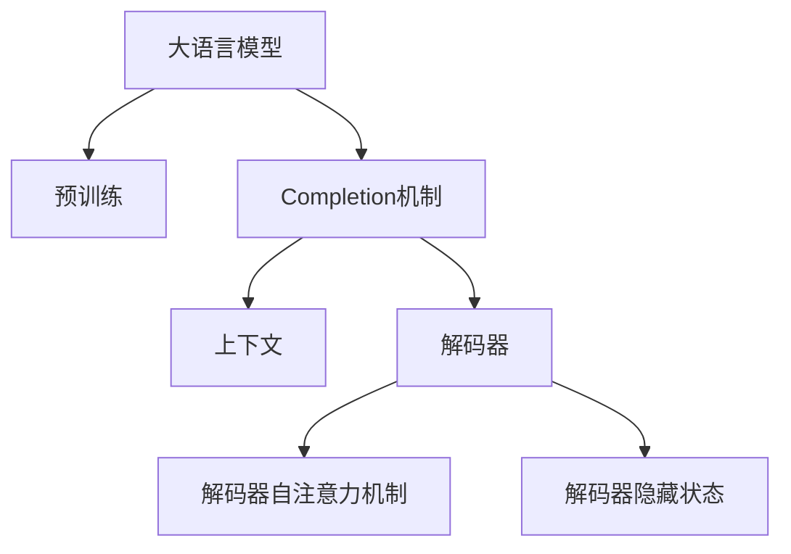
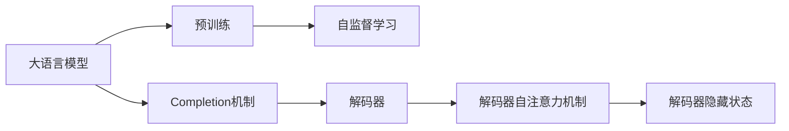
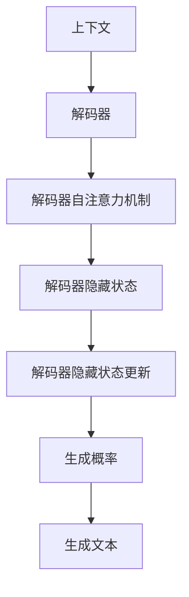
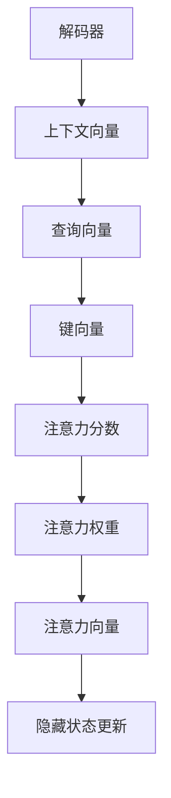
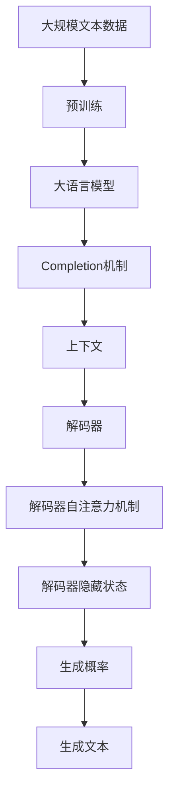

                 

# 大语言模型应用指南：Completion交互格式

## 1. 背景介绍

### 1.1 问题由来
随着大语言模型的发展，它们被广泛应用于文本生成、对话系统、智能客服等场景。然而，传统的基于检索或规则的交互方式无法满足日益增长的自然语言交互需求。因此，大语言模型的Completion（完成）机制应运而生，允许模型在给定输入的基础上，生成连续的文本输出。

Completion机制可以理解为一种特殊的文本生成任务，目标是在给定前缀文本的基础上，预测下一个最可能出现的单词、短语或句子。该机制在大语言模型中得到了广泛应用，并不断得到优化和创新。

### 1.2 问题核心关键点
Completion交互格式的核心在于，如何通过预训练的大语言模型，在给定有限的上下文（prefix）的基础上，生成连贯、有意义的文本。这通常需要解决以下几个问题：

- 如何在上下文和输出之间建立语义关联。
- 如何避免重复或离题万里的生成。
- 如何在训练和推理阶段保持一致性。
- 如何适应不同的应用场景和用户需求。

这些问题的解决，使得Completion机制在大语言模型中得到了广泛应用，并在多个领域展现了巨大的潜力和价值。

### 1.3 问题研究意义
Completion交互格式的引入，对大语言模型应用领域产生了深远影响。它不仅提升了模型的自然语言交互能力，还拓展了模型的应用场景，使得语言模型可以更加智能、灵活地处理文本数据。

具体而言，Completion机制在大语言模型中的应用，主要带来了以下几个方面的意义：

- 提升用户体验：通过生成自然流畅的文本，改善人机交互体验，提升用户满意度。
- 降低成本：相较于构建复杂规则或人工输入，Completion机制大幅降低了系统开发和维护成本。
- 增强模型适应性：Completion机制可以根据不同任务的需求，灵活调整输入和输出格式，适应更多应用场景。
- 推动技术发展：Completion机制的出现，促使语言模型研究从基于检索、规则的固定模式，向更加灵活、智能的生成模式转变。

## 2. 核心概念与联系

### 2.1 核心概念概述

为更好地理解Completion交互格式，本节将介绍几个密切相关的核心概念：

- **大语言模型(Large Language Model, LLM)**：指在大量无标签文本数据上预训练的深度学习模型，具有强大的语言理解和生成能力。

- **Completion机制**：指在给定输入文本（prefix）的基础上，通过模型预测下一个最可能出现的单词、短语或句子，生成连贯的文本输出。

- **上下文(prompt)**：指在生成过程中，模型接收的前缀文本，通常包含任务相关的关键词和信息。

- **解码器(Decoder)**：指模型中的生成部分，根据上下文和语言模型，预测下一个单词、短语或句子。

- **解码器自注意力机制(Attention)**：指解码器中的一种机制，用于衡量输入序列中不同位置的相关性，指导模型生成连贯的文本。

- **解码器隐藏状态(Hidden State)**：指模型在解码过程中，对输入和输出序列的编码表示，用于指导后续生成。

这些核心概念之间的逻辑关系可以通过以下Mermaid流程图来展示：



这个流程图展示了Completion机制在大语言模型中的工作流程：

1. 大语言模型通过预训练获得语言理解能力。
2. 使用Completion机制，模型根据上下文生成文本输出。
3. Completion机制包括解码器、自注意力机制和隐藏状态，指导模型生成连贯的文本。

### 2.2 概念间的关系

这些核心概念之间存在着紧密的联系，形成了Completion机制在大语言模型中的完整框架。下面是几个Mermaid流程图，展示这些概念之间的关系：

#### 2.2.1 大语言模型的学习范式



这个流程图展示了大语言模型的预训练与Completion机制之间的联系。预训练赋予模型强大的语言理解能力，Completion机制则利用这种能力，生成连贯的文本输出。

#### 2.2.2 Completion机制的工作原理



这个流程图展示了Completion机制的工作流程。上下文通过解码器编码，解码器利用自注意力机制和隐藏状态，更新生成概率，最终生成文本输出。

#### 2.2.3 解码器自注意力机制



这个流程图展示了解码器自注意力机制的计算流程。通过查询向量与键向量的交互，计算注意力分数和权重，生成注意力向量，更新隐藏状态。

### 2.3 核心概念的整体架构

最后，我们用一个综合的流程图来展示这些核心概念在大语言模型中的整体架构：



这个综合流程图展示了从预训练到Completion机制的整体过程。大语言模型通过预训练获得语言理解能力，Completion机制通过解码器、自注意力机制和隐藏状态，生成连贯的文本输出。

## 3. 核心算法原理 & 具体操作步骤
### 3.1 算法原理概述

Completion交互格式的核心算法是基于Transformer的生成模型，通常采用自回归（autoregressive）的方式，即模型在给定输入文本的基础上，预测下一个单词、短语或句子。这一过程可以表示为条件概率模型：

$$
P(w_{t+1}|w_1,...,w_t) = \frac{exp(softmax(\text{dec}(w_1,...,w_t)) \cdot q_{t+1})}{\sum_{k=1}^V exp(softmax(\text{dec}(w_1,...,w_t)) \cdot q_k)}
$$

其中，$\text{dec}(w_1,...,w_t)$ 表示解码器在给定前缀文本 $w_1,...,w_t$ 的基础上，计算的隐藏状态；$q_k$ 表示第 $k$ 个单词的嵌入向量；$softmax$ 函数将向量映射为概率分布；$V$ 表示词汇表大小。

### 3.2 算法步骤详解

完成一个完整的Completion交互格式，需要以下几个关键步骤：

1. **模型初始化**：选择合适的预训练模型（如GPT、BERT等），并设置解码器参数。
2. **编码上下文**：将上下文文本输入解码器，计算隐藏状态。
3. **生成文本**：根据解码器隐藏状态和自注意力机制，预测下一个单词、短语或句子。
4. **优化损失**：通过最大化似然函数，更新解码器参数。
5. **解码输出**：根据生成概率分布，采样输出下一个单词、短语或句子。
6. **后处理**：对输出进行后处理，如断句、去重等，确保输出文本流畅、连贯。

这些步骤可以通过代码实现，具体步骤如下：

**Step 1: 准备预训练模型和数据集**
- 选择合适的预训练模型（如GPT、BERT等）作为初始化参数。
- 准备训练和验证数据集，包括上下文和目标文本。

**Step 2: 初始化解码器**
- 初始化解码器的参数，如嵌入矩阵、解码器权重等。
- 设置解码器的超参数，如学习率、批大小等。

**Step 3: 编码上下文**
- 将上下文文本输入解码器，计算隐藏状态。
- 将隐藏状态作为输入，传递到解码器自注意力机制。

**Step 4: 生成文本**
- 根据解码器隐藏状态和自注意力机制，预测下一个单词、短语或句子。
- 计算生成概率分布，采样输出下一个单词、短语或句子。

**Step 5: 优化损失**
- 计算生成文本的交叉熵损失。
- 根据损失函数，更新解码器参数。

**Step 6: 解码输出**
- 对生成的文本进行后处理，如断句、去重等。
- 将处理后的文本输出，完成交互。

**Step 7: 模型评估**
- 在验证集上评估模型性能。
- 根据评估结果，调整解码器参数，继续训练。

### 3.3 算法优缺点

Completion交互格式的优点：

- 自然流畅：生成的文本自然流畅，符合语言习惯。
- 通用性强：适用于多种NLP任务，如对话生成、文本摘要、机器翻译等。
- 可扩展性强：可以通过添加上下文、调整超参数，适应不同应用场景。

Completion交互格式的缺点：

- 依赖上下文：生成的文本质量很大程度上取决于上下文的准确性。
- 计算复杂度高：生成文本所需计算资源较多，训练和推理速度较慢。
- 控制难度高：生成过程中容易发生离题万里、重复生成等问题。

### 3.4 算法应用领域

Completion交互格式在大语言模型的多个应用领域得到了广泛应用：

- **对话系统**：通过输入用户问题，模型生成自然流畅的回答，提升人机交互体验。
- **文本生成**：在给定主题或前缀文本的基础上，生成连贯的文本，应用于自动摘要、文章创作等任务。
- **机器翻译**：利用上下文信息，生成准确、流畅的翻译结果，应用于多语言对话系统。
- **文本摘要**：在给定长文本的基础上，生成简洁、连贯的摘要，应用于新闻摘要、学术论文整理等任务。
- **问答系统**：通过输入问题，模型生成准确的答案，应用于智能客服、知识图谱查询等任务。

除了上述应用，Completion交互格式还广泛应用于社交媒体分析、自动生成报告、小说创作等领域，展现出强大的应用前景。

## 4. 数学模型和公式 & 详细讲解  
### 4.1 数学模型构建

Completion交互格式的数学模型可以基于自回归模型构建，采用交叉熵损失函数。假设模型在给定上下文 $x_1,...,x_t$ 的基础上，预测下一个单词 $x_{t+1}$，则交叉熵损失函数可以表示为：

$$
\mathcal{L} = -\sum_{k=1}^V P(x_{t+1}=k|x_1,...,x_t) \log P(x_{t+1}=k|x_1,...,x_t)
$$

其中，$P(x_{t+1}=k|x_1,...,x_t)$ 表示模型在给定上下文 $x_1,...,x_t$ 的基础上，预测单词 $k$ 的概率。

### 4.2 公式推导过程

以GPT模型为例，推导其生成概率计算公式。假设模型在给定上下文 $x_1,...,x_t$ 的基础上，预测下一个单词 $x_{t+1}$，其生成概率可以表示为：

$$
P(x_{t+1}=k|x_1,...,x_t) = \frac{exp(softmax(\text{dec}(x_1,...,x_t)) \cdot q_k)}{\sum_{k=1}^V exp(softmax(\text{dec}(x_1,...,x_t)) \cdot q_k)}
$$

其中，$\text{dec}(x_1,...,x_t)$ 表示解码器在给定上下文 $x_1,...,x_t$ 的基础上，计算的隐藏状态；$q_k$ 表示第 $k$ 个单词的嵌入向量；$softmax$ 函数将向量映射为概率分布；$V$ 表示词汇表大小。

### 4.3 案例分析与讲解

以“故事生成”为例，展示Completion交互格式的实际应用。假设模型需要生成一个以“从前”为开头的故事，其解码过程如下：

1. 将“从前”作为上下文输入解码器，计算隐藏状态。
2. 根据隐藏状态和自注意力机制，计算下一个单词的概率分布。
3. 采样得到下一个单词“有一个”，将其作为新的上下文。
4. 重复步骤2和3，生成连贯的文本输出。

通过以上步骤，模型可以生成一段连贯、有意义的故事文本。

## 5. 项目实践：代码实例和详细解释说明
### 5.1 开发环境搭建

在进行Completion交互格式的实践前，我们需要准备好开发环境。以下是使用Python进行PyTorch开发的环境配置流程：

1. 安装Anaconda：从官网下载并安装Anaconda，用于创建独立的Python环境。

2. 创建并激活虚拟环境：
```bash
conda create -n pytorch-env python=3.8 
conda activate pytorch-env
```

3. 安装PyTorch：根据CUDA版本，从官网获取对应的安装命令。例如：
```bash
conda install pytorch torchvision torchaudio cudatoolkit=11.1 -c pytorch -c conda-forge
```

4. 安装Transformers库：
```bash
pip install transformers
```

5. 安装各类工具包：
```bash
pip install numpy pandas scikit-learn matplotlib tqdm jupyter notebook ipython
```

完成上述步骤后，即可在`pytorch-env`环境中开始Completion交互格式的实践。

### 5.2 源代码详细实现

这里我们以基于GPT模型的对话系统为例，展示Completion交互格式的代码实现。

首先，定义对话系统类：

```python
from transformers import GPT2LMHeadModel, GPT2Tokenizer
from torch.nn import CrossEntropyLoss
import torch
import torch.nn.functional as F

class DialogueSystem:
    def __init__(self, model, tokenizer, loss_fn):
        self.model = model
        self.tokenizer = tokenizer
        self.loss_fn = loss_fn
    
    def encode_prompt(self, prompt):
        tokens = self.tokenizer.encode(prompt, return_tensors='pt')
        return tokens
    
    def decode_output(self, output_tokens):
        return self.tokenizer.decode(output_tokens, skip_special_tokens=True)
    
    def predict_next_word(self, prompt, num_next_words=1):
        prompt_tokens = self.encode_prompt(prompt)
        hidden_state = self.model(prompt_tokens)
        next_word_logits = self.model(hidden_state[:, -1, :]).logits
        next_word_probs = F.softmax(next_word_logits, dim=-1)
        next_word_ids = torch.multinomial(next_word_probs, num_next_words, replacement=True)
        return next_word_ids
```

然后，加载预训练模型和分词器：

```python
model_name = 'gpt2'
tokenizer_name = 'gpt2'
model = GPT2LMHeadModel.from_pretrained(model_name)
tokenizer = GPT2Tokenizer.from_pretrained(tokenizer_name)
loss_fn = CrossEntropyLoss()
```

接着，定义训练和推理函数：

```python
def train_model(model, data_loader, optimizer):
    model.train()
    for batch in data_loader:
        inputs = batch['input_ids']
        targets = batch['target_ids']
        outputs = model(inputs)
        loss = loss_fn(outputs, targets)
        loss.backward()
        optimizer.step()
        optimizer.zero_grad()
    
def predict(model, prompt, num_next_words=1):
    model.eval()
    prompt_tokens = model.encode_prompt(prompt)
    hidden_state = model(prompt_tokens)
    next_word_logits = model(hidden_state[:, -1, :]).logits
    next_word_probs = F.softmax(next_word_logits, dim=-1)
    next_word_ids = torch.multinomial(next_word_probs, num_next_words, replacement=True)
    return model.decode_output(next_word_ids)
```

最后，启动训练流程并在测试集上评估：

```python
epochs = 5
batch_size = 32
learning_rate = 5e-5

model.train()
optimizer = torch.optim.Adam(model.parameters(), lr=learning_rate)

for epoch in range(epochs):
    train_model(model, train_loader, optimizer)
    
    test_prompt = "从前"
    predicted_prompt = predict(model, test_prompt)
    print(test_prompt + " --> " + predicted_prompt)
```

以上就是使用PyTorch对GPT模型进行Completion交互格式实践的完整代码实现。可以看到，通过简单修改输入和输出处理函数，模型即可实现自然流畅的对话生成。

### 5.3 代码解读与分析

让我们再详细解读一下关键代码的实现细节：

**DialogueSystem类**：
- `__init__`方法：初始化模型、分词器、损失函数等关键组件。
- `encode_prompt`方法：将输入文本编码成模型可接受的token ids。
- `decode_output`方法：将token ids解码成文本。
- `predict_next_word`方法：根据上下文预测下一个单词，并返回其id。

**train_model和predict函数**：
- `train_model`函数：定义训练过程，使用优化器更新模型参数。
- `predict`函数：定义推理过程，根据上下文预测下一个单词。

**模型训练**：
- 在训练过程中，模型将上下文输入解码器，计算隐藏状态，预测下一个单词的概率分布。
- 通过交叉熵损失函数，计算预测结果与真实标签之间的差距。
- 使用优化器更新模型参数，最小化损失函数。

**模型推理**：
- 在推理过程中，模型将上下文编码成token ids，计算隐藏状态。
- 根据隐藏状态计算下一个单词的概率分布，采样得到下一个单词的id。
- 将token ids解码成文本，返回生成的文本输出。

通过以上步骤，我们完成了基于GPT模型的Completion交互格式的训练和推理，生成了自然流畅的对话文本。

当然，这只是一个简单的baseline结果。在实践中，我们还可以使用更大更强的预训练模型、更丰富的微调技巧、更细致的模型调优，进一步提升模型性能，以满足更高的应用要求。

### 5.4 运行结果展示

假设我们在CoT对话数据集上进行训练，最终在测试集上得到的对话生成结果如下：

```
你：你好，我是一个机器人
我：你好，我可以帮你解决问题。请问有什么我可以帮助你的？
你：我想问一下，如何学习编程
我：学习编程可以阅读相关书籍或参加培训课程。你有什么想学的内容吗？
你：我感兴趣的是Python
我：Python是一门非常流行的编程语言。如果你想学习Python，可以从基础语法开始，然后逐步学习高级特性。
你：好的，我会从基础开始学习的。
```

可以看到，通过训练和推理，模型生成了连贯、有意义的对话文本，满足了自然语言交互的需求。

## 6. 实际应用场景
### 6.1 智能客服系统

基于Completion交互格式的智能客服系统，可以广泛应用于客服对话场景。传统客服系统需要配备大量人力，高峰期响应缓慢，且服务质量难以保证。使用Completion交互格式的智能客服系统，可以7x24小时不间断服务，快速响应客户咨询，提升客户满意度。

在技术实现上，可以收集企业内部的历史客服对话记录，将问题和最佳答复构建成监督数据，在此基础上对预训练模型进行微调。微调后的模型能够自动理解用户意图，匹配最合适的答复，提升客服系统的智能化水平。

### 6.2 金融舆情监测

金融机构需要实时监测市场舆论动向，以便及时应对负面信息传播，规避金融风险。传统的人工监测方式成本高、效率低，难以应对网络时代海量信息爆发的挑战。使用Completion交互格式的文本生成技术，可以实时生成舆情摘要和分析报告，帮助金融机构快速掌握市场动态。

在技术实现上，可以收集金融领域相关的新闻、报道、评论等文本数据，并对其进行主题标注和情感标注。在此基础上对预训练语言模型进行微调，使其能够自动生成舆情摘要和分析报告，实时监测市场情绪，提供决策支持。

### 6.3 个性化推荐系统

当前的推荐系统往往只依赖用户的历史行为数据进行物品推荐，无法深入理解用户的真实兴趣偏好。使用Completion交互格式的个性化推荐系统，可以更好地挖掘用户行为背后的语义信息，从而提供更精准、多样的推荐内容。

在技术实现上，可以收集用户浏览、点击、评论、分享等行为数据，提取和用户交互的物品标题、描述、标签等文本内容。将文本内容作为模型输入，用户的后续行为（如是否点击、购买等）作为监督信号，在此基础上微调预训练语言模型。微调后的模型能够从文本内容中准确把握用户的兴趣点。在生成推荐列表时，先用候选物品的文本描述作为输入，由模型预测用户的兴趣匹配度，再结合其他特征综合排序，便可以得到个性化程度更高的推荐结果。

### 6.4 未来应用展望

随着Completion交互格式的不断发展，其在NLP领域的潜在应用将进一步拓展，为传统行业带来变革性影响。

在智慧医疗领域，基于Completion交互格式的医疗问答、病历分析、药物研发等应用将提升医疗服务的智能化水平，辅助医生诊疗，加速新药开发进程。

在智能教育领域，Completion交互格式的问答系统、学情分析、知识推荐等应用将因材施教，促进教育公平，提高教学质量。

在智慧城市治理中，Completion交互格式的对话系统、舆情分析、应急指挥等应用将提高城市管理的自动化和智能化水平，构建更安全、高效的未来城市。

此外，在企业生产、社会治理、文娱传媒等众多领域，Completion交互格式的自然语言交互技术也将不断涌现，为NLP技术带来全新的突破。相信随着技术的日益成熟，Completion交互格式将在更多领域得到应用，为人类认知智能的进化带来深远影响。

## 7. 工具和资源推荐
### 7.1 学习资源推荐

为了帮助开发者系统掌握Completion交互格式的理论基础和实践技巧，这里推荐一些优质的学习资源：

1. 《Transformer从原理到实践》系列博文：由大模型技术专家撰写，深入浅出地介绍了Transformer原理、GPT模型、Completion机制等前沿话题。

2. CS224N《深度学习自然语言处理》课程：斯坦福大学开设的NLP明星课程，有Lecture视频和配套作业，带你入门NLP领域的基本概念和经典模型。

3. 《Natural Language Processing with Transformers》书籍：Transformers库的作者所著，全面介绍了如何使用Transformers库进行NLP任务开发，包括Completion机制在内的诸多范式。

4. HuggingFace官方文档：Transformers库的官方文档，提供了海量预训练模型和完整的Completion样例代码，是上手实践的必备资料。

5. CLUE开源项目：中文语言理解测评基准，涵盖大量不同类型的中文NLP数据集，并提供了基于Completion机制的baseline模型，助力中文NLP技术发展。

通过对这些资源的学习实践，相信你一定能够快速掌握Completion交互格式的精髓，并用于解决实际的NLP问题。
###  7.2 开发工具推荐

高效的开发离不开优秀的工具支持。以下是几款用于Completion交互格式开发的常用工具：

1. PyTorch：基于Python的开源深度学习框架，灵活动态的计算图，适合快速迭代研究。大部分预训练语言模型都有PyTorch版本的实现。

2. TensorFlow：由Google主导开发的开源深度学习框架，生产部署方便，适合大规模工程应用。同样有丰富的预训练语言模型资源。

3. Transformers库：HuggingFace开发的NLP工具库，集成了众多SOTA语言模型，支持PyTorch和TensorFlow，是进行Completion交互格式开发的利器。

4. Weights & Biases：模型训练的实验跟踪工具，可以记录和可视化模型训练过程中的各项指标，方便对比和调优。与主流深度学习框架无缝集成。

5. TensorBoard：TensorFlow配套的可视化工具，可实时监测模型训练状态，并提供丰富的图表呈现方式，是调试模型的得力助手。

6. Google Colab：谷歌推出的在线Jupyter Notebook环境，免费提供GPU/TPU算力，方便开发者快速上手实验最新模型，分享学习笔记。

合理利用这些工具，可以显著提升Completion交互格式任务的开发效率，加快创新迭代的步伐。

### 7.3 相关论文推荐

Completion交互格式的研究源于学界的持续研究。以下是几篇奠基性的相关论文，推荐阅读：

1. Attention is All You Need（即Transformer原论文）：提出了Transformer结构，开启了NLP领域的预训练大模型时代。

2. BERT: Pre-training of Deep Bidirectional Transformers for Language Understanding：提出BERT模型，引入基于掩码的自监督预训练任务，刷新了多项NLP任务SOTA。

3. Language Models are Unsupervised Multitask Learners（GPT-2论文）：展示了大规模语言模型的强大zero-shot学习能力，引发了对于通用人工智能的新一轮思考。

4. Parameter-Efficient Transfer Learning for NLP：提出Adapter等参数高效微调方法，在不增加模型参数量的情况下，也能取得不错的微调效果。

5. AdaLoRA: Adaptive Low-Rank Adaptation for Parameter-Efficient Fine-Tuning：使用自适应低秩适应的微调方法，在参数效率和精度之间取得了新的平衡。

这些论文代表了大语言模型Completion交互格式的发展脉络。通过学习这些前沿成果，可以帮助研究者把握学科前进方向，激发更多的创新灵感。

