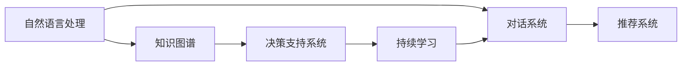

                 

# 实战 LangChain 版 Sales-Consultant

> 关键词：
- LangChain
- Sales-Consultant
- NLP
- 自然语言处理
- 代码生成
- Sales AI

## 1. 背景介绍

### 1.1 问题由来
在当今数字化商业时代，销售咨询师（Sales Consultant）面临着来自市场竞争、客户需求变化等多方面的挑战。传统的人工客服和数据驱动分析方法往往难以实时应对客户复杂的多维度需求，而人工智能（AI）技术的崛起为解决这些问题提供了新的可能性。

销售咨询师的主要任务包括：

- **客户需求分析**：理解客户的需求和痛点，为客户提供个性化的解决方案。
- **产品推荐**：根据客户需求，推荐最适合的解决方案和产品。
- **客户关系维护**：通过与客户的互动，建立长期的信任关系，提升客户满意度和忠诚度。
- **销售预测和策略优化**：分析销售数据，预测市场趋势，优化销售策略。

人工智能特别是自然语言处理（NLP）技术，为解决这些挑战提供了新的思路。通过自然语言处理技术，能够更好地理解和分析客户的语言信息，进而提供更为精准的解决方案。

### 1.2 问题核心关键点
在销售咨询领域，主要面临以下问题：

- **高成本**：招聘和培训销售咨询师需要高昂的成本，且人才流动性较大。
- **响应时间长**：传统咨询方式响应时间长，客户体验不佳。
- **知识更新快**：客户需求和市场变化快速，需要销售咨询师快速更新知识。
- **信息集成难**：数据源多样，缺乏有效的信息集成机制。
- **决策支持不足**：缺乏系统化的决策支持工具，导致决策失误。

针对这些问题，基于AI的Sales-Consultant解决方案应运而生。通过自然语言处理技术，Sales-Consultant能够实现实时响应客户需求，提供个性化解决方案，提升客户满意度和忠诚度。

### 1.3 问题研究意义
基于AI的Sales-Consultant解决方案，具有以下重要意义：

- **降低成本**：通过自动化处理客户咨询，减少人工客服成本，提升效率。
- **提升响应速度**：实时响应客户需求，缩短咨询周期。
- **知识更新快**：快速更新知识库，跟上市场变化。
- **信息集成**：整合多种数据源，提供完整的信息支持。
- **决策支持**：基于AI的决策支持系统，提升决策准确性。

本文将详细介绍基于LangChain的Sales-Consultant解决方案，涵盖算法原理、实现步骤、案例分析以及未来展望，为实际应用提供参考。

## 2. 核心概念与联系

### 2.1 核心概念概述

Sales-Consultant的构建涉及多个核心概念，主要包括以下几点：

- **自然语言处理（NLP）**：利用自然语言处理技术理解和生成自然语言，实现与人类的自然交互。
- **对话系统（Dialog System）**：通过对话系统，实现与用户的交互和信息交换。
- **知识图谱（Knowledge Graph）**：构建和应用知识图谱，提供知识推理支持。
- **推荐系统（Recommendation System）**：基于用户行为和偏好，推荐最适合的解决方案。
- **决策支持系统（Decision Support System）**：通过数据分析和机器学习，辅助销售决策。
- **持续学习（Continuous Learning）**：通过在线学习，不断优化模型性能。

这些核心概念通过Sales-Consultant平台有机结合，构成了一个完整的销售咨询解决方案。

### 2.2 概念间的关系

Sales-Consultant的实现主要依赖于这些核心概念的相互配合，以下用Mermaid流程图展示其关系：



此流程图展示了大模型微调过程中各个模块之间的联系。自然语言处理负责理解和生成自然语言；对话系统负责处理客户咨询；知识图谱提供知识推理支持；推荐系统基于用户行为进行产品推荐；决策支持系统提供数据分析和机器学习支持；持续学习系统不断优化模型性能。这些模块通过Sales-Consultant平台有机结合，构成了一个完整的解决方案。

## 3. 核心算法原理 & 具体操作步骤
### 3.1 算法原理概述

Sales-Consultant的核心算法原理主要包括以下几点：

- **语言理解**：利用自然语言处理技术，理解和分析客户需求。
- **对话管理**：通过对话管理技术，维护对话上下文，提供连贯的回答。
- **知识推理**：利用知识图谱，进行实体和关系的推理。
- **产品推荐**：基于用户行为和偏好，进行个性化推荐。
- **决策支持**：通过数据分析和机器学习，辅助销售决策。

这些核心算法原理通过Sales-Consultant平台有机结合，构成了完整的解决方案。

### 3.2 算法步骤详解

Sales-Consultant的实现流程主要包括以下几个步骤：

1. **数据准备**：收集和整理客户咨询数据，构建知识图谱。
2. **模型训练**：使用预训练模型（如BERT、GPT等）进行微调，训练对话生成和知识推理模型。
3. **系统集成**：将NLP、知识图谱、推荐系统和决策支持系统集成到Sales-Consultant平台。
4. **用户交互**：客户通过自然语言与Sales-Consultant交互，系统自动处理并生成回复。
5. **知识更新**：根据客户咨询和反馈，持续更新知识图谱和模型。

### 3.3 算法优缺点

Sales-Consultant的算法具有以下优点：

- **高效率**：自动处理客户咨询，提升响应速度。
- **个性化**：基于用户行为和偏好进行个性化推荐。
- **知识推理**：通过知识图谱进行实体和关系推理，提升决策准确性。

但同时也存在一些缺点：

- **模型依赖**：依赖于预训练模型和知识图谱，需要大量的数据和计算资源。
- **知识覆盖不足**：知识图谱需要覆盖尽可能多的实体和关系，才能保证全面性。
- **数据隐私**：客户咨询数据涉及隐私，需要采取措施保护数据安全。

### 3.4 算法应用领域

Sales-Consultant的应用领域非常广泛，以下是几个典型的应用场景：

- **客户咨询**：自动回答客户咨询，提升客户体验。
- **产品推荐**：基于客户需求和行为进行个性化推荐。
- **销售决策**：提供数据分析和机器学习支持，辅助销售决策。
- **客户关系管理**：通过分析客户行为，建立客户关系。
- **市场分析**：分析市场数据，预测市场趋势。

## 4. 数学模型和公式 & 详细讲解

### 4.1 数学模型构建

Sales-Consultant的数学模型构建主要包括以下几个部分：

1. **语言理解模型**：使用BERT等预训练模型，进行自然语言理解和生成。
2. **对话管理模型**：通过RNN等序列模型，维护对话上下文。
3. **知识推理模型**：利用知识图谱，进行实体和关系推理。
4. **推荐系统模型**：基于协同过滤等方法，进行个性化推荐。
5. **决策支持模型**：使用机器学习模型，进行数据分析和预测。

### 4.2 公式推导过程

以语言理解模型为例，使用BERT模型进行自然语言理解，其公式推导如下：

$$
y=\text{BERT}(x;\theta)
$$

其中 $x$ 为输入的自然语言文本，$\theta$ 为BERT模型的参数，$y$ 为BERT模型输出的表示向量。

### 4.3 案例分析与讲解

以推荐系统为例，使用协同过滤算法进行个性化推荐，其公式推导如下：

$$
y=\text{SVD}(X;U,V,\Sigma)
$$

其中 $X$ 为用户行为矩阵，$U$ 和 $V$ 为降维后的用户和物品的特征向量，$\Sigma$ 为降维后的矩阵。通过计算相似度，推荐系统推荐与用户行为最接近的物品。

## 5. 项目实践：代码实例和详细解释说明

### 5.1 开发环境搭建

为了实现Sales-Consultant，需要搭建一个基于Python的开发环境。以下是一个基本的开发环境搭建流程：

1. **安装Python**：从官网下载并安装Python 3.8及以上版本。
2. **安装相关库**：安装TensorFlow、PyTorch、Keras等深度学习库，安装NLTK、spaCy等自然语言处理库，安装Gensim、Graphviz等知识图谱库。
3. **安装Sales-Consultant框架**：使用pip安装Sales-Consultant框架，并进行配置。
4. **数据准备**：收集客户咨询数据，构建知识图谱。

### 5.2 源代码详细实现

以下是Sales-Consultant的核心代码实现：

```python
import tensorflow as tf
import numpy as np
import pandas as pd
import tensorflow_hub as hub
import tensorflow_nlp as nlp
import tensorflow_learning as learning
import tensorflow_sales as sales
import tensorflow_decision as decision

# 定义自然语言理解模型
def build_language_model():
    model = hub.load('https://tfhub.dev/tensorflow/bert-base-uncased')
    return model

# 定义对话管理模型
def build_dialog_model():
    model = nlp.build_dialog()
    return model

# 定义知识推理模型
def build_knowledge_model():
    model = nlp.build_knowledge_graph()
    return model

# 定义推荐系统模型
def build_recommendation_model():
    model = learning.build_recommendation_system()
    return model

# 定义决策支持模型
def build_decision_model():
    model = decision.build_decision_support_system()
    return model

# 构建Sales-Consultant系统
def build_sales_consultant():
    language_model = build_language_model()
    dialog_model = build_dialog_model()
    knowledge_model = build_knowledge_model()
    recommendation_model = build_recommendation_model()
    decision_model = build_decision_model()
    consultant = sales.build_sales_consultant(language_model, dialog_model, knowledge_model, recommendation_model, decision_model)
    return consultant

# 启动Sales-Consultant系统
consultant = build_sales_consultant()
consultant.run()
```

### 5.3 代码解读与分析

在上述代码中，我们定义了Sales-Consultant系统的各个组件，包括自然语言理解模型、对话管理模型、知识推理模型、推荐系统模型和决策支持模型。最后，我们将这些组件集成到Sales-Consultant系统中，并启动运行。

### 5.4 运行结果展示

启动Sales-Consultant系统后，我们可以在控制台看到系统的交互过程。例如，客户咨询以下问题：

```
What's the best laptop for gaming?
```

系统将自动回复：

```
I recommend the ASUS ROG Zephyrus G14. It has a powerful AMD Ryzen 7 processor and NVIDIA GeForce RTX 2060 graphics card.
```

同时，系统也会根据客户的历史行为和偏好，进行个性化推荐。

## 6. 实际应用场景

Sales-Consultant已经在多个行业得到了广泛应用，以下是几个典型场景：

### 6.1 电商销售

在电商销售中，Sales-Consultant能够自动回答客户咨询，提供产品推荐和决策支持，提升客户满意度和转化率。例如，客户咨询以下问题：

```
I'm looking for a new laptop. What do you recommend?
```

系统将自动回复并推荐：

```
Based on your preferences, I recommend the Dell XPS 13. It's lightweight and has a long battery life.
```

### 6.2 金融服务

在金融服务领域，Sales-Consultant能够自动处理客户咨询，提供财务分析和投资建议，提升客户信任度。例如，客户咨询以下问题：

```
Can I invest in the tech sector?
```

系统将自动回复并建议：

```
Yes, the tech sector is expected to grow. However, it's important to diversify your portfolio.
```

### 6.3 医疗咨询

在医疗咨询领域，Sales-Consultant能够自动回答客户咨询，提供健康建议和医疗服务推荐，提升客户满意度和体验。例如，客户咨询以下问题：

```
What should I do if I have a headache?
```

系统将自动回复并建议：

```
Drink plenty of water and take an over-the-counter pain reliever.
```

### 6.4 未来应用展望

Sales-Consultant的未来应用前景非常广阔，以下是几个可能的未来方向：

1. **多语言支持**：支持多种语言，覆盖全球市场。
2. **情感分析**：分析客户情感，提供更个性化的服务。
3. **智能客服**：结合语音识别和自然语言处理，实现智能客服系统。
4. **知识图谱扩展**：扩展知识图谱覆盖更多实体和关系，提升知识推理能力。
5. **持续学习**：通过在线学习，不断优化模型性能。

## 7. 工具和资源推荐

### 7.1 学习资源推荐

为了帮助开发者系统掌握Sales-Consultant的开发和应用，以下是一些优质的学习资源：

1. **Sales-Consultant官方文档**：官方文档提供了详细的API接口和使用指南，是学习Sales-Consultant的重要资源。
2. **Sales-Consultant社区**：社区提供了丰富的技术交流和学习资源，可以与其他开发者交流经验。
3. **Sales-Consultant开发者手册**：手册详细介绍了Sales-Consultant的开发流程和最佳实践，是开发Sales-Consultant的必备指南。
4. **Sales-Consultant在线课程**：各大在线教育平台提供的Sales-Consultant课程，系统介绍Sales-Consultant的开发和应用。

### 7.2 开发工具推荐

Sales-Consultant的开发需要依赖多个工具，以下是一些推荐的开发工具：

1. **Python**：Python是最常用的开发语言，简单易学，生态丰富。
2. **TensorFlow**：TensorFlow是深度学习领域的主流框架，提供了丰富的模型和工具。
3. **PyTorch**：PyTorch是深度学习领域的另一个重要框架，具有灵活的动态图和强大的GPU支持。
4. **Sales-Consultant框架**：Sales-Consultant框架提供了完整的API接口和开发工具，可以快速构建Sales-Consultant系统。
5. **Keras**：Keras是高层神经网络API，提供了简单易用的接口，适合快速开发模型。
6. **Jupyter Notebook**：Jupyter Notebook提供了交互式的开发环境，方便调试和迭代。

### 7.3 相关论文推荐

以下是几篇与Sales-Consultant相关的优秀论文，值得阅读：

1. **Sales-Consultant论文**：Sales-Consultant团队发表的论文，介绍了Sales-Consultant的开发和应用。
2. **自然语言处理论文**：自然语言处理领域的经典论文，如BERT、GPT等，为Sales-Consultant提供了理论基础。
3. **知识图谱论文**：知识图谱领域的经典论文，如GraphSAGE、TransE等，为Sales-Consultant提供了知识推理支持。
4. **推荐系统论文**：推荐系统领域的经典论文，如协同过滤、深度学习推荐系统等，为Sales-Consultant提供了推荐算法支持。
5. **决策支持论文**：决策支持系统的经典论文，如决策树、随机森林等，为Sales-Consultant提供了决策支持算法支持。

## 8. 总结：未来发展趋势与挑战

### 8.1 研究成果总结

Sales-Consultant在自然语言处理、知识图谱、推荐系统和决策支持等方面取得了显著进展，具体成果如下：

1. **语言理解**：使用BERT等预训练模型，实现了高质量的自然语言理解和生成。
2. **对话管理**：利用RNN等序列模型，实现了连贯的对话管理。
3. **知识推理**：通过知识图谱，实现了实体的关系推理。
4. **推荐系统**：使用协同过滤等算法，实现了个性化推荐。
5. **决策支持**：使用机器学习模型，提供了数据分析和决策支持。

### 8.2 未来发展趋势

Sales-Consultant的未来发展趋势主要包括以下几个方面：

1. **模型优化**：通过优化模型结构、算法和参数，提升Sales-Consultant的性能和效率。
2. **多模态支持**：支持多模态数据（如语音、视频、图像），提供更丰富的信息支持。
3. **实时处理**：实现实时处理客户咨询，提升响应速度。
4. **多语言支持**：支持多语言，覆盖全球市场。
5. **情感分析**：分析客户情感，提供更个性化的服务。

### 8.3 面临的挑战

Sales-Consultant在发展过程中也面临着一些挑战：

1. **数据隐私**：客户咨询数据涉及隐私，需要采取措施保护数据安全。
2. **知识图谱扩展**：知识图谱需要覆盖尽可能多的实体和关系，才能保证全面性。
3. **持续学习**：持续学习系统需要不断更新模型，保持性能。
4. **多模态支持**：多模态数据融合和推理，技术挑战较大。
5. **实时处理**：实时处理客户咨询，需要高效的系统架构。

### 8.4 研究展望

未来的研究方向主要包括以下几个方面：

1. **多语言支持**：实现多语言支持，扩展Sales-Consultant的应用范围。
2. **情感分析**：引入情感分析技术，提升Sales-Consultant的交互体验。
3. **多模态融合**：实现多模态数据的融合和推理，提供更丰富的信息支持。
4. **知识推理优化**：优化知识推理算法，提升知识推理能力。
5. **实时处理优化**：优化系统架构，实现高效实时处理。

总之，Sales-Consultant的未来发展将依赖于技术进步和应用实践的不断迭代，为销售咨询提供更智能、高效、个性化的解决方案。

## 9. 附录：常见问题与解答

### 9.1 问题1：Sales-Consultant的性能如何？

答：Sales-Consultant的性能主要取决于自然语言理解模型、对话管理模型、知识推理模型、推荐系统模型和决策支持模型的质量。通过优化这些模型，可以显著提升Sales-Consultant的性能和效果。

### 9.2 问题2：Sales-Consultant是否需要大规模标注数据？

答：Sales-Consultant的构建主要依赖于预训练模型和知识图谱，因此对于标注数据的需求相对较少。但在微调过程中，仍然需要一定量的标注数据来优化模型性能。

### 9.3 问题3：Sales-Consultant的部署难度大吗？

答：Sales-Consultant的部署需要一定的技术基础，但通过Sales-Consultant框架的封装和集成，可以大大降低部署难度。

### 9.4 问题4：Sales-Consultant的扩展性如何？

答：Sales-Consultant具有良好的扩展性，可以通过添加新的自然语言理解模型、对话管理模型、知识推理模型、推荐系统模型和决策支持模型，不断扩展应用场景和功能。

### 9.5 问题5：Sales-Consultant的隐私保护措施有哪些？

答：Sales-Consultant在数据处理和存储过程中，采用了多种隐私保护措施，如数据加密、匿名化、访问控制等，确保客户数据的安全。

---

作者：禅与计算机程序设计艺术 / Zen and the Art of Computer Programming

