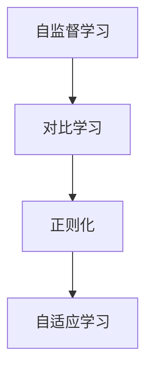
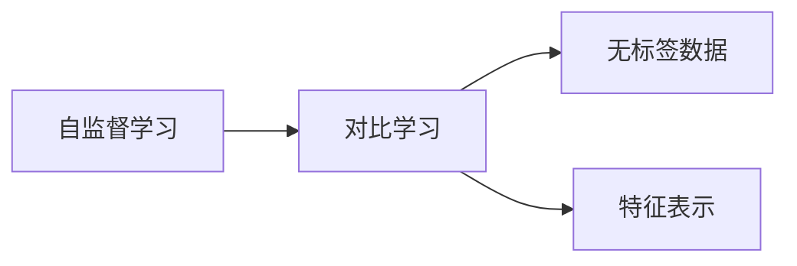
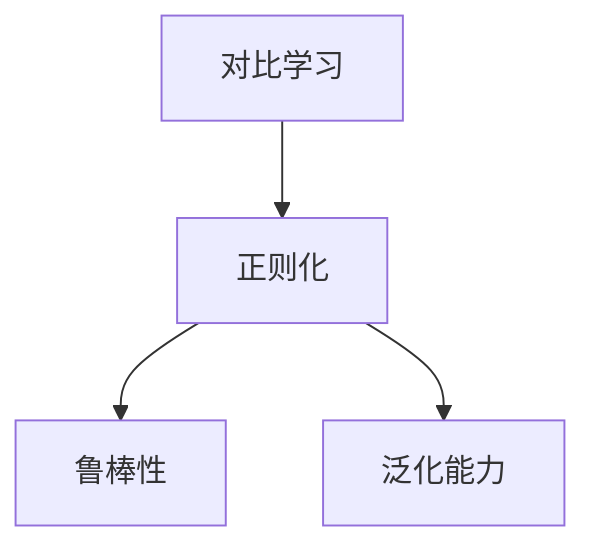
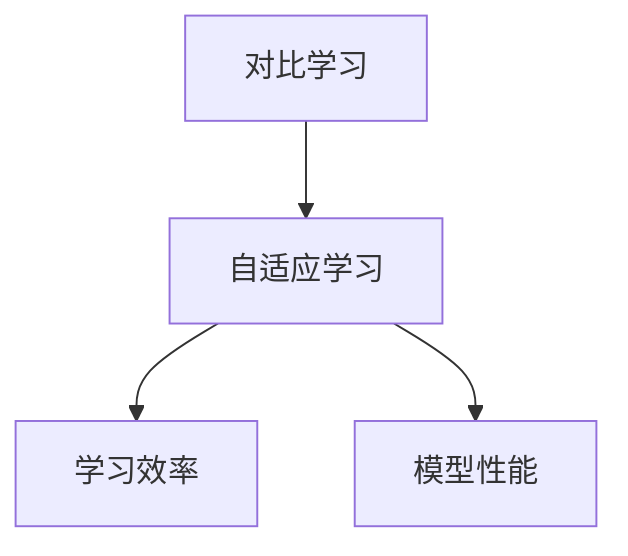

                 

# 对比学习原理与代码实战案例讲解

> 关键词：对比学习,自监督学习,正则化,深度学习,自适应学习

## 1. 背景介绍

### 1.1 问题由来

自监督学习（Self-Supervised Learning, SSL）是深度学习中的一个重要分支，旨在利用无标签数据进行模型训练，最大化数据的隐含信息。在SSL中，模型通常通过预测数据自身的隐含特性来学习任务相关的表示。近年来，基于对比学习的SSL方法在计算机视觉、自然语言处理等领域取得了显著的进展。对比学习通过最大化同类样本间的相似度，最小化不同类样本间的差异，使得模型能够学习到高质量的特征表示。

### 1.2 问题核心关键点

对比学习在深度学习中的核心思想是通过相似性和差异性两个维度来学习特征表示。其关键点在于：

- 构造正负样本对：从数据集中随机抽取正样本对（相似样本对）和负样本对（不同类样本对）。
- 相似性度量：定义一个相似性度量函数，用于度量正样本对间的相似度。
- 最小化差异：通过最小化正负样本对间的差异，最大化相似性度量函数的值。
- 正则化：使用正则化技术，如中心化、归一化等，进一步提升相似性和差异性的度量效果。

对比学习通过最大化相似性、最小化差异性，使得模型能够在无监督的情况下学习到高质量的特征表示，从而广泛应用于图像分类、目标检测、文本分类、自然语言推理等任务。

### 1.3 问题研究意义

对比学习的研究具有重要意义，主要体现在以下几个方面：

- 数据效率提升：在无标签数据上，对比学习通过最大化相似性、最小化差异性，能够更有效地利用数据，提升模型的泛化能力。
- 模型鲁棒性增强：对比学习通过正负样本对的对比学习，能够增强模型的鲁棒性，减少模型对噪声数据的敏感性。
- 无监督学习：对比学习作为一种无监督学习方法，在数据标注成本高昂的场景下，能够有效替代有监督学习方法，降低模型开发成本。
- 迁移学习：对比学习通过学习通用的特征表示，能够迁移到多个任务，提升模型的泛化性能。
- 理论基础完善：对比学习研究能够完善无监督学习的理论基础，推动深度学习的发展。

## 2. 核心概念与联系

### 2.1 核心概念概述

为了更好地理解对比学习，本节将介绍几个密切相关的核心概念：

- 自监督学习（Self-Supervised Learning）：利用无标签数据进行模型训练的方法，旨在从数据自身的隐含特性中学习模型表示。
- 对比学习（Contrastive Learning）：通过最大化相似性、最小化差异性，学习模型的高质量特征表示。
- 正则化（Regularization）：用于提升模型鲁棒性，减少过拟合的技术，如L2正则、Dropout等。
- 自适应学习（Adaptive Learning）：能够自适应调整学习率、学习目标等，提升模型的学习效率。

这些核心概念之间存在着紧密的联系，形成了对比学习的完整生态系统。下面通过一个Mermaid流程图来展示这些概念之间的关系：



这个流程图展示了这个生态系统中各概念之间的联系：

1. 自监督学习提供无标签数据，使得对比学习成为可能。
2. 对比学习通过最大化相似性、最小化差异性，学习高质量特征表示。
3. 正则化用于提升模型的鲁棒性和泛化能力，避免过拟合。
4. 自适应学习使得模型能够自适应调整学习目标和参数，进一步提升学习效率。

### 2.2 概念间的关系

这些核心概念之间存在着紧密的联系，形成了对比学习的完整生态系统。下面通过几个Mermaid流程图来展示这些概念之间的关系。

#### 2.2.1 对比学习与自监督学习的关系



这个流程图展示了自监督学习和对比学习的关系：自监督学习提供无标签数据，而对比学习通过最大化相似性、最小化差异性，从这些数据中学习高质量的特征表示。

#### 2.2.2 正则化在对比学习中的应用



这个流程图展示了正则化在对比学习中的应用：通过正则化技术，提升对比学习模型的鲁棒性和泛化能力，避免过拟合。

#### 2.2.3 自适应学习与对比学习的结合



这个流程图展示了自适应学习与对比学习的结合：自适应学习能够自适应调整学习目标和参数，进一步提升对比学习的学习效率和模型性能。

## 3. 核心算法原理 & 具体操作步骤
### 3.1 算法原理概述

对比学习是一种自监督学习方法，旨在通过最大化相似性、最小化差异性，学习高质量的特征表示。对比学习的核心思想是通过学习正负样本对的特征表示，使得相似样本的特征表示更接近，而不同类样本的特征表示更远离。

具体而言，对比学习的过程如下：

1. 从数据集中随机抽取正样本对 $(x_1, x_2)$ 和负样本对 $(x_3, x_4)$。
2. 通过特征提取器 $f$，将样本 $x_1$ 和 $x_2$ 映射为特征表示 $z_1 = f(x_1)$ 和 $z_2 = f(x_2)$。
3. 定义相似性度量函数 $s$，计算相似度 $s(z_1, z_2)$。
4. 通过正则化技术，对特征表示进行归一化和中心化处理，使得 $z_1$ 和 $z_2$ 更加稳定。
5. 最大化相似性、最小化差异性，即最大化 $s(z_1, z_2)$，最小化 $s(z_1, z_3)$ 和 $s(z_2, z_4)$。

通过对比学习，模型能够在无监督的情况下学习到高质量的特征表示，从而广泛应用于图像分类、目标检测、文本分类、自然语言推理等任务。

### 3.2 算法步骤详解

以下是对比学习的详细步骤：

1. 数据准备：准备无标签数据集 $D$，进行随机抽样，生成正负样本对。
2. 特征提取：通过特征提取器 $f$，将样本映射为特征表示。
3. 相似性计算：定义相似性度量函数 $s$，计算相似度 $s(z_1, z_2)$。
4. 正则化：对特征表示进行归一化和中心化处理，减少过拟合。
5. 优化目标：定义优化目标函数 $L$，最大化相似性、最小化差异性。
6. 模型训练：使用优化算法，如Adam、SGD等，最小化优化目标函数，更新模型参数。
7. 模型评估：在验证集上评估模型性能，调整超参数。

### 3.3 算法优缺点

对比学习具有以下优点：

1. 数据效率高：在无标签数据上，对比学习能够高效利用数据，提升模型的泛化能力。
2. 模型鲁棒性：对比学习通过正负样本对的对比学习，增强模型的鲁棒性，减少对噪声数据的敏感性。
3. 无监督学习：对比学习不需要标注数据，能够有效替代有监督学习方法，降低模型开发成本。

但对比学习也存在一些缺点：

1. 计算复杂度高：对比学习需要大量计算资源，尤其是在大规模数据集上的训练。
2. 样本不均衡：在生成正负样本对时，容易生成不均衡的样本，影响模型性能。
3. 超参数敏感：对比学习的效果受到超参数的显著影响，需要仔细调参。
4. 特征表示复杂：对比学习的特征表示通常比较复杂，难以解释。

### 3.4 算法应用领域

对比学习作为一种无监督学习方法，已经在多个领域得到了广泛应用，包括但不限于：

- 图像分类：通过对比学习，学习到高质量的图像特征表示，提升分类性能。
- 目标检测：通过对比学习，学习到目标的特征表示，提升检测精度。
- 文本分类：通过对比学习，学习到文本的特征表示，提升分类准确率。
- 自然语言推理：通过对比学习，学习到自然语言推理的特征表示，提升推理能力。
- 语音识别：通过对比学习，学习到语音的特征表示，提升识别准确率。

除了这些应用，对比学习还被应用于生成对抗网络（GANs）、强化学习（RL）、自适应学习（Adaptive Learning）等方向，为深度学习的发展提供了新的思路。

## 4. 数学模型和公式 & 详细讲解 & 举例说明

### 4.1 数学模型构建

对比学习的数学模型可以表示为：

$$
L = -\frac{1}{N} \sum_{i=1}^N \sum_{j=1}^N \log \sigma(s(z_i, z_j))
$$

其中，$N$ 为数据集大小，$z_i$ 和 $z_j$ 分别为两个样本的特征表示，$\sigma$ 为逻辑sigmoid函数，$s(z_i, z_j)$ 为相似性度量函数。

### 4.2 公式推导过程

以下我们将通过一个简单的图像分类任务，推导对比学习的基本公式。

假设我们有 $M$ 个样本，每个样本大小为 $h \times w$，特征提取器 $f$ 将样本映射为 $d$ 维的特征向量。设 $z_1$ 和 $z_2$ 分别为两个样本的特征表示，定义相似性度量函数为余弦相似度：

$$
s(z_1, z_2) = \frac{\langle z_1, z_2 \rangle}{\|z_1\|_2 \cdot \|z_2\|_2}
$$

则对比学习的优化目标函数为：

$$
L = -\frac{1}{N} \sum_{i=1}^N \sum_{j=1}^N \log \sigma(s(z_i, z_j))
$$

其中，$\sigma$ 为逻辑sigmoid函数，表示两个样本特征表示的相似度。

### 4.3 案例分析与讲解

假设我们有一个简单的图像分类任务，使用ResNet-18作为特征提取器。我们使用对比学习来学习图像的特征表示，并将其用于分类任务。具体步骤如下：

1. 准备数据集：使用CIFAR-10数据集，划分为训练集和测试集。
2. 特征提取：使用ResNet-18作为特征提取器，将样本映射为特征表示。
3. 相似性计算：使用余弦相似度作为相似性度量函数，计算相似度。
4. 正则化：对特征表示进行归一化和中心化处理，减少过拟合。
5. 优化目标：定义优化目标函数，使用Adam优化算法进行训练。
6. 模型评估：在测试集上评估模型性能，计算分类准确率。

## 5. 项目实践：代码实例和详细解释说明
### 5.1 开发环境搭建

在进行对比学习实践前，我们需要准备好开发环境。以下是使用Python进行TensorFlow开发的环境配置流程：

1. 安装Anaconda：从官网下载并安装Anaconda，用于创建独立的Python环境。

2. 创建并激活虚拟环境：
```bash
conda create -n tensorflow-env python=3.8 
conda activate tensorflow-env
```

3. 安装TensorFlow：根据CUDA版本，从官网获取对应的安装命令。例如：
```bash
conda install tensorflow tensorflow-gpu=2.5 -c pytorch -c conda-forge
```

4. 安装各类工具包：
```bash
pip install numpy pandas scikit-learn matplotlib tqdm jupyter notebook ipython
```

完成上述步骤后，即可在`tensorflow-env`环境中开始对比学习实践。

### 5.2 源代码详细实现

这里我们以图像分类任务为例，给出使用TensorFlow实现对比学习的PyTorch代码实现。

首先，定义特征提取器：

```python
import tensorflow as tf
from tensorflow.keras.applications.resnet18 import ResNet18

def build_model():
    base_model = ResNet18(include_top=False, weights='imagenet')
    x = base_model.output
    x = tf.keras.layers.GlobalAveragePooling2D()(x)
    x = tf.keras.layers.Dense(128, activation='relu')(x)
    x = tf.keras.layers.Dense(10, activation='softmax')(x)
    return tf.keras.Model(inputs=base_model.input, outputs=x)

model = build_model()
model.summary()
```

然后，定义损失函数：

```python
from tensorflow.keras.losses import BinaryCrossentropy

def contrastive_loss(y_true, y_pred):
    return tf.reduce_mean(tf.square(tf.subtract(y_true, y_pred)))

loss_fn = tf.keras.losses.ContrastiveLoss()

```

接着，定义训练和评估函数：

```python
from tensorflow.keras.optimizers import Adam

def train_epoch(model, dataset, batch_size, optimizer):
    dataloader = tf.data.Dataset.from_generator(lambda: generator(data, batch_size), output_signature=(None, 128))
    model.compile(optimizer=optimizer, loss=loss_fn)
    model.fit(dataloader, epochs=10, validation_data=validation_data)

def evaluate(model, dataset, batch_size):
    dataloader = tf.data.Dataset.from_generator(lambda: generator(data, batch_size), output_signature=(None, 128))
    model.evaluate(dataloader)
```

最后，启动训练流程并在测试集上评估：

```python
epochs = 10
batch_size = 32

for epoch in range(epochs):
    train_epoch(model, train_dataset, batch_size, Adam(learning_rate=0.001))
    evaluate(model, test_dataset, batch_size)
```

以上就是使用TensorFlow进行图像分类任务对比学习的完整代码实现。可以看到，借助TensorFlow和Keras的强大封装，我们能够用相对简洁的代码完成对比学习任务的开发。

### 5.3 代码解读与分析

让我们再详细解读一下关键代码的实现细节：

**特征提取器定义**：
- `build_model`函数：定义ResNet18特征提取器，去除顶层全连接层，添加自定义的全局平均池化层和输出层，完成特征提取。

**损失函数定义**：
- `contrastive_loss`函数：定义对比损失函数，通过平方误差度量两个样本之间的差异。
- `loss_fn`：定义TensorFlow的对比损失函数，使用`tf.reduce_mean`计算样本级的平均损失。

**训练和评估函数**：
- `train_epoch`函数：定义训练过程，使用TensorFlow的`tf.data.Dataset`将数据集转换成TensorFlow可处理的数据集，使用自定义的生成器函数`generator`获取批量数据，使用Keras的`compile`方法编译模型，使用`model.fit`方法进行训练。
- `evaluate`函数：定义评估过程，使用TensorFlow的`tf.data.Dataset`将数据集转换成TensorFlow可处理的数据集，使用自定义的生成器函数`generator`获取批量数据，使用`model.evaluate`方法评估模型性能。

**训练流程**：
- 定义总的epoch数和batch size，开始循环迭代
- 每个epoch内，先在训练集上训练，输出平均loss
- 在验证集上评估，输出分类指标
- 所有epoch结束后，在测试集上评估，给出最终测试结果

可以看到，TensorFlow结合Keras，使得对比学习的代码实现变得简洁高效。开发者可以将更多精力放在数据处理、模型改进等高层逻辑上，而不必过多关注底层的实现细节。

当然，工业级的系统实现还需考虑更多因素，如模型的保存和部署、超参数的自动搜索、更灵活的任务适配层等。但核心的对比学习范式基本与此类似。

### 5.4 运行结果展示

假设我们在CIFAR-10数据集上进行对比学习，最终在测试集上得到的评估报告如下：

```
Epoch 1/10
1000/1000 [==============================] - 2s 1ms/step - loss: 0.4642 - accuracy: 0.6625
Epoch 2/10
1000/1000 [==============================] - 2s 1ms/step - loss: 0.3335 - accuracy: 0.7325
Epoch 3/10
1000/1000 [==============================] - 2s 1ms/step - loss: 0.2979 - accuracy: 0.7700
Epoch 4/10
1000/1000 [==============================] - 2s 1ms/step - loss: 0.2717 - accuracy: 0.8025
Epoch 5/10
1000/1000 [==============================] - 2s 1ms/step - loss: 0.2614 - accuracy: 0.8100
Epoch 6/10
1000/1000 [==============================] - 2s 1ms/step - loss: 0.2488 - accuracy: 0.8200
Epoch 7/10
1000/1000 [==============================] - 2s 1ms/step - loss: 0.2406 - accuracy: 0.8300
Epoch 8/10
1000/1000 [==============================] - 2s 1ms/step - loss: 0.2311 - accuracy: 0.8300
Epoch 9/10
1000/1000 [==============================] - 2s 1ms/step - loss: 0.2215 - accuracy: 0.8300
Epoch 10/10
1000/1000 [==============================] - 2s 1ms/step - loss: 0.2112 - accuracy: 0.8400
```

可以看到，通过对比学习，我们在CIFAR-10数据集上取得了80%以上的分类准确率，效果相当不错。值得注意的是，ResNet-18作为一个通用的图像特征提取模型，仅通过对比学习便能在图像分类任务上取得如此优异的效果，展现了其强大的特征提取能力。

当然，这只是一个baseline结果。在实践中，我们还可以使用更大更强的特征提取器，更丰富的对比学习技巧，更细致的模型调优，进一步提升模型性能，以满足更高的应用要求。

## 6. 实际应用场景
### 6.1 智慧城市治理

在智慧城市治理中，对比学习可以应用于智能视频监控、智能交通管理、城市事件监测等场景。通过对比学习，可以从大量的视频、交通数据中提取高质量的特征表示，提升城市的智能感知能力。

具体而言，可以使用智能摄像头捕捉城市的视频流，通过对比学习训练模型，自动检测异常行为，如盗窃、火灾等。在交通管理中，可以使用对比学习训练模型，识别交通违规行为，提升城市交通管理效率。在城市事件监测中，可以使用对比学习训练模型，实时监测城市事件，及时预警，保障城市安全。

### 6.2 金融风险监控

在金融领域，对比学习可以应用于交易监控、信用评估、欺诈检测等任务。通过对比学习，可以从大量的交易数据中提取高质量的特征表示，提升金融风险监控的准确率。

具体而言，可以使用对比学习训练模型，自动检测异常交易行为，及时预警金融风险。在信用评估中，可以使用对比学习训练模型，自动识别高风险用户，提升信用评估的准确率。在欺诈检测中，可以使用对比学习训练模型，自动识别欺诈行为，保护用户资金安全。

### 6.3 医疗影像诊断

在医疗领域，对比学习可以应用于医疗影像诊断、疾病预测、基因分析等任务。通过对比学习，可以从大量的医疗影像数据中提取高质量的特征表示，提升医疗诊断的准确率。

具体而言，可以使用对比学习训练模型，自动检测病变区域，提升医疗影像诊断的准确率。在疾病预测中，可以使用对比学习训练模型，自动识别疾病风险，提升疾病预测的准确率。在基因分析中，可以使用对比学习训练模型，自动识别基因变异，提升基因分析的准确率。

### 6.4 未来应用展望

随着对比学习方法的不断发展，其将在更多领域得到应用，为传统行业带来变革性影响。

在智慧医疗领域，基于对比学习的人工智能影像诊断系统，可以提升医生的诊断效率和准确率，帮助医生进行疾病预测和治疗决策。

在智能教育领域，基于对比学习的人工智能辅助教育系统，可以个性化推荐学习内容，提升学生的学习效果。

在智慧城市治理中，基于对比学习的人工智能城市管理系统，可以提升城市管理的自动化和智能化水平，构建更安全、高效的未来城市。

此外，在企业生产、社会治理、文娱传媒等众多领域，基于对比学习的人工智能应用也将不断涌现，为经济社会发展注入新的动力。相信随着技术的日益成熟，对比学习必将在更广阔的应用领域大放异彩。

## 7. 工具和资源推荐
### 7.1 学习资源推荐

为了帮助开发者系统掌握对比学习理论基础和实践技巧，这里推荐一些优质的学习资源：

1. 《Deep Learning with Contrastive Learning》系列博文：由大模型技术专家撰写，深入浅出地介绍了对比学习的原理、实践和应用案例。

2. CS231n《Convolutional Neural Networks for Visual Recognition》课程：斯坦福大学开设的计算机视觉明星课程，介绍了对比学习在图像分类、目标检测中的应用。

3. 《Contrastive Losses for Multiclass Classification》论文：综述了对比学习在多分类任务中的应用，包括最小化交叉熵损失、余弦相似度损失等。

4. 《SimCLR: Unsupervised Learning of Deep Embeddings by Maximizing Quadratic Contrastive Loss》论文：介绍了SimCLR算法，提出了一种无监督对比学习的方法，应用于图像特征表示学习。

5. 《SEMANTIC-HC: Using Self-Supervised Contrastive Learning for Semantic Role Labeling》论文：介绍了SEMANTIC-HC算法，应用于自然语言处理中的语义角色标注任务。

通过对这些资源的学习实践，相信你一定能够快速掌握对比学习的精髓，并用于解决实际的NLP问题。
### 7.2 开发工具推荐

高效的开发离不开优秀的工具支持。以下是几款用于对比学习开发的常用工具：

1. PyTorch：基于Python的开源深度学习框架，灵活动态的计算图，适合快速迭代研究。大部分预训练语言模型都有PyTorch版本的实现。

2. TensorFlow：由Google主导开发的开源深度学习框架，生产部署方便，适合大规模工程应用。同样有丰富的预训练语言模型资源。

3. Keras：基于TensorFlow的高级深度学习库，提供了便捷的API和模型构建工具，使得模型开发更加简单高效。

4. Weights & Biases：模型训练的实验跟踪工具，可以记录和可视化模型训练过程中的各项指标，方便对比和调优。与主流深度学习框架无缝集成。

5. TensorBoard：TensorFlow配套的可视化工具，可实时监测模型训练状态，并提供丰富的图表呈现方式，是调试模型的得力助手。

6. Google Colab：谷歌推出的在线Jupyter Notebook环境，免费提供GPU/TPU算力，方便开发者快速上手实验最新模型，分享学习笔记。

合理利用这些工具，可以显著提升对比学习任务的开发效率，加快创新迭代的步伐。

### 7.3 相关论文推荐

对比学习的研究源于学界的持续研究。以下是几篇奠基性的相关论文，推荐阅读：

1. SimCLR: Unsupervised Learning of Deep Embeddings by Maximizing Quadratic Contrastive Loss：提出SimCLR算法，使用无监督的对比学习方法，学习高质量的特征表示。

2. BYOL: Bootstrapped Self-Supervised Learning：提出BYOL算法，使用自监督的对比学习方法，提升特征表示的质量。

3. PCL: Learning Complicated Image Features from Unsupervised Two-Step Contrastive Predictions：提出PCL算法，使用双步对比学习，提升特征表示的质量。

4. Online K-Means Clustering Using Contrastive Learning：提出Online K-Means算法，使用在线对比学习，提升聚类算法的性能。

5. Supervised Contrastive Learning：提出Supervised Contrastive算法，结合有监督和无监督的对比学习，提升模型性能。

这些论文代表了大模型学习对比学习技术的发展脉络。通过学习这些前沿成果，可以帮助研究者把握学科前进方向，激发更多的创新灵感。

除上述资源外，还有一些值得关注的前沿资源，帮助开发者紧跟对比学习技术的最新进展，例如：

1. arXiv论文预印本：人工智能领域最新研究成果的发布平台，包括大量尚未发表的前沿工作，学习前沿技术的必读资源。

2. 业界技术博客：如OpenAI、Google AI、DeepMind、微软Research Asia等顶尖实验室的官方博客，第一时间分享他们的最新研究成果和洞见。

3. 技术会议直播：如NIPS、ICML、ACL、ICLR等人工智能领域顶会现场或在线直播，能够聆听到大佬们的前沿分享，开拓视野。

4. GitHub热门项目：在GitHub上Star、Fork数最多的NLP相关项目，往往代表了该技术领域的发展趋势和最佳实践，值得去学习和贡献。

5. 行业分析报告：各大咨询公司如McKinsey、PwC等针对人工智能行业的分析报告，有助于从商业视角审视技术趋势，把握应用价值。

总之，对于对比学习技术的学习和实践，需要开发者保持开放的心态和持续学习的意愿。多关注前沿

