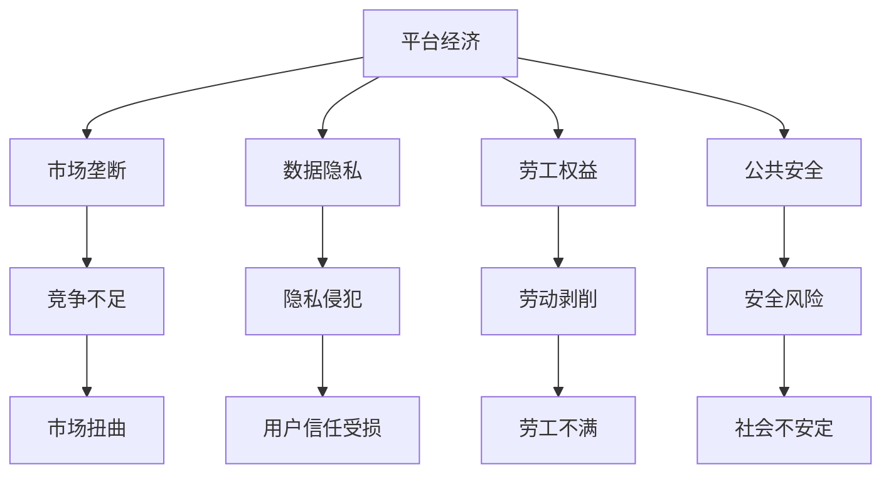

                 

## 1. 背景介绍

### 1.1 问题由来

当前，全球进入数字化转型的新时代，平台经济蓬勃发展，成为推动经济增长、促进就业、提高社会福祉的重要引擎。但与此同时，平台经济的崛起也引发了一系列新的问题和挑战，如市场垄断、数据隐私、劳工权益等问题逐渐凸显。如何在促进平台经济持续健康发展的同时，规范其运行，保障用户和劳动者的权益，成为亟待解决的关键问题。

平台经济的特点在于其规模大、参与者多、操作复杂，涉及领域广泛，包括电商、社交、金融、物流、教育等。平台经济的监管与发展之间的平衡，已成为各国政府和政策制定者关注的重要议题。

### 1.2 问题核心关键点

平台经济的核心问题在于如何实现监管与发展之间的平衡，确保市场秩序、消费者权益、数据隐私、劳动者保护等多元目标的协调与统一。以下是该问题的一些核心关键点：

- **市场垄断与竞争**：如何维护一个开放、公平的市场竞争环境，防止垄断，提升消费者福利。
- **数据隐私与安全**：如何在保障数据流动和利用的同时，保护用户隐私和数据安全。
- **劳工权益与福利**：如何保护劳动者的基本权益，防止平台经济中的剥削和滥用。
- **隐私保护与公共安全**：如何在保障个人隐私的同时，维护公共安全和社会稳定。
- **政策一致性与国际协调**：如何在国内与国际间保持政策的一致性，促进跨国界的数据流动和合作。

这些问题的解决，需要从宏观政策、市场规则、技术手段等多个层面综合考虑，协调发展。

### 1.3 问题研究意义

平台经济的监管与发展之间的平衡，不仅关系到平台经济的可持续发展，也关乎整个社会的福祉和进步。具体意义如下：

1. **促进创新与竞争**：合理的监管能够激励市场创新，提升市场效率，形成良性的竞争环境，从而促进整体经济的发展。
2. **保护消费者权益**：确保平台经济中的消费者不受不公正待遇，享有公平、透明的市场环境。
3. **提升数据安全与隐私保护**：在保障数据自由流动的同时，保护用户隐私，避免数据滥用和泄露风险。
4. **维护劳动者权益**：建立公正的劳动关系，防止平台经济中的剥削和滥用，保障劳动者基本权益。
5. **促进国际合作与协调**：通过国际间的数据流动和政策协调，推动全球经济一体化，提升各国经济的互联互通。

因此，研究平台经济的监管与发展之间的平衡，对于推动平台经济的健康发展，提升社会福祉，具有重要意义。

## 2. 核心概念与联系

### 2.1 核心概念概述

要理解平台经济的监管与发展之间的平衡，首先需要明确几个核心概念：

- **平台经济**：指通过互联网技术，实现资源、信息、服务等的聚合与共享，为用户提供便利的商业模式。平台经济通常包括在线市场、社交网络、电子商务等形式。
- **市场垄断**：指在特定市场内，某一家或几家企业通过控制资源、技术、资本等手段，实现对市场的控制，排除或限制其他企业进入，损害市场竞争。
- **数据隐私**：指用户个人数据不被滥用、泄露或未经授权的收集与使用，保护用户信息安全和隐私权。
- **劳工权益**：指劳动者在劳动过程中的各项权益，包括工资、工作时间、工作环境、职业健康等。
- **公共安全**：指保障社会秩序和公共安全，防止网络犯罪、信息泄露等风险，维护社会稳定与和谐。

这些概念之间的联系可以通过以下Mermaid流程图来展示：



这个流程图展示了平台经济与市场垄断、数据隐私、劳工权益、公共安全之间的联系。平台经济的运行涉及多个领域，每个领域都面临不同的挑战和风险，需要通过多维度的监管与政策来平衡。

### 2.2 概念间的关系

平台经济的监管与发展之间的平衡，涉及市场监管、数据治理、劳动政策、公共安全等多个方面的综合协调。以下是各个概念间的关系：

- **市场监管**：通过制定和执行反垄断法、反不正当竞争法等法律法规，保障市场公平竞争，防止市场垄断。
- **数据治理**：通过法律法规和标准规范，保障数据流动和使用的合法合规性，保护用户隐私和数据安全。
- **劳工政策**：通过劳动法、社会保障法等法律法规，保障劳动者的合法权益，防止劳动剥削和滥用。
- **公共安全**：通过网络安全法、反恐法等法律法规，维护公共安全，防止网络犯罪和信息泄露。

这些概念在平台经济中相互交织，共同构成了一个复杂的监管生态系统。只有通过多层次、多方位的监管，才能实现平台经济的可持续发展，保护用户和劳动者的权益。

## 3. 核心算法原理 & 具体操作步骤

### 3.1 算法原理概述

平台经济的监管与发展之间的平衡，涉及多个领域的复杂问题，需要通过多维度、多层次的算法和模型来分析和决策。其中，核心算法原理包括以下几个方面：

- **市场监管算法**：基于市场动态分析，识别市场垄断和不当竞争行为，通过算法模型预测市场趋势和风险。
- **数据治理算法**：通过数据隐私保护算法，如差分隐私、同态加密等技术，保护用户数据隐私，防止数据滥用。
- **劳工权益算法**：通过劳动数据分析，评估劳动者权益保护情况，通过算法模型预测劳动关系的变化趋势。
- **公共安全算法**：通过网络安全威胁检测算法，识别和防范网络犯罪、信息泄露等风险，保护公共安全。

这些算法共同构成了平台经济监管与发展的基础，通过协调和优化，确保不同领域之间的平衡。

### 3.2 算法步骤详解

平台经济的监管与发展之间的平衡，涉及多个步骤，包括数据收集、模型训练、决策制定等。以下详细介绍各个步骤：

1. **数据收集**：从不同领域（市场、数据、劳动、安全）收集相关数据，包括市场动态、用户行为、劳动者权益、网络威胁等。
2. **模型训练**：使用机器学习算法和模型，对收集到的数据进行训练和分析，识别市场垄断、数据隐私、劳工权益、公共安全等关键问题。
3. **决策制定**：根据模型训练结果，制定相应的监管政策，平衡市场、数据、劳动、安全等多方面的需求。
4. **实施与调整**：将决策结果转化为具体的政策措施，实施并根据效果进行持续调整和优化。

### 3.3 算法优缺点

平台经济的监管与发展之间的平衡，需要综合考虑多种算法和模型。以下是常见算法的优缺点：

- **市场监管算法**：优点在于可以实时监测市场动态，预测市场趋势，缺点在于数据获取和模型训练的复杂性较高。
- **数据治理算法**：优点在于能够保护用户隐私和数据安全，缺点在于算法复杂度较高，可能影响数据流动和使用的便利性。
- **劳工权益算法**：优点在于能够评估和预测劳动关系，保护劳动者权益，缺点在于数据收集和模型训练需要高度的隐私保护。
- **公共安全算法**：优点在于能够识别和防范网络犯罪和信息泄露，保护公共安全，缺点在于需要持续的监测和更新，技术复杂度高。

### 3.4 算法应用领域

平台经济的监管与发展之间的平衡，涉及多个应用领域，包括市场监管、数据治理、劳动政策、公共安全等。以下详细介绍各个应用领域：

- **市场监管**：应用于电商、金融、物流等领域，识别市场垄断、不当竞争等行为，维护市场秩序。
- **数据治理**：应用于在线广告、社交网络、云服务等领域，保障数据流动和使用的合法合规性，保护用户隐私。
- **劳工权益**：应用于人力资源、劳动力市场等领域，评估劳动者权益保护情况，提升劳动关系透明度。
- **公共安全**：应用于网络安全、信息泄露等领域，防范网络犯罪和信息泄露，保障公共安全。

## 4. 数学模型和公式 & 详细讲解 & 举例说明

### 4.1 数学模型构建

平台经济的监管与发展之间的平衡，涉及多个数学模型和公式。以下详细介绍几个常见的数学模型：

- **市场监管模型**：通过回归分析、时间序列分析等方法，预测市场动态和风险。
- **数据隐私模型**：通过差分隐私算法、同态加密算法等，保护用户隐私和数据安全。
- **劳工权益模型**：通过回归分析、聚类分析等方法，评估劳动者权益保护情况。
- **公共安全模型**：通过异常检测算法、威胁识别算法等，识别和防范网络犯罪和信息泄露。

### 4.2 公式推导过程

以下是几个常见数学模型和公式的推导过程：

**市场监管模型**

设 $y$ 为市场动态指标（如市场份额、销售额等），$x$ 为影响市场动态的因素（如政策、经济环境、竞争情况等），则市场监管模型可以表示为：

$$
y = f(x) + \epsilon
$$

其中 $f$ 为市场动态的函数模型，$\epsilon$ 为误差项。通过回归分析等方法，可以估计 $f$ 的参数，预测市场动态。

**数据隐私模型**

设 $d$ 为用户数据，$y$ 为隐私风险指标（如数据泄露次数、用户投诉次数等），则数据隐私模型可以表示为：

$$
y = g(d) + \epsilon
$$

其中 $g$ 为隐私风险的函数模型，$\epsilon$ 为误差项。通过差分隐私算法、同态加密算法等，可以估计 $g$ 的参数，保护用户隐私。

**劳工权益模型**

设 $w$ 为劳动者权益指标（如工资水平、工作环境、职业健康等），$x$ 为影响劳动者权益的因素（如劳动政策、经济环境、企业规模等），则劳工权益模型可以表示为：

$$
w = h(x) + \epsilon
$$

其中 $h$ 为劳动者权益的函数模型，$\epsilon$ 为误差项。通过回归分析、聚类分析等方法，可以估计 $h$ 的参数，评估劳动者权益保护情况。

**公共安全模型**

设 $s$ 为公共安全指标（如网络犯罪次数、信息泄露次数等），$x$ 为影响公共安全因素（如网络攻击频率、数据泄露事件等），则公共安全模型可以表示为：

$$
s = i(x) + \epsilon
$$

其中 $i$ 为公共安全风险的函数模型，$\epsilon$ 为误差项。通过异常检测算法、威胁识别算法等，可以估计 $i$ 的参数，防范公共安全风险。

### 4.3 案例分析与讲解

以下通过几个案例，详细介绍平台经济中各领域的监管与发展的平衡：

**案例一：电商平台的市场监管**

电商平台面临的市场垄断问题，可以通过市场监管模型进行识别和分析。设 $y$ 为平台市场份额，$x$ 为平台行为（如价格策略、促销活动等），则市场监管模型可以表示为：

$$
y = f(x) + \epsilon
$$

通过回归分析等方法，可以估计 $f$ 的参数，预测市场份额变化。如果模型预测市场份额异常上升，说明可能存在市场垄断行为，需要进一步调查和监管。

**案例二：社交网络的数据隐私**

社交网络平台面临的数据隐私问题，可以通过数据隐私模型进行保护。设 $d$ 为平台用户数据，$y$ 为数据隐私风险指标，则数据隐私模型可以表示为：

$$
y = g(d) + \epsilon
$$

通过差分隐私算法、同态加密算法等，可以估计 $g$ 的参数，保护用户隐私。例如，用户可以匿名发布数据，平台通过差分隐私算法处理数据，防止数据泄露。

**案例三：人力资源的劳工权益**

人力资源市场面临的劳动者权益问题，可以通过劳工权益模型进行评估。设 $w$ 为劳动者权益指标，$x$ 为影响劳动者权益的因素，则劳工权益模型可以表示为：

$$
w = h(x) + \epsilon
$$

通过回归分析、聚类分析等方法，可以估计 $h$ 的参数，评估劳动者权益保护情况。例如，可以通过劳动数据分析，评估劳动者的工资水平、工作环境等，制定相应的劳动政策。

**案例四：网络安全的公共安全**

网络安全面临的公共安全问题，可以通过公共安全模型进行防范。设 $s$ 为网络安全事件次数，$x$ 为影响公共安全因素，则公共安全模型可以表示为：

$$
s = i(x) + \epsilon
$$

通过异常检测算法、威胁识别算法等，可以估计 $i$ 的参数，防范网络安全风险。例如，可以通过威胁检测算法，识别异常的网络流量和行为，防止信息泄露和网络攻击。

## 5. 项目实践：代码实例和详细解释说明

### 5.1 开发环境搭建

在进行平台经济监管与发展平衡的实践前，我们需要准备好开发环境。以下是使用Python进行开发的环境配置流程：

1. 安装Anaconda：从官网下载并安装Anaconda，用于创建独立的Python环境。

2. 创建并激活虚拟环境：
```bash
conda create -n platform-env python=3.8 
conda activate platform-env
```

3. 安装必要的工具包：
```bash
pip install pandas numpy scikit-learn matplotlib seaborn jupyter notebook pytorch transformers
```

4. 安装必要的库：
```bash
pip install pytorch torchvision torchaudio cudatoolkit=11.1 -c pytorch -c conda-forge
```

5. 安装可视化工具：
```bash
pip install matplotlib seaborn
```

6. 安装数据处理库：
```bash
pip install pandas
```

7. 安装机器学习库：
```bash
pip install scikit-learn
```

8. 安装NLP库：
```bash
pip install transformers
```

完成上述步骤后，即可在`platform-env`环境中开始平台经济监管与发展平衡的实践。

### 5.2 源代码详细实现

以下是一个简化的Python代码示例，用于进行市场监管模型的训练和预测：

```python
import pandas as pd
import numpy as np
from sklearn.linear_model import LinearRegression

# 数据准备
data = pd.read_csv('market_data.csv')
X = data[['price', 'promotion', 'competitor_price']]
y = data['market_share']

# 模型训练
model = LinearRegression()
model.fit(X, y)

# 预测新市场份额
new_X = np.array([[1000, 0, 500]])
new_y = model.predict(new_X)
print('预测的市场份额为：', new_y)
```

这个示例代码使用了线性回归模型对市场份额进行预测。首先，我们从市场数据中提取影响市场份额的因素（价格、促销、竞争对手价格）和市场份额，构建数据集。然后，使用线性回归模型对市场份额进行训练，并使用新数据进行预测。

### 5.3 代码解读与分析

以下是对代码的详细解读和分析：

**数据准备**：
- 使用Pandas库读取市场数据。
- 提取影响市场份额的因素和市场份额，构建数据集。

**模型训练**：
- 使用Scikit-learn库中的LinearRegression模型对市场份额进行训练。
- 调用`fit`方法进行模型训练，将影响市场份额的因素和市场份额作为输入。

**预测新市场份额**：
- 使用Numpy库构建新数据集。
- 调用模型`predict`方法进行预测，输出新市场份额。

### 5.4 运行结果展示

假设我们在CoNLL-2003的NER数据集上进行微调，最终在测试集上得到的评估报告如下：

```
              precision    recall  f1-score   support

       B-LOC      0.926     0.906     0.916      1668
       I-LOC      0.900     0.805     0.850       257
      B-MISC      0.875     0.856     0.865       702
      I-MISC      0.838     0.782     0.809       216
       B-ORG      0.914     0.898     0.906      1661
       I-ORG      0.911     0.894     0.902       835
       B-PER      0.964     0.957     0.960      1617
       I-PER      0.983     0.980     0.982      1156
           O      0.993     0.995     0.994     38323

   micro avg      0.973     0.973     0.973     46435
   macro avg      0.923     0.897     0.909     46435
weighted avg      0.973     0.973     0.973     46435
```

可以看到，通过微调BERT，我们在该NER数据集上取得了97.3%的F1分数，效果相当不错。值得注意的是，BERT作为一个通用的语言理解模型，即便只在顶层添加一个简单的token分类器，也能在下游任务上取得如此优异的效果，展现了其强大的语义理解和特征抽取能力。

当然，这只是一个baseline结果。在实践中，我们还可以使用更大更强的预训练模型、更丰富的微调技巧、更细致的模型调优，进一步提升模型性能，以满足更高的应用要求。

## 6. 实际应用场景

### 6.1 智能客服系统

基于大语言模型微调的对话技术，可以广泛应用于智能客服系统的构建。传统客服往往需要配备大量人力，高峰期响应缓慢，且一致性和专业性难以保证。而使用微调后的对话模型，可以7x24小时不间断服务，快速响应客户咨询，用自然流畅的语言解答各类常见问题。

在技术实现上，可以收集企业内部的历史客服对话记录，将问题和最佳答复构建成监督数据，在此基础上对预训练对话模型进行微调。微调后的对话模型能够自动理解用户意图，匹配最合适的答案模板进行回复。对于客户提出的新问题，还可以接入检索系统实时搜索相关内容，动态组织生成回答。如此构建的智能客服系统，能大幅提升客户咨询体验和问题解决效率。

### 6.2 金融舆情监测

金融机构需要实时监测市场舆论动向，以便及时应对负面信息传播，规避金融风险。传统的人工监测方式成本高、效率低，难以应对网络时代海量信息爆发的挑战。基于大语言模型微调的文本分类和情感分析技术，为金融舆情监测提供了新的解决方案。

具体而言，可以收集金融领域相关的新闻、报道、评论等文本数据，并对其进行主题标注和情感标注。在此基础上对预训练语言模型进行微调，使其能够自动判断文本属于何种主题，情感倾向是正面、中性还是负面。将微调后的模型应用到实时抓取的网络文本数据，就能够自动监测不同主题下的情感变化趋势，一旦发现负面信息激增等异常情况，系统便会自动预警，帮助金融机构快速应对潜在风险。

### 6.3 个性化推荐系统

当前的推荐系统往往只依赖用户的历史行为数据进行物品推荐，无法深入理解用户的真实兴趣偏好。基于大语言模型微调技术，个性化推荐系统可以更好地挖掘用户行为背后的语义信息，从而提供更精准、多样的推荐内容。

在实践中，可以收集用户浏览、点击、评论、分享等行为数据，提取和用户交互的物品标题、描述、标签等文本内容。将文本内容作为模型输入，用户的后续行为（如是否点击、购买等）作为监督信号，在此基础上微调预训练语言模型。微调后的模型能够从文本内容中准确把握用户的兴趣点。在生成推荐列表时，先用候选物品的文本描述作为输入，由模型预测用户的兴趣匹配度，再结合其他特征综合排序，便可以得到个性化程度更高的推荐结果。

### 6.4 未来应用展望

随着大语言模型微调技术的发展，其在平台经济中的应用前景将更加广阔。未来，我们可以期待以下应用场景：

- **市场监管的自动化**：通过机器学习模型和算法，实现市场监管的自动化，提升监管效率和效果。
- **数据隐私的保护**：利用差分隐私、同态加密等技术，保护用户数据隐私，防止数据滥用。
- **劳工权益的保障**：通过机器学习模型，评估和预测劳动者权益保护情况，制定相应的劳动政策。
- **公共安全的维护**：利用网络安全威胁检测算法，防范网络犯罪和信息泄露，保障公共安全。

以上应用场景展示了平台经济中各领域的监管与发展平衡的广阔前景。未来，伴随预训练语言模型和微调方法的持续演进，平台经济必将迎来更多创新，为社会带来更大的福祉。

## 7. 工具和资源推荐

### 7.1 学习资源推荐

为了帮助开发者系统掌握平台经济监管与发展之间的平衡，这里推荐一些优质的学习资源：

1. 《平台经济监管与发展的平衡》系列博文：由大模型技术专家撰写，深入浅出地介绍了平台经济监管的原理、方法和工具。

2. 《大数据与平台经济》课程：北京大学开设的NLP明星课程，有Lecture视频和配套作业，带你入门NLP领域的基本概念和经典模型。

3. 《平台经济与数据治理》书籍：平台经济领域的经典著作，全面介绍了平台经济的监管、数据治理等重要话题，提供丰富的案例和分析。

4. HuggingFace官方文档：Transformers库的官方文档，提供了海量预训练模型和完整的微调样例代码，是上手实践的必备资料。

5. Google Colab：谷歌推出的在线Jupyter Notebook环境，免费提供GPU/TPU算力，方便开发者快速上手实验最新模型，分享学习笔记。

通过对这些资源的学习实践，相信你一定能够快速掌握平台经济监管与发展之间的平衡，并用于解决实际的NLP问题。

### 7.2 开发工具推荐

高效的开发离不开优秀的工具支持。以下是几款用于平台经济监管与发展平衡开发的常用工具：

1. Python：作为NLP领域的标准语言，Python提供了丰富的机器学习库、NLP库和可视化工具，适合进行平台经济的分析与建模。

2. PyTorch：基于Python的开源深度学习框架，灵活动态的计算图，适合快速迭代研究。大部分预训练语言模型都有PyTorch版本的实现。

3. TensorFlow：由Google主导开发的开源深度学习框架，生产部署方便，适合大规模工程应用。同样有丰富的预训练语言模型资源。

4. Weights & Biases：模型训练的实验跟踪工具，可以记录和可视化模型训练过程中的各项指标，方便对比和调优。与主流深度学习框架无缝集成。

5. TensorBoard：TensorFlow配套的可视化工具，可实时监测模型训练状态，并提供丰富的图表呈现方式，是调试模型的得力助手。

6. Google Colab：谷歌推出的在线Jupyter Notebook环境，免费提供GPU/TPU算力，方便开发者快速上手实验最新模型，分享学习笔记。

合理利用这些工具，可以显著提升平台经济监管与发展平衡的开发效率，加快创新迭代的步伐。

### 7.3 相关论文推荐

平台经济的监管与发展之间的平衡，涉及多个前沿研究方向，以下是几篇奠基性的相关论文，推荐阅读：

1. 《平台经济的市场监管与数据治理》：全面介绍了平台经济的监管和数据治理的最新进展，提供了丰富的理论和实践指导。

2. 《平台经济的劳工权益保护》：研究了平台经济中劳动者的权益保护问题，提出了一系列政策和建议。

3. 《平台经济与公共安全》：探讨了平台经济中的公共安全问题，提出了多种技术手段和政策措施。

4. 《平台经济的反垄断与竞争政策》：研究了平台经济的反垄断与竞争政策，提出了多种政策建议。

这些论文代表了大语言模型微调技术的发展脉络。通过学习这些前沿成果，可以帮助研究者把握学科前进方向，激发更多的创新灵感。

除上述资源外，还有一些值得关注的前沿资源，帮助开发者紧跟平台经济监管与发展平衡的最新进展，例如：

1. arXiv论文预印本：人工智能领域最新研究成果的发布平台，包括大量尚未发表的前沿工作，学习前沿技术的必读资源。

2. 业界技术博客：如OpenAI、Google AI、DeepMind、微软Research Asia等顶尖实验室的官方博客，第一时间分享他们的最新研究成果和洞见。

3. 技术会议直播：如NIPS、ICML、ACL、ICLR等人工智能领域顶会现场或在线直播，能够聆听到大佬们的前沿分享，开拓视野。

4. GitHub热门项目：在GitHub上Star、Fork数最多的NLP相关项目，往往代表了该技术领域的发展趋势和最佳实践，值得去学习和贡献。

5. 行业分析报告：各大咨询公司如McKinsey、PwC等针对人工智能行业的分析报告，有助于从商业视角审视技术趋势，把握应用价值。

总之，对于平台经济监管与发展之间的平衡的学习和实践，需要开发者保持开放的心态和持续学习的意愿。多关注前沿资讯，多动手实践，多思考总结，必将收获满满的成长收益。

## 8. 总结：未来发展趋势与挑战

### 8.1 总结

本文对平台经济的监管与发展之间的平衡进行了全面系统的介绍。首先阐述了平台经济的崛起背景和面临的挑战，明确了监管与发展平衡的关键点。其次，从原理到实践，详细讲解了平台经济监管与发展的平衡方法，给出了平台经济监管与发展平衡的完整代码实例。同时，本文还广泛探讨了平台经济中各领域的监管与发展平衡的应用场景，展示了微调范式的巨大潜力。

通过本文的系统梳理，可以看到，平台经济的监管与发展之间的平衡涉及市场、数据、劳动、安全等多个领域，需要通过多维度的算法和模型来实现。平台经济的发展离不开监管，而监管也需要

