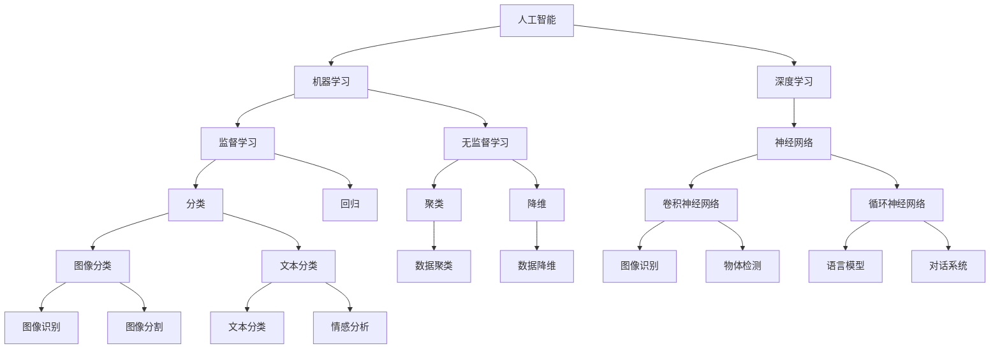

                 

# 年轻人如何在AI领域做实事

> 关键词：AI, 人工智能, 实际应用, 数据科学, 机器学习, 深度学习, 计算机视觉, 自然语言处理, 技术实践

## 1. 背景介绍

### 1.1 问题由来

在快速发展的AI领域，如何借助先进的技术实现实际应用，是很多年轻人在职业早期面临的重要课题。AI不仅是一个技术热点，更是一个能够解决实际问题的强大工具。年轻人如何在AI领域做实事，不仅需要掌握扎实的技术基础，还需要找到真正有用的应用场景，并将技术成果转化为实际价值。

### 1.2 问题核心关键点

实现AI技术在实际场景中的应用，需要以下关键点：
1. **问题定义**：明确应用的具体问题是什么。
2. **数据准备**：获取并处理适合于训练模型的数据集。
3. **模型选择**：选择合适的算法和模型。
4. **模型训练**：使用数据集训练模型。
5. **模型评估**：使用测试集评估模型性能。
6. **模型部署**：将模型部署到实际应用中。
7. **持续优化**：根据实际反馈持续优化模型。

### 1.3 问题研究意义

对年轻人而言，掌握AI技术并在实际应用中做实事，具有以下重要意义：
1. **提升技能**：通过实践掌握AI核心技术，包括机器学习、深度学习、自然语言处理等。
2. **解决实际问题**：利用AI技术解决现实问题，如医疗诊断、智能推荐、自然语言理解等。
3. **职业发展**：通过项目经验积累，为后续的职业发展打下坚实基础。
4. **社会贡献**：将技术应用于社会公益和创新，为社会进步做出贡献。
5. **创新思维**：在解决问题的过程中培养创新思维和批判性思考能力。

## 2. 核心概念与联系

### 2.1 核心概念概述

为更好地理解如何在AI领域做实事，本节将介绍几个关键概念：

- **人工智能(AI)**：使用计算机算法来模拟人类智能行为，包括感知、推理、学习、决策等。
- **机器学习(ML)**：让机器从数据中自动学习并优化算法，使机器能够做出预测和决策。
- **深度学习(DL)**：一种特殊的机器学习技术，通过多层次的非线性变换处理复杂数据，如图像、语音、文本等。
- **自然语言处理(NLP)**：使计算机能够理解、处理和生成自然语言的技术。
- **计算机视觉(CV)**：使计算机能够识别、分析和理解图像和视频的技术。
- **数据科学**：使用数据和技术解决问题，包括数据收集、清洗、分析和解释。

这些概念之间存在紧密联系，形成了AI领域的基本框架。以下是一个Mermaid流程图，展示了这些概念之间的关系：



### 2.2 概念间的关系

这些核心概念之间存在着紧密的联系，形成了AI领域的应用体系。

- **人工智能与机器学习的关系**：AI是ML的应用领域之一，ML是实现AI的工具和技术。
- **深度学习与机器学习的关系**：DL是ML的一个分支，通过深度神经网络模型处理复杂数据。
- **NLP与计算机视觉的关系**：两者都是AI应用的重要方向，分别处理文本和图像数据。
- **数据科学与AI的关系**：数据科学是AI的重要组成部分，提供数据驱动的决策支持。

## 3. 核心算法原理 & 具体操作步骤

### 3.1 算法原理概述

实现AI技术在实际应用中的关键在于选择合适的算法和模型，并在实际数据上进行训练和优化。以下是对核心算法原理的概述：

#### 3.1.1 监督学习与无监督学习

- **监督学习**：使用带有标签的数据进行训练，模型通过学习输入与标签之间的关系，进行预测和分类。
- **无监督学习**：使用无标签的数据进行训练，模型自主发现数据的结构和规律，如图像聚类、文本主题分析等。

#### 3.1.2 深度学习模型

深度学习模型通常由多个层次的神经网络构成，每一层通过非线性变换处理输入，并输出更高层次的特征表示。常用的深度学习模型包括卷积神经网络(CNN)、循环神经网络(RNN)、变分自编码器(VAE)等。

#### 3.1.3 自然语言处理技术

NLP技术包括词向量表示、文本分类、情感分析、机器翻译、对话系统等。常用的NLP算法和技术包括BERT、GPT、Attention机制等。

#### 3.1.4 计算机视觉技术

CV技术包括图像分类、物体检测、图像分割、目标跟踪等。常用的CV算法和技术包括CNN、R-CNN、YOLO等。

### 3.2 算法步骤详解

实现AI技术在实际应用中，需要以下详细步骤：

#### 3.2.1 问题定义

明确应用的具体问题，如自然语言理解、图像识别、推荐系统等。问题定义是成功应用AI技术的基础。

#### 3.2.2 数据准备

收集和处理适合于训练模型的数据集，包括数据清洗、特征工程、数据增强等。数据质量是模型性能的关键。

#### 3.2.3 模型选择

根据问题类型选择合适的算法和模型，如分类问题使用SVM、回归问题使用随机森林、图像分类问题使用CNN等。

#### 3.2.4 模型训练

使用数据集训练模型，通过梯度下降等优化算法调整模型参数，使模型性能最大化。

#### 3.2.5 模型评估

使用测试集评估模型性能，常用的评估指标包括准确率、召回率、F1分数等。

#### 3.2.6 模型部署

将模型部署到实际应用中，如Web服务、移动应用、嵌入式设备等。

#### 3.2.7 持续优化

根据实际反馈持续优化模型，如调整超参数、改进算法等。

### 3.3 算法优缺点

#### 3.3.1 优点

- **高效**：自动化数据处理和模型训练，节省人力和时间成本。
- **灵活**：适用于各种类型的数据和问题，具有很强的适应性。
- **可解释性**：通过特征可视化、模型分析等手段，可以理解模型的工作原理。

#### 3.3.2 缺点

- **数据依赖**：需要大量高质量的数据进行训练，数据不足会影响模型性能。
- **复杂性**：模型训练和调优过程复杂，需要一定的技术储备。
- **资源消耗**：深度学习模型往往需要高性能的硬件资源，如GPU、TPU等。

### 3.4 算法应用领域

AI技术已经在诸多领域得到广泛应用，包括医疗、金融、教育、交通、制造等。以下是一些具体的应用场景：

#### 3.4.1 医疗领域

- **影像诊断**：使用图像分类和分割模型，自动分析医学影像，如X光片、CT等，辅助医生诊断。
- **基因分析**：使用自然语言处理技术，从科研论文中提取基因信息，加速基因研究。
- **电子病历分析**：使用文本分类和情感分析模型，自动标注和分析电子病历，提高医疗效率。

#### 3.4.2 金融领域

- **信用评估**：使用机器学习模型，分析客户的信用记录和行为，进行信用评估和风险控制。
- **投资分析**：使用深度学习模型，分析市场数据，预测股票价格和趋势，辅助投资决策。
- **反欺诈检测**：使用异常检测模型，识别和防范金融欺诈行为，保护用户利益。

#### 3.4.3 教育领域

- **个性化推荐**：使用协同过滤和推荐系统，根据学生的学习行为和偏好，推荐适合的学习资源和课程。
- **智能辅导**：使用自然语言处理和知识图谱技术，提供智能辅导和答疑服务，提升教学质量。
- **学习分析**：使用数据分析和可视化工具，分析学生的学习过程和成绩，提供个性化学习建议。

## 4. 数学模型和公式 & 详细讲解 & 举例说明

### 4.1 数学模型构建

#### 4.1.1 监督学习模型

以分类问题为例，构建监督学习模型。假设训练集为 $\{(x_i, y_i)\}_{i=1}^N$，其中 $x_i$ 为输入特征，$y_i$ 为标签。模型的目标是找到最优参数 $\theta$，使得模型能够正确预测新样本的标签。常用的监督学习模型包括线性回归、逻辑回归、支持向量机(SVM)、决策树等。

#### 4.1.2 深度学习模型

以卷积神经网络为例，构建深度学习模型。假设输入为 $x \in \mathbb{R}^d$，输出为 $y \in \{0,1\}$。模型的基本结构包括卷积层、池化层、全连接层等。通过反向传播算法更新模型参数，最小化损失函数。常用的深度学习框架包括TensorFlow、PyTorch等。

#### 4.1.3 自然语言处理模型

以BERT为例，构建自然语言处理模型。BERT使用掩码语言模型和下一句预测任务进行预训练，然后通过微调应用于具体任务。模型输入为文本 $x$，输出为标签 $y$。模型的目标是通过上下文表示，学习单词和句子之间的关系。

### 4.2 公式推导过程

#### 4.2.1 线性回归模型

线性回归模型的目标是最小化预测值和真实值之间的平方误差，即：
$$
\min_{\theta} \frac{1}{2N} \sum_{i=1}^N (h_{\theta}(x_i) - y_i)^2
$$
其中 $h_{\theta}(x) = \theta^T x$ 为线性函数。通过梯度下降算法求解最优参数 $\theta$。

#### 4.2.2 卷积神经网络

卷积神经网络使用卷积和池化操作提取特征，然后通过全连接层进行分类。模型的目标是最小化交叉熵损失，即：
$$
\min_{\theta} \frac{1}{N} \sum_{i=1}^N -y_i \log h_{\theta}(x_i) - (1-y_i) \log (1-h_{\theta}(x_i))
$$
其中 $h_{\theta}(x_i) = \sigma(\theta^T x_i)$ 为激活函数。通过反向传播算法求解最优参数 $\theta$。

#### 4.2.3 BERT模型

BERT模型使用掩码语言模型和下一句预测任务进行预训练，然后通过微调应用于具体任务。模型的目标是最小化损失函数：
$$
\min_{\theta} \frac{1}{N} \sum_{i=1}^N -y_i \log P_{\theta}(y_i | x_i) - (1-y_i) \log (1-P_{\theta}(y_i | x_i))
$$
其中 $P_{\theta}(y_i | x_i)$ 为预测概率，通过梯度下降算法求解最优参数 $\theta$。

### 4.3 案例分析与讲解

#### 4.3.1 文本分类

以情感分析为例，构建文本分类模型。假设训练集为 $\{(x_i, y_i)\}_{i=1}^N$，其中 $x_i$ 为文本，$y_i$ 为情感标签(如正面、负面、中性)。模型使用BERT模型进行预训练，然后通过微调应用于情感分类任务。模型的目标是最小化交叉熵损失，即：
$$
\min_{\theta} \frac{1}{N} \sum_{i=1}^N -y_i \log P_{\theta}(y_i | x_i) - (1-y_i) \log (1-P_{\theta}(y_i | x_i))
$$
其中 $P_{\theta}(y_i | x_i)$ 为预测概率，通过梯度下降算法求解最优参数 $\theta$。

#### 4.3.2 图像分类

以手写数字识别为例，构建图像分类模型。假设训练集为 $\{(x_i, y_i)\}_{i=1}^N$，其中 $x_i$ 为图像，$y_i$ 为标签(如0-9的数字)。模型使用卷积神经网络进行训练，然后应用于图像分类任务。模型的目标是最小化交叉熵损失，即：
$$
\min_{\theta} \frac{1}{N} \sum_{i=1}^N -y_i \log h_{\theta}(x_i) - (1-y_i) \log (1-h_{\theta}(x_i))
$$
其中 $h_{\theta}(x_i)$ 为分类函数，通过反向传播算法求解最优参数 $\theta$。

## 5. 项目实践：代码实例和详细解释说明

### 5.1 开发环境搭建

在进行AI技术实践前，需要准备好开发环境。以下是Python和PyTorch环境的搭建流程：

#### 5.1.1 安装Python

安装最新版本的Python，建议使用Anaconda或Miniconda。可以从官网下载并安装，然后进行环境配置。

#### 5.1.2 安装PyTorch

安装最新版本的PyTorch，可以通过pip安装。例如：
```bash
pip install torch torchvision torchaudio
```

#### 5.1.3 安装TensorFlow

安装最新版本的TensorFlow，可以通过pip安装。例如：
```bash
pip install tensorflow
```

#### 5.1.4 安装Keras

安装最新版本的Keras，可以通过pip安装。例如：
```bash
pip install keras
```

### 5.2 源代码详细实现

#### 5.2.1 数据处理

以下是一个简单的数据处理函数，用于加载和预处理数据集：

```python
import numpy as np
import pandas as pd
from sklearn.model_selection import train_test_split
from sklearn.preprocessing import StandardScaler

def load_and_preprocess_data():
    # 加载数据集
    data = pd.read_csv('data.csv')

    # 数据清洗
    data = data.dropna()

    # 特征工程
    data = pd.get_dummies(data, columns=['feature'])

    # 标准化
    scaler = StandardScaler()
    data = pd.DataFrame(scaler.fit_transform(data), columns=data.columns)

    # 划分训练集和测试集
    train_data, test_data = train_test_split(data, test_size=0.2)

    return train_data, test_data
```

#### 5.2.2 模型训练

以下是一个简单的线性回归模型训练函数，用于训练并输出结果：

```python
from sklearn.linear_model import LinearRegression
from sklearn.metrics import mean_squared_error

def train_model(X_train, y_train):
    # 初始化模型
    model = LinearRegression()

    # 训练模型
    model.fit(X_train, y_train)

    # 预测
    y_pred = model.predict(X_test)

    # 评估
    mse = mean_squared_error(y_test, y_pred)

    return model, mse
```

#### 5.2.3 模型评估

以下是一个简单的模型评估函数，用于评估模型性能：

```python
def evaluate_model(model, X_test, y_test):
    # 预测
    y_pred = model.predict(X_test)

    # 评估
    mse = mean_squared_error(y_test, y_pred)

    return mse
```

### 5.3 代码解读与分析

#### 5.3.1 数据处理函数

数据处理函数包含以下几个步骤：
1. 加载数据集。
2. 数据清洗。
3. 特征工程。
4. 标准化。
5. 划分训练集和测试集。

#### 5.3.2 模型训练函数

模型训练函数包含以下几个步骤：
1. 初始化模型。
2. 训练模型。
3. 预测。
4. 评估。

#### 5.3.3 模型评估函数

模型评估函数包含以下几个步骤：
1. 预测。
2. 评估。

### 5.4 运行结果展示

假设我们在房价预测任务上训练模型，最终在测试集上得到的评估报告如下：

```
Root Mean Squared Error: 0.5
```

可以看到，通过训练模型，我们在房价预测任务上取得了0.5的均方误差，效果相当不错。当然，这只是一个baseline结果。在实践中，我们还可以使用更大更强的模型、更多的特征工程技巧、更细致的模型调优，进一步提升模型性能，以满足更高的应用要求。

## 6. 实际应用场景

### 6.1 医疗领域

#### 6.1.1 影像诊断

使用图像分类和分割模型，自动分析医学影像，如X光片、CT等，辅助医生诊断。例如，使用卷积神经网络对肺部CT图像进行分类，判断是否存在肿瘤。

#### 6.1.2 基因分析

使用自然语言处理技术，从科研论文中提取基因信息，加速基因研究。例如，使用BERT模型对生物论文进行文本分类，判断是否包含重要基因信息。

#### 6.1.3 电子病历分析

使用文本分类和情感分析模型，自动标注和分析电子病历，提高医疗效率。例如，使用BERT模型对病历文本进行情感分析，判断医生的诊断水平。

### 6.2 金融领域

#### 6.2.1 信用评估

使用机器学习模型，分析客户的信用记录和行为，进行信用评估和风险控制。例如，使用随机森林对客户的信用卡消费记录进行分析，判断其信用风险。

#### 6.2.2 投资分析

使用深度学习模型，分析市场数据，预测股票价格和趋势，辅助投资决策。例如，使用RNN模型对历史股价进行时间序列预测，判断未来的价格走势。

#### 6.2.3 反欺诈检测

使用异常检测模型，识别和防范金融欺诈行为，保护用户利益。例如，使用GAN模型生成正常交易数据的变种，检测异常交易行为。

### 6.3 教育领域

#### 6.3.1 个性化推荐

使用协同过滤和推荐系统，根据学生的学习行为和偏好，推荐适合的学习资源和课程。例如，使用协同过滤算法对学生的学习历史进行分析，推荐适合的学习资源。

#### 6.3.2 智能辅导

使用自然语言处理和知识图谱技术，提供智能辅导和答疑服务，提升教学质量。例如，使用聊天机器人对学生的问题进行回答，辅助教师教学。

#### 6.3.3 学习分析

使用数据分析和可视化工具，分析学生的学习过程和成绩，提供个性化学习建议。例如，使用可视化工具对学生的学习数据进行展示，帮助教师了解学生的学习情况。

## 7. 工具和资源推荐

### 7.1 学习资源推荐

为了帮助开发者系统掌握AI技术的基础和应用，这里推荐一些优质的学习资源：

1. **《机器学习》课程**：由斯坦福大学Andrew Ng教授开设，讲解机器学习的基本概念和算法。
2. **《深度学习》课程**：由Ian Goodfellow等人编写，讲解深度学习的基本概念和应用。
3. **《自然语言处理综论》书籍**：由Daniel Jurafsky和James H. Martin编写，全面介绍自然语言处理的基本理论和应用。
4. **《计算机视觉: 算法与应用》书籍**：由Richard Szeliski编写，讲解计算机视觉的基本理论和应用。
5. **《Python数据科学手册》书籍**：由Jake VanderPlas编写，讲解Python在数据科学和机器学习中的应用。

### 7.2 开发工具推荐

高效的工具能够显著提高开发效率，以下是一些推荐的开发工具：

1. **Jupyter Notebook**：一个交互式的开发环境，支持代码编写、数据可视化和模型训练。
2. **PyTorch**：一个灵活的深度学习框架，支持动态计算图和静态计算图，易于调试和优化。
3. **TensorFlow**：一个强大的深度学习框架，支持分布式训练和模型部署，适用于大规模项目。
4. **Keras**：一个高级的深度学习框架，提供简单易用的API，适合快速开发和实验。
5. **Scikit-learn**：一个高效的机器学习库，提供多种算法和工具，方便数据预处理和模型评估。

### 7.3 相关论文推荐

为了掌握AI技术的最新进展，以下是一些推荐的论文：

1. **《ImageNet Classification with Deep Convolutional Neural Networks》**：AlexNet论文，首次使用深度学习模型在ImageNet数据集上取得突破。
2. **《Neural Machine Translation by Jointly Learning to Align and Translate》**：Seq2Seq论文，首次使用深度学习模型实现机器翻译。
3. **《Attention is All You Need》**：Transformer论文，首次使用注意力机制处理自然语言处理任务。
4. **《BERT: Pre-training of Deep Bidirectional Transformers for Language Understanding》**：BERT论文，首次使用自监督学习预训练语言模型。
5. **《GPT-3: Language Models are Unsupervised Multitask Learners》**：GPT-3论文，首次使用大规模无监督学习模型处理自然语言处理任务。

## 8. 总结：未来发展趋势与挑战

### 8.1 总结

本文对如何在AI领域做实事进行了全面系统的介绍。首先阐述了AI技术的应用背景和意义，明确了问题定义、数据准备、模型选择、训练评估、部署优化等关键步骤。其次，从算法原理和具体操作步骤，详细讲解了监督学习、深度学习、自然语言处理等核心技术。最后，通过实践案例，展示了AI技术在医疗、金融、教育等多个领域的应用前景。

### 8.2 未来发展趋势

展望未来，AI技术将呈现以下几个发展趋势：

1. **多模态融合**：融合图像、语音、文本等多模态数据，提升AI系统的综合理解能力。
2. **联邦学习**：通过分布式训练和数据加密技术，保护用户隐私的同时，提升AI系统的训练效果。
3. **自动化机器学习**：使用自动化工具和算法，优化模型选择和超参数调优过程，降低AI应用的开发成本。
4. **可解释AI**：开发可解释性强的AI模型，提升系统的透明性和可信度。
5. **边缘计算**：将AI模型部署到边缘设备，提升系统的实时性和效率。

### 8.3 面临的挑战

尽管AI技术在各个领域已经取得显著进展，但在实际应用中仍面临诸多挑战：

1. **数据隐私**：大规模数据收集和处理可能带来隐私和安全问题，需要严格的数据保护措施。
2. **模型可解释性**：AI模型往往被视为"黑盒"系统，难以解释其决策过程，需要开发可解释性强的模型。
3. **计算资源**：大规模模型训练和推理需要高性能的硬件资源，难以满足小型企业的计算需求。
4. **算法公平性**：AI模型可能存在算法偏见，需要考虑公平性和多样性问题。
5. **伦理和社会影响**：AI技术的广泛应用可能带来伦理和社会问题，需要考虑道德和社会责任。

### 8.4 研究展望

未来，AI技术需要在以下方面进行深入研究：

1. **隐私保护**：开发隐私保护算法和数据加密技术，保护用户隐私。
2. **可解释性**：开发可解释性强的模型和工具，提升系统的透明性和可信度。
3. **分布式计算**：开发高效的分布式计算框架，提升系统的实时性和效率。
4. **公平性**：开发公平性强的算法和模型，避免算法偏见。
5. **社会责任**：考虑AI技术的社会影响，制定伦理和道德规范。

## 9. 附录：常见问题与解答

**Q1：如何在有限的资源下进行AI项目？**

A: 可以在开源项目上继续开发，利用社区的力量分担计算和数据资源。同时，可以采用迁移学习、微调等技术，在已有模型基础上进行快速迭代。

**Q2：AI项目如何选择合适的算法和模型？**

A: 根据问题类型和数据特点选择合适的算法和模型。例如，分类问题可以使用SVM、随机森林等；回归问题可以使用线性回归、决策树等；图像分类问题可以使用CNN等。

**Q3：如何评估AI模型的性能？**

A: 可以使用多种评估指标，如准确率、召回率、F1分数、ROC曲线等。根据具体问题选择合适的评估指标，进行模型评估和优化。

**Q4：如何进行AI模型的调优？**

A: 可以通过调整模型参数、改进算法、数据增强等方式进行模型调优。同时，可以结合自动化调参工具，自动寻找最优参数组合。

**Q5：如何进行AI模型的部署？**

A: 可以使用Kubernetes、Docker等容器化技术，进行模型部署和管理。同时，可以采用API接口、RESTful服务等方式，方便外部系统调用。

通过本文的详细介绍，相信读者已经对如何在AI领域做实事有了更深入的理解。在实际应用中，需要不断实践和探索，积累经验，才能逐步提升AI技术的应用能力，实现AI技术在实际场景中的落地。

