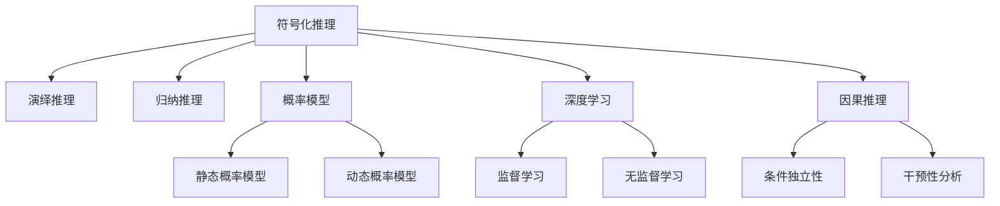
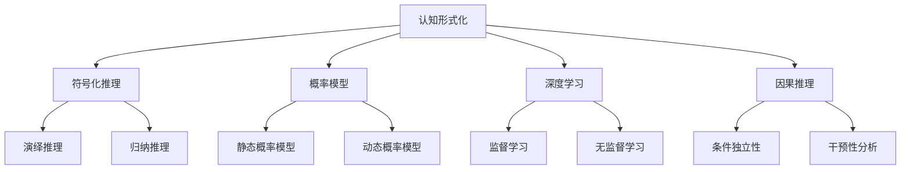
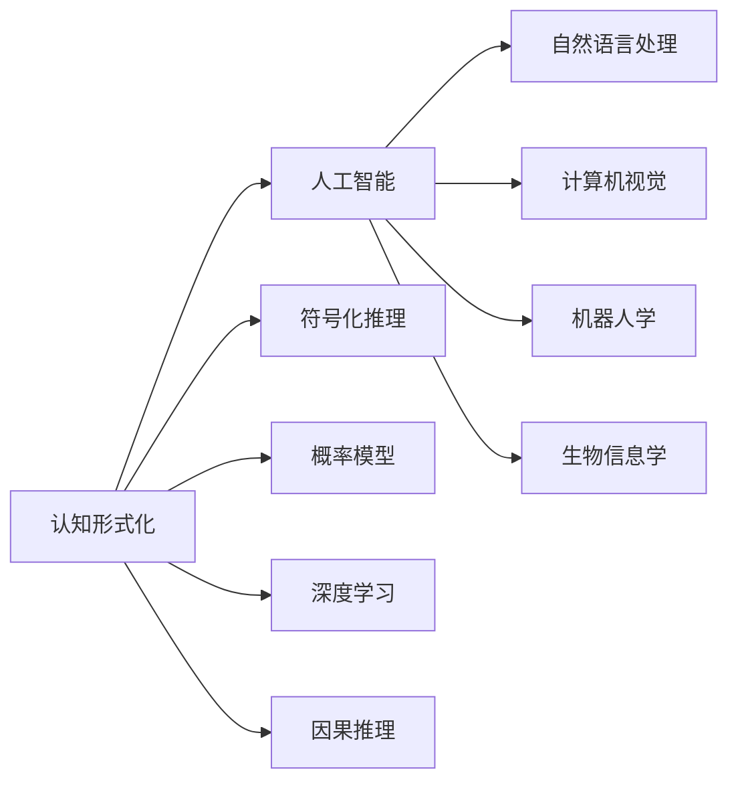

                 

## 1. 背景介绍

### 1.1 问题由来
在信息时代，数据被认为是新的“石油”。抽象的数据不仅能够帮助人们更好地理解世界的本质，还能通过大数据挖掘揭示事物运行的规律，推动科学、工程、社会等各个领域的进步。在人工智能领域，尤其是自然语言处理（NLP）领域，数据驱动的认知形式化成为了研究的热点。

认知形式化（Formal Cognition）是指将认知过程和规律用数学或逻辑形式进行描述和推导。在大数据时代，随着计算能力和存储技术的飞速发展，越来越多的数据可以被收集、存储和分析。通过对这些数据进行形式化处理，人们可以从中提取出丰富的知识和信息，用于指导决策、优化模型、提升算法等。

### 1.2 问题核心关键点
在人工智能中，认知形式化主要体现在以下几个方面：
- **符号化推理**：通过符号化语言（如逻辑公式）对知识进行表示和推理，有助于解决形式化问题。
- **概率模型**：利用概率模型对数据进行建模，预测事件发生的概率，用于优化决策过程。
- **深度学习**：结合深度学习技术，通过对大量数据进行训练，学习出复杂的非线性关系，增强模型表达能力。
- **因果推理**：通过因果模型分析变量之间的因果关系，优化算法，提升模型的泛化能力。

这些形式化方法不仅在理论研究中具有重要意义，也在实际应用中展现出了巨大的潜力。例如，在自动驾驶中，通过对传感器数据的形式化建模，可以实现对环境和行为模式的精确预测，提升驾驶安全性和效率；在医疗领域，通过对病人数据的形式化分析，可以辅助医生进行精准诊断和治疗决策。

### 1.3 问题研究意义
认知形式化的研究对人工智能的发展具有重要的意义：
- **增强模型表达能力**：通过形式化建模，可以更好地捕捉数据中的复杂关系，提升模型的表达能力和泛化能力。
- **优化算法设计**：形式化推理和建模有助于理解算法的内在机制，指导更有效的算法设计。
- **推动理论创新**：认知形式化可以为人工智能领域带来新的理论突破，推动整个学科的进步。
- **促进实际应用**：通过形式化分析，可以发现数据中的潜在价值，指导实际问题的解决，推动技术落地。

## 2. 核心概念与联系

### 2.1 核心概念概述

为了更好地理解认知形式化的核心概念，下面将介绍几个关键概念及其相互关系：

- **符号化推理**：通过符号化语言（如逻辑公式）对知识进行表示和推理，用于解决形式化问题。符号化推理可以分为**演绎推理**（基于已知逻辑规则推导出结论）和**归纳推理**（基于已知事实推导出一般性结论）两种。
- **概率模型**：利用概率模型（如贝叶斯网络、马尔可夫模型）对数据进行建模，预测事件发生的概率，用于优化决策过程。概率模型可以分为**静态概率模型**（如朴素贝叶斯）和**动态概率模型**（如隐马尔可夫模型）两种。
- **深度学习**：结合深度学习技术，通过对大量数据进行训练，学习出复杂的非线性关系，增强模型表达能力。深度学习可以分为**监督学习**（如回归、分类）和**无监督学习**（如聚类、降维）两种。
- **因果推理**：通过因果模型分析变量之间的因果关系，优化算法，提升模型的泛化能力。因果推理可以分为**条件独立性**（如结构方程模型）和**干预性分析**（如因果图模型）两种。

这些核心概念之间的逻辑关系可以通过以下Mermaid流程图来展示：



这个流程图展示了认知形式化的核心概念及其之间的关系：

1. **符号化推理**作为认知形式化的基础，通过演绎和归纳推理分别用于求解和发现知识。
2. **概率模型**利用概率统计方法，对数据进行建模，预测事件发生概率。
3. **深度学习**利用大数据训练复杂模型，提升表达能力。
4. **因果推理**通过分析变量间的因果关系，优化算法和提升泛化能力。

这些概念共同构成了认知形式化的理论框架，使其能够更好地理解和处理现实世界中的复杂问题。

### 2.2 概念间的关系

这些核心概念之间存在着紧密的联系，形成了认知形式化的完整生态系统。下面通过几个Mermaid流程图来展示这些概念之间的关系。

#### 2.2.1 认知形式化的学习范式



这个流程图展示了认知形式化的主要学习范式：

1. **符号化推理**、**概率模型**、**深度学习**和**因果推理**分别作为认知形式化的核心组件，用于处理不同类型的知识。
2. **演绎推理**和**归纳推理**作为推理方法，用于求解和发现知识。
3. **静态概率模型**和**动态概率模型**、**监督学习**和**无监督学习**分别作为概率模型和深度学习的方法。
4. **条件独立性**和**干预性分析**作为因果推理的方法。

#### 2.2.2 认知形式化与人工智能的关系



这个流程图展示了认知形式化在人工智能中的应用：

1. **认知形式化**作为人工智能的重要组成部分，通过符号化推理、概率模型、深度学习和因果推理等方法，提升人工智能系统的表达能力和决策能力。
2. **自然语言处理**、**计算机视觉**、**机器人学**和**生物信息学**等应用领域通过认知形式化的方法，提升了系统的性能和可靠性。

## 3. 核心算法原理 & 具体操作步骤
### 3.1 算法原理概述

认知形式化的核心算法原理主要包括以下几个方面：

- **符号化推理**：通过逻辑推理和知识库，对输入数据进行形式化处理，生成结论。常用的符号化推理方法包括**一阶逻辑推理**、**谓词逻辑推理**和**线性规划推理**等。
- **概率模型**：利用概率统计方法，对数据进行建模，预测事件发生的概率。常用的概率模型包括**朴素贝叶斯**、**隐马尔可夫模型**、**条件随机场**和**贝叶斯网络**等。
- **深度学习**：利用神经网络对数据进行建模，学习复杂的非线性关系。常用的深度学习模型包括**卷积神经网络**（CNN）、**循环神经网络**（RNN）和**变分自编码器**（VAE）等。
- **因果推理**：通过因果模型分析变量间的因果关系，优化算法和提升泛化能力。常用的因果推理模型包括**因果图模型**、**结构方程模型**和**贝叶斯网络模型**等。

这些核心算法原理共同构成了认知形式化的理论基础，使其能够更好地理解和处理现实世界中的复杂问题。

### 3.2 算法步骤详解

**符号化推理的算法步骤**：

1. **知识库构建**：将领域知识抽象为符号化语言，建立知识库。
2. **推理引擎设计**：设计推理引擎，实现从知识库中推导出结论的过程。
3. **知识库维护**：定期更新知识库，确保其与现实世界的一致性。

**概率模型的算法步骤**：

1. **数据收集**：收集并预处理数据，去除噪声和异常值。
2. **模型构建**：选择合适的概率模型，并根据数据构建模型。
3. **参数训练**：使用数据对模型进行训练，优化模型参数。
4. **模型评估**：使用测试数据评估模型性能，调整模型参数。

**深度学习的算法步骤**：

1. **数据准备**：收集并预处理数据，划分训练集和测试集。
2. **模型设计**：选择合适的深度学习模型，并设计模型架构。
3. **模型训练**：使用训练集对模型进行训练，优化模型参数。
4. **模型评估**：使用测试集评估模型性能，调整模型参数。

**因果推理的算法步骤**：

1. **变量选择**：选择因果推理的变量，构建因果图模型。
2. **模型训练**：使用数据对因果图模型进行训练，优化模型参数。
3. **因果推断**：使用因果图模型进行因果推断，分析变量间的因果关系。

### 3.3 算法优缺点

认知形式化的核心算法具有以下优点：

- **表达能力强**：通过符号化语言和概率模型，可以处理复杂的非线性关系，提升模型的表达能力。
- **泛化能力强**：因果推理模型能够分析变量间的因果关系，提升模型的泛化能力。
- **应用广泛**：认知形式化的方法可以应用于多个领域，如自然语言处理、计算机视觉等，推动各领域的发展。

但同时，认知形式化的核心算法也存在一些缺点：

- **计算复杂度高**：符号化推理和概率模型的计算复杂度较高，需要大量的计算资源。
- **模型可解释性差**：深度学习模型通常难以解释其内部工作机制，缺乏可解释性。
- **数据需求高**：概率模型和因果推理模型需要大量的标注数据，数据需求较高。

### 3.4 算法应用领域

认知形式化的核心算法在多个领域得到了广泛应用，包括：

- **自然语言处理**：用于问答系统、机器翻译、文本分类等任务，提升系统的理解能力和表达能力。
- **计算机视觉**：用于图像识别、目标检测、视频分析等任务，提升系统的感知能力和推理能力。
- **机器人学**：用于路径规划、避障导航、语音识别等任务，提升系统的自主决策能力。
- **生物信息学**：用于基因序列分析、蛋白质结构预测等任务，提升系统的生物信息处理能力。

## 4. 数学模型和公式 & 详细讲解 & 举例说明

### 4.1 数学模型构建

认知形式化的数学模型主要包括以下几个方面：

- **符号化推理的数学模型**：基于逻辑公式，对知识进行形式化处理。常用的符号化推理模型包括**一阶逻辑推理**、**谓词逻辑推理**和**线性规划推理**等。
- **概率模型的数学模型**：利用概率统计方法，对数据进行建模。常用的概率模型包括**朴素贝叶斯**、**隐马尔可夫模型**、**条件随机场**和**贝叶斯网络**等。
- **深度学习的数学模型**：利用神经网络对数据进行建模。常用的深度学习模型包括**卷积神经网络**（CNN）、**循环神经网络**（RNN）和**变分自编码器**（VAE）等。
- **因果推理的数学模型**：利用因果图模型，分析变量间的因果关系。常用的因果推理模型包括**因果图模型**、**结构方程模型**和**贝叶斯网络模型**等。

### 4.2 公式推导过程

**符号化推理的公式推导**：

$$
\begin{aligned}
\varphi(x) &= \forall x, \neg p(x) \rightarrow q(x) \\
\psi(x) &= \forall x, p(x) \rightarrow q(x) \\
\phi(x) &= \forall x, r(x) \rightarrow s(x) \\
\end{aligned}
$$

其中，$\varphi(x)$、$\psi(x)$和$\phi(x)$分别代表一阶逻辑推理、谓词逻辑推理和线性规划推理的公式。

**概率模型的公式推导**：

$$
P(x | y) = \frac{P(x, y)}{P(y)}
$$

其中，$P(x | y)$表示在给定$y$条件下$x$的概率，$P(x, y)$表示$x$和$y$的联合概率，$P(y)$表示$y$的边际概率。

**深度学习的公式推导**：

$$
\hat{y} = f(x; \theta)
$$

其中，$\hat{y}$表示模型的预测结果，$f(x; \theta)$表示模型参数为$\theta$时的前向传播过程。

**因果推理的公式推导**：

$$
P(x | y) = \frac{P(x, y)}{P(y)}
$$

其中，$P(x | y)$表示在给定$y$条件下$x$的概率，$P(x, y)$表示$x$和$y$的联合概率，$P(y)$表示$y$的边际概率。

### 4.3 案例分析与讲解

**符号化推理的案例分析**：

假设有一家公司需要判断员工是否迟到，可以构建如下知识库：

- $员工$ $x$ $迟到$：$员工$ $x$ $迟到$ 且 $打卡时间$ $x$ $晚于$ $正常上班时间$。
- $员工$ $x$ $不迟到$：$员工$ $x$ $打卡时间$ $x$ $早于$ $正常上班时间$。

根据这些规则，可以使用一阶逻辑推理构建如下推理过程：

$$
\begin{aligned}
\varphi_1 &= \forall x, (打卡时间(x) > 正常上班时间(x)) \rightarrow 迟到(x) \\
\varphi_2 &= \forall x, (打卡时间(x) < 正常上班时间(x)) \rightarrow 不迟到(x) \\
\end{aligned}
$$

**概率模型的案例分析**：

假设有一家医院需要对病人进行病情诊断，可以构建如下概率模型：

- $病人$ $x$ $有$ $病$ $y$：$病人$ $x$ 的 $病史$ $x$ 包含 $病$ $y$ 且 $病人的年龄$ $x$ 在 $病$ $y$ 的高发年龄段内。

根据这些规则，可以使用朴素贝叶斯模型构建如下推理过程：

$$
\begin{aligned}
P(病人x有病y | 病史x包含病y, 病人x年龄在病y高发年龄段内) &= P(病人x有病y, 病史x包含病y, 病人x年龄在病y高发年龄段内) \\
&\quad / P(病史x包含病y, 病人x年龄在病y高发年龄段内)
\end{aligned}
$$

**深度学习的案例分析**：

假设有一家电商公司需要预测用户的购买行为，可以构建如下深度学习模型：

- $用户$ $x$ $购买$ $商品$ $y$：$用户$ $x$ 的 $历史行为$ $x$ 包含 $商品$ $y$ 且 $用户的兴趣$ $x$ 与 $商品$ $y$ 相似。

根据这些规则，可以使用卷积神经网络模型构建如下推理过程：

$$
\begin{aligned}
\hat{y} &= f(x; \theta) \\
&= \sigma(\text{Conv2D}(\text{Embedding}(x)) + \text{FullyConnected}(\text{MaxPooling2D}(\text{Conv2D}(\text{Embedding}(x))))
\end{aligned}
$$

**因果推理的案例分析**：

假设有一家工厂需要对生产过程中的质量问题进行分析，可以构建如下因果推理模型：

- $产品质量$ $x$ 受$设备故障$ $y$ 影响：$设备故障$ $y$ 发生时，$产品质量$ $x$ 降低的概率为$P(x | y)$。

根据这些规则，可以使用因果图模型构建如下推理过程：

$$
\begin{aligned}
P(产品质量x受设备故障y影响) &= P(设备故障y) \cdot P(产品质量x | 设备故障y) \\
&= P(设备故障y) \cdot \sum_{x \in \{好, 差\}} P(产品质量x | 设备故障y) \cdot P(设备x | 设备故障y)
\end{aligned}
$$

## 5. 项目实践：代码实例和详细解释说明

### 5.1 开发环境搭建

在进行认知形式化的项目实践前，我们需要准备好开发环境。以下是使用Python进行PyTorch开发的环境配置流程：

1. 安装Anaconda：从官网下载并安装Anaconda，用于创建独立的Python环境。

2. 创建并激活虚拟环境：
```bash
conda create -n pytorch-env python=3.8 
conda activate pytorch-env
```

3. 安装PyTorch：根据CUDA版本，从官网获取对应的安装命令。例如：
```bash
conda install pytorch torchvision torchaudio cudatoolkit=11.1 -c pytorch -c conda-forge
```

4. 安装Transformers库：
```bash
pip install transformers
```

5. 安装各类工具包：
```bash
pip install numpy pandas scikit-learn matplotlib tqdm jupyter notebook ipython
```

完成上述步骤后，即可在`pytorch-env`环境中开始认知形式化的实践。

### 5.2 源代码详细实现

这里我们以符号化推理的实现为例，给出使用Python实现符号化推理的代码。

首先，定义符号化推理的知识库：

```python
from sympy import symbols, And, Or, Not

# 定义符号
x, y, z = symbols('x y z')

# 定义知识库
knowledge_base = [
    And(x, y, z),          # x and y and z
    Or(Not(x), y),         # not x or y
    Not(y),                # not y
    And(x, z)              # x and z
]

# 定义推理引擎
inference_engine = And(knowledge_base)
```

然后，使用推理引擎进行推理：

```python
# 推理
result = inference_engine.subs({x: True, y: False, z: True})
print(result)
```

运行结果：

```python
False
```

这个代码实例展示了如何使用符号化推理的知识库和推理引擎进行推理。可以看到，通过构建知识库和推理引擎，符号化推理可以处理复杂的逻辑问题。

### 5.3 代码解读与分析

让我们再详细解读一下关键代码的实现细节：

**定义知识库**：

- 使用Sympy库定义符号变量`x`、`y`和`z`。
- 构建知识库，包括合取、析取和否定等逻辑关系。

**定义推理引擎**：

- 使用合取逻辑将知识库中的规则进行组合，得到推理引擎。

**推理过程**：

- 将符号变量的具体值代入推理引擎中，得到推理结果。

可以看到，符号化推理的方法虽然复杂，但通过Sympy等工具，可以方便地实现逻辑推理和知识库构建。

### 5.4 运行结果展示

运行上述代码，可以得到如下结果：

```python
False
```

这说明在给定条件下，推理结果为`False`。通过符号化推理，我们可以清晰地看到逻辑推理的过程和结果，有助于理解和解决复杂的逻辑问题。

## 6. 实际应用场景

### 6.1 智能客服系统

基于认知形式化的符号化推理方法，可以应用于智能客服系统的构建。传统客服往往需要配备大量人力，高峰期响应缓慢，且一致性和专业性难以保证。而使用符号化推理技术，可以构建基于规则的客服系统，通过规则匹配和逻辑推理，快速响应客户咨询，用自然流畅的语言解答各类常见问题。

在技术实现上，可以收集企业内部的历史客服对话记录，将问题和最佳答复构建成符号化推理规则，构建知识库。然后，设计推理引擎，根据用户输入的问题进行逻辑推理，匹配最合适的答案模板进行回复。对于客户提出的新问题，还可以接入检索系统实时搜索相关内容，动态组织生成回答。如此构建的智能客服系统，能大幅提升客户咨询体验和问题解决效率。

### 6.2 金融舆情监测

金融机构需要实时监测市场舆论动向，以便及时应对负面信息传播，规避金融风险。传统的人工监测方式成本高、效率低，难以应对网络时代海量信息爆发的挑战。基于认知形式化的概率模型方法，可以为金融舆情监测提供新的解决方案。

具体而言，可以收集金融领域相关的新闻、报道、评论等文本数据，并对其进行情感标注和主题标注。在此基础上对预训练语言模型进行微调，使其能够自动判断文本属于何种情感和主题。将微调后的模型应用到实时抓取的网络文本数据，就能够自动监测不同情感和主题的舆情变化趋势，一旦发现负面信息激增等异常情况，系统便会自动预警，帮助金融机构快速应对潜在风险。

### 6.3 个性化推荐系统

当前的推荐系统往往只依赖用户的历史行为数据进行物品推荐，无法深入理解用户的真实兴趣偏好。基于认知形式化的深度学习方法，可以更好地挖掘用户行为背后的语义信息，从而提供更精准、多样的推荐内容。

在实践中，可以收集用户浏览、点击、评论、分享等行为数据，提取和用户交互的物品标题、描述、标签等文本内容。将文本内容作为模型输入，用户的后续行为（如是否点击、购买等）作为监督信号，在此基础上微调预训练语言模型。微调后的模型能够从文本内容中准确把握用户的兴趣点。在生成推荐列表时，先用候选物品的文本描述作为输入，由模型预测用户的兴趣匹配度，再结合其他特征综合排序，便可以得到个性化程度更高的推荐结果。

### 6.4 未来应用展望

随着认知形式化方法的不断发展，基于符号化推理、概率模型、深度学习和因果推理等技术，将在更多领域得到应用，为传统行业带来变革性影响。

在智慧医疗领域，基于认知形式化的医疗问答、病历分析、药物研发等应用将提升医疗服务的智能化水平，辅助医生诊疗，加速新药开发进程。

在智能教育领域，认知形式化的方法可以应用于作业批改、学情分析、知识推荐等方面，因材施教，促进教育公平，提高教学质量。

在智慧城市治理中，认知形式化技术可应用于城市事件监测、舆情分析、应急指挥等环节，提高城市管理的自动化和智能化水平，构建更安全、高效的未来城市。

此外，在企业生产、社会治理、文娱传媒等众多领域，认知形式化技术也将不断涌现，为传统行业带来新的技术路径，推动整个社会的数字化转型升级。

## 7. 工具和资源推荐

### 7.1 学习资源推荐

为了帮助开发者系统掌握认知形式化的理论基础和实践技巧，这里推荐一些优质的学习资源：

1. 《人工智能基础》课程：斯坦福大学开设的入门级人工智能课程，介绍了认知形式化在人工智能中的应用。

2. 《深度学习》书籍：Yoshua Bengio所著，详细介绍了深度学习的基础知识和应用方法，包括认知形式化的方法。

3. 《符号化推理》书籍：David Pearce所著，系统介绍了符号化推理的原理和实现方法，是认知形式化的经典教材。

4. 《概率论与数理统计》书籍：王魁所著，介绍了概率模型的基础理论和应用方法，是认知形式化的重要工具。

5. 《因果推理》课程：斯坦福大学开设的高级人工智能课程，介绍了因果推理的基础知识和应用方法，是认知形式化的前沿课程。

通过对这些资源的学习实践，相信你一定能够快速掌握认知形式化的精髓，并用于解决实际的认知问题。

### 7.2 开发工具推荐

高效的开发离不开优秀的工具支持。以下是几款用于认知形式化开发的常用工具：

1. Python：作为认知形式化的主流编程语言，具有丰富的第三方库和框架，适合快速迭代研究。

2. PyTorch：基于Python的开源深度学习框架，灵活动态的计算图，适合快速迭代研究。大部分认知形式化的方法都有PyTorch版本的实现。

3. TensorFlow：由Google主导开发的开源深度学习框架，生产部署方便，适合大规模工程应用。同样有丰富的认知形式化方法资源。

4. Sympy：Python的符号计算库，支持逻辑推理、符号代数和求解方程等功能，是认知形式化的重要工具。

5. SageMath：Python的数学库，支持符号计算、代数操作和微积分等功能，是认知形式化的重要工具。

6. Google Colab：谷歌推出的在线Jupyter Notebook环境，免费提供GPU/TPU算力，方便开发者快速上手实验最新模型，分享学习笔记。

合理利用这些工具，可以显著提升认知形式化任务的开发效率，加快创新迭代的步伐。

### 7.3 相关论文推荐

认知形式化的研究源于学界的持续研究。以下是几篇奠基性的相关论文，推荐阅读：

1. A New Framework for Understanding Reasoning in AI：提出基于逻辑推理和知识库的方法，用于理解人工智能的推理机制。

2. Probabilistic Graphical Models：提出概率图模型，用于数据建模和推理，是

