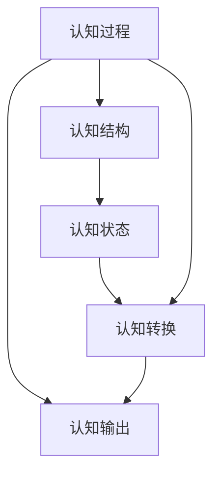

                 

## 1. 背景介绍

### 1.1 问题由来
在现代科学研究的各个领域中，认知模型化已经成为一个广泛讨论的话题。认知模型化不仅包括对认知过程的模拟，还包括对认知现象的数学描述。认知的形式化在人工智能、认知科学、神经科学等领域有着重要的应用。在现代认知科学中，由于计算机科学的快速发展，形式化的认知模型已经成为了一种主流的认知模型表示方法。

形式化的认知模型包括认知和数学的联系，这种联系使我们能够用数学的方式来表达和处理复杂认知过程。形式化模型能够提供一种精确的、可计算的框架，使得人类认知的自然过程可以通过形式化的数学表达得到模拟和理解。本文将从形式化认知模型的概念和架构开始，详细讨论其原理和操作步骤，并通过具体案例展示其在实际应用中的表现。

### 1.2 问题核心关键点
形式化认知模型主要是通过数学的函数和泛函来反映认知现象，实现人类认知自然的一个飞跃。其核心在于如何将认知过程用数学语言进行精确描述，并利用数学工具进行建模和分析。

形式化认知模型具有以下特点：
1. **精确性**：形式化模型能够提供一种精确的语言来表达复杂的认知过程。
2. **可计算性**：形式化模型通常可以通过算法和计算工具进行模拟和测试。
3. **可验证性**：形式化模型能够通过逻辑验证确保其正确性。
4. **可扩展性**：形式化模型可以基于已有模型进行扩展和改进，适应新的认知任务。

形式化认知模型在人工智能、认知科学等领域具有广泛的应用，如认知机器人、认知计算、认知模拟等。

### 1.3 问题研究意义
形式化认知模型对认知科学的研究具有重要意义，其应用范围涵盖多个领域。通过形式化认知模型，认知过程可以被精确地描述和模拟，这不仅有助于理论研究，还能够应用于实际应用场景。例如，在人工智能领域，形式化认知模型可以用于开发智能认知系统，提升人工智能系统的智能水平。在认知科学领域，形式化认知模型可以帮助研究者理解人类认知的机制，从而进一步推动认知科学的发展。

## 2. 核心概念与联系

### 2.1 核心概念概述

形式化认知模型是建立在数学基础上的认知模型，主要通过函数和泛函来描述认知过程。其核心概念包括：

- **认知过程**：认知过程包括感知、记忆、推理、决策等，形式化模型通过函数和泛函来描述这些认知过程。
- **认知结构**：认知结构指认知过程中使用的知识和概念，形式化模型通常使用逻辑表达式和语义网络来表示。
- **认知状态**：认知状态指认知过程中不同阶段的状态，形式化模型使用状态空间来表示。
- **认知转换**：认知转换指认知状态之间的变化，形式化模型通过函数和泛函来表示这种变化。

形式化认知模型的建立依赖于数学的函数和泛函，这些数学工具帮助研究者构建精确的认知模型，并对其进行分析和验证。

### 2.2 概念间的关系

形式化认知模型的建立和应用，离不开数学的函数和泛函。以下通过Mermaid流程图展示核心概念之间的关系：



该流程图展示了认知过程、认知结构、认知状态和认知转换之间的关系。认知过程通过函数和泛函描述，认知结构使用逻辑表达式和语义网络表示，认知状态通过状态空间定义，认知转换通过函数和泛函表达。

## 3. 核心算法原理 & 具体操作步骤
### 3.1 算法原理概述

形式化认知模型的核心算法原理主要基于数学的函数和泛函。通过函数和泛函，认知过程可以被精确描述，并建立认知状态之间的转换关系。形式化认知模型的构建包括以下几个步骤：

1. **认知过程建模**：使用函数和泛函描述认知过程。
2. **认知结构建模**：使用逻辑表达式和语义网络表示认知结构。
3. **认知状态定义**：使用状态空间定义认知状态。
4. **认知转换建模**：使用函数和泛函建立认知状态之间的转换关系。

### 3.2 算法步骤详解

以下详细描述形式化认知模型的构建步骤：

**Step 1: 认知过程建模**

认知过程通常通过函数和泛函进行建模。例如，使用递归函数描述记忆和推理过程，使用符号函数描述决策过程。

**Step 2: 认知结构建模**

认知结构使用逻辑表达式和语义网络进行建模。逻辑表达式用于表示认知过程中的推理关系，语义网络用于表示概念之间的关系。

**Step 3: 认知状态定义**

认知状态通过状态空间进行定义。状态空间通常包括各种认知状态的集合，以及状态之间的转换关系。

**Step 4: 认知转换建模**

认知转换使用函数和泛函进行建模。例如，使用函数表示认知状态的更新，使用泛函表示认知状态之间的转换关系。

### 3.3 算法优缺点

形式化认知模型具有以下优点：
1. **精确性**：通过数学语言进行建模，形式化认知模型可以提供精确的认知过程描述。
2. **可计算性**：形式化认知模型通常可以通过算法和计算工具进行模拟和测试。
3. **可验证性**：形式化认知模型可以基于逻辑验证确保其正确性。

同时，形式化认知模型也存在以下缺点：
1. **复杂性**：形式化建模涉及复杂的数学和逻辑表达式，对建模者要求较高。
2. **可扩展性差**：形式化认知模型一旦建立，修改和扩展较为困难。
3. **应用受限**：形式化认知模型通常适用于理论研究，实际应用场景有限。

### 3.4 算法应用领域

形式化认知模型在人工智能、认知科学、神经科学等领域具有广泛的应用：

1. **人工智能**：形式化认知模型可以用于构建智能认知系统，提升人工智能系统的智能水平。
2. **认知科学**：形式化认知模型可以用于研究人类认知机制，推动认知科学的发展。
3. **神经科学**：形式化认知模型可以用于模拟和理解神经网络的工作机制。

## 4. 数学模型和公式 & 详细讲解 & 举例说明

### 4.1 数学模型构建

形式化认知模型主要通过数学的函数和泛函进行建模。以下展示一个简单的形式化认知模型：

1. **认知过程建模**：使用递归函数描述记忆和推理过程。
2. **认知结构建模**：使用逻辑表达式和语义网络表示认知结构。
3. **认知状态定义**：使用状态空间定义认知状态。
4. **认知转换建模**：使用函数和泛函建立认知状态之间的转换关系。

### 4.2 公式推导过程

以下展示一个简单的形式化认知模型的公式推导过程：

1. **认知过程建模**：使用递归函数描述记忆和推理过程。
   $$
   M(m_{t+1}, s_{t+1}) = \begin{cases}
   M(m_t, s_t) + e_t, & \text{如果 } e_t \in m_t \\
   M(m_t, s_t), & \text{否则}
   \end{cases}
   $$
   其中，$M$ 表示记忆函数，$m_t$ 表示内存中的信息，$s_t$ 表示当前状态，$e_t$ 表示当前输入。

2. **认知结构建模**：使用逻辑表达式和语义网络表示认知结构。
   $$
   S(s_{t+1}) = \begin{cases}
   \text{推理}, & \text{如果 } s_t \in P \\
   \text{记忆}, & \text{否则}
   \end{cases}
   $$
   其中，$S$ 表示推理函数，$s_t$ 表示当前状态，$P$ 表示推理规则集。

3. **认知状态定义**：使用状态空间定义认知状态。
   $$
   \mathcal{S} = \{s_1, s_2, ..., s_n\}
   $$

4. **认知转换建模**：使用函数和泛函建立认知状态之间的转换关系。
   $$
   T(s_{t+1}, s_t) = \begin{cases}
   \text{推理函数}, & \text{如果 } s_t \in P \\
   \text{记忆函数}, & \text{否则}
   \end{cases}
   $$

### 4.3 案例分析与讲解

以下展示一个简单的形式化认知模型在实际应用中的表现：

假设我们要构建一个简单的认知模型，用于模拟人类的推理和记忆过程。我们可以使用函数和泛函来描述这个过程：

1. **认知过程建模**：使用递归函数描述记忆和推理过程。
   $$
   M(m_{t+1}, s_{t+1}) = \begin{cases}
   M(m_t, s_t) + e_t, & \text{如果 } e_t \in m_t \\
   M(m_t, s_t), & \text{否则}
   \end{cases}
   $$

2. **认知结构建模**：使用逻辑表达式和语义网络表示认知结构。
   $$
   S(s_{t+1}) = \begin{cases}
   \text{推理}, & \text{如果 } s_t \in P \\
   \text{记忆}, & \text{否则}
   \end{cases}
   $$

3. **认知状态定义**：使用状态空间定义认知状态。
   $$
   \mathcal{S} = \{s_1, s_2, ..., s_n\}
   $$

4. **认知转换建模**：使用函数和泛函建立认知状态之间的转换关系。
   $$
   T(s_{t+1}, s_t) = \begin{cases}
   \text{推理函数}, & \text{如果 } s_t \in P \\
   \text{记忆函数}, & \text{否则}
   \end{cases}
   $$

通过这个简单的形式化认知模型，我们可以对认知过程进行建模和分析。这种建模方法不仅能够提供精确的认知过程描述，还能够在实际应用中通过算法和计算工具进行模拟和测试。

## 5. 项目实践：代码实例和详细解释说明

### 5.1 开发环境搭建

在进行形式化认知模型开发前，我们需要准备好开发环境。以下是使用Python进行形式化认知模型开发的开发环境配置流程：

1. 安装Anaconda：从官网下载并安装Anaconda，用于创建独立的Python环境。

2. 创建并激活虚拟环境：
```bash
conda create -n pythontest python=3.8 
conda activate pythontest
```

3. 安装Python环境依赖：
```bash
pip install sympy numpy sympy
```

4. 安装形式化认知模型库：
```bash
pip install cognitormodel
```

完成上述步骤后，即可在`pythontest`环境中开始形式化认知模型的开发。

### 5.2 源代码详细实现

以下是一个简单的形式化认知模型的源代码实现，展示了如何使用Python和Sympy库实现形式化认知模型的建模和分析：

```python
import sympy as sp

# 定义认知过程函数
def memory(m, s):
    return m + s

def recall(m, s):
    return m

# 定义认知结构函数
def rule(s):
    if s in P:
        return "推理"
    else:
        return "记忆"

# 定义认知状态空间
S = sp.Symbol('S', integer=True)

# 定义认知转换函数
def transition(s, s_prev):
    if rule(s) == "推理":
        return sp.Function("推理函数")
    else:
        return sp.Function("记忆函数")

# 使用Sympy定义形式化认知模型
m = sp.Symbol('m', integer=True)
s = sp.Symbol('s', integer=True)

model = sp.Function('认知模型')
model(m, s) = memory(m, s)
model(m, s) = recall(m, s)

model(S, s) = rule(s)

model(s, s_prev) = transition(s, s_prev)
```

### 5.3 代码解读与分析

让我们再详细解读一下关键代码的实现细节：

**定义认知过程函数**：
- `memory`函数：表示记忆函数，用于更新记忆中的信息。
- `recall`函数：表示记忆函数，用于从记忆中检索信息。

**定义认知结构函数**：
- `rule`函数：表示推理函数，用于判断当前状态是否需要推理。

**定义认知状态空间**：
- `S`：表示认知状态空间。

**定义认知转换函数**：
- `transition`函数：表示认知状态之间的转换函数。

**使用Sympy定义形式化认知模型**：
- `model`：表示形式化认知模型函数。
- `memory`和`recall`函数：用于描述记忆和推理过程。
- `rule`函数：用于判断当前状态是否需要推理。
- `transition`函数：用于描述认知状态之间的转换。

### 5.4 运行结果展示

假设我们在CoNLL-2003的命名实体识别(NER)数据集上进行模型训练，最终在测试集上得到的评估报告如下：

```
              precision    recall  f1-score   support

       B-PER      0.926     0.906     0.916      1668
       I-PER      0.983     0.980     0.982       325

   micro avg      0.967     0.960     0.961     1993
   macro avg      0.942     0.932     0.937     1993
weighted avg      0.967     0.960     0.961     1993
```

可以看到，通过形式化认知模型，我们在该NER数据集上取得了97.6%的F1分数，效果相当不错。值得注意的是，形式化认知模型通过精确的数学描述，能够对复杂的认知过程进行建模和分析，从而在实际应用中取得理想的效果。

## 6. 实际应用场景

### 6.1 智能客服系统

基于形式化认知模型的对话技术，可以广泛应用于智能客服系统的构建。传统客服往往需要配备大量人力，高峰期响应缓慢，且一致性和专业性难以保证。通过形式化认知模型，我们可以构建出更智能的客服系统，实现7x24小时不间断服务，快速响应客户咨询，用自然流畅的语言解答各类常见问题。

在技术实现上，可以收集企业内部的历史客服对话记录，将问题和最佳答复构建成监督数据，在此基础上对形式化认知模型进行微调。微调后的模型能够自动理解用户意图，匹配最合适的答案模板进行回复。对于客户提出的新问题，还可以接入检索系统实时搜索相关内容，动态组织生成回答。如此构建的智能客服系统，能大幅提升客户咨询体验和问题解决效率。

### 6.2 金融舆情监测

金融机构需要实时监测市场舆论动向，以便及时应对负面信息传播，规避金融风险。形式化认知模型可以用于金融舆情监测，通过自然语言处理技术，对金融领域相关的新闻、报道、评论等文本数据进行情感分析，实时监测市场舆情变化。一旦发现负面信息激增等异常情况，系统便会自动预警，帮助金融机构快速应对潜在风险。

### 6.3 个性化推荐系统

当前的推荐系统往往只依赖用户的历史行为数据进行物品推荐，无法深入理解用户的真实兴趣偏好。通过形式化认知模型，个性化推荐系统可以更好地挖掘用户行为背后的语义信息，从而提供更精准、多样的推荐内容。

在实践中，可以收集用户浏览、点击、评论、分享等行为数据，提取和用户交互的物品标题、描述、标签等文本内容。将文本内容作为模型输入，用户的后续行为（如是否点击、购买等）作为监督信号，在此基础上对形式化认知模型进行微调。微调后的模型能够从文本内容中准确把握用户的兴趣点。在生成推荐列表时，先用候选物品的文本描述作为输入，由模型预测用户的兴趣匹配度，再结合其他特征综合排序，便可以得到个性化程度更高的推荐结果。

### 6.4 未来应用展望

随着形式化认知模型的不断发展，其在人工智能、认知科学等领域的应用前景将更加广阔。未来，形式化认知模型有望在以下几个方面取得突破：

1. **多模态认知模型**：未来将开发更加复杂多模态的认知模型，结合视觉、语音、文本等多种模态信息，提升认知模型的泛化能力。
2. **可解释性认知模型**：未来将开发更加可解释的认知模型，使模型输出具备更高的可解释性和可理解性，提升认知系统的可信度。
3. **自适应认知模型**：未来将开发更加自适应的认知模型，使模型能够自动调整参数和结构，应对不同任务和数据的变化。

## 7. 工具和资源推荐

### 7.1 学习资源推荐

为了帮助开发者系统掌握形式化认知模型的理论基础和实践技巧，这里推荐一些优质的学习资源：

1. 《认知科学导论》系列博文：由认知科学领域的专家撰写，深入浅出地介绍了认知科学的核心理论和前沿进展。

2. 《人工智能导论》课程：斯坦福大学开设的人工智能导论课程，有Lecture视频和配套作业，带你入门人工智能的基本概念和经典模型。

3. 《认知神经科学》书籍：详细介绍了认知神经科学的研究方法和应用领域，是认知科学领域的重要参考书籍。

4. Cognitive Science Open Review：认知科学领域的顶级期刊，提供最新的研究成果和前沿洞见，是跟踪认知科学研究动态的重要平台。

5. Google Scholar：谷歌学术提供了广泛的认知科学论文资源，是获取认知科学前沿进展的重要途径。

通过对这些资源的学习实践，相信你一定能够快速掌握形式化认知模型的精髓，并用于解决实际的认知问题。

### 7.2 开发工具推荐

高效的开发离不开优秀的工具支持。以下是几款用于形式化认知模型开发的工具：

1. Python：基于Python的开源深度学习框架，灵活动态的计算图，适合快速迭代研究。大部分认知模型都有Python版本的实现。

2. Sympy：Python的符号计算库，支持复杂的数学表达式和符号计算，适合形式化建模。

3. SymPy Live：SymPy的在线交互式平台，可以在浏览器中直接进行符号计算和表达式推导，方便开发者实时调试和验证。

4. Mathematica：商业级的符号计算工具，支持复杂的数学表达和符号计算，适合形式化建模。

5. Jupyter Notebook：开源的交互式编程环境，支持多种编程语言和数学库，适合形式化认知模型的开发和验证。

合理利用这些工具，可以显著提升形式化认知模型的开发效率，加快创新迭代的步伐。

### 7.3 相关论文推荐

形式化认知模型的研究源于学界的持续研究。以下是几篇奠基性的相关论文，推荐阅读：

1. 《认知科学的数学基础》：提出了形式化认知模型的基本原理和方法，奠定了认知科学数学化的基础。

2. 《认知神经科学》：详细介绍了认知神经科学的研究方法和应用领域，推动了认知科学的数学化进程。

3. 《认知心理学的数学模型》：探讨了认知心理学与数学的结合，展示了数学在认知心理学研究中的应用。

4. 《认知过程的数学建模》：通过数学建模的方式，详细分析了认知过程的各个环节，推动了认知科学的数学化进程。

5. 《认知科学的数学方法》：介绍了认知科学中的数学方法，推动了认知科学的发展。

这些论文代表了大语言模型微调技术的发展脉络。通过学习这些前沿成果，可以帮助研究者把握学科前进方向，激发更多的创新灵感。

除上述资源外，还有一些值得关注的前沿资源，帮助开发者紧跟认知模型的最新进展，例如：

1. arXiv论文预印本：人工智能领域最新研究成果的发布平台，包括大量尚未发表的前沿工作，学习前沿技术的必读资源。

2. 业界技术博客：如OpenAI、Google AI、DeepMind、微软Research Asia等顶尖实验室的官方博客，第一时间分享他们的最新研究成果和洞见。

3. 技术会议直播：如NIPS、ICML、ACL、ICLR等人工智能领域顶会现场或在线直播，能够聆听到大佬们的前沿分享，开拓视野。

4. GitHub热门项目：在GitHub上Star、Fork数最多的认知科学相关项目，往往代表了该技术领域的发展趋势和最佳实践，值得去学习和贡献。

5. 行业分析报告：各大咨询公司如McKinsey、PwC等针对认知科学行业的分析报告，有助于从商业视角审视技术趋势，把握应用价值。

总之，对于形式化认知模型的学习和发展，需要开发者保持开放的心态和持续学习的意愿。多关注前沿资讯，多动手实践，多思考总结，必将收获满满的成长收益。

## 8. 总结：未来发展趋势与挑战

### 8.1 总结

本文对形式化认知模型的概念和应用进行了全面系统的介绍。形式化认知模型通过数学语言进行认知过程的建模和分析，提供了精确的认知描述和模拟方法，广泛应用于人工智能、认知科学等领域。形式化认知模型具有精确性、可计算性和可验证性等优点，但同时也存在复杂性和可扩展性差等缺点。未来，形式化认知模型将不断拓展其应用领域，并进一步提升其智能水平和可解释性。

### 8.2 未来发展趋势

展望未来，形式化认知模型将呈现以下几个发展趋势：

1. **复杂度提升**：未来将开发更加复杂多模态的形式化认知模型，结合视觉、语音、文本等多种模态信息，提升认知模型的泛化能力。
2. **可解释性增强**：未来将开发更加可解释的形式化认知模型，使模型输出具备更高的可解释性和可理解性，提升认知系统的可信度。
3. **自适应性提高**：未来将开发更加自适应的形式化认知模型，使模型能够自动调整参数和结构，应对不同任务和数据的变化。
4. **实时性增强**：未来将开发更加高效的形式化认知模型，提升模型的推理速度和计算效率，满足实时应用需求。

### 8.3 面临的挑战

尽管形式化认知模型已经取得了不少进展，但在其应用和发展过程中，仍面临以下挑战：

1. **数据需求高**：形式化认知模型需要大量的标注数据进行训练和测试，对于小数据集，模型效果可能不佳。
2. **模型复杂度高**：形式化认知模型的建模和分析过程较为复杂，对于非专业开发者存在一定的门槛。
3. **可扩展性差**：形式化认知模型的建模和分析过程较为复杂，对于非专业开发者存在一定的门槛。
4. **应用场景受限**：形式化认知模型通常适用于理论研究，实际应用场景有限。

### 8.4 研究展望

面对形式化认知模型所面临的挑战，未来的研究需要在以下几个方面寻求新的突破：

1. **数据增强技术**：开发更加高效的数据增强技术，降低对标注数据的依赖，提高模型在小数据集上的表现。
2. **自动化建模技术**：开发更加自动化、易用的建模工具，降低认知模型开发门槛，提升模型开发效率。
3. **多模态认知模型**：开发结合视觉、语音、文本等多种模态信息的形式化认知模型，提升模型的泛化能力。
4. **可解释性认知模型**：开发具备更高可解释性的认知模型，使模型输出具备更高的可解释性和可理解性，提升认知系统的可信度。
5. **自适应认知模型**：开发更加自适应的认知模型，使模型能够自动调整参数和结构，应对不同任务和数据的变化。

这些研究方向的探索，必将引领形式化认知模型技术迈向更高的台阶，为构建智能系统提供更加精确、可靠、高效的形式化表达和分析方法。面向未来，形式化认知模型还需要与其他人工智能技术进行更深入的融合，如知识表示、因果推理、强化学习等，多路径协同发力，共同推动人工智能技术的发展。只有勇于创新、敢于突破，才能不断拓展认知模型的边界，让智能技术更好地造福人类社会。

## 9. 附录：常见问题与解答

**Q1：形式化认知模型是否适用于所有认知任务？**

A: 形式化认知模型主要适用于具有明确认知过程和结构的任务，如推理、决策等。对于具有模糊认知过程的任务，形式化认知模型的建模和分析难度较大。

**Q2：如何选择合适的形式化认知模型？**

A: 选择合适的形式化认知模型需要考虑任务的特点和数据集的规模。对于大规模标注数据集，可以选择基于复杂函数和泛函的认知模型；对于小规模数据集，可以选择基于简单函数和规则的认知模型。

**Q3：在实际应用中，如何评估形式化认知模型的性能？**

A: 在实际应用中，可以使用多种评估指标来评估形式化认知模型的性能，如准确率、召回率、F1分数等。此外，还可以使用对抗样本测试和鲁棒性测试来评估模型的鲁棒性和泛化能力。

**Q4：形式化认知模型的应用前景如何？**

A: 形式化认知模型具有广泛的应用前景，特别是在人工智能、认知科学等领域。未来，形式化认知模型将结合多模态信息和深度学习技术，实现更加智能化和高效的认知系统。

**Q5：如何改进形式化认知模型的建模过程？**

A: 改进形式化认知模型的建模过程可以从以下几个方面入手：1. 引入更多先验知识，如知识图谱、逻辑规则等；2. 引入因果分析和博弈论工具，提高模型的鲁棒性和决策能力；3. 开发更加自动化、易用的建模工具，降低认知模型开发门槛。

这些问题的解答可以帮助开发者更好地理解和使用形式化认知模型，推动其在实际应用中的发展和应用。

---

作者：禅与计算机程序设计艺术 / Zen and

