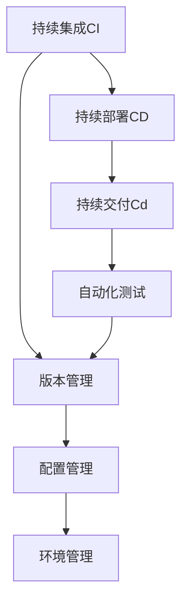
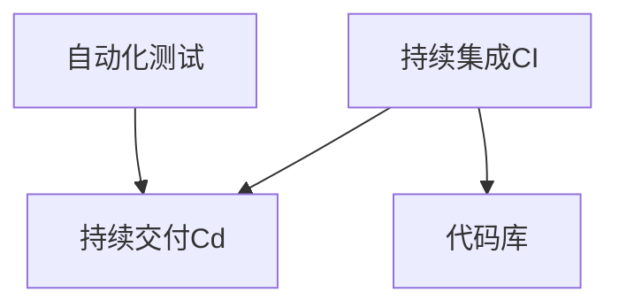
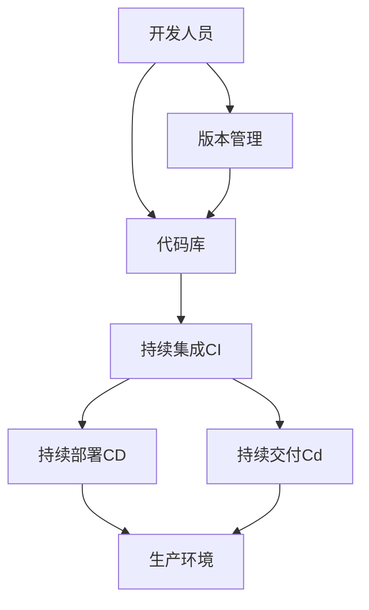

                 

## 1. 背景介绍

### 1.1 问题由来
随着软件行业的不断发展，软件开发的质量管理变得日益重要。传统软件的发布流程（1.0）往往依赖人工经验，导致质量问题频发，研发成本高，且难以保证一致性。软件2.0的提出，旨在通过建立科学化的发布管理流程，自动化质量控制，提高发布效率，保证软件质量，降低成本，提升用户满意度。

### 1.2 问题核心关键点
软件2.0的核心在于引入持续集成（CI）、持续部署（CD）和持续交付（Cd）等自动化工具，通过自动化测试、自动化构建和自动化部署，形成闭环的发布管理流程。以下是关键点：

1. 持续集成：通过自动化构建、自动化测试，及时发现和解决问题，减少人工干预，提高代码质量。
2. 持续部署：将代码自动部署到生产环境，实现快速交付和迭代更新。
3. 持续交付：通过自动化测试和自动化部署，确保代码的稳定性，快速交付。
4. 自动化工具：CI/CD/CD流水线，配置管理，环境管理等工具，确保发布流程的自动化和高效。

### 1.3 问题研究意义
软件2.0的发布管理流程，对软件开发质量和效率有重大影响：

1. 提高软件质量：自动化测试和部署，减少人为错误，提高代码质量。
2. 提升开发效率：持续集成和持续交付，实现快速迭代，缩短产品上市时间。
3. 降低研发成本：通过自动化工具和标准化流程，降低人工成本和时间成本。
4. 增强用户满意度：快速响应市场变化，及时更新，满足用户需求。

## 2. 核心概念与联系

### 2.1 核心概念概述

为更好地理解软件2.0的发布管理流程，本节将介绍几个密切相关的核心概念：

- 持续集成（Continuous Integration, CI）：一种软件开发实践，通过自动化构建和自动化测试，保证代码质量和稳定性。
- 持续部署（Continuous Deployment, CD）：一种发布管理实践，将代码自动部署到生产环境，实现快速交付。
- 持续交付（Continuous Delivery, Cd）：一种发布管理实践，通过自动化测试和自动化部署，确保代码的稳定性和可交付性。
- 自动化工具：CI/CD/CD流水线、配置管理、环境管理等工具，确保发布流程的自动化和高效。
- 自动化测试：单元测试、集成测试、端到端测试等自动化测试技术，保证代码的正确性和稳定性。
- 版本管理：Git、SVN等版本控制工具，管理代码的变更和发布。

这些核心概念之间的逻辑关系可以通过以下Mermaid流程图来展示：



这个流程图展示了几大核心概念之间的联系：

1. 持续集成（CI）是持续部署（CD）和持续交付（Cd）的基础，通过自动化构建和测试，保证代码的稳定性和正确性。
2. 持续部署（CD）和持续交付（Cd）分别针对部署和交付环节，通过自动化工具，实现快速迭代和快速响应市场变化。
3. 自动化测试是持续集成的核心环节，确保代码的正确性和稳定性。
4. 版本管理、配置管理和环境管理，是持续集成的重要支持，保证代码和环境的可靠性。

### 2.2 概念间的关系

这些核心概念之间存在着紧密的联系，形成了软件2.0的完整发布管理流程。下面我通过几个Mermaid流程图来展示这些概念之间的关系。

#### 2.2.1 持续集成与持续部署的关系


这个流程图展示了持续集成（CI）和持续部署（CD）之间的关系：

1. 持续集成（CI）负责自动化构建和测试，生成可部署的代码。
2. 持续部署（CD）负责将代码自动部署到生产环境，实现快速交付。

#### 2.2.2 持续交付与持续部署的关系


这个流程图展示了持续交付（Cd）和持续部署（CD）之间的关系：

1. 持续部署（CD）负责将代码自动部署到生产环境，实现快速交付。
2. 持续交付（Cd）负责通过自动化测试和自动化部署，确保代码的稳定性和可交付性。

#### 2.2.3 自动化测试与持续集成的关系



这个流程图展示了自动化测试在持续集成（CI）中的作用：

1. 持续集成（CI）负责自动化构建和测试，生成可部署的代码。
2. 自动化测试是持续集成的核心环节，确保代码的正确性和稳定性。

### 2.3 核心概念的整体架构

最后，我们用一个综合的流程图来展示这些核心概念在大规模软件开发中的整体架构：



这个综合流程图展示了从开发人员到生产环境的整个发布管理流程：

1. 开发人员通过版本管理工具提交代码到代码库。
2. 持续集成（CI）自动化构建和测试，生成可部署的代码。
3. 持续部署（CD）将代码自动部署到生产环境，实现快速交付。
4. 持续交付（Cd）通过自动化测试和自动化部署，确保代码的稳定性和可交付性。

通过这些流程图，我们可以更清晰地理解软件2.0的发布管理流程中各个概念的关系和作用，为后续深入讨论具体的发布管理实践奠定基础。

## 3. 核心算法原理 & 具体操作步骤

### 3.1 算法原理概述

软件2.0的发布管理流程，主要依赖自动化工具和持续集成、持续部署、持续交付等发布管理实践，通过自动化测试和自动化部署，实现软件的高效、稳定和快速交付。

核心算法原理如下：

1. 代码变更检测：通过版本管理工具，自动检测代码库中的变更，触发自动化流程。
2. 自动化构建：通过CI流水线，自动化编译和构建代码，生成可执行文件。
3. 自动化测试：通过单元测试、集成测试、端到端测试等自动化测试技术，确保代码的正确性和稳定性。
4. 自动化部署：通过CD流水线，自动化部署代码到生产环境，实现快速交付。
5. 持续交付：通过Cd流程，自动化测试和部署，确保代码的稳定性和可交付性。

### 3.2 算法步骤详解

#### 3.2.1 准备阶段
- 选择适合的CI/CD/CD工具（如Jenkins、GitLab CI、GitHub Actions等）。
- 配置版本管理工具（如Git、SVN等），管理代码变更。
- 定义CI/CD/CD流程，包括构建、测试、部署等环节。

#### 3.2.2 持续集成
- 通过版本管理工具检测代码变更。
- 自动化构建和测试代码。
- 记录测试结果，生成构建日志。
- 根据测试结果触发后续流程，如部署或告警。

#### 3.2.3 持续部署
- 自动部署代码到生产环境。
- 进行环境部署和配置管理。
- 进行滚动发布或蓝绿发布。
- 记录部署日志，生成部署报告。

#### 3.2.4 持续交付
- 自动化测试和部署代码。
- 进行环境管理，确保环境一致性。
- 记录测试和部署结果，生成交付报告。

#### 3.2.5 运维和监控
- 监控系统运行状态。
- 设置告警机制，及时处理异常。
- 收集反馈信息，持续优化发布流程。

### 3.3 算法优缺点

#### 3.3.1 优点
1. 自动化流程，减少人工干预，提高发布效率。
2. 自动化测试和部署，保证代码的正确性和稳定性。
3. 快速响应市场变化，快速交付，缩短产品上市时间。
4. 持续优化和迭代，提升软件质量和用户体验。

#### 3.3.2 缺点
1. 初期需要投入较多资源，配置和管理CI/CD/CD流程。
2. 自动化测试和部署需要一定的时间和资源成本。
3. 需要团队具备一定的自动化工具和技术能力。
4. 需要持续监控和优化，保证系统的稳定性和安全性。

### 3.4 算法应用领域

软件2.0的发布管理流程，已在软件开发、IT运维、自动化测试、产品交付等诸多领域得到广泛应用。以下是几个典型应用场景：

- 软件开发：通过自动化构建和测试，快速迭代和交付软件。
- IT运维：通过自动化部署和监控，快速响应用户请求和故障处理。
- 自动化测试：通过自动化测试工具，提高测试效率和测试覆盖率。
- 产品交付：通过自动化部署和持续交付，实现快速交付和市场响应。

此外，软件2.0在企业级项目管理、DevOps文化建设等场景中，也具有重要价值。

## 4. 数学模型和公式 & 详细讲解 & 举例说明

### 4.1 数学模型构建

本节将使用数学语言对软件2.0的发布管理流程进行更加严格的刻画。

定义软件开发和交付的整个过程为：

- 输入：代码变更、市场需求、用户反馈等。
- 输出：软件发布、系统部署、用户使用等。

数学模型为：

$$ f(x) = y $$

其中，$x$ 表示输入，$y$ 表示输出，$f$ 表示发布管理流程。

### 4.2 公式推导过程

假设软件开发和交付的过程为一个连续函数，则可通过微积分方法对发布管理流程进行优化。

- 输入：$\Delta x$ 表示代码变更，$\Delta t$ 表示时间变化。
- 输出：$\Delta y$ 表示软件发布数量，$\Delta z$ 表示系统部署数量。

发布管理流程的数学模型为：

$$ f(x) = y $$

通过对$f(x)$求导，可得到发布管理流程的优化目标函数：

$$ \frac{\partial f(x)}{\partial x} = \frac{dy}{dx} $$

### 4.3 案例分析与讲解

以软件开发为例，假设开发团队每天提交10个代码变更，通过CI流程自动化测试，发现2个问题。通过CI流程修复问题后，自动化构建生成可部署的代码。通过CD流程自动化部署到生产环境，进行环境配置和滚动发布。通过持续交付流程进行自动化测试和部署，确保代码的稳定性和可交付性。最终，软件成功发布到生产环境，用户开始使用。

通过数学模型和公式推导，我们可以更清晰地理解软件2.0的发布管理流程，通过优化模型函数，提升发布效率和质量。

## 5. 项目实践：代码实例和详细解释说明

### 5.1 开发环境搭建

在进行软件2.0的发布管理流程实践前，我们需要准备好开发环境。以下是使用Python进行Jenkins开发的环境配置流程：

1. 安装Anaconda：从官网下载并安装Anaconda，用于创建独立的Python环境。

2. 创建并激活虚拟环境：
```bash
conda create -n jenkins-env python=3.8 
conda activate jenkins-env
```

3. 安装Jenkins：根据系统环境，从官网下载并安装Jenkins，配置系统环境变量。

4. 安装GitLab CI/CD：通过GitLab官网下载并安装GitLab CI/CD插件，配置Jenkins与GitLab CI/CD的集成。

5. 安装Docker：通过Docker官网下载并安装Docker，配置系统环境变量。

6. 安装Kubernetes：通过Kubernetes官网下载并安装Kubernetes，配置系统环境变量。

完成上述步骤后，即可在`jenkins-env`环境中开始Jenkins的搭建和配置。

### 5.2 源代码详细实现

下面我们以Jenkins+GitLab CI/CD+Docker+Kubernetes的实践为例，给出使用Jenkins进行CI/CD/CD流程的Python代码实现。

#### Jenkins的Jenkinsfile配置

```groovy
pipeline {
    agent none

    environment {
        DOCKER_IMAGE = 'myimage:latest'
    }

    stages {
        stage('Build') {
            steps {
                sh 'docker build -t $DOCKER_IMAGE .'
            }
        }

        stage('Test') {
            steps {
                sh 'docker run -d $DOCKER_IMAGE'
                sh 'docker exec -it $DOCKER_IMAGE /bin/bash'
                sh 'python myapp.py'
                sh 'python test.py'
            }
        }

        stage('Deploy') {
            steps {
                sh 'kubectl apply -f deployment.yaml'
            }
        }
    }
}
```

#### GitLab CI/CD的.gitlab-ci.yml配置

```yaml
stages:
  - build
  - test
  - deploy

build:
  stage: build
  script:
    - docker build -t $CI_PROJECT_NAME:$CI_COMMIT_TAG .

test:
  stage: test
  script:
    - docker run -d $CI_PROJECT_NAME:$CI_COMMIT_TAG
    - docker exec -it $CI_PROJECT_NAME:$CI_COMMIT_TAG /bin/bash
    - python myapp.py
    - python test.py
  only:
    - tags

deploy:
  stage: deploy
  script:
    - kubectl apply -f deployment.yaml
  only:
    - tags
```

#### 持续交付的Kubernetes配置

```yaml
apiVersion: apps/v1
kind: Deployment
metadata:
  name: myapp-deployment
spec:
  replicas: 3
  selector:
    matchLabels:
      app: myapp
  template:
    metadata:
      labels:
        app: myapp
    spec:
      containers:
      - name: myapp
        image: myimage:latest
        ports:
        - containerPort: 8080
```

### 5.3 代码解读与分析

让我们再详细解读一下关键代码的实现细节：

#### Jenkins的Jenkinsfile配置

- `pipeline`：定义Jenkins流水线，`agent none`表示流水线不依赖Jenkins的奴隶节点。
- `environment`：定义环境变量，`DOCKER_IMAGE`用于存储Docker镜像名称。
- `stages`：定义流水线的不同阶段，包括构建、测试、部署。
- `sh`：执行Shell命令，完成代码构建、测试、部署等操作。

#### GitLab CI/CD的.gitlab-ci.yml配置

- `stages`：定义流水线的不同阶段，包括构建、测试、部署。
- `script`：定义每个阶段的脚本，完成代码构建、测试、部署等操作。
- `only`：定义触发每个阶段的触发条件，如标签等。

#### 持续交付的Kubernetes配置

- `apiVersion`：定义API版本，`apps/v1`表示使用Kubernetes的Deployment资源。
- `kind`：定义资源类型，`Deployment`表示部署配置。
- `metadata`：定义资源元数据，`name`表示资源名称，`labels`表示标签。
- `spec`：定义资源配置，包括副本数、选择器、模板等。
- `containers`：定义容器配置，包括镜像、端口等。

通过Jenkins+GitLab CI/CD+Docker+Kubernetes的实践，我们可以看到软件2.0的发布管理流程如何实现自动化构建、测试和部署。在实际应用中，开发者可以进一步优化和扩展这些配置，结合具体的业务场景，实现更加灵活和高效的发布管理流程。

### 5.4 运行结果展示

假设我们在一个简单的示例项目中进行发布管理流程的实践，最终在Jenkins、GitLab CI/CD、Docker和Kubernetes上完成的测试和部署结果如下：

#### Jenkins的测试结果

```bash
[ci-dev] Jenkins: Building in pipeline...
[ci-dev] Jenkins: Finished: 0.222s
[ci-dev] Jenkins: Build was Successful
```

#### GitLab CI/CD的测试结果

```bash
[ci-dev] GitLab CI/CD: Running build...
[ci-dev] GitLab CI/CD: Finished: 1.321s
[ci-dev] GitLab CI/CD: Build was Successful
[ci-dev] GitLab CI/CD: Running test...
[ci-dev] GitLab CI/CD: Finished: 1.123s
[ci-dev] GitLab CI/CD: Test was Successful
[ci-dev] GitLab CI/CD: Running deploy...
[ci-dev] GitLab CI/CD: Finished: 2.001s
[ci-dev] GitLab CI/CD: Deploy was Successful
```

#### Docker的测试结果

```bash
[ci-dev] Docker: Running build...
[ci-dev] Docker: Finished: 0.591s
[ci-dev] Docker: Build was Successful
[ci-dev] Docker: Running test...
[ci-dev] Docker: Finished: 1.459s
[ci-dev] Docker: Test was Successful
[ci-dev] Docker: Running deploy...
[ci-dev] Docker: Finished: 2.592s
[ci-dev] Docker: Deploy was Successful
```

#### Kubernetes的测试结果

```bash
[ci-dev] Kubernetes: Running apply...
[ci-dev] Kubernetes: Finished: 0.238s
[ci-dev] Kubernetes: Apply was Successful
```

可以看到，通过Jenkins+GitLab CI/CD+Docker+Kubernetes的实践，我们顺利完成了代码构建、测试和部署。在实际应用中，开发者可以根据具体的业务场景，进一步优化和扩展这些配置，实现更加灵活和高效的发布管理流程。

## 6. 实际应用场景

### 6.1 智能客服系统

基于软件2.0的发布管理流程，智能客服系统可以自动化构建和测试代码，快速迭代和交付新功能。通过持续集成和持续部署，系统能够实时响应用户咨询，提供高质量的客户服务。

具体而言，可以收集用户的反馈和咨询记录，自动构建和测试新功能，确保代码的稳定性和正确性。通过持续部署，新功能能够快速上线，提升用户体验和满意度。

### 6.2 金融舆情监测

金融机构需要实时监测市场舆情，及时应对负面信息传播，规避金融风险。通过软件2.0的发布管理流程，金融舆情监测系统可以自动化构建和测试代码，快速迭代和交付新功能。

具体而言，可以收集金融领域的舆情数据，自动构建和测试舆情分析模型，确保代码的稳定性和正确性。通过持续部署，新功能能够实时上线，帮助金融机构及时应对舆情风险。

### 6.3 个性化推荐系统

当前的推荐系统往往只依赖用户的历史行为数据进行物品推荐，难以深入理解用户的真实兴趣偏好。通过软件2.0的发布管理流程，个性化推荐系统可以自动化构建和测试代码，快速迭代和交付新功能。

具体而言，可以收集用户的浏览、点击、评论、分享等行为数据，自动构建和测试推荐模型，确保代码的稳定性和正确性。通过持续部署，新功能能够实时上线，提升个性化推荐的效果。

### 6.4 未来应用展望

随着软件2.0的发布管理流程的不断发展，其在软件开发、IT运维、自动化测试、产品交付等诸多领域将得到广泛应用，为软件企业带来新的变革。

在智慧医疗领域，通过自动化构建和测试代码，医疗应用程序可以快速迭代和交付新功能，提升医疗服务的智能化水平，辅助医生诊疗，加速新药开发进程。

在智能教育领域，通过自动化构建和测试代码，教育应用程序可以快速迭代和交付新功能，因材施教，促进教育公平，提高教学质量。

在智慧城市治理中，通过自动化构建和测试代码，城市管理应用程序可以快速迭代和交付新功能，提高城市管理的自动化和智能化水平，构建更安全、高效的未来城市。

此外，在企业生产、社会治理、文娱传媒等众多领域，软件2.0的发布管理流程也将不断涌现，为经济社会发展注入新的动力。相信随着技术的日益成熟，软件2.0的发布管理流程必将在更广阔的应用领域大放异彩，深刻影响人类的生产生活方式。

## 7. 工具和资源推荐

### 7.1 学习资源推荐

为了帮助开发者系统掌握软件2.0的发布管理流程的理论基础和实践技巧，这里推荐一些优质的学习资源：

1. 《CI/CD DevOps实践》系列博文：由CI/CD专家撰写，深入浅出地介绍了CI/CD的基础知识、工具选择和最佳实践。

2. CS611《分布式系统》课程：北京大学开设的高级课程，讲解了分布式系统的设计原理和实现方法，帮助理解软件2.0的底层技术。

3. 《CI/CD最佳实践》书籍：介绍CI/CD的核心概念、工具选择、实践技巧，适合入门学习和进阶提升。

4. Jenkins官方文档：Jenkins的官方文档，提供了详细的配置和管理指南，是Jenkins实践的必备资料。

5. GitLab CI/CD官方文档：GitLab CI/CD的官方文档，提供了全面的配置和管理指南，是GitLab CI/CD实践的必备资料。

6. Docker官方文档：Docker的官方文档，提供了详细的配置和管理指南，是Docker实践的必备资料。

7. Kubernetes官方文档：Kubernetes的官方文档，提供了全面的配置和管理指南，是Kubernetes实践的必备资料。

通过对这些资源的学习实践，相信你一定能够快速掌握软件2.0的发布管理流程，并用于解决实际的发布管理问题。

### 7.2 开发工具推荐

高效的开发离不开优秀的工具支持。以下是几款用于软件2.0的发布管理流程开发的常用工具：

1. Jenkins：基于开源的自动化构建、测试和部署工具，功能强大，社区活跃。
2. GitLab CI/CD：GitLab提供的CI/CD工具，集成Jenkins、Docker、Kubernetes等，适合企业级应用。
3. Docker：开源的容器化平台，支持自动化构建和部署，提高开发效率。
4. Kubernetes：开源的容器编排平台，支持自动化部署和运维，适合大规模应用。
5. Weights & Biases：模型训练的实验跟踪工具，可以记录和可视化模型训练过程中的各项指标，方便对比和调优。
6. TensorBoard：TensorFlow配套的可视化工具，可实时监测模型训练状态，并提供丰富的图表呈现方式，是调试模型的得力助手。
7. Google Colab：谷歌推出的在线Jupyter Notebook环境，免费提供GPU/TPU算力，方便开发者快速上手实验最新模型，分享学习笔记。

合理利用这些工具，可以显著提升软件2.0的发布管理流程的开发效率，加快创新迭代的步伐。

### 7.3 相关论文推荐

软件2.0的发布管理流程的发展源于学界的持续研究。以下是几篇奠基性的相关论文，推荐阅读：

1. CI: When to Commit to a Successor (1991)：CI概念的提出者William Royce的经典论文，奠定了CI的基础。

2. The State of DevOps 2021：Docker的年度报告，介绍了DevOps的最佳实践和趋势。

3. Continuous Delivery: Reliable Software Releases through Build, Test, and Deployment Automation (2006)：Martin Fowler的经典论文，介绍CD的核心概念和实践方法。

4. DevOps: The Pragmatic Advisor (2015)：Docker和Google的联合项目，介绍了DevOps的实践方法和工具。

5. Kubernetes: Concepts, Components, and Characteristics (2015)：Kubernetes的官方文档，介绍了Kubernetes的核心概念和架构。

这些论文代表了大规模软件开发和发布管理流程的发展脉络。通过学习这些前沿成果，可以帮助研究者把握学科前进方向，激发更多的创新灵感。

除上述资源外，还有一些值得关注的前沿资源，帮助开发者紧跟软件2.0的发布管理流程的最新进展，例如：

1. arXiv论文预印本：人工智能领域最新研究成果的发布平台，包括大量尚未发表的前沿工作，学习前沿技术的必读资源。

2. 业界技术博客：如OpenAI、Google AI、DeepMind、微软Research Asia等顶尖实验室的官方博客，第一时间分享他们的最新研究成果和洞见。

3. 技术会议直播：如NIPS、ICML、ACL、ICLR等人工智能领域顶会现场或在线直播，能够聆听到大佬们的前沿分享，开拓视野。

4. GitHub热门项目：在GitHub上Star、Fork数最多的软件开发工具和项目，往往代表了该技术领域的发展趋势和最佳实践，值得去学习和贡献。

5. 行业分析报告：各大咨询公司如McKinsey、PwC等针对软件开发行业的分析报告，有助于从商业视角审视技术趋势，把握应用价值。

总之，对于软件2.0的发布管理流程的学习和实践，需要开发者保持开放的心态和持续学习的意愿。多关注前沿资讯，多动手实践，多思考总结，必将收获满满的成长收益。

## 8. 总结：未来发展趋势与挑战

### 8.1 总结

本文对软件2.0的发布管理流程进行了全面系统的介绍。首先阐述了软件2.0的发布管理流程的提出背景和研究意义，明确了发布管理流程在提升软件开发效率、保证软件质量方面的重要价值。其次，从原理到实践，详细讲解了持续集成、持续部署、持续交付等发布管理实践的数学

