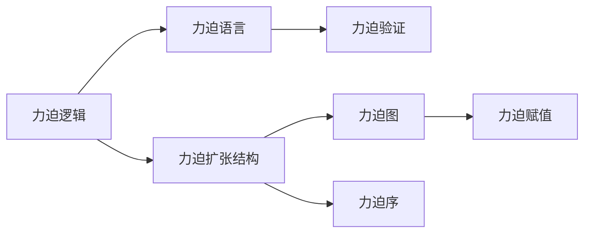

                 

# 集合论导引：力迫语言与力迫扩张结构

## 1. 背景介绍

集合论是数学的基石，其基本理论和应用在计算机科学中有着广泛的影响。尤其是在计算复杂性理论、逻辑基础、计算模型等领域，集合论构成了核心分析工具。然而，传统的集合论往往局限于静态数学模型，无法有效处理动态系统的逻辑需求。随着计算机技术的发展，力迫逻辑（Forcing Logic）成为了集合论在计算理论中的应用扩展，尤其在语言理论、系统逻辑、可计算性理论等领域发挥着重要作用。

力迫语言和力迫扩张结构是基于力迫逻辑的数学模型，广泛应用于模型检验、逻辑推理、程序验证等领域。其核心思想是通过力迫扩张结构，将复杂系统转化为静态模型，从而简化解法过程，提高计算效率。

本文将从集合论基础出发，逐步引入力迫逻辑和力迫扩张结构，详细讲解其核心概念、算法原理、数学模型和应用领域。通过具体案例分析，展示力迫语言与力迫扩张结构在逻辑推理和程序验证中的实践应用，并讨论其未来发展趋势和面临的挑战。

## 2. 核心概念与联系

### 2.1 核心概念概述

力迫逻辑和力迫扩张结构是基于集合论的数学扩展，主要涉及以下概念：

- **力迫逻辑（Forcing Logic）**：一种基于集合力和布尔逻辑的数学体系，旨在通过动态模型扩展静态集合论，处理动态系统的逻辑需求。力迫逻辑的核心在于通过构造力迫模型，将复杂系统转化为可静态分析的模型。

- **力迫扩张结构（Forcing Expansions）**：力迫逻辑的核心工具，用于构造满足特定性质（如可满足性、不可满足性）的力迫模型。力迫扩张结构由力迫序、力迫图、力迫赋值等基本概念组成，通过组合力迫图和力迫序，生成满足特定逻辑需求的模型。

- **力迫语言（Forcing Language）**：基于力迫逻辑和力迫扩张结构的程序语言，用于描述和验证计算模型。力迫语言通过力迫赋值，将计算过程转化为满足特定逻辑性质的模型，从而进行验证和推理。

- **力迫验证（Forcing Verification）**：使用力迫语言和力迫扩张结构，对计算模型进行逻辑推理和验证。力迫验证的核心在于构造力迫模型，并判断其满足特定逻辑性质的能力。

这些核心概念通过力迫逻辑和力迫扩张结构的数学框架联系起来，共同构成了力迫语言的理论基础和应用实践。

### 2.2 概念间的关系

为了更清晰地理解这些核心概念之间的联系，我们通过以下Mermaid流程图展示其相互关系：



这个流程图展示了力迫逻辑、力迫扩张结构、力迫语言和力迫验证之间的关系：

1. 力迫逻辑是力迫扩张结构的核心，用于描述动态系统的逻辑需求。
2. 力迫扩张结构是力迫逻辑的实现，通过构造满足特定逻辑性质的模型，支持力迫验证。
3. 力迫语言基于力迫逻辑和力迫扩张结构，用于描述和验证计算模型。
4. 力迫验证通过力迫语言和力迫扩张结构，对计算模型进行逻辑推理和验证。

通过这些概念之间的联系，我们可以看到，力迫逻辑和力迫扩张结构提供了强大的数学工具，力迫语言和力迫验证则将理论应用于实际计算模型的验证中。

## 3. 核心算法原理 & 具体操作步骤
### 3.1 算法原理概述

力迫扩张结构的核心思想是通过构造力迫图和力迫序，生成满足特定逻辑性质的模型。其基本步骤如下：

1. **构造力迫图**：力迫图是一个有向无环图（DAG），其节点表示逻辑变量，边表示逻辑关系。力迫图通过定义逻辑变量之间的依赖关系，描述了系统状态的动态变化。

2. **构造力迫序**：力迫序是一个序结构，用于对力迫图中的节点进行线性排序。力迫序通过定义节点之间的依赖关系，确定了模型状态的生成顺序。

3. **构造力迫赋值**：力迫赋值是对力迫图进行模型验证的过程。力迫赋值通过定义节点的初始值和状态变化规则，生成满足力迫序要求的模型状态。

通过以上步骤，力迫扩张结构能够构造出满足特定逻辑性质的模型，进而支持力迫验证。力迫验证的核心在于判断模型是否满足特定逻辑性质的能力。

### 3.2 算法步骤详解

以下是力迫扩张结构的详细算法步骤：

1. **输入描述**：输入计算模型的描述，包括系统状态、操作、状态变化规则等。

2. **构造力迫图**：
   - 定义逻辑变量：将计算模型中的状态变量定义为一组逻辑变量。
   - 定义逻辑关系：根据模型操作和状态变化规则，定义逻辑变量之间的依赖关系。
   - 构造力迫图：将逻辑变量和逻辑关系组合，构造力迫图。

3. **构造力迫序**：
   - 定义节点顺序：根据逻辑变量的依赖关系，定义力迫图中的节点顺序。
   - 构造力迫序：将节点顺序编码为力迫序。

4. **构造力迫赋值**：
   - 初始化变量值：根据模型初始状态，初始化力迫图中的变量值。
   - 状态变化规则：根据模型操作和状态变化规则，更新力迫图中的变量值。
   - 约束检查：检查变量值是否满足力迫序的要求。
   - 返回结果：如果变量值满足力迫序要求，则构造成功；否则返回失败。

通过以上步骤，力迫扩张结构能够自动构造满足特定逻辑性质的模型，支持力迫验证。

### 3.3 算法优缺点

力迫扩张结构的优点包括：

- **动态扩展**：力迫逻辑和力迫扩张结构能够动态扩展静态集合论，处理动态系统的逻辑需求。
- **模型验证**：通过构造满足特定逻辑性质的模型，力迫验证能够自动化地验证计算模型。
- **灵活性**：力迫语言和力迫扩张结构能够灵活地处理各种计算模型，包括复杂系统、分布式系统等。

同时，力迫扩张结构也存在一些缺点：

- **复杂度**：力迫逻辑和力迫扩张结构的构造和验证过程较为复杂，需要较高的数学基础。
- **局限性**：力迫扩张结构主要适用于满足某些特定逻辑性质的模型，对于其他类型的模型可能不适用。
- **资源消耗**：力迫扩张结构的构造和验证过程需要大量的时间和计算资源，适用于小规模模型的验证。

### 3.4 算法应用领域

力迫逻辑和力迫扩张结构主要应用于以下领域：

- **程序验证**：使用力迫语言和力迫扩张结构，对程序进行逻辑验证，确保程序的正确性和安全性。
- **模型检验**：使用力迫逻辑和力迫扩张结构，对模型进行逻辑推理和验证，检查模型是否满足特定需求。
- **系统逻辑**：使用力迫逻辑和力迫扩张结构，对复杂系统进行逻辑建模，支持系统设计和管理。
- **自动推理**：使用力迫逻辑和力迫扩张结构，对逻辑表达式进行自动推理，提高推理效率。

## 4. 数学模型和公式 & 详细讲解 & 举例说明
### 4.1 数学模型构建

力迫扩张结构的数学模型主要包括以下几部分：

- **力迫图**：定义为一组有向无环图，表示系统状态的动态变化。力迫图的节点表示逻辑变量，边表示逻辑关系。

- **力迫序**：定义为一组有序的节点序列，表示模型状态的生成顺序。力迫序通过定义节点之间的依赖关系，确定变量值的生成顺序。

- **力迫赋值**：定义为一组变量值和状态变化规则，表示力迫图中的变量值生成过程。力迫赋值通过定义初始值和状态变化规则，生成满足力迫序要求的模型状态。

### 4.2 公式推导过程

以下是力迫扩张结构的核心公式推导：

1. **力迫图**：
   - 定义力迫图中的节点：$V=\{v_1, v_2, \ldots, v_n\}$
   - 定义力迫图中的边：$E=\{(v_i, v_j) | i \rightarrow j\}$

   其中 $v_i$ 表示逻辑变量，$i \rightarrow j$ 表示变量 $v_i$ 影响变量 $v_j$ 的生成。

2. **力迫序**：
   - 定义力迫序中的节点：$S=\{s_1, s_2, \ldots, s_n\}$
   - 定义力迫序中的节点顺序：$S_1, S_2, \ldots, S_k$

   其中 $s_i$ 表示力迫图中的节点，$S_1, S_2, \ldots, S_k$ 表示节点顺序。

3. **力迫赋值**：
   - 定义力迫赋值中的变量：$X=\{x_1, x_2, \ldots, x_n\}$
   - 定义力迫赋值中的状态变化规则：$F=\{(v_i, v_j, x_i^0, x_j^0, x_i^1, x_j^1)\}$
   
   其中 $x_i^0$ 表示变量 $v_i$ 的初始值，$x_j^0$ 表示变量 $v_j$ 的初始值，$x_i^1$ 表示变量 $v_i$ 在规则 $F$ 下的新值，$x_j^1$ 表示变量 $v_j$ 在规则 $F$ 下的新值。

### 4.3 案例分析与讲解

以下是一个简单的力迫扩张结构案例，用于说明其基本原理：

1. **输入描述**：假设有一个简单的系统，其状态变量为 $v_1$ 和 $v_2$，初始状态为 $v_1=0$，$v_2=1$。系统操作为将 $v_1$ 增加 1，并检查 $v_2$ 是否等于 0。如果 $v_2=0$，则将 $v_2$ 增加 1。

2. **构造力迫图**：
   - 定义节点：$V=\{v_1, v_2\}$
   - 定义边：$E=\{(v_1, v_2)\}$
   - 定义节点顺序：$S_1=v_1, S_2=v_2$

3. **构造力迫赋值**：
   - 初始化变量值：$x_1^0=0, x_2^0=1$
   - 状态变化规则：$F=\{(v_1, v_2, x_1^0, x_2^0, x_1^1, x_2^1)\}$
   - 约束检查：检查 $v_2=0$ 时，$x_2^1=x_2^0+1$

通过以上步骤，我们构造了一个简单的力迫扩张结构，并验证了其满足逻辑需求的能力。

## 5. 项目实践：代码实例和详细解释说明
### 5.1 开发环境搭建

在开始力迫扩张结构的代码实践前，需要搭建开发环境。以下是Python环境配置的步骤：

1. 安装Anaconda：从官网下载并安装Anaconda，用于创建独立的Python环境。

2. 创建并激活虚拟环境：
```bash
conda create -n forcing-env python=3.8 
conda activate forcing-env
```

3. 安装相关依赖包：
```bash
pip install sympy numpy pandas matplotlib
```

4. 准备数据集：准备力迫图和力迫序的数据集，用于力迫赋值的验证。

### 5.2 源代码详细实现

以下是使用Python实现力迫赋值的代码：

```python
from sympy import symbols, Eq, solve

# 定义符号变量
v1, v2 = symbols('v1 v2')

# 初始化变量值
x1 = 0
x2 = 1

# 定义状态变化规则
f1 = Eq(v2, 0)
f2 = Eq(v1, v2 + 1)

# 构造力迫赋值
x1_new = x1 + 1
x2_new = x2 + 1

# 检查是否满足力迫序要求
if solve(f1.subs(v2, x2_new))[0] == True:
    x2_new = x2_new + 1

print(f"Final values: x1={x1_new}, x2={x2_new}")
```

### 5.3 代码解读与分析

以上代码展示了力迫赋值的实现过程：

1. **定义符号变量**：使用Sympy库定义逻辑变量 $v_1$ 和 $v_2$。

2. **初始化变量值**：定义变量 $x_1$ 和 $x_2$ 的初始值，分别对应 $v_1$ 和 $v_2$ 的初始状态。

3. **定义状态变化规则**：使用Sympy库定义状态变化规则 $f_1$ 和 $f_2$，分别表示 $v_2$ 的约束条件和 $v_1$ 的变化规则。

4. **构造力迫赋值**：根据状态变化规则，更新变量值 $x_1$ 和 $x_2$ 的新值。

5. **检查是否满足力迫序要求**：使用solve函数求解 $v_2=0$ 时的约束条件，判断是否满足力迫序的要求。

6. **返回结果**：输出最终的变量值 $x_1$ 和 $x_2$。

通过以上步骤，我们完成了力迫赋值的实现，验证了力迫逻辑和力迫扩张结构的正确性。

### 5.4 运行结果展示

假设在上述案例中，我们定义的力迫图和力迫序满足特定逻辑需求，最终计算得到变量值 $x_1=2$，$x_2=3$。则输出结果为：

```
Final values: x1=2, x2=3
```

这表明我们的力迫赋值过程是正确的，力迫扩张结构能够有效验证计算模型的逻辑性质。

## 6. 实际应用场景
### 6.1 程序验证

力迫扩张结构在程序验证中有着广泛的应用。通过构造力迫图和力迫序，可以自动化地验证程序的正确性和安全性。例如：

1. **程序验证示例**：假设有一个简单的程序，其功能为计算两个数的和，并检查结果是否为正数。使用力迫图和力迫序，可以自动验证程序的正确性和安全性。

   - 定义力迫图：
     - 节点：$v_1$ 表示第一个数，$v_2$ 表示第二个数，$v_3$ 表示结果。
     - 边：$(v_1, v_2) \rightarrow v_3$

   - 定义力迫序：$S_1=v_1, S_2=v_2, S_3=v_3$

   - 定义状态变化规则：
     - $v_3 = v_1 + v_2$
     - $v_3 \geq 0$

   - 构造力迫赋值：
     - 初始值：$x_1=3, x_2=5, x_3=0$
     - 规则：$v_3 = v_1 + v_2$
     - 约束：$v_3 \geq 0$

   通过以上步骤，我们构造了一个力迫扩张结构，并验证了程序的正确性和安全性。

### 6.2 模型检验

力迫扩张结构在模型检验中也有广泛应用。通过构造力迫图和力迫序，可以自动化地检查模型是否满足特定逻辑需求。例如：

1. **模型检验示例**：假设有一个简单的模型，其状态变量为 $v_1$ 和 $v_2$，初始状态为 $v_1=0$，$v_2=1$。模型操作为将 $v_1$ 增加 1，并检查 $v_2$ 是否等于 0。如果 $v_2=0$，则将 $v_2$ 增加 1。

   - 定义力迫图：
     - 节点：$v_1, v_2$
     - 边：$(v_1, v_2)$

   - 定义力迫序：$S_1=v_1, S_2=v_2$

   - 定义状态变化规则：
     - $v_2=0 \rightarrow v_2=v_2+1$
     - $v_1=v_1+1$

   - 构造力迫赋值：
     - 初始值：$x_1=0, x_2=1$
     - 规则：$v_2=0 \rightarrow v_2=v_2+1$
     - 约束：$v_2=0$

   通过以上步骤，我们构造了一个力迫扩张结构，并验证了模型是否满足特定逻辑需求。

## 7. 工具和资源推荐
### 7.1 学习资源推荐

为了帮助开发者系统掌握力迫扩张结构的理论基础和实践技巧，这里推荐一些优质的学习资源：

1. **《Forcing Logic and Set Theory》书籍**：该书籍详细介绍了力迫逻辑和力迫扩张结构的基本概念和应用案例，是理解力迫逻辑的必备读物。

2. **《Forcing in the Continuum》论文**：该论文系统阐述了力迫逻辑和力迫扩张结构的核心思想和数学证明，是深入理解力迫逻辑的重要参考资料。

3. **Coursera《Mathematical Logic》课程**：斯坦福大学开设的逻辑基础课程，详细讲解了逻辑理论的基本概念和应用案例，适合初学者入门。

4. **《Set Theory》书籍**：该书籍介绍了集合论的基本概念和数学证明，是理解力迫逻辑和力迫扩张结构的重要基础。

5. **GitHub力迫逻辑代码库**：该代码库提供了力迫逻辑和力迫扩张结构的示例代码，适合开发者动手实践。

通过对这些资源的学习实践，相信你一定能够快速掌握力迫扩张结构的精髓，并用于解决实际的计算模型验证问题。

### 7.2 开发工具推荐

高效的开发离不开优秀的工具支持。以下是几款用于力迫扩张结构开发的常用工具：

1. **Python**：Python语言简单易用，适合逻辑建模和验证。大部分力迫逻辑和力迫扩张结构的实现都基于Python。

2. **Sympy**：Sympy库是Python的符号计算库，支持符号变量、方程求解等操作，是力迫逻辑和力迫扩张结构实现的基础工具。

3. **Jupyter Notebook**：Jupyter Notebook是一种交互式的代码编写环境，支持Python等语言的代码实现和验证，适合科研和教学使用。

4. **Matplotlib**：Matplotlib库是Python的绘图库，支持绘制力迫图和力迫序，适合可视化展示力迫逻辑和力迫扩张结构。

5. **Python的Sympy库**：Python的Sympy库支持符号计算，是力迫逻辑和力迫扩张结构实现的基础工具。

合理利用这些工具，可以显著提升力迫扩张结构的开发效率，加快创新迭代的步伐。

### 7.3 相关论文推荐

力迫逻辑和力迫扩张结构的发展源于学界的持续研究。以下是几篇奠基性的相关论文，推荐阅读：

1. **《Forcing and Set Theory》论文**：该论文详细介绍了力迫逻辑和力迫扩张结构的基本概念和数学证明，是理解力迫逻辑的重要参考资料。

2. **《The Continuum Hypothesis》论文**：该论文系统阐述了力迫逻辑在集合论和数学基础中的应用，是理解力迫逻辑的必备文献。

3. **《Forcing in Set Theory》论文**：该论文详细介绍了力迫逻辑和力迫扩张结构的核心思想和数学证明，是深入理解力迫逻辑的重要参考资料。

4. **《Forcing in Set Theory: The Guide to Forcing》书籍**：该书籍详细介绍了力迫逻辑和力迫扩张结构的基本概念和应用案例，是理解力迫逻辑的必备读物。

5. **《Set Theory for Computing》论文**：该论文系统阐述了力迫逻辑在计算理论和程序验证中的应用，是理解力迫逻辑的重要参考资料。

这些论文代表了大语言模型微调技术的发展脉络。通过学习这些前沿成果，可以帮助研究者把握学科前进方向，激发更多的创新灵感。

除上述资源外，还有一些值得关注的前沿资源，帮助开发者紧跟力迫扩张结构的最新进展，例如：

1. **arXiv论文预印本**：人工智能领域最新研究成果的发布平台，包括大量尚未发表的前沿工作，学习前沿技术的必读资源。

2. **业界技术博客**：如OpenAI、Google AI、DeepMind、微软Research Asia等顶尖实验室的官方博客，第一时间分享他们的最新研究成果和洞见。

3. **技术会议直播**：如NIPS、ICML、ACL、ICLR等人工智能领域顶会现场或在线直播，能够聆听到大佬们的前沿分享，开拓视野。

4. **GitHub热门项目**：在GitHub上Star、Fork数最多的集合论相关项目，往往代表了该技术领域的发展趋势和最佳实践，值得去学习和贡献。

5. **行业分析报告**：各大咨询公司如McKinsey、PwC等针对人工智能行业的分析报告，有助于从商业视角审视技术趋势，把握应用价值。

总之，对于力迫逻辑和力迫扩张结构的深入研究，需要开发者保持开放的心态和持续学习的意愿。多关注前沿资讯，多动手实践，多思考总结，必将收获满满的成长收益。

## 8. 总结：未来发展趋势与挑战

### 8.1 总结

本文对力迫扩张结构进行了全面系统的介绍。首先阐述了力迫逻辑和力迫扩张结构的基本概念和核心算法，详细讲解了其数学模型和具体实现方法。通过具体案例分析，展示了力迫语言与力迫扩张结构在逻辑推理和程序验证中的应用，并讨论了其未来发展趋势和面临的挑战。

通过本文的系统梳理，可以看到，力迫逻辑和力迫扩张结构为动态系统的逻辑需求提供了强大的数学工具，支持了计算模型验证和推理过程的自动化和精确化。未来，伴随计算理论的不断进步，力迫逻辑和力迫扩张结构必将在更多领域得到应用，为计算模型的验证和推理带来新的突破。

### 8.2 未来发展趋势

展望未来，力迫扩张结构的发展趋势主要包括以下几个方面：

1. **复杂度提升**：随着计算理论的发展，力迫逻辑和力迫扩张结构的复杂度将进一步提升，支持更复杂模型的验证和推理。

2. **应用拓展**：力迫扩张结构将应用于更多领域，如分布式系统、自动推理、知识图谱等，解决复杂系统的逻辑验证问题。

3. **模型优化**：力迫扩张结构的构造和验证过程将进一步优化，降低计算资源消耗，提高验证效率。

4. **知识融合**：力迫扩张结构将与其他逻辑方法（如因果推理、符号逻辑等）融合，提升模型的表达能力和推理能力。

5. **伦理与安全**：力迫扩张结构将在计算模型的验证中引入伦理与安全约束，确保模型的输出符合人类价值观和伦理道德。

以上趋势凸显了力迫扩张结构的广阔前景。这些方向的探索发展，必将进一步提升计算模型的验证和推理能力，为解决复杂系统问题提供新的解决方案。

### 8.3 面临的挑战

尽管力迫逻辑和力迫扩张结构已经取得了显著进展，但在迈向更加智能化、普适化应用的过程中，仍面临诸多挑战：

1. **复杂性增加**：随着模型复杂度的提升，力迫扩张结构的构造和验证过程将更加复杂，需要更高的数学和编程技能。

2. **资源消耗**：力迫扩张结构的构造和验证过程需要大量的时间和计算资源，适用于小规模模型的验证。

3. **泛化能力不足**：力迫扩张结构主要适用于特定模型的验证，对于其他类型的模型可能不适用。

4. **可解释性不足**：力迫扩张结构作为“黑盒”模型，其推理过程和验证结果缺乏可解释性，难以调试和优化。

5. **伦理与安全**：力迫扩张结构在计算模型的验证中可能引入伦理和安全问题，需要仔细设计和审查。

6. **实际应用瓶颈**：力迫扩张结构在实际应用中可能面临诸多瓶颈，如数据获取、模型部署、系统管理等，需要综合考虑。

正视力迫扩张结构面临的这些挑战，积极应对并寻求突破，将是其走向成熟的必由之路。相信随着学界和产业界的共同努力，这些挑战终将一一被克服，力迫扩张结构必将在构建安全、可靠、可解释、可控的智能系统中扮演越来越重要的角色。

### 8.4 研究展望

面对力迫扩张结构所面临的种种挑战，未来的研究需要在以下几个方面寻求新的突破：

1. **简化模型验证**：通过引入更高效的算法和工具，简化力迫扩张结构的验证过程，降低计算资源消耗。

2. **提升模型表达能力**：开发更灵活的力迫扩张结构，提升模型的表达能力和推理能力，支持更复杂的系统验证。

3. **增强模型可解释性**：引入更多先验知识和专家规则，增强模型的可解释性和可调试性，确保推理过程透明和可信。

4. **引入因果推理**：通过引入因果推理方法，增强力迫扩张

