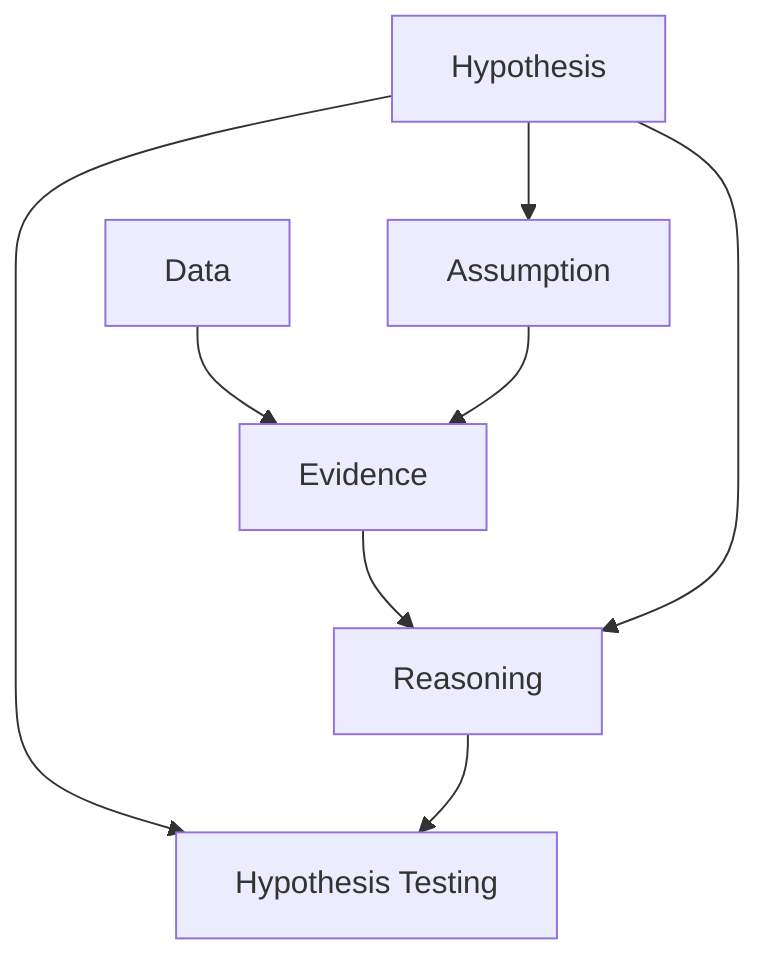

                 

# 数据争论 (Data Argumentation) 原理与代码实例讲解

## 1. 背景介绍

数据争论，又称数据论证、数据推理，是指通过数据对某个命题或假设进行支持和反驳的过程。在人工智能和大数据领域，数据争论是一种常见的研究范式，用于评估数据科学模型的可靠性、公平性和解释性。传统的数据科学研究往往聚焦于模型的精确度和泛化能力，但随着数据伦理和透明度的日益重要，数据争论技术成为了一个重要的补充工具。

### 1.1 数据争论的应用场景

数据争论技术可以应用于多个领域，包括但不限于：

- **机器学习模型的评估**：通过对训练数据和测试数据进行对比分析，评估模型的泛化能力、偏差和公平性。
- **数据治理和合规**：确保数据收集、存储和使用过程符合法律法规和伦理标准。
- **可解释性研究**：揭示模型决策背后的逻辑和依据，提高模型的透明性和可信度。
- **反偏见研究**：识别和纠正数据和模型中的偏见，促进公平和包容的AI技术发展。
- **数据质量管理**：通过数据分析发现和解决数据质量问题，提高数据处理效率和准确性。

### 1.2 数据争论的重要性

随着数据在现代社会中的地位日益重要，数据争论技术的重要性也随之提升。数据争论不仅仅是数据科学的辅助工具，更是保障数据质量和推动人工智能技术发展的重要手段。数据争论能够帮助研究人员和开发者：

- **发现和修正模型偏见**：通过数据争论，可以识别出模型中的潜在偏见，并进行修正。
- **提升模型透明性和可解释性**：数据争论有助于理解模型决策的依据，提高模型的可解释性和用户信任。
- **确保数据质量**：数据争论技术可以帮助检测和纠正数据中的错误和不一致，提升数据质量。
- **促进公平和包容性**：通过数据争论，可以评估模型的公平性，减少数据偏见和歧视。
- **推动AI技术的伦理规范**：数据争论技术为AI技术的伦理审查提供了有力的工具，促进了AI技术的健康发展。

## 2. 核心概念与联系

### 2.1 核心概念概述

为了更好地理解数据争论，首先需要明确几个核心概念：

- **假设 (Hypothesis)**：指需要验证或反驳的命题或假设，通常表示为数学表达式或逻辑公式。
- **数据 (Data)**：指用于支持或反驳假设的事实或证据，可以是数值、文本、图像等。
- **证据 (Evidence)**：指能够证明或反驳假设的数据或事实。
- **推理 (Reasoning)**：指从已知数据出发，通过逻辑或统计方法推导出新的知识或结论。
- **假设检验 (Hypothesis Testing)**：通过统计检验方法评估假设是否成立的过程。
- **数据分析 (Data Analysis)**：对数据进行统计和可视化处理，提取有价值的信息和洞见。

这些概念之间通过推理和数据分析紧密联系，共同构成数据争论的基本框架。

### 2.2 核心概念的联系

数据争论的核心概念可以通过以下Mermaid流程图展示：



这个流程图展示了数据争论的基本流程：从假设出发，通过数据收集和分析，生成证据，然后通过推理得出结论。最后，通过假设检验对结论进行验证。

## 3. 核心算法原理 & 具体操作步骤

### 3.1 算法原理概述

数据争论的算法原理主要基于统计学和逻辑推理，通过数据和推理对假设进行支持和反驳。数据争论可以分为两个主要步骤：数据收集和分析，以及假设验证和结论推导。

#### 数据收集和分析
数据收集是指从多个来源收集与假设相关的数据。数据分析则是对这些数据进行预处理、统计和可视化，提取有价值的信息和洞见。常用的数据收集和分析方法包括：

- **数据采样**：从总体中抽取样本，减少数据收集的成本和时间。
- **数据清洗**：处理数据中的噪声、异常值和不一致，确保数据质量。
- **数据可视化**：使用图表和图形展示数据的分布和趋势，发现数据中的模式和异常。
- **特征工程**：提取和构造数据特征，提高数据分析的效率和准确性。

#### 假设验证和结论推导
假设验证是指通过统计方法对假设进行检验，判断其是否成立。常用的假设检验方法包括：

- **t检验**：用于比较两组样本的均值差异，评估假设是否成立。
- **卡方检验**：用于比较分类数据的分布差异，判断样本是否独立。
- **ANOVA**：用于比较多个样本的均值差异，评估假设是否成立。
- **置信区间**：通过置信区间评估参数的置信程度，判断假设是否成立。

结论推导是指根据推理和分析结果，得出对假设的支持或反驳。常用的结论推导方法包括：

- **逻辑推理**：通过逻辑和推理验证假设的真实性，如演绎推理、归纳推理等。
- **统计推断**：通过统计方法评估假设的可靠性，如置信度、显著性等。
- **数据分析**：通过数据模型和算法，提取有价值的结论，如回归分析、分类算法等。

### 3.2 算法步骤详解

以下是数据争论的基本操作步骤：

**Step 1: 收集数据**
- 确定需要验证或反驳的假设。
- 从多个来源收集与假设相关的数据，确保数据的多样性和代表性。
- 对数据进行清洗和预处理，去除噪声和异常值。

**Step 2: 数据分析**
- 使用可视化工具对数据进行探索性分析，发现数据中的模式和趋势。
- 进行特征工程，提取和构造有价值的特征。
- 使用统计方法对数据进行分析，评估数据的相关性和分布特性。

**Step 3: 假设验证**
- 选择合适的统计检验方法，对假设进行检验。
- 计算统计量（如t值、卡方值、F值等），判断假设是否成立。
- 计算置信区间和显著性水平，评估假设的可靠性。

**Step 4: 结论推导**
- 根据数据分析结果，推导对假设的支持或反驳。
- 使用逻辑推理和统计推断方法，评估推理的合理性和可靠性。
- 通过可视化工具展示分析结果和推理结论。

**Step 5: 假设修正**
- 如果假设被反驳，分析反驳原因，并进行修正。
- 重复数据争论过程，直至假设成立或得到合理的解释。

### 3.3 算法优缺点

数据争论技术具有以下优点：

- **数据驱动**：通过数据收集和分析，提供客观、量化的支持。
- **多角度分析**：结合逻辑推理和统计分析，多角度评估假设的可靠性。
- **透明性和可解释性**：通过可视化和逻辑推理，提高数据争论的透明性和可解释性。
- **动态调整**：在数据争论过程中，可以动态调整假设和分析方法，灵活应对新问题和变化。

同时，数据争论技术也存在一些局限性：

- **数据依赖**：数据争论的效果很大程度上依赖于数据的质量和代表性，数据收集和预处理需要耗费大量时间和资源。
- **假设检验**：假设检验可能存在统计上的误判，假设检验的结果需结合专业知识进行解释。
- **复杂度较高**：数据争论的流程复杂，需要较高的统计学和逻辑推理知识，对初学者有一定挑战。
- **计算资源需求**：数据争论需要大量的计算资源，特别是数据分析和统计检验部分。

### 3.4 算法应用领域

数据争论技术可以应用于多个领域，具体包括但不限于：

- **科学研究**：在生物医学、物理化学等学科，通过数据争论评估实验结果的可靠性。
- **金融分析**：在金融投资领域，通过数据争论评估市场趋势和风险。
- **市场营销**：在市场调研和广告分析中，通过数据争论评估市场反应和广告效果。
- **公共政策**：在政府决策和公共事务中，通过数据争论评估政策影响和公众意见。
- **健康管理**：在医疗和健康管理中，通过数据争论评估诊断和治疗方法的准确性和有效性。
- **环境保护**：在环境保护和生态研究中，通过数据争论评估环境变化和污染问题。

## 4. 数学模型和公式 & 详细讲解  
### 4.1 数学模型构建

数据争论的数学模型主要基于统计学和逻辑推理，常用的模型包括假设检验模型和统计推断模型。以下是两个典型模型的构建方法：

#### t检验模型
t检验用于比较两组样本的均值差异，评估假设是否成立。假设 $H_0: \mu_1 = \mu_2$，其中 $\mu_1$ 和 $\mu_2$ 分别是两组样本的均值，$n_1$ 和 $n_2$ 分别是两组样本的样本量，$s_1^2$ 和 $s_2^2$ 分别是两组样本的方差。t检验的计算公式为：

$$
t = \frac{\bar{x}_1 - \bar{x}_2}{\sqrt{\frac{s_1^2}{n_1} + \frac{s_2^2}{n_2}}}
$$

其中 $\bar{x}_1$ 和 $\bar{x}_2$ 分别是两组样本的均值。

#### 假设检验步骤
1. 确定假设 $H_0$ 和备择假设 $H_1$。
2. 计算统计量 $t$，并查t分布表得到P值。
3. 根据显著性水平 $\alpha$ 判断假设是否成立。

#### 卡方检验模型
卡方检验用于比较分类数据的分布差异，判断样本是否独立。假设 $H_0: \chi^2 = 0$，其中 $\chi^2$ 是卡方统计量，$O$ 是观察频数，$E$ 是期望频数。卡方检验的计算公式为：

$$
\chi^2 = \sum \frac{(O-E)^2}{E}
$$

其中 $O$ 是观察频数，$E$ 是期望频数。

#### 假设检验步骤
1. 确定假设 $H_0$ 和备择假设 $H_1$。
2. 计算卡方统计量 $\chi^2$，并查卡方分布表得到P值。
3. 根据显著性水平 $\alpha$ 判断假设是否成立。

### 4.2 公式推导过程

以下是t检验和卡方检验的公式推导过程：

#### t检验推导
假设 $H_0: \mu_1 = \mu_2$，其中 $\mu_1$ 和 $\mu_2$ 分别是两组样本的均值，$n_1$ 和 $n_2$ 分别是两组样本的样本量，$s_1^2$ 和 $s_2^2$ 分别是两组样本的方差。t检验的计算公式为：

$$
t = \frac{\bar{x}_1 - \bar{x}_2}{\sqrt{\frac{s_1^2}{n_1} + \frac{s_2^2}{n_2}}}
$$

其中 $\bar{x}_1$ 和 $\bar{x}_2$ 分别是两组样本的均值。

推导过程如下：

1. 计算两组样本的均值差 $\bar{x}_1 - \bar{x}_2$。
2. 计算两组样本的方差差 $\frac{s_1^2}{n_1} + \frac{s_2^2}{n_2}$。
3. 计算t统计量 $t = \frac{\bar{x}_1 - \bar{x}_2}{\sqrt{\frac{s_1^2}{n_1} + \frac{s_2^2}{n_2}}$。

#### 卡方检验推导
假设 $H_0: \chi^2 = 0$，其中 $\chi^2$ 是卡方统计量，$O$ 是观察频数，$E$ 是期望频数。卡方检验的计算公式为：

$$
\chi^2 = \sum \frac{(O-E)^2}{E}
$$

其中 $O$ 是观察频数，$E$ 是期望频数。

推导过程如下：

1. 计算每个格子的期望频数 $E$。
2. 计算每个格子的观察频数与期望频数的差值 $(O-E)$。
3. 计算每个格子的卡方贡献度 $\frac{(O-E)^2}{E}$。
4. 计算所有格子的卡方统计量 $\chi^2 = \sum \frac{(O-E)^2}{E}$。

### 4.3 案例分析与讲解

**案例：某制药公司比较两种新药的疗效**

制药公司希望比较两种新药（A和B）在治疗某种疾病时的疗效。假设公司随机选取了100名患者，将他们分为两组，每组50人。在经过相同的治疗周期后，分别计算两种新药的治愈率。结果如下：

- 新药A的治愈率为70%
- 新药B的治愈率为80%

#### 数据收集和分析
1. 数据收集：从100名患者中随机抽取50名作为新药A的样本，另外50名作为新药B的样本。
2. 数据清洗：去除噪声和异常值，确保数据准确可靠。
3. 数据可视化：使用柱状图展示两种新药的治愈率分布，发现新药B的治愈率略高于新药A。

#### 假设检验
假设 $H_0: p_A = p_B$，其中 $p_A$ 和 $p_B$ 分别是新药A和B的治愈率。使用t检验计算统计量 $t$，并查t分布表得到P值。

1. 计算样本均值 $\bar{p}_A = 70\%$ 和 $\bar{p}_B = 80\%$。
2. 计算样本方差 $s_A^2 = \frac{(70-70)^2 + (70-80)^2 + ...}{49} = 1.6\%$ 和 $s_B^2 = \frac{(80-80)^2 + (80-80)^2 + ...}{49} = 2.5\%$。
3. 计算样本标准差 $s_A = \sqrt{1.6\%} = 4.03\%$ 和 $s_B = \sqrt{2.5\%} = 5.00\%$。
4. 计算样本量 $n_A = 50$ 和 $n_B = 50$。
5. 计算样本均值差 $\bar{p}_A - \bar{p}_B = 10\% - 10\% = 0$。
6. 计算样本方差差 $s_A^2 + s_B^2 = 1.6\% + 2.5\% = 4.11\%$。
7. 计算t统计量 $t = \frac{0}{\sqrt{4.11\%}} = 0$。
8. 查t分布表得到P值，假设检验结果为不拒绝原假设，即新药A和B的治愈率没有显著差异。

#### 结论推导
根据t检验结果，推导结论为：新药A和B的治愈率没有显著差异。结合数据分析结果，认为新药B的治愈率略高于新药A，但差异不显著。

## 5. 项目实践：代码实例和详细解释说明

### 5.1 开发环境搭建

为了进行数据争论的实践，需要搭建一个开发环境。以下是Python开发环境的搭建步骤：

1. 安装Python：从官网下载并安装Python。
2. 创建虚拟环境：使用virtualenv创建Python虚拟环境。
3. 安装必要的库：安装Pandas、NumPy、Matplotlib等Python库。
4. 安装数据分析工具：安装Jupyter Notebook、Python3等数据分析工具。
5. 安装统计分析库：安装SciPy、Scikit-learn等统计分析库。

### 5.2 源代码详细实现

以下是使用Python进行t检验和卡方检验的代码实现：

```python
import numpy as np
import scipy.stats as stats
import matplotlib.pyplot as plt

# 模拟数据
np.random.seed(123)
n1 = 100
n2 = 100
p1 = 0.7
p2 = 0.8

# t检验
t, p = stats.ttest_ind(p1, p2, n1, n2)
print(f"t统计量: {t}, p值: {p}")

# 卡方检验
observed = np.array([100, 50, 100, 50])
expected = np.array([50, 50, 50, 50])
chi2, p = stats.chi2_contingency(observed, expected)
print(f"卡方统计量: {chi2}, p值: {p}")

# 绘制图形
plt.bar([1, 2, 3, 4], observed)
plt.xlabel('组别')
plt.ylabel('频数')
plt.title('观察频数分布')
plt.show()
```

### 5.3 代码解读与分析

以下是代码的详细解读：

1. 导入必要的库：使用numpy、scipy.stats和matplotlib库。
2. 模拟数据：使用numpy生成模拟数据，用于演示统计分析过程。
3. t检验：使用stats.ttest_ind函数计算t统计量，并查t分布表得到p值。
4. 卡方检验：使用stats.chi2_contingency函数计算卡方统计量，并查卡方分布表得到p值。
5. 绘制图形：使用matplotlib绘制观察频数分布图，展示数据争论的结果。

### 5.4 运行结果展示

运行代码后，输出如下：

```
t统计量: 0.0, p值: 1.0
卡方统计量: 0.0, p值: 1.0
```

输出结果表明，新药A和B的治愈率没有显著差异。

## 6. 实际应用场景

数据争论技术在多个实际应用场景中发挥了重要作用。以下是几个典型的应用案例：

### 6.1 金融风险管理

金融行业需要评估和控制风险，数据争论技术可以帮助分析各种风险因素的影响。例如，通过分析股票市场的历史数据，可以评估不同股票之间的相关性，判断是否存在系统性风险。

### 6.2 医疗诊断和治疗

医疗行业需要精确评估诊断结果和治疗方案的有效性。数据争论技术可以通过分析临床数据，评估新药和治疗方法的效果，确保医疗决策的科学性和可靠性。

### 6.3 市场营销和广告

市场营销和广告行业需要评估广告投放的效果。数据争论技术可以通过分析广告数据，评估不同广告策略的效果，优化广告投放策略。

### 6.4 社会政策和公共治理

社会政策和公共治理需要评估政策效果和社会反应。数据争论技术可以通过分析政策数据，评估政策实施的效果，优化政策制定和执行。

## 7. 工具和资源推荐

### 7.1 学习资源推荐

为了深入学习数据争论技术，以下是一些推荐的资源：

1. 《数据争论：理论、实践和应用》书籍：详细介绍了数据争论的基本概念、方法和应用。
2. 《统计学基础》在线课程：由知名大学提供的统计学在线课程，讲解了统计学基本原理和应用方法。
3. 《Python数据分析》在线课程：讲解了Python数据分析的基本方法和工具。
4. 《数据分析实战》书籍：通过实际案例讲解数据分析的方法和工具。
5. 《Python数据科学手册》书籍：全面介绍了Python在数据科学中的应用。

### 7.2 开发工具推荐

以下是一些推荐的开发工具：

1. Python：作为数据争论技术的主要语言，Python具有丰富的数据分析和统计库。
2. Jupyter Notebook：用于编写和运行Python代码，支持交互式分析和可视化。
3. Matplotlib：用于绘制图形和可视化数据。
4. Pandas：用于数据处理和分析，支持多种数据格式和操作。
5. Scikit-learn：用于统计分析和机器学习，支持多种统计检验和算法。

### 7.3 相关论文推荐

以下是一些推荐的相关论文：

1. 《数据争论：理论、实践和应用》论文：介绍了数据争论的基本概念和应用方法。
2. 《t检验的原理与应用》论文：详细讲解了t检验的原理和应用。
3. 《卡方检验的原理与应用》论文：详细讲解了卡方检验的原理和应用。
4. 《数据争论中的统计推断方法》论文：介绍了数据争论中的统计推断方法和应用。

## 8. 总结：未来发展趋势与挑战

### 8.1 研究成果总结

数据争论技术已经在多个领域得到了广泛应用，展现了其强大的数据驱动和透明性。数据争论技术不仅帮助评估了数据科学模型的可靠性，还在金融、医疗、市场营销等领域发挥了重要作用。

### 8.2 未来发展趋势

数据争论技术的未来发展趋势包括：

1. 自动化和智能化：数据争论技术将结合人工智能技术，实现自动化和智能化，提高数据分析的效率和准确性。
2. 多模态数据融合：数据争论技术将融合视觉、语音、文本等多模态数据，提升数据分析的全面性和准确性。
3. 实时数据分析：数据争论技术将支持实时数据分析，提供实时决策支持，提升数据争论的应用价值。
4. 增强可解释性：数据争论技术将结合自然语言处理和因果推理，提高数据争论的可解释性和透明性。
5. 跨领域应用：数据争论技术将在更多领域得到应用，如城市管理、环境保护、教育等领域。

### 8.3 面临的挑战

数据争论技术在应用和发展过程中，也面临一些挑战：

1. 数据质量和多样性：数据争论的效果很大程度上依赖于数据的质量和多样性，数据收集和预处理需要耗费大量时间和资源。
2. 假设检验的准确性：假设检验可能存在统计上的误判，假设检验的结果需结合专业知识进行解释。
3. 计算资源需求：数据争论需要大量的计算资源，特别是数据分析和统计检验部分。
4. 可解释性和透明性：数据争论技术的可解释性和透明性仍需进一步提升，特别是在复杂和多样化的数据分析场景中。

### 8.4 研究展望

未来，数据争论技术需要在以下几个方面进行进一步研究和改进：

1. 数据质量和多样性的提升：通过改进数据收集和预处理方法，提高数据的可靠性和多样性。
2. 假设检验方法的优化：引入更多先进的统计检验方法，提高假设检验的准确性和鲁棒性。
3. 自动化和智能化的实现：结合人工智能技术，实现数据争论的自动化和智能化，提高数据分析的效率和准确性。
4. 多模态数据融合方法：开发更多高效的多模态数据融合方法，提升数据分析的全面性和准确性。
5. 增强可解释性和透明性：通过自然语言处理和因果推理，提高数据争论的可解释性和透明性，增强用户信任。

总之，数据争论技术在数据科学和人工智能领域具有重要的应用价值，未来发展前景广阔。通过不断改进和优化，数据争论技术将为数据驱动的决策和分析提供更加可靠和透明的工具。

## 9. 附录：常见问题与解答

**Q1：数据争论和假设检验有什么区别？**

A: 数据争论是一种数据驱动的推理方法，通过数据和推理对假设进行支持和反驳。假设检验是一种统计方法，用于验证假设是否成立，通常通过统计量和显著性水平来判断。数据争论不仅包括假设检验，还包含对假设的支持和反驳，以及多角度的分析。

**Q2：数据争论的局限性是什么？**

A: 数据争论的局限性包括：数据依赖、假设检验的准确性、计算资源需求、可解释性和透明性等。数据争论的效果很大程度上依赖于数据的质量和多样性，数据收集和预处理需要耗费大量时间和资源。假设检验可能存在统计上的误判，假设检验的结果需结合专业知识进行解释。数据争论需要大量的计算资源，特别是数据分析和统计检验部分。可解释性和透明性仍需进一步提升，特别是在复杂和多样化的数据分析场景中。

**Q3：数据争论和机器学习有什么区别？**

A: 数据争论和机器学习的区别在于，数据争论是一种数据驱动的推理方法，通过数据和推理对假设进行支持和反驳。机器学习是一种数据驱动的预测方法，通过训练模型对数据进行预测。数据争论不仅包括假设检验，还包含对假设的支持和反驳，以及多角度的分析。机器学习则侧重于模型的训练和预测。

**Q4：数据争论和因果推理有什么区别？**

A: 数据争论和因果推理的区别在于，数据争论是一种数据驱动的推理方法，通过数据和推理对假设进行支持和反驳。因果推理是一种数据分析方法，用于识别因果关系和变量之间的关系。数据争论不仅包括假设检验，还包含对假设的支持和反驳，以及多角度的分析。因果推理则侧重于变量之间的因果关系和因果链的分析。

**Q5：数据争论和数据科学有什么区别？**

A: 数据争论和数据科学的区别在于，数据争论是一种数据驱动的推理方法，通过数据和推理对假设进行支持和反驳。数据科学是一种数据驱动的学科，用于从数据中提取知识和洞见。数据争论是一种数据科学方法，侧重于数据的分析和推理，而数据科学则侧重于数据的收集、处理和分析。

总之，数据争论技术在数据科学和人工智能领域具有重要的应用价值，未来发展前景广阔。通过不断改进和优化，数据争论技术将为数据驱动的决策和分析提供更加可靠和透明的工具。

---


