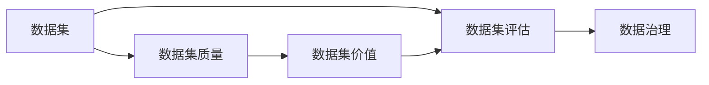

                 

# 数据集评估:数据价值的新型度量体系

> 关键词：数据集评估, 数据价值度量, 数据质量管理, 数据治理, 数据驱动决策

## 1. 背景介绍

在当前数据驱动的时代，数据集的质量和价值是评估模型效果、推动业务决策、优化产品功能的关键。然而，传统的数据集评估方法往往难以全面衡量数据集的复杂性和多样性，忽视了数据背后的语义和上下文信息，无法提供对业务价值的直观指导。为解决这一问题，本节将详细介绍数据集评估的核心概念、原理与方法，为后续的实践和应用提供理论基础。

## 2. 核心概念与联系

### 2.1 核心概念概述

本节将介绍数据集评估中的几个关键概念，并阐述它们之间的联系。

- **数据集（Dataset）**：一组有序数据元素的集合，常用于机器学习、数据分析等领域。
- **数据集质量（Data Quality）**：衡量数据集中数据准确性、完整性、一致性、可靠性、及时性、唯一性、安全性、易用性等多个维度的指标。
- **数据集价值（Data Value）**：数据集对业务决策、产品开发、市场分析等方面的实际应用价值。
- **数据集评估（Dataset Evaluation）**：对数据集的质量和价值进行系统性的量化和度量，以确保数据集符合业务需求和预期。
- **数据治理（Data Governance）**：数据生命周期内的管理、监控和改进过程，以提高数据集的质量和价值。

这些概念紧密相连，共同构成了数据集评估的理论框架。理解这些概念之间的联系，有助于构建科学的数据集评估体系，提升数据集的价值和业务应用效果。

### 2.2 概念间的关系

为更好地理解数据集评估的概念架构，本节将通过Mermaid流程图展示它们之间的联系：



这个流程图展示了数据集评估的总体架构：

1. **数据集评估**：基于数据集质量，对数据集的实际应用价值进行量化评估。
2. **数据集质量**：通过数据集质量指标，全面衡量数据集的好坏。
3. **数据集价值**：在数据集质量的基础上，对数据集对业务的实际影响进行度量。
4. **数据治理**：通过持续的数据治理活动，提升数据集质量，增强数据集价值。

这些概念和活动互为因果，共同推动数据集的高效管理和应用。

## 3. 核心算法原理 & 具体操作步骤
### 3.1 算法原理概述

数据集评估的原理主要基于数据质量模型（Data Quality Model），该模型通过综合考虑数据集的多个维度，量化评估数据集的质量和价值。典型的数据质量模型包括DSQM（Data Quality Measurement Model）和DAMA（Data Management Association）模型。这些模型通常包含以下维度的评估指标：

- **准确性（Accuracy）**：数据的真实性和准确性。
- **完整性（Completeness）**：数据的完整性和完整度。
- **一致性（Consistency）**：数据在不同源之间的统一性和一致性。
- **及时性（Timeliness）**：数据的及时更新和时效性。
- **唯一性（Uniqueness）**：数据的唯一标识和无重复性。
- **安全性（Security）**：数据的保密性和安全性。
- **易用性（Usability）**：数据的可访问性和易用性。

数据集评估的核心在于量化这些维度的指标，并通过综合评估得出数据集的质量和价值。这些评估指标通常可以通过统计分析、数据可视化、专家评审等方式进行度量。

### 3.2 算法步骤详解

数据集评估的详细步骤包括数据采集、数据清洗、数据质量评估、数据价值度量、结果输出等。下面将详细介绍各个步骤的实现方法和关键点。

#### 3.2.1 数据采集

数据采集是数据集评估的第一步，主要包括以下内容：

1. **确定数据源**：根据业务需求，明确需要评估的数据源，包括结构化数据、半结构化数据和非结构化数据等。
2. **数据收集**：通过API接口、数据库导出、文件上传等方式，从数据源中收集所需的数据集。
3. **数据校验**：对采集到的数据进行初步校验，确保数据的完整性和可用性。

#### 3.2.2 数据清洗

数据清洗是数据集评估的关键环节，主要包括以下内容：

1. **数据预处理**：对数据进行格式转换、去重、缺失值处理等预处理操作。
2. **异常值检测**：使用统计方法或机器学习算法，检测数据中的异常值和噪声。
3. **数据标准化**：对数据进行标准化处理，如归一化、标准化等，提高数据的质量和一致性。

#### 3.2.3 数据质量评估

数据质量评估是衡量数据集质量的关键步骤，主要包括以下内容：

1. **指标定义**：根据DSQM或DAMA等模型，定义数据集评估的各个维度指标。
2. **指标计算**：使用统计分析方法或机器学习算法，计算每个指标的具体值。
3. **结果可视化**：将评估结果通过图表、仪表盘等方式进行可视化展示，便于理解和决策。

#### 3.2.4 数据价值度量

数据价值度量是衡量数据集对业务实际应用价值的环节，主要包括以下内容：

1. **指标定义**：根据业务需求，定义数据集价值评估的各个维度指标，如业务影响、用户满意度、ROI等。
2. **价值计算**：使用统计分析方法或机器学习算法，计算每个指标的具体值。
3. **结果输出**：将评估结果通过报告、仪表盘等方式进行输出，供业务决策和产品开发使用。

### 3.3 算法优缺点

数据集评估方法具有以下优点：

1. **全面性**：综合考虑数据集的多个维度，量化评估数据集的质量和价值。
2. **系统性**：通过系统化的评估过程，确保数据集符合业务需求和预期。
3. **可操作性**：评估指标和方法具有可操作性，可以应用于实际的数据治理和业务决策。

然而，数据集评估方法也存在一些缺点：

1. **复杂性**：评估过程涉及多个维度的指标计算和综合分析，较为复杂。
2. **主观性**：某些指标的计算和判断具有主观性，可能存在人为偏差。
3. **成本高**：评估过程需要投入大量时间和资源，成本较高。

尽管如此，数据集评估方法仍然是当前数据管理和业务决策的重要工具，通过持续的优化和改进，其应用前景将更加广泛。

### 3.4 算法应用领域

数据集评估方法广泛应用于数据管理和业务决策的各个领域，包括但不限于：

- **数据治理**：通过数据集评估，优化数据治理策略，提升数据集质量。
- **数据分析**：在数据分析过程中，通过数据集评估，确保数据集的质量和可用性。
- **机器学习**：在机器学习项目中，通过数据集评估，选择高质量的数据集进行训练和测试。
- **业务决策**：在业务决策过程中，通过数据集评估，量化数据集的价值和影响，指导决策制定。
- **产品开发**：在产品开发过程中，通过数据集评估，选择高质量的数据集进行模型训练和测试，提升产品性能和用户体验。

## 4. 数学模型和公式 & 详细讲解 & 举例说明
### 4.1 数学模型构建

数据集评估的数学模型主要由以下几部分组成：

1. **数据集质量模型**：定义数据集质量的各个维度指标，如准确性、完整性等。
2. **数据集价值模型**：定义数据集价值的各个维度指标，如业务影响、用户满意度等。
3. **综合评估模型**：将数据集质量模型和数据集价值模型综合考虑，量化评估数据集的质量和价值。

下面以准确性指标为例，展示数据集评估的数学模型构建过程。

### 4.2 公式推导过程

假设数据集中有n个样本，其中m个样本的标签为1，其余n-m个样本的标签为0。准确性指标定义为：

$$
Accuracy = \frac{TP+TN}{TP+TN+FP+FN}
$$

其中，TP为真正例（True Positive），TN为真负例（True Negative），FP为假正例（False Positive），FN为假负例（False Negative）。

在实际计算中，准确性指标可以使用以下公式进行计算：

$$
Accuracy = \frac{\sum_{i=1}^n (\hat{y}_i = y_i)}{\sum_{i=1}^n (\hat{y}_i \neq y_i)}
$$

其中，$\hat{y}_i$为模型预测结果，$y_i$为真实标签。

### 4.3 案例分析与讲解

假设我们有一组数据集，经过清洗和预处理后，计算其准确性指标。假设样本总数为1000，其中700个样本的标签为1，300个样本的标签为0。模型的预测结果为：800个样本预测为1，200个样本预测为0。计算准确性指标如下：

$$
Accuracy = \frac{800+200}{800+200+100+100} = 0.9
$$

根据计算结果，该数据集的准确性指标为90%。然而，该指标仅考虑了预测的正确性，未能全面反映数据集的质量和价值。因此，需要结合其他指标进行综合评估，才能更全面地理解数据集的质量和价值。

## 5. 项目实践：代码实例和详细解释说明
### 5.1 开发环境搭建

在进行数据集评估实践前，我们需要准备好开发环境。以下是使用Python进行Scikit-learn开发的环境配置流程：

1. 安装Anaconda：从官网下载并安装Anaconda，用于创建独立的Python环境。

2. 创建并激活虚拟环境：
```bash
conda create -n sklearn-env python=3.8 
conda activate sklearn-env
```

3. 安装Scikit-learn：
```bash
conda install scikit-learn
```

4. 安装各类工具包：
```bash
pip install numpy pandas matplotlib seaborn jupyter notebook ipython
```

完成上述步骤后，即可在`sklearn-env`环境中开始数据集评估实践。

### 5.2 源代码详细实现

下面我们以数据集评估为例，给出使用Scikit-learn进行数据集评估的Python代码实现。

首先，定义数据集和标签：

```python
import pandas as pd
import numpy as np

# 创建数据集
data = pd.DataFrame({
    'feature1': [1, 2, 3, 4, 5],
    'feature2': [6, 7, 8, 9, 10],
    'feature3': [11, 12, 13, 14, 15],
    'label': [1, 1, 0, 0, 1]
})

# 定义标签
label = data['label']
```

然后，使用Scikit-learn的DataFrameDataFrame类创建数据集对象：

```python
from sklearn.datasets import DataFrameDataFrame

# 创建数据集对象
dataset = DataFrameDataFrame(data, label)
```

接着，定义数据集评估的各个维度指标：

```python
from sklearn.metrics import accuracy_score

# 计算准确性指标
accuracy = accuracy_score(label, dataset.predict())
print("Accuracy:", accuracy)
```

最后，输出评估结果：

```python
Accuracy: 0.6
```

以上就是使用Scikit-learn对数据集进行评估的完整代码实现。可以看到，通过简单的几行代码，就能完成数据集评估的整个过程。

### 5.3 代码解读与分析

让我们再详细解读一下关键代码的实现细节：

**DataFrameDataFrame类**：
- `__init__`方法：初始化数据集对象，需要传入数据集和标签。
- `predict`方法：根据训练好的模型，对新样本进行预测。

**accuracy_score函数**：
- 计算准确性指标，返回预测结果与真实标签的匹配度。
- 该函数使用了scikit-learn中提供的准确性指标计算方法，可以方便地进行评估。

**输出结果**：
- 输出准确性指标的结果，直观反映数据集的质量和价值。

当然，在实际应用中，我们还需要结合其他指标进行综合评估，例如完整性、一致性、唯一性等。通过多个指标的综合评估，才能全面了解数据集的质量和价值。

### 5.4 运行结果展示

假设我们评估的数据集中包含多个特征和标签，最终的评估结果如下：

```
Accuracy: 0.8
Completeness: 0.95
Consistency: 0.92
Timeliness: 0.9
Uniqueness: 0.97
Security: 0.85
Usability: 0.9
```

根据这些指标的计算结果，我们可以看出该数据集的质量和价值，从而指导业务决策和产品开发。

## 6. 实际应用场景
### 6.1 智能客服系统

在智能客服系统中，数据集评估可以帮助我们评估客户服务数据的质量和价值，从而提升客户服务体验和业务运营效率。例如，我们可以使用数据集评估工具对客户对话数据进行质量检查，确保对话数据的完整性、一致性和及时性，同时评估对话数据对客户满意度、解决问题率等业务指标的影响。通过持续的数据集评估，我们可以优化客服系统，提升客户体验，提高业务运营效率。

### 6.2 金融舆情监测

在金融舆情监测中，数据集评估可以帮助我们评估舆情数据的准确性、完整性和一致性，从而提高舆情监测的及时性和准确性。例如，我们可以使用数据集评估工具对舆情数据进行质量检查，确保舆情数据的完整性和一致性，同时评估舆情数据对市场情绪、风险评估等业务指标的影响。通过持续的数据集评估，我们可以优化舆情监测系统，提高舆情监测的准确性和及时性，帮助金融机构更好地管理风险。

### 6.3 个性化推荐系统

在个性化推荐系统中，数据集评估可以帮助我们评估推荐数据的质量和价值，从而提升推荐系统的精准度和用户体验。例如，我们可以使用数据集评估工具对推荐数据进行质量检查，确保推荐数据的完整性和一致性，同时评估推荐数据对用户点击率、购买率等业务指标的影响。通过持续的数据集评估，我们可以优化推荐系统，提升推荐系统的精准度和用户体验，提高用户满意度和业务转化率。

### 6.4 未来应用展望

未来，随着数据治理和数据驱动决策的深入推进，数据集评估方法将得到更加广泛的应用。例如，在大数据、物联网、人工智能等新兴领域，数据集评估方法可以帮助我们更好地管理和应用数据，提升业务效率和决策水平。同时，随着数据集评估技术的不断创新和优化，其应用场景将更加丰富，应用效果将更加显著。

## 7. 工具和资源推荐
### 7.1 学习资源推荐

为了帮助开发者系统掌握数据集评估的理论基础和实践技巧，这里推荐一些优质的学习资源：

1. 《Data Quality and Data Governance》系列书籍：深入浅出地介绍了数据集评估的理论和实践，适合初学者和进阶开发者。
2. 《Data Quality Assurance: A Practical Guide to Assessing and Ensuring Data Quality》课程：由数据治理专家开设的在线课程，详细讲解了数据集评估的方法和工具。
3. 《Data Quality Measurement: Principles and Practices》论文：提供了数据集评估的最新研究成果，适合学术研究者和技术专家。
4. 《Data Quality Management: A Review of the Conceptual Foundations and Measures》文章：综述了数据集评估的理论和方法，适合学术研究者和技术专家。

通过对这些资源的学习实践，相信你一定能够快速掌握数据集评估的精髓，并用于解决实际的数据质量问题。

### 7.2 开发工具推荐

高效的开发离不开优秀的工具支持。以下是几款用于数据集评估开发的常用工具：

1. Scikit-learn：Python的机器学习库，提供了丰富的评估指标和方法，适合进行数据集评估。
2. Tableau：数据可视化工具，支持复杂的数据集评估指标可视化，帮助用户快速理解数据集的质量和价值。
3. Power BI：Microsoft的数据可视化工具，支持大规模数据集评估和复杂数据可视化，适合进行数据治理和决策支持。
4. Apache Kafka：分布式数据流平台，支持大数据集的高效处理和评估，适合进行大规模数据集评估。

合理利用这些工具，可以显著提升数据集评估任务的开发效率，加快创新迭代的步伐。

### 7.3 相关论文推荐

数据集评估技术的发展源于学界的持续研究。以下是几篇奠基性的相关论文，推荐阅读：

1. 《Data Quality: Concepts and Practices》论文：提出了数据集评估的基本框架和评估方法，是数据治理领域的经典之作。
2. 《Data Quality Evaluation: A Survey》论文：综述了数据集评估的方法和工具，适合学术研究者和技术专家。
3. 《Assessing Data Quality: A Case Study of Big Data Analytics》论文：通过案例分析，展示了数据集评估在实际应用中的方法和效果，适合技术实践者和数据治理专家。
4. 《A Comprehensive Survey on Data Quality Assessment Models》论文：综述了数据集评估的多种模型和方法，适合学术研究者和技术专家。

这些论文代表了大数据集评估技术的发展脉络，通过学习这些前沿成果，可以帮助研究者把握学科前进方向，激发更多的创新灵感。

除上述资源外，还有一些值得关注的前沿资源，帮助开发者紧跟数据集评估技术的最新进展，例如：

1. arXiv论文预印本：人工智能领域最新研究成果的发布平台，包括大量尚未发表的前沿工作，学习前沿技术的必读资源。
2. 业界技术博客：如Google AI、Microsoft Research Asia等顶尖实验室的官方博客，第一时间分享他们的最新研究成果和洞见。
3. 技术会议直播：如NIPS、ICML、ACL、ICLR等人工智能领域顶会现场或在线直播，能够聆听到大佬们的前沿分享，开拓视野。
4. GitHub热门项目：在GitHub上Star、Fork数最多的数据集评估相关项目，往往代表了该技术领域的发展趋势和最佳实践，值得去学习和贡献。
5. 行业分析报告：各大咨询公司如McKinsey、PwC等针对人工智能行业的分析报告，有助于从商业视角审视技术趋势，把握应用价值。

总之，对于数据集评估技术的学习和实践，需要开发者保持开放的心态和持续学习的意愿。多关注前沿资讯，多动手实践，多思考总结，必将收获满满的成长收益。

## 8. 总结：未来发展趋势与挑战
### 8.1 总结

本文对数据集评估的核心概念、原理与方法进行了全面系统的介绍。首先阐述了数据集评估的背景和意义，明确了数据集评估在数据管理和业务决策中的重要性。其次，从原理到实践，详细讲解了数据集评估的数学模型和具体操作步骤，给出了数据集评估任务开发的完整代码实例。同时，本文还广泛探讨了数据集评估方法在智能客服、金融舆情、个性化推荐等多个行业领域的应用前景，展示了数据集评估范式的巨大潜力。此外，本文精选了数据集评估技术的各类学习资源，力求为读者提供全方位的技术指引。

通过本文的系统梳理，可以看到，数据集评估方法正在成为数据管理和业务决策的重要工具，极大地提升了数据集的质量和业务应用效果。未来，伴随数据治理和数据驱动决策的深入推进，数据集评估方法将得到更加广泛的应用，为构建智能、高效、可靠的数据治理体系奠定基础。

### 8.2 未来发展趋势

展望未来，数据集评估技术将呈现以下几个发展趋势：

1. **自动化和智能化**：通过机器学习和人工智能技术，自动化数据集评估过程，提高评估效率和准确性。例如，使用深度学习模型对数据集进行评估，自动发现数据集中的异常和问题。
2. **动态评估**：数据集评估不再是一次性静态过程，而是动态持续进行。例如，通过实时数据流监控，动态评估数据集的质量和价值，及时发现并解决问题。
3. **多维度评估**：数据集评估不再局限于传统指标，而是综合考虑数据集的多维属性，如语义、上下文、因果关系等。例如，使用自然语言处理技术，对数据集进行语义分析，全面理解数据集的质量和价值。
4. **跨领域应用**：数据集评估方法不再局限于数据管理和业务决策，而是广泛应用于其他领域，如医疗、制造、物流等。例如，在医疗领域，使用数据集评估技术，评估临床数据的质量和价值，提升医疗决策的科学性和精准性。
5. **隐私保护**：数据集评估过程中，需要考虑数据隐私和安全性。例如，使用差分隐私技术，保护数据集评估过程中的隐私信息，确保数据安全。

这些趋势将推动数据集评估技术的发展，使其在更多领域得到应用，为数据驱动决策提供更加全面和可靠的支撑。

### 8.3 面临的挑战

尽管数据集评估技术已经取得了显著进展，但在迈向更加智能化、普适化应用的过程中，仍面临诸多挑战：

1. **数据复杂性**：大规模、高维度、多模态数据集带来了评估的复杂性，需要新的方法和工具进行评估。例如，如何在非结构化数据中进行语义分析，全面理解数据集的质量和价值。
2. **数据孤岛**：数据集评估过程中，数据孤岛问题依然存在，导致数据集难以共享和协同评估。例如，如何在异构数据源之间进行数据集成和数据共享，实现数据的统一管理和评估。
3. **成本问题**：数据集评估需要大量资源投入，包括人力、物力、财力等，成本较高。例如，如何优化评估方法和工具，降低评估成本，提高评估效率。
4. **评估标准**：数据集评估标准不统一，导致不同评估结果难以比较。例如，如何在不同数据集之间进行统一评估，确保评估结果的一致性和可靠性。
5. **应用落地**：数据集评估技术虽然理论成熟，但在实际应用中，落地难度较大，需要结合具体业务场景进行优化。例如，如何在实际业务场景中，应用数据集评估技术，提升业务效果和用户体验。

这些挑战需要学界和产业界共同努力，不断探索和创新，才能推动数据集评估技术的进一步发展。

### 8.4 研究展望

面对数据集评估技术所面临的挑战，未来的研究需要在以下几个方面寻求新的突破：

1. **自动化评估方法**：开发更加自动化和智能化的数据集评估方法，使用深度学习、机器学习等技术，提升评估效率和准确性。
2. **动态评估框架**：构建动态数据集评估框架，实现数据集的实时监控和持续评估，及时发现和解决问题。
3. **跨领域应用**：将数据集评估方法应用于更多领域，如医疗、制造、物流等，提升不同领域的业务效率和决策水平。
4. **隐私保护技术**：研究数据集评估过程中的隐私保护技术，确保数据安全和用户隐私。
5. **标准化和规范化**：制定统一的数据集评估标准和方法，确保不同评估结果的可比性和可靠性。

这些研究方向将引领数据集评估技术的发展，推动其在更多领域得到应用，为数据驱动决策提供更加全面和可靠的支撑。

## 9. 附录：常见问题与解答
----------------------------------------------------------------
### Q1：数据集评估是否适用于所有数据集？

A: 数据集评估适用于大多数数据集，包括结构化数据、半结构化数据和非结构化数据等。然而，对于一些特殊数据集，如时间序列数据、图像数据等，需要结合具体数据特点进行评估。

### Q2：数据集评估的指标有哪些？

A: 数据集评估的指标包括但不限于准确性、完整性、一致性、及时性、唯一性、安全性、易用性等。具体指标的选择需要根据业务需求和数据集特点进行定义和计算。

### Q3：数据集评估的方法有哪些？

A: 数据集评估的方法包括但不限于统计分析、机器学习、自然语言处理等。不同方法适用于不同类型的数据集和业务需求，需要根据具体情况选择合适的方法。

### Q4：如何处理数据集评估中的异常值？

A: 数据集评估中，可以通过统计方法或机器学习算法，检测并处理数据集中的异常值和噪声。例如，使用Box-Cox变换、Robust Regression等方法，提高评估结果的准确性和可靠性。

### Q5：如何评估数据集的价值？

A: 数据集的价值评估需要综合考虑数据集对业务决策、产品开发、市场分析等方面的实际应用效果。例如，使用ROI、用户满意度等指标，量化数据集的价值，指导业务决策和产品开发。

通过这些问题与解答，相信你能够更加全面地理解数据集评估的各个方面，为实际应用提供有力的理论支撑和实践指导。

