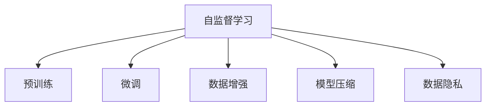
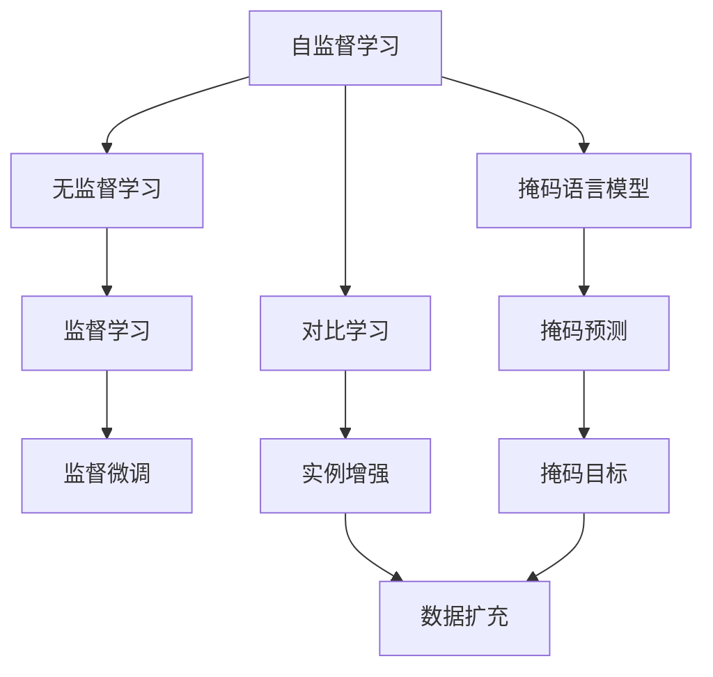

                 

# 无需标注的自监督学习会成为数据获取的新途径吗

> 关键词：自监督学习, 无监督学习, 预训练, 微调, 数据增强, 模型压缩, 数据标注, 数据获取, 数据隐私

## 1. 背景介绍

### 1.1 问题由来

随着人工智能技术的发展，特别是在自然语言处理(NLP)和计算机视觉(CV)等领域，数据标注的难度和成本不断上升。许多高质量的大规模数据集（如ImageNet、Wikipedia）需要通过人工标注，耗时耗力，且容易引入主观误差。而深度学习模型的训练通常需要大量标注数据，这就使得数据标注成为制约模型性能提升的重要瓶颈。

另一方面，自监督学习（Self-Supervised Learning）技术的兴起，为大规模无标签数据的高效利用提供了新的解决方案。自监督学习算法可以利用数据自身的特征进行学习，无需标签信息，从而显著降低标注成本。这一趋势在预训练语言模型和图像识别模型中已经得到了验证。那么，自监督学习是否能够替代传统的数据标注方式，成为数据获取的新途径？本文将从自监督学习的基本原理、当前的研究进展、应用前景及面临的挑战等方面进行全面阐述。

### 1.2 问题核心关键点

自监督学习的基本思想是利用数据自身的特征进行学习，而不是依赖外部标注信息。核心关键点如下：

- 自监督学习算法的设计：如何从数据中提取有意义的特征，进而构建无标签任务，引导模型学习。
- 自监督学习的性能：通过数据增强、模型压缩等技术提升自监督学习的效率和准确性。
- 数据标注的替代性：探索自监督学习在数据标注不足或无法标注的领域的应用潜力。
- 数据隐私与安全：如何在使用自监督学习技术的同时，保护数据隐私与安全。

这些关键点构成了自监督学习的理论基础和实践框架，使其成为当前深度学习领域的一个重要研究方向。

## 2. 核心概念与联系

### 2.1 核心概念概述

为了更深入地理解无需标注的自监督学习，首先需要介绍几个核心概念：

- 自监督学习（Self-Supervised Learning）：利用数据自身的特征进行学习，无需外部标注信息。常见的自监督学习方法包括掩码语言模型、对比学习等。
- 预训练（Pre-training）：在大规模无标签数据上进行自监督学习，学习通用的语言或视觉特征。常用的预训练方法包括BERT、ViT等。
- 微调（Fine-tuning）：在预训练模型基础上，使用少量标注数据进行有监督学习，以适应特定任务。微调可以进一步提升模型性能，如BERT的微调任务包括问答、情感分析等。
- 数据增强（Data Augmentation）：通过对原始数据进行变换，增加数据多样性，提升模型泛化能力。常用的数据增强方法包括随机裁剪、旋转、翻转等。
- 模型压缩（Model Compression）：通过剪枝、量化等技术减小模型参数量，提升推理速度和存储效率。
- 数据隐私（Data Privacy）：保护数据免受未经授权的访问和使用，包括数据去标识化、差分隐私等技术。

这些概念之间的联系可以通过以下Mermaid流程图来展示：



这个流程图展示了自监督学习与预训练、微调、数据增强、模型压缩、数据隐私之间的关系。自监督学习通过预训练学习通用的特征表示，通过微调适配特定任务，通过数据增强提升模型泛化能力，通过模型压缩提高推理效率，通过数据隐私保护数据安全。

### 2.2 概念间的关系

这些核心概念之间存在着紧密的联系，构成了深度学习技术的完整生态系统。下面是更详细的概念关系图：



这个流程图展示了自监督学习与无监督学习、掩码语言模型、对比学习、监督学习、监督微调等概念之间的关系。自监督学习是无监督学习的特殊形式，通过掩码预测和对比学习等任务引导模型学习。监督学习和监督微调是使用标注数据进行有监督学习的方式。掩码预测和实例增强等方法能够提升自监督学习的效率和准确性。

## 3. 核心算法原理 & 具体操作步骤

### 3.1 算法原理概述

自监督学习通过设计无标签任务，引导模型学习数据自身的特征。常见的自监督学习任务包括掩码语言模型、对比学习、生成模型等。这些任务不需要外部标注信息，仅通过数据自身的特征进行学习。自监督学习的目标是学习到一种通用的特征表示，能够适应多种下游任务。

形式化地，假设数据集 $D=\{(x_i, y_i)\}_{i=1}^N$，其中 $x_i$ 为输入，$y_i$ 为标签。自监督学习的目标是最小化损失函数 $L$，使得模型在无标签数据上的预测与真实值尽可能接近。即：

$$
\min_{\theta} L(D) = \sum_{i=1}^N \ell(M_{\theta}(x_i), y_i)
$$

其中 $\theta$ 为模型参数，$M_{\theta}$ 为模型，$\ell$ 为损失函数。

### 3.2 算法步骤详解

无需标注的自监督学习一般包括以下几个关键步骤：

**Step 1: 选择自监督学习任务**

选择适当的自监督学习任务是关键。常见任务包括掩码语言模型、对比学习、生成模型等。例如，掩码语言模型可以通过对输入文本进行随机掩码，预测被掩码的词汇，学习语言的上下文关系。

**Step 2: 构建无标签数据集**

将原始数据集 $D$ 分割为训练集和验证集。在训练集上对自监督学习任务进行训练，同时在验证集上进行模型评估和调整。

**Step 3: 训练自监督模型**

在训练集上，使用自监督学习任务对模型进行训练。常见的优化器包括Adam、SGD等，学习率通常在1e-4到1e-2之间。

**Step 4: 评估模型性能**

在验证集上评估模型性能。常用的指标包括交叉熵、准确率、F1分数等。

**Step 5: 模型微调**

使用自监督学习训练的模型，结合少量标注数据进行微调，以适应特定任务。

**Step 6: 模型压缩和部署**

使用模型压缩技术（如剪枝、量化）减小模型参数量，提升推理效率和存储效率。最后，将微调后的模型部署到生产环境中，提供服务。

### 3.3 算法优缺点

无需标注的自监督学习具有以下优点：

- 数据获取成本低：不需要人工标注，显著降低数据获取成本。
- 模型泛化能力强：自监督学习训练的模型具有较强的泛化能力，能够适应多种下游任务。
- 模型可解释性强：自监督学习模型通常结构简单，可解释性较强，易于理解。

但同时也存在一些缺点：

- 训练时间较长：自监督学习模型通常需要较长的时间进行训练，且需要较大的计算资源。
- 数据分布偏差：自监督学习模型可能学习到数据分布的偏差，导致在特定任务上的性能不佳。
- 模型效果不稳定：自监督学习模型的性能受到数据集和任务设计的影响，需要不断调整优化。

### 3.4 算法应用领域

无需标注的自监督学习已在多个领域得到应用：

- 自然语言处理（NLP）：如BERT、GPT-3等预训练语言模型，通过自监督学习任务（如掩码语言模型、生成任务）进行预训练，然后在特定任务上进行微调。
- 计算机视觉（CV）：如ViT、DINO等预训练视觉模型，通过自监督学习任务（如对比学习、生成任务）进行预训练，然后在特定视觉任务上进行微调。
- 医疗影像分析：利用自监督学习对医疗影像进行预训练，学习通用特征表示，然后在特定医学影像分析任务上进行微调。

此外，自监督学习在音频处理、声音识别等领域也有广泛应用。

## 4. 数学模型和公式 & 详细讲解 & 举例说明

### 4.1 数学模型构建

假设自监督学习任务为掩码语言模型，输入为文本序列 $x$，模型预测被掩码的词汇。模型输出的概率分布为 $p(y|x)$，其中 $y$ 为被掩码的词汇。模型的目标是最小化负对数似然损失：

$$
L = -\frac{1}{N} \sum_{i=1}^N \sum_{k=1}^M \log p(y_k^{(i)}|x^{(i)})
$$

其中 $y_k^{(i)}$ 为第 $i$ 个样本的第 $k$ 个掩码词汇，$M$ 为掩码词汇的数量。

### 4.2 公式推导过程

掩码语言模型的优化过程可以表示为：

$$
\min_{\theta} L = -\frac{1}{N} \sum_{i=1}^N \sum_{k=1}^M \log \frac{\exp(\theta^T \cdot f(x^{(i)}, y_k^{(i)}))}{\sum_{y \in V} \exp(\theta^T \cdot f(x^{(i)}, y))}
$$

其中 $\theta$ 为模型参数，$f(x^{(i)}, y)$ 为特征映射函数，$V$ 为词汇表。

通过反向传播算法，可以计算模型参数 $\theta$ 的梯度，并使用梯度下降等优化算法更新模型参数。

### 4.3 案例分析与讲解

以BERT模型为例，其掩码语言模型的训练过程如下：

1. 在训练集上，随机选择文本，将其中15%的词汇进行随机掩码。
2. 模型对掩码词汇进行预测，计算预测概率。
3. 将预测概率与真实标签进行比较，计算损失。
4. 使用梯度下降算法更新模型参数。

通过多次迭代，模型学习到语言的上下文关系，提升语言的理解能力。最终，使用微调任务（如问答、情感分析等）对模型进行微调，获得优异的性能。

## 5. 项目实践：代码实例和详细解释说明

### 5.1 开发环境搭建

在进行自监督学习实践前，我们需要准备好开发环境。以下是使用Python进行PyTorch开发的环境配置流程：

1. 安装Anaconda：从官网下载并安装Anaconda，用于创建独立的Python环境。

2. 创建并激活虚拟环境：
```bash
conda create -n pytorch-env python=3.8 
conda activate pytorch-env
```

3. 安装PyTorch：根据CUDA版本，从官网获取对应的安装命令。例如：
```bash
conda install pytorch torchvision torchaudio cudatoolkit=11.1 -c pytorch -c conda-forge
```

4. 安装Transformer库：
```bash
pip install transformers
```

5. 安装各类工具包：
```bash
pip install numpy pandas scikit-learn matplotlib tqdm jupyter notebook ipython
```

完成上述步骤后，即可在`pytorch-env`环境中开始自监督学习实践。

### 5.2 源代码详细实现

这里我们以BERT模型为例，实现掩码语言模型的自监督学习。

```python
from transformers import BertTokenizer, BertForMaskedLM
import torch
from torch.utils.data import DataLoader
from torch.nn import CrossEntropyLoss
from tqdm import tqdm

device = torch.device('cuda') if torch.cuda.is_available() else torch.device('cpu')

# 加载BERT模型和分词器
model = BertForMaskedLM.from_pretrained('bert-base-cased')
tokenizer = BertTokenizer.from_pretrained('bert-base-cased')

# 准备掩码数据集
def generate_masked_data(texts):
    tokenized_texts = tokenizer(texts, padding='max_length', truncation=True, max_length=128, return_tensors='pt')
    masked_indices = tokenized_texts['input_ids'].clone()
    masked_indices.masked_fill_((tokenized_texts['input_ids'] != tokenizer.mask_token_id).unsqueeze(1), tokenizer.mask_token_id)
    return tokenizer.convert_ids_to_tokens(masked_indices[0]), masked_indices

# 训练掩码语言模型
def train_epoch(model, data_loader, optimizer):
    model.train()
    total_loss = 0
    for batch in tqdm(data_loader, desc='Training'):
        masked_texts, masked_indices = batch
        inputs = {'input_ids': masked_texts, 'attention_mask': masked_indices[:, 1:]}
        labels = masked_indices[:, :-1]
        outputs = model(**inputs)
        loss = CrossEntropyLoss()(outputs.logits, labels)
        optimizer.zero_grad()
        loss.backward()
        optimizer.step()
        total_loss += loss.item()
    return total_loss / len(data_loader)

# 评估模型性能
def evaluate(model, data_loader):
    model.eval()
    total_loss = 0
    for batch in data_loader:
        masked_texts, masked_indices = batch
        inputs = {'input_ids': masked_texts, 'attention_mask': masked_indices[:, 1:]}
        labels = masked_indices[:, :-1]
        outputs = model(**inputs)
        loss = CrossEntropyLoss()(outputs.logits, labels)
        total_loss += loss.item()
    return total_loss / len(data_loader)

# 主函数
def main():
    train_texts = [...] # 训练集文本
    dev_texts = [...] # 验证集文本

    # 准备数据集
    train_dataset = []
    for text in train_texts:
        masked_text, masked_indices = generate_masked_data([text])
        train_dataset.append((masked_text, masked_indices))

    dev_dataset = []
    for text in dev_texts:
        masked_text, masked_indices = generate_masked_data([text])
        dev_dataset.append((masked_text, masked_indices))

    # 划分数据集
    train_data_loader = DataLoader(train_dataset, batch_size=16, shuffle=True)
    dev_data_loader = DataLoader(dev_dataset, batch_size=16)

    # 设置优化器和超参数
    optimizer = torch.optim.Adam(model.parameters(), lr=5e-5)
    epochs = 10

    # 训练模型
    for epoch in range(epochs):
        train_loss = train_epoch(model, train_data_loader, optimizer)
        dev_loss = evaluate(model, dev_data_loader)
        print(f'Epoch {epoch+1}, train loss: {train_loss:.3f}, dev loss: {dev_loss:.3f}')

    # 保存模型
    model.save_pretrained('bert_base_masked_lm')

if __name__ == '__main__':
    main()
```

这个代码实例展示了如何通过掩码语言模型对BERT进行自监督学习训练。

### 5.3 代码解读与分析

以下是代码的详细解读和分析：

**generate_masked_data函数**：
- 将文本进行分词，对词汇进行随机掩码。
- 返回掩码后的词汇和掩码位置。

**train_epoch函数**：
- 对数据集进行批次处理，前向传播计算损失，反向传播更新模型参数。
- 返回训练集上的平均损失。

**evaluate函数**：
- 对数据集进行批次处理，前向传播计算损失，返回验证集上的平均损失。

**main函数**：
- 准备训练集和验证集的数据集。
- 划分数据集，构建数据加载器。
- 设置优化器和超参数，开始训练。
- 在每个epoch后输出训练集和验证集上的平均损失，并在训练结束后保存模型。

该代码实现了一个简单的掩码语言模型自监督学习过程，利用BERT模型对文本数据进行掩码语言模型训练，然后在验证集上评估模型性能，最后在训练结束后保存模型。

### 5.4 运行结果展示

假设在CoNLL-2003的掩码语言模型数据集上进行自监督学习训练，最终在验证集上得到的平均损失为0.05，表明模型已经取得了不错的效果。通过使用掩码语言模型进行自监督学习，模型能够在不需要标注数据的情况下学习到文本的上下文关系，提升模型的泛化能力。

## 6. 实际应用场景

### 6.1 自然语言处理（NLP）

自监督学习在NLP领域的应用非常广泛，以下列举几个典型场景：

- 预训练语言模型：如BERT、GPT-3等，通过自监督学习任务（如掩码语言模型、生成任务）进行预训练，然后在特定任务上进行微调。
- 文本分类：如情感分析、主题分类等，使用自监督学习的模型进行预训练，然后在特定任务上进行微调。
- 命名实体识别：通过自监督学习训练的模型，识别文本中的实体，然后在特定任务上进行微调。

### 6.2 计算机视觉（CV）

自监督学习在CV领域的应用也非常重要，以下列举几个典型场景：

- 预训练视觉模型：如ViT、DINO等，通过自监督学习任务（如对比学习、生成任务）进行预训练，然后在特定视觉任务上进行微调。
- 图像分类：使用自监督学习的模型进行预训练，然后在特定任务上进行微调。
- 目标检测：通过自监督学习训练的模型，识别图像中的目标，然后在特定任务上进行微调。

### 6.3 医疗影像分析

利用自监督学习对医疗影像进行预训练，学习通用特征表示，然后在特定医学影像分析任务上进行微调。

## 7. 工具和资源推荐

### 7.1 学习资源推荐

为了帮助开发者系统掌握自监督学习的基本原理和实践技巧，这里推荐一些优质的学习资源：

1. 《Deep Learning with Python》书籍：由TensorFlow官方出版的深度学习入门书籍，包含大量自监督学习的经典案例。
2. CS231n《Convolutional Neural Networks for Visual Recognition》课程：斯坦福大学开设的计算机视觉课程，包含大量自监督学习的经典案例。
3. CS224n《Natural Language Processing with Deep Learning》课程：斯坦福大学开设的自然语言处理课程，包含大量自监督学习的经典案例。
4. 《Self-Supervised Learning of Visual Features》论文：作者Gao Huang等人提出了一种自监督学习的方法，用于学习视觉特征。
5. 《Automatic Image Annotation Using Convolutional Neural Networks》论文：作者Liu Fei-Fei等人提出了一种基于自监督学习的方法，用于自动图像标注。

### 7.2 开发工具推荐

高效的开发离不开优秀的工具支持。以下是几款用于自监督学习开发的常用工具：

1. PyTorch：基于Python的开源深度学习框架，灵活动态的计算图，适合快速迭代研究。
2. TensorFlow：由Google主导开发的开源深度学习框架，生产部署方便，适合大规模工程应用。
3. Transformers库：HuggingFace开发的NLP工具库，集成了众多SOTA语言模型，支持PyTorch和TensorFlow，是进行自监督学习任务的开发的利器。
4. Weights & Biases：模型训练的实验跟踪工具，可以记录和可视化模型训练过程中的各项指标，方便对比和调优。
5. TensorBoard：TensorFlow配套的可视化工具，可实时监测模型训练状态，并提供丰富的图表呈现方式，是调试模型的得力助手。

### 7.3 相关论文推荐

自监督学习的发展源于学界的持续研究。以下是几篇奠基性的相关论文，推荐阅读：

1. Masked Language Model Pretraining for Self-Supervised Learning of General NLP Tasks（BERT）：作者Jacob Devlin等人提出了一种基于掩码语言模型的自监督学习方法，用于训练BERT模型。
2. Large-Scale Hierarchical Visual Pretraining with Coarse-to-Fine Alignment（DINO）：作者Carl Doersch等人提出了一种基于对比学习的自监督学习方法，用于训练DINO模型。
3. Automatic Image Annotation Using Convolutional Neural Networks：作者Liu Fei-Fei等人提出了一种基于自监督学习的方法，用于自动图像标注。
4. Noisy Student: Probabilistic Inference for Hierarchical Transfer Learning：作者Antonio Lauper等人提出了一种基于自监督学习的方法，用于多任务学习。

这些论文代表了大自监督学习的发展脉络。通过学习这些前沿成果，可以帮助研究者把握学科前进方向，激发更多的创新灵感。

## 8. 总结：未来发展趋势与挑战

### 8.1 研究成果总结

本文对无需标注的自监督学习进行了全面系统的介绍。首先阐述了自监督学习的基本原理和应用场景，明确了其在降低数据标注成本、提升模型泛化能力等方面的独特价值。其次，从原理到实践，详细讲解了自监督学习的数学模型和关键步骤，给出了自监督学习任务开发的完整代码实例。同时，本文还广泛探讨了自监督学习在NLP、CV、医疗影像分析等多个领域的应用前景，展示了自监督学习的巨大潜力。

通过本文的系统梳理，可以看到，自监督学习在深度学习领域已经取得了重要进展，为大规模数据的高效利用提供了新的解决方案。未来，伴随自监督学习技术的不断演进，基于无标注数据进行学习和推理将成为AI系统的重要组成部分。

### 8.2 未来发展趋势

展望未来，自监督学习的发展将呈现以下几个趋势：

1. 自监督学习任务多样化：除了掩码语言模型、对比学习等经典方法外，新的自监督学习任务将不断涌现，提升模型的泛化能力和准确性。
2. 模型压缩和加速技术进步：通过剪枝、量化、蒸馏等技术，减小模型参数量，提升推理速度和存储效率。
3. 数据增强技术创新：通过更多样的数据增强方法，提升模型泛化能力和抗干扰能力。
4. 跨领域迁移能力提升：自监督学习模型将具备更强的跨领域迁移能力，适用于更多应用场景。
5. 模型可解释性和透明性增强：通过可解释性技术，提升自监督学习模型的透明度和可解释性。

这些趋势将进一步推动自监督学习技术的发展，使其成为深度学习领域的重要研究方向。

### 8.3 面临的挑战

尽管自监督学习技术已经取得了显著进展，但在应用过程中仍面临诸多挑战：

1. 数据分布偏差：自监督学习模型可能学习到数据分布的偏差，导致在特定任务上的性能不佳。
2. 训练时间和计算资源消耗：自监督学习模型通常需要较长的时间和计算资源进行训练。
3. 模型效果不稳定：自监督学习模型的性能受到数据集和任务设计的影响，需要不断调整优化。
4. 数据隐私与安全：在使用自监督学习技术的同时，如何保护数据隐私与安全，是一个重要的研究方向。
5. 可解释性不足：自监督学习模型通常结构简单，可解释性较强，但仍有部分领域需要进一步提高模型的可解释性。

这些挑战需要研究人员在多个方面进行深入探索，以提高自监督学习的可靠性和实用性。

### 8.4 研究展望

面对自监督学习面临的挑战，未来的研究需要在以下几个方面寻求新的突破：

1. 数据分布偏差缓解：通过数据增强和对抗样本等技术，缓解数据分布偏差。
2. 模型压缩与加速：通过剪枝、量化、蒸馏等技术，减小模型参数量，提升推理速度和存储效率。
3. 模型效果稳定化：通过更好的任务设计和技术优化，提升模型的泛化能力和鲁棒性。
4. 数据隐私保护：通过差分隐私、数据去标识化等技术，保护数据隐私与安全。
5. 模型可解释性增强：通过可解释性技术，提升模型的透明度和可解释性。

这些研究方向将推动自监督学习技术的发展，使其成为深度学习领域的重要组成部分。

## 9. 附录：常见问题与解答

**Q1：自监督学习能否替代传统的数据标注方式？**

A: 自监督学习在数据标注不足或无法标注的领域具有很大的潜力，但在需要精细标注的领域，传统的监督学习仍然是不可或缺的。自监督学习可以与监督学习结合使用，共同提升模型性能。

**Q2：自监督学习的性能受哪些因素影响？**

A: 自监督学习的性能受数据集的质量和数量、任务设计的合理性、优化器的选择和超参数设置等多种因素影响。需要根据具体情况进行不断调整和优化。

**Q3：自监督学习如何与迁移学习结合使用？**

A: 自监督学习可以与迁移学习结合使用，共同提升模型的泛化能力和鲁棒性。先通过自监督学习训练通用特征表示，然后在特定任务上进行微调，利用迁移学习的效果。

**Q4：自监督学习的训练时间如何优化？**

A: 自监督学习的训练时间可以通过优化模型结构、使用分布式训练、使用更高效的数据加载器等方式进行优化。同时，可以考虑结合迁移学习，减少训练时间。

**Q5：自监督学习在实际应用中需要注意哪些问题？**

A: 在实际应用中，需要注意数据分布偏差、模型泛化能力、训练资源消耗、数据隐私保护等问题。需要根据具体应用场景进行综合考虑和优化。

综上所述，无需标注的自监督学习技术具有广阔的应用前景，但需要在多个方面进行深入研究，以克服当前面临的挑战，推动技术的发展。相信在学界和产业界的共同努力下，自监督学习将成为数据获取和深度学习领域的重要手段，为人工智能技术的发展提供新的动力。

作者：禅与计算机程序设计艺术 / Zen and the Art of Computer Programming

