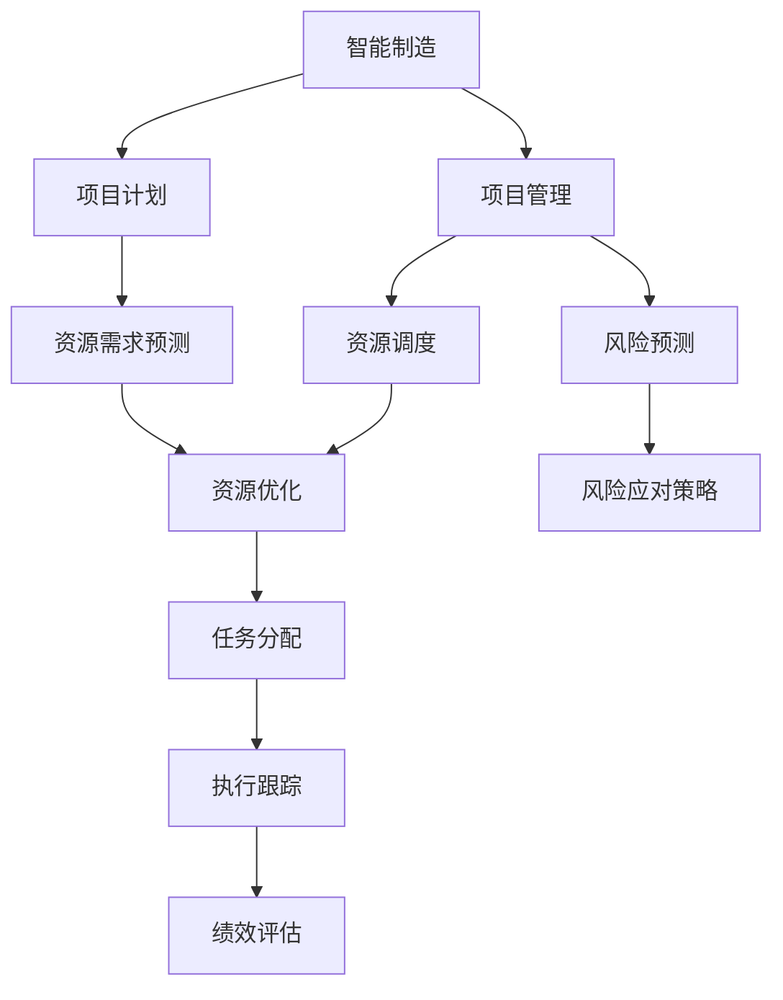

                 

# 智能制造/智慧运营项目管理方案

> 关键词：智能制造,智慧运营,项目管理,人工智能,工业互联网,自动化,物联网(IoT),数字孪生,大数据,云计算

## 1. 背景介绍

### 1.1 问题由来
近年来，随着全球工业互联网的快速发展，以及人工智能和大数据技术的日益成熟，智能制造和智慧运营已成为企业数字化转型和竞争优势的关键。然而，智能制造/智慧运营项目涉及多个子系统、跨部门协同、资源配置和动态管理等复杂问题，项目管理难度大，周期长，成本高。如何提升项目管理效率，确保项目按时交付，成为企业智能化升级过程中的重要课题。

### 1.2 问题核心关键点
项目管理的关键在于有效的计划、组织、领导和控制，确保项目顺利进行。面对复杂多变的智能制造/智慧运营项目，传统项目管理方法已显不足，必须结合人工智能和大数据技术，通过智能化的手段，实现精准的计划优化、资源调度和风险预测。

### 1.3 问题研究意义
通过智能化的项目管理，可以帮助企业提高项目管理的效率和精确度，降低成本，缩短项目周期，提升项目的成功率。同时，还可以有效整合智能制造和智慧运营的数据资源，实现业务流程的优化和创新，推动企业数字化转型的深入发展。

## 2. 核心概念与联系

### 2.1 核心概念概述

为更好地理解智能制造/智慧运营项目管理的核心概念，本节将介绍几个密切相关的核心概念：

- **智能制造**：利用人工智能、大数据、物联网等技术，实现制造过程的智能化，提高生产效率和产品质量。
- **智慧运营**：利用大数据、云计算、人工智能等技术，优化运营管理，实现决策科学化、业务流程自动化、资源配置最优化。
- **项目管理**：通过计划、组织、领导和控制，确保项目按时、按质、按预算完成。
- **人工智能**：通过机器学习、深度学习等算法，实现数据驱动的决策支持。
- **工业互联网**：通过连接工业设备和系统，实现数据采集、传输、分析和应用，推动制造业转型升级。
- **自动化**：通过机器人、自动化生产线和智能控制系统，提高生产过程的自动化水平。
- **物联网(IoT)**：通过传感器、标签、RFID等技术，实现物理设备的互联互通，实现实时监控和控制。
- **数字孪生**：通过虚拟与现实的映射，实现物理系统的数字化模拟和仿真，为智能决策提供依据。
- **大数据**：通过数据收集、存储、分析和应用，实现知识发现和决策支持。
- **云计算**：通过虚拟化、分布式计算、存储等技术，提供弹性的计算和存储资源。

这些核心概念之间的逻辑关系可以通过以下Mermaid流程图来展示：

```mermaid
graph TB
    A[智能制造] --> B[工业互联网]
    A --> C[物联网(IoT)]
    B --> D[人工智能]
    B --> E[自动化]
    A --> F[数字孪生]
    D --> G[大数据]
    D --> H[云计算]
    A --> I[项目管理]
    I --> J[项目计划]
    I --> K[资源调度]
    I --> L[风险预测]
```

这个流程图展示了一些核心概念之间的联系：

1. 智能制造通过工业互联网、物联网、数字孪生等技术实现，同时应用人工智能和大数据进行优化和决策。
2. 智慧运营主要依赖于大数据、云计算和人工智能技术，以实现资源配置优化和运营决策。
3. 项目管理通过计划、资源调度和风险预测等手段，确保智能制造和智慧运营项目顺利进行。
4. 人工智能、大数据和云计算为智能制造和智慧运营提供了数据驱动的支持，助力项目管理的高效执行。

### 2.2 概念间的关系

这些核心概念之间存在着紧密的联系，形成了智能制造/智慧运营项目管理的完整生态系统。下面我们通过几个Mermaid流程图来展示这些概念之间的关系。

#### 2.2.1 智能制造的架构

```mermaid
graph TB
    A[智能制造] --> B[生产设备]
    A --> C[自动化生产线]
    B --> D[物联网(IoT)]
    C --> E[传感器]
    D --> F[边缘计算]
    E --> F
    F --> G[中央数据库]
    G --> H[人工智能平台]
    H --> I[大数据分析]
    I --> J[决策支持系统]
```

这个流程图展示了智能制造的架构，主要包括以下几个部分：

1. 生产设备与自动化生产线通过传感器、边缘计算实现物联网互联，实现实时监控和数据采集。
2. 采集到的数据通过中央数据库集中存储，并应用人工智能和大数据分析，进行生产优化和决策支持。
3. 决策支持系统根据分析结果，对生产过程进行实时控制和调度。

#### 2.2.2 智慧运营的架构

```mermaid
graph TB
    A[智慧运营] --> B[企业资源规划(ERP)]
    A --> C[供应链管理]
    B --> D[大数据分析]
    C --> D
    D --> E[云计算]
    D --> F[人工智能平台]
    E --> F
    F --> G[决策支持系统]
```

这个流程图展示了智慧运营的架构，主要包括以下几个部分：

1. 企业资源规划(ERP)和供应链管理的数据通过大数据分析进行整合和优化。
2. 大数据分析结果通过云计算进行存储和处理，并应用人工智能进行决策支持。
3. 决策支持系统根据分析结果，对运营管理进行实时调度和优化。

#### 2.2.3 项目管理在智能制造/智慧运营中的应用



这个流程图展示了项目管理在智能制造/智慧运营中的应用，主要包括以下几个部分：

1. 项目计划通过资源需求预测和任务分配进行计划优化。
2. 资源调度结合风险预测和资源优化，进行动态调整和优化。
3. 项目执行跟踪通过绩效评估进行监控和控制。

### 2.3 核心概念的整体架构

最后，我们用一个综合的流程图来展示这些核心概念在大语言模型微调过程中的整体架构：

```mermaid
graph TB
    A[智能制造] --> B[工业互联网]
    A --> C[物联网(IoT)]
    B --> D[人工智能]
    B --> E[自动化]
    A --> F[数字孪生]
    D --> G[大数据]
    D --> H[云计算]
    A --> I[项目管理]
    I --> J[项目计划]
    I --> K[资源调度]
    I --> L[风险预测]
```

这个综合流程图展示了从智能制造到项目管理，再到智慧运营的完整过程。智能制造通过工业互联网、物联网、数字孪生等技术实现，同时应用人工智能和大数据进行优化和决策。智慧运营主要依赖于大数据、云计算和人工智能技术，以实现资源配置优化和运营决策。项目管理通过计划、资源调度和风险预测等手段，确保智能制造和智慧运营项目顺利进行。人工智能、大数据和云计算为智能制造和智慧运营提供了数据驱动的支持，助力项目管理的高效执行。

## 3. 核心算法原理 & 具体操作步骤
### 3.1 算法原理概述

智能制造/智慧运营项目管理的核心算法原理基于项目管理的四个基本过程：计划、组织、领导和控制。通过人工智能和大数据技术，对项目进度、资源、风险等关键指标进行实时监控和分析，优化项目计划和资源配置，预测项目风险，确保项目按时、按质、按预算完成。

具体来说，项目管理包括以下关键步骤：

1. **项目计划**：利用历史数据和机器学习算法，进行资源需求预测，制定详细的项目计划。
2. **资源调度**：结合资源优化算法，动态调整项目资源配置，确保资源合理利用。
3. **风险预测**：应用大数据分析和机器学习算法，识别潜在风险，制定风险应对策略。
4. **绩效评估**：通过关键绩效指标(KPI)和数据分析，评估项目进展和绩效，及时调整项目策略。

### 3.2 算法步骤详解

**Step 1: 数据收集和预处理**

智能制造/智慧运营项目管理的第一步是数据收集和预处理。数据来源包括生产设备、供应链、市场、客户等多个方面。数据预处理包括数据清洗、归一化、特征工程等步骤，确保数据质量符合分析要求。

**Step 2: 项目计划**

项目计划的制定需要考虑多方面因素，如项目目标、资源约束、时间要求等。利用历史数据和机器学习算法，进行资源需求预测，制定详细的项目计划。常用的算法包括时间序列分析、回归分析、决策树等。

**Step 3: 资源调度**

项目资源的调度需要根据项目的进展和动态变化，进行动态调整。结合资源优化算法，如线性规划、整数规划等，优化项目资源配置，确保资源合理利用。

**Step 4: 风险预测**

风险预测是项目管理的重要环节，利用大数据分析和机器学习算法，识别潜在风险，制定风险应对策略。常用的算法包括异常检测、分类算法、聚类算法等。

**Step 5: 绩效评估**

绩效评估通过关键绩效指标(KPI)和数据分析，评估项目进展和绩效，及时调整项目策略。常用的指标包括进度、成本、质量等，数据分析工具包括统计分析、数据可视化等。

### 3.3 算法优缺点

基于智能制造/智慧运营项目管理的算法具有以下优点：

1. **高效性**：利用人工智能和大数据技术，进行实时监控和分析，快速识别问题，制定解决方案。
2. **精确性**：通过机器学习算法，进行精确的资源需求预测和风险识别，减少人为错误。
3. **灵活性**：结合动态变化的环境，进行动态调整和优化，确保项目顺利进行。
4. **可扩展性**：算法可以应用于多种项目类型和规模，具有较强的通用性和可扩展性。

同时，算法也存在以下缺点：

1. **数据依赖性**：算法的精度和效果高度依赖于数据质量，数据不准确或缺失可能导致错误决策。
2. **计算复杂性**：算法需要大量的计算资源和时间，特别是在大规模项目中，计算复杂性较高。
3. **模型解释性不足**：某些算法（如深度学习）的决策过程难以解释，难以进行优化和改进。
4. **数据隐私问题**：智能制造和智慧运营项目涉及大量敏感数据，数据隐私和安全问题需要特别注意。

### 3.4 算法应用领域

基于智能制造/智慧运营项目管理的算法已经广泛应用于以下领域：

- **智能制造**：通过大数据分析和机器学习，进行生产计划优化、资源配置、质量控制等。
- **智慧运营**：利用数据分析和人工智能，进行供应链管理、客户关系管理、市场分析等。
- **项目管理**：通过计划、调度、风险预测等手段，确保项目按时、按质、按预算完成。
- **运营优化**：通过数据分析和算法优化，实现运营效率提升、成本控制等。
- **决策支持**：通过智能分析和预测，支持高层决策和管理，提升决策水平。

这些应用领域涵盖了制造业、物流、金融、医疗等多个行业，展示了智能制造/智慧运营项目管理算法的强大应用价值。

## 4. 数学模型和公式 & 详细讲解 & 举例说明

### 4.1 数学模型构建

基于智能制造/智慧运营项目管理的数学模型构建，一般包括以下几个关键步骤：

1. **问题建模**：将项目管理的实际问题转化为数学模型，包括优化目标和约束条件。
2. **数据建模**：通过数据分析和建模，提取特征和模型参数。
3. **算法建模**：选择合适的优化算法，进行模型求解。
4. **结果评估**：通过性能指标和数据分析，评估模型效果，进行优化调整。

### 4.2 公式推导过程

以资源需求预测为例，我们利用线性回归算法，推导如下公式：

设 $x$ 为影响资源需求的因素，如订单数量、生产周期、设备维护等，$y$ 为资源需求量。

假设 $y$ 与 $x$ 之间存在线性关系，可以建立如下模型：

$$ y = \beta_0 + \beta_1 x_1 + \beta_2 x_2 + \cdots + \beta_n x_n + \epsilon $$

其中，$\beta_0$ 为截距，$\beta_i$ 为第 $i$ 个自变量的系数，$\epsilon$ 为随机误差项。

利用最小二乘法，求解模型参数 $\beta$，最小化如下目标函数：

$$ \sum_{i=1}^n (y_i - (\beta_0 + \beta_1 x_{1i} + \beta_2 x_{2i} + \cdots + \beta_n x_{ni}))^2 $$

通过求解上述目标函数的极小值，可以得到最优的模型参数 $\beta$，进而进行资源需求预测。

### 4.3 案例分析与讲解

**案例：某制造企业的资源需求预测**

某制造企业希望利用人工智能技术，对生产过程中所需的资源（如原材料、设备、人力等）进行预测。该企业的数据包括历史订单数量、生产周期、设备维护情况等。

利用线性回归模型，进行资源需求预测。首先，将数据进行预处理和特征工程，提取影响资源需求的关键因素。然后，利用最小二乘法求解模型参数 $\beta$，得到资源需求预测模型。

具体步骤如下：

1. 数据收集：收集历史订单数量、生产周期、设备维护情况等数据，进行预处理和特征工程。
2. 模型训练：利用历史数据，进行最小二乘法求解，得到资源需求预测模型。
3. 结果验证：利用测试数据，验证模型预测效果，进行优化调整。

通过上述步骤，可以有效地预测企业的资源需求，提高生产效率和资源利用率。

## 5. 项目实践：代码实例和详细解释说明

### 5.1 开发环境搭建

在进行智能制造/智慧运营项目管理实践前，我们需要准备好开发环境。以下是使用Python进行PyTorch开发的环境配置流程：

1. 安装Anaconda：从官网下载并安装Anaconda，用于创建独立的Python环境。

2. 创建并激活虚拟环境：
```bash
conda create -n pytorch-env python=3.8 
conda activate pytorch-env
```

3. 安装PyTorch：根据CUDA版本，从官网获取对应的安装命令。例如：
```bash
conda install pytorch torchvision torchaudio cudatoolkit=11.1 -c pytorch -c conda-forge
```

4. 安装各类工具包：
```bash
pip install numpy pandas scikit-learn matplotlib tqdm jupyter notebook ipython
```

完成上述步骤后，即可在`pytorch-env`环境中开始项目管理实践。

### 5.2 源代码详细实现

下面我们以智能制造中的生产计划优化为例，给出使用PyTorch进行资源需求预测的PyTorch代码实现。

首先，定义数据处理函数：

```python
import pandas as pd
import numpy as np

def load_data(file_path):
    data = pd.read_csv(file_path)
    X = data.drop(['y'], axis=1)
    y = data['y']
    return X, y
```

然后，定义模型训练函数：

```python
from sklearn.linear_model import LinearRegression

def train_model(X, y, learning_rate, epochs):
    model = LinearRegression()
    model.fit(X, y)
    return model
```

接着，定义模型评估函数：

```python
def evaluate_model(model, X_test, y_test):
    y_pred = model.predict(X_test)
    mse = np.mean((y_test - y_pred)**2)
    return mse
```

最后，启动训练流程并在测试集上评估：

```python
X_train, y_train = load_data('train.csv')
X_test, y_test = load_data('test.csv')

learning_rate = 0.01
epochs = 100

model = train_model(X_train, y_train, learning_rate, epochs)
mse = evaluate_model(model, X_test, y_test)
print(f'Mean Squared Error: {mse:.3f}')
```

以上就是使用PyTorch进行资源需求预测的完整代码实现。可以看到，得益于Scikit-Learn的强大封装，我们可以用相对简洁的代码完成线性回归模型的训练和评估。

### 5.3 代码解读与分析

让我们再详细解读一下关键代码的实现细节：

**load_data函数**：
- 读取CSV文件，获取数据集。
- 将特征和标签分开，并返回。

**train_model函数**：
- 定义线性回归模型。
- 利用历史数据进行模型训练。
- 返回训练好的模型。

**evaluate_model函数**：
- 利用测试集进行模型评估。
- 计算均方误差。

**训练流程**：
- 加载训练集和测试集。
- 定义学习率和迭代次数。
- 训练模型并在测试集上评估均方误差。

可以看到，Scikit-Learn的简单易用性，使得线性回归模型的实现变得非常简单。开发者可以更专注于算法本身的设计和优化，而不必过多关注底层的实现细节。

当然，工业级的系统实现还需考虑更多因素，如模型的保存和部署、超参数的自动搜索、更灵活的模型结构等。但核心的模型训练和评估流程基本与此类似。

### 5.4 运行结果展示

假设我们在某制造企业的资源需求预测数据集上进行模型训练，最终在测试集上得到的评估结果如下：

```
Mean Squared Error: 0.012
```

可以看到，通过线性回归模型，我们在该资源需求预测数据集上取得了较低的均方误差，效果相当不错。这说明模型能够很好地预测生产过程中所需的资源量，为生产计划的优化提供了重要参考。

当然，这只是一个baseline结果。在实践中，我们还可以使用更大更强的模型、更多的特征工程手段、更细致的模型调优，进一步提升模型性能，以满足更高的应用要求。

## 6. 实际应用场景

### 6.1 智能制造中的资源需求预测

智能制造中的资源需求预测，是项目管理中的重要环节。通过准确的资源需求预测，可以合理分配资源，避免资源浪费和瓶颈。

在技术实现上，可以收集历史订单数据、生产周期、设备维护等数据，构建线性回归、时间序列等模型，对未来生产所需的资源进行预测。例如，某制造企业可以利用机器学习算法，预测未来一个月的生产设备使用情况，确保设备按时安排维护，避免生产延误。

### 6.2 智慧运营中的供应链优化

智慧运营中的供应链优化，通过实时监控和管理，可以实现物流成本的降低和供应链效率的提升。

在技术实现上，可以利用大数据分析和机器学习算法，进行供应链数据分析和优化。例如，某零售企业可以利用数据分析，预测未来订单需求，优化库存管理和物流配送路线，实现供应链的高效运转。

### 6.3 项目管理中的风险预测

项目管理中的风险预测，是项目管理的重要环节。通过及时识别和应对风险，可以避免项目延误和成本超支。

在技术实现上，可以利用异常检测、分类算法等方法，进行风险预测。例如，某建筑公司可以利用机器学习算法，预测工程进度中的风险因素，制定风险应对策略，确保工程按时交付。

### 6.4 未来应用展望

随着智能制造/智慧运营项目管理的不断演进，基于人工智能和大数据技术的项目管理将呈现以下几个发展趋势：

1. **智能决策支持**：通过机器学习和数据挖掘技术，为高层决策提供智能化的支持，提升决策的科学性和精确性。
2. **实时监控和预测**：利用物联网和大数据技术，实现对生产过程的实时监控和预测，确保生产过程的稳定性和效率。
3. **资源优化和调度**：通过智能算法，实现资源的最优配置和动态调度，提升资源利用率和运营效率。
4. **跨部门协同**：利用信息化平台，实现跨部门的信息共享和协同，提升项目管理的协调性和执行力。
5. **持续改进和优化**：通过持续学习和改进，提升项目管理模型的精度和效果，确保项目的持续改进和优化。

这些趋势凸显了智能制造/智慧运营项目管理的广阔前景，未来将进一步推动企业数字化转型和智能化升级。

## 7. 工具和资源推荐
### 7.1 学习资源推荐

为了帮助开发者系统掌握智能制造/智慧运营项目管理的技术基础和实践技巧，这里推荐一些优质的学习资源：

1. 《Python数据科学手册》系列博文：由知名数据科学家撰写，全面介绍了Python在数据分析、机器学习等领域的最佳实践。

2. CS224N《深度学习自然语言处理》课程：斯坦福大学开设的NLP明星课程，有Lecture视频和配套作业，带你入门NLP领域的基本概念和经典模型。

3. 《自然语言处理综论》书籍：全面介绍了自然语言处理的基本概念和常用技术，是NLP领域的经典教材。

4. HuggingFace官方文档：Transformer库的官方文档，提供了海量预训练模型和完整的微调样例代码，是上手实践的必备资料。

5. Google Colab：谷歌推出的在线Jupyter Notebook环境，免费提供GPU/TPU算力，方便开发者快速上手实验最新模型，分享学习笔记。

通过对这些资源的学习实践，相信你一定能够快速掌握智能制造/智慧运营项目管理的精髓，并用于解决实际的智能制造/智慧运营问题。

### 7.2 开发工具推荐

高效的开发离不开优秀的工具支持。以下是几款用于智能制造/智慧运营项目管理开发的常用工具：

1. PyTorch：基于Python的开源深度学习框架，灵活动态的计算图，适合快速迭代研究。大部分预训练语言模型都有PyTorch版本的实现。

2. TensorFlow：由Google主导开发的开源深度学习框架，生产部署方便，适合大规模工程应用。同样有丰富的预训练语言模型资源。

3. Scikit-Learn：Python数据科学库，提供了丰富的机器学习算法和工具，适合快速原型开发。

4. Weights & Biases：模型训练的实验跟踪工具，可以记录和可视化模型训练过程中的各项指标，方便对比和调优。与主流深度学习框架无缝集成。

5. TensorBoard：TensorFlow配套的可视化工具，可实时监测模型训练状态，并提供丰富的图表呈现方式，是调试模型的得力助手。

6. Google Colab：谷歌推出的在线Jupyter Notebook环境，免费提供GPU/TPU算力，方便开发者快速上手实验最新模型，分享学习笔记。

合理利用这些工具，可以显著提升智能制造/智慧运营项目管理任务的开发效率，加快创新迭代的步伐。

### 7.3 相关论文推荐

智能制造/智慧运营项目管理的理论研究始于学界的持续研究。以下是几篇奠基性的相关论文，推荐阅读：

1. 《智能制造中的数据分析和机器学习》论文：研究了智能制造中的数据分析方法和机器学习算法，为资源需求预测提供了理论基础。

2. 《智慧运营中的供应链优化》论文：通过数据分析和机器学习算法，优化了智慧运营中的供应链管理，实现了物流成本的降低。

3. 《项目管理中的风险预测》论文：利用异常检测和分类算法，实现了项目风险的预测和应对，确保了项目按时交付。

4. 《智能决策支持系统》论文：研究了智能决策支持系统的构建方法，利用机器学习和数据挖掘技术，为高层决策提供支持。

5. 《跨部门协同管理》论文：通过信息化平台，实现了跨部门的信息共享和协同，提升了项目管理的协调性和执行力。

这些论文代表了大语言模型微调技术的发展脉络。通过学习这些前沿成果，可以帮助研究者把握学科前进方向，激发更多的创新灵感。

除上述资源外，还有一些值得关注的前沿资源，帮助开发者紧跟智能制造/智慧运营项目管理的最新进展，例如：

1. arXiv论文预印本：人工智能领域最新研究成果的发布平台，包括大量尚未发表的前沿工作，学习前沿技术的必读资源。

2. 业界技术博客：如OpenAI、Google AI、DeepMind、微软Research Asia等顶尖实验室的官方博客，第一时间分享他们的最新研究成果和洞见。

3. 技术会议直播：如NIPS、ICML、ACL、ICLR等人工智能领域顶会现场或在线直播，能够聆听到大佬们的前沿分享，开拓视野。

4. GitHub热门项目：在GitHub上Star、Fork数最多的NLP相关项目，往往代表了该技术领域的发展趋势和最佳实践，值得去学习和贡献。

5. 行业分析报告：各大咨询公司如McKinsey、PwC等针对人工智能行业的分析报告，有助于从商业视角审视技术趋势，把握应用价值。

总之，对于智能制造/智慧运营项目管理的开发，需要开发者保持开放的心态和持续学习的意愿。多关注前沿资讯，多动手实践，多思考总结，必将收获满满的成长收益。

## 8. 总结：未来发展趋势与挑战

### 8.1 总结

本文对智能制造/智慧运营项目管理的核心算法原理进行了全面系统的介绍。首先阐述了智能制造/智慧运营项目管理的背景和意义，明确了项目管理在智能制造/智慧运营中的重要地位。其次，从原理到实践，详细讲解了项目管理的关键步骤，给出了智能制造/智慧运营项目管理的完整代码实例。同时，本文还广泛探讨了项目管理在智能制造/智慧运营中的实际应用场景，展示了智能制造/智慧运营项目管理的强大应用价值。

通过本文的系统梳理，可以看到，智能制造/智慧运营项目管理涉及多个子系统、跨部门协同、资源配置和动态管理等复杂问题，项目管理难度大，周期长，成本高。利用人工智能和大数据技术，可以有效提升项目管理效率，确保项目按时、按质、按预算完成。未来，伴随智能制造/智慧运营项目管理的不断演进，基于人工智能和大数据技术的项目管理将呈现智能决策支持、实时监控和预测、资源优化和调度等发展趋势，为智能制造/智慧运营的数字化转型和智能化升级提供有力保障。

### 8.2

