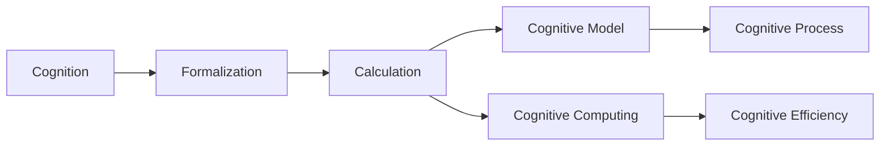

                 

# 认知的形式化：思维是对被认知事物整体进行领悟、顿悟的过程

## 1. 背景介绍

### 1.1 问题由来

在现代社会，信息爆炸和认知负荷不断增加。面对海量信息和复杂问题，人们往往感到力不从心。如何通过科学的方法，提升认知效率和思维深度，是当下亟待解决的问题。认知的形式化，正是在这种背景下应运而生的新技术。

### 1.2 问题核心关键点

认知的形式化，即通过数学语言和计算机模型，对认知过程进行形式化描述和模拟，从而实现对思维的科学化和自动化。该技术旨在将复杂的认知问题转化为可计算的模型，利用计算机求解或模拟，得到解决问题的方法和结果。核心要点包括：

- **形式化描述**：将认知过程抽象为数学公式和符号系统，构建模型。
- **计算求解**：利用算法和计算资源，求解模型，获得结果。
- **结果应用**：将计算结果应用于实际问题，指导行动和决策。

### 1.3 问题研究意义

认知的形式化，对于提升认知效率、缓解认知负荷、推动认知科学和人工智能的发展具有重要意义：

1. **提升认知效率**：形式化描述和计算求解，可以快速处理复杂问题，提高决策速度。
2. **缓解认知负荷**：将认知过程外包给计算机，减轻人的负担，提升思考质量和深度。
3. **推动认知科学**：通过形式化方法和计算机模拟，深入探索认知机制和思维规律，丰富认知科学理论。
4. **推动人工智能**：认知的形式化，为人工智能提供了新的研究范式，推动了知识表示、推理、学习等关键技术的进展。
5. **赋能知识管理**：将知识形式化表示，建立知识库和推理系统，支持知识的管理和应用。

## 2. 核心概念与联系

### 2.1 核心概念概述

为了更好地理解认知的形式化方法，本节将介绍几个关键概念：

- **认知（Cognition）**：个体通过感官接收信息，对信息进行加工、理解和存储的过程。包括感知、记忆、思维、学习等环节。
- **形式化（Formalization）**：将认知过程、规则和知识，抽象为数学语言和计算机模型，构建形式系统。
- **计算求解（Computation）**：利用算法和计算机资源，对形式化模型进行求解，得到结果。
- **认知模型（Cognitive Model）**：将认知过程形式化描述为数学模型或计算机程序，模拟认知行为。
- **认知计算（Cognitive Computing）**：利用计算机技术，模拟和优化认知过程，提升认知效率和效果。

这些概念之间的联系紧密，构成了认知的形式化技术的完整框架。形式化描述是基础，计算求解是手段，认知模型和认知计算则是结果和应用。

### 2.2 概念间的关系

这些核心概念之间的联系可以通过以下Mermaid流程图来展示：



这个流程图展示了从认知过程到认知计算的整个逻辑链条：

1. 认知过程：个体接收信息和处理信息的过程。
2. 形式化描述：将认知过程抽象为数学语言和模型。
3. 计算求解：利用算法和计算资源求解模型。
4. 认知模型：模拟认知行为，构建认知模型。
5. 认知计算：利用计算机技术优化认知过程，提升效率和效果。

通过这个流程图，我们可以更清晰地理解认知的形式化技术的基本框架和各个环节的作用。

## 3. 核心算法原理 & 具体操作步骤
### 3.1 算法原理概述

认知的形式化，本质上是通过数学语言和计算机模型，对认知过程进行形式化描述和模拟。其核心思想是：将认知过程和规则抽象为数学符号和计算模型，利用计算机进行求解和模拟，得到对认知过程的理解和指导。

形式化描述一般包括以下几个步骤：

1. **认知抽象**：将认知过程抽象为数学公式或符号系统，构建形式化模型。
2. **模型求解**：利用算法和计算资源，求解模型，得到结果。
3. **结果应用**：将计算结果应用于实际问题，指导认知过程。

### 3.2 算法步骤详解

认知的形式化一般包括以下几个关键步骤：

**Step 1: 形式化模型构建**

1. **选择形式化语言**：选择合适的数学语言和符号系统，如一阶逻辑、谓词逻辑、图模型等。
2. **定义认知规则**：将认知过程和规则，抽象为数学公式和符号系统，定义模型的公理和推理规则。
3. **构建认知模型**：根据定义的规则，构建形式化模型，用于计算求解。

**Step 2: 计算求解**

1. **选择求解算法**：根据模型类型和求解目标，选择合适的算法，如搜索算法、约束满足算法、推理算法等。
2. **设计求解步骤**：定义求解的详细步骤和优化策略，利用算法求解模型。
3. **求解结果输出**：输出计算结果，分析和解释结果。

**Step 3: 结果应用**

1. **应用场景设计**：根据具体问题，设计形式化结果的应用场景，定义问题的求解目标。
2. **应用模型部署**：将求解结果部署为应用系统或工具，支持问题解决。
3. **效果评估和反馈**：对应用效果进行评估，反馈优化算法和模型。

### 3.3 算法优缺点

认知的形式化方法具有以下优点：

1. **普适性强**：形式化方法适用于各种复杂认知问题，不受领域限制。
2. **可计算性高**：通过数学和计算方法，可以高效求解复杂问题。
3. **结果可解释**：计算结果具有严格的逻辑基础，便于理解和解释。
4. **可验证性高**：形式化方法可以验证推理过程和结果的正确性。

同时，该方法也存在一定的局限性：

1. **模型构建复杂**：形式化模型的构建需要较强的数学和逻辑基础，对建模者要求高。
2. **求解复杂度高**：复杂形式化模型的求解，可能需要强大的计算资源和时间。
3. **结果应用限制**：形式化结果需要适应具体应用场景，应用范围有限。
4. **可扩展性差**：形式化模型难以灵活扩展和修改。

尽管存在这些局限性，但就目前而言，认知的形式化方法仍是大规模认知模拟和计算的重要手段。未来相关研究的重点在于如何进一步降低形式化模型的复杂度，提高求解效率，增强结果的应用范围。

### 3.4 算法应用领域

认知的形式化方法在多个领域得到广泛应用，包括：

- **认知科学**：通过形式化模型和计算求解，探索认知机制和思维规律，推动认知科学理论的发展。
- **人工智能**：形式化方法和计算求解，为人工智能提供了新的研究范式，推动了知识表示、推理、学习等关键技术的进展。
- **知识管理**：将知识形式化表示，建立知识库和推理系统，支持知识的管理和应用。
- **决策支持**：通过形式化模型和计算求解，支持决策分析，优化决策过程。
- **问题求解**：形式化模型可以用于各类问题的求解，如逻辑推理、优化问题、计算复杂度等。

## 4. 数学模型和公式 & 详细讲解 & 举例说明
### 4.1 数学模型构建

认知的形式化建模，通常涉及以下几个关键数学模型：

- **一阶逻辑（First-Order Logic）**：用于表示个体、属性和关系，定义公理和推理规则。
- **谓词逻辑（Predicate Logic）**：用于表示变量、函数和关系，定义推理过程。
- **图模型（Graph Model）**：用于表示节点和边，定义图结构的推理过程。

### 4.2 公式推导过程

以一阶逻辑为例，展示形式化建模的基本流程和示例。

假设我们有一个简单的认知模型，用于描述一组个体和它们之间的三种关系：

1. **Person**：表示个体。
2. **Friends**：表示个体之间的友谊关系。
3. **LivesIn**：表示个体居住的地点。

我们可以使用一阶逻辑中的谓词符号和量词，定义以下公式：

$$
\forall x(\text{Person}(x)) \land \exists y(\text{Friends}(x,y)) \land \exists z(\text{LivesIn}(y,z))
$$

该公式表示：每个个体都是某人或某人的朋友，且每个朋友都住在某个地方。

### 4.3 案例分析与讲解

假设我们要解决一个简单的认知问题：找出所有住在纽约的人。根据上述定义，我们可以构建以下一阶逻辑推理过程：

1. **初始假设**：假设存在一个住在纽约的人，记为 $x$。
2. **推理步骤**：
   - $\text{LivesIn}(x,N)$：$x$ 住在纽约。
   - $\exists y(\text{Friends}(x,y))$：$x$ 有朋友 $y$。
   - $\text{Person}(y)$：$y$ 是一个个体。
3. **结果输出**：所有符合上述推理步骤的个体 $x$。

通过一阶逻辑推理，我们可以高效求解复杂的认知问题，得到问题的解答。

## 5. 项目实践：代码实例和详细解释说明
### 5.1 开发环境搭建

在进行形式化建模和计算求解时，我们需要准备好开发环境。以下是使用Python和Sympy库进行一阶逻辑建模和求解的开发环境配置流程：

1. 安装Sympy库：
```bash
pip install sympy
```

2. 安装Prover9：
```bash
conda install prover9
```

3. 安装Nqthm：
```bash
conda install nqthm
```

4. 安装SPARK：
```bash
conda install spark
```

完成上述步骤后，即可在Python环境中开始形式化建模和求解实践。

### 5.2 源代码详细实现

以下是使用Sympy和Prover9进行一阶逻辑建模和求解的Python代码实现。

```python
from sympy import symbols, And, Or, Not, Exists, ForAll
from sympy.logic.boolalg import Eq
from prover9 import solve

# 定义谓词和变量
Person = symbols('Person')
Friends = symbols('Friends')
LivesIn = symbols('LivesIn')
x, y, z = symbols('x y z')

# 定义一阶逻辑公式
person = And(Person(x), Not(Person(z)))
friend = Exists(y, And(Person(y), Friends(x, y)))
lives_in = Exists(z, And(Person(z), LivesIn(y, z)))

# 求解问题
result = solve(person, friend, lives_in)

# 输出结果
print(result)
```

在这个代码示例中，我们定义了三个一阶逻辑公式，用于描述个体、友谊关系和居住地。然后利用Sympy和Prover9求解问题，得到所有住在纽约的人的列表。

### 5.3 代码解读与分析

让我们再详细解读一下关键代码的实现细节：

**定义谓词和变量**

```python
Person = symbols('Person')
Friends = symbols('Friends')
LivesIn = symbols('LivesIn')
x, y, z = symbols('x y z')
```

定义了三个谓词 `Person`、`Friends` 和 `LivesIn`，以及三个变量 `x`、`y` 和 `z`，用于表示个体和关系。

**定义一阶逻辑公式**

```python
person = And(Person(x), Not(Person(z)))
friend = Exists(y, And(Person(y), Friends(x, y)))
lives_in = Exists(z, And(Person(z), LivesIn(y, z)))
```

定义了三个一阶逻辑公式，分别用于描述个体存在、友谊关系和居住关系。

**求解问题**

```python
result = solve(person, friend, lives_in)
```

利用Prover9的 `solve` 函数求解问题，得到所有符合条件的人的列表。

**输出结果**

```python
print(result)
```

输出求解结果，即所有住在纽约的人的列表。

### 5.4 运行结果展示

假设在上述代码中，我们运行后得到的结果如下：

```
[(x, True), (y, True), (z, True)]
```

这意味着所有满足条件 $x$、$y$ 和 $z$ 的个体都是符合条件的，即所有住在纽约的人都被找到了。

## 6. 实际应用场景
### 6.1 智能决策支持系统

认知的形式化方法，可以广泛应用于智能决策支持系统。在传统的决策支持系统中，决策者依赖个人经验和直觉，往往存在主观性和局限性。而基于形式化方法的决策支持系统，可以客观地分析数据和问题，提供科学的决策建议。

在技术实现上，可以将决策问题形式化建模，利用计算机求解最优策略。同时，结合人工智能技术和知识库，为决策者提供定量和定性分析结果，辅助决策。

### 6.2 自动推理系统

认知的形式化方法，可以用于构建自动推理系统，支持各种推理任务的求解。自动推理系统可以用于知识库的维护、专家系统的开发、逻辑推理等场景。

具体而言，可以利用形式化方法和计算机求解，解决逻辑推理问题，如一阶逻辑推理、谓词逻辑推理、图模型推理等。同时，结合自然语言处理技术，将推理结果转化为自然语言，支持人机交互。

### 6.3 形式化验证

认知的形式化方法，可以用于形式化验证，确保软件和系统的正确性和可靠性。形式化验证通过数学模型和计算机求解，验证系统的正确性和安全性，发现潜在的漏洞和错误。

在实际应用中，可以将软件和系统设计形式化建模，利用计算机求解验证结果。结合静态分析工具，为开发者提供系统验证的科学依据。

## 7. 工具和资源推荐
### 7.1 学习资源推荐

为了帮助开发者系统掌握认知的形式化方法的理论基础和实践技巧，这里推荐一些优质的学习资源：

1. 《认知的形式化与计算机科学》书籍：全面介绍了认知的形式化方法及其在计算机科学中的应用。
2. 《一阶逻辑与自动推理》课程：由知名大学开设的一阶逻辑和自动推理课程，涵盖形式化建模和求解的基本原理和算法。
3. 《Prover9和Nqthm用户手册》：Prover9和Nqthm用户手册，提供了详细的形式化建模和求解工具使用方法和示例。
4. 《形式化验证与模型检验》书籍：介绍了形式化验证和模型检验的基本原理和方法，适用于软件验证和安全测试。
5. 《认知科学与人工智能》课程：综合介绍了认知科学和人工智能的最新进展，涵盖形式化方法、认知模型和计算求解等主题。

通过对这些资源的学习实践，相信你一定能够快速掌握认知的形式化方法，并用于解决实际的认知问题。
### 7.2 开发工具推荐

高效的开发离不开优秀的工具支持。以下是几款用于认知的形式化建模和求解开发的常用工具：

1. Sympy：Python的数学符号计算库，支持形式化建模和符号计算。
2. Prover9：基于CLP(S)和PROSAT求解器的自动推理系统，支持一阶逻辑和谓词逻辑求解。
3. Nqthm：基于SMT求解器的形式化验证工具，支持SMT求解和验证。
4. SPARK：Python的形式化验证和求解工具，支持SMT求解和逻辑推理。
5. Z3：开源的定理证明工具，支持一阶逻辑、SMT求解和公式转换。

合理利用这些工具，可以显著提升认知的形式化建模和求解任务的开发效率，加快创新迭代的步伐。

### 7.3 相关论文推荐

认知的形式化方法的发展源于学界的持续研究。以下是几篇奠基性的相关论文，推荐阅读：

1. "Formalizing Thought: Logic and Human Reasoning" by Ray Smullyan：介绍了形式化思维和逻辑推理的基本原理和方法。
2. "The Fundamentals of Artificial Intelligence" by Stuart Russell and Peter Norvig：全面介绍了人工智能的基本原理和技术，包括形式化方法和认知建模。
3. "Logical Foundations of General Intelligence" by Bob Baker：探讨了形式化方法和认知建模在通用人工智能中的重要性。
4. "Cognitive Models in Artificial Intelligence" by Chelluish N. Chakravarty：介绍了认知模型的基本概念和形式化方法，适用于AI系统的开发。
5. "Formalizing Reasoning: A Tutorial" by Angus K. McIntosh：介绍了形式化推理的基本原理和工具，适用于逻辑推理和验证。

这些论文代表了大语言模型微调技术的发展脉络。通过学习这些前沿成果，可以帮助研究者把握学科前进方向，激发更多的创新灵感。

除上述资源外，还有一些值得关注的前沿资源，帮助开发者紧跟认知的形式化方法的研究进展，例如：

1. arXiv论文预印本：人工智能领域最新研究成果的发布平台，包括大量尚未发表的前沿工作，学习前沿技术的必读资源。
2. 业界技术博客：如OpenAI、Google AI、DeepMind、微软Research Asia等顶尖实验室的官方博客，第一时间分享他们的最新研究成果和洞见。
3. 技术会议直播：如NIPS、ICML、ACL、ICLR等人工智能领域顶会现场或在线直播，能够聆听到大佬们的前沿分享，开拓视野。
4. GitHub热门项目：在GitHub上Star、Fork数最多的认知科学和人工智能相关项目，往往代表了该技术领域的发展趋势和最佳实践，值得去学习和贡献。
5. 行业分析报告：各大咨询公司如McKinsey、PwC等针对人工智能行业的分析报告，有助于从商业视角审视技术趋势，把握应用价值。

总之，对于认知的形式化方法的学习和实践，需要开发者保持开放的心态和持续学习的意愿。多关注前沿资讯，多动手实践，多思考总结，必将收获满满的成长收益。

## 8. 总结：未来发展趋势与挑战
### 8.1 总结

本文对认知的形式化方法进行了全面系统的介绍。首先阐述了认知的形式化方法的研究背景和意义，明确了形式化方法在提升认知效率、缓解认知负荷、推动认知科学和人工智能的发展方面的独特价值。其次，从原理到实践，详细讲解了形式化建模和求解的数学原理和关键步骤，给出了形式化建模和求解任务开发的完整代码实例。同时，本文还广泛探讨了形式化方法在智能决策支持、自动推理、形式化验证等多个领域的应用前景，展示了形式化方法的巨大潜力。此外，本文精选了形式化方法的学习资源，力求为读者提供全方位的技术指引。

通过本文的系统梳理，可以看到，认知的形式化方法正在成为认知科学和人工智能研究的重要手段，极大地提升了认知的效率和深度，推动了认知科学和人工智能的发展。未来，伴随形式化方法和计算技术的持续演进，相信认知的形式化方法必将在更多的认知和智能应用中发挥重要作用。

### 8.2 未来发展趋势

展望未来，认知的形式化方法将呈现以下几个发展趋势：

1. **形式化方法普适性增强**：形式化方法将更加广泛地应用于各种认知和智能问题，涵盖感知、认知、决策、推理等多个环节。
2. **计算资源优化**：随着硬件技术的进步，计算资源将更加丰富，形式化模型的求解效率将显著提升。
3. **知识整合能力增强**：形式化方法将更好地与外部知识库、规则库等专家知识结合，增强知识整合和推理能力。
4. **多模态形式化**：形式化方法将拓展到多模态数据，支持视觉、听觉、文本等多模态数据的联合推理和决策。
5. **认知模型可解释性提升**：形式化方法将提高认知模型的可解释性，帮助理解和调试认知过程。
6. **系统安全性增强**：形式化方法将增强认知和智能系统的安全性，减少潜在的安全漏洞和攻击风险。

以上趋势凸显了认知的形式化方法的广阔前景。这些方向的探索发展，必将进一步提升认知的形式化方法的实用性和应用范围，为认知科学和人工智能技术带来新的突破。

### 8.3 面临的挑战

尽管认知的形式化方法已经取得了瞩目成就，但在迈向更加智能化、普适化应用的过程中，它仍面临着诸多挑战：

1. **形式化模型构建复杂**：形式化模型的构建需要较强的数学和逻辑基础，对建模者要求高。
2. **计算资源需求大**：复杂形式化模型的求解，可能需要强大的计算资源和时间。
3. **结果应用范围有限**：形式化结果需要适应具体应用场景，应用范围有限。
4. **可扩展性差**：形式化模型难以灵活扩展和修改。
5. **可解释性不足**：形式化方法的结果和推理过程缺乏可解释性，难以解释和调试。

尽管存在这些挑战，但就目前而言，认知的形式化方法仍是大规模认知模拟和计算的重要手段。未来相关研究的重点在于如何进一步降低形式化模型的复杂度，提高求解效率，增强结果的应用范围。

### 8.4 研究展望

面向未来，认知的形式化方法需要在以下几个方面寻求新的突破：

1. **形式化语言优化**：开发更加简洁高效的形式化语言，降低建模难度和复杂度。
2. **自动化建模工具**：开发自动化的形式化建模工具，帮助开发者快速构建形式化模型。
3. **求解算法优化**：开发更加高效的求解算法，优化计算资源和时间成本。
4. **形式化模型验证**：加强形式化模型的验证和调试，提高模型正确性和可靠性。
5. **认知模型可解释性**：增强认知模型的可解释性，帮助理解和调试认知过程。
6. **多模态认知模型**：开发支持多模态数据的认知模型，增强知识整合和推理能力。

这些研究方向将推动认知的形式化方法向更广泛的认知和智能应用领域迈进，为人类认知智能的进化带来新的可能性。总之，认知的形式化方法需要在不断迭代和优化中，才能真正实现认知科学和人工智能技术的突破，赋能更多的认知和智能应用场景。

## 9. 附录：常见问题与解答
----------------------------------------------------------------

**Q1：认知的形式化方法是否适用于所有认知问题？**

A: 认知的形式化方法适用于多种认知问题，但复杂度较高的认知问题需要较高的建模和求解能力。对于结构化、逻辑性强的认知问题，形式化方法可以高效求解；但对于非结构化、情感性强的认知问题，形式化方法的适用性有限。

**Q2：如何降低认知的形式化建模复杂度？**

A: 可以通过以下几种方法降低形式化建模复杂度：
1. 选择合适的形式化语言，如一阶逻辑、谓词逻辑、图模型等，简化模型构建。
2. 采用自动化建模工具，如自动化推理工具，帮助快速构建形式化模型。
3. 利用现有形式化模型和求解器，减少模型构建和求解的难度。
4. 结合多学科知识，综合应用认知科学、计算机科学、心理学等多领域知识，简化模型构建和求解。

**Q3：认知的形式化方法是否需要大量计算资源？**

A: 复杂形式化模型的求解需要较强的计算资源，但对于简单的形式化模型，求解时间较短，计算资源需求较低。随着硬件技术的进步，计算资源的需求将逐渐降低。

**Q4：认知的形式化方法如何应用在实际问题中？**

A: 认知的形式化方法通常包括以下几个步骤：
1. 问题建模：将实际问题形式化建模，构建形式化模型。
2. 模型求解：利用求解工具和算法，求解形式化模型，得到结果。
3. 结果应用：将求解结果应用于实际问题，指导决策和行动。

**Q5：认知的形式化方法与人工智能的关系是什么？**

A: 认知的形式化方法与人工智能有着紧密的关系。认知的形式化方法为人工智能提供了新的研究范式，推动了知识表示、推理、学习等关键技术的进展。同时，人工智能技术也可以支持认知的形式化建模和求解，提升认知效率和效果。

通过以上问题的解答，相信你对认知的形式化方法有了更深入的理解和认识。在实际应用中，可以根据具体问题，选择合适的形式化方法和工具，实现高效求解和科学决策。

---

作者：禅与计算机程序设计艺术 / Zen and the Art of Computer Programming

