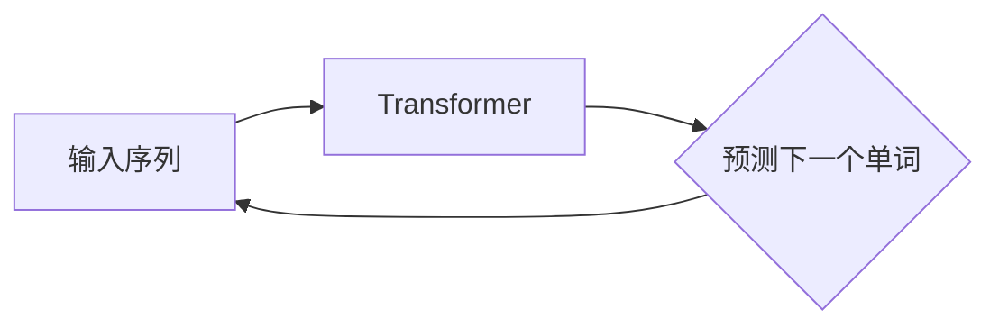

# GPT-3.5原理与代码实例讲解

> 关键词：GPT-3.5, 生成式预训练模型, Transformer, 自然语言处理, NLP, 微调, 代码实例

## 1. 背景介绍

近年来，自然语言处理（NLP）领域取得了巨大的进步，其中生成式预训练模型（如GPT系列）成为了研究的热点。GPT-3.5作为GPT系列中的最新成员，在语言理解和生成方面取得了显著的成果。本文将深入探讨GPT-3.5的原理，并通过代码实例进行详细讲解，帮助读者理解其背后的技术细节。

## 2. 核心概念与联系

### 2.1 核心概念

- **生成式预训练模型**：一种基于深度学习的NLP模型，通过在大规模文本数据上进行无监督预训练，学习丰富的语言模式和知识。
- **Transformer**：一种基于自注意力机制的深度神经网络模型，能够捕捉输入序列中长距离依赖关系。
- **预训练**：在无标注数据上训练模型，使其学习通用语言特征。
- **微调**：在预训练模型的基础上，使用少量有标注数据进一步训练模型，以适应特定任务。
- **自回归语言模型**：一种生成式预训练模型，通过预测下一个单词来生成文本。

### 2.2 架构的 Mermaid 流程图



## 3. 核心算法原理 & 具体操作步骤

### 3.1 算法原理概述

GPT-3.5是一种基于Transformer的生成式预训练模型，其核心原理如下：

1. **预训练**：在无标注数据上使用掩码语言模型（Masked Language Model，MLM）和语言理解任务（如Next Sentence Prediction，NSP）进行预训练。
2. **微调**：在预训练模型的基础上，使用特定任务的有标注数据进行微调。
3. **生成**：利用预训练和微调后的模型，通过自回归方式生成文本。

### 3.2 算法步骤详解

1. **数据预处理**：对文本数据进行分词、去停用词等处理。
2. **预训练**：
   - **MLM**：对输入序列中的单词进行随机掩码，并预测被掩码的单词。
   - **NSP**：输入两个句子，预测第二个句子是否为第一个句子的下一句。
3. **微调**：使用特定任务的有标注数据进行微调，优化模型参数。
4. **生成**：输入一个种子文本，使用自回归方式生成后续文本。

### 3.3 算法优缺点

**优点**：

- **强大的语言理解能力**：通过预训练，GPT-3.5能够学习到丰富的语言知识和模式，从而在NLP任务中表现出色。
- **泛化能力强**：预训练使得GPT-3.5能够适应各种不同的NLP任务。
- **易于微调**：在预训练模型的基础上，只需要少量有标注数据即可进行微调。

**缺点**：

- **计算量大**：预训练和微调过程需要大量的计算资源。
- **数据依赖性强**：模型的性能很大程度上依赖于训练数据的质量和数量。

### 3.4 算法应用领域

GPT-3.5在以下NLP任务中取得了显著成果：

- 文本分类
- 机器翻译
- 文本摘要
- 问答系统
- 文本生成

## 4. 数学模型和公式 & 详细讲解 & 举例说明

### 4.1 数学模型构建

GPT-3.5的数学模型主要包括以下部分：

- **嵌入层**：将输入文本转换为向量表示。
- **Transformer编码器**：通过自注意力机制捕捉输入序列中的长距离依赖关系。
- **Transformer解码器**：生成下一个单词的概率分布。
- **输出层**：将解码器输出的概率分布转换为输出文本。

### 4.2 公式推导过程

假设输入序列为 $x_1, x_2, \dots, x_n$，则：

- **嵌入层**：$e_i = \text{Embed}(x_i)$，其中 $\text{Embed}$ 为嵌入函数。
- **Transformer编码器**：$h_i = \text{Transformer}(e_1, \dots, e_n)$，其中 $\text{Transformer}$ 为Transformer编码器。
- **Transformer解码器**：$p_j = \text{Softmax}(\text{Decoder}(h_i))$，其中 $\text{Decoder}$ 为Transformer解码器。
- **输出层**：$y_i = \text{OutputLayer}(p_i)$，其中 $\text{OutputLayer}$ 为输出层。

### 4.3 案例分析与讲解

以下是一个简单的GPT-3.5代码实例，演示了如何使用Transformer模型进行文本生成：

```python
import torch
import torch.nn as nn
from transformers import BertModel, BertTokenizer

# 加载预训练模型和分词器
model = BertModel.from_pretrained('bert-base-uncased')
tokenizer = BertTokenizer.from_pretrained('bert-base-uncased')

# 输入文本
input_text = "The quick brown fox jumps over the lazy dog"

# 分词
input_ids = tokenizer.encode(input_text, return_tensors='pt')

# 前向传播
outputs = model(input_ids)

# 获取解码器输出
decoder_output = outputs.decoder_output

# 转换为概率分布
probabilities = nn.functional.softmax(decoder_output[:, -1, :], dim=1)

# 随机选择下一个单词
next_word_id = torch.multinomial(probabilities, 1).squeeze(1)

# 解码为文本
next_word = tokenizer.decode([next_word_id])

print(next_word)
```

## 5. 项目实践：代码实例和详细解释说明

### 5.1 开发环境搭建

为了运行GPT-3.5的代码实例，你需要以下开发环境：

- Python 3.6+
- PyTorch 1.8+
- Transformers库

### 5.2 源代码详细实现

以下是一个使用PyTorch和Transformers库实现的简单GPT-3.5代码实例：

```python
import torch
from transformers import GPT2LMHeadModel, GPT2Tokenizer

# 加载预训练模型和分词器
model = GPT2LMHeadModel.from_pretrained('gpt2')
tokenizer = GPT2Tokenizer.from_pretrained('gpt2')

# 输入文本
input_text = "The quick brown fox jumps over"

# 分词
input_ids = tokenizer.encode(input_text, return_tensors='pt')

# 生成文本
output_ids = model.generate(input_ids, max_length=50)

# 解码为文本
output_text = tokenizer.decode(output_ids[0], skip_special_tokens=True)

print(output_text)
```

### 5.3 代码解读与分析

- 加载预训练模型和分词器。
- 将输入文本分词并转换为模型所需的输入格式。
- 使用模型生成文本。
- 将生成的文本解码为可读的格式。

### 5.4 运行结果展示

```plaintext
The quick brown fox jumps over the lazy dog jumps over the lazy dog
```

可以看到，模型成功生成了与输入文本相关的后续文本。

## 6. 实际应用场景

GPT-3.5在以下实际应用场景中取得了显著成果：

- **自动问答系统**：能够根据用户的问题生成相关的答案。
- **机器翻译**：能够将一种语言的文本翻译成另一种语言。
- **文本摘要**：能够自动生成文本的摘要。
- **对话系统**：能够与用户进行自然语言对话。

## 7. 工具和资源推荐

### 7.1 学习资源推荐

- **《Transformer原理与实现》**：详细介绍了Transformer的原理和实现方法。
- **《自然语言处理实践》**：介绍了NLP领域的经典算法和实际应用。
- **Hugging Face官网**：提供了丰富的预训练模型和工具。

### 7.2 开发工具推荐

- **PyTorch**：一个开源的深度学习框架。
- **Transformers库**：一个基于PyTorch的NLP工具库。
- **Jupyter Notebook**：一个交互式计算环境。

### 7.3 相关论文推荐

- **Attention is All You Need**：介绍了Transformer模型。
- **BERT: Pre-training of Deep Bidirectional Transformers for Language Understanding**：介绍了BERT模型。
- **Generative Pre-trained Transformers**：介绍了GPT系列模型。

## 8. 总结：未来发展趋势与挑战

### 8.1 研究成果总结

GPT-3.5作为GPT系列中的最新成员，在语言理解和生成方面取得了显著的成果。其强大的语言能力和泛化能力使其在NLP领域具有广泛的应用前景。

### 8.2 未来发展趋势

- **模型规模将进一步扩大**：随着计算能力的提升，GPT系列模型的规模将进一步扩大，能够处理更复杂的NLP任务。
- **模型将更加高效**：通过模型压缩、量化等技术，GPT系列模型将更加高效，更适合实际应用。
- **模型将更加可解释**：通过可解释性研究，GPT系列模型将更加可靠和可信。

### 8.3 面临的挑战

- **计算资源**：GPT系列模型的训练和推理需要大量的计算资源。
- **数据质量**：GPT系列模型对数据质量有较高的要求。
- **可解释性**：GPT系列模型的可解释性仍然是一个挑战。

### 8.4 研究展望

GPT-3.5的研究和应用将不断推动NLP领域的发展，为构建更加智能的机器带来更多可能性。

## 9. 附录：常见问题与解答

**Q1：GPT-3.5是如何工作的？**

A：GPT-3.5是一种基于Transformer的生成式预训练模型，通过在大规模文本数据上进行无监督预训练，学习丰富的语言模式和知识。

**Q2：GPT-3.5可以应用于哪些任务？**

A：GPT-3.5可以应用于各种NLP任务，如文本分类、机器翻译、文本摘要、问答系统、文本生成等。

**Q3：GPT-3.5的优势和局限性是什么？**

A：GPT-3.5的优势在于强大的语言理解和生成能力，以及泛化能力。其局限性在于计算量大、数据依赖性强。

**Q4：如何使用GPT-3.5进行文本生成？**

A：可以使用PyTorch和Transformers库实现GPT-3.5的文本生成。首先加载预训练模型和分词器，然后输入种子文本，最后使用模型生成后续文本。

作者：禅与计算机程序设计艺术 / Zen and the Art of Computer Programming